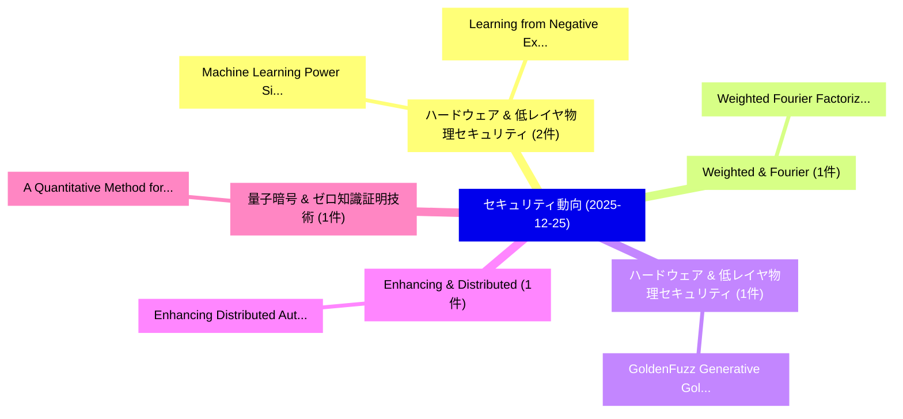

# 📅 02_daily: 日次エグゼクティブサマリー報告書 (2025-12-25)

**集計日時**: 2026-10-02 23:05:52 UTC  
**対象日付**: 2025-12-25  
**本日収集論文数**: 12 件  

---

## 💡 主要セキュリティ動向・脅威インサイト (Executive Insights)

本日の収集論文（計 12 件）において、以下の重点セキュリティ領域で活発な研究動向が確認されました：
- **ハードウェア & 低レイヤ物理セキュリティ** (2 件): 注目論文として 「Machine Learning Power Side-Ch...」、「Learning from Negative Example...」 等が発表され、実務防御および攻撃検証の進展が見られます。
- **Weighted & Fourier** (1 件): 注目論文として 「Weighted Fourier Factorization...」 等が発表され、実務防御および攻撃検証の進展が見られます。
- **ハードウェア & 低レイヤ物理セキュリティ** (1 件): 注目論文として 「GoldenFuzz: Generative Golden ...」 等が発表され、実務防御および攻撃検証の進展が見られます。
- **Enhancing & Distributed** (1 件): 注目論文として 「Enhancing Distributed Authoriz...」 等が発表され、実務防御および攻撃検証の進展が見られます。
- **量子暗号 & ゼロ知識証明技術** (1 件): 注目論文として 「A Quantitative Method for Eval...」 等が発表され、実務防御および攻撃検証の進展が見られます。

### 🗺️ 技術・脅威トピックマインドマップ

---

## 📌 日次セキュリティ論文一覧 (日本語表形式)

| No | arXiv ID | 論文タイトル (日本語訳) | 重要キーワード | 構造化エグゼクティブ要約 (背景・提案・影響) | 脅威分類 | 詳細リンク |
|---|---|---|---|---|---|---|
| 1 | `2512.21499v1` | [Weighted Fourier Factorizations: Optimal Gaussian Noise for Differentially Private Marginal and Product Queries（セキュリティ分析論文）](../../okf/papers/2025-12-25/2512.21499.md) | `Weighted Fourier Factorizations`, `Optimal Gaussian Noise`, `Differentially Private Marginal` | 【提案】概要 (Overview & Key Finding) 本論文「Weighted Fourier Factorizations: Optimal Gaussian Noise...。実証評価により経営層・セキュリティ管理者向け推奨アクション (E... | `cs.DB` | [arXiv](https://arxiv.org/abs/2512.21499v1) &#124; [OKF](../../okf/papers/2025-12-25/2512.21499.md) |
| 2 | `2512.21524v1` | [GoldenFuzz: Generative Golden Reference Hardware Fuzzing（セキュリティ分析論文）](../../okf/papers/2025-12-25/2512.21524.md) | `Generative Golden Reference Hardware Fuzzing`, `Lichao Wu`, `Mohamadreza Rostami` | 【提案】概要 (Overview & Key Finding) 本論文「GoldenFuzz: Generative Golden Reference Hardware Fuzzin...。実証評価により経営層・セキュリティ管理者向け推奨アクション (E... | `cybersecurity` | [arXiv](https://arxiv.org/abs/2512.21524v1) &#124; [OKF](../../okf/papers/2025-12-25/2512.21524.md) |
| 3 | `2512.21525v1` | [Enhancing Distributed Authorization With Lagrange Interpolation And Attribute-Based Encryption（セキュリティ分析論文）](../../okf/papers/2025-12-25/2512.21525.md) | `Based Encryption`, `Attribute-Based Encryption`, `Keshav Sinha` | 【提案】概要 (Overview & Key Finding) 本論文「Enhancing Distributed Authorization With Lagrange Inter...。実証評価により経営層・セキュリティ管理者向け推奨アクション (E... | `cybersecurity` | [arXiv](https://arxiv.org/abs/2512.21525v1) &#124; [OKF](../../okf/papers/2025-12-25/2512.21525.md) |
| 4 | `2512.21561v2` | [A Quantitative Method for Evaluating Security Boundaries in Quantum Key Distribution Combined with Block Ciphers（セキュリティ分析論文）](../../okf/papers/2025-12-25/2512.21561.md) | `Quantum Key Distribution Combined`, `Evaluating Security Boundaries`, `Block Ciphers` | 【提案】概要 (Overview & Key Finding) 本論文「A Quantitative Method for Evaluating Security Boundarie...。実証評価により経営層・セキュリティ管理者向け推奨アクション (E... | `cybersecurity` | [arXiv](https://arxiv.org/abs/2512.21561v2) &#124; [OKF](../../okf/papers/2025-12-25/2512.21561.md) |
| 5 | `2512.21574v1` | [When the Base Station Flies: Rethinking Security for UAV-Based 6G Networks（セキュリティ分析論文）](../../okf/papers/2025-12-25/2512.21574.md) | `Base Station Flies`, `Rethinking Security`, `UAV-Based 6G` | 【提案】概要 (Overview & Key Finding) 本論文「When the Base Station Flies: Rethinking Security for UA...。実証評価により経営層・セキュリティ管理者向け推奨アクション (E... | `executive-summary` | [arXiv](https://arxiv.org/abs/2512.21574v1) &#124; [OKF](../../okf/papers/2025-12-25/2512.21574.md) |
| 6 | `2512.21663v1` | [Verifiable Passkey: The Decentralized Authentication Standard（セキュリティ分析論文）](../../okf/papers/2025-12-25/2512.21663.md) | `Verifiable Passkey`, `Sibi Chakkaravarthy Sethuraman`, `Aditya Mitra` | 【提案】概要 (Overview & Key Finding) 本論文「Verifiable Passkey: The Decentralized Authentication St...。実証評価により経営層・セキュリティ管理者向け推奨アクション (E... | `cs.ET` | [arXiv](https://arxiv.org/abs/2512.21663v1) &#124; [OKF](../../okf/papers/2025-12-25/2512.21663.md) |
| 7 | `2512.21681v1` | [Exploring the Security Threats of Retriever Backdoors in Retrieval-Augmented Code Generation（セキュリティ分析論文）](../../okf/papers/2025-12-25/2512.21681.md) | `Augmented Code Generation`, `Security Threats`, `Retriever Backdoors` | 【提案】概要 (Overview & Key Finding) 本論文「Exploring the Security Threats of Retriever Backdoors i...。実証評価により経営層・セキュリティ管理者向け推奨アクション (E... | `executive-summary` | [arXiv](https://arxiv.org/abs/2512.21681v1) &#124; [OKF](../../okf/papers/2025-12-25/2512.21681.md) |
| 8 | `2512.21698v1` | [Raster Domain Text Steganography: A Unified Framework for Multimodal Secure Embedding（セキュリティ分析論文）](../../okf/papers/2025-12-25/2512.21698.md) | `Raster Domain Text Steganography`, `Multimodal Secure Embedding`, `Uday Kiran Kandala` | 【提案】概要 (Overview & Key Finding) 本論文「Raster Domain Text Steganography: A Unified Framework f...。実証評価により経営層・セキュリティ管理者向け推奨アクション (E... | `cs.MM` | [arXiv](https://arxiv.org/abs/2512.21698v1) &#124; [OKF](../../okf/papers/2025-12-25/2512.21698.md) |
| 9 | `2512.21737v1` | [Machine Learning Power Side-Channel Attack on SNOW-V（セキュリティ分析論文）](../../okf/papers/2025-12-25/2512.21737.md) | `Machine Learning Power Side`, `Channel Attack`, `Side-Channel Attack` | 【提案】概要 (Overview & Key Finding) 本論文「Machine Learning Power サイドチャネル攻撃 on SNOW-V（セキュリティ分析論文）」...。実証評価により経営層・セキュリティ管理者向け推奨アクション (E... | `cybersecurity` | [arXiv](https://arxiv.org/abs/2512.21737v1) &#124; [OKF](../../okf/papers/2025-12-25/2512.21737.md) |
| 10 | `2512.21762v1` | [Assessing the Effectiveness of Membership Inference on Generative Music（セキュリティ分析論文）](../../okf/papers/2025-12-25/2512.21762.md) | `Membership Inference`, `Generative Music`, `Kurtis Chow` | 【提案】概要 (Overview & Key Finding) 本論文「Assessing the Effectiveness of Membership Inference on ...。実証評価により経営層・セキュリティ管理者向け推奨アクション (E... | `executive-summary` | [arXiv](https://arxiv.org/abs/2512.21762v1) &#124; [OKF](../../okf/papers/2025-12-25/2512.21762.md) |
| 11 | `2512.22293v1` | [Learning from Negative Examples: Why Warning-Framed Training Data Teaches What It Warns Against（セキュリティ分析論文）](../../okf/papers/2025-12-25/2512.22293.md) | `Negative Examples`, `Warning-Framed Training`, `Ochir Enkhbayar` | 【提案】概要 (Overview & Key Finding) 本論文「Learning from Negative Examples: Why Warning-Framed Tra...。実証評価により経営層・セキュリティ管理者向け推奨アクション (E... | `executive-summary` | [arXiv](https://arxiv.org/abs/2512.22293v1) &#124; [OKF](../../okf/papers/2025-12-25/2512.22293.md) |
| 12 | `2601.19912v1` | [LLM Vulnerability to GPU Soft Errors: An Instruction-Level Fault Injection Studyの分析](../../okf/papers/2025-12-25/2601.19912.md) | `Soft Errors`, `Instruction-Level Fault`, `Level Fault Injection` | 【提案】概要 (Overview & Key Finding) 本論文「LLM 脆弱性 to GPU Soft Errors: An Instruction-Level フォールト注...。実証評価により経営層・セキュリティ管理者向け推奨アクション (E... | `cs.AI` | [arXiv](https://arxiv.org/abs/2601.19912v1) &#124; [OKF](../../okf/papers/2025-12-25/2601.19912.md) |

