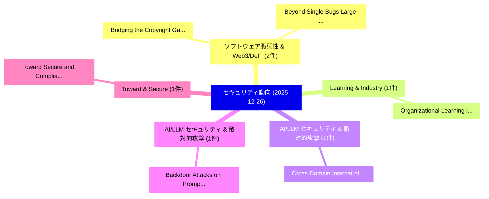

# 📅 02_daily: 日次エグゼクティブサマリー報告書 (2025-12-26)

**集計日時**: 2026-10-02 23:05:52 UTC  
**対象日付**: 2025-12-26  
**本日収集論文数**: 10 件  

---

## 💡 主要セキュリティ動向・脅威インサイト (Executive Insights)

本日の収集論文（計 10 件）において、以下の重点セキュリティ領域で活発な研究動向が確認されました：
- **ソフトウェア脆弱性 & Web3/DeFi** (2 件): 注目論文として 「Bridging the Copyright Gap: Do...」、「Beyond Single Bugs: Large Lang...」 等が発表され、実務防御および攻撃検証の進展が見られます。
- **Learning & Industry** (1 件): 注目論文として 「Organizational Learning in Ind...」 等が発表され、実務防御および攻撃検証の進展が見られます。
- **AI/LLM セキュリティ & 敵対的攻撃** (1 件): 注目論文として 「Cross-Domain Internet of Drone...」 等が発表され、実務防御および攻撃検証の進展が見られます。
- **AI/LLM セキュリティ & 敵対的攻撃** (1 件): 注目論文として 「Backdoor Attacks on Prompt-Dri...」 等が発表され、実務防御および攻撃検証の進展が見られます。
- **Toward & Secure** (1 件): 注目論文として 「Toward Secure and Compliant AI...」 等が発表され、実務防御および攻撃検証の進展が見られます。

### 🗺️ 技術・脅威トピックマインドマップ

---

## 📌 日次セキュリティ論文一覧 (日本語表形式)

| No | arXiv ID | 論文タイトル (日本語訳) | 重要キーワード | 構造化エグゼクティブ要約 (背景・提案・影響) | 脅威分類 | 詳細リンク |
|---|---|---|---|---|---|---|
| 1 | `2512.21813v1` | [Organizational Learning in Industry 4.0: Applying Crossan's 4I Framework with Double Loop Learning（セキュリティ分析論文）](../../okf/papers/2025-12-26/2512.21813.md) | `Double Loop Learning`, `Organizational Learning`, `Applying Crossan` | 【提案】概要 (Overview & Key Finding) 本論文「Organizational Learning in Industry 4.0: Applying Cross...。実証評価により経営層・セキュリティ管理者向け推奨アクション (E... | `cybersecurity` | [arXiv](https://arxiv.org/abs/2512.21813v1) &#124; [OKF](../../okf/papers/2025-12-26/2512.21813.md) |
| 2 | `2512.21827v1` | [Cross-Domain Internet of Drones: An RFF-PUF Allied Authenticated Key Exchange Protocol With Over-the-Air Enrollmentのセキュリティ強化](../../okf/papers/2025-12-26/2512.21827.md) | `Domain Internet`, `Cross-Domain Internet`, `RFF-PUF Allied` | 【提案】概要 (Overview & Key Finding) 本論文「Cross-Domain Internet of Drones: An RFF-PUF Allied Auth...。実証評価により経営層・セキュリティ管理者向け推奨アクション (E... | `cybersecurity` | [arXiv](https://arxiv.org/abs/2512.21827v1) &#124; [OKF](../../okf/papers/2025-12-26/2512.21827.md) |
| 3 | `2512.21871v1` | [Bridging the Copyright Gap: Do Large Vision-Language Models Recognize and Respect Copyrighted Content?（セキュリティ分析論文）](../../okf/papers/2025-12-26/2512.21871.md) | `Language Models Recognize`, `Respect Copyrighted Content`, `Copyright Gap` | 【提案】### (日本語題名: Bridging the Copyright Gap: Do Large Vision-Language Models Recognize and R...。実証評価により経営層・セキュリティ管理者向け推奨アクション (E... | `cs.AI` | [arXiv](https://arxiv.org/abs/2512.21871v1) &#124; [OKF](../../okf/papers/2025-12-26/2512.21871.md) |
| 4 | `2512.22046v2` | [Backdoor Attacks on Prompt-Driven Video Segmentation Foundation Models（セキュリティ分析論文）](../../okf/papers/2025-12-26/2512.22046.md) | `Driven Video Segmentation Foundation Models`, `Backdoor Attacks`, `Prompt-Driven Video` | 【提案】概要 (Overview & Key Finding) 本論文「Backdoor Attacks on Prompt-Driven Video Segmentation Fo...。実証評価により経営層・セキュリティ管理者向け推奨アクション (E... | `cs.CV` | [arXiv](https://arxiv.org/abs/2512.22046v2) &#124; [OKF](../../okf/papers/2025-12-26/2512.22046.md) |
| 5 | `2512.22060v1` | [Toward Secure and Compliant AI: Organizational Standards and Protocols for NLP Model Lifecycle Management（セキュリティ分析論文）](../../okf/papers/2025-12-26/2512.22060.md) | `Model Lifecycle Management`, `Toward Secure`, `Organizational Standards` | 【提案】概要 (Overview & Key Finding) 本論文「Toward Secure and Compliant AI: Organizational Standard...。実証評価により経営層・セキュリティ管理者向け推奨アクション (E... | `executive-summary` | [arXiv](https://arxiv.org/abs/2512.22060v1) &#124; [OKF](../../okf/papers/2025-12-26/2512.22060.md) |
| 6 | `2512.22076v1` | [ReSMT: An SMT-Based Tool for Reverse Engineering（セキュリティ分析論文）](../../okf/papers/2025-12-26/2512.22076.md) | `Based Tool`, `Reverse Engineering`, `SMT-Based Tool` | 【提案】概要 (Overview & Key Finding) 本論文「ReSMT: An SMT-Based Tool for Reverse Engineering（セキュリティ...。実証評価により経営層・セキュリティ管理者向け推奨アクション (E... | `cybersecurity` | [arXiv](https://arxiv.org/abs/2512.22076v1) &#124; [OKF](../../okf/papers/2025-12-26/2512.22076.md) |
| 7 | `2512.22090v1` | [Abstraction of Trusted Execution Environments as the Missing Layer for Broad Confidential Computing Adoption: A Systematization of Knowledge（セキュリティ分析論文）](../../okf/papers/2025-12-26/2512.22090.md) | `Broad Confidential Computing Adoption`, `Trusted Execution Environments`, `Missing Layer` | 【提案】概要 (Overview & Key Finding) 本論文「Abstraction of Trusted Execution Environments as the Mi...。実証評価により経営層・セキュリティ管理者向け推奨アクション (E... | `cybersecurity` | [arXiv](https://arxiv.org/abs/2512.22090v1) &#124; [OKF](../../okf/papers/2025-12-26/2512.22090.md) |
| 8 | `2512.22301v1` | [A Statistical Side-Channel Risk Model for Timing Variability in Lattice-Based Post-Quantum Cryptography（セキュリティ分析論文）](../../okf/papers/2025-12-26/2512.22301.md) | `Channel Risk Model`, `Statistical Side`, `Timing Variability` | 【提案】概要 (Overview & Key Finding) 本論文「A Statistical サイドチャネル攻撃 Risk Model for Timing Variabili...。実証評価により経営層・セキュリティ管理者向け推奨アクション (E... | `cybersecurity` | [arXiv](https://arxiv.org/abs/2512.22301v1) &#124; [OKF](../../okf/papers/2025-12-26/2512.22301.md) |
| 9 | `2512.22306v1` | [Beyond Single Bugs: Large Language Models for Multi-Vulnerability Detectionのベンチマーク評価](../../okf/papers/2025-12-26/2512.22306.md) | `Beyond Single Bugs`, `Benchmarking Large Language Models`, `Large Language Models` | 【提案】概要 (Overview & Key Finding) 本論文「Beyond Single Bugs: Large Language Models for Multi-脆弱性...。実証評価により経営層・セキュリティ管理者向け推奨アクション (E... | `cs.AI` | [arXiv](https://arxiv.org/abs/2512.22306v1) &#124; [OKF](../../okf/papers/2025-12-26/2512.22306.md) |
| 10 | `2512.22307v1` | [LLA: Enhancing Security and Privacy for Generative Models with Logic-Locked Accelerators（セキュリティ分析論文）](../../okf/papers/2025-12-26/2512.22307.md) | `Enhancing Security`, `Generative Models`, `Locked Accelerators` | 【提案】概要 (Overview & Key Finding) 本論文「LLA: Enhancing Security and Privacy for Generative Mode...。実証評価により経営層・セキュリティ管理者向け推奨アクション (E... | `cs.AI` | [arXiv](https://arxiv.org/abs/2512.22307v1) &#124; [OKF](../../okf/papers/2025-12-26/2512.22307.md) |

