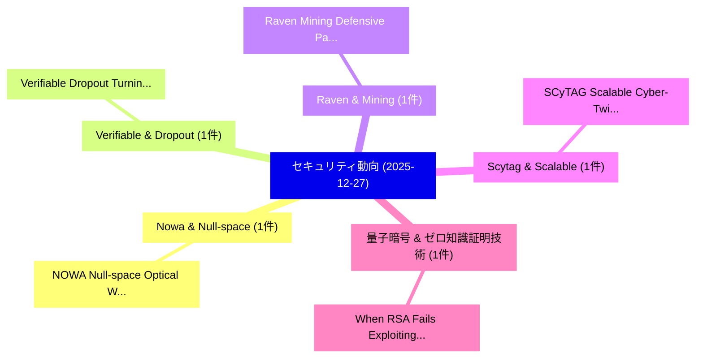

# 📅 02_daily: 日次エグゼクティブサマリー報告書 (2025-12-27)

**集計日時**: 2026-10-02 23:05:52 UTC  
**対象日付**: 2025-12-27  
**本日収集論文数**: 5 件  

---

## 💡 主要セキュリティ動向・脅威インサイト (Executive Insights)

本日の収集論文（計 5 件）において、以下の重点セキュリティ領域で活発な研究動向が確認されました：
- **Nowa & Null-space** (1 件): 注目論文として 「NOWA: Null-space Optical Water...」 等が発表され、実務防御および攻撃検証の進展が見られます。
- **Verifiable & Dropout** (1 件): 注目論文として 「Verifiable Dropout: Turning Ra...」 等が発表され、実務防御および攻撃検証の進展が見られます。
- **Raven & Mining** (1 件): 注目論文として 「Raven: Mining Defensive Patter...」 等が発表され、実務防御および攻撃検証の進展が見られます。
- **Scytag & Scalable** (1 件): 注目論文として 「SCyTAG: Scalable Cyber-Twin fo...」 等が発表され、実務防御および攻撃検証の進展が見られます。
- **量子暗号 & ゼロ知識証明技術** (1 件): 注目論文として 「When RSA Fails: Exploiting Pri...」 等が発表され、実務防御および攻撃検証の進展が見られます。

### 🗺️ 技術・脅威トピックマインドマップ

---

## 📌 日次セキュリティ論文一覧 (日本語表形式)

| No | arXiv ID | 論文タイトル (日本語訳) | 重要キーワード | 構造化エグゼクティブ要約 (背景・提案・影響) | 脅威分類 | 詳細リンク |
|---|---|---|---|---|---|---|
| 1 | `2512.22501v3` | [NOWA: Null-space Optical Watermark for Invisible Capture Fingerprinting and Tamper Localization（セキュリティ分析論文）](../../okf/papers/2025-12-27/2512.22501.md) | `Invisible Capture Fingerprinting`, `Optical Watermark`, `Tamper Localization` | 【提案】概要 (Overview & Key Finding) 本論文「NOWA: Null-space Optical Watermark for Invisible Captur...。実証評価により経営層・セキュリティ管理者向け推奨アクション (E... | `executive-summary` | [arXiv](https://arxiv.org/abs/2512.22501v3) &#124; [OKF](../../okf/papers/2025-12-27/2512.22501.md) |
| 2 | `2512.22526v1` | [Verifiable Dropout: Turning Randomness into a Verifiable Claim（セキュリティ分析論文）](../../okf/papers/2025-12-27/2512.22526.md) | `Verifiable Dropout`, `Turning Randomness`, `Verifiable Claim` | 【提案】概要 (Overview & Key Finding) 本論文「Verifiable Dropout: Turning Randomness into a Verifiabl...。実証評価により経営層・セキュリティ管理者向け推奨アクション (E... | `cybersecurity` | [arXiv](https://arxiv.org/abs/2512.22526v1) &#124; [OKF](../../okf/papers/2025-12-27/2512.22526.md) |
| 3 | `2512.22616v1` | [Raven: Mining Defensive Patterns in Ethereum via Semantic Transaction Revert Invariants Categories（セキュリティ分析論文）](../../okf/papers/2025-12-27/2512.22616.md) | `Semantic Transaction Revert Invariants Categories`, `Mining Defensive Patterns`, `Mojtaba Eshghie` | 【提案】概要 (Overview & Key Finding) 本論文「Raven: Mining Defensive Patterns in Ethereum via Semant...。実証評価により経営層・セキュリティ管理者向け推奨アクション (E... | `cybersecurity` | [arXiv](https://arxiv.org/abs/2512.22616v1) &#124; [OKF](../../okf/papers/2025-12-27/2512.22616.md) |
| 4 | `2512.22669v1` | [SCyTAG: Scalable Cyber-Twin for Threat-Assessment Based on Attack Graphs（セキュリティ分析論文）](../../okf/papers/2025-12-27/2512.22669.md) | `Scalable Cyber`, `Assessment Based`, `Attack Graphs` | 【提案】概要 (Overview & Key Finding) 本論文「SCyTAG: Scalable Cyber-Twin for 脅威-Assessment Based on ...。実証評価により経営層・セキュリティ管理者向け推奨アクション (E... | `cybersecurity` | [arXiv](https://arxiv.org/abs/2512.22669v1) &#124; [OKF](../../okf/papers/2025-12-27/2512.22669.md) |
| 5 | `2512.22720v1` | [When RSA Fails: Exploiting Prime Selection Vulnerabilities in Public Key Cryptography（セキュリティ分析論文）](../../okf/papers/2025-12-27/2512.22720.md) | `Exploiting Prime Selection Vulnerabilities`, `Public Key Cryptography`, `Murtaza Nikzad` | 【提案】概要 (Overview & Key Finding) 本論文「When RSA Fails: Exploiting Prime Selection Vulnerabilit...。実証評価により経営層・セキュリティ管理者向け推奨アクション (E... | `cybersecurity` | [arXiv](https://arxiv.org/abs/2512.22720v1) &#124; [OKF](../../okf/papers/2025-12-27/2512.22720.md) |

