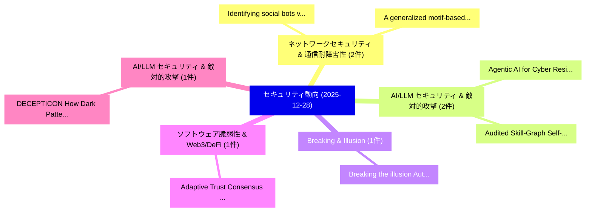

# 📅 02_daily: 日次エグゼクティブサマリー報告書 (2025-12-28)

**集計日時**: 2026-10-02 23:05:52 UTC  
**対象日付**: 2025-12-28  
**本日収集論文数**: 8 件  

---

## 💡 主要セキュリティ動向・脅威インサイト (Executive Insights)

本日の収集論文（計 8 件）において、以下の重点セキュリティ領域で活発な研究動向が確認されました：
- **ネットワークセキュリティ & 通信耐障害性** (2 件): 注目論文として 「Identifying social bots via he...」、「A generalized motif-based Naïv...」 等が発表され、実務防御および攻撃検証の進展が見られます。
- **AI/LLM セキュリティ & 敵対的攻撃** (2 件): 注目論文として 「Agentic AI for Cyber Resilienc...」、「Audited Skill-Graph Self-Impro...」 等が発表され、実務防御および攻撃検証の進展が見られます。
- **Breaking & Illusion** (1 件): 注目論文として 「Breaking the illusion: Automat...」 等が発表され、実務防御および攻撃検証の進展が見られます。
- **ソフトウェア脆弱性 & Web3/DeFi** (1 件): 注目論文として 「Adaptive Trust Consensus for B...」 等が発表され、実務防御および攻撃検証の進展が見られます。
- **AI/LLM セキュリティ & 敵対的攻撃** (1 件): 注目論文として 「DECEPTICON: How Dark Patterns ...」 等が発表され、実務防御および攻撃検証の進展が見られます。

### 🗺️ 技術・脅威トピックマインドマップ

---

## 📌 日次セキュリティ論文一覧 (日本語表形式)

| No | arXiv ID | 論文タイトル (日本語訳) | 重要キーワード | 構造化エグゼクティブ要約 (背景・提案・影響) | 脅威分類 | 詳細リンク |
|---|---|---|---|---|---|---|
| 1 | `2512.22759v1` | [Identifying social bots via heterogeneous motifs based on Naïve Bayes model（セキュリティ分析論文）](../../okf/papers/2025-12-28/2512.22759.md) | `Yijun Ran`, `Jingjing Xiao`, `Ke Xu` | 【提案】概要 (Overview & Key Finding) 本論文「Identifying social bots via heterogeneous motifs based ...。実証評価により経営層・セキュリティ管理者向け推奨アクション (E... | `cybersecurity` | [arXiv](https://arxiv.org/abs/2512.22759v1) &#124; [OKF](../../okf/papers/2025-12-28/2512.22759.md) |
| 2 | `2512.22765v1` | [A generalized motif-based Naïve Bayes model for sign prediction in complex networks（セキュリティ分析論文）](../../okf/papers/2025-12-28/2512.22765.md) | `Yijun Ran`, `Yuan Liu`, `Junjie Huang` | 【提案】概要 (Overview & Key Finding) 本論文「A generalized motif-based Naïve Bayes model for sign pr...。実証評価により経営層・セキュリティ管理者向け推奨アクション (E... | `cybersecurity` | [arXiv](https://arxiv.org/abs/2512.22765v1) &#124; [OKF](../../okf/papers/2025-12-28/2512.22765.md) |
| 3 | `2512.22789v1` | [Breaking the illusion: Automated Reasoning of GDPR Consent Violations（セキュリティ分析論文）](../../okf/papers/2025-12-28/2512.22789.md) | `Automated Reasoning`, `Consent Violations`, `Faysal Hossain Shezan` | 【提案】概要 (Overview & Key Finding) 本論文「Breaking the illusion: Automated Reasoning of GDPR Cons...。実証評価により経営層・セキュリティ管理者向け推奨アクション (E... | `cybersecurity` | [arXiv](https://arxiv.org/abs/2512.22789v1) &#124; [OKF](../../okf/papers/2025-12-28/2512.22789.md) |
| 4 | `2512.22860v1` | [Adaptive Trust Consensus for Blockchain IoT: Comparing RL, DRL, and MARL Against Naive, Collusive, Adaptive, Byzantine, and Sleeper Attacks（セキュリティ分析論文）](../../okf/papers/2025-12-28/2512.22860.md) | `Adaptive Trust Consensus`, `Sleeper Attacks`, `Soham Padia` | 【提案】概要 (Overview & Key Finding) 本論文「Adaptive Trust Consensus for Blockchain IoT: Comparing ...。実証評価により経営層・セキュリティ管理者向け推奨アクション (E... | `executive-summary` | [arXiv](https://arxiv.org/abs/2512.22860v1) &#124; [OKF](../../okf/papers/2025-12-28/2512.22860.md) |
| 5 | `2512.22883v1` | [Agentic AI for Cyber Resilience: A New Security Paradigm and Its System-Theoretic Foundations（セキュリティ分析論文）](../../okf/papers/2025-12-28/2512.22883.md) | `New Security Paradigm`, `Cyber Resilience`, `Theoretic Foundations` | 【提案】概要 (Overview & Key Finding) 本論文「Agentic AI for Cyber Resilience: A New Security Paradig...。実証評価により経営層・セキュリティ管理者向け推奨アクション (E... | `cs.AI` | [arXiv](https://arxiv.org/abs/2512.22883v1) &#124; [OKF](../../okf/papers/2025-12-28/2512.22883.md) |
| 6 | `2512.22894v2` | [DECEPTICON: How Dark Patterns Manipulate Web Agents（セキュリティ分析論文）](../../okf/papers/2025-12-28/2512.22894.md) | `Phil Cuvin`, `Hao Zhu`, `Diyi Yang` | 【提案】概要 (Overview & Key Finding) 本論文「DECEPTICON: How Dark Patterns Manipulate Web Agents（セキュ...。実証評価により経営層・セキュリティ管理者向け推奨アクション (E... | `cs.AI` | [arXiv](https://arxiv.org/abs/2512.22894v2) &#124; [OKF](../../okf/papers/2025-12-28/2512.22894.md) |
| 7 | `2512.23760v1` | [Audited Skill-Graph Self-Improvement for Agentic LLMs via Verifiable Rewards, Experience Synthesis, and Continual Memory（セキュリティ分析論文）](../../okf/papers/2025-12-28/2512.23760.md) | `Audited Skill`, `Graph Self`, `Skill-Graph Self` | 【提案】概要 (Overview & Key Finding) 本論文「Audited Skill-Graph Self-Improvement for Agentic LLMs v...。実証評価により経営層・セキュリティ管理者向け推奨アクション (E... | `cs.AI` | [arXiv](https://arxiv.org/abs/2512.23760v1) &#124; [OKF](../../okf/papers/2025-12-28/2512.23760.md) |
| 8 | `2601.11570v1` | [Privacy-Preserving Black-Box Optimization (PBBO): Theory and the Model-Based Algorithm DFOp（セキュリティ分析論文）](../../okf/papers/2025-12-28/2601.11570.md) | `Preserving Black`, `Box Optimization`, `Privacy-Preserving Black` | 【提案】概要 (Overview & Key Finding) 本論文「Privacy-Preserving Black-Box Optimization (PBBO): Theor...。実証評価により経営層・セキュリティ管理者向け推奨アクション (E... | `executive-summary` | [arXiv](https://arxiv.org/abs/2601.11570v1) &#124; [OKF](../../okf/papers/2025-12-28/2601.11570.md) |

