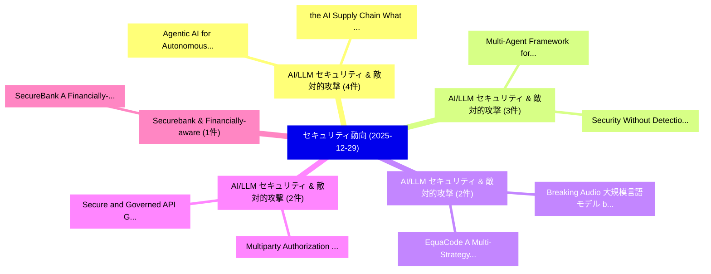

# 📅 02_daily: 日次エグゼクティブサマリー報告書 (2025-12-29)

**集計日時**: 2026-10-02 23:05:52 UTC  
**対象日付**: 2025-12-29  
**本日収集論文数**: 23 件  

---

## 💡 主要セキュリティ動向・脅威インサイト (Executive Insights)

本日の収集論文（計 23 件）において、以下の重点セキュリティ領域で活発な研究動向が確認されました：
- **AI/LLM セキュリティ & 敵対的攻撃** (4 件): 注目論文として 「the AI Supply Chain: What Can ...」、「Agentic AI for Autonomous Defe...」 等が発表され、実務防御および攻撃検証の進展が見られます。
- **AI/LLM セキュリティ & 敵対的攻撃** (3 件): 注目論文として 「Multi-Agent Framework for Thre...」、「Security Without Detection: Ec...」 等が発表され、実務防御および攻撃検証の進展が見られます。
- **AI/LLM セキュリティ & 敵対的攻撃** (2 件): 注目論文として 「EquaCode: A Multi-Strategy Jai...」、「Breaking Audio 大規模言語モデル by Att...」 等が発表され、実務防御および攻撃検証の進展が見られます。
- **AI/LLM セキュリティ & 敵対的攻撃** (2 件): 注目論文として 「Multiparty Authorization for S...」、「Secure and Governed API Gatewa...」 等が発表され、実務防御および攻撃検証の進展が見られます。
- **Securebank & Financially-aware** (1 件): 注目論文として 「SecureBank: A Financially-Awar...」 等が発表され、実務防御および攻撃検証の進展が見られます。

### 🗺️ 技術・脅威トピックマインドマップ

---

## 📌 日次セキュリティ論文一覧 (日本語表形式)

| No | arXiv ID | 論文タイトル (日本語訳) | 重要キーワード | 構造化エグゼクティブ要約 (背景・提案・影響) | 脅威分類 | 詳細リンク |
|---|---|---|---|---|---|---|
| 1 | `2512.23124v2` | [SecureBank: A Financially-Aware Zero Trust Architecture for High-Assurance Banking Systems（セキュリティ分析論文）](../../okf/papers/2025-12-29/2512.23124.md) | `Aware Zero Trust Architecture`, `Assurance Banking Systems`, `Financially-Aware Zero` | 【提案】概要 (Overview & Key Finding) 本論文「SecureBank: A Financially-Aware ゼロトラスト Architecture for...。実証評価により経営層・セキュリティ管理者向け推奨アクション (E... | `cybersecurity` | [arXiv](https://arxiv.org/abs/2512.23124v2) &#124; [OKF](../../okf/papers/2025-12-29/2512.23124.md) |
| 2 | `2512.23132v1` | [Multi-Agent Framework for Threat Mitigation and Resilience in AI-Based Systems（セキュリティ分析論文）](../../okf/papers/2025-12-29/2512.23132.md) | `Threat Mitigation`, `Based Systems`, `AI-Based Systems` | 【提案】概要 (Overview & Key Finding) 本論文「Multi-Agent Framework for 脅威 Mitigation and Resilience ...。実証評価により経営層・セキュリティ管理者向け推奨アクション (E... | `executive-summary` | [arXiv](https://arxiv.org/abs/2512.23132v1) &#124; [OKF](../../okf/papers/2025-12-29/2512.23132.md) |
| 3 | `2512.23171v3` | [Certifying the Right to Be Forgotten: Primal-Dual Optimization for Sample and Label Unlearning in Vertical 連合学習](../../okf/papers/2025-12-29/2512.23171.md) | `Dual Optimization`, `Label Unlearning`, `Primal-Dual Optimization` | 【提案】概要 (Overview & Key Finding) 本論文「Certifying the Right to Be Forgotten: Primal-Dual Optim...。実証評価により経営層・セキュリティ管理者向け推奨アクション (E... | `executive-summary` | [arXiv](https://arxiv.org/abs/2512.23171v3) &#124; [OKF](../../okf/papers/2025-12-29/2512.23171.md) |
| 4 | `2512.23173v1` | [EquaCode: A Multi-Strategy Jailbreak Approach for 大規模言語モデル via Equation Solving and Code Completion](../../okf/papers/2025-12-29/2512.23173.md) | `Equation Solving`, `Code Completion`, `Multi-Strategy Jailbreak` | 【提案】概要 (Overview & Key Finding) 本論文「EquaCode: A Multi-Strategy ジェイルブレイク Approach for 大規模言語モ...。実証評価により経営層・セキュリティ管理者向け推奨アクション (E... | `cs.AI` | [arXiv](https://arxiv.org/abs/2512.23173v1) &#124; [OKF](../../okf/papers/2025-12-29/2512.23173.md) |
| 5 | `2512.23216v1` | [Multiparty Authorization for Secure Data Storage in Cloud Environments using Improved Attribute-Based Encryption（セキュリティ分析論文）](../../okf/papers/2025-12-29/2512.23216.md) | `Secure Data Storage`, `Multiparty Authorization`, `Cloud Environments` | 【提案】概要 (Overview & Key Finding) 本論文「Multiparty Authorization for Secure Data Storage in Clo...。実証評価により経営層・セキュリティ管理者向け推奨アクション (E... | `cybersecurity` | [arXiv](https://arxiv.org/abs/2512.23216v1) &#124; [OKF](../../okf/papers/2025-12-29/2512.23216.md) |
| 6 | `2512.23307v1` | [RobustMask: Certified Robustness against Adversarial Neural Ranking Attack via Randomized Masking（セキュリティ分析論文）](../../okf/papers/2025-12-29/2512.23307.md) | `Adversarial Neural Ranking Attack`, `Certified Robustness`, `Randomized Masking` | 【提案】概要 (Overview & Key Finding) 本論文「RobustMask: Certified Robustness against Adversarial Ne...。実証評価により経営層・セキュリティ管理者向け推奨アクション (E... | `executive-summary` | [arXiv](https://arxiv.org/abs/2512.23307v1) &#124; [OKF](../../okf/papers/2025-12-29/2512.23307.md) |
| 7 | `2512.23385v2` | [the AI Supply Chain: What Can We Learn From Developer-Reported Security Issues and Solutions of AI Projects?のセキュリティ強化](../../okf/papers/2025-12-29/2512.23385.md) | `Reported Security Issues`, `Supply Chain`, `Developer-Reported Security` | 【提案】### (日本語題名: the AI Supply Chain: What Can We Learn From Developer-Reported Security Iss...。実証評価により経営層・セキュリティ管理者向け推奨アクション (E... | `cs.AI` | [arXiv](https://arxiv.org/abs/2512.23385v2) &#124; [OKF](../../okf/papers/2025-12-29/2512.23385.md) |
| 8 | `2512.23438v1` | [Fuzzilicon: A Post-Silicon Microcode-Guided x86 CPU Fuzzer（セキュリティ分析論文）](../../okf/papers/2025-12-29/2512.23438.md) | `Silicon Microcode`, `Post-Silicon Microcode`, `Johannes Lenzen` | 【提案】概要 (Overview & Key Finding) 本論文「Fuzzilicon: A Post-Silicon Microcode-Guided x86 CPU Fuz...。実証評価により経営層・セキュリティ管理者向け推奨アクション (E... | `cybersecurity` | [arXiv](https://arxiv.org/abs/2512.23438v1) &#124; [OKF](../../okf/papers/2025-12-29/2512.23438.md) |
| 9 | `2512.23439v4` | [Bitcoin-IPC: Scaling Bitcoin with a Network of Proof-of-Stake Subnets（セキュリティ分析論文）](../../okf/papers/2025-12-29/2512.23439.md) | `Scaling Bitcoin`, `Stake Subnets`, `Orestis Alpos` | 【提案】概要 (Overview & Key Finding) 本論文「Bitcoin-IPC: Scaling Bitcoin with a Network of Proof-of...。実証評価により経営層・セキュリティ管理者向け推奨アクション (E... | `executive-summary` | [arXiv](https://arxiv.org/abs/2512.23439v4) &#124; [OKF](../../okf/papers/2025-12-29/2512.23439.md) |
| 10 | `2512.23480v1` | [Agentic AI for Autonomous Defense in Software Supply Chain Security: Beyond Provenance to Vulnerability Mitigation（セキュリティ分析論文）](../../okf/papers/2025-12-29/2512.23480.md) | `Software Supply Chain Security`, `Autonomous Defense`, `Beyond Provenance` | 【提案】概要 (Overview & Key Finding) 本論文「Agentic AI for Autonomous Defense in Software Supply Ch...。実証評価により経営層・セキュリティ管理者向け推奨アクション (E... | `cs.AI` | [arXiv](https://arxiv.org/abs/2512.23480v1) &#124; [OKF](../../okf/papers/2025-12-29/2512.23480.md) |
| 11 | `2512.23535v1` | [A Privacy Protocol Using Ephemeral Intermediaries and a Rank-Deficient Matrix Power Function (RDMPF)（セキュリティ分析論文）](../../okf/papers/2025-12-29/2512.23535.md) | `Privacy Protocol Using Ephemeral Intermediaries`, `Deficient Matrix Power Function`, `Rank-Deficient Matrix` | 【提案】概要 (Overview & Key Finding) 本論文「A Privacy Protocol Using Ephemeral Intermediaries and a...。実証評価により経営層・セキュリティ管理者向け推奨アクション (E... | `cs.NI` | [arXiv](https://arxiv.org/abs/2512.23535v1) &#124; [OKF](../../okf/papers/2025-12-29/2512.23535.md) |
| 12 | `2512.23557v1` | [Toward Trustworthy Agentic AI: A Multimodal Framework for Preventing Prompt Injection Attacks（セキュリティ分析論文）](../../okf/papers/2025-12-29/2512.23557.md) | `Preventing Prompt Injection Attacks`, `Toward Trustworthy Agentic`, `Toqeer Ali Syed` | 【提案】概要 (Overview & Key Finding) 本論文「Toward Trustworthy Agentic AI: A Multimodal Framework f...。実証評価により経営層・セキュリティ管理者向け推奨アクション (E... | `cs.AI` | [arXiv](https://arxiv.org/abs/2512.23557v1) &#124; [OKF](../../okf/papers/2025-12-29/2512.23557.md) |
| 13 | `2512.23607v1` | [Research Directions in Quantum Computer サイバーセキュリティ](../../okf/papers/2025-12-29/2512.23607.md) | `Research Directions`, `Quantum Computer Cybersecurity`, `Quantum Computer` | 【提案】概要 (Overview & Key Finding) 本論文「Research Directions in 量子 Computer サイバーセキュリティ」（原題: Rese...。実証評価により経営層・セキュリティ管理者向け推奨アクション (E... | `executive-summary` | [arXiv](https://arxiv.org/abs/2512.23607v1) &#124; [OKF](../../okf/papers/2025-12-29/2512.23607.md) |
| 14 | `2512.23610v2` | [Enhanced Web Payload Classification Using WAMM: An AI-Based Framework for Dataset Refinement and Model Evaluation（セキュリティ分析論文）](../../okf/papers/2025-12-29/2512.23610.md) | `Enhanced Web Payload Classification Using`, `Dataset Refinement`, `Heba Osama` | 【提案】概要 (Overview & Key Finding) 本論文「Enhanced Web Payload Classification Using WAMM: An AI-B...。実証評価により経営層・セキュリティ管理者向け推奨アクション (E... | `cybersecurity` | [arXiv](https://arxiv.org/abs/2512.23610v2) &#124; [OKF](../../okf/papers/2025-12-29/2512.23610.md) |
| 15 | `2512.23774v1` | [Secure and Governed API Gateway Architectures for Multi-Cluster Cloud Environments（セキュリティ分析論文）](../../okf/papers/2025-12-29/2512.23774.md) | `Cluster Cloud Environments`, `Gateway Architectures`, `Multi-Cluster Cloud` | 【提案】概要 (Overview & Key Finding) 本論文「Secure and Governed API Gateway Architectures for Multi...。実証評価により経営層・セキュリティ管理者向け推奨アクション (E... | `cybersecurity` | [arXiv](https://arxiv.org/abs/2512.23774v1) &#124; [OKF](../../okf/papers/2025-12-29/2512.23774.md) |
| 16 | `2512.23778v1` | [SyncGait: Robust Long-Distance Authentication for Drone Delivery via Implicit Gait Behaviors（セキュリティ分析論文）](../../okf/papers/2025-12-29/2512.23778.md) | `Implicit Gait Behaviors`, `Robust Long`, `Distance Authentication` | 【提案】概要 (Overview & Key Finding) 本論文「SyncGait: Robust Long-Distance Authentication for Drone...。実証評価により経営層・セキュリティ管理者向け推奨アクション (E... | `cs.MM` | [arXiv](https://arxiv.org/abs/2512.23778v1) &#124; [OKF](../../okf/papers/2025-12-29/2512.23778.md) |
| 17 | `2512.23779v2` | [Prompt-Induced Over-Generation as Denial-of-Service: A Black-Box Attack-Side Benchmark（セキュリティ分析論文）](../../okf/papers/2025-12-29/2512.23779.md) | `Box Attack`, `Black-Box Attack`, `Side Benchmark` | 【提案】概要 (Overview & Key Finding) 本論文「Prompt-Induced Over-Generation as Denial-of-Service: A ...。実証評価により経営層・セキュリティ管理者向け推奨アクション (E... | `cs.AI` | [arXiv](https://arxiv.org/abs/2512.23779v2) &#124; [OKF](../../okf/papers/2025-12-29/2512.23779.md) |
| 18 | `2512.23785v1` | [Application-Specific Power Side-Channel Attacks and Countermeasures: A Survey（セキュリティ分析論文）](../../okf/papers/2025-12-29/2512.23785.md) | `Specific Power Side`, `Channel Attacks`, `Application-Specific Power` | 【提案】概要 (Overview & Key Finding) 本論文「Application-Specific Power サイドチャネル攻撃 Attacks and Counte...。実証評価により経営層・セキュリティ管理者向け推奨アクション (E... | `cybersecurity` | [arXiv](https://arxiv.org/abs/2512.23785v1) &#124; [OKF](../../okf/papers/2025-12-29/2512.23785.md) |
| 19 | `2512.23788v1` | [VBSF: A Visual-Based Spam Filtering Technique for Obfuscated Emails（セキュリティ分析論文）](../../okf/papers/2025-12-29/2512.23788.md) | `Based Spam Filtering Technique`, `Obfuscated Emails`, `Visual-Based Spam` | 【提案】概要 (Overview & Key Finding) 本論文「VBSF: A Visual-Based Spam Filtering Technique for Obfus...。実証評価により経営層・セキュリティ管理者向け推奨アクション (E... | `cybersecurity` | [arXiv](https://arxiv.org/abs/2512.23788v1) &#124; [OKF](../../okf/papers/2025-12-29/2512.23788.md) |
| 20 | `2512.23809v1` | [Zero-Trust Agentic 連合学習 for Secure IIoT Defense Systems](../../okf/papers/2025-12-29/2512.23809.md) | `Defense Systems`, `Zero-Trust Agentic`, `Trust Agentic Federated Learning` | 【提案】概要 (Overview & Key Finding) 本論文「ゼロトラスト Agentic 連合学習 for Secure IIoT Defense Systems」（原題...。実証評価により経営層・セキュリティ管理者向け推奨アクション (E... | `cs.AI` | [arXiv](https://arxiv.org/abs/2512.23809v1) &#124; [OKF](../../okf/papers/2025-12-29/2512.23809.md) |
| 21 | `2512.23849v2` | [Security Without Detection: Economic Denial as a Primitive for Edge and IoT Defense（セキュリティ分析論文）](../../okf/papers/2025-12-29/2512.23849.md) | `Security Without Detection`, `Economic Denial`, `Samaresh Kumar Singh` | 【提案】背景とセキュリティ上の課題 (Background & Problem) 本研究はサイバー脅威環境におけるセキュリティ構造・脆弱性の検証を目的としています。(主要検出項目: ...。実証評価により経営層・セキュリティ管理者向け推奨アクション (E... | `cs.AI` | [arXiv](https://arxiv.org/abs/2512.23849v2) &#124; [OKF](../../okf/papers/2025-12-29/2512.23849.md) |
| 22 | `2512.23881v1` | [Breaking Audio 大規模言語モデル by Attacking Only the Encoder: A Universal Targeted Latent-Space Audio Attack](../../okf/papers/2025-12-29/2512.23881.md) | `Universal Targeted Latent`, `Space Audio Attack`, `Latent-Space Audio` | 【提案】概要 (Overview & Key Finding) 本論文「Breaking Audio 大規模言語モデル by Attacking Only the Encoder: ...。実証評価により経営層・セキュリティ管理者向け推奨アクション (E... | `cs.AI` | [arXiv](https://arxiv.org/abs/2512.23881v1) &#124; [OKF](../../okf/papers/2025-12-29/2512.23881.md) |
| 23 | `2601.00848v1` | [Temporal Attack Pattern Detection in Multi-Agent AI Workflows: An Open Framework for Training Trace-Based Security Models（セキュリティ分析論文）](../../okf/papers/2025-12-29/2601.00848.md) | `Temporal Attack Pattern Detection`, `Based Security Models`, `Training Trace` | 【提案】概要 (Overview & Key Finding) 本論文「Temporal Attack Pattern Detection in Multi-Agent AI Wor...。実証評価により経営層・セキュリティ管理者向け推奨アクション (E... | `cs.AI` | [arXiv](https://arxiv.org/abs/2601.00848v1) &#124; [OKF](../../okf/papers/2025-12-29/2601.00848.md) |

