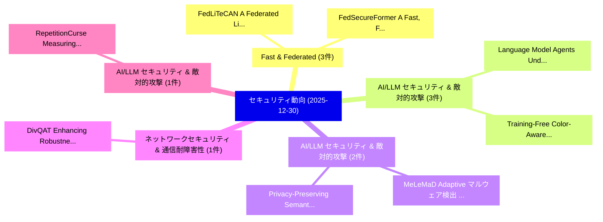

# 📅 02_daily: 日次エグゼクティブサマリー報告書 (2025-12-30)

**集計日時**: 2026-10-02 23:05:52 UTC  
**対象日付**: 2025-12-30  
**本日収集論文数**: 20 件  

---

## 💡 主要セキュリティ動向・脅威インサイト (Executive Insights)

本日の収集論文（計 20 件）において、以下の重点セキュリティ領域で活発な研究動向が確認されました：
- **Fast & Federated** (3 件): 注目論文として 「FedLiTeCAN : A Federated Light...」、「FedSecureFormer: A Fast, Feder...」 等が発表され、実務防御および攻撃検証の進展が見られます。
- **AI/LLM セキュリティ & 敵対的攻撃** (3 件): 注目論文として 「Language Model Agents Under At...」、「Training-Free Color-Aware Adve...」 等が発表され、実務防御および攻撃検証の進展が見られます。
- **AI/LLM セキュリティ & 敵対的攻撃** (2 件): 注目論文として 「MeLeMaD: Adaptive マルウェア検出 via ...」、「Privacy-Preserving Semantic Co...」 等が発表され、実務防御および攻撃検証の進展が見られます。
- **ネットワークセキュリティ & 通信耐障害性** (1 件): 注目論文として 「DivQAT: Enhancing Robustness o...」 等が発表され、実務防御および攻撃検証の進展が見られます。
- **AI/LLM セキュリティ & 敵対的攻撃** (1 件): 注目論文として 「RepetitionCurse: Measuring and...」 等が発表され、実務防御および攻撃検証の進展が見られます。

### 🗺️ 技術・脅威トピックマインドマップ

---

## 📌 日次セキュリティ論文一覧 (日本語表形式)

| No | arXiv ID | 論文タイトル (日本語訳) | 重要キーワード | 構造化エグゼクティブ要約 (背景・提案・影響) | 脅威分類 | 詳細リンク |
|---|---|---|---|---|---|---|
| 1 | `2512.23948v1` | [DivQAT: Enhancing Robustness of Quantized Convolutional Neural Networks against Model Extraction Attacks（セキュリティ分析論文）](../../okf/papers/2025-12-30/2512.23948.md) | `Quantized Convolutional Neural Networks`, `Model Extraction Attacks`, `Enhancing Robustness` | 【提案】概要 (Overview & Key Finding) 本論文「DivQAT: Enhancing Robustness of Quantized Convolutional...。実証評価により経営層・セキュリティ管理者向け推奨アクション (E... | `executive-summary` | [arXiv](https://arxiv.org/abs/2512.23948v1) &#124; [OKF](../../okf/papers/2025-12-30/2512.23948.md) |
| 2 | `2512.23987v1` | [MeLeMaD: Adaptive マルウェア検出 via Chunk-wise Feature Selection and Meta-Learning](../../okf/papers/2025-12-30/2512.23987.md) | `Feature Selection`, `Chunk-wise Feature`, `Adaptive Malware Detection` | 【提案】概要 (Overview & Key Finding) 本論文「MeLeMaD: Adaptive マルウェア検出 via Chunk-wise Feature Select...。実証評価により経営層・セキュリティ管理者向け推奨アクション (E... | `cs.AI` | [arXiv](https://arxiv.org/abs/2512.23987v1) &#124; [OKF](../../okf/papers/2025-12-30/2512.23987.md) |
| 3 | `2512.23995v2` | [RepetitionCurse: Measuring and Understanding Router Imbalance in Mixture-of-Experts LLMs under DoS Stress（セキュリティ分析論文）](../../okf/papers/2025-12-30/2512.23995.md) | `Understanding Router Imbalance`, `Ruixuan Huang`, `Qingyue Wang` | 【提案】概要 (Overview & Key Finding) 本論文「RepetitionCurse: Measuring and Understanding Router Imb...。実証評価により経営層・セキュリティ管理者向け推奨アクション (E... | `executive-summary` | [arXiv](https://arxiv.org/abs/2512.23995v2) &#124; [OKF](../../okf/papers/2025-12-30/2512.23995.md) |
| 4 | `2512.24041v1` | [Exposed: Shedding Blacklight on Online Privacy（セキュリティ分析論文）](../../okf/papers/2025-12-30/2512.24041.md) | `Shedding Blacklight`, `Online Privacy`, `Lucas Shen` | 【提案】概要 (Overview & Key Finding) 本論文「Exposed: Shedding Blacklight on Online Privacy（セキュリティ分析...。実証評価により経営層・セキュリティ管理者向け推奨アクション (E... | `executive-summary` | [arXiv](https://arxiv.org/abs/2512.24041v1) &#124; [OKF](../../okf/papers/2025-12-30/2512.24041.md) |
| 5 | `2512.24044v1` | [Jailbreaking Attacks vs. Content Safety Filters: How Far Are We in the LLM Safety Arms Race?（セキュリティ分析論文）](../../okf/papers/2025-12-30/2512.24044.md) | `Content Safety Filters`, `Safety Arms Race`, `Jailbreaking Attacks` | 【提案】### (日本語題名: ジェイルブレイクing Attacks vs. Content Safety Filters: How Far Are We in the LLM S...。実証評価により経営層・セキュリティ管理者向け推奨アクション (E... | `cs.AI` | [arXiv](https://arxiv.org/abs/2512.24044v1) &#124; [OKF](../../okf/papers/2025-12-30/2512.24044.md) |
| 6 | `2512.24088v1` | [FedLiTeCAN : A Federated Lightweight Transformer for Fast and Robust CAN Bus Intrusion Detection（セキュリティ分析論文）](../../okf/papers/2025-12-30/2512.24088.md) | `Federated Lightweight Transformer`, `Bus Intrusion Detection`, `Pratik Narang` | 【提案】概要 (Overview & Key Finding) 本論文「FedLiTeCAN : A Federated Lightweight Transformer for Fa...。実証評価により経営層・セキュリティ管理者向け推奨アクション (E... | `cs.AI` | [arXiv](https://arxiv.org/abs/2512.24088v1) &#124; [OKF](../../okf/papers/2025-12-30/2512.24088.md) |
| 7 | `2512.24238v1` | [Spatial Discretization for Fine-Grain Zone Checks with STARKs（セキュリティ分析論文）](../../okf/papers/2025-12-30/2512.24238.md) | `Grain Zone Checks`, `Spatial Discretization`, `Fine-Grain Zone` | 【提案】概要 (Overview & Key Finding) 本論文「Spatial Discretization for Fine-Grain Zone Checks with ...。実証評価により経営層・セキュリティ管理者向け推奨アクション (E... | `cybersecurity` | [arXiv](https://arxiv.org/abs/2512.24238v1) &#124; [OKF](../../okf/papers/2025-12-30/2512.24238.md) |
| 8 | `2512.24255v1` | [How Would Oblivious Memory Boost Graph Analytics on Trusted Processors?（セキュリティ分析論文）](../../okf/papers/2025-12-30/2512.24255.md) | `Trusted Processors`, `Jiping Yu`, `Xiaowei Zhu` | 【提案】### (日本語題名: How Would Oblivious Memory Boost Graph Analytics on Trusted Processors?（セキュ...。実証評価により経営層・セキュリティ管理者向け推奨アクション (E... | `cybersecurity` | [arXiv](https://arxiv.org/abs/2512.24255v1) &#124; [OKF](../../okf/papers/2025-12-30/2512.24255.md) |
| 9 | `2512.24345v1` | [FedSecureFormer: A Fast, Federated and Secure Transformer Framework for Lightweight Intrusion Detection in Connected and 自動運転車両](../../okf/papers/2025-12-30/2512.24345.md) | `Lightweight Intrusion Detection`, `Autonomous Vehicles`, `Vishnu Hari` | 【提案】概要 (Overview & Key Finding) 本論文「FedSecureFormer: A Fast, Federated and Secure Transform...。実証評価により経営層・セキュリティ管理者向け推奨アクション (E... | `cs.AI` | [arXiv](https://arxiv.org/abs/2512.24345v1) &#124; [OKF](../../okf/papers/2025-12-30/2512.24345.md) |
| 10 | `2512.24391v1` | [FAST-IDS: A Fast Two-Stage Intrusion Detection System with Hybrid Compression for Real-Time Threat Detection in Connected and 自動運転車両](../../okf/papers/2025-12-30/2512.24391.md) | `Stage Intrusion Detection System`, `Time Threat Detection`, `Fast Two` | 【提案】概要 (Overview & Key Finding) 本論文「FAST-IDS: A Fast Two-Stage Intrusion Detection System w...。実証評価により経営層・セキュリティ管理者向け推奨アクション (E... | `cs.AI` | [arXiv](https://arxiv.org/abs/2512.24391v1) &#124; [OKF](../../okf/papers/2025-12-30/2512.24391.md) |
| 11 | `2512.24400v1` | [SourceBroken: A large-scale analysis on the (un)reliability of SourceRank in the PyPI ecosystem（セキュリティ分析論文）](../../okf/papers/2025-12-30/2512.24400.md) | `Serena Elisa Ponta`, `Biagio Montaruli`, `Luca Compagna` | 【提案】概要 (Overview & Key Finding) 本論文「SourceBroken: A large-scale analysis on the (un)reliabi...。実証評価により経営層・セキュリティ管理者向け推奨アクション (E... | `executive-summary` | [arXiv](https://arxiv.org/abs/2512.24400v1) &#124; [OKF](../../okf/papers/2025-12-30/2512.24400.md) |
| 12 | `2512.24415v1` | [Language Model Agents Under Attack: A Cross Model-Benchmark of Profit-Seeking Behaviors in Customer Service（セキュリティ分析論文）](../../okf/papers/2025-12-30/2512.24415.md) | `Cross Model`, `Seeking Behaviors`, `Customer Service` | 【提案】概要 (Overview & Key Finding) 本論文「Language Model Agents Under Attack: A Cross Model-Bench...。実証評価により経営層・セキュリティ管理者向け推奨アクション (E... | `executive-summary` | [arXiv](https://arxiv.org/abs/2512.24415v1) &#124; [OKF](../../okf/papers/2025-12-30/2512.24415.md) |
| 13 | `2512.24416v2` | [GateChain: A Blockchain Based Application for Country Entry-Exit Registry Management（セキュリティ分析論文）](../../okf/papers/2025-12-30/2512.24416.md) | `Blockchain Based Application`, `Exit Registry Management`, `Country Entry` | 【提案】概要 (Overview & Key Finding) 本論文「GateChain: A Blockchain Based Application for Country E...。実証評価により経営層・セキュリティ管理者向け推奨アクション (E... | `cybersecurity` | [arXiv](https://arxiv.org/abs/2512.24416v2) &#124; [OKF](../../okf/papers/2025-12-30/2512.24416.md) |
| 14 | `2512.24452v1` | [Privacy-Preserving Semantic Communications via Multi-Task Learning and Adversarial Perturbations（セキュリティ分析論文）](../../okf/papers/2025-12-30/2512.24452.md) | `Preserving Semantic Communications`, `Task Learning`, `Privacy-Preserving Semantic` | 【提案】概要 (Overview & Key Finding) 本論文「Privacy-Preserving Semantic Communications via Multi-Ta...。実証評価により経営層・セキュリティ管理者向け推奨アクション (E... | `cs.NI` | [arXiv](https://arxiv.org/abs/2512.24452v1) &#124; [OKF](../../okf/papers/2025-12-30/2512.24452.md) |
| 15 | `2512.24457v1` | [Document Data Matching for Blockchain-Supported Real Estate（セキュリティ分析論文）](../../okf/papers/2025-12-30/2512.24457.md) | `Document Data Matching`, `Supported Real Estate`, `Blockchain-Supported Real` | 【提案】概要 (Overview & Key Finding) 本論文「Document Data Matching for Blockchain-Supported Real Es...。実証評価により経営層・セキュリティ管理者向け推奨アクション (E... | `executive-summary` | [arXiv](https://arxiv.org/abs/2512.24457v1) &#124; [OKF](../../okf/papers/2025-12-30/2512.24457.md) |
| 16 | `2512.24499v1` | [Training-Free Color-Aware Adversarial Diffusion Sanitization for Diffusion Stegomalware Defense at Security Gateways（セキュリティ分析論文）](../../okf/papers/2025-12-30/2512.24499.md) | `Aware Adversarial Diffusion Sanitization`, `Diffusion Stegomalware Defense`, `Free Color` | 【提案】概要 (Overview & Key Finding) 本論文「Training-Free Color-Aware Adversarial Diffusion Sanitiz...。実証評価により経営層・セキュリティ管理者向け推奨アクション (E... | `cs.CV` | [arXiv](https://arxiv.org/abs/2512.24499v1) &#124; [OKF](../../okf/papers/2025-12-30/2512.24499.md) |
| 17 | `2601.00867v1` | [The Silicon Psyche: Anthropomorphic Vulnerabilities in 大規模言語モデル](../../okf/papers/2025-12-30/2601.00867.md) | `Anthropomorphic Vulnerabilities`, `Large Language Models`, `Giuseppe Canale` | 【提案】概要 (Overview & Key Finding) 本論文「The Silicon Psyche: Anthropomorphic Vulnerabilities in ...。実証評価により経営層・セキュリティ管理者向け推奨アクション (E... | `cs.AI` | [arXiv](https://arxiv.org/abs/2601.00867v1) &#124; [OKF](../../okf/papers/2025-12-30/2601.00867.md) |
| 18 | `2601.00870v1` | [The Quantum State Continuity Problem and Temporal Enforcement Against Fork Attacks（セキュリティ分析論文）](../../okf/papers/2025-12-30/2601.00870.md) | `Raw Meta`, `Executive Summary`, `Key Finding` | 【提案】概要 (Overview & Key Finding) 本論文「The 量子 State Continuity Problem and Temporal Enforcemen...。実証評価により経営層・セキュリティ管理者向け推奨アクション (E... | `executive-summary` | [arXiv](https://arxiv.org/abs/2601.00870v1) &#124; [OKF](../../okf/papers/2025-12-30/2601.00870.md) |
| 19 | `2601.00873v1` | [Quantum Machine Learning Approaches for Coordinated Stealth Attack Detection in Distributed Generation Systems（セキュリティ分析論文）](../../okf/papers/2025-12-30/2601.00873.md) | `Quantum Machine Learning Approaches`, `Coordinated Stealth Attack Detection`, `Distributed Generation Systems` | 【提案】概要 (Overview & Key Finding) 本論文「量子 Machine Learning Approaches for Coordinated Stealth ...。実証評価により経営層・セキュリティ管理者向け推奨アクション (E... | `executive-summary` | [arXiv](https://arxiv.org/abs/2601.00873v1) &#124; [OKF](../../okf/papers/2025-12-30/2601.00873.md) |
| 20 | `2601.14266v1` | [GCG Attack On A Diffusion LLM（セキュリティ分析論文）](../../okf/papers/2025-12-30/2601.14266.md) | `Ruben Neyroud`, `Sam Corley`, `Raw Meta` | 【提案】概要 (Overview & Key Finding) 本論文「GCG Attack On A Diffusion LLM（セキュリティ分析論文）」（原題: GCG Atta...。実証評価により経営層・セキュリティ管理者向け推奨アクション (E... | `executive-summary` | [arXiv](https://arxiv.org/abs/2601.14266v1) &#124; [OKF](../../okf/papers/2025-12-30/2601.14266.md) |

