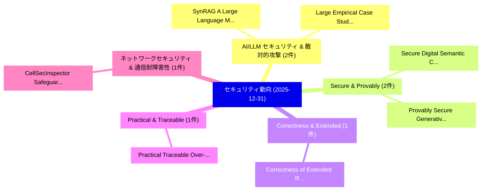

# 📅 02_daily: 日次エグゼクティブサマリー報告書 (2025-12-31)

**集計日時**: 2026-10-02 23:05:52 UTC  
**対象日付**: 2025-12-31  
**本日収集論文数**: 12 件  

---

## 💡 主要セキュリティ動向・脅威インサイト (Executive Insights)

本日の収集論文（計 12 件）において、以下の重点セキュリティ領域で活発な研究動向が確認されました：
- **AI/LLM セキュリティ & 敵対的攻撃** (2 件): 注目論文として 「SynRAG: A Large Language Model...」、「Large Empirical Case Study: Go...」 等が発表され、実務防御および攻撃検証の進展が見られます。
- **Secure & Provably** (2 件): 注目論文として 「Secure Digital Semantic Commun...」、「Provably Secure Generative AI:...」 等が発表され、実務防御および攻撃検証の進展が見られます。
- **Correctness & Extended** (1 件): 注目論文として 「Correctness of Extended RSA Pu...」 等が発表され、実務防御および攻撃検証の進展が見られます。
- **Practical & Traceable** (1 件): 注目論文として 「Practical Traceable Over-Thres...」 等が発表され、実務防御および攻撃検証の進展が見られます。
- **ネットワークセキュリティ & 通信耐障害性** (1 件): 注目論文として 「CellSecInspector: Safeguarding...」 等が発表され、実務防御および攻撃検証の進展が見られます。

### 🗺️ 技術・脅威トピックマインドマップ

---

## 📌 日次セキュリティ論文一覧 (日本語表形式)

| No | arXiv ID | 論文タイトル (日本語訳) | 重要キーワード | 構造化エグゼクティブ要約 (背景・提案・影響) | 脅威分類 | 詳細リンク |
|---|---|---|---|---|---|---|
| 1 | `2512.24531v1` | [Correctness of Extended RSA Public Key Cryptosystem（セキュリティ分析論文）](../../okf/papers/2025-12-31/2512.24531.md) | `Public Key Cryptosystem`, `Suranjan Gautam`, `Raw Meta` | 【提案】概要 (Overview & Key Finding) 本論文「Correctness of Extended RSA Public Key Cryptosystem（セキュ...。実証評価により経営層・セキュリティ管理者向け推奨アクション (E... | `executive-summary` | [arXiv](https://arxiv.org/abs/2512.24531v1) &#124; [OKF](../../okf/papers/2025-12-31/2512.24531.md) |
| 2 | `2512.24571v1` | [SynRAG: A Large Language Model Framework for Executable Query Generation in Heterogeneous SIEM System（セキュリティ分析論文）](../../okf/papers/2025-12-31/2512.24571.md) | `Executable Query Generation`, `Md Hasan Saju`, `Austin Page` | 【提案】概要 (Overview & Key Finding) 本論文「SynRAG: A Large Language Model Framework for Executable...。実証評価により経営層・セキュリティ管理者向け推奨アクション (E... | `cs.AI` | [arXiv](https://arxiv.org/abs/2512.24571v1) &#124; [OKF](../../okf/papers/2025-12-31/2512.24571.md) |
| 3 | `2512.24602v7` | [Secure Digital Semantic Communications: Fundamentals, Challenges, and Opportunities（セキュリティ分析論文）](../../okf/papers/2025-12-31/2512.24602.md) | `Secure Digital Semantic Communications`, `Weixuan Chen`, `Qianqian Yang` | 【提案】概要 (Overview & Key Finding) 本論文「Secure Digital Semantic Communications: Fundamentals, C...。実証評価により経営層・セキュリティ管理者向け推奨アクション (E... | `cybersecurity` | [arXiv](https://arxiv.org/abs/2512.24602v7) &#124; [OKF](../../okf/papers/2025-12-31/2512.24602.md) |
| 4 | `2512.24652v1` | [Practical Traceable Over-Threshold Multi-Party Private Set Intersection（セキュリティ分析論文）](../../okf/papers/2025-12-31/2512.24652.md) | `Party Private Set Intersection`, `Threshold Multi`, `Over-Threshold Multi` | 【提案】概要 (Overview & Key Finding) 本論文「Practical Traceable Over-Threshold Multi-Party Private ...。実証評価により経営層・セキュリティ管理者向け推奨アクション (E... | `cybersecurity` | [arXiv](https://arxiv.org/abs/2512.24652v1) &#124; [OKF](../../okf/papers/2025-12-31/2512.24652.md) |
| 5 | `2512.24682v3` | [CellSecInspector: Safeguarding Cellular Networks via Automated Security Analysis on Specifications（セキュリティ分析論文）](../../okf/papers/2025-12-31/2512.24682.md) | `Safeguarding Cellular Networks`, `Ke Xie`, `Xingyi Zhao` | 【提案】概要 (Overview & Key Finding) 本論文「CellSecInspector: Safeguarding Cellular Networks via Au...。実証評価により経営層・セキュリティ管理者向け推奨アクション (E... | `cybersecurity` | [arXiv](https://arxiv.org/abs/2512.24682v3) &#124; [OKF](../../okf/papers/2025-12-31/2512.24682.md) |
| 6 | `2512.24888v1` | [SoK: Web3 RegTech for Cryptocurrency VASP AML/CFT Compliance（セキュリティ分析論文）](../../okf/papers/2025-12-31/2512.24888.md) | `Jiaxin Wang`, `Ya Liu`, `Li Zhu` | 【提案】概要 (Overview & Key Finding) 本論文「SoK: Web3 RegTech for Cryptocurrency VASP AML/CFT Compl...。実証評価により経営層・セキュリティ管理者向け推奨アクション (E... | `executive-summary` | [arXiv](https://arxiv.org/abs/2512.24888v1) &#124; [OKF](../../okf/papers/2025-12-31/2512.24888.md) |
| 7 | `2512.24899v1` | [MTSP-LDP: A Framework for Multi-Task Streaming Data Publication under Local Differential Privacy（セキュリティ分析論文）](../../okf/papers/2025-12-31/2512.24899.md) | `Task Streaming Data Publication`, `Local Differential Privacy`, `Multi-Task Streaming` | 【提案】概要 (Overview & Key Finding) 本論文「MTSP-LDP: A Framework for Multi-Task Streaming Data Pub...。実証評価により経営層・セキュリティ管理者向け推奨アクション (E... | `cybersecurity` | [arXiv](https://arxiv.org/abs/2512.24899v1) &#124; [OKF](../../okf/papers/2025-12-31/2512.24899.md) |
| 8 | `2512.24925v1` | [Provably Secure Generative AI: Reliable Consensus Samplingに向けて](../../okf/papers/2025-12-31/2512.24925.md) | `Towards Provably Secure Generative`, `Reliable Consensus Sampling`, `Provably Secure Generative` | 【提案】概要 (Overview & Key Finding) 本論文「Provably Secure Generative AI: Reliable Consensus Sampl...。実証評価により経営層・セキュリティ管理者向け推奨アクション (E... | `cybersecurity` | [arXiv](https://arxiv.org/abs/2512.24925v1) &#124; [OKF](../../okf/papers/2025-12-31/2512.24925.md) |
| 9 | `2601.00042v2` | [Large Empirical Case Study: Go-Explore adapted for AI Red Team Testing（セキュリティ分析論文）](../../okf/papers/2025-12-31/2601.00042.md) | `Red Team Testing`, `Go-Explore adapted`, `Manish Bhatt` | 【提案】概要 (Overview & Key Finding) 本論文「Large Empirical Case Study: Go-Explore adapted for AI R...。実証評価により経営層・セキュリティ管理者向け推奨アクション (E... | `cs.AI` | [arXiv](https://arxiv.org/abs/2601.00042v2) &#124; [OKF](../../okf/papers/2025-12-31/2601.00042.md) |
| 10 | `2601.00065v3` | [When the Same Coefficients Reach Different Places: Asymmetric Realizability in Transplanting Tokenizers across 大規模言語モデル](../../okf/papers/2025-12-31/2601.00065.md) | `Asymmetric Realizability`, `Transplanting Tokenizers`, `Large Language Models` | 【提案】概要 (Overview & Key Finding) 本論文「When the Same Coefficients Reach Different Places: Asym...。実証評価により経営層・セキュリティ管理者向け推奨アクション (E... | `executive-summary` | [arXiv](https://arxiv.org/abs/2601.00065v3) &#124; [OKF](../../okf/papers/2025-12-31/2601.00065.md) |
| 11 | `2601.00893v1` | [eco friendly cybersecurity: machine learning based anomaly detection with carbon and energy metricsに向けて](../../okf/papers/2025-12-31/2601.00893.md) | `Md Zakir Hossain Zamil`, `Md Shafiqul Islam Mridul`, `Md Maruf Bin Reza` | 【提案】概要 (Overview & Key Finding) 本論文「eco friendly cybersecurity: machine learning based anom...。実証評価により経営層・セキュリティ管理者向け推奨アクション (E... | `executive-summary` | [arXiv](https://arxiv.org/abs/2601.00893v1) &#124; [OKF](../../okf/papers/2025-12-31/2601.00893.md) |
| 12 | `2601.00900v1` | [Noise-Aware and Dynamically Adaptive Federated Defense Framework for SAR Image Target Recognition（セキュリティ分析論文）](../../okf/papers/2025-12-31/2601.00900.md) | `Image Target Recognition`, `Yuchao Hou`, `Zixuan Zhang` | 【提案】概要 (Overview & Key Finding) 本論文「Noise-Aware and Dynamically Adaptive Federated Defense ...。実証評価により経営層・セキュリティ管理者向け推奨アクション (E... | `cs.CV` | [arXiv](https://arxiv.org/abs/2601.00900v1) &#124; [OKF](../../okf/papers/2025-12-31/2601.00900.md) |

