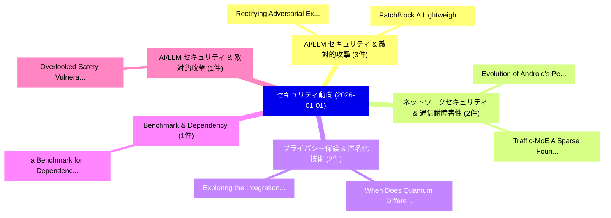

# 📅 02_daily: 日次エグゼクティブサマリー報告書 (2026-01-01)

**集計日時**: 2026-10-02 23:05:52 UTC  
**対象日付**: 2026-01-01  
**本日収集論文数**: 22 件  

---

## 💡 主要セキュリティ動向・脅威インサイト (Executive Insights)

本日の収集論文（計 22 件）において、以下の重点セキュリティ領域で活発な研究動向が確認されました：
- **AI/LLM セキュリティ & 敵対的攻撃** (3 件): 注目論文として 「Rectifying Adversarial Example...」、「PatchBlock: A Lightweight Defe...」 等が発表され、実務防御および攻撃検証の進展が見られます。
- **ネットワークセキュリティ & 通信耐障害性** (2 件): 注目論文として 「Evolution of Android's Permiss...」、「Traffic-MoE: A Sparse Foundati...」 等が発表され、実務防御および攻撃検証の進展が見られます。
- **プライバシー保護 & 匿名化技術** (2 件): 注目論文として 「When Does Quantum Differential...」、「Exploring the Integration of D...」 等が発表され、実務防御および攻撃検証の進展が見られます。
- **Benchmark & Dependency** (1 件): 注目論文として 「a Benchmark for Dependency Dec...」 等が発表され、実務防御および攻撃検証の進展が見られます。
- **AI/LLM セキュリティ & 敵対的攻撃** (1 件): 注目論文として 「Overlooked Safety Vulnerabilit...」 等が発表され、実務防御および攻撃検証の進展が見られます。

### 🗺️ 技術・脅威トピックマインドマップ

---

## 📌 日次セキュリティ論文一覧 (日本語表形式)

| No | arXiv ID | 論文タイトル (日本語訳) | 重要キーワード | 構造化エグゼクティブ要約 (背景・提案・影響) | 脅威分類 | 詳細リンク |
|---|---|---|---|---|---|---|
| 1 | `2601.00205v2` | [a Benchmark for Dependency Decision-Makingに向けて](../../okf/papers/2026-01-01/2601.00205.md) | `Dependency Decision`, `Tanmay Singla`, `Raw Meta` | 【提案】概要 (Overview & Key Finding) 本論文「a Benchmark for Dependency Decision-Makingに向けて」（原題: Tow...。実証評価によりDavis - **公開日時**: `2026-0... | `executive-summary` | [arXiv](https://arxiv.org/abs/2601.00205v2) &#124; [OKF](../../okf/papers/2026-01-01/2601.00205.md) |
| 2 | `2601.00213v1` | [Overlooked Safety Vulnerability in LLMs: Malicious Intelligent Optimization Algorithm Request and its Jailbreak（セキュリティ分析論文）](../../okf/papers/2026-01-01/2601.00213.md) | `Malicious Intelligent Optimization Algorithm Request`, `Overlooked Safety Vulnerability`, `Overlooked Safety Vulnerabil` | 【提案】概要 (Overview & Key Finding) 本論文「Overlooked Safety 脆弱性 in LLMs: Malicious Intelligent Op...。実証評価により経営層・セキュリティ管理者向け推奨アクション (E... | `executive-summary` | [arXiv](https://arxiv.org/abs/2601.00213v1) &#124; [OKF](../../okf/papers/2026-01-01/2601.00213.md) |
| 3 | `2601.00252v1` | [Evolution of Android's Permission-based Security Model and Challenges（セキュリティ分析論文）](../../okf/papers/2026-01-01/2601.00252.md) | `Security Model`, `Permission-based Security`, `Rajendra Kumar Solanki` | 【提案】概要 (Overview & Key Finding) 本論文「Evolution of Android's Permission-based Security Model ...。実証評価により経営層・セキュリティ管理者向け推奨アクション (E... | `executive-summary` | [arXiv](https://arxiv.org/abs/2601.00252v1) &#124; [OKF](../../okf/papers/2026-01-01/2601.00252.md) |
| 4 | `2601.00270v1` | [Rectifying Adversarial Examples Using Their Vulnerabilities（セキュリティ分析論文）](../../okf/papers/2026-01-01/2601.00270.md) | `Fumiya Morimoto`, `Ryuto Morita`, `Satoshi Ono` | 【提案】概要 (Overview & Key Finding) 本論文「Rectifying Adversarial Examples Using Their Vulnerabili...。実証評価により経営層・セキュリティ管理者向け推奨アクション (E... | `executive-summary` | [arXiv](https://arxiv.org/abs/2601.00270v1) &#124; [OKF](../../okf/papers/2026-01-01/2601.00270.md) |
| 5 | `2601.00273v1` | [From Consensus to Chaos: A Vulnerability Assessment of the RAFT Algorithm（セキュリティ分析論文）](../../okf/papers/2026-01-01/2601.00273.md) | `Vulnerability Assessment`, `Tamer Afifi`, `Abdelfatah Hegazy` | 【提案】概要 (Overview & Key Finding) 本論文「From Consensus to Chaos: A 脆弱性 Assessment of the RAFT A...。実証評価により経営層・セキュリティ管理者向け推奨アクション (E... | `executive-summary` | [arXiv](https://arxiv.org/abs/2601.00273v1) &#124; [OKF](../../okf/papers/2026-01-01/2601.00273.md) |
| 6 | `2601.00274v1` | [Making Theft Useless: Adulteration-Based Protection of Proprietary Knowledge Graphs in GraphRAG Systems（セキュリティ分析論文）](../../okf/papers/2026-01-01/2601.00274.md) | `Making Theft Useless`, `Proprietary Knowledge Graphs`, `Based Protection` | 【提案】概要 (Overview & Key Finding) 本論文「Making Theft Useless: Adulteration-Based Protection of ...。実証評価により経営層・セキュリティ管理者向け推奨アクション (E... | `cybersecurity` | [arXiv](https://arxiv.org/abs/2601.00274v1) &#124; [OKF](../../okf/papers/2026-01-01/2601.00274.md) |
| 7 | `2601.00332v1` | [PQC standards alternatives -- reliable semantically secure key encapsulation mechanism and digital signature protocols using the rank-deficient matrix power function（セキュリティ分析論文）](../../okf/papers/2026-01-01/2601.00332.md) | `rank-deficient matrix`, `Juan Pedro Hecht`, `Hugo Daniel Scolnik` | 【提案】概要 (Overview & Key Finding) 本論文「PQC standards alternatives -- reliable semantically sec...。実証評価により経営層・セキュリティ管理者向け推奨アクション (E... | `cybersecurity` | [arXiv](https://arxiv.org/abs/2601.00332v1) &#124; [OKF](../../okf/papers/2026-01-01/2601.00332.md) |
| 8 | `2601.00334v1` | [Applications of Secure Multi-Party Computation in Financial Services（セキュリティ分析論文）](../../okf/papers/2026-01-01/2601.00334.md) | `Secure Multi`, `Party Computation`, `Financial Services` | 【提案】概要 (Overview & Key Finding) 本論文「Applications of Secure Multi-Party Computation in Finan...。実証評価により経営層・セキュリティ管理者向け推奨アクション (E... | `cybersecurity` | [arXiv](https://arxiv.org/abs/2601.00334v1) &#124; [OKF](../../okf/papers/2026-01-01/2601.00334.md) |
| 9 | `2601.00337v2` | [When Does Quantum Differential Privacy Compose?（セキュリティ分析論文）](../../okf/papers/2026-01-01/2601.00337.md) | `Daniel Alabi`, `Theshani Nuradha`, `Raw Meta` | 【提案】### (日本語題名: When Does 量子 差分プライバシー Compose?（セキュリティ分析論文）)  > [!NOTE] > **OKF Metadata**: ...。実証評価により経営層・セキュリティ管理者向け推奨アクション (E... | `executive-summary` | [arXiv](https://arxiv.org/abs/2601.00337v2) &#124; [OKF](../../okf/papers/2026-01-01/2601.00337.md) |
| 10 | `2601.00353v4` | [Diamond: End-to-End Forward-secure and Compact Authenticated Encryption for Internet of Things（セキュリティ分析論文）](../../okf/papers/2026-01-01/2601.00353.md) | `Compact Authenticated Encryption`, `End Forward`, `Gokhan Mumcu` | 【提案】概要 (Overview & Key Finding) 本論文「Diamond: End-to-End Forward-secure and Compact Authenti...。実証評価により経営層・セキュリティ管理者向け推奨アクション (E... | `cybersecurity` | [arXiv](https://arxiv.org/abs/2601.00353v4) &#124; [OKF](../../okf/papers/2026-01-01/2601.00353.md) |
| 11 | `2601.00357v2` | [Traffic-MoE: A Sparse Foundation Model for Network Traffic Security Analysis（セキュリティ分析論文）](../../okf/papers/2026-01-01/2601.00357.md) | `Sparse Foundation Model`, `Jiajun Zhou`, `Changhui Sun` | 【提案】概要 (Overview & Key Finding) 本論文「Traffic-MoE: A Sparse Foundation Model for Network Traf...。実証評価により経営層・セキュリティ管理者向け推奨アクション (E... | `cybersecurity` | [arXiv](https://arxiv.org/abs/2601.00357v2) &#124; [OKF](../../okf/papers/2026-01-01/2601.00357.md) |
| 12 | `2601.00367v1` | [PatchBlock: A Lightweight Defense Against Adversarial Patches for Embedded EdgeAI Devices（セキュリティ分析論文）](../../okf/papers/2026-01-01/2601.00367.md) | `Muhammad Abdullah Hanif`, `Nandish Chattopadhyay`, `Abdul Basit` | 【提案】概要 (Overview & Key Finding) 本論文「PatchBlock: A Lightweight Defense Against Adversarial P...。実証評価により経営層・セキュリティ管理者向け推奨アクション (E... | `cs.AI` | [arXiv](https://arxiv.org/abs/2601.00367v1) &#124; [OKF](../../okf/papers/2026-01-01/2601.00367.md) |
| 13 | `2601.00370v1` | [Ouroboros AutoSyn: Time Based Permissionless Synchrony Model for PoS（セキュリティ分析論文）](../../okf/papers/2026-01-01/2601.00370.md) | `Time Based Permissionless Synchrony Model`, `Joshua Shen`, `Raw Meta` | 【提案】概要 (Overview & Key Finding) 本論文「Ouroboros AutoSyn: Time Based Permissionless Synchrony ...。実証評価により経営層・セキュリティ管理者向け推奨アクション (E... | `cybersecurity` | [arXiv](https://arxiv.org/abs/2601.00370v1) &#124; [OKF](../../okf/papers/2026-01-01/2601.00370.md) |
| 14 | `2601.00372v1` | [LLM-Powered IoT User Reviews: Tracking and Ranking Security and Privacy Concernsの分析](../../okf/papers/2026-01-01/2601.00372.md) | `User Reviews`, `Ranking Security`, `Privacy Concerns` | 【提案】概要 (Overview & Key Finding) 本論文「LLM-Powered IoT User Reviews: Tracking and Ranking Secu...。実証評価により経営層・セキュリティ管理者向け推奨アクション (E... | `cybersecurity` | [arXiv](https://arxiv.org/abs/2601.00372v1) &#124; [OKF](../../okf/papers/2026-01-01/2601.00372.md) |
| 15 | `2601.00384v1` | [Engineering Attack Vectors and Detecting Anomalies in Additive Manufacturing（セキュリティ分析論文）](../../okf/papers/2026-01-01/2601.00384.md) | `Engineering Attack Vectors`, `Detecting Anomalies`, `Additive Manufacturing` | 【提案】概要 (Overview & Key Finding) 本論文「Engineering Attack Vectors and Detecting Anomalies in A...。実証評価により経営層・セキュリティ管理者向け推奨アクション (E... | `cs.AI` | [arXiv](https://arxiv.org/abs/2601.00384v1) &#124; [OKF](../../okf/papers/2026-01-01/2601.00384.md) |
| 16 | `2601.00385v1` | [Exploring the Integration of Differential Privacy in サイバーセキュリティ Analytics: Balancing Data Utility and Privacy in Threat Intelligence](../../okf/papers/2026-01-01/2601.00385.md) | `Balancing Data Utility`, `Differential Privacy`, `Threat Intelligence` | 【提案】概要 (Overview & Key Finding) 本論文「Exploring the Integration of 差分プライバシー in サイバーセキュリティ Ana...。実証評価により経営層・セキュリティ管理者向け推奨アクション (E... | `cybersecurity` | [arXiv](https://arxiv.org/abs/2601.00385v1) &#124; [OKF](../../okf/papers/2026-01-01/2601.00385.md) |
| 17 | `2601.00389v2` | [NOS-Gate: Queue-Aware Streaming IDS for Consumer Gateways under Timing-Controlled Evasion（セキュリティ分析論文）](../../okf/papers/2026-01-01/2601.00389.md) | `Aware Streaming`, `Queue-Aware Streaming`, `Consumer Gateways` | 【提案】概要 (Overview & Key Finding) 本論文「NOS-Gate: Queue-Aware Streaming IDS for Consumer Gatewa...。実証評価により経営層・セキュリティ管理者向け推奨アクション (E... | `cs.NI` | [arXiv](https://arxiv.org/abs/2601.00389v2) &#124; [OKF](../../okf/papers/2026-01-01/2601.00389.md) |
| 18 | `2601.00418v2` | [Secure, Verifiable, and Scalable Multi-Client Data Sharing via Consensus-Based Privacy-Preserving Data Distribution（セキュリティ分析論文）](../../okf/papers/2026-01-01/2601.00418.md) | `Client Data Sharing`, `Preserving Data Distribution`, `Scalable Multi` | 【提案】概要 (Overview & Key Finding) 本論文「Secure, Verifiable, and Scalable Multi-Client Data Shar...。実証評価により経営層・セキュリティ管理者向け推奨アクション (E... | `executive-summary` | [arXiv](https://arxiv.org/abs/2601.00418v2) &#124; [OKF](../../okf/papers/2026-01-01/2601.00418.md) |
| 19 | `2601.00477v1` | [Security in the Age of AI Teammates: Agentic Pull Requests on GitHubの実証研究](../../okf/papers/2026-01-01/2601.00477.md) | `Agentic Pull Requests`, `Mohammed Latif Siddiq`, `Vinicius Carvalho Lopes` | 【提案】概要 (Overview & Key Finding) 本論文「Security in the Age of AI Teammates: Agentic Pull Reque...。実証評価により経営層・セキュリティ管理者向け推奨アクション (E... | `executive-summary` | [arXiv](https://arxiv.org/abs/2601.00477v1) &#124; [OKF](../../okf/papers/2026-01-01/2601.00477.md) |
| 20 | `2601.00509v1` | [Improving LLM-Assisted Secure Code Generation through Retrieval-Augmented-Generation and Multi-Tool Feedback（セキュリティ分析論文）](../../okf/papers/2026-01-01/2601.00509.md) | `Assisted Secure Code Generation`, `Tool Feedback`, `LLM-Assisted Secure` | 【提案】概要 (Overview & Key Finding) 本論文「Improving LLM-Assisted Secure Code Generation through R...。実証評価により経営層・セキュリティ管理者向け推奨アクション (E... | `executive-summary` | [arXiv](https://arxiv.org/abs/2601.00509v1) &#124; [OKF](../../okf/papers/2026-01-01/2601.00509.md) |
| 21 | `2601.00909v1` | [Security Hardening Using FABRIC: Implementing a Unified Compliance Aggregator for Linux Servers（セキュリティ分析論文）](../../okf/papers/2026-01-01/2601.00909.md) | `Security Hardening Using`, `Unified Compliance Aggregator`, `Linux Servers` | 【提案】概要 (Overview & Key Finding) 本論文「Security Hardening Using FABRIC: Implementing a Unified...。実証評価により経営層・セキュリティ管理者向け推奨アクション (E... | `executive-summary` | [arXiv](https://arxiv.org/abs/2601.00909v1) &#124; [OKF](../../okf/papers/2026-01-01/2601.00909.md) |
| 22 | `2601.00911v3` | [Device-Native Autonomous Agents for Privacy-Preserving Negotiations（セキュリティ分析論文）](../../okf/papers/2026-01-01/2601.00911.md) | `Native Autonomous Agents`, `Preserving Negotiations`, `Device-Native Autonomous` | 【提案】概要 (Overview & Key Finding) 本論文「Device-Native Autonomous Agents for Privacy-Preserving ...。実証評価により経営層・セキュリティ管理者向け推奨アクション (E... | `cs.ET` | [arXiv](https://arxiv.org/abs/2601.00911v3) &#124; [OKF](../../okf/papers/2026-01-01/2601.00911.md) |

