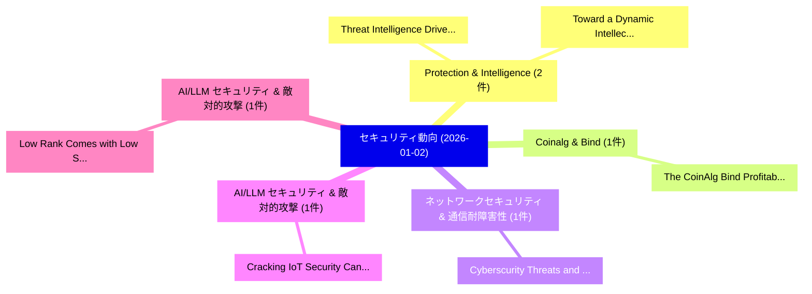

# 📅 02_daily: 日次エグゼクティブサマリー報告書 (2026-01-02)

**集計日時**: 2026-10-02 23:05:52 UTC  
**対象日付**: 2026-01-02  
**本日収集論文数**: 11 件  

---

## 💡 主要セキュリティ動向・脅威インサイト (Executive Insights)

本日の収集論文（計 11 件）において、以下の重点セキュリティ領域で活発な研究動向が確認されました：
- **Protection & Intelligence** (2 件): 注目論文として 「Threat Intelligence Driven IP ...」、「Toward a Dynamic Intellectual ...」 等が発表され、実務防御および攻撃検証の進展が見られます。
- **Coinalg & Bind** (1 件): 注目論文として 「The CoinAlg Bind: Profitabilit...」 等が発表され、実務防御および攻撃検証の進展が見られます。
- **ネットワークセキュリティ & 通信耐障害性** (1 件): 注目論文として 「Cyberscurity Threats and Defen...」 等が発表され、実務防御および攻撃検証の進展が見られます。
- **AI/LLM セキュリティ & 敵対的攻撃** (1 件): 注目論文として 「Cracking IoT Security: Can LLM...」 等が発表され、実務防御および攻撃検証の進展が見られます。
- **AI/LLM セキュリティ & 敵対的攻撃** (1 件): 注目論文として 「Low Rank Comes with Low Securi...」 等が発表され、実務防御および攻撃検証の進展が見られます。

### 🗺️ 技術・脅威トピックマインドマップ

---

## 📌 日次セキュリティ論文一覧 (日本語表形式)

| No | arXiv ID | 論文タイトル (日本語訳) | 重要キーワード | 構造化エグゼクティブ要約 (背景・提案・影響) | 脅威分類 | 詳細リンク |
|---|---|---|---|---|---|---|
| 1 | `2601.00523v1` | [The CoinAlg Bind: Profitability-Fairness Tradeoffs in Collective Investment Algorithms（セキュリティ分析論文）](../../okf/papers/2026-01-02/2601.00523.md) | `Collective Investment Algorithms`, `Fairness Tradeoffs`, `Profitability-Fairness Tradeoffs` | 【提案】概要 (Overview & Key Finding) 本論文「The CoinAlg Bind: Profitability-Fairness Tradeoffs in C...。実証評価により経営層・セキュリティ管理者向け推奨アクション (E... | `executive-summary` | [arXiv](https://arxiv.org/abs/2601.00523v1) &#124; [OKF](../../okf/papers/2026-01-02/2601.00523.md) |
| 2 | `2601.00556v1` | [Cyberscurity Threats and Defense Mechanisms in IoT network（セキュリティ分析論文）](../../okf/papers/2026-01-02/2601.00556.md) | `Cyberscurity Threats`, `Defense Mechanisms`, `Trung Dao` | 【提案】概要 (Overview & Key Finding) 本論文「Cyberscurity Threats and Defense Mechanisms in IoT netw...。実証評価により経営層・セキュリティ管理者向け推奨アクション (E... | `executive-summary` | [arXiv](https://arxiv.org/abs/2601.00556v1) &#124; [OKF](../../okf/papers/2026-01-02/2601.00556.md) |
| 3 | `2601.00559v1` | [Cracking IoT Security: Can LLMs Outsmart Static Analysis Tools?（セキュリティ分析論文）](../../okf/papers/2026-01-02/2601.00559.md) | `Jason Quantrill`, `Noura Khajehnouri`, `Zihan Guo` | 【提案】### (日本語題名: Cracking IoT Security: Can LLMs Outsmart Static Analysis Tools?（セキュリティ分析論文）...。実証評価によりAlalfi - **公開日時**:。 | `cs.AI` | [arXiv](https://arxiv.org/abs/2601.00559v1) &#124; [OKF](../../okf/papers/2026-01-02/2601.00559.md) |
| 4 | `2601.00566v1` | [Low Rank Comes with Low Security: Gradient Assembly Poisoning Attacks against Distributed LoRA-based LLM Systems（セキュリティ分析論文）](../../okf/papers/2026-01-02/2601.00566.md) | `Gradient Assembly Poisoning Attacks`, `Low Rank Comes`, `Low Security` | 【提案】概要 (Overview & Key Finding) 本論文「Low Rank Comes with Low Security: Gradient Assembly Poi...。実証評価により経営層・セキュリティ管理者向け推奨アクション (E... | `cybersecurity` | [arXiv](https://arxiv.org/abs/2601.00566v1) &#124; [OKF](../../okf/papers/2026-01-02/2601.00566.md) |
| 5 | `2601.00571v1` | [Threat Intelligence Driven IP Protection for Entrepreneurial SMEs（セキュリティ分析論文）](../../okf/papers/2026-01-02/2601.00571.md) | `Threat Intelligence Driven`, `Sam Pitruzzello`, `Atif Ahmad` | 【提案】概要 (Overview & Key Finding) 本論文「脅威 Intelligence Driven IP Protection for Entrepreneuria...。実証評価により経営層・セキュリティ管理者向け推奨アクション (E... | `cybersecurity` | [arXiv](https://arxiv.org/abs/2601.00571v1) &#124; [OKF](../../okf/papers/2026-01-02/2601.00571.md) |
| 6 | `2601.00572v1` | [Toward a Dynamic Intellectual Property Protection Model in High-Growth SMEs（セキュリティ分析論文）](../../okf/papers/2026-01-02/2601.00572.md) | `Dynamic Intellectual Property Protection Model`, `High-Growth SMEs`, `Sam Pitruzzello` | 【提案】概要 (Overview & Key Finding) 本論文「Toward a Dynamic Intellectual Property Protection Model...。実証評価により経営層・セキュリティ管理者向け推奨アクション (E... | `cybersecurity` | [arXiv](https://arxiv.org/abs/2601.00572v1) &#124; [OKF](../../okf/papers/2026-01-02/2601.00572.md) |
| 7 | `2601.00627v1` | [Understanding and Characterizing Vulnerabilities in Intelligent Connected Vehicles through Real-World Exploitsに向けて](../../okf/papers/2026-01-02/2601.00627.md) | `Intelligent Connected Vehicles`, `Characterizing Vulnerabilities`, `Towards Understanding` | 【提案】概要 (Overview & Key Finding) 本論文「Understanding and Characterizing Vulnerabilities in Int...。実証評価により経営層・セキュリティ管理者向け推奨アクション (E... | `executive-summary` | [arXiv](https://arxiv.org/abs/2601.00627v1) &#124; [OKF](../../okf/papers/2026-01-02/2601.00627.md) |
| 8 | `2601.00752v4` | [Three results on twisted $G-$codes and skew twisted $G-$codes（セキュリティ分析論文）](../../okf/papers/2026-01-02/2601.00752.md) | `Alvaro Otero Sanchez`, `Raw Meta`, `Executive Summary` | 【提案】概要 (Overview & Key Finding) 本論文「Three results on twisted $G-$codes and skew twisted $G-...。実証評価により経営層・セキュリティ管理者向け推奨アクション (E... | `math.AG` | [arXiv](https://arxiv.org/abs/2601.00752v4) &#124; [OKF](../../okf/papers/2026-01-02/2601.00752.md) |
| 9 | `2601.00783v1` | [Improving Router Security using BERT（セキュリティ分析論文）](../../okf/papers/2026-01-02/2601.00783.md) | `Improving Router Security`, `John Carter`, `Spiros Mancoridis` | 【提案】概要 (Overview & Key Finding) 本論文「Improving Router Security using BERT（セキュリティ分析論文）」（原題: I...。実証評価により経営層・セキュリティ管理者向け推奨アクション (E... | `cybersecurity` | [arXiv](https://arxiv.org/abs/2601.00783v1) &#124; [OKF](../../okf/papers/2026-01-02/2601.00783.md) |
| 10 | `2601.00936v1` | [Emoji-Based Jailbreaking of 大規模言語モデル](../../okf/papers/2026-01-02/2601.00936.md) | `Based Jailbreaking`, `Emoji-Based Jailbreaking`, `Large Language Models` | 【提案】概要 (Overview & Key Finding) 本論文「Emoji-Based ジェイルブレイクing of 大規模言語モデル」（原題: Emoji-Based ジェ...。実証評価により経営層・セキュリティ管理者向け推奨アクション (E... | `cs.AI` | [arXiv](https://arxiv.org/abs/2601.00936v1) &#124; [OKF](../../okf/papers/2026-01-02/2601.00936.md) |
| 11 | `2601.07841v1` | [Post-Quantum Cryptography Key Expansion Method and Anonymous Certificate Scheme Based on NTRU（セキュリティ分析論文）](../../okf/papers/2026-01-02/2601.07841.md) | `Anonymous Certificate Scheme Based`, `Post-Quantum Cryptography`, `Anonymous Certificate Schem` | 【提案】概要 (Overview & Key Finding) 本論文「ポスト量子暗号 Key Expansion Method and Anonymous Certificate ...。実証評価により経営層・セキュリティ管理者向け推奨アクション (E... | `executive-summary` | [arXiv](https://arxiv.org/abs/2601.07841v1) &#124; [OKF](../../okf/papers/2026-01-02/2601.07841.md) |

