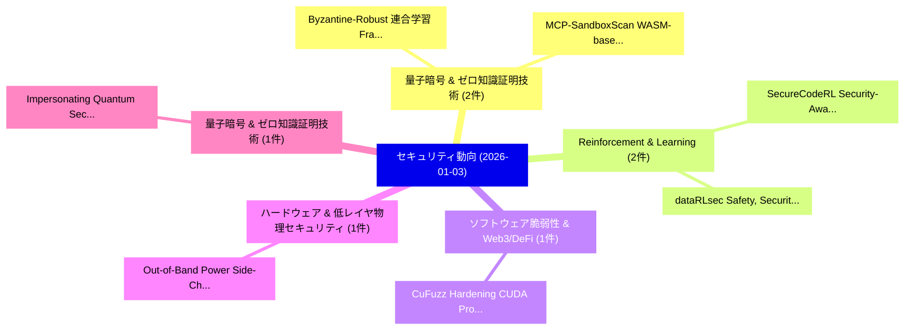

# 📅 02_daily: 日次エグゼクティブサマリー報告書 (2026-01-03)

**集計日時**: 2026-10-02 23:05:52 UTC  
**対象日付**: 2026-01-03  
**本日収集論文数**: 15 件  

---

## 💡 主要セキュリティ動向・脅威インサイト (Executive Insights)

本日の収集論文（計 15 件）において、以下の重点セキュリティ領域で活発な研究動向が確認されました：
- **量子暗号 & ゼロ知識証明技術** (2 件): 注目論文として 「Byzantine-Robust 連合学習 Framewor...」、「MCP-SandboxScan: WASM-based Se...」 等が発表され、実務防御および攻撃検証の進展が見られます。
- **Reinforcement & Learning** (2 件): 注目論文として 「SecureCodeRL: Security-Aware R...」、「dataRLsec: Safety, Security, a...」 等が発表され、実務防御および攻撃検証の進展が見られます。
- **ソフトウェア脆弱性 & Web3/DeFi** (1 件): 注目論文として 「CuFuzz: Hardening CUDA Program...」 等が発表され、実務防御および攻撃検証の進展が見られます。
- **ハードウェア & 低レイヤ物理セキュリティ** (1 件): 注目論文として 「Out-of-Band Power Side-Channel...」 等が発表され、実務防御および攻撃検証の進展が見られます。
- **量子暗号 & ゼロ知識証明技術** (1 件): 注目論文として 「Impersonating Quantum Secrets ...」 等が発表され、実務防御および攻撃検証の進展が見られます。

### 🗺️ 技術・脅威トピックマインドマップ

---

## 📌 日次セキュリティ論文一覧 (日本語表形式)

| No | arXiv ID | 論文タイトル (日本語訳) | 重要キーワード | 構造化エグゼクティブ要約 (背景・提案・影響) | 脅威分類 | 詳細リンク |
|---|---|---|---|---|---|---|
| 1 | `2601.01048v1` | [CuFuzz: Hardening CUDA Programs through Transformation and Fuzzing（セキュリティ分析論文）](../../okf/papers/2026-01-03/2601.01048.md) | `Saurabh Singh`, `Ruobing Han`, `Jaewon Lee` | 【提案】概要 (Overview & Key Finding) 本論文「CuFuzz: Hardening CUDA Programs through Transformation ...。実証評価により経営層・セキュリティ管理者向け推奨アクション (E... | `cybersecurity` | [arXiv](https://arxiv.org/abs/2601.01048v1) &#124; [OKF](../../okf/papers/2026-01-03/2601.01048.md) |
| 2 | `2601.01053v1` | [Byzantine-Robust 連合学習 Framework with Post-Quantum Secure Aggregation for Real-Time Threat Intelligence Sharing in Critical IoT Infrastructure](../../okf/papers/2026-01-03/2601.01053.md) | `Time Threat Intelligence Sharing`, `Quantum Secure Aggregation`, `Post-Quantum Secure` | 【提案】概要 (Overview & Key Finding) 本論文「Byzantine-Robust 連合学習 Framework with Post-量子 Secure Agg...。実証評価により経営層・セキュリティ管理者向け推奨アクション (E... | `executive-summary` | [arXiv](https://arxiv.org/abs/2601.01053v1) &#124; [OKF](../../okf/papers/2026-01-03/2601.01053.md) |
| 3 | `2601.01054v1` | [Out-of-Band Power Side-Channel Detection for Semiconductor Supply Chain Integrity at Scale（セキュリティ分析論文）](../../okf/papers/2026-01-03/2601.01054.md) | `Semiconductor Supply Chain Integrity`, `Band Power Side`, `Channel Detection` | 【提案】概要 (Overview & Key Finding) 本論文「Out-of-Band Power サイドチャネル攻撃 Detection for Semiconductor...。実証評価により経営層・セキュリティ管理者向け推奨アクション (E... | `cybersecurity` | [arXiv](https://arxiv.org/abs/2601.01054v1) &#124; [OKF](../../okf/papers/2026-01-03/2601.01054.md) |
| 4 | `2601.01058v1` | [Impersonating Quantum Secrets over Classical Channels（セキュリティ分析論文）](../../okf/papers/2026-01-03/2601.01058.md) | `Impersonating Quantum Secrets`, `Classical Channels`, `Luowen Qian` | 【提案】概要 (Overview & Key Finding) 本論文「Impersonating 量子 Secrets over Classical Channels（セキュリティ...。実証評価により経営層・セキュリティ管理者向け推奨アクション (E... | `executive-summary` | [arXiv](https://arxiv.org/abs/2601.01058v1) &#124; [OKF](../../okf/papers/2026-01-03/2601.01058.md) |
| 5 | `2601.01068v2` | [Post-Quantum Cryptography for Intelligent Transportation Systems: An Implementation-Focused Review（セキュリティ分析論文）](../../okf/papers/2026-01-03/2601.01068.md) | `Intelligent Transportation Systems`, `Quantum Cryptography`, `Post-Quantum Cryptography` | 【提案】概要 (Overview & Key Finding) 本論文「ポスト量子暗号 for Intelligent Transportation Systems: An Impl...。実証評価により経営層・セキュリティ管理者向け推奨アクション (E... | `cybersecurity` | [arXiv](https://arxiv.org/abs/2601.01068v2) &#124; [OKF](../../okf/papers/2026-01-03/2601.01068.md) |
| 6 | `2601.01109v1` | [NADD: Amplifying Noise for Effective Diffusion-based Adversarial Purification（セキュリティ分析論文）](../../okf/papers/2026-01-03/2601.01109.md) | `Amplifying Noise`, `Effective Diffusion`, `Adversarial Purification` | 【提案】概要 (Overview & Key Finding) 本論文「NADD: Amplifying Noise for Effective Diffusion-based Ad...。実証評価により経営層・セキュリティ管理者向け推奨アクション (E... | `cybersecurity` | [arXiv](https://arxiv.org/abs/2601.01109v1) &#124; [OKF](../../okf/papers/2026-01-03/2601.01109.md) |
| 7 | `2601.01134v1` | [AI-Powered Hybrid Intrusion Detection Framework for Cloud Security Using Novel Metaheuristic Optimization（セキュリティ分析論文）](../../okf/papers/2026-01-03/2601.01134.md) | `AI-Powered Hybrid`, `Maryam Mahdi Alhusseini`, `Alireza Rouhi` | 【提案】概要 (Overview & Key Finding) 本論文「AI-Powered Hybrid Intrusion Detection Framework for Clo...。実証評価により経営層・セキュリティ管理者向け推奨アクション (E... | `cs.AI` | [arXiv](https://arxiv.org/abs/2601.01134v1) &#124; [OKF](../../okf/papers/2026-01-03/2601.01134.md) |
| 8 | `2601.01183v1` | [Comparative Evaluation of VAE, GAN, and SMOTE for Tor Detection in Encrypted Network Traffic（セキュリティ分析論文）](../../okf/papers/2026-01-03/2601.01183.md) | `Encrypted Network Traffic`, `Tor Detection`, `Aswani Kumar Cherukuri` | 【提案】概要 (Overview & Key Finding) 本論文「Comparative Evaluation of VAE, GAN, and SMOTE for Tor D...。実証評価により経営層・セキュリティ管理者向け推奨アクション (E... | `cybersecurity` | [arXiv](https://arxiv.org/abs/2601.01183v1) &#124; [OKF](../../okf/papers/2026-01-03/2601.01183.md) |
| 9 | `2601.01184v1` | [SecureCodeRL: Security-Aware Reinforcement Learning for Code Generation with Partial-Credit Rewards（セキュリティ分析論文）](../../okf/papers/2026-01-03/2601.01184.md) | `Aware Reinforcement Learning`, `Code Generation`, `Credit Rewards` | 【提案】概要 (Overview & Key Finding) 本論文「SecureCodeRL: Security-Aware Reinforcement Learning for...。実証評価により経営層・セキュリティ管理者向け推奨アクション (E... | `cybersecurity` | [arXiv](https://arxiv.org/abs/2601.01184v1) &#124; [OKF](../../okf/papers/2026-01-03/2601.01184.md) |
| 10 | `2601.01214v1` | [Arca: A Lightweight Confidential Container Architecture for Cloud-Native Environments（セキュリティ分析論文）](../../okf/papers/2026-01-03/2601.01214.md) | `Lightweight Confidential Container Architecture`, `Native Environments`, `Cloud-Native Environments` | 【提案】概要 (Overview & Key Finding) 本論文「Arca: A Lightweight Confidential Container Architecture...。実証評価により経営層・セキュリティ管理者向け推奨アクション (E... | `cybersecurity` | [arXiv](https://arxiv.org/abs/2601.01214v1) &#124; [OKF](../../okf/papers/2026-01-03/2601.01214.md) |
| 11 | `2601.01239v1` | [IO-RAE: Information-Obfuscation Reversible Adversarial Example for Audio Privacy Protection（セキュリティ分析論文）](../../okf/papers/2026-01-03/2601.01239.md) | `Obfuscation Reversible Adversarial Example`, `Audio Privacy Protection`, `Information-Obfuscation Reversible` | 【提案】概要 (Overview & Key Finding) 本論文「IO-RAE: Information-Obfuscation Reversible 敵対的サンプル for ...。実証評価により経営層・セキュリティ管理者向け推奨アクション (E... | `cs.MM` | [arXiv](https://arxiv.org/abs/2601.01239v1) &#124; [OKF](../../okf/papers/2026-01-03/2601.01239.md) |
| 12 | `2601.01241v2` | [MCP-SandboxScan: WASM-based Secure Execution and Runtime Analysis for MCP Tools（セキュリティ分析論文）](../../okf/papers/2026-01-03/2601.01241.md) | `Secure Execution`, `WASM-based Secure`, `Zhuoran Tan` | 【提案】概要 (Overview & Key Finding) 本論文「MCP-SandboxScan: WASM-based Secure Execution and Runtim...。実証評価により経営層・セキュリティ管理者向け推奨アクション (E... | `executive-summary` | [arXiv](https://arxiv.org/abs/2601.01241v2) &#124; [OKF](../../okf/papers/2026-01-03/2601.01241.md) |
| 13 | `2601.01287v2` | [Compliance as a Trust Metric（セキュリティ分析論文）](../../okf/papers/2026-01-03/2601.01287.md) | `Trust Metric`, `Wenbo Wu`, `George Konstantinidis` | 【提案】概要 (Overview & Key Finding) 本論文「Compliance as a Trust Metric（セキュリティ分析論文）」（原題: Complianc...。実証評価により経営層・セキュリティ管理者向け推奨アクション (E... | `cybersecurity` | [arXiv](https://arxiv.org/abs/2601.01287v2) &#124; [OKF](../../okf/papers/2026-01-03/2601.01287.md) |
| 14 | `2601.01289v1` | [dataRLsec: Safety, Security, and Reliability With Robust Offline Reinforcement Learning for DPAs（セキュリティ分析論文）](../../okf/papers/2026-01-03/2601.01289.md) | `Naresh Kshetri`, `Raw Meta`, `Executive Summary` | 【提案】概要 (Overview & Key Finding) 本論文「dataRLsec: Safety, Security, and Reliability With Robus...。実証評価により経営層・セキュリティ管理者向け推奨アクション (E... | `cybersecurity` | [arXiv](https://arxiv.org/abs/2601.01289v1) &#124; [OKF](../../okf/papers/2026-01-03/2601.01289.md) |
| 15 | `2601.01296v1` | [Aggressive Compression Enables LLM Weight Theft（セキュリティ分析論文）](../../okf/papers/2026-01-03/2601.01296.md) | `Aggressive Compression Enables`, `Weight Theft`, `Davis Brown` | 【提案】概要 (Overview & Key Finding) 本論文「Aggressive Compression Enables LLM Weight Theft（セキュリティ分...。実証評価により経営層・セキュリティ管理者向け推奨アクション (E... | `cs.AI` | [arXiv](https://arxiv.org/abs/2601.01296v1) &#124; [OKF](../../okf/papers/2026-01-03/2601.01296.md) |

