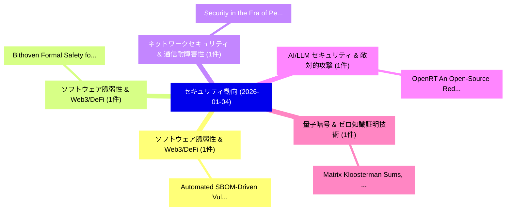

# 📅 02_daily: 日次エグゼクティブサマリー報告書 (2026-01-04)

**集計日時**: 2026-10-02 23:05:52 UTC  
**対象日付**: 2026-01-04  
**本日収集論文数**: 9 件  

---

## 💡 主要セキュリティ動向・脅威インサイト (Executive Insights)

本日の収集論文（計 9 件）において、以下の重点セキュリティ領域で活発な研究動向が確認されました：
- **ソフトウェア脆弱性 & Web3/DeFi** (1 件): 注目論文として 「Automated SBOM-Driven Vulnerab...」 等が発表され、実務防御および攻撃検証の進展が見られます。
- **ソフトウェア脆弱性 & Web3/DeFi** (1 件): 注目論文として 「Bithoven: Formal Safety for Ex...」 等が発表され、実務防御および攻撃検証の進展が見られます。
- **ネットワークセキュリティ & 通信耐障害性** (1 件): 注目論文として 「Security in the Era of Percept...」 等が発表され、実務防御および攻撃検証の進展が見られます。
- **AI/LLM セキュリティ & 敵対的攻撃** (1 件): 注目論文として 「OpenRT: An Open-Source Red Tea...」 等が発表され、実務防御および攻撃検証の進展が見られます。
- **量子暗号 & ゼロ知識証明技術** (1 件): 注目論文として 「Matrix Kloosterman Sums, Rando...」 等が発表され、実務防御および攻撃検証の進展が見られます。

### 🗺️ 技術・脅威トピックマインドマップ

---

## 📌 日次セキュリティ論文一覧 (日本語表形式)

| No | arXiv ID | 論文タイトル (日本語訳) | 重要キーワード | 構造化エグゼクティブ要約 (背景・提案・影響) | 脅威分類 | 詳細リンク |
|---|---|---|---|---|---|---|
| 1 | `2601.01308v1` | [Automated SBOM-Driven Vulnerability Triage for IoT Firmware: A Lightweight Pipeline for Risk Prioritization（セキュリティ分析論文）](../../okf/papers/2026-01-04/2601.01308.md) | `Driven Vulnerability Triage`, `Lightweight Pipeline`, `Risk Prioritization` | 【提案】概要 (Overview & Key Finding) 本論文「Automated SBOM-Driven 脆弱性 Triage for IoT Firmware: A Li...。実証評価により経営層・セキュリティ管理者向け推奨アクション (E... | `cs.NI` | [arXiv](https://arxiv.org/abs/2601.01308v1) &#124; [OKF](../../okf/papers/2026-01-04/2601.01308.md) |
| 2 | `2601.01436v1` | [Bithoven: Formal Safety for Expressive Bitcoin Smart Contracts（セキュリティ分析論文）](../../okf/papers/2026-01-04/2601.01436.md) | `Expressive Bitcoin Smart Contracts`, `Formal Safety`, `Ik Rae Jeong` | 【提案】概要 (Overview & Key Finding) 本論文「Bithoven: Formal Safety for Expressive Bitcoin スマートコントラ...。実証評価により経営層・セキュリティ管理者向け推奨アクション (E... | `cs.PL` | [arXiv](https://arxiv.org/abs/2601.01436v1) &#124; [OKF](../../okf/papers/2026-01-04/2601.01436.md) |
| 3 | `2601.01455v1` | [Security in the Era of Perceptive Networks: A Comprehensive Taxonomic Framework for Integrated Sensing and Communication Security（セキュリティ分析論文）](../../okf/papers/2026-01-04/2601.01455.md) | `Perceptive Networks`, `Integrated Sensing`, `Communication Security` | 【提案】概要 (Overview & Key Finding) 本論文「Security in the Era of Perceptive Networks: A Comprehen...。実証評価により経営層・セキュリティ管理者向け推奨アクション (E... | `cybersecurity` | [arXiv](https://arxiv.org/abs/2601.01455v1) &#124; [OKF](../../okf/papers/2026-01-04/2601.01455.md) |
| 4 | `2601.01592v2` | [OpenRT: An Open-Source Red Teaming Framework for Multimodal LLMs（セキュリティ分析論文）](../../okf/papers/2026-01-04/2601.01592.md) | `Open-Source Red`, `Xin Wang`, `Yunhao Chen` | 【提案】概要 (Overview & Key Finding) 本論文「OpenRT: An Open-Source Red Teaming Framework for Multim...。実証評価により経営層・セキュリティ管理者向け推奨アクション (E... | `cs.CV` | [arXiv](https://arxiv.org/abs/2601.01592v2) &#124; [OKF](../../okf/papers/2026-01-04/2601.01592.md) |
| 5 | `2601.01603v1` | [Matrix Kloosterman Sums, Random Matrix Statistics, and Cryptography（セキュリティ分析論文）](../../okf/papers/2026-01-04/2601.01603.md) | `Matrix Kloosterman Sums`, `Random Matrix Statistics`, `Tianshuo Yang` | 【提案】概要 (Overview & Key Finding) 本論文「Matrix Kloosterman Sums, Random Matrix Statistics, and ...。実証評価により経営層・セキュリティ管理者向け推奨アクション (E... | `executive-summary` | [arXiv](https://arxiv.org/abs/2601.01603v1) &#124; [OKF](../../okf/papers/2026-01-04/2601.01603.md) |
| 6 | `2601.01673v1` | [Exposing Hidden Interfaces: LLM-Guided Type Inference for Reverse Engineering macOS Private Frameworks（セキュリティ分析論文）](../../okf/papers/2026-01-04/2601.01673.md) | `Exposing Hidden Interfaces`, `Guided Type Inference`, `Reverse Engineering` | 【提案】概要 (Overview & Key Finding) 本論文「Exposing Hidden Interfaces: LLM-Guided Type Inference f...。実証評価により経営層・セキュリティ管理者向け推奨アクション (E... | `cs.AI` | [arXiv](https://arxiv.org/abs/2601.01673v1) &#124; [OKF](../../okf/papers/2026-01-04/2601.01673.md) |
| 7 | `2601.03287v1` | [Automated Post-Incident Policy Gap Analysis via Threat-Informed Evidence Mapping using 大規模言語モデル](../../okf/papers/2026-01-04/2601.03287.md) | `Informed Evidence Mapping`, `Automated Post`, `Post-Incident Policy` | 【提案】概要 (Overview & Key Finding) 本論文「Automated Post-Incident Policy Gap Analysis via 脅威-Info...。実証評価により経営層・セキュリティ管理者向け推奨アクション (E... | `cs.AI` | [arXiv](https://arxiv.org/abs/2601.03287v1) &#124; [OKF](../../okf/papers/2026-01-04/2601.03287.md) |
| 8 | `2601.03288v1` | [How Real is Your Jailbreak? Fine-grained Jailbreak Evaluation with Anchored Reference（セキュリティ分析論文）](../../okf/papers/2026-01-04/2601.03288.md) | `Anchored Reference`, `Fine-grained Jailbreak`, `Songyang Liu` | 【提案】Fine-grained ジェイルブレイク Evaluation with Anchored Reference ### (日本語題名: How Real is Your ジ...。実証評価により経営層・セキュリティ管理者向け推奨アクション (E... | `executive-summary` | [arXiv](https://arxiv.org/abs/2601.03288v1) &#124; [OKF](../../okf/papers/2026-01-04/2601.03288.md) |
| 9 | `2601.03289v2` | [Differentiation Between Faults and Cyberattacks through Combined Cyberspace Logs and Physical Measurementsの分析](../../okf/papers/2026-01-04/2601.03289.md) | `Combined Cyberspace Logs`, `Cyberspace Logs`, `Physical Measurements` | 【提案】概要 (Overview & Key Finding) 本論文「Differentiation Between Faults and Cyberattacks through...。実証評価により経営層・セキュリティ管理者向け推奨アクション (E... | `cybersecurity` | [arXiv](https://arxiv.org/abs/2601.03289v2) &#124; [OKF](../../okf/papers/2026-01-04/2601.03289.md) |

