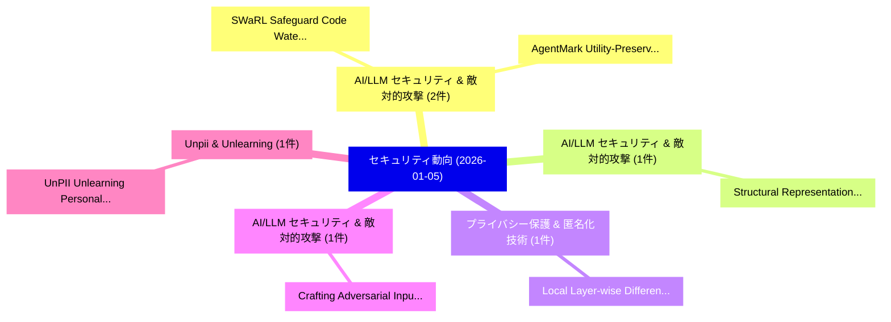

# 📅 02_daily: 日次エグゼクティブサマリー報告書 (2026-01-05)

**集計日時**: 2026-10-02 23:05:53 UTC  
**対象日付**: 2026-01-05  
**本日収集論文数**: 18 件  

---

## 💡 主要セキュリティ動向・脅威インサイト (Executive Insights)

本日の収集論文（計 18 件）において、以下の重点セキュリティ領域で活発な研究動向が確認されました：
- **AI/LLM セキュリティ & 敵対的攻撃** (2 件): 注目論文として 「SWaRL: Safeguard Code Watermar...」、「AgentMark: Utility-Preserving ...」 等が発表され、実務防御および攻撃検証の進展が見られます。
- **AI/LLM セキュリティ & 敵対的攻撃** (1 件): 注目論文として 「Structural Representations for...」 等が発表され、実務防御および攻撃検証の進展が見られます。
- **プライバシー保護 & 匿名化技術** (1 件): 注目論文として 「Local Layer-wise Differential ...」 等が発表され、実務防御および攻撃検証の進展が見られます。
- **AI/LLM セキュリティ & 敵対的攻撃** (1 件): 注目論文として 「Crafting Adversarial Inputs fo...」 等が発表され、実務防御および攻撃検証の進展が見られます。
- **Unpii & Unlearning** (1 件): 注目論文として 「UnPII: Unlearning Personally I...」 等が発表され、実務防御および攻撃検証の進展が見られます。

### 🗺️ 技術・脅威トピックマインドマップ

---

## 📌 日次セキュリティ論文一覧 (日本語表形式)

| No | arXiv ID | 論文タイトル (日本語訳) | 重要キーワード | 構造化エグゼクティブ要約 (背景・提案・影響) | 脅威分類 | 詳細リンク |
|---|---|---|---|---|---|---|
| 1 | `2601.01723v1` | [Structural Representations for Cross-Attack Generalization in AI Agent Threat Detection（セキュリティ分析論文）](../../okf/papers/2026-01-05/2601.01723.md) | `Agent Threat Detection`, `Structural Representations`, `Attack Generalization` | 【提案】概要 (Overview & Key Finding) 本論文「Structural Representations for Cross-Attack Generalizat...。実証評価により経営層・セキュリティ管理者向け推奨アクション (E... | `cybersecurity` | [arXiv](https://arxiv.org/abs/2601.01723v1) &#124; [OKF](../../okf/papers/2026-01-05/2601.01723.md) |
| 2 | `2601.01737v1` | [Local Layer-wise Differential Privacy in 連合学習](../../okf/papers/2026-01-05/2601.01737.md) | `Local Layer`, `Differential Privacy`, `Layer-wise Differential` | 【提案】概要 (Overview & Key Finding) 本論文「Local Layer-wise 差分プライバシー in 連合学習」（原題: Local Layer-wise...。実証評価により経営層・セキュリティ管理者向け推奨アクション (E... | `cybersecurity` | [arXiv](https://arxiv.org/abs/2601.01737v1) &#124; [OKF](../../okf/papers/2026-01-05/2601.01737.md) |
| 3 | `2601.01747v4` | [Crafting Adversarial Inputs for Large Vision-Language Models Using Black-Box Optimization（セキュリティ分析論文）](../../okf/papers/2026-01-05/2601.01747.md) | `Language Models Using Black`, `Crafting Adversarial Inputs`, `Large Vision` | 【提案】概要 (Overview & Key Finding) 本論文「Crafting Adversarial Inputs for Large Vision-Language M...。実証評価により経営層・セキュリティ管理者向け推奨アクション (E... | `cs.AI` | [arXiv](https://arxiv.org/abs/2601.01747v4) &#124; [OKF](../../okf/papers/2026-01-05/2601.01747.md) |
| 4 | `2601.01786v1` | [UnPII: Unlearning Personally Identifiable Information with Quantifiable Exposure Risk（セキュリティ分析論文）](../../okf/papers/2026-01-05/2601.01786.md) | `Unlearning Personally Identifiable Information`, `Quantifiable Exposure Risk`, `Intae Jeon` | 【提案】概要 (Overview & Key Finding) 本論文「UnPII: Unlearning Personally Identifiable Information w...。実証評価により経営層・セキュリティ管理者向け推奨アクション (E... | `executive-summary` | [arXiv](https://arxiv.org/abs/2601.01786v1) &#124; [OKF](../../okf/papers/2026-01-05/2601.01786.md) |
| 5 | `2601.02177v2` | [Why Commodity WiFi Sensors Fail at Multi-Person Gait Identification: A Systematic Analysis Using ESP32（セキュリティ分析論文）](../../okf/papers/2026-01-05/2601.02177.md) | `Person Gait Identification`, `Sensors Fail`, `Multi-Person Gait` | 【提案】概要 (Overview & Key Finding) 本論文「Why Commodity WiFi Sensors Fail at Multi-Person Gait Id...。実証評価により経営層・セキュリティ管理者向け推奨アクション (E... | `cs.CV` | [arXiv](https://arxiv.org/abs/2601.02177v2) &#124; [OKF](../../okf/papers/2026-01-05/2601.02177.md) |
| 6 | `2601.02203v1` | [Parameter-Efficient Domain Adaption for CSI Crowd-Counting via Self-Supervised Learning with Adapter Modules（セキュリティ分析論文）](../../okf/papers/2026-01-05/2601.02203.md) | `Efficient Domain Adaption`, `Parameter-Efficient Domain`, `Supervised Learning` | 【提案】概要 (Overview & Key Finding) 本論文「Parameter-Efficient Domain Adaption for CSI Crowd-Count...。実証評価により経営層・セキュリティ管理者向け推奨アクション (E... | `cs.CV` | [arXiv](https://arxiv.org/abs/2601.02203v1) &#124; [OKF](../../okf/papers/2026-01-05/2601.02203.md) |
| 7 | `2601.02205v2` | [From Chat Control to Robot Control: Implications of the Chat Control Proposal for Human-Robot Interaction（セキュリティ分析論文）](../../okf/papers/2026-01-05/2601.02205.md) | `Chat Control Proposal`, `Robot Control`, `Robot Interaction` | 【提案】概要 (Overview & Key Finding) 本論文「From Chat Control to Robot Control: Implications of the...。実証評価により経営層・セキュリティ管理者向け推奨アクション (E... | `executive-summary` | [arXiv](https://arxiv.org/abs/2601.02205v2) &#124; [OKF](../../okf/papers/2026-01-05/2601.02205.md) |
| 8 | `2601.02237v1` | [Quantum AI for サイバーセキュリティ: A hybrid Quantum-Classical models for attack path analysis](../../okf/papers/2026-01-05/2601.02237.md) | `Quantum-Classical models`, `Waqas Ahmed`, `Raw Meta` | 【提案】概要 (Overview & Key Finding) 本論文「量子 AI for サイバーセキュリティ: A hybrid 量子-Classical models for ...。実証評価により経営層・セキュリティ管理者向け推奨アクション (E... | `executive-summary` | [arXiv](https://arxiv.org/abs/2601.02237v1) &#124; [OKF](../../okf/papers/2026-01-05/2601.02237.md) |
| 9 | `2601.02245v1` | [MOZAIK: A Privacy-Preserving Analytics Platform for IoT Data Using MPC and FHE（セキュリティ分析論文）](../../okf/papers/2026-01-05/2601.02245.md) | `Preserving Analytics Platform`, `Data Using`, `Privacy-Preserving Analytics` | 【提案】概要 (Overview & Key Finding) 本論文「MOZAIK: A Privacy-Preserving Analytics Platform for IoT...。実証評価により経営層・セキュリティ管理者向け推奨アクション (E... | `cybersecurity` | [arXiv](https://arxiv.org/abs/2601.02245v1) &#124; [OKF](../../okf/papers/2026-01-05/2601.02245.md) |
| 10 | `2601.02254v1` | [Vouchsafe: A Zero-Infrastructure Capability Graph Model for Offline Identity and Trust（セキュリティ分析論文）](../../okf/papers/2026-01-05/2601.02254.md) | `Infrastructure Capability Graph Model`, `Offline Identity`, `Zero-Infrastructure Capability` | 【提案】概要 (Overview & Key Finding) 本論文「Vouchsafe: A Zero-Infrastructure Capability Graph Model...。実証評価により経営層・セキュリティ管理者向け推奨アクション (E... | `executive-summary` | [arXiv](https://arxiv.org/abs/2601.02254v1) &#124; [OKF](../../okf/papers/2026-01-05/2601.02254.md) |
| 11 | `2601.02257v1` | [Improved Accuracy for Private Continual Cardinality Estimation in Fully Dynamic Streams via Matrix Factorization（セキュリティ分析論文）](../../okf/papers/2026-01-05/2601.02257.md) | `Private Continual Cardinality Estimation`, `Fully Dynamic Streams`, `Improved Accuracy` | 【提案】概要 (Overview & Key Finding) 本論文「Improved Accuracy for Private Continual Cardinality Est...。実証評価により経営層・セキュリティ管理者向け推奨アクション (E... | `executive-summary` | [arXiv](https://arxiv.org/abs/2601.02257v1) &#124; [OKF](../../okf/papers/2026-01-05/2601.02257.md) |
| 12 | `2601.02438v3` | [Focus on What Matters: Fisher-Guided Adaptive Multimodal Fusion for 脆弱性検出](../../okf/papers/2026-01-05/2601.02438.md) | `Guided Adaptive Multimodal Fusion`, `Fisher-Guided Adaptive`, `Vulnerability Detection` | 【提案】概要 (Overview & Key Finding) 本論文「Focus on What Matters: Fisher-Guided Adaptive Multimoda...。実証評価により経営層・セキュリティ管理者向け推奨アクション (E... | `cs.AI` | [arXiv](https://arxiv.org/abs/2601.02438v3) &#124; [OKF](../../okf/papers/2026-01-05/2601.02438.md) |
| 13 | `2601.02444v1` | [VocalBridge: Latent Diffusion-Bridge Purification for Defeating Perturbation-Based Voiceprint Defenses（セキュリティ分析論文）](../../okf/papers/2026-01-05/2601.02444.md) | `Based Voiceprint Defenses`, `Latent Diffusion`, `Bridge Purification` | 【提案】概要 (Overview & Key Finding) 本論文「VocalBridge: Latent Diffusion-Bridge Purification for D...。実証評価により経営層・セキュリティ管理者向け推奨アクション (E... | `cs.AI` | [arXiv](https://arxiv.org/abs/2601.02444v1) &#124; [OKF](../../okf/papers/2026-01-05/2601.02444.md) |
| 14 | `2601.02496v2` | [APoW: Auditable Proof-of-Work Against Block Withholding Attacks（セキュリティ分析論文）](../../okf/papers/2026-01-05/2601.02496.md) | `Auditable Proof`, `Sergio Demian Lerner`, `Raw Meta` | 【提案】概要 (Overview & Key Finding) 本論文「APoW: Auditable Proof-of-Work Against Block Withholding...。実証評価により経営層・セキュリティ管理者向け推奨アクション (E... | `executive-summary` | [arXiv](https://arxiv.org/abs/2601.02496v2) &#124; [OKF](../../okf/papers/2026-01-05/2601.02496.md) |
| 15 | `2601.02518v1` | [Diffusion Computation versus Quantum Computation: A Comparative Model for Order Finding and Factoring（セキュリティ分析論文）](../../okf/papers/2026-01-05/2601.02518.md) | `Diffusion Computation`, `Quantum Computation`, `Comparative Model` | 【提案】概要 (Overview & Key Finding) 本論文「Diffusion Computation versus 量子 Computation: A Comparat...。実証評価により経営層・セキュリティ管理者向け推奨アクション (E... | `math.SP` | [arXiv](https://arxiv.org/abs/2601.02518v1) &#124; [OKF](../../okf/papers/2026-01-05/2601.02518.md) |
| 16 | `2601.02596v1` | [Coordinated Multi-Domain Deception: A Stackelberg Game Approach（セキュリティ分析論文）](../../okf/papers/2026-01-05/2601.02596.md) | `Coordinated Multi`, `Domain Deception`, `Multi-Domain Deception` | 【提案】概要 (Overview & Key Finding) 本論文「Coordinated Multi-Domain Deception: A Stackelberg Game ...。実証評価により経営層・セキュリティ管理者向け推奨アクション (E... | `cybersecurity` | [arXiv](https://arxiv.org/abs/2601.02596v1) &#124; [OKF](../../okf/papers/2026-01-05/2601.02596.md) |
| 17 | `2601.02602v2` | [SWaRL: Safeguard Code Watermarking via Reinforcement Learning（セキュリティ分析論文）](../../okf/papers/2026-01-05/2601.02602.md) | `Safeguard Code Watermarking`, `Reinforcement Learning`, `Neusha Javidnia` | 【提案】概要 (Overview & Key Finding) 本論文「SWaRL: Safeguard Code Watermarking via Reinforcement Le...。実証評価により経営層・セキュリティ管理者向け推奨アクション (E... | `executive-summary` | [arXiv](https://arxiv.org/abs/2601.02602v2) &#124; [OKF](../../okf/papers/2026-01-05/2601.02602.md) |
| 18 | `2601.03294v2` | [AgentMark: Utility-Preserving Behavioral Watermarking for Agents（セキュリティ分析論文）](../../okf/papers/2026-01-05/2601.03294.md) | `Preserving Behavioral Watermarking`, `Utility-Preserving Behavioral`, `Kaibo Huang` | 【提案】概要 (Overview & Key Finding) 本論文「AgentMark: Utility-Preserving Behavioral Watermarking f...。実証評価により経営層・セキュリティ管理者向け推奨アクション (E... | `cs.AI` | [arXiv](https://arxiv.org/abs/2601.03294v2) &#124; [OKF](../../okf/papers/2026-01-05/2601.03294.md) |

