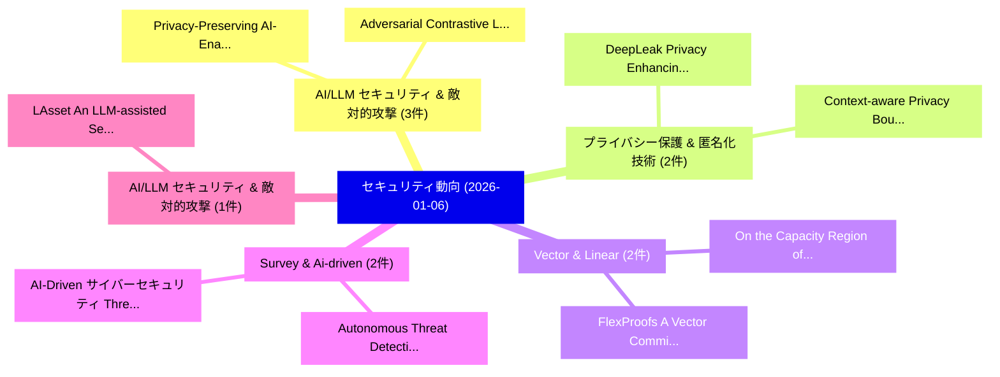

# 📅 02_daily: 日次エグゼクティブサマリー報告書 (2026-01-06)

**集計日時**: 2026-10-02 23:05:53 UTC  
**対象日付**: 2026-01-06  
**本日収集論文数**: 26 件  

---

## 💡 主要セキュリティ動向・脅威インサイト (Executive Insights)

本日の収集論文（計 26 件）において、以下の重点セキュリティ領域で活発な研究動向が確認されました：
- **AI/LLM セキュリティ & 敵対的攻撃** (3 件): 注目論文として 「Adversarial Contrastive Learni...」、「Privacy-Preserving AI-Enabled ...」 等が発表され、実務防御および攻撃検証の進展が見られます。
- **プライバシー保護 & 匿名化技術** (2 件): 注目論文として 「Context-aware Privacy Bounds f...」、「DeepLeak: Privacy Enhancing Ha...」 等が発表され、実務防御および攻撃検証の進展が見られます。
- **Vector & Linear** (2 件): 注目論文として 「FlexProofs: A Vector Commitmen...」、「On the Capacity Region of Indi...」 等が発表され、実務防御および攻撃検証の進展が見られます。
- **Survey & Ai-driven** (2 件): 注目論文として 「Autonomous Threat Detection an...」、「AI-Driven サイバーセキュリティ Threats: ...」 等が発表され、実務防御および攻撃検証の進展が見られます。
- **AI/LLM セキュリティ & 敵対的攻撃** (1 件): 注目論文として 「LAsset: An LLM-assisted Securi...」 等が発表され、実務防御および攻撃検証の進展が見られます。

### 🗺️ 技術・脅威トピックマインドマップ

---

## 📌 日次セキュリティ論文一覧 (日本語表形式)

| No | arXiv ID | 論文タイトル (日本語訳) | 重要キーワード | 構造化エグゼクティブ要約 (背景・提案・影響) | 脅威分類 | 詳細リンク |
|---|---|---|---|---|---|---|
| 1 | `2601.02624v2` | [LAsset: An LLM-assisted Security Asset Identification Framework for System-on-Chip (SoC) Verification（セキュリティ分析論文）](../../okf/papers/2026-01-06/2601.02624.md) | `LLM-assisted Security`, `Md Ajoad Hasan`, `Khan Thamid Hasan` | 【提案】概要 (Overview & Key Finding) 本論文「LAsset: An LLM-assisted Security Asset Identification F...。実証評価により経営層・セキュリティ管理者向け推奨アクション (E... | `cs.AI` | [arXiv](https://arxiv.org/abs/2601.02624v2) &#124; [OKF](../../okf/papers/2026-01-06/2601.02624.md) |
| 2 | `2601.02680v1` | [Adversarial Contrastive Learning for LLM Quantization Attacks（セキュリティ分析論文）](../../okf/papers/2026-01-06/2601.02680.md) | `Adversarial Contrastive Learning`, `Quantization Attacks`, `Dinghong Song` | 【提案】概要 (Overview & Key Finding) 本論文「Adversarial Contrastive Learning for LLM Quantization A...。実証評価により経営層・セキュリティ管理者向け推奨アクション (E... | `executive-summary` | [arXiv](https://arxiv.org/abs/2601.02680v1) &#124; [OKF](../../okf/papers/2026-01-06/2601.02680.md) |
| 3 | `2601.02698v1` | [Enterprise Identity Integration for AI-Assisted Developer Services: Architecture, Implementation, and Case Study（セキュリティ分析論文）](../../okf/papers/2026-01-06/2601.02698.md) | `Enterprise Identity Integration`, `Assisted Developer Services`, `AI-Assisted Developer` | 【提案】概要 (Overview & Key Finding) 本論文「Enterprise Identity Integration for AI-Assisted Develop...。実証評価により経営層・セキュリティ管理者向け推奨アクション (E... | `executive-summary` | [arXiv](https://arxiv.org/abs/2601.02698v1) &#124; [OKF](../../okf/papers/2026-01-06/2601.02698.md) |
| 4 | `2601.02720v1` | [Privacy-Preserving AI-Enabled Decentralized Learning and Employment Records System（セキュリティ分析論文）](../../okf/papers/2026-01-06/2601.02720.md) | `Enabled Decentralized Learning`, `Employment Records System`, `Privacy-Preserving AI` | 【提案】概要 (Overview & Key Finding) 本論文「Privacy-Preserving AI-Enabled Decentralized Learning an...。実証評価により経営層・セキュリティ管理者向け推奨アクション (E... | `cs.AI` | [arXiv](https://arxiv.org/abs/2601.02720v1) &#124; [OKF](../../okf/papers/2026-01-06/2601.02720.md) |
| 5 | `2601.02751v2` | [Window-based Membership Inference Attacks Against Fine-tuned 大規模言語モデル](../../okf/papers/2026-01-06/2601.02751.md) | `Window-based Membership`, `Large Language Models`, `Fine-tuned Large` | 【提案】概要 (Overview & Key Finding) 本論文「Window-based Membership Inference Attacks Against Fine-...。実証評価により経営層・セキュリティ管理者向け推奨アクション (E... | `cs.AI` | [arXiv](https://arxiv.org/abs/2601.02751v2) &#124; [OKF](../../okf/papers/2026-01-06/2601.02751.md) |
| 6 | `2601.02855v2` | [Context-aware Privacy Bounds for Linear Queries（セキュリティ分析論文）](../../okf/papers/2026-01-06/2601.02855.md) | `Privacy Bounds`, `Linear Queries`, `Context-aware Privacy` | 【提案】概要 (Overview & Key Finding) 本論文「Context-aware Privacy Bounds for Linear Queries（セキュリティ分...。実証評価によりOechtering - **公開日時**: `2... | `executive-summary` | [arXiv](https://arxiv.org/abs/2601.02855v2) &#124; [OKF](../../okf/papers/2026-01-06/2601.02855.md) |
| 7 | `2601.02914v1` | [Vulnerabilities of Audio-Based Biometric Authentication Systems Against Deepfake Speech Synthesis（セキュリティ分析論文）](../../okf/papers/2026-01-06/2601.02914.md) | `Audio-Based Biometric`, `Chen Jason Zhang`, `Mengze Hong` | 【提案】概要 (Overview & Key Finding) 本論文「Vulnerabilities of Audio-Based Biometric Authentication...。実証評価により経営層・セキュリティ管理者向け推奨アクション (E... | `executive-summary` | [arXiv](https://arxiv.org/abs/2601.02914v1) &#124; [OKF](../../okf/papers/2026-01-06/2601.02914.md) |
| 8 | `2601.02941v1` | [SastBench: A Benchmark for Testing Agentic SAST Triage（セキュリティ分析論文）](../../okf/papers/2026-01-06/2601.02941.md) | `Testing Agentic`, `Jake Feiglin`, `Guy Dar` | 【提案】概要 (Overview & Key Finding) 本論文「SastBench: A Benchmark for Testing Agentic SAST Triage（...。実証評価により経営層・セキュリティ管理者向け推奨アクション (E... | `cs.AI` | [arXiv](https://arxiv.org/abs/2601.02941v1) &#124; [OKF](../../okf/papers/2026-01-06/2601.02941.md) |
| 9 | `2601.02947v1` | [Quality Degradation Attack in Synthetic Data（セキュリティ分析論文）](../../okf/papers/2026-01-06/2601.02947.md) | `Quality Degradation Attack`, `Synthetic Data`, `Qinyi Liu` | 【提案】概要 (Overview & Key Finding) 本論文「Quality Degradation Attack in Synthetic Data（セキュリティ分析論文...。実証評価によりVergara Barrios - **公開日時*... | `cybersecurity` | [arXiv](https://arxiv.org/abs/2601.02947v1) &#124; [OKF](../../okf/papers/2026-01-06/2601.02947.md) |
| 10 | `2601.02949v2` | [Exploring Blockchain Interoperability: Frameworks, Use Cases, and Future Challenges（セキュリティ分析論文）](../../okf/papers/2026-01-06/2601.02949.md) | `Exploring Blockchain Interoperability`, `Use Cases`, `Future Challenges` | 【提案】概要 (Overview & Key Finding) 本論文「Exploring Blockchain Interoperability: Frameworks, Use ...。実証評価により経営層・セキュリティ管理者向け推奨アクション (E... | `executive-summary` | [arXiv](https://arxiv.org/abs/2601.02949v2) &#124; [OKF](../../okf/papers/2026-01-06/2601.02949.md) |
| 11 | `2601.02981v1` | [Developing and Evaluating Lightweight Cryptographic Algorithms for Secure Embedded Systems in IoT Devices（セキュリティ分析論文）](../../okf/papers/2026-01-06/2601.02981.md) | `Evaluating Lightweight Cryptographic Algorithms`, `Secure Embedded Systems`, `Brahim Khalil Sedraoui` | 【提案】概要 (Overview & Key Finding) 本論文「Developing and Evaluating Lightweight Cryptographic Alg...。実証評価により経営層・セキュリティ管理者向け推奨アクション (E... | `cybersecurity` | [arXiv](https://arxiv.org/abs/2601.02981v1) &#124; [OKF](../../okf/papers/2026-01-06/2601.02981.md) |
| 12 | `2601.02984v1` | [Selfish Mining in Multi-Attacker Scenarios: An Empirical Evaluation of Nakamoto, Fruitchain, and Strongchain（セキュリティ分析論文）](../../okf/papers/2026-01-06/2601.02984.md) | `Selfish Mining`, `Attacker Scenarios`, `Multi-Attacker Scenarios` | 【提案】概要 (Overview & Key Finding) 本論文「Selfish Mining in Multi-Attacker Scenarios: An Empirica...。実証評価により経営層・セキュリティ管理者向け推奨アクション (E... | `cybersecurity` | [arXiv](https://arxiv.org/abs/2601.02984v1) &#124; [OKF](../../okf/papers/2026-01-06/2601.02984.md) |
| 13 | `2601.03005v1` | [JPU: Bridging Jailbreak Defense and Unlearning via On-Policy Path Rectification（セキュリティ分析論文）](../../okf/papers/2026-01-06/2601.03005.md) | `Bridging Jailbreak Defense`, `Policy Path Rectification`, `On-Policy Path` | 【提案】概要 (Overview & Key Finding) 本論文「JPU: Bridging ジェイルブレイク Defense and Unlearning via On-Po...。実証評価により経営層・セキュリティ管理者向け推奨アクション (E... | `cs.AI` | [arXiv](https://arxiv.org/abs/2601.03005v1) &#124; [OKF](../../okf/papers/2026-01-06/2601.03005.md) |
| 14 | `2601.03013v4` | [LLMs, You Can Evaluate It! Design of Multi-perspective Report Evaluation for Security Operation Centers（セキュリティ分析論文）](../../okf/papers/2026-01-06/2601.03013.md) | `Security Operation Centers`, `Multi-perspective Report`, `Hiroyuki Okada` | 【提案】Design of Multi-perspective Report Evaluation for Security Operation Centers ### (日本語題名...。実証評価により経営層・セキュリティ管理者向け推奨アクション (E... | `cybersecurity` | [arXiv](https://arxiv.org/abs/2601.03013v4) &#124; [OKF](../../okf/papers/2026-01-06/2601.03013.md) |
| 15 | `2601.03031v2` | [FlexProofs: A Vector Commitment with Flexible Linear Time for Computing All Proofs（セキュリティ分析論文）](../../okf/papers/2026-01-06/2601.03031.md) | `Flexible Linear Time`, `Vector Commitment`, `Liang Feng Zhang` | 【提案】概要 (Overview & Key Finding) 本論文「FlexProofs: A Vector Commitment with Flexible Linear Ti...。実証評価により経営層・セキュリティ管理者向け推奨アクション (E... | `cs.LO` | [arXiv](https://arxiv.org/abs/2601.03031v2) &#124; [OKF](../../okf/papers/2026-01-06/2601.03031.md) |
| 16 | `2601.03241v1` | [On the Capacity Region of Individual Key Rates in Vector Linear Secure Aggregation（セキュリティ分析論文）](../../okf/papers/2026-01-06/2601.03241.md) | `Vector Linear Secure Aggregation`, `Individual Key Rates`, `Capacity Region` | 【提案】概要 (Overview & Key Finding) 本論文「On the Capacity Region of Individual Key Rates in Vecto...。実証評価により経営層・セキュリティ管理者向け推奨アクション (E... | `cs.NI` | [arXiv](https://arxiv.org/abs/2601.03241v1) &#124; [OKF](../../okf/papers/2026-01-06/2601.03241.md) |
| 17 | `2601.03242v2` | [SLIM: Stealthy Low-Coverage Black-Box Watermarking via Latent-Space Confusion Zones（セキュリティ分析論文）](../../okf/papers/2026-01-06/2601.03242.md) | `Space Confusion Zones`, `Stealthy Low`, `Coverage Black` | 【提案】概要 (Overview & Key Finding) 本論文「SLIM: Stealthy Low-Coverage Black-Box Watermarking via ...。実証評価により経営層・セキュリティ管理者向け推奨アクション (E... | `cybersecurity` | [arXiv](https://arxiv.org/abs/2601.03242v2) &#124; [OKF](../../okf/papers/2026-01-06/2601.03242.md) |
| 18 | `2601.03300v1` | [TRYLOCK: Defense-in-Depth Against LLM Jailbreaks via Layered Preference and Representation Engineering（セキュリティ分析論文）](../../okf/papers/2026-01-06/2601.03300.md) | `Layered Preference`, `Representation Engineering`, `Scott Thornton` | 【提案】概要 (Overview & Key Finding) 本論文「TRYLOCK: Defense-in-Depth Against LLM ジェイルブレイクs via Lay...。実証評価により経営層・セキュリティ管理者向け推奨アクション (E... | `executive-summary` | [arXiv](https://arxiv.org/abs/2601.03300v1) &#124; [OKF](../../okf/papers/2026-01-06/2601.03300.md) |
| 19 | `2601.03303v1` | [Autonomous Threat Detection and Response in Cloud Security: A Comprehensive Survey of AI-Driven Strategies（セキュリティ分析論文）](../../okf/papers/2026-01-06/2601.03303.md) | `Autonomous Threat Detection`, `Cloud Security`, `Comprehensive Survey` | 【提案】概要 (Overview & Key Finding) 本論文「Autonomous 脅威 Detection and Response in Cloud Security:...。実証評価により経営層・セキュリティ管理者向け推奨アクション (E... | `cybersecurity` | [arXiv](https://arxiv.org/abs/2601.03303v1) &#124; [OKF](../../okf/papers/2026-01-06/2601.03303.md) |
| 20 | `2601.03304v1` | [AI-Driven サイバーセキュリティ Threats: A Survey of Emerging Risks and Defensive Strategies](../../okf/papers/2026-01-06/2601.03304.md) | `Emerging Risks`, `Defensive Strategies`, `Driven Cybersecurity Threats` | 【提案】概要 (Overview & Key Finding) 本論文「AI-Driven サイバーセキュリティ Threats: A Survey of Emerging Risk...。実証評価により経営層・セキュリティ管理者向け推奨アクション (E... | `cs.AI` | [arXiv](https://arxiv.org/abs/2601.03304v1) &#124; [OKF](../../okf/papers/2026-01-06/2601.03304.md) |
| 21 | `2601.03420v1` | [Jailbreaking LLMs Without Gradients or Priors: Effective and Transferable Attacks（セキュリティ分析論文）](../../okf/papers/2026-01-06/2601.03420.md) | `Without Gradients`, `Transferable Attacks`, `Zhakshylyk Nurlanov` | 【提案】背景とセキュリティ上の課題 (Background & Problem) 本研究はサイバー脅威環境におけるセキュリティ構造・脆弱性の検証を目的としています。(主要検出項目: ...。実証評価により経営層・セキュリティ管理者向け推奨アクション (E... | `cs.AI` | [arXiv](https://arxiv.org/abs/2601.03420v1) &#124; [OKF](../../okf/papers/2026-01-06/2601.03420.md) |
| 22 | `2601.03429v1` | [DeepLeak: Privacy Enhancing Hardening of Model Explanations Against Membership Leakage（セキュリティ分析論文）](../../okf/papers/2026-01-06/2601.03429.md) | `Privacy Enhancing Hardening`, `Firas Ben Hmida`, `Zain Sbeih` | 【提案】概要 (Overview & Key Finding) 本論文「DeepLeak: Privacy Enhancing Hardening of Model Explanat...。実証評価により経営層・セキュリティ管理者向け推奨アクション (E... | `executive-summary` | [arXiv](https://arxiv.org/abs/2601.03429v1) &#124; [OKF](../../okf/papers/2026-01-06/2601.03429.md) |
| 23 | `2601.03465v1` | [Security Parameter the LINEture Post-Quantum Digital Signature Schemeの分析](../../okf/papers/2026-01-06/2601.03465.md) | `Post-Quantum Digital`, `Quantum Digital Signature Scheme`, `Quantum Digital Signature` | 【提案】概要 (Overview & Key Finding) 本論文「Security Parameter the LINEture Post-量子 Digital Signatu...。実証評価により経営層・セキュリティ管理者向け推奨アクション (E... | `executive-summary` | [arXiv](https://arxiv.org/abs/2601.03465v1) &#124; [OKF](../../okf/papers/2026-01-06/2601.03465.md) |
| 24 | `2601.04243v1` | [Integrating Multi-Agent Simulation, Behavioral Forensics, and Trust-Aware Machine Learning for Adaptive Insider Threat Detection（セキュリティ分析論文）](../../okf/papers/2026-01-06/2601.04243.md) | `Adaptive Insider Threat Detection`, `Aware Machine Learning`, `Integrating Multi` | 【提案】概要 (Overview & Key Finding) 本論文「Integrating Multi-Agent Simulation, Behavioral Forensic...。実証評価により経営層・セキュリティ管理者向け推奨アクション (E... | `cs.AI` | [arXiv](https://arxiv.org/abs/2601.04243v1) &#124; [OKF](../../okf/papers/2026-01-06/2601.04243.md) |
| 25 | `2601.04247v1` | [Beyond Immediate Activation: Temporally Decoupled Backdoor Attacks on Time Series Forecasting（セキュリティ分析論文）](../../okf/papers/2026-01-06/2601.04247.md) | `Temporally Decoupled Backdoor Attacks`, `Beyond Immediate Activation`, `Time Series Forecasting` | 【提案】概要 (Overview & Key Finding) 本論文「Beyond Immediate Activation: Temporally Decoupled Backd...。実証評価により経営層・セキュリティ管理者向け推奨アクション (E... | `cs.AI` | [arXiv](https://arxiv.org/abs/2601.04247v1) &#124; [OKF](../../okf/papers/2026-01-06/2601.04247.md) |
| 26 | `2602.06048v1` | [Multi-Agent-Driven Cognitive Secure Communications in Satellite-Terrestrial Networks（セキュリティ分析論文）](../../okf/papers/2026-01-06/2602.06048.md) | `Driven Cognitive Secure Communications`, `Terrestrial Networks`, `Satellite-Terrestrial Networks` | 【提案】概要 (Overview & Key Finding) 本論文「Multi-Agent-Driven Cognitive Secure Communications in S...。実証評価により経営層・セキュリティ管理者向け推奨アクション (E... | `executive-summary` | [arXiv](https://arxiv.org/abs/2602.06048v1) &#124; [OKF](../../okf/papers/2026-01-06/2602.06048.md) |

