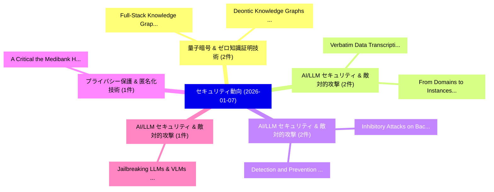

# 📅 02_daily: 日次エグゼクティブサマリー報告書 (2026-01-07)

**集計日時**: 2026-10-02 23:05:53 UTC  
**対象日付**: 2026-01-07  
**本日収集論文数**: 21 件  

---

## 💡 主要セキュリティ動向・脅威インサイト (Executive Insights)

本日の収集論文（計 21 件）において、以下の重点セキュリティ領域で活発な研究動向が確認されました：
- **量子暗号 & ゼロ知識証明技術** (2 件): 注目論文として 「Full-Stack Knowledge Graph and...」、「Deontic Knowledge Graphs for P...」 等が発表され、実務防御および攻撃検証の進展が見られます。
- **AI/LLM セキュリティ & 敵対的攻撃** (2 件): 注目論文として 「Verbatim Data Transcription Fa...」、「From Domains to Instances: Dua...」 等が発表され、実務防御および攻撃検証の進展が見られます。
- **AI/LLM セキュリティ & 敵対的攻撃** (2 件): 注目論文として 「Detection and Prevention of Pr...」、「Inhibitory Attacks on Backdoor...」 等が発表され、実務防御および攻撃検証の進展が見られます。
- **プライバシー保護 & 匿名化技術** (1 件): 注目論文として 「A Critical the Medibank Health...」 等が発表され、実務防御および攻撃検証の進展が見られます。
- **AI/LLM セキュリティ & 敵対的攻撃** (1 件): 注目論文として 「Jailbreaking LLMs & VLMs: Mech...」 等が発表され、実務防御および攻撃検証の進展が見られます。

### 🗺️ 技術・脅威トピックマインドマップ

---

## 📌 日次セキュリティ論文一覧 (日本語表形式)

| No | arXiv ID | 論文タイトル (日本語訳) | 重要キーワード | 構造化エグゼクティブ要約 (背景・提案・影響) | 脅威分類 | 詳細リンク |
|---|---|---|---|---|---|---|
| 1 | `2601.03504v1` | [Full-Stack Knowledge Graph and LLM Framework for Post-Quantum Cyber Readiness（セキュリティ分析論文）](../../okf/papers/2026-01-07/2601.03504.md) | `Stack Knowledge Graph`, `Quantum Cyber Readiness`, `Full-Stack Knowledge` | 【提案】概要 (Overview & Key Finding) 本論文「Full-Stack Knowledge Graph and LLM Framework for Post-量...。実証評価により経営層・セキュリティ管理者向け推奨アクション (E... | `cybersecurity` | [arXiv](https://arxiv.org/abs/2601.03504v1) &#124; [OKF](../../okf/papers/2026-01-07/2601.03504.md) |
| 2 | `2601.03508v2` | [A Critical the Medibank Health Data Breach and Differential Privacy Solutionsの分析](../../okf/papers/2026-01-07/2601.03508.md) | `Medibank Health Data Breach`, `Differential Privacy Solutions`, `Differential Privacy` | 【提案】概要 (Overview & Key Finding) 本論文「A Critical the Medibank Health Data Breach and 差分プライバシー...。実証評価により経営層・セキュリティ管理者向け推奨アクション (E... | `cybersecurity` | [arXiv](https://arxiv.org/abs/2601.03508v2) &#124; [OKF](../../okf/papers/2026-01-07/2601.03508.md) |
| 3 | `2601.03587v1` | [Deontic Knowledge Graphs for Privacy Compliance in Multimodal Disaster Data Sharing（セキュリティ分析論文）](../../okf/papers/2026-01-07/2601.03587.md) | `Multimodal Disaster Data Sharing`, `Deontic Knowledge Graphs`, `Privacy Compliance` | 【提案】概要 (Overview & Key Finding) 本論文「Deontic Knowledge Graphs for Privacy Compliance in Mult...。実証評価により経営層・セキュリティ管理者向け推奨アクション (E... | `cs.DB` | [arXiv](https://arxiv.org/abs/2601.03587v1) &#124; [OKF](../../okf/papers/2026-01-07/2601.03587.md) |
| 4 | `2601.03594v1` | [Jailbreaking LLMs & VLMs: Mechanisms, Evaluation, and Unified Defense（セキュリティ分析論文）](../../okf/papers/2026-01-07/2601.03594.md) | `Unified Defense`, `Zejian Chen`, `Chaozhuo Li` | 【提案】概要 (Overview & Key Finding) 本論文「ジェイルブレイクing LLMs & VLMs: Mechanisms, Evaluation, and Un...。実証評価により経営層・セキュリティ管理者向け推奨アクション (E... | `cybersecurity` | [arXiv](https://arxiv.org/abs/2601.03594v1) &#124; [OKF](../../okf/papers/2026-01-07/2601.03594.md) |
| 5 | `2601.03640v1` | [Verbatim Data Transcription Failures in LLM Code Generation: A State-Tracking Stress Test（セキュリティ分析論文）](../../okf/papers/2026-01-07/2601.03640.md) | `Verbatim Data Transcription Failures`, `Tracking Stress Test`, `Code Generation` | 【提案】概要 (Overview & Key Finding) 本論文「Verbatim Data Transcription Failures in LLM Code Genera...。実証評価により経営層・セキュリティ管理者向け推奨アクション (E... | `executive-summary` | [arXiv](https://arxiv.org/abs/2601.03640v1) &#124; [OKF](../../okf/papers/2026-01-07/2601.03640.md) |
| 6 | `2601.03690v1` | [Detection and Prevention of Process Disruption Attacks in the Electrical Power Systems using MMS Traffic: An EPIC Case（セキュリティ分析論文）](../../okf/papers/2026-01-07/2601.03690.md) | `Process Disruption Attacks`, `Electrical Power Systems`, `Rajib Ranjan Maiti` | 【提案】概要 (Overview & Key Finding) 本論文「Detection and Prevention of Process Disruption Attacks ...。実証評価により経営層・セキュリティ管理者向け推奨アクション (E... | `cybersecurity` | [arXiv](https://arxiv.org/abs/2601.03690v1) &#124; [OKF](../../okf/papers/2026-01-07/2601.03690.md) |
| 7 | `2601.03868v2` | [What Matters For Safety Alignment?（セキュリティ分析論文）](../../okf/papers/2026-01-07/2601.03868.md) | `Xing Li`, `Ling Zhen`, `Lihao Yin` | 【提案】### (日本語題名: What Matters For Safety Alignment?（セキュリティ分析論文）)  > [!NOTE] > **OKF Metadata...。実証評価により経営層・セキュリティ管理者向け推奨アクション (E... | `cs.AI` | [arXiv](https://arxiv.org/abs/2601.03868v2) &#124; [OKF](../../okf/papers/2026-01-07/2601.03868.md) |
| 8 | `2601.03923v1` | [Human Challenge Oracle: Designing AI-Resistant, Identity-Bound, Time-Limited Tasks for Sybil-Resistant Consensus（セキュリティ分析論文）](../../okf/papers/2026-01-07/2601.03923.md) | `Human Challenge Oracle`, `Limited Tasks`, `Resistant Consensus` | 【提案】概要 (Overview & Key Finding) 本論文「Human Challenge Oracle: Designing AI-Resistant, Identit...。実証評価により経営層・セキュリティ管理者向け推奨アクション (E... | `cybersecurity` | [arXiv](https://arxiv.org/abs/2601.03923v1) &#124; [OKF](../../okf/papers/2026-01-07/2601.03923.md) |
| 9 | `2601.03979v1` | [SoK: Privacy Risks and Mitigations in Retrieval-Augmented Generation Systems（セキュリティ分析論文）](../../okf/papers/2026-01-07/2601.03979.md) | `Augmented Generation Systems`, `Privacy Risks`, `Retrieval-Augmented Generation` | 【提案】概要 (Overview & Key Finding) 本論文「SoK: Privacy Risks and Mitigations in Retrieval-Augment...。実証評価により経営層・セキュリティ管理者向け推奨アクション (E... | `executive-summary` | [arXiv](https://arxiv.org/abs/2601.03979v1) &#124; [OKF](../../okf/papers/2026-01-07/2601.03979.md) |
| 10 | `2601.04010v1` | [An Ontology-Based Approach to Security Risk Identification of Container Deployments in OT Contexts（セキュリティ分析論文）](../../okf/papers/2026-01-07/2601.04010.md) | `Security Risk Identification`, `Container Deployments`, `Yannick Landeck` | 【提案】概要 (Overview & Key Finding) 本論文「An Ontology-Based Approach to Security Risk Identificat...。実証評価により経営層・セキュリティ管理者向け推奨アクション (E... | `executive-summary` | [arXiv](https://arxiv.org/abs/2601.04010v1) &#124; [OKF](../../okf/papers/2026-01-07/2601.04010.md) |
| 11 | `2601.04034v1` | [HoneyTrap: Deceiving Large Language Model Attackers to Honeypot Traps with Resilient Multi-Agent Defense（セキュリティ分析論文）](../../okf/papers/2026-01-07/2601.04034.md) | `Deceiving Large Language Model Attackers`, `Honeypot Traps`, `Resilient Multi` | 【提案】概要 (Overview & Key Finding) 本論文「HoneyTrap: Deceiving Large Language Model Attackers to ...。実証評価により経営層・セキュリティ管理者向け推奨アクション (E... | `cs.AI` | [arXiv](https://arxiv.org/abs/2601.04034v1) &#124; [OKF](../../okf/papers/2026-01-07/2601.04034.md) |
| 12 | `2601.04261v1` | [Inhibitory Attacks on Backdoor-based Fingerprinting for 大規模言語モデル](../../okf/papers/2026-01-07/2601.04261.md) | `Inhibitory Attacks`, `Backdoor-based Fingerprinting`, `Large Language Models` | 【提案】概要 (Overview & Key Finding) 本論文「Inhibitory Attacks on Backdoor-based Fingerprinting for...。実証評価により経営層・セキュリティ管理者向け推奨アクション (E... | `cybersecurity` | [arXiv](https://arxiv.org/abs/2601.04261v1) &#124; [OKF](../../okf/papers/2026-01-07/2601.04261.md) |
| 13 | `2601.04265v1` | [You Only Anonymize What Is Not Intent-Relevant: Suppressing Non-Intent Privacy Evidence（セキュリティ分析論文）](../../okf/papers/2026-01-07/2601.04265.md) | `Intent Privacy Evidence`, `Suppressing Non`, `Non-Intent Privacy` | 【提案】背景とセキュリティ上の課題 (Background & Problem) 本研究はサイバー脅威環境におけるセキュリティ構造・脆弱性の検証を目的としています。(主要検出項目: ...。実証評価により経営層・セキュリティ管理者向け推奨アクション (E... | `cybersecurity` | [arXiv](https://arxiv.org/abs/2601.04265v1) &#124; [OKF](../../okf/papers/2026-01-07/2601.04265.md) |
| 14 | `2601.04266v2` | [State Backdoor: Stealthy Real-world Poisoning Attack on Vision-Language-Action Model in State Spaceに向けて](../../okf/papers/2026-01-07/2601.04266.md) | `State Backdoor`, `Poisoning Attack`, `Action Model` | 【提案】概要 (Overview & Key Finding) 本論文「State Backdoor: Stealthy Real-world Poisoning Attack on...。実証評価により経営層・セキュリティ管理者向け推奨アクション (E... | `executive-summary` | [arXiv](https://arxiv.org/abs/2601.04266v2) &#124; [OKF](../../okf/papers/2026-01-07/2601.04266.md) |
| 15 | `2601.04275v2` | [Shadow Unlearning: A Neuro-Semantic Approach to Fidelity-Preserving Faceless Forgetting in LLMs（セキュリティ分析論文）](../../okf/papers/2026-01-07/2601.04275.md) | `Preserving Faceless Forgetting`, `Shadow Unlearning`, `Fidelity-Preserving Faceless` | 【提案】概要 (Overview & Key Finding) 本論文「Shadow Unlearning: A Neuro-Semantic Approach to Fidelit...。実証評価により経営層・セキュリティ管理者向け推奨アクション (E... | `cs.AI` | [arXiv](https://arxiv.org/abs/2601.04275v2) &#124; [OKF](../../okf/papers/2026-01-07/2601.04275.md) |
| 16 | `2601.04278v2` | [From Domains to Instances: Dual-Granularity Data Synthesis for LLM Unlearning（セキュリティ分析論文）](../../okf/papers/2026-01-07/2601.04278.md) | `Granularity Data Synthesis`, `Dual-Granularity Data`, `Xiaoyu Xu` | 【提案】概要 (Overview & Key Finding) 本論文「From Domains to Instances: Dual-Granularity Data Synthe...。実証評価により経営層・セキュリティ管理者向け推奨アクション (E... | `cs.AI` | [arXiv](https://arxiv.org/abs/2601.04278v2) &#124; [OKF](../../okf/papers/2026-01-07/2601.04278.md) |
| 17 | `2601.04280v1` | [A Privacy-Preserving Localization Scheme with Node Selection in Mobile Networks（セキュリティ分析論文）](../../okf/papers/2026-01-07/2601.04280.md) | `Preserving Localization Scheme`, `Node Selection`, `Mobile Networks` | 【提案】概要 (Overview & Key Finding) 本論文「A Privacy-Preserving Localization Scheme with Node Sele...。実証評価により経営層・セキュリティ管理者向け推奨アクション (E... | `cybersecurity` | [arXiv](https://arxiv.org/abs/2601.04280v1) &#124; [OKF](../../okf/papers/2026-01-07/2601.04280.md) |
| 18 | `2601.04281v2` | [A Longitudinal Measurement Study of Log4Shell Exploitation from a Reactive Network Telescope（セキュリティ分析論文）](../../okf/papers/2026-01-07/2601.04281.md) | `Reactive Network Telescope`, `Kuldeep Singh Yadav`, `Basavala Bhanu Prasanth` | 【提案】概要 (Overview & Key Finding) 本論文「A Longitudinal Measurement Study of Log4Shell Exploitat...。実証評価により経営層・セキュリティ管理者向け推奨アクション (E... | `cybersecurity` | [arXiv](https://arxiv.org/abs/2601.04281v2) &#124; [OKF](../../okf/papers/2026-01-07/2601.04281.md) |
| 19 | `2601.04298v1` | [Privacy at Scale in Networked Healthcare（セキュリティ分析論文）](../../okf/papers/2026-01-07/2601.04298.md) | `Networked Healthcare`, `Amin Rahimian`, `Benjamin Panny` | 【提案】概要 (Overview & Key Finding) 本論文「Privacy at Scale in Networked Healthcare（セキュリティ分析論文）」（原...。実証評価によりAmin Rahimian, Benjamin P... | `cs.ET` | [arXiv](https://arxiv.org/abs/2601.04298v1) &#124; [OKF](../../okf/papers/2026-01-07/2601.04298.md) |
| 20 | `2601.04443v2` | [大規模言語モデル for Detecting Cyberattacks on Smart Grid Protective Relays](../../okf/papers/2026-01-07/2601.04443.md) | `Smart Grid Protective Relays`, `Detecting Cyberattacks`, `Large Language Models` | 【提案】概要 (Overview & Key Finding) 本論文「大規模言語モデル for Detecting Cyberattacks on Smart Grid Prote...。実証評価により経営層・セキュリティ管理者向け推奨アクション (E... | `executive-summary` | [arXiv](https://arxiv.org/abs/2601.04443v2) &#124; [OKF](../../okf/papers/2026-01-07/2601.04443.md) |
| 21 | `2601.06177v1` | [AutoVulnPHP: LLM-Powered Two-Stage PHP 脆弱性検出 and Automated Localization](../../okf/papers/2026-01-07/2601.06177.md) | `Powered Two`, `Automated Localization`, `LLM-Powered Two` | 【提案】概要 (Overview & Key Finding) 本論文「AutoVulnPHP: LLM-Powered Two-Stage PHP 脆弱性検出 and Automa...。実証評価により経営層・セキュリティ管理者向け推奨アクション (E... | `executive-summary` | [arXiv](https://arxiv.org/abs/2601.06177v1) &#124; [OKF](../../okf/papers/2026-01-07/2601.06177.md) |

