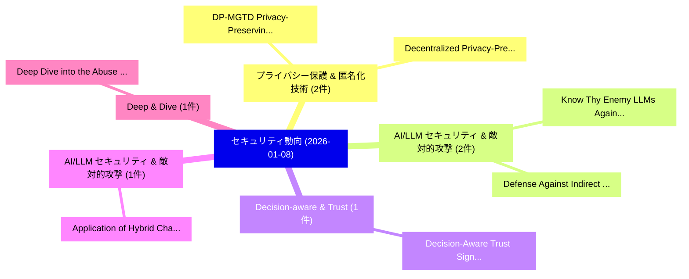

# 📅 02_daily: 日次エグゼクティブサマリー報告書 (2026-01-08)

**集計日時**: 2026-10-02 23:05:53 UTC  
**対象日付**: 2026-01-08  
**本日収集論文数**: 22 件  

---

## 💡 主要セキュリティ動向・脅威インサイト (Executive Insights)

本日の収集論文（計 22 件）において、以下の重点セキュリティ領域で活発な研究動向が確認されました：
- **プライバシー保護 & 匿名化技術** (2 件): 注目論文として 「DP-MGTD: Privacy-Preserving Ma...」、「Decentralized Privacy-Preservi...」 等が発表され、実務防御および攻撃検証の進展が見られます。
- **AI/LLM セキュリティ & 敵対的攻撃** (2 件): 注目論文として 「Know Thy Enemy: LLMs Against P...」、「Defense Against Indirect Promp...」 等が発表され、実務防御および攻撃検証の進展が見られます。
- **Decision-aware & Trust** (1 件): 注目論文として 「Decision-Aware Trust Signal Al...」 等が発表され、実務防御および攻撃検証の進展が見られます。
- **AI/LLM セキュリティ & 敵対的攻撃** (1 件): 注目論文として 「Application of Hybrid Chain St...」 等が発表され、実務防御および攻撃検証の進展が見られます。
- **Deep & Dive** (1 件): 注目論文として 「Deep Dive into the Abuse of DL...」 等が発表され、実務防御および攻撃検証の進展が見られます。

### 🗺️ 技術・脅威トピックマインドマップ

---

## 📌 日次セキュリティ論文一覧 (日本語表形式)

| No | arXiv ID | 論文タイトル (日本語訳) | 重要キーワード | 構造化エグゼクティブ要約 (背景・提案・影響) | 脅威分類 | 詳細リンク |
|---|---|---|---|---|---|---|
| 1 | `2601.04486v1` | [Decision-Aware Trust Signal Alignment for SOC Alert Triage（セキュリティ分析論文）](../../okf/papers/2026-01-08/2601.04486.md) | `Aware Trust Signal Alignment`, `Alert Triage`, `Decision-Aware Trust` | 【提案】概要 (Overview & Key Finding) 本論文「Decision-Aware Trust Signal Alignment for SOC Alert Tri...。実証評価により経営層・セキュリティ管理者向け推奨アクション (E... | `cs.AI` | [arXiv](https://arxiv.org/abs/2601.04486v1) &#124; [OKF](../../okf/papers/2026-01-08/2601.04486.md) |
| 2 | `2601.04512v3` | [Application of Hybrid Chain Storage Framework in Energy Trading and Carbon Asset Management（セキュリティ分析論文）](../../okf/papers/2026-01-08/2601.04512.md) | `Carbon Asset Management`, `Energy Trading`, `Yinghan Hou` | 【提案】概要 (Overview & Key Finding) 本論文「Application of Hybrid Chain Storage Framework in Energy...。実証評価により経営層・セキュリティ管理者向け推奨アクション (E... | `executive-summary` | [arXiv](https://arxiv.org/abs/2601.04512v3) &#124; [OKF](../../okf/papers/2026-01-08/2601.04512.md) |
| 3 | `2601.04553v1` | [Deep Dive into the Abuse of DL APIs To Create Malicious AI Models and How to Detect Them（セキュリティ分析論文）](../../okf/papers/2026-01-08/2601.04553.md) | `Deep Dive`, `Mohamed Nabeel`, `Oleksii Starov` | 【提案】概要 (Overview & Key Finding) 本論文「Deep Dive into the Abuse of DL APIs To Create Malicious...。実証評価により経営層・セキュリティ管理者向け推奨アクション (E... | `cybersecurity` | [arXiv](https://arxiv.org/abs/2601.04553v1) &#124; [OKF](../../okf/papers/2026-01-08/2601.04553.md) |
| 4 | `2601.04603v1` | [Constitutional Classifiers++: Efficient Production-Grade Defenses against Universal Jailbreaks（セキュリティ分析論文）](../../okf/papers/2026-01-08/2601.04603.md) | `Constitutional Classifiers`, `Efficient Production`, `Grade Defenses` | 【提案】概要 (Overview & Key Finding) 本論文「Constitutional Classifiers++: Efficient Production-Grad...。実証評価により経営層・セキュリティ管理者向け推奨アクション (E... | `cs.AI` | [arXiv](https://arxiv.org/abs/2601.04603v1) &#124; [OKF](../../okf/papers/2026-01-08/2601.04603.md) |
| 5 | `2601.04641v2` | [DP-MGTD: Privacy-Preserving Machine-Generated Text Detection via Adaptive Differentially Private Entity Sanitization（セキュリティ分析論文）](../../okf/papers/2026-01-08/2601.04641.md) | `Adaptive Differentially Private Entity Sanitization`, `Generated Text Detection`, `Preserving Machine` | 【提案】概要 (Overview & Key Finding) 本論文「DP-MGTD: Privacy-Preserving Machine-Generated Text Dete...。実証評価により経営層・セキュリティ管理者向け推奨アクション (E... | `executive-summary` | [arXiv](https://arxiv.org/abs/2601.04641v2) &#124; [OKF](../../okf/papers/2026-01-08/2601.04641.md) |
| 6 | `2601.04666v2` | [Know Thy Enemy: LLMs Against Prompt Injection via Diverse Data Synthesis and Instruction-Level Chain-of-Thought Learningのセキュリティ強化](../../okf/papers/2026-01-08/2601.04666.md) | `Know Thy Enemy`, `Diverse Data Synthesis`, `Level Chain` | 【提案】概要 (Overview & Key Finding) 本論文「Know Thy Enemy: LLMs Against プロンプトインジェクション via Diverse ...。実証評価により経営層・セキュリティ管理者向け推奨アクション (E... | `cs.AI` | [arXiv](https://arxiv.org/abs/2601.04666v2) &#124; [OKF](../../okf/papers/2026-01-08/2601.04666.md) |
| 7 | `2601.04697v1` | [Unified Framework for Qualifying Security Boundary of PUFs Against Machine Learning Attacks（セキュリティ分析論文）](../../okf/papers/2026-01-08/2601.04697.md) | `Qualifying Security Boundary`, `Hongming Fei`, `Zilong Hu` | 【提案】概要 (Overview & Key Finding) 本論文「Unified Framework for Qualifying Security Boundary of P...。実証評価により経営層・セキュリティ管理者向け推奨アクション (E... | `cybersecurity` | [arXiv](https://arxiv.org/abs/2601.04697v1) &#124; [OKF](../../okf/papers/2026-01-08/2601.04697.md) |
| 8 | `2601.04795v1` | [Defense Against Indirect Prompt Injection via Tool Result Parsing（セキュリティ分析論文）](../../okf/papers/2026-01-08/2601.04795.md) | `Qiang Yu`, `Xinran Cheng`, `Chuanyi Liu` | 【提案】概要 (Overview & Key Finding) 本論文「Defense Against Indirect プロンプトインジェクション via Tool Result ...。実証評価により経営層・セキュリティ管理者向け推奨アクション (E... | `cs.AI` | [arXiv](https://arxiv.org/abs/2601.04795v1) &#124; [OKF](../../okf/papers/2026-01-08/2601.04795.md) |
| 9 | `2601.04835v1` | [A Mathematical Theory of Payment Channel Networks（セキュリティ分析論文）](../../okf/papers/2026-01-08/2601.04835.md) | `Payment Channel Networks`, `Mathematical Theory`, `Rene Pickhardt` | 【提案】概要 (Overview & Key Finding) 本論文「A Mathematical Theory of Payment Channel Networks（セキュリテ...。実証評価により経営層・セキュリティ管理者向け推奨アクション (E... | `cs.NI` | [arXiv](https://arxiv.org/abs/2601.04835v1) &#124; [OKF](../../okf/papers/2026-01-08/2601.04835.md) |
| 10 | `2601.04852v1` | [Quantum Secure Biometric Authentication in Decentralised Systems（セキュリティ分析論文）](../../okf/papers/2026-01-08/2601.04852.md) | `Quantum Secure Biometric Authentication`, `Decentralised Systems`, `Tooba Qasim` | 【提案】概要 (Overview & Key Finding) 本論文「量子 Secure Biometric Authentication in Decentralised Sys...。実証評価によりSiris, Izak Oosthu。 | `cybersecurity` | [arXiv](https://arxiv.org/abs/2601.04852v1) &#124; [OKF](../../okf/papers/2026-01-08/2601.04852.md) |
| 11 | `2601.04912v1` | [Decentralized Privacy-Preserving Federal Learning of Computer Vision Models on Edge Devices（セキュリティ分析論文）](../../okf/papers/2026-01-08/2601.04912.md) | `Preserving Federal Learning`, `Computer Vision Models`, `Decentralized Privacy` | 【提案】概要 (Overview & Key Finding) 本論文「Decentralized Privacy-Preserving Federal Learning of Co...。実証評価により経営層・セキュリティ管理者向け推奨アクション (E... | `cs.CV` | [arXiv](https://arxiv.org/abs/2601.04912v1) &#124; [OKF](../../okf/papers/2026-01-08/2601.04912.md) |
| 12 | `2601.04940v1` | [CurricuLLM: Designing Personalized and Workforce-Aligned サイバーセキュリティ Curricula Using Fine-Tuned LLMs](../../okf/papers/2026-01-08/2601.04940.md) | `Designing Personalized`, `Fine-Tuned LLMs`, `Curricula Using Fine` | 【提案】概要 (Overview & Key Finding) 本論文「CurricuLLM: Designing Personalized and Workforce-Aligne...。実証評価により経営層・セキュリティ管理者向け推奨アクション (E... | `cs.AI` | [arXiv](https://arxiv.org/abs/2601.04940v1) &#124; [OKF](../../okf/papers/2026-01-08/2601.04940.md) |
| 13 | `2601.05022v1` | [Knowledge-to-Data: LLM-Driven Synthesis of Structured Network Traffic for Testbed-Free IDS Evaluation（セキュリティ分析論文）](../../okf/papers/2026-01-08/2601.05022.md) | `Structured Network Traffic`, `Driven Synthesis`, `LLM-Driven Synthesis` | 【提案】概要 (Overview & Key Finding) 本論文「Knowledge-to-Data: LLM-Driven Synthesis of Structured N...。実証評価により経営層・セキュリティ管理者向け推奨アクション (E... | `cybersecurity` | [arXiv](https://arxiv.org/abs/2601.05022v1) &#124; [OKF](../../okf/papers/2026-01-08/2601.05022.md) |
| 14 | `2601.05057v1` | [Supporting Secured Integration of Microarchitectural Defenses（セキュリティ分析論文）](../../okf/papers/2026-01-08/2601.05057.md) | `Supporting Secured Integration`, `Microarchitectural Defenses`, `Kartik Ramkrishnan` | 【提案】概要 (Overview & Key Finding) 本論文「Supporting Secured Integration of Microarchitectural De...。実証評価により経営層・セキュリティ管理者向け推奨アクション (E... | `executive-summary` | [arXiv](https://arxiv.org/abs/2601.05057v1) &#124; [OKF](../../okf/papers/2026-01-08/2601.05057.md) |
| 15 | `2601.05150v3` | [$PC^2$: Politically Controversial Content Generation via Jailbreaking Attacks on GPT-based Text-to-Image Models（セキュリティ分析論文）](../../okf/papers/2026-01-08/2601.05150.md) | `Politically Controversial Content Generation`, `Jailbreaking Attacks`, `Image Models` | 【提案】概要 (Overview & Key Finding) 本論文「$PC^2$: Politically Controversial Content Generation vi...。実証評価により経営層・セキュリティ管理者向け推奨アクション (E... | `cybersecurity` | [arXiv](https://arxiv.org/abs/2601.05150v3) &#124; [OKF](../../okf/papers/2026-01-08/2601.05150.md) |
| 16 | `2601.05180v2` | [The Adverse Effects of Omitting Records in Differential Privacy: How Sampling and Suppression Degrade the Privacy--Utility Tradeoff (Long Version)（セキュリティ分析論文）](../../okf/papers/2026-01-08/2601.05180.md) | `Omitting Records`, `Differential Privacy`, `Suppression Degrade` | 【提案】概要 (Overview & Key Finding) 本論文「The Adverse Effects of Omitting Records in 差分プライバシー: Ho...。実証評価により経営層・セキュリティ管理者向け推奨アクション (E... | `cybersecurity` | [arXiv](https://arxiv.org/abs/2601.05180v2) &#124; [OKF](../../okf/papers/2026-01-08/2601.05180.md) |
| 17 | `2601.05293v1` | [A Survey of Agentic AI and サイバーセキュリティ: Challenges, Opportunities and Use-case Prototypes](../../okf/papers/2026-01-08/2601.05293.md) | `Use-case Prototypes`, `Sahaya Jestus Lazer`, `Kshitiz Aryal` | 【提案】概要 (Overview & Key Finding) 本論文「A Survey of Agentic AI and サイバーセキュリティ: Challenges, Oppo...。実証評価により経営層・セキュリティ管理者向け推奨アクション (E... | `cs.AI` | [arXiv](https://arxiv.org/abs/2601.05293v1) &#124; [OKF](../../okf/papers/2026-01-08/2601.05293.md) |
| 18 | `2601.05339v1` | [Multi-turn Jailbreaking Attack in Multi-Modal 大規模言語モデル](../../okf/papers/2026-01-08/2601.05339.md) | `Jailbreaking Attack`, `Multi-turn Jailbreaking`, `Modal Large Language Models` | 【提案】概要 (Overview & Key Finding) 本論文「Multi-turn ジェイルブレイクing Attack in Multi-Modal 大規模言語モデル」（...。実証評価によりHadi Amini, Yanzhao Wu - *。 | `cs.AI` | [arXiv](https://arxiv.org/abs/2601.05339v1) &#124; [OKF](../../okf/papers/2026-01-08/2601.05339.md) |
| 19 | `2601.05352v2` | [When the Server Steps In: Calibrated Updates for Fair 連合学習](../../okf/papers/2026-01-08/2601.05352.md) | `Calibrated Updates`, `Fair Federated Learning`, `Tianrun Yu` | 【提案】概要 (Overview & Key Finding) 本論文「When the Server Steps In: Calibrated Updates for Fair 連...。実証評価により経営層・セキュリティ管理者向け推奨アクション (E... | `executive-summary` | [arXiv](https://arxiv.org/abs/2601.05352v2) &#124; [OKF](../../okf/papers/2026-01-08/2601.05352.md) |
| 20 | `2601.06197v1` | [AI Safeguards, Generative AI and the Pandora Box: AI Safety Measures to Protect Businesses and Personal Reputation（セキュリティ分析論文）](../../okf/papers/2026-01-08/2601.06197.md) | `Pandora Box`, `Safety Measures`, `Protect Businesses` | 【提案】概要 (Overview & Key Finding) 本論文「AI Safeguards, Generative AI and the Pandora Box: AI Sa...。実証評価により経営層・セキュリティ管理者向け推奨アクション (E... | `cs.AI` | [arXiv](https://arxiv.org/abs/2601.06197v1) &#124; [OKF](../../okf/papers/2026-01-08/2601.06197.md) |
| 21 | `2601.06200v1` | [Leveraging Membership Inference Attacks for Privacy Measurement in 連合学習 for Remote Sensing Images](../../okf/papers/2026-01-08/2601.06200.md) | `Leveraging Membership Inference Attacks`, `Remote Sensing Images`, `Privacy Measurement` | 【提案】概要 (Overview & Key Finding) 本論文「Leveraging Membership Inference Attacks for Privacy Mea...。実証評価により経営層・セキュリティ管理者向け推奨アクション (E... | `cs.AI` | [arXiv](https://arxiv.org/abs/2601.06200v1) &#124; [OKF](../../okf/papers/2026-01-08/2601.06200.md) |
| 22 | `2601.06213v1` | [Cyber Threat Detection and Vulnerability Assessment System using Generative AI and Large Language Model（セキュリティ分析論文）](../../okf/papers/2026-01-08/2601.06213.md) | `Cyber Threat Detection`, `Vulnerability Assessment System`, `Large Language Model` | 【提案】概要 (Overview & Key Finding) 本論文「Cyber 脅威 Detection and 脆弱性 Assessment System using Gene...。実証評価により経営層・セキュリティ管理者向け推奨アクション (E... | `cs.AI` | [arXiv](https://arxiv.org/abs/2601.06213v1) &#124; [OKF](../../okf/papers/2026-01-08/2601.06213.md) |

