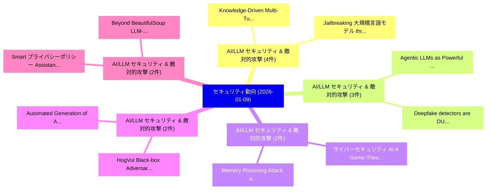

# 📅 02_daily: 日次エグゼクティブサマリー報告書 (2026-01-09)

**集計日時**: 2026-10-02 23:05:53 UTC  
**対象日付**: 2026-01-09  
**本日収集論文数**: 26 件  

---

## 💡 主要セキュリティ動向・脅威インサイト (Executive Insights)

本日の収集論文（計 26 件）において、以下の重点セキュリティ領域で活発な研究動向が確認されました：
- **AI/LLM セキュリティ & 敵対的攻撃** (4 件): 注目論文として 「Knowledge-Driven Multi-Turn Ja...」、「Jailbreaking 大規模言語モデル through ...」 等が発表され、実務防御および攻撃検証の進展が見られます。
- **AI/LLM セキュリティ & 敵対的攻撃** (3 件): 注目論文として 「Agentic LLMs as Powerful Deano...」、「Deepfake detectors are DUMB: A...」 等が発表され、実務防御および攻撃検証の進展が見られます。
- **AI/LLM セキュリティ & 敵対的攻撃** (2 件): 注目論文として 「Memory Poisoning Attack and De...」、「サイバーセキュリティ AI: A Game-Theoreti...」 等が発表され、実務防御および攻撃検証の進展が見られます。
- **AI/LLM セキュリティ & 敵対的攻撃** (2 件): 注目論文として 「HogVul: Black-box Adversarial ...」、「Automated Generation of Accura...」 等が発表され、実務防御および攻撃検証の進展が見られます。
- **AI/LLM セキュリティ & 敵対的攻撃** (2 件): 注目論文として 「Beyond BeautifulSoup: LLM-Powe...」、「Smart プライバシーポリシー Assistant: An...」 等が発表され、実務防御および攻撃検証の進展が見られます。

### 🗺️ 技術・脅威トピックマインドマップ

---

## 📌 日次セキュリティ論文一覧 (日本語表形式)

| No | arXiv ID | 論文タイトル (日本語訳) | 重要キーワード | 構造化エグゼクティブ要約 (背景・提案・影響) | 脅威分類 | 詳細リンク |
|---|---|---|---|---|---|---|
| 1 | `2601.05445v1` | [Knowledge-Driven Multi-Turn Jailbreaking on 大規模言語モデル](../../okf/papers/2026-01-09/2601.05445.md) | `Driven Multi`, `Turn Jailbreaking`, `Knowledge-Driven Multi` | 【提案】概要 (Overview & Key Finding) 本論文「Knowledge-Driven Multi-Turn ジェイルブレイクing on 大規模言語モデル」（原題...。実証評価により経営層・セキュリティ管理者向け推奨アクション (E... | `executive-summary` | [arXiv](https://arxiv.org/abs/2601.05445v1) &#124; [OKF](../../okf/papers/2026-01-09/2601.05445.md) |
| 2 | `2601.05466v1` | [Jailbreaking 大規模言語モデル through Iterative Tool-Disguised Attacks via Reinforcement Learning](../../okf/papers/2026-01-09/2601.05466.md) | `Iterative Tool`, `Disguised Attacks`, `Reinforcement Learning` | 【提案】概要 (Overview & Key Finding) 本論文「ジェイルブレイクing 大規模言語モデル through Iterative Tool-Disguised A...。実証評価により経営層・セキュリティ管理者向け推奨アクション (E... | `cs.AI` | [arXiv](https://arxiv.org/abs/2601.05466v1) &#124; [OKF](../../okf/papers/2026-01-09/2601.05466.md) |
| 3 | `2601.05504v2` | [Memory Poisoning Attack and Defense on Memory Based LLM-Agents（セキュリティ分析論文）](../../okf/papers/2026-01-09/2601.05504.md) | `Memory Poisoning Attack`, `Memory Based`, `Balachandra Devarangadi Sunil` | 【提案】概要 (Overview & Key Finding) 本論文「Memory Poisoning Attack and Defense on Memory Based LLM...。実証評価により経営層・セキュリティ管理者向け推奨アクション (E... | `executive-summary` | [arXiv](https://arxiv.org/abs/2601.05504v2) &#124; [OKF](../../okf/papers/2026-01-09/2601.05504.md) |
| 4 | `2601.05534v3` | [BloQBench: A Blockchain Framework for Quantum Supremacyのベンチマーク評価](../../okf/papers/2026-01-09/2601.05534.md) | `Quantum Supremacy`, `Ramin Ayanzadeh`, `Raw Meta` | 【提案】概要 (Overview & Key Finding) 本論文「BloQBench: A Blockchain Framework for 量子 Supremacyのベンチマ...。実証評価によりPapadopoulos, Ramin Ayanz... | `cybersecurity` | [arXiv](https://arxiv.org/abs/2601.05534v3) &#124; [OKF](../../okf/papers/2026-01-09/2601.05534.md) |
| 5 | `2601.05587v1` | [HogVul: Black-box Adversarial Code Generation Framework Against LM-based Vulnerability Detectors（セキュリティ分析論文）](../../okf/papers/2026-01-09/2601.05587.md) | `Vulnerability Detectors`, `Black-box Adversarial`, `LM-based Vulnerability` | 【提案】概要 (Overview & Key Finding) 本論文「HogVul: Black-box Adversarial Code Generation Framework...。実証評価により経営層・セキュリティ管理者向け推奨アクション (E... | `cs.AI` | [arXiv](https://arxiv.org/abs/2601.05587v1) &#124; [OKF](../../okf/papers/2026-01-09/2601.05587.md) |
| 6 | `2601.05635v2` | [Continual Pretraining on Encrypted Synthetic Data for Privacy-Preserving LLMs（セキュリティ分析論文）](../../okf/papers/2026-01-09/2601.05635.md) | `Encrypted Synthetic Data`, `Continual Pretraining`, `Privacy-Preserving LLMs` | 【提案】概要 (Overview & Key Finding) 本論文「Continual Pretraining on Encrypted Synthetic Data for P...。実証評価により経営層・セキュリティ管理者向け推奨アクション (E... | `executive-summary` | [arXiv](https://arxiv.org/abs/2601.05635v2) &#124; [OKF](../../okf/papers/2026-01-09/2601.05635.md) |
| 7 | `2601.05703v1` | [AIBoMGen: Generating an AI Bill of Materials for Secure, Transparent, and Compliant Model Training（セキュリティ分析論文）](../../okf/papers/2026-01-09/2601.05703.md) | `Compliant Model Training`, `Wiebe Vandendriessche`, `Jordi Thijsman` | 【提案】概要 (Overview & Key Finding) 本論文「AIBoMGen: Generating an AI Bill of Materials for Secure...。実証評価により経営層・セキュリティ管理者向け推奨アクション (E... | `cs.AI` | [arXiv](https://arxiv.org/abs/2601.05703v1) &#124; [OKF](../../okf/papers/2026-01-09/2601.05703.md) |
| 8 | `2601.05739v1` | [PII-VisBench: Evaluating Personally Identifiable Information Safety in Vision Language Models Along a Continuum of Visibility（セキュリティ分析論文）](../../okf/papers/2026-01-09/2601.05739.md) | `Evaluating Personally Identifiable Information Safety`, `Vision Language Models Along`, `Md Olid Hasan Bhuiyan` | 【提案】概要 (Overview & Key Finding) 本論文「PII-VisBench: Evaluating Personally Identifiable Inform...。実証評価により経営層・セキュリティ管理者向け推奨アクション (E... | `cs.AI` | [arXiv](https://arxiv.org/abs/2601.05739v1) &#124; [OKF](../../okf/papers/2026-01-09/2601.05739.md) |
| 9 | `2601.05742v1` | [The Echo Chamber Multi-Turn LLM Jailbreak（セキュリティ分析論文）](../../okf/papers/2026-01-09/2601.05742.md) | `Multi-Turn LLM`, `Ahmad Alobaid`, `Carlos Castillo` | 【提案】概要 (Overview & Key Finding) 本論文「The Echo Chamber Multi-Turn LLM ジェイルブレイク（セキュリティ分析論文）」（原...。実証評価により経営層・セキュリティ管理者向け推奨アクション (E... | `cs.AI` | [arXiv](https://arxiv.org/abs/2601.05742v1) &#124; [OKF](../../okf/papers/2026-01-09/2601.05742.md) |
| 10 | `2601.05755v2` | [VIGIL: Defending LLMエージェント Against Tool Stream Injection via Verify-Before-Commit](../../okf/papers/2026-01-09/2601.05755.md) | `Junda Lin`, `Zhaomeng Zhou`, `Zhi Zheng` | 【提案】概要 (Overview & Key Finding) 本論文「VIGIL: Defending LLMエージェント Against Tool Stream Injectio...。実証評価により経営層・セキュリティ管理者向け推奨アクション (E... | `cs.AI` | [arXiv](https://arxiv.org/abs/2601.05755v2) &#124; [OKF](../../okf/papers/2026-01-09/2601.05755.md) |
| 11 | `2601.05772v1` | [StriderSPD: Structure-Guided Joint Representation Learning for Binary Security Patch Detection（セキュリティ分析論文）](../../okf/papers/2026-01-09/2601.05772.md) | `Guided Joint Representation Learning`, `Binary Security Patch Detection`, `Structure-Guided Joint` | 【提案】概要 (Overview & Key Finding) 本論文「StriderSPD: Structure-Guided Joint Representation Learn...。実証評価により経営層・セキュリティ管理者向け推奨アクション (E... | `executive-summary` | [arXiv](https://arxiv.org/abs/2601.05772v1) &#124; [OKF](../../okf/papers/2026-01-09/2601.05772.md) |
| 12 | `2601.05813v1` | [Descriptor: Multi-Regional Cloud Honeypot Dataset (MURHCAD)（セキュリティ分析論文）](../../okf/papers/2026-01-09/2601.05813.md) | `Regional Cloud Honeypot Dataset`, `Multi-Regional Cloud`, `Enrique Feito` | 【提案】概要 (Overview & Key Finding) 本論文「Descriptor: Multi-Regional Cloud Honeypot Dataset (MURH...。実証評価により経営層・セキュリティ管理者向け推奨アクション (E... | `cs.DB` | [arXiv](https://arxiv.org/abs/2601.05813v1) &#124; [OKF](../../okf/papers/2026-01-09/2601.05813.md) |
| 13 | `2601.05828v1` | [Influence of Parallelism in Vector-Multiplication Units on Correlation Power Analysis（セキュリティ分析論文）](../../okf/papers/2026-01-09/2601.05828.md) | `Multiplication Units`, `Vector-Multiplication Units`, `Manuel Brosch` | 【提案】概要 (Overview & Key Finding) 本論文「Influence of Parallelism in Vector-Multiplication Units...。実証評価により経営層・セキュリティ管理者向け推奨アクション (E... | `cs.AI` | [arXiv](https://arxiv.org/abs/2601.05828v1) &#124; [OKF](../../okf/papers/2026-01-09/2601.05828.md) |
| 14 | `2601.05865v1` | [Secure Change-Point Detection for Time Series under Homomorphic Encryption（セキュリティ分析論文）](../../okf/papers/2026-01-09/2601.05865.md) | `Secure Change`, `Point Detection`, `Time Series` | 【提案】概要 (Overview & Key Finding) 本論文「Secure Change-Point Detection for Time Series under 準同型...。実証評価により経営層・セキュリティ管理者向け推奨アクション (E... | `cybersecurity` | [arXiv](https://arxiv.org/abs/2601.05865v1) &#124; [OKF](../../okf/papers/2026-01-09/2601.05865.md) |
| 15 | `2601.05887v1` | [サイバーセキュリティ AI: A Game-Theoretic AI for Guiding Attack and Defense](../../okf/papers/2026-01-09/2601.05887.md) | `Guiding Attack`, `Game-Theoretic AI`, `Luis Javier Navarrete` | 【提案】概要 (Overview & Key Finding) 本論文「サイバーセキュリティ AI: A Game-Theoretic AI for Guiding Attack a...。実証評価により経営層・セキュリティ管理者向け推奨アクション (E... | `cybersecurity` | [arXiv](https://arxiv.org/abs/2601.05887v1) &#124; [OKF](../../okf/papers/2026-01-09/2601.05887.md) |
| 16 | `2601.05918v1` | [Agentic LLMs as Powerful Deanonymizers: Re-identification of Participants in the Anthropic Interviewer Dataset（セキュリティ分析論文）](../../okf/papers/2026-01-09/2601.05918.md) | `Anthropic Interviewer Dataset`, `Powerful Deanonymizers`, `Tianshi Li` | 【提案】概要 (Overview & Key Finding) 本論文「Agentic LLMs as Powerful Deanonymizers: Re-identificati...。実証評価により経営層・セキュリティ管理者向け推奨アクション (E... | `cs.AI` | [arXiv](https://arxiv.org/abs/2601.05918v1) &#124; [OKF](../../okf/papers/2026-01-09/2601.05918.md) |
| 17 | `2601.05986v1` | [Deepfake detectors are DUMB: A benchmark to assess adversarial training robustness under transferability constraints（セキュリティ分析論文）](../../okf/papers/2026-01-09/2601.05986.md) | `Adrian Serrano`, `Erwan Umlil`, `Ronan Thomas` | 【提案】概要 (Overview & Key Finding) 本論文「Deepfake detectors are DUMB: A benchmark to assess adve...。実証評価により経営層・セキュリティ管理者向け推奨アクション (E... | `cs.CV` | [arXiv](https://arxiv.org/abs/2601.05986v1) &#124; [OKF](../../okf/papers/2026-01-09/2601.05986.md) |
| 18 | `2601.05988v1` | [CyberGFM: Graph Foundation Models for Lateral Movement Detection in Enterprise Networks（セキュリティ分析論文）](../../okf/papers/2026-01-09/2601.05988.md) | `Graph Foundation Models`, `Lateral Movement Detection`, `Enterprise Networks` | 【提案】概要 (Overview & Key Finding) 本論文「CyberGFM: Graph Foundation Models for Lateral Movement ...。実証評価により経営層・セキュリティ管理者向け推奨アクション (E... | `executive-summary` | [arXiv](https://arxiv.org/abs/2601.05988v1) &#124; [OKF](../../okf/papers/2026-01-09/2601.05988.md) |
| 19 | `2601.06219v1` | [AI-Powered Algorithms for the Prevention and Computer Malware Infectionsの検出](../../okf/papers/2026-01-09/2601.06219.md) | `Powered Algorithms`, `AI-Powered Algorithms`, `Computer Malware` | 【提案】概要 (Overview & Key Finding) 本論文「AI-Powered Algorithms for the Prevention and Computer マ...。実証評価により経営層・セキュリティ管理者向け推奨アクション (E... | `cs.AI` | [arXiv](https://arxiv.org/abs/2601.06219v1) &#124; [OKF](../../okf/papers/2026-01-09/2601.06219.md) |
| 20 | `2601.06232v1` | [Multi-Agent Framework for Controllable and Protected Generative Content Creation: Addressing Copyright and Provenance in AI-Generated Media（セキュリティ分析論文）](../../okf/papers/2026-01-09/2601.06232.md) | `Protected Generative Content Creation`, `Addressing Copyright`, `Generated Media` | 【提案】概要 (Overview & Key Finding) 本論文「Multi-Agent Framework for Controllable and Protected Ge...。実証評価により経営層・セキュリティ管理者向け推奨アクション (E... | `cs.AI` | [arXiv](https://arxiv.org/abs/2601.06232v1) &#124; [OKF](../../okf/papers/2026-01-09/2601.06232.md) |
| 21 | `2601.06241v1` | [Agentic AI Microservice Framework for Deepfake and Document Fraud Detection in KYC Pipelines（セキュリティ分析論文）](../../okf/papers/2026-01-09/2601.06241.md) | `Document Fraud Detection`, `Chandra Sekhar Kubam`, `Raw Meta` | 【提案】概要 (Overview & Key Finding) 本論文「Agentic AI Microservice Framework for Deepfake and Docu...。実証評価により経営層・セキュリティ管理者向け推奨アクション (E... | `cs.AI` | [arXiv](https://arxiv.org/abs/2601.06241v1) &#124; [OKF](../../okf/papers/2026-01-09/2601.06241.md) |
| 22 | `2601.06276v1` | [Automated Generation of Accurate Privacy Captions From Android Source Code Using 大規模言語モデル](../../okf/papers/2026-01-09/2601.06276.md) | `Automated Generation`, `Sai Teja Peddinti`, `Accurate Privacy Captions` | 【提案】概要 (Overview & Key Finding) 本論文「Automated Generation of Accurate Privacy Captions From ...。実証評価により経営層・セキュリティ管理者向け推奨アクション (E... | `executive-summary` | [arXiv](https://arxiv.org/abs/2601.06276v1) &#124; [OKF](../../okf/papers/2026-01-09/2601.06276.md) |
| 23 | `2601.06301v1` | [Beyond BeautifulSoup: LLM-Powered Web Scraping for Everyday Usersのベンチマーク評価](../../okf/papers/2026-01-09/2601.06301.md) | `Powered Web Scraping`, `LLM-Powered Web`, `Everyday Users` | 【提案】概要 (Overview & Key Finding) 本論文「Beyond BeautifulSoup: LLM-Powered Web Scraping for Ever...。実証評価により経営層・セキュリティ管理者向け推奨アクション (E... | `cs.AI` | [arXiv](https://arxiv.org/abs/2601.06301v1) &#124; [OKF](../../okf/papers/2026-01-09/2601.06301.md) |
| 24 | `2601.06357v1` | [Smart プライバシーポリシー Assistant: An LLM-Powered System for Transparent and Actionable Privacy Notices](../../okf/papers/2026-01-09/2601.06357.md) | `Actionable Privacy Notices`, `Powered System`, `LLM-Powered System` | 【提案】概要 (Overview & Key Finding) 本論文「Smart プライバシーポリシー Assistant: An LLM-Powered System for T...。実証評価により経営層・セキュリティ管理者向け推奨アクション (E... | `cs.AI` | [arXiv](https://arxiv.org/abs/2601.06357v1) &#124; [OKF](../../okf/papers/2026-01-09/2601.06357.md) |
| 25 | `2601.07853v2` | [FinVault: Financial Agent Safety in Execution-Grounded Environmentsのベンチマーク評価](../../okf/papers/2026-01-09/2601.07853.md) | `Benchmarking Financial Agent Safety`, `Financial Agent Safety`, `Grounded Environments` | 【提案】概要 (Overview & Key Finding) 本論文「FinVault: Financial Agent Safety in Execution-Grounded ...。実証評価により経営層・セキュリティ管理者向け推奨アクション (E... | `cs.AI` | [arXiv](https://arxiv.org/abs/2601.07853v2) &#124; [OKF](../../okf/papers/2026-01-09/2601.07853.md) |
| 26 | `2601.14272v1` | [The Limits of Lognormal: Assessing Cryptocurrency Volatility and VaR using Geometric Brownian Motion（セキュリティ分析論文）](../../okf/papers/2026-01-09/2601.14272.md) | `Assessing Cryptocurrency Volatility`, `Geometric Brownian Motion`, `Ekleen Kaur` | 【提案】概要 (Overview & Key Finding) 本論文「The Limits of Lognormal: Assessing Cryptocurrency Volat...。実証評価により経営層・セキュリティ管理者向け推奨アクション (E... | `cs.CE` | [arXiv](https://arxiv.org/abs/2601.14272v1) &#124; [OKF](../../okf/papers/2026-01-09/2601.14272.md) |

