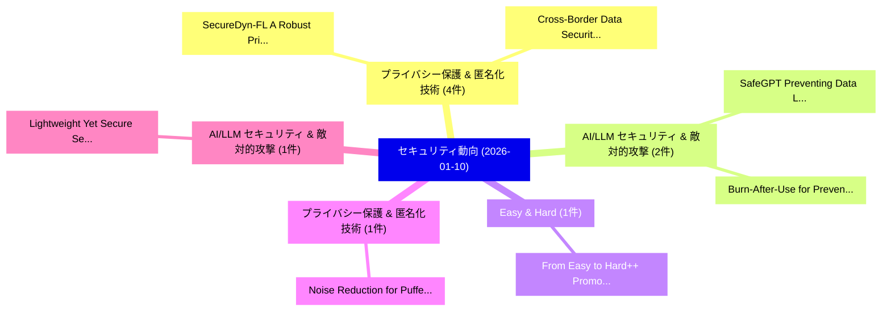

# 📅 02_daily: 日次エグゼクティブサマリー報告書 (2026-01-10)

**集計日時**: 2026-10-02 23:05:53 UTC  
**対象日付**: 2026-01-10  
**本日収集論文数**: 18 件  

---

## 💡 主要セキュリティ動向・脅威インサイト (Executive Insights)

本日の収集論文（計 18 件）において、以下の重点セキュリティ領域で活発な研究動向が確認されました：
- **プライバシー保護 & 匿名化技術** (4 件): 注目論文として 「SecureDyn-FL: A Robust Privacy...」、「Cross-Border Data Security and...」 等が発表され、実務防御および攻撃検証の進展が見られます。
- **AI/LLM セキュリティ & 敵対的攻撃** (2 件): 注目論文として 「SafeGPT: Preventing Data Leaka...」、「Burn-After-Use for Preventing ...」 等が発表され、実務防御および攻撃検証の進展が見られます。
- **Easy & Hard** (1 件): 注目論文として 「From Easy to Hard++: Promoting...」 等が発表され、実務防御および攻撃検証の進展が見られます。
- **プライバシー保護 & 匿名化技術** (1 件): 注目論文として 「Noise Reduction for Pufferfish...」 等が発表され、実務防御および攻撃検証の進展が見られます。
- **AI/LLM セキュリティ & 敵対的攻撃** (1 件): 注目論文として 「Lightweight Yet Secure: Secure...」 等が発表され、実務防御および攻撃検証の進展が見られます。

### 🗺️ 技術・脅威トピックマインドマップ

---

## 📌 日次セキュリティ論文一覧 (日本語表形式)

| No | arXiv ID | 論文タイトル (日本語訳) | 重要キーワード | 構造化エグゼクティブ要約 (背景・提案・影響) | 脅威分類 | 詳細リンク |
|---|---|---|---|---|---|---|
| 1 | `2601.06366v3` | [SafeGPT: Preventing Data Leakage and Unethical Outputs in Enterprise LLM Use（セキュリティ分析論文）](../../okf/papers/2026-01-10/2601.06366.md) | `Preventing Data Leakage`, `Unethical Outputs`, `Pratyush Desai` | 【提案】概要 (Overview & Key Finding) 本論文「SafeGPT: Preventing Data Leakage and Unethical Outputs ...。実証評価により経営層・セキュリティ管理者向け推奨アクション (E... | `cs.AI` | [arXiv](https://arxiv.org/abs/2601.06366v3) &#124; [OKF](../../okf/papers/2026-01-10/2601.06366.md) |
| 2 | `2601.06368v1` | [From Easy to Hard++: Promoting Differentially Private Image Synthesis Through Spatial-Frequency Curriculum（セキュリティ分析論文）](../../okf/papers/2026-01-10/2601.06368.md) | `Frequency Curriculum`, `Spatial-Frequency Curriculum`, `Promoting Differentially Private Image Synthesis Thro` | 【提案】概要 (Overview & Key Finding) 本論文「From Easy to Hard++: Promoting Differentially Private I...。実証評価により経営層・セキュリティ管理者向け推奨アクション (E... | `cs.CV` | [arXiv](https://arxiv.org/abs/2601.06368v1) &#124; [OKF](../../okf/papers/2026-01-10/2601.06368.md) |
| 3 | `2601.06385v1` | [Noise Reduction for Pufferfish Privacy: A Practical Noise Calibration Method（セキュリティ分析論文）](../../okf/papers/2026-01-10/2601.06385.md) | `Noise Reduction`, `Pufferfish Privacy`, `Wenjin Yang` | 【提案】概要 (Overview & Key Finding) 本論文「Noise Reduction for Pufferfish Privacy: A Practical Noi...。実証評価により経営層・セキュリティ管理者向け推奨アクション (E... | `cybersecurity` | [arXiv](https://arxiv.org/abs/2601.06385v1) &#124; [OKF](../../okf/papers/2026-01-10/2601.06385.md) |
| 4 | `2601.06419v1` | [Lightweight Yet Secure: Secure Scripting Language Generation via Lightweight LLMs（セキュリティ分析論文）](../../okf/papers/2026-01-10/2601.06419.md) | `Secure Scripting Language Generation`, `Lightweight Yet Secure`, `Keyang Zhang` | 【提案】概要 (Overview & Key Finding) 本論文「Lightweight Yet Secure: Secure Scripting Language Gener...。実証評価により経営層・セキュリティ管理者向け推奨アクション (E... | `cs.PL` | [arXiv](https://arxiv.org/abs/2601.06419v1) &#124; [OKF](../../okf/papers/2026-01-10/2601.06419.md) |
| 5 | `2601.06461v1` | [VIPER Strike: Defeating Visual Reasoning CAPTCHAs via Structured Vision-Language Inference（セキュリティ分析論文）](../../okf/papers/2026-01-10/2601.06461.md) | `Defeating Visual Reasoning`, `Structured Vision`, `Language Inference` | 【提案】概要 (Overview & Key Finding) 本論文「VIPER Strike: Defeating Visual Reasoning CAPTCHAs via S...。実証評価により経営層・セキュリティ管理者向け推奨アクション (E... | `cs.ET` | [arXiv](https://arxiv.org/abs/2601.06461v1) &#124; [OKF](../../okf/papers/2026-01-10/2601.06461.md) |
| 6 | `2601.06466v1` | [SecureDyn-FL: A Robust Privacy-Preserving 連合学習 Framework for Intrusion Detection in IoT Networks](../../okf/papers/2026-01-10/2601.06466.md) | `Robust Privacy`, `Intrusion Detection`, `Privacy-Preserving Federated` | 【提案】概要 (Overview & Key Finding) 本論文「SecureDyn-FL: A Robust Privacy-Preserving 連合学習 Framewor...。実証評価により経営層・セキュリティ管理者向け推奨アクション (E... | `cs.NI` | [arXiv](https://arxiv.org/abs/2601.06466v1) &#124; [OKF](../../okf/papers/2026-01-10/2601.06466.md) |
| 7 | `2601.06553v1` | [A Bayesian Network-Driven Zero Trust Model for Cyber Risk Quantification in Small-Medium Businesses（セキュリティ分析論文）](../../okf/papers/2026-01-10/2601.06553.md) | `Driven Zero Trust Model`, `Cyber Risk Quantification`, `Bayesian Network` | 【提案】概要 (Overview & Key Finding) 本論文「A Bayesian Network-Driven ゼロトラスト Model for Cyber Risk Q...。実証評価により経営層・セキュリティ管理者向け推奨アクション (E... | `cybersecurity` | [arXiv](https://arxiv.org/abs/2601.06553v1) &#124; [OKF](../../okf/papers/2026-01-10/2601.06553.md) |
| 8 | `2601.06554v1` | [QES-Backed Virtual FIDO2 Authenticators: Architectural Options for Secure, Synchronizable WebAuthn Credentials（セキュリティ分析論文）](../../okf/papers/2026-01-10/2601.06554.md) | `Backed Virtual`, `QES-Backed Virtual`, `Architectural Options` | 【提案】概要 (Overview & Key Finding) 本論文「QES-Backed Virtual FIDO2 Authenticators: Architectural ...。実証評価により経営層・セキュリティ管理者向け推奨アクション (E... | `cybersecurity` | [arXiv](https://arxiv.org/abs/2601.06554v1) &#124; [OKF](../../okf/papers/2026-01-10/2601.06554.md) |
| 9 | `2601.06596v1` | [Are LLMs Vulnerable to Preference-Undermining Attacks (PUA)? A Factorial Analysis Methodology for Diagnosing the Trade-off between Preference Alignment and Real-World Validity（セキュリティ分析論文）](../../okf/papers/2026-01-10/2601.06596.md) | `Undermining Attacks`, `Preference Alignment`, `Preference-Undermining Attacks` | 【提案】A Factorial Analysis Methodology for Diagnosing the Trade-off between Preference Alignm...。実証評価により経営層・セキュリティ管理者向け推奨アクション (。 | `cs.AI` | [arXiv](https://arxiv.org/abs/2601.06596v1) &#124; [OKF](../../okf/papers/2026-01-10/2601.06596.md) |
| 10 | `2601.06612v1` | [Cross-Border Data Security and Privacy Risks in 大規模言語モデル and IoT Systems](../../okf/papers/2026-01-10/2601.06612.md) | `Border Data Security`, `Privacy Risks`, `Cross-Border Data` | 【提案】概要 (Overview & Key Finding) 本論文「Cross-Border Data Security and Privacy Risks in 大規模言語モデ...。実証評価により経営層・セキュリティ管理者向け推奨アクション (E... | `executive-summary` | [arXiv](https://arxiv.org/abs/2601.06612v1) &#124; [OKF](../../okf/papers/2026-01-10/2601.06612.md) |
| 11 | `2601.06627v3` | [Burn-After-Use for Preventing Data Leakage through a Secure Multi-Tenant Architecture in Enterprise LLM（セキュリティ分析論文）](../../okf/papers/2026-01-10/2601.06627.md) | `Preventing Data Leakage`, `Secure Multi`, `Tenant Architecture` | 【提案】概要 (Overview & Key Finding) 本論文「Burn-After-Use for Preventing Data Leakage through a Se...。実証評価により経営層・セキュリティ管理者向け推奨アクション (E... | `cs.AI` | [arXiv](https://arxiv.org/abs/2601.06627v3) &#124; [OKF](../../okf/papers/2026-01-10/2601.06627.md) |
| 12 | `2601.06639v1` | [Attack-Resistant Watermarking for AIGC Image Forensics via Diffusion-based Semantic Deflection（セキュリティ分析論文）](../../okf/papers/2026-01-10/2601.06639.md) | `Resistant Watermarking`, `Image Forensics`, `Attack-Resistant Watermarking` | 【提案】概要 (Overview & Key Finding) 本論文「Attack-Resistant Watermarking for AIGC Image Forensics ...。実証評価により経営層・セキュリティ管理者向け推奨アクション (E... | `cs.AI` | [arXiv](https://arxiv.org/abs/2601.06639v1) &#124; [OKF](../../okf/papers/2026-01-10/2601.06639.md) |
| 13 | `2601.06641v2` | [Leveraging Soft Prompts for Privacy Attacks in Federated Prompt Tuning（セキュリティ分析論文）](../../okf/papers/2026-01-10/2601.06641.md) | `Leveraging Soft Prompts`, `Federated Prompt Tuning`, `Privacy Attacks` | 【提案】概要 (Overview & Key Finding) 本論文「Leveraging Soft Prompts for Privacy Attacks in Federate...。実証評価により経営層・セキュリティ管理者向け推奨アクション (E... | `executive-summary` | [arXiv](https://arxiv.org/abs/2601.06641v2) &#124; [OKF](../../okf/papers/2026-01-10/2601.06641.md) |
| 14 | `2601.06667v1` | [zkRansomware: Proof-of-Data Recoverability and Multi-round Game Theoretic Modeling of Ransomware Decisions（セキュリティ分析論文）](../../okf/papers/2026-01-10/2601.06667.md) | `Game Theoretic Modeling`, `Data Recoverability`, `Ransomware Decisions` | 【提案】概要 (Overview & Key Finding) 本論文「zkRansomware: Proof-of-Data Recoverability and Multi-ro...。実証評価により経営層・セキュリティ管理者向け推奨アクション (E... | `executive-summary` | [arXiv](https://arxiv.org/abs/2601.06667v1) &#124; [OKF](../../okf/papers/2026-01-10/2601.06667.md) |
| 15 | `2601.06690v2` | [S-DAPT-2026: A Stage-Aware Synthetic Dataset for Advanced Persistent Threat Detection（セキュリティ分析論文）](../../okf/papers/2026-01-10/2601.06690.md) | `Advanced Persistent Threat Detection`, `Aware Synthetic Dataset`, `Stage-Aware Synthetic` | 【提案】概要 (Overview & Key Finding) 本論文「S-DAPT-2026: A Stage-Aware Synthetic Dataset for Advanc...。実証評価により経営層・セキュリティ管理者向け推奨アクション (E... | `executive-summary` | [arXiv](https://arxiv.org/abs/2601.06690v2) &#124; [OKF](../../okf/papers/2026-01-10/2601.06690.md) |
| 16 | `2601.06699v2` | [Incentive Mechanism Design for Privacy-Preserving Decentralized Blockchain Relayers（セキュリティ分析論文）](../../okf/papers/2026-01-10/2601.06699.md) | `Preserving Decentralized Blockchain Relayers`, `Incentive Mechanism Design`, `Privacy-Preserving Decentralized` | 【提案】概要 (Overview & Key Finding) 本論文「Incentive Mechanism Design for Privacy-Preserving Decen...。実証評価により経営層・セキュリティ管理者向け推奨アクション (E... | `executive-summary` | [arXiv](https://arxiv.org/abs/2601.06699v2) &#124; [OKF](../../okf/papers/2026-01-10/2601.06699.md) |
| 17 | `2601.06708v1` | [Behavioral Analytics for Continuous Insider Threat Detection in Zero-Trust Architectures（セキュリティ分析論文）](../../okf/papers/2026-01-10/2601.06708.md) | `Continuous Insider Threat Detection`, `Behavioral Analytics`, `Trust Architectures` | 【提案】概要 (Overview & Key Finding) 本論文「Behavioral Analytics for Continuous Insider 脅威 Detectio...。実証評価により経営層・セキュリティ管理者向け推奨アクション (E... | `executive-summary` | [arXiv](https://arxiv.org/abs/2601.06708v1) &#124; [OKF](../../okf/papers/2026-01-10/2601.06708.md) |
| 18 | `2601.06710v1` | [Privacy-Preserving Data Processing in Cloud : From Homomorphic Encryption to Federated Analytics（セキュリティ分析論文）](../../okf/papers/2026-01-10/2601.06710.md) | `Preserving Data Processing`, `Privacy-Preserving Data`, `Federated Analytics` | 【提案】概要 (Overview & Key Finding) 本論文「Privacy-Preserving Data Processing in Cloud : From 準同型暗...。実証評価により経営層・セキュリティ管理者向け推奨アクション (E... | `executive-summary` | [arXiv](https://arxiv.org/abs/2601.06710v1) &#124; [OKF](../../okf/papers/2026-01-10/2601.06710.md) |

