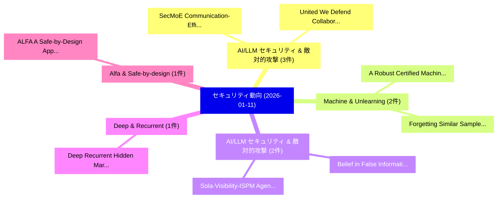

# 📅 02_daily: 日次エグゼクティブサマリー報告書 (2026-01-11)

**集計日時**: 2026-10-02 23:05:53 UTC  
**対象日付**: 2026-01-11  
**本日収集論文数**: 19 件  

---

## 💡 主要セキュリティ動向・脅威インサイト (Executive Insights)

本日の収集論文（計 19 件）において、以下の重点セキュリティ領域で活発な研究動向が確認されました：
- **AI/LLM セキュリティ & 敵対的攻撃** (3 件): 注目論文として 「SecMoE: Communication-Efficien...」、「United We Defend: Collaborativ...」 等が発表され、実務防御および攻撃検証の進展が見られます。
- **Machine & Unlearning** (2 件): 注目論文として 「Forgetting Similar Samples: Ca...」、「A Robust Certified Machine Unl...」 等が発表され、実務防御および攻撃検証の進展が見られます。
- **AI/LLM セキュリティ & 敵対的攻撃** (2 件): 注目論文として 「Belief in False Information: A...」、「Sola-Visibility-ISPM: Agentic ...」 等が発表され、実務防御および攻撃検証の進展が見られます。
- **Deep & Recurrent** (1 件): 注目論文として 「Deep Recurrent Hidden Markov L...」 等が発表され、実務防御および攻撃検証の進展が見られます。
- **Alfa & Safe-by-design** (1 件): 注目論文として 「ALFA: A Safe-by-Design Approac...」 等が発表され、実務防御および攻撃検証の進展が見られます。

### 🗺️ 技術・脅威トピックマインドマップ

---

## 📌 日次セキュリティ論文一覧 (日本語表形式)

| No | arXiv ID | 論文タイトル (日本語訳) | 重要キーワード | 構造化エグゼクティブ要約 (背景・提案・影響) | 脅威分類 | 詳細リンク |
|---|---|---|---|---|---|---|
| 1 | `2601.06734v2` | [Deep Recurrent Hidden Markov Learning Framework for Multi-Stage Advanced Persistent Threat Prediction（セキュリティ分析論文）](../../okf/papers/2026-01-11/2601.06734.md) | `Stage Advanced Persistent Threat Prediction`, `Multi-Stage Advanced`, `Stage Advanced Persistent Threat` | 【提案】概要 (Overview & Key Finding) 本論文「Deep Recurrent Hidden Markov Learning Framework for Mul...。実証評価により経営層・セキュリティ管理者向け推奨アクション (E... | `cybersecurity` | [arXiv](https://arxiv.org/abs/2601.06734v2) &#124; [OKF](../../okf/papers/2026-01-11/2601.06734.md) |
| 2 | `2601.06768v1` | [ALFA: A Safe-by-Design Approach to Mitigate Quishing Attacks Launched via Fancy QR Codes（セキュリティ分析論文）](../../okf/papers/2026-01-11/2601.06768.md) | `Mitigate Quishing Attacks Launched`, `Muhammad Wahid Akram`, `Muneeb Ul Hassan` | 【提案】概要 (Overview & Key Finding) 本論文「ALFA: A Safe-by-Design Approach to Mitigate Quishing At...。実証評価により経営層・セキュリティ管理者向け推奨アクション (E... | `executive-summary` | [arXiv](https://arxiv.org/abs/2601.06768v1) &#124; [OKF](../../okf/papers/2026-01-11/2601.06768.md) |
| 3 | `2601.06779v1` | [CyberLLM-FINDS 2025: Instruction-Tuned Fine-tuning of Domain-Specific LLMs with Retrieval-Augmented Generation and Graph Integration for MITRE Evaluation（セキュリティ分析論文）](../../okf/papers/2026-01-11/2601.06779.md) | `Tuned Fine`, `Augmented Generation`, `Graph Integration` | 【提案】概要 (Overview & Key Finding) 本論文「CyberLLM-FINDS 2025: Instruction-Tuned Fine-tuning of D...。実証評価により経営層・セキュリティ管理者向け推奨アクション (E... | `cybersecurity` | [arXiv](https://arxiv.org/abs/2601.06779v1) &#124; [OKF](../../okf/papers/2026-01-11/2601.06779.md) |
| 4 | `2601.06790v1` | [SecMoE: Communication-Efficient Secure MoE Inference via Select-Then-Compute（セキュリティ分析論文）](../../okf/papers/2026-01-11/2601.06790.md) | `Efficient Secure`, `Communication-Efficient Secure`, `Bowen Shen` | 【提案】概要 (Overview & Key Finding) 本論文「SecMoE: Communication-Efficient Secure MoE Inference vi...。実証評価により経営層・セキュリティ管理者向け推奨アクション (E... | `cs.AI` | [arXiv](https://arxiv.org/abs/2601.06790v1) &#124; [OKF](../../okf/papers/2026-01-11/2601.06790.md) |
| 5 | `2601.06838v1` | [CHASE: LLMエージェント for Dissecting Malicious PyPI Packages](../../okf/papers/2026-01-11/2601.06838.md) | `Dissecting Malicious`, `Takaaki Toda`, `Tatsuya Mori` | 【提案】概要 (Overview & Key Finding) 本論文「CHASE: LLMエージェント for Dissecting Malicious PyPI Packages...。実証評価により経営層・セキュリティ管理者向け推奨アクション (E... | `executive-summary` | [arXiv](https://arxiv.org/abs/2601.06838v1) &#124; [OKF](../../okf/papers/2026-01-11/2601.06838.md) |
| 6 | `2601.06862v2` | [Learning QoE from Packet-Level Measurements in Encrypted Video Conferencing Traffic（セキュリティ分析論文）](../../okf/papers/2026-01-11/2601.06862.md) | `Encrypted Video Conferencing Traffic`, `Level Measurements`, `Packet-Level Measurements` | 【提案】概要 (Overview & Key Finding) 本論文「Learning QoE from Packet-Level Measurements in Encrypte...。実証評価により経営層・セキュリティ管理者向け推奨アクション (E... | `cs.MM` | [arXiv](https://arxiv.org/abs/2601.06862v2) &#124; [OKF](../../okf/papers/2026-01-11/2601.06862.md) |
| 7 | `2601.06866v1` | [United We Defend: Collaborative Membership Inference Defenses in 連合学習](../../okf/papers/2026-01-11/2601.06866.md) | `Collaborative Membership Inference Defenses`, `Federated Learning`, `Li Bai` | 【提案】概要 (Overview & Key Finding) 本論文「United We Defend: Collaborative Membership Inference De...。実証評価により経営層・セキュリティ管理者向け推奨アクション (E... | `cybersecurity` | [arXiv](https://arxiv.org/abs/2601.06866v1) &#124; [OKF](../../okf/papers/2026-01-11/2601.06866.md) |
| 8 | `2601.06914v1` | [Compositional Generalization in LLMs for Smart Contract Security: A Case Study on Reentrancy Vulnerabilitiesに向けて](../../okf/papers/2026-01-11/2601.06914.md) | `Smart Contract Security`, `Compositional Generalization`, `Towards Compositional Generalization` | 【提案】概要 (Overview & Key Finding) 本論文「Compositional Generalization in LLMs for スマートコントラクト Sec...。実証評価により経営層・セキュリティ管理者向け推奨アクション (E... | `cs.AI` | [arXiv](https://arxiv.org/abs/2601.06914v1) &#124; [OKF](../../okf/papers/2026-01-11/2601.06914.md) |
| 9 | `2601.06938v1` | [Forgetting Similar Samples: Can Machine Unlearning Do it Better?（セキュリティ分析論文）](../../okf/papers/2026-01-11/2601.06938.md) | `Forgetting Similar Samples`, `Heng Xu`, `Tianqing Zhu` | 【提案】### (日本語題名: Forgetting Similar Samples: Can Machine Unlearning Do it Better?（セキュリティ分析論文...。実証評価により経営層・セキュリティ管理者向け推奨アクション (E... | `executive-summary` | [arXiv](https://arxiv.org/abs/2601.06938v1) &#124; [OKF](../../okf/papers/2026-01-11/2601.06938.md) |
| 10 | `2601.06948v2` | [Operational Runtime Behavior Mining for Open-Source Supply Chain Security（セキュリティ分析論文）](../../okf/papers/2026-01-11/2601.06948.md) | `Operational Runtime Behavior Mining`, `Source Supply Chain Security`, `Open-Source Supply` | 【提案】概要 (Overview & Key Finding) 本論文「Operational Runtime Behavior Mining for Open-Source Sup...。実証評価により経営層・セキュリティ管理者向け推奨アクション (E... | `cybersecurity` | [arXiv](https://arxiv.org/abs/2601.06948v2) &#124; [OKF](../../okf/papers/2026-01-11/2601.06948.md) |
| 11 | `2601.06967v1` | [A Robust Certified Machine Unlearning Method Under Distribution Shift（セキュリティ分析論文）](../../okf/papers/2026-01-11/2601.06967.md) | `Jinduo Guo`, `Yinzhi Cao`, `Raw Meta` | 【提案】概要 (Overview & Key Finding) 本論文「A Robust Certified Machine Unlearning Method Under Dist...。実証評価により経営層・セキュリティ管理者向け推奨アクション (E... | `executive-summary` | [arXiv](https://arxiv.org/abs/2601.06967v1) &#124; [OKF](../../okf/papers/2026-01-11/2601.06967.md) |
| 12 | `2601.07004v1` | [MemTrust: A Zero-Trust Architecture for Unified AI Memory System（セキュリティ分析論文）](../../okf/papers/2026-01-11/2601.07004.md) | `Trust Architecture`, `Memory System`, `Zero-Trust Architecture` | 【提案】概要 (Overview & Key Finding) 本論文「MemTrust: A ゼロトラスト Architecture for Unified AI Memory S...。実証評価により経営層・セキュリティ管理者向け推奨アクション (E... | `cs.AI` | [arXiv](https://arxiv.org/abs/2601.07004v1) &#124; [OKF](../../okf/papers/2026-01-11/2601.07004.md) |
| 13 | `2601.07016v1` | [Belief in False Information: A Human-Centered Security Risk in Sociotechnical Systems（セキュリティ分析論文）](../../okf/papers/2026-01-11/2601.07016.md) | `Centered Security Risk`, `False Information`, `Human-Centered Security` | 【提案】概要 (Overview & Key Finding) 本論文「Belief in False Information: A Human-Centered Security ...。実証評価により経営層・セキュリティ管理者向け推奨アクション (E... | `cs.AI` | [arXiv](https://arxiv.org/abs/2601.07016v1) &#124; [OKF](../../okf/papers/2026-01-11/2601.07016.md) |
| 14 | `2601.07019v1` | [Zer0n: An AI-Assisted Vulnerability Discovery and Blockchain-Backed Integrity Framework（セキュリティ分析論文）](../../okf/papers/2026-01-11/2601.07019.md) | `Assisted Vulnerability Discovery`, `AI-Assisted Vulnerability`, `Blockchain-Backed Integrity` | 【提案】概要 (Overview & Key Finding) 本論文「Zer0n: An AI-Assisted 脆弱性 Discovery and Blockchain-Back...。実証評価により経営層・セキュリティ管理者向け推奨アクション (E... | `cs.AI` | [arXiv](https://arxiv.org/abs/2601.07019v1) &#124; [OKF](../../okf/papers/2026-01-11/2601.07019.md) |
| 15 | `2601.07071v1` | [LINEture: novel signature cryptosystem（セキュリティ分析論文）](../../okf/papers/2026-01-11/2601.07071.md) | `Gennady Khalimov`, `Yevgen Kotukh`, `Raw Meta` | 【提案】概要 (Overview & Key Finding) 本論文「LINEture: novel signature cryptosystem（セキュリティ分析論文）」（原題:...。実証評価により経営層・セキュリティ管理者向け推奨アクション (E... | `cybersecurity` | [arXiv](https://arxiv.org/abs/2601.07071v1) &#124; [OKF](../../okf/papers/2026-01-11/2601.07071.md) |
| 16 | `2601.07072v1` | [Overcoming the Retrieval Barrier: Indirect Prompt Injection in the Wild for LLM Systems（セキュリティ分析論文）](../../okf/papers/2026-01-11/2601.07072.md) | `Indirect Prompt Injection`, `Retrieval Barrier`, `Hongyan Chang` | 【提案】概要 (Overview & Key Finding) 本論文「Overcoming the Retrieval Barrier: Indirect プロンプトインジェクショ...。実証評価により経営層・セキュリティ管理者向け推奨アクション (E... | `cs.AI` | [arXiv](https://arxiv.org/abs/2601.07072v1) &#124; [OKF](../../okf/papers/2026-01-11/2601.07072.md) |
| 17 | `2601.07084v1` | [How Secure is Secure Code Generation? Adversarial Prompts Put LLM Defenses to the Test（セキュリティ分析論文）](../../okf/papers/2026-01-11/2601.07084.md) | `Secure Code Generation`, `Adversarial Prompts Put`, `Melissa Tessa` | 【提案】Adversarial Prompts Put LLM Defenses to the Test ### (日本語題名: How Secure is Secure Code ...。実証評価により経営層・セキュリティ管理者向け推奨アクション (E... | `executive-summary` | [arXiv](https://arxiv.org/abs/2601.07084v1) &#124; [OKF](../../okf/papers/2026-01-11/2601.07084.md) |
| 18 | `2601.07880v1` | [Sola-Visibility-ISPM: Agentic AI for Identity Security Posture Management Visibilityのベンチマーク評価](../../okf/papers/2026-01-11/2601.07880.md) | `Identity Security Posture Management Visibility`, `Identity Security Posture Management`, `Benchmarking Agentic` | 【提案】概要 (Overview & Key Finding) 本論文「Sola-Visibility-ISPM: Agentic AI for Identity Security ...。実証評価により経営層・セキュリティ管理者向け推奨アクション (E... | `cs.AI` | [arXiv](https://arxiv.org/abs/2601.07880v1) &#124; [OKF](../../okf/papers/2026-01-11/2601.07880.md) |
| 19 | `2602.17672v1` | [Assessing LLM Response Quality in the Context of Technology-Facilitated Abuse（セキュリティ分析論文）](../../okf/papers/2026-01-11/2602.17672.md) | `Response Quality`, `Facilitated Abuse`, `Technology-Facilitated Abuse` | 【提案】概要 (Overview & Key Finding) 本論文「Assessing LLM Response Quality in the Context of Techno...。実証評価により経営層・セキュリティ管理者向け推奨アクション (E... | `cs.AI` | [arXiv](https://arxiv.org/abs/2602.17672v1) &#124; [OKF](../../okf/papers/2026-01-11/2602.17672.md) |

