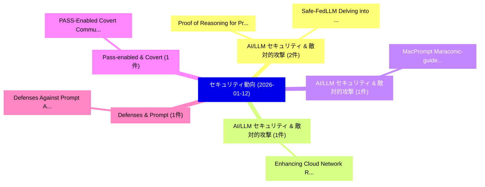

# 📅 02_daily: 日次エグゼクティブサマリー報告書 (2026-01-12)

**集計日時**: 2026-10-02 23:05:53 UTC  
**対象日付**: 2026-01-12  
**本日収集論文数**: 23 件  

---

## 💡 主要セキュリティ動向・脅威インサイト (Executive Insights)

本日の収集論文（計 23 件）において、以下の重点セキュリティ領域で活発な研究動向が確認されました：
- **AI/LLM セキュリティ & 敵対的攻撃** (2 件): 注目論文として 「Proof of Reasoning for Privacy...」、「Safe-FedLLM: Delving into the ...」 等が発表され、実務防御および攻撃検証の進展が見られます。
- **AI/LLM セキュリティ & 敵対的攻撃** (1 件): 注目論文として 「Enhancing Cloud Network Resili...」 等が発表され、実務防御および攻撃検証の進展が見られます。
- **AI/LLM セキュリティ & 敵対的攻撃** (1 件): 注目論文として 「MacPrompt: Maraconic-guided Ja...」 等が発表され、実務防御および攻撃検証の進展が見られます。
- **Pass-enabled & Covert** (1 件): 注目論文として 「PASS-Enabled Covert Communicat...」 等が発表され、実務防御および攻撃検証の進展が見られます。
- **Defenses & Prompt** (1 件): 注目論文として 「Defenses Against Prompt Attack...」 等が発表され、実務防御および攻撃検証の進展が見られます。

### 🗺️ 技術・脅威トピックマインドマップ

---

## 📌 日次セキュリティ論文一覧 (日本語表形式)

| No | arXiv ID | 論文タイトル (日本語訳) | 重要キーワード | 構造化エグゼクティブ要約 (背景・提案・影響) | 脅威分類 | 詳細リンク |
|---|---|---|---|---|---|---|
| 1 | `2601.07122v2` | [Enhancing Cloud Network Resilience via a Robust LLM-Empowered Multi-Agent Reinforcement Learning Framework（セキュリティ分析論文）](../../okf/papers/2026-01-12/2601.07122.md) | `Enhancing Cloud Network Resilience`, `Empowered Multi`, `LLM-Empowered Multi` | 【提案】概要 (Overview & Key Finding) 本論文「Enhancing Cloud Network Resilience via a Robust LLM-Emp...。実証評価により経営層・セキュリティ管理者向け推奨アクション (E... | `cs.AI` | [arXiv](https://arxiv.org/abs/2601.07122v2) &#124; [OKF](../../okf/papers/2026-01-12/2601.07122.md) |
| 2 | `2601.07134v1` | [Proof of Reasoning for Privacy Enhanced Federated Blockchain Learning at the Edge（セキュリティ分析論文）](../../okf/papers/2026-01-12/2601.07134.md) | `Privacy Enhanced Federated Blockchain Learning`, `James Calo`, `Benny Lo` | 【提案】概要 (Overview & Key Finding) 本論文「Proof of Reasoning for Privacy Enhanced Federated Block...。実証評価により経営層・セキュリティ管理者向け推奨アクション (E... | `cs.CV` | [arXiv](https://arxiv.org/abs/2601.07134v1) &#124; [OKF](../../okf/papers/2026-01-12/2601.07134.md) |
| 3 | `2601.07141v1` | [MacPrompt: Maraconic-guided Jailbreak against Text-to-Image Models（セキュリティ分析論文）](../../okf/papers/2026-01-12/2601.07141.md) | `Image Models`, `Maraconic-guided Jailbreak`, `Xi Ye` | 【提案】概要 (Overview & Key Finding) 本論文「MacPrompt: Maraconic-guided ジェイルブレイク against Text-to-Im...。実証評価により経営層・セキュリティ管理者向け推奨アクション (E... | `cybersecurity` | [arXiv](https://arxiv.org/abs/2601.07141v1) &#124; [OKF](../../okf/papers/2026-01-12/2601.07141.md) |
| 4 | `2601.07147v1` | [PASS-Enabled Covert Communications With Distributed Cooperative Wardens（セキュリティ分析論文）](../../okf/papers/2026-01-12/2601.07147.md) | `PASS-Enabled Covert`, `Raw Meta`, `Executive Summary` | 【提案】概要 (Overview & Key Finding) 本論文「PASS-Enabled Covert Communications With Distributed Coo...。実証評価により経営層・セキュリティ管理者向け推奨アクション (E... | `executive-summary` | [arXiv](https://arxiv.org/abs/2601.07147v1) &#124; [OKF](../../okf/papers/2026-01-12/2601.07147.md) |
| 5 | `2601.07177v5` | [Safe-FedLLM: Delving into the Safety of Federated 大規模言語モデル](../../okf/papers/2026-01-12/2601.07177.md) | `Federated Large Language Models`, `Mingxiang Tao`, `Yu Tian` | 【提案】概要 (Overview & Key Finding) 本論文「Safe-FedLLM: Delving into the Safety of Federated 大規模言語...。実証評価により経営層・セキュリティ管理者向け推奨アクション (E... | `cs.AI` | [arXiv](https://arxiv.org/abs/2601.07177v5) &#124; [OKF](../../okf/papers/2026-01-12/2601.07177.md) |
| 6 | `2601.07185v1` | [Defenses Against Prompt Attacks Learn Surface Heuristics（セキュリティ分析論文）](../../okf/papers/2026-01-12/2601.07185.md) | `Shawn Li`, `Chenxiao Yu`, `Zhiyu Ni` | 【提案】概要 (Overview & Key Finding) 本論文「Defenses Against Prompt Attacks Learn Surface Heuristic...。実証評価により経営層・セキュリティ管理者向け推奨アクション (E... | `cs.AI` | [arXiv](https://arxiv.org/abs/2601.07185v1) &#124; [OKF](../../okf/papers/2026-01-12/2601.07185.md) |
| 7 | `2601.07214v1` | [BlindU: Blind Machine Unlearning without Revealing Erasing Data（セキュリティ分析論文）](../../okf/papers/2026-01-12/2601.07214.md) | `Blind Machine Unlearning`, `Revealing Erasing Data`, `Weiqi Wang` | 【提案】背景とセキュリティ上の課題 (Background & Problem) 本研究はサイバー脅威環境におけるセキュリティ構造・脆弱性の検証を目的としています。(主要検出項目: ...。実証評価により経営層・セキュリティ管理者向け推奨アクション (E... | `cs.AI` | [arXiv](https://arxiv.org/abs/2601.07214v1) &#124; [OKF](../../okf/papers/2026-01-12/2601.07214.md) |
| 8 | `2601.07253v1` | [Universal Adversarial Purification with DDIM Metric Loss for Stable Diffusion（セキュリティ分析論文）](../../okf/papers/2026-01-12/2601.07253.md) | `Universal Adversarial Purification`, `Metric Loss`, `Stable Diffusion` | 【提案】概要 (Overview & Key Finding) 本論文「Universal Adversarial Purification with DDIM Metric Los...。実証評価により経営層・セキュリティ管理者向け推奨アクション (E... | `cs.CV` | [arXiv](https://arxiv.org/abs/2601.07253v1) &#124; [OKF](../../okf/papers/2026-01-12/2601.07253.md) |
| 9 | `2601.07263v1` | [When Bots Take the Bait: Exposing and Mitigating the Emerging Social Engineering Attack in Web Automation Agent（セキュリティ分析論文）](../../okf/papers/2026-01-12/2601.07263.md) | `Emerging Social Engineering Attack`, `Web Automation Agent`, `Xinyi Wu` | 【提案】概要 (Overview & Key Finding) 本論文「When Bots Take the Bait: Exposing and Mitigating the Em...。実証評価により経営層・セキュリティ管理者向け推奨アクション (E... | `cs.AI` | [arXiv](https://arxiv.org/abs/2601.07263v1) &#124; [OKF](../../okf/papers/2026-01-12/2601.07263.md) |
| 10 | `2601.07276v2` | [A High-Recall Cost-Sensitive Machine Learning Framework for Real-Time Online Banking Transaction Fraud Detection（セキュリティ分析論文）](../../okf/papers/2026-01-12/2601.07276.md) | `Time Online Banking Transaction Fraud Detection`, `Recall Cost`, `High-Recall Cost` | 【提案】概要 (Overview & Key Finding) 本論文「A High-Recall Cost-Sensitive Machine Learning Framework...。実証評価により経営層・セキュリティ管理者向け推奨アクション (E... | `executive-summary` | [arXiv](https://arxiv.org/abs/2601.07276v2) &#124; [OKF](../../okf/papers/2026-01-12/2601.07276.md) |
| 11 | `2601.07305v1` | [Memory-Based マルウェア検出 under Limited Data Conditions: A Comparative Evaluation of TabPFN and Ensemble Models](../../okf/papers/2026-01-12/2601.07305.md) | `Limited Data Conditions`, `Ensemble Models`, `Based Malware Detection` | 【提案】概要 (Overview & Key Finding) 本論文「Memory-Based マルウェア検出 under Limited Data Conditions: A C...。実証評価により経営層・セキュリティ管理者向け推奨アクション (E... | `cybersecurity` | [arXiv](https://arxiv.org/abs/2601.07305v1) &#124; [OKF](../../okf/papers/2026-01-12/2601.07305.md) |
| 12 | `2601.07334v1` | [Examining the Effectiveness of Transformer-Based Smart Contract Vulnerability Scan（セキュリティ分析論文）](../../okf/papers/2026-01-12/2601.07334.md) | `Based Smart Contract Vulnerability Scan`, `Transformer-Based Smart`, `Based Smart Contract Vulnerability` | 【提案】概要 (Overview & Key Finding) 本論文「Examining the Effectiveness of Transformer-Based スマートコン...。実証評価により経営層・セキュリティ管理者向け推奨アクション (E... | `executive-summary` | [arXiv](https://arxiv.org/abs/2601.07334v1) &#124; [OKF](../../okf/papers/2026-01-12/2601.07334.md) |
| 13 | `2601.07395v1` | [MCP-ITP: An Automated Framework for Implicit Tool Poisoning in MCP（セキュリティ分析論文）](../../okf/papers/2026-01-12/2601.07395.md) | `Implicit Tool Poisoning`, `Ruiqi Li`, `Zhiqiang Wang` | 【提案】概要 (Overview & Key Finding) 本論文「MCP-ITP: An Automated Framework for Implicit Tool Poiso...。実証評価により経営層・セキュリティ管理者向け推奨アクション (E... | `cs.AI` | [arXiv](https://arxiv.org/abs/2601.07395v1) &#124; [OKF](../../okf/papers/2026-01-12/2601.07395.md) |
| 14 | `2601.07402v1` | [Peacock: UEFI Firmware Runtime Observability Layer for Detection and Response（セキュリティ分析論文）](../../okf/papers/2026-01-12/2601.07402.md) | `Firmware Runtime Observability Layer`, `Hadar Cochavi Gorelik`, `Orel Fadlon` | 【提案】概要 (Overview & Key Finding) 本論文「Peacock: UEFI Firmware Runtime Observability Layer for ...。実証評価により経営層・セキュリティ管理者向け推奨アクション (E... | `cybersecurity` | [arXiv](https://arxiv.org/abs/2601.07402v1) &#124; [OKF](../../okf/papers/2026-01-12/2601.07402.md) |
| 15 | `2601.07511v2` | [Principal ideal problem and ideal shortest vector over rational primes in power-of-two cyclotomic fields（セキュリティ分析論文）](../../okf/papers/2026-01-12/2601.07511.md) | `Gaohao Cui`, `Jianing Li`, `Jincheng Zhuang` | 【提案】概要 (Overview & Key Finding) 本論文「Principal ideal problem and ideal shortest vector over ...。実証評価により経営層・セキュリティ管理者向け推奨アクション (E... | `cybersecurity` | [arXiv](https://arxiv.org/abs/2601.07511v2) &#124; [OKF](../../okf/papers/2026-01-12/2601.07511.md) |
| 16 | `2601.07536v1` | [A Protocol-Aware P4 Pipeline for MQTT Security and Anomaly Mitigation in Edge IoT Systems（セキュリティ分析論文）](../../okf/papers/2026-01-12/2601.07536.md) | `Aware P4 Pipeline`, `Anomaly Mitigation`, `Protocol-Aware P4` | 【提案】概要 (Overview & Key Finding) 本論文「A Protocol-Aware P4 Pipeline for MQTT Security and Anom...。実証評価により経営層・セキュリティ管理者向け推奨アクション (E... | `cs.NI` | [arXiv](https://arxiv.org/abs/2601.07536v1) &#124; [OKF](../../okf/papers/2026-01-12/2601.07536.md) |
| 17 | `2601.07634v1` | [Simple Power Polynomial Multiplication in HQCの分析](../../okf/papers/2026-01-12/2601.07634.md) | `Simple Power Polynomial Multiplication`, `Polynomial Multiplication`, `Pavel Velek` | 【提案】概要 (Overview & Key Finding) 本論文「Simple Power Polynomial Multiplication in HQCの分析」（原題: S...。実証評価により経営層・セキュリティ管理者向け推奨アクション (E... | `cybersecurity` | [arXiv](https://arxiv.org/abs/2601.07634v1) &#124; [OKF](../../okf/papers/2026-01-12/2601.07634.md) |
| 18 | `2601.07644v1` | [Hagenberg Risk Management Process (Part 1): Multidimensional Polar Heatmaps for Context-Sensitive Risk Analysis（セキュリティ分析論文）](../../okf/papers/2026-01-12/2601.07644.md) | `Hagenberg Risk Management Process`, `Multidimensional Polar Heatmaps`, `Context-Sensitive Risk` | 【提案】概要 (Overview & Key Finding) 本論文「Hagenberg Risk Management Process (Part 1): Multidimens...。実証評価により経営層・セキュリティ管理者向け推奨アクション (E... | `cybersecurity` | [arXiv](https://arxiv.org/abs/2601.07644v1) &#124; [OKF](../../okf/papers/2026-01-12/2601.07644.md) |
| 19 | `2601.07654v1` | [Automating Blockchain Consensus Verification with IsabeLLMに向けて](../../okf/papers/2026-01-12/2601.07654.md) | `Towards Automating Blockchain Consensus Verification`, `Automating Blockchain Consensus Verification`, `Elliot Jones` | 【提案】概要 (Overview & Key Finding) 本論文「Automating Blockchain Consensus Verification with Isabe...。実証評価により経営層・セキュリティ管理者向け推奨アクション (E... | `cs.AI` | [arXiv](https://arxiv.org/abs/2601.07654v1) &#124; [OKF](../../okf/papers/2026-01-12/2601.07654.md) |
| 20 | `2601.07726v1` | [TeeMAF: A TEE-Based Mutual Attestation Framework for On-Chain and Off-Chain Functions in Blockchain DApps（セキュリティ分析論文）](../../okf/papers/2026-01-12/2601.07726.md) | `Chain Functions`, `TEE-Based Mutual`, `Off-Chain Functions` | 【提案】概要 (Overview & Key Finding) 本論文「TeeMAF: A TEE-Based Mutual Attestation Framework for On...。実証評価により経営層・セキュリティ管理者向け推奨アクション (E... | `cs.NI` | [arXiv](https://arxiv.org/abs/2601.07726v1) &#124; [OKF](../../okf/papers/2026-01-12/2601.07726.md) |
| 21 | `2601.07835v1` | [SecureCAI: Injection-Resilient LLM Assistants for サイバーセキュリティ Operations](../../okf/papers/2026-01-12/2601.07835.md) | `Injection-Resilient LLM`, `Cybersecurity Operations`, `Mohammed Himayath Ali` | 【提案】概要 (Overview & Key Finding) 本論文「SecureCAI: Injection-Resilient LLM Assistants for サイバーセ...。実証評価により経営層・セキュリティ管理者向け推奨アクション (E... | `cs.CV` | [arXiv](https://arxiv.org/abs/2601.07835v1) &#124; [OKF](../../okf/papers/2026-01-12/2601.07835.md) |
| 22 | `2601.07885v2` | [False Friends in the Shell: Unveiling the Emoticon Semantic Confusion in 大規模言語モデル](../../okf/papers/2026-01-12/2601.07885.md) | `Emoticon Semantic Confusion`, `False Friends`, `Large Language Models` | 【提案】概要 (Overview & Key Finding) 本論文「False Friends in the Shell: Unveiling the Emoticon Sema...。実証評価により経営層・セキュリティ管理者向け推奨アクション (E... | `cs.AI` | [arXiv](https://arxiv.org/abs/2601.07885v2) &#124; [OKF](../../okf/papers/2026-01-12/2601.07885.md) |
| 23 | `2601.09748v1` | [Instalación, configuración y utilización de un nodo Bitcoin en Linux（セキュリティ分析論文）](../../okf/papers/2026-01-12/2601.09748.md) | `Jose Eduardo Ulloa`, `Raw Meta`, `Executive Summary` | 【提案】概要 (Overview & Key Finding) 本論文「Instalación, configuración y utilización de un nodo Bit...。実証評価によりLlanos - **公開日時**:。 | `cs.ET` | [arXiv](https://arxiv.org/abs/2601.09748v1) &#124; [OKF](../../okf/papers/2026-01-12/2601.09748.md) |

