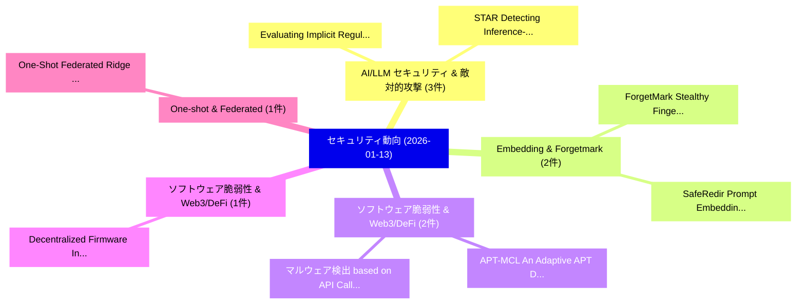

# 📅 02_daily: 日次エグゼクティブサマリー報告書 (2026-01-13)

**集計日時**: 2026-10-02 23:05:54 UTC  
**対象日付**: 2026-01-13  
**本日収集論文数**: 24 件  

---

## 💡 主要セキュリティ動向・脅威インサイト (Executive Insights)

本日の収集論文（計 24 件）において、以下の重点セキュリティ領域で活発な研究動向が確認されました：
- **AI/LLM セキュリティ & 敵対的攻撃** (3 件): 注目論文として 「Evaluating Implicit Regulatory...」、「STAR: Detecting Inference-time...」 等が発表され、実務防御および攻撃検証の進展が見られます。
- **Embedding & Forgetmark** (2 件): 注目論文として 「ForgetMark: Stealthy Fingerpri...」、「SafeRedir: Prompt Embedding Re...」 等が発表され、実務防御および攻撃検証の進展が見られます。
- **ソフトウェア脆弱性 & Web3/DeFi** (2 件): 注目論文として 「APT-MCL: An Adaptive APT Detec...」、「マルウェア検出 based on API Calls: A ...」 等が発表され、実務防御および攻撃検証の進展が見られます。
- **ソフトウェア脆弱性 & Web3/DeFi** (1 件): 注目論文として 「Decentralized Firmware Integri...」 等が発表され、実務防御および攻撃検証の進展が見られます。
- **One-shot & Federated** (1 件): 注目論文として 「One-Shot Federated Ridge Regre...」 等が発表され、実務防御および攻撃検証の進展が見られます。

### 🗺️ 技術・脅威トピックマインドマップ

---

## 📌 日次セキュリティ論文一覧 (日本語表形式)

| No | arXiv ID | 論文タイトル (日本語訳) | 重要キーワード | 構造化エグゼクティブ要約 (背景・提案・影響) | 脅威分類 | 詳細リンク |
|---|---|---|---|---|---|---|
| 1 | `2601.08091v1` | [Decentralized Firmware Integrity Verification for Cyber-Physical Systems Using Ethereum Blockchain（セキュリティ分析論文）](../../okf/papers/2026-01-13/2601.08091.md) | `Physical Systems Using Ethereum Blockchain`, `Decentralized Firmware Integrity Verification`, `Cyber-Physical Systems` | 【提案】概要 (Overview & Key Finding) 本論文「Decentralized Firmware Integrity Verification for Cyber...。実証評価により経営層・セキュリティ管理者向け推奨アクション (E... | `cybersecurity` | [arXiv](https://arxiv.org/abs/2601.08091v1) &#124; [OKF](../../okf/papers/2026-01-13/2601.08091.md) |
| 2 | `2601.08189v2` | [ForgetMark: Stealthy Fingerprint Embedding via Targeted Unlearning in Language Models（セキュリティ分析論文）](../../okf/papers/2026-01-13/2601.08189.md) | `Stealthy Fingerprint Embedding`, `Targeted Unlearning`, `Language Models` | 【提案】概要 (Overview & Key Finding) 本論文「ForgetMark: Stealthy Fingerprint Embedding via Targeted...。実証評価により経営層・セキュリティ管理者向け推奨アクション (E... | `cs.AI` | [arXiv](https://arxiv.org/abs/2601.08189v2) &#124; [OKF](../../okf/papers/2026-01-13/2601.08189.md) |
| 3 | `2601.08196v1` | [Evaluating Implicit Regulatory Compliance in LLM Tool Invocation via Logic-Guided Synthesis（セキュリティ分析論文）](../../okf/papers/2026-01-13/2601.08196.md) | `Evaluating Implicit Regulatory Compliance`, `Tool Invocation`, `Guided Synthesis` | 【提案】概要 (Overview & Key Finding) 本論文「Evaluating Implicit Regulatory Compliance in LLM Tool I...。実証評価により経営層・セキュリティ管理者向け推奨アクション (E... | `cs.AI` | [arXiv](https://arxiv.org/abs/2601.08196v1) &#124; [OKF](../../okf/papers/2026-01-13/2601.08196.md) |
| 4 | `2601.08216v1` | [One-Shot Federated Ridge Regression: Exact Recovery via Sufficient Statistic Aggregation（セキュリティ分析論文）](../../okf/papers/2026-01-13/2601.08216.md) | `Shot Federated Ridge Regression`, `Sufficient Statistic Aggregation`, `Exact Recovery` | 【提案】概要 (Overview & Key Finding) 本論文「One-Shot Federated Ridge Regression: Exact Recovery via...。実証評価により経営層・セキュリティ管理者向け推奨アクション (E... | `executive-summary` | [arXiv](https://arxiv.org/abs/2601.08216v1) &#124; [OKF](../../okf/papers/2026-01-13/2601.08216.md) |
| 5 | `2601.08223v3` | [DNF: Dual-Layer Nested Fingerprinting for Large Language Model Intellectual Property Protection（セキュリティ分析論文）](../../okf/papers/2026-01-13/2601.08223.md) | `Large Language Model Intellectual Property Protection`, `Layer Nested Fingerprinting`, `Dual-Layer Nested` | 【提案】概要 (Overview & Key Finding) 本論文「DNF: Dual-Layer Nested Fingerprinting for Large Languag...。実証評価により経営層・セキュリティ管理者向け推奨アクション (E... | `cs.AI` | [arXiv](https://arxiv.org/abs/2601.08223v3) &#124; [OKF](../../okf/papers/2026-01-13/2601.08223.md) |
| 6 | `2601.08229v1` | [A Survey of Security Challenges and Solutions for UAS Traffic Management (UTM) and small Unmanned Aerial Systems (sUAS)（セキュリティ分析論文）](../../okf/papers/2026-01-13/2601.08229.md) | `Unmanned Aerial Systems`, `Security Challenges`, `Traffic Management` | 【提案】概要 (Overview & Key Finding) 本論文「A Survey of Security Challenges and Solutions for UAS T...。実証評価により経営層・セキュリティ管理者向け推奨アクション (E... | `cybersecurity` | [arXiv](https://arxiv.org/abs/2601.08229v1) &#124; [OKF](../../okf/papers/2026-01-13/2601.08229.md) |
| 7 | `2601.08328v1` | [APT-MCL: An Adaptive APT Detection System Based on Multi-View Collaborative Provenance Graph Learning（セキュリティ分析論文）](../../okf/papers/2026-01-13/2601.08328.md) | `View Collaborative Provenance Graph Learning`, `Detection System Based`, `Multi-View Collaborative` | 【提案】概要 (Overview & Key Finding) 本論文「APT-MCL: An Adaptive APT Detection System Based on Mult...。実証評価により経営層・セキュリティ管理者向け推奨アクション (E... | `cybersecurity` | [arXiv](https://arxiv.org/abs/2601.08328v1) &#124; [OKF](../../okf/papers/2026-01-13/2601.08328.md) |
| 8 | `2601.08368v1` | [A New Tool to Find Lightweight (And, Xor) Implementations of Quadratic Vectorial Boolean Functions up to Dimension 9（セキュリティ分析論文）](../../okf/papers/2026-01-13/2601.08368.md) | `Quadratic Vectorial Boolean Functions`, `New Tool`, `Find Lightweight` | 【提案】概要 (Overview & Key Finding) 本論文「A New Tool to Find Lightweight (And, Xor) Implementatio...。実証評価により経営層・セキュリティ管理者向け推奨アクション (E... | `executive-summary` | [arXiv](https://arxiv.org/abs/2601.08368v1) &#124; [OKF](../../okf/papers/2026-01-13/2601.08368.md) |
| 9 | `2601.08406v1` | [WebTrap Park: An Automated Platform for Systematic Security Evaluation of Web Agents（セキュリティ分析論文）](../../okf/papers/2026-01-13/2601.08406.md) | `Web Agents`, `Xinyi Wu`, `Jiagui Chen` | 【提案】概要 (Overview & Key Finding) 本論文「WebTrap Park: An Automated Platform for Systematic Secu...。実証評価により経営層・セキュリティ管理者向け推奨アクション (E... | `cs.AI` | [arXiv](https://arxiv.org/abs/2601.08406v1) &#124; [OKF](../../okf/papers/2026-01-13/2601.08406.md) |
| 10 | `2601.08452v1` | [On the Maximum Toroidal Distance Code for Lattice-Based Public-Key Cryptography（セキュリティ分析論文）](../../okf/papers/2026-01-13/2601.08452.md) | `Maximum Toroidal Distance Code`, `Based Public`, `Key Cryptography` | 【提案】概要 (Overview & Key Finding) 本論文「On the Maximum Toroidal Distance Code for Lattice-Based...。実証評価により経営層・セキュリティ管理者向け推奨アクション (E... | `executive-summary` | [arXiv](https://arxiv.org/abs/2601.08452v1) &#124; [OKF](../../okf/papers/2026-01-13/2601.08452.md) |
| 11 | `2601.08481v1` | [Baiting AI: Deceptive Adversary Against AI-Protected Industrial Infrastructures（セキュリティ分析論文）](../../okf/papers/2026-01-13/2601.08481.md) | `Protected Industrial Infrastructures`, `AI-Protected Industrial`, `Aryan Pasikhani` | 【提案】概要 (Overview & Key Finding) 本論文「Baiting AI: Deceptive Adversary Against AI-Protected In...。実証評価により経営層・セキュリティ管理者向け推奨アクション (E... | `cybersecurity` | [arXiv](https://arxiv.org/abs/2601.08481v1) &#124; [OKF](../../okf/papers/2026-01-13/2601.08481.md) |
| 12 | `2601.08511v1` | [STAR: Detecting Inference-time Backdoors in LLM Reasoning via State-Transition Amplification Ratio（セキュリティ分析論文）](../../okf/papers/2026-01-13/2601.08511.md) | `Transition Amplification Ratio`, `Detecting Inference`, `Inference-time Backdoors` | 【提案】概要 (Overview & Key Finding) 本論文「STAR: Detecting Inference-time Backdoors in LLM Reasoni...。実証評価により経営層・セキュリティ管理者向け推奨アクション (E... | `executive-summary` | [arXiv](https://arxiv.org/abs/2601.08511v1) &#124; [OKF](../../okf/papers/2026-01-13/2601.08511.md) |
| 13 | `2601.08564v2` | [MASH: Evading Black-Box AI-Generated Text Detectors via Style Humanization（セキュリティ分析論文）](../../okf/papers/2026-01-13/2601.08564.md) | `Generated Text Detectors`, `Evading Black`, `Style Humanization` | 【提案】概要 (Overview & Key Finding) 本論文「MASH: Evading Black-Box AI-Generated Text Detectors via...。実証評価により経営層・セキュリティ管理者向け推奨アクション (E... | `cybersecurity` | [arXiv](https://arxiv.org/abs/2601.08564v2) &#124; [OKF](../../okf/papers/2026-01-13/2601.08564.md) |
| 14 | `2601.08603v1` | [Estimating the True Distribution of Data Collected with Randomized Response（セキュリティ分析論文）](../../okf/papers/2026-01-13/2601.08603.md) | `True Distribution`, `Data Collected`, `Randomized Response` | 【提案】概要 (Overview & Key Finding) 本論文「Estimating the True Distribution of Data Collected with...。実証評価により経営層・セキュリティ管理者向け推奨アクション (E... | `cybersecurity` | [arXiv](https://arxiv.org/abs/2601.08603v1) &#124; [OKF](../../okf/papers/2026-01-13/2601.08603.md) |
| 15 | `2601.08623v2` | [SafeRedir: Prompt Embedding Redirection for Robust Unlearning in Image Generation Models（セキュリティ分析論文）](../../okf/papers/2026-01-13/2601.08623.md) | `Prompt Embedding Redirection`, `Image Generation Models`, `Robust Unlearning` | 【提案】概要 (Overview & Key Finding) 本論文「SafeRedir: Prompt Embedding Redirection for Robust Unle...。実証評価により経営層・セキュリティ管理者向け推奨アクション (E... | `cs.AI` | [arXiv](https://arxiv.org/abs/2601.08623v2) &#124; [OKF](../../okf/papers/2026-01-13/2601.08623.md) |
| 16 | `2601.08698v1` | [Double Strike: Breaking Approximation-Based Side-Channel Countermeasures for DNNs（セキュリティ分析論文）](../../okf/papers/2026-01-13/2601.08698.md) | `Double Strike`, `Breaking Approximation`, `Based Side` | 【提案】概要 (Overview & Key Finding) 本論文「Double Strike: Breaking Approximation-Based サイドチャネル攻撃 C...。実証評価により経営層・セキュリティ管理者向け推奨アクション (E... | `cybersecurity` | [arXiv](https://arxiv.org/abs/2601.08698v1) &#124; [OKF](../../okf/papers/2026-01-13/2601.08698.md) |
| 17 | `2601.08725v1` | [マルウェア検出 based on API Calls: A Reproducibility Study](../../okf/papers/2026-01-13/2601.08725.md) | `Malware Detection`, `Juhani Merilehto`, `Raw Meta` | 【提案】概要 (Overview & Key Finding) 本論文「マルウェア検出 based on API Calls: A Reproducibility Study」（原題...。実証評価により経営層・セキュリティ管理者向け推奨アクション (E... | `cybersecurity` | [arXiv](https://arxiv.org/abs/2601.08725v1) &#124; [OKF](../../okf/papers/2026-01-13/2601.08725.md) |
| 18 | `2601.08770v1` | [Memory DisOrder: Memory Re-orderings as a Timerless Side-channel（セキュリティ分析論文）](../../okf/papers/2026-01-13/2601.08770.md) | `Memory Re`, `Timerless Side`, `Sean Siddens` | 【提案】概要 (Overview & Key Finding) 本論文「Memory DisOrder: Memory Re-orderings as a Timerless サイド...。実証評価により経営層・セキュリティ管理者向け推奨アクション (E... | `executive-summary` | [arXiv](https://arxiv.org/abs/2601.08770v1) &#124; [OKF](../../okf/papers/2026-01-13/2601.08770.md) |
| 19 | `2601.08959v1` | [Integrating APK Image and Text Data for Enhanced Threat Detection: A Multimodal Deep Learning Approach to Android Malware（セキュリティ分析論文）](../../okf/papers/2026-01-13/2601.08959.md) | `Enhanced Threat Detection`, `Text Data`, `Android Malware` | 【提案】概要 (Overview & Key Finding) 本論文「Integrating APK Image and Text Data for Enhanced 脅威 Det...。実証評価により経営層・セキュリティ管理者向け推奨アクション (E... | `executive-summary` | [arXiv](https://arxiv.org/abs/2601.08959v1) &#124; [OKF](../../okf/papers/2026-01-13/2601.08959.md) |
| 20 | `2601.08969v1` | [Obfuscation of Arbitrary Quantum Circuits（セキュリティ分析論文）](../../okf/papers/2026-01-13/2601.08969.md) | `Arbitrary Quantum Circuits`, `Miryam Mi`, `Ying Huang` | 【提案】概要 (Overview & Key Finding) 本論文「Obfuscation of Arbitrary 量子 Circuits（セキュリティ分析論文）」（原題: O...。実証評価により経営層・セキュリティ管理者向け推奨アクション (E... | `executive-summary` | [arXiv](https://arxiv.org/abs/2601.08969v1) &#124; [OKF](../../okf/papers/2026-01-13/2601.08969.md) |
| 21 | `2601.08987v2` | [ABE-VVS: Attribute-Based Encrypted Volumetric Video Streaming（セキュリティ分析論文）](../../okf/papers/2026-01-13/2601.08987.md) | `Based Encrypted Volumetric Video Streaming`, `Attribute-Based Encrypted`, `Mohammad Waquas Usmani` | 【提案】概要 (Overview & Key Finding) 本論文「ABE-VVS: Attribute-Based Encrypted Volumetric Video Str...。実証評価により経営層・セキュリティ管理者向け推奨アクション (E... | `cs.NI` | [arXiv](https://arxiv.org/abs/2601.08987v2) &#124; [OKF](../../okf/papers/2026-01-13/2601.08987.md) |
| 22 | `2601.09029v1` | [Proactively Detecting Threats: A Novel Approach Using LLMs（セキュリティ分析論文）](../../okf/papers/2026-01-13/2601.09029.md) | `Proactively Detecting Threats`, `Aniesh Chawla`, `Udbhav Prasad` | 【提案】概要 (Overview & Key Finding) 本論文「Proactively Detecting Threats: A Novel Approach Using L...。実証評価により経営層・セキュリティ管理者向け推奨アクション (E... | `cs.AI` | [arXiv](https://arxiv.org/abs/2601.09029v1) &#124; [OKF](../../okf/papers/2026-01-13/2601.09029.md) |
| 23 | `2601.09756v1` | [Synthetic Data for Veterinary EHR De-identification: Benefits, Limits, and Safety Trade-offs Under Fixed Compute（セキュリティ分析論文）](../../okf/papers/2026-01-13/2601.09756.md) | `Synthetic Data`, `Safety Trade`, `David Brundage` | 【提案】概要 (Overview & Key Finding) 本論文「Synthetic Data for Veterinary EHR De-identification: Be...。実証評価により経営層・セキュリティ管理者向け推奨アクション (E... | `cs.AI` | [arXiv](https://arxiv.org/abs/2601.09756v1) &#124; [OKF](../../okf/papers/2026-01-13/2601.09756.md) |
| 24 | `2601.10754v1` | [Chatting with Confidants or Corporations? Privacy Management with AI Companions（セキュリティ分析論文）](../../okf/papers/2026-01-13/2601.10754.md) | `Privacy Management`, `Chi Chiu`, `Jeremy Foote` | 【提案】Privacy Management with AI Companions ### (日本語題名: Chatting with Confidants or Corporati...。実証評価により経営層・セキュリティ管理者向け推奨アクション (E... | `executive-summary` | [arXiv](https://arxiv.org/abs/2601.10754v1) &#124; [OKF](../../okf/papers/2026-01-13/2601.10754.md) |

