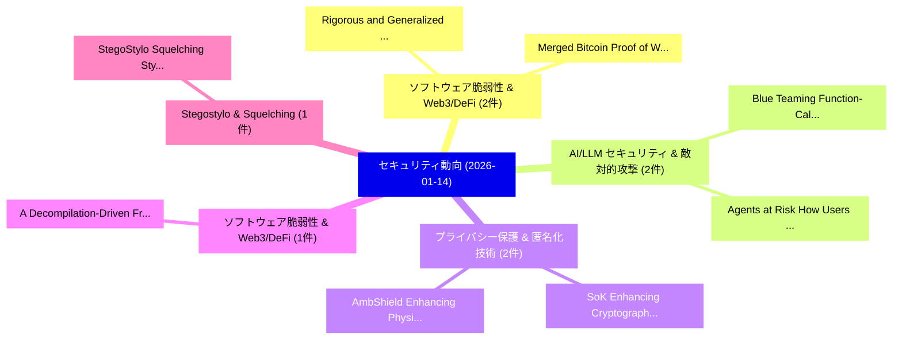

# 📅 02_daily: 日次エグゼクティブサマリー報告書 (2026-01-14)

**集計日時**: 2026-10-02 23:05:54 UTC  
**対象日付**: 2026-01-14  
**本日収集論文数**: 27 件  

---

## 💡 主要セキュリティ動向・脅威インサイト (Executive Insights)

本日の収集論文（計 27 件）において、以下の重点セキュリティ領域で活発な研究動向が確認されました：
- **ソフトウェア脆弱性 & Web3/DeFi** (2 件): 注目論文として 「Rigorous and Generalized Proof...」、「Merged Bitcoin: Proof of Work ...」 等が発表され、実務防御および攻撃検証の進展が見られます。
- **AI/LLM セキュリティ & 敵対的攻撃** (2 件): 注目論文として 「Blue Teaming Function-Calling ...」、「Agents at Risk: How Users Unwi...」 等が発表され、実務防御および攻撃検証の進展が見られます。
- **プライバシー保護 & 匿名化技術** (2 件): 注目論文として 「SoK: Enhancing Cryptographic C...」、「AmbShield: Enhancing Physical ...」 等が発表され、実務防御および攻撃検証の進展が見られます。
- **ソフトウェア脆弱性 & Web3/DeFi** (1 件): 注目論文として 「A Decompilation-Driven Framewo...」 等が発表され、実務防御および攻撃検証の進展が見られます。
- **Stegostylo & Squelching** (1 件): 注目論文として 「StegoStylo: Squelching Stylome...」 等が発表され、実務防御および攻撃検証の進展が見られます。

### 🗺️ 技術・脅威トピックマインドマップ

---

## 📌 日次セキュリティ論文一覧 (日本語表形式)

| No | arXiv ID | 論文タイトル (日本語訳) | 重要キーワード | 構造化エグゼクティブ要約 (背景・提案・影響) | 脅威分類 | 詳細リンク |
|---|---|---|---|---|---|---|
| 1 | `2601.09035v1` | [A Decompilation-Driven Framework for マルウェア検出 with Large Language Models](../../okf/papers/2026-01-14/2601.09035.md) | `Large Language Models`, `Malware Detection`, `Aniesh Chawla` | 【提案】概要 (Overview & Key Finding) 本論文「A Decompilation-Driven Framework for マルウェア検出 with Large...。実証評価により経営層・セキュリティ管理者向け推奨アクション (E... | `cs.AI` | [arXiv](https://arxiv.org/abs/2601.09035v1) &#124; [OKF](../../okf/papers/2026-01-14/2601.09035.md) |
| 2 | `2601.09056v5` | [StegoStylo: Squelching Stylometric Scrutiny through Steganographic Stitching（セキュリティ分析論文）](../../okf/papers/2026-01-14/2601.09056.md) | `Squelching Stylometric Scrutiny`, `Steganographic Stitching`, `Robert Dilworth` | 【提案】概要 (Overview & Key Finding) 本論文「StegoStylo: Squelching Stylometric Scrutiny through Ste...。実証評価により経営層・セキュリティ管理者向け推奨アクション (E... | `executive-summary` | [arXiv](https://arxiv.org/abs/2601.09056v5) &#124; [OKF](../../okf/papers/2026-01-14/2601.09056.md) |
| 3 | `2601.09082v3` | [Rigorous and Generalized Proof of Security of Bitcoin Protocol with Bounded Network Delay（セキュリティ分析論文）](../../okf/papers/2026-01-14/2601.09082.md) | `Bounded Network Delay`, `Generalized Proof`, `Bitcoin Protocol` | 【提案】概要 (Overview & Key Finding) 本論文「Rigorous and Generalized Proof of Security of Bitcoin P...。実証評価により経営層・セキュリティ管理者向け推奨アクション (E... | `cybersecurity` | [arXiv](https://arxiv.org/abs/2601.09082v3) &#124; [OKF](../../okf/papers/2026-01-14/2601.09082.md) |
| 4 | `2601.09090v1` | [Merged Bitcoin: Proof of Work Blockchains with Multiple Hash Types（セキュリティ分析論文）](../../okf/papers/2026-01-14/2601.09090.md) | `Multiple Hash Types`, `Merged Bitcoin`, `Christopher Blake` | 【提案】概要 (Overview & Key Finding) 本論文「Merged Bitcoin: Proof of Work Blockchains with Multiple...。実証評価により経営層・セキュリティ管理者向け推奨アクション (E... | `cybersecurity` | [arXiv](https://arxiv.org/abs/2601.09090v1) &#124; [OKF](../../okf/papers/2026-01-14/2601.09090.md) |
| 5 | `2601.09129v1` | [KryptoPilot: An Open-World Knowledge-Augmented LLM Agent for Automated Cryptographic Exploitation（セキュリティ分析論文）](../../okf/papers/2026-01-14/2601.09129.md) | `Automated Cryptographic Exploitation`, `World Knowledge`, `Open-World Knowledge` | 【提案】概要 (Overview & Key Finding) 本論文「KryptoPilot: An Open-World Knowledge-Augmented LLM Agen...。実証評価により経営層・セキュリティ管理者向け推奨アクション (E... | `cybersecurity` | [arXiv](https://arxiv.org/abs/2601.09129v1) &#124; [OKF](../../okf/papers/2026-01-14/2601.09129.md) |
| 6 | `2601.09157v1` | [Deep Learning-based Binary Analysis for 脆弱性検出 in x86-64 Machine Code](../../okf/papers/2026-01-14/2601.09157.md) | `Deep Learning`, `Machine Code`, `Learning-based Binary` | 【提案】概要 (Overview & Key Finding) 本論文「Deep Learning-based Binary Analysis for 脆弱性検出 in x86-64...。実証評価により経営層・セキュリティ管理者向け推奨アクション (E... | `executive-summary` | [arXiv](https://arxiv.org/abs/2601.09157v1) &#124; [OKF](../../okf/papers/2026-01-14/2601.09157.md) |
| 7 | `2601.09166v3` | [DP-FedSOFIM: Differentially Private Federated Stochastic Optimization using Regularized Fisher Information Matrix（セキュリティ分析論文）](../../okf/papers/2026-01-14/2601.09166.md) | `Differentially Private Federated Stochastic Optimization`, `Regularized Fisher Information Matrix`, `Sidhant Nair` | 【提案】概要 (Overview & Key Finding) 本論文「DP-FedSOFIM: Differentially Private Federated Stochasti...。実証評価により経営層・セキュリティ管理者向け推奨アクション (E... | `executive-summary` | [arXiv](https://arxiv.org/abs/2601.09166v3) &#124; [OKF](../../okf/papers/2026-01-14/2601.09166.md) |
| 8 | `2601.09232v1` | [Private Links, Public Leaks: Consequences of Frictionless User Experience on the Security and Privacy Posture of SMS-Delivered URLs（セキュリティ分析論文）](../../okf/papers/2026-01-14/2601.09232.md) | `Frictionless User Experience`, `Private Links`, `Public Leaks` | 【提案】概要 (Overview & Key Finding) 本論文「Private Links, Public Leaks: Consequences of Frictionle...。実証評価により経営層・セキュリティ管理者向け推奨アクション (E... | `cybersecurity` | [arXiv](https://arxiv.org/abs/2601.09232v1) &#124; [OKF](../../okf/papers/2026-01-14/2601.09232.md) |
| 9 | `2601.09273v1` | [The Real Menace of Cloning Attacks on SGX Applications（セキュリティ分析論文）](../../okf/papers/2026-01-14/2601.09273.md) | `Cloning Attacks`, `Annika Wilde`, `Samira Briongos` | 【提案】概要 (Overview & Key Finding) 本論文「The Real Menace of Cloning Attacks on SGX Applications（...。実証評価により経営層・セキュリティ管理者向け推奨アクション (E... | `cybersecurity` | [arXiv](https://arxiv.org/abs/2601.09273v1) &#124; [OKF](../../okf/papers/2026-01-14/2601.09273.md) |
| 10 | `2601.09287v1` | [Explainable Autoencoder-Based Anomaly Detection in IEC 61850 GOOSE Networks（セキュリティ分析論文）](../../okf/papers/2026-01-14/2601.09287.md) | `Based Anomaly Detection`, `Explainable Autoencoder`, `Autoencoder-Based Anomaly` | 【提案】概要 (Overview & Key Finding) 本論文「Explainable Autoencoder-Based Anomaly Detection in IEC ...。実証評価により経営層・セキュリティ管理者向け推奨アクション (E... | `executive-summary` | [arXiv](https://arxiv.org/abs/2601.09287v1) &#124; [OKF](../../okf/papers/2026-01-14/2601.09287.md) |
| 11 | `2601.09292v1` | [Blue Teaming Function-Calling Agents（セキュリティ分析論文）](../../okf/papers/2026-01-14/2601.09292.md) | `Blue Teaming Function`, `Calling Agents`, `Function-Calling Agents` | 【提案】概要 (Overview & Key Finding) 本論文「Blue Teaming Function-Calling Agents（セキュリティ分析論文）」（原題: B...。実証評価により経営層・セキュリティ管理者向け推奨アクション (E... | `cs.AI` | [arXiv](https://arxiv.org/abs/2601.09292v1) &#124; [OKF](../../okf/papers/2026-01-14/2601.09292.md) |
| 12 | `2601.09321v2` | [SpatialJB: How Text Distribution Art Becomes the "Jailbreak Key" for LLM Guardrails（セキュリティ分析論文）](../../okf/papers/2026-01-14/2601.09321.md) | `Jailbreak Key`, `Zhiyi Mou`, `Jingyuan Yang` | 【提案】概要 (Overview & Key Finding) 本論文「SpatialJB: How Text Distribution Art Becomes the "ジェイルブ...。実証評価により経営層・セキュリティ管理者向け推奨アクション (E... | `cybersecurity` | [arXiv](https://arxiv.org/abs/2601.09321v2) &#124; [OKF](../../okf/papers/2026-01-14/2601.09321.md) |
| 13 | `2601.09327v1` | [CallShield: Secure Caller Authentication over Real-Time Audio Channels（セキュリティ分析論文）](../../okf/papers/2026-01-14/2601.09327.md) | `Secure Caller Authentication`, `Time Audio Channels`, `Real-Time Audio` | 【提案】概要 (Overview & Key Finding) 本論文「CallShield: Secure Caller Authentication over Real-Time...。実証評価により経営層・セキュリティ管理者向け推奨アクション (E... | `cybersecurity` | [arXiv](https://arxiv.org/abs/2601.09327v1) &#124; [OKF](../../okf/papers/2026-01-14/2601.09327.md) |
| 14 | `2601.09372v1` | [Formally Verifying Noir Zero Knowledge Programs with NAVe（セキュリティ分析論文）](../../okf/papers/2026-01-14/2601.09372.md) | `Formally Verifying Noir Zero Knowledge Programs`, `Pedro Antonino`, `Namrata Jain` | 【提案】概要 (Overview & Key Finding) 本論文「Formally Verifying Noir Zero Knowledge Programs with NA...。実証評価により経営層・セキュリティ管理者向け推奨アクション (E... | `executive-summary` | [arXiv](https://arxiv.org/abs/2601.09372v1) &#124; [OKF](../../okf/papers/2026-01-14/2601.09372.md) |
| 15 | `2601.09407v1` | [A Systematic Security Analysis for Path-based Traceability Systems in RFID-Enabled Supply Chains（セキュリティ分析論文）](../../okf/papers/2026-01-14/2601.09407.md) | `Enabled Supply Chains`, `Traceability Systems`, `Path-based Traceability` | 【提案】概要 (Overview & Key Finding) 本論文「A Systematic Security Analysis for Path-based Traceabil...。実証評価により経営層・セキュリティ管理者向け推奨アクション (E... | `cybersecurity` | [arXiv](https://arxiv.org/abs/2601.09407v1) &#124; [OKF](../../okf/papers/2026-01-14/2601.09407.md) |
| 16 | `2601.09460v1` | [SoK: Enhancing Cryptographic Collaborative Learning with Differential Privacy（セキュリティ分析論文）](../../okf/papers/2026-01-14/2601.09460.md) | `Enhancing Cryptographic Collaborative Learning`, `Differential Privacy`, `Francesco Capano` | 【提案】概要 (Overview & Key Finding) 本論文「SoK: Enhancing Cryptographic Collaborative Learning wit...。実証評価により経営層・セキュリティ管理者向け推奨アクション (E... | `cs.AI` | [arXiv](https://arxiv.org/abs/2601.09460v1) &#124; [OKF](../../okf/papers/2026-01-14/2601.09460.md) |
| 17 | `2601.09498v2` | [Dobrushin Coefficients of Private Mechanisms Beyond Local Differential Privacy（セキュリティ分析論文）](../../okf/papers/2026-01-14/2601.09498.md) | `Private Mechanisms Beyond Local Differential Privacy`, `Dobrushin Coefficients`, `Leonhard Grosse` | 【提案】概要 (Overview & Key Finding) 本論文「Dobrushin Coefficients of Private Mechanisms Beyond Loc...。実証評価により経営層・セキュリティ管理者向け推奨アクション (E... | `executive-summary` | [arXiv](https://arxiv.org/abs/2601.09498v2) &#124; [OKF](../../okf/papers/2026-01-14/2601.09498.md) |
| 18 | `2601.09557v2` | [SiliconHealth: A Complete Low-Cost Blockchain Healthcare Infrastructure for Resource-Constrained Regions Using Repurposed Bitcoin Mining ASICs（セキュリティ分析論文）](../../okf/papers/2026-01-14/2601.09557.md) | `Constrained Regions Using Repurposed Bitcoin Mining`, `Cost Blockchain Healthcare Infrastructure`, `Complete Low` | 【提案】概要 (Overview & Key Finding) 本論文「SiliconHealth: A Complete Low-Cost Blockchain Healthcar...。実証評価により経営層・セキュリティ管理者向け推奨アクション (E... | `executive-summary` | [arXiv](https://arxiv.org/abs/2601.09557v2) &#124; [OKF](../../okf/papers/2026-01-14/2601.09557.md) |
| 19 | `2601.09625v2` | [The Promptware Kill Chain: How Prompt Injections Gradually Evolved Into a Multistep Malware Delivery Mechanism（セキュリティ分析論文）](../../okf/papers/2026-01-14/2601.09625.md) | `Multistep Malware Delivery Mechanism`, `Oleg Brodt`, `Elad Feldman` | 【提案】概要 (Overview & Key Finding) 本論文「The Promptware Kill Chain: How プロンプトインジェクションs Gradually...。実証評価により経営層・セキュリティ管理者向け推奨アクション (E... | `cs.AI` | [arXiv](https://arxiv.org/abs/2601.09625v2) &#124; [OKF](../../okf/papers/2026-01-14/2601.09625.md) |
| 20 | `2601.09647v1` | [Identifying Models Behind Text-to-Image Leaderboards（セキュリティ分析論文）](../../okf/papers/2026-01-14/2601.09647.md) | `Identifying Models Behind Text`, `Image Leaderboards`, `Ali Naseh` | 【提案】概要 (Overview & Key Finding) 本論文「Identifying Models Behind Text-to-Image Leaderboards（セキ...。実証評価により経営層・セキュリティ管理者向け推奨アクション (E... | `cs.CV` | [arXiv](https://arxiv.org/abs/2601.09647v1) &#124; [OKF](../../okf/papers/2026-01-14/2601.09647.md) |
| 21 | `2601.09836v1` | [A Risk-Stratified Benchmark Dataset for Bad Randomness (SWC-120) Vulnerabilities in Ethereum Smart Contracts（セキュリティ分析論文）](../../okf/papers/2026-01-14/2601.09836.md) | `Stratified Benchmark Dataset`, `Ethereum Smart Contracts`, `Bad Randomness` | 【提案】概要 (Overview & Key Finding) 本論文「A Risk-Stratified Benchmark Dataset for Bad Randomness ...。実証評価により経営層・セキュリティ管理者向け推奨アクション (E... | `cybersecurity` | [arXiv](https://arxiv.org/abs/2601.09836v1) &#124; [OKF](../../okf/papers/2026-01-14/2601.09836.md) |
| 22 | `2601.09867v1` | [AmbShield: Enhancing Physical Layer Security with Ambient Backscatter Devices against Eavesdroppers（セキュリティ分析論文）](../../okf/papers/2026-01-14/2601.09867.md) | `Enhancing Physical Layer Security`, `Ambient Backscatter Devices`, `Yifan Zhang` | 【提案】概要 (Overview & Key Finding) 本論文「AmbShield: Enhancing Physical Layer Security with Ambie...。実証評価により経営層・セキュリティ管理者向け推奨アクション (E... | `executive-summary` | [arXiv](https://arxiv.org/abs/2601.09867v1) &#124; [OKF](../../okf/papers/2026-01-14/2601.09867.md) |
| 23 | `2601.09902v1` | [A Novel Contrastive Loss for Zero-Day Network Intrusion Detection（セキュリティ分析論文）](../../okf/papers/2026-01-14/2601.09902.md) | `Day Network Intrusion Detection`, `Zero-Day Network`, `Jack Wilkie` | 【提案】概要 (Overview & Key Finding) 本論文「A Novel Contrastive Loss for Zero-Day Network Intrusion...。実証評価により経営層・セキュリティ管理者向け推奨アクション (E... | `cs.NI` | [arXiv](https://arxiv.org/abs/2601.09902v1) &#124; [OKF](../../okf/papers/2026-01-14/2601.09902.md) |
| 24 | `2601.09904v1` | [Distortion maps for elliptic curves over finite fields（セキュリティ分析論文）](../../okf/papers/2026-01-14/2601.09904.md) | `Nikita Andrusov`, `Dimitrios Noulas`, `Fabien Pazuki` | 【提案】概要 (Overview & Key Finding) 本論文「Distortion maps for elliptic curves over finite fields（...。実証評価により経営層・セキュリティ管理者向け推奨アクション (E... | `executive-summary` | [arXiv](https://arxiv.org/abs/2601.09904v1) &#124; [OKF](../../okf/papers/2026-01-14/2601.09904.md) |
| 25 | `2601.09933v1` | [Malware Classification using Diluted Convolutional Neural Network with Fast Gradient Sign Method（セキュリティ分析論文）](../../okf/papers/2026-01-14/2601.09933.md) | `Diluted Convolutional Neural Network`, `Malware Classification`, `Vishi Singh Bhatia` | 【提案】概要 (Overview & Key Finding) 本論文「マルウェア Classification using Diluted Convolutional Neural...。実証評価により経営層・セキュリティ管理者向け推奨アクション (E... | `cs.CE` | [arXiv](https://arxiv.org/abs/2601.09933v1) &#124; [OKF](../../okf/papers/2026-01-14/2601.09933.md) |
| 26 | `2601.10758v3` | [Agents at Risk: How Users Unwittingly Undermine LLM Safety（セキュリティ分析論文）](../../okf/papers/2026-01-14/2601.10758.md) | `Fengchao Chen`, `Tingmin Wu`, `Van Nguyen` | 【提案】概要 (Overview & Key Finding) 本論文「Agents at Risk: How Users Unwittingly Undermine LLM Saf...。実証評価によりNepal, Carsten Rudolph - ... | `cybersecurity` | [arXiv](https://arxiv.org/abs/2601.10758v3) &#124; [OKF](../../okf/papers/2026-01-14/2601.10758.md) |
| 27 | `2601.11629v2` | [Semantic Differentiation for Tackling Challenges in Watermarking Low-Entropy Constrained Generation Outputs（セキュリティ分析論文）](../../okf/papers/2026-01-14/2601.11629.md) | `Entropy Constrained Generation Outputs`, `Semantic Differentiation`, `Tackling Challenges` | 【提案】概要 (Overview & Key Finding) 本論文「Semantic Differentiation for Tackling Challenges in Wat...。実証評価により経営層・セキュリティ管理者向け推奨アクション (E... | `Privacy & Provenance` | [arXiv](https://arxiv.org/abs/2601.11629v2) &#124; [OKF](../../okf/papers/2026-01-14/2601.11629.md) |

