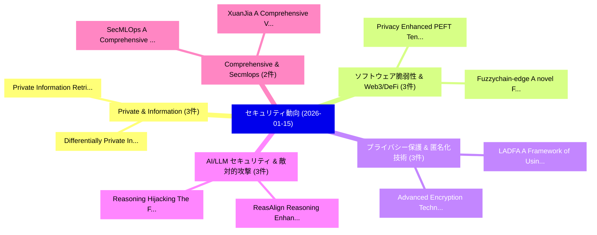

# 📅 02_daily: 日次エグゼクティブサマリー報告書 (2026-01-15)

**集計日時**: 2026-10-02 23:05:54 UTC  
**対象日付**: 2026-01-15  
**本日収集論文数**: 22 件  

---

## 💡 主要セキュリティ動向・脅威インサイト (Executive Insights)

本日の収集論文（計 22 件）において、以下の重点セキュリティ領域で活発な研究動向が確認されました：
- **Private & Information** (3 件): 注目論文として 「Private Information Retrieval ...」、「Differentially Private Inferen...」 等が発表され、実務防御および攻撃検証の進展が見られます。
- **ソフトウェア脆弱性 & Web3/DeFi** (3 件): 注目論文として 「Privacy Enhanced PEFT: Tensor ...」、「Fuzzychain-edge: A novel Fuzzy...」 等が発表され、実務防御および攻撃検証の進展が見られます。
- **プライバシー保護 & 匿名化技術** (3 件): 注目論文として 「Advanced Encryption Technique ...」、「LADFA: A Framework of Using 大規...」 等が発表され、実務防御および攻撃検証の進展が見られます。
- **AI/LLM セキュリティ & 敵対的攻撃** (3 件): 注目論文として 「ReasAlign: Reasoning Enhanced ...」、「Reasoning Hijacking: The Fragi...」 等が発表され、実務防御および攻撃検証の進展が見られます。
- **Comprehensive & Secmlops** (2 件): 注目論文として 「XuanJia: A Comprehensive Virtu...」、「SecMLOps: A Comprehensive Fram...」 等が発表され、実務防御および攻撃検証の進展が見られます。

### 🗺️ 技術・脅威トピックマインドマップ

---

## 📌 日次セキュリティ論文一覧 (日本語表形式)

| No | arXiv ID | 論文タイトル (日本語訳) | 重要キーワード | 構造化エグゼクティブ要約 (背景・提案・影響) | 脅威分類 | 詳細リンク |
|---|---|---|---|---|---|---|
| 1 | `2601.09946v1` | [Interpolation-Based Optimization for Enforcing lp-Norm Metric Differential Privacy in Continuous and Fine-Grained Domains（セキュリティ分析論文）](../../okf/papers/2026-01-15/2601.09946.md) | `Norm Metric Differential Privacy`, `Based Optimization`, `Interpolation-Based Optimization` | 【提案】概要 (Overview & Key Finding) 本論文「Interpolation-Based Optimization for Enforcing lp-Norm ...。実証評価により経営層・セキュリティ管理者向け推奨アクション (E... | `executive-summary` | [arXiv](https://arxiv.org/abs/2601.09946v1) &#124; [OKF](../../okf/papers/2026-01-15/2601.09946.md) |
| 2 | `2601.09957v1` | [Private Information Retrieval for Graph-based Replication with Minimal Subpacketization（セキュリティ分析論文）](../../okf/papers/2026-01-15/2601.09957.md) | `Private Information Retrieval`, `Minimal Subpacketization`, `Graph-based Replication` | 【提案】概要 (Overview & Key Finding) 本論文「Private Information Retrieval for Graph-based Replicati...。実証評価により経営層・セキュリティ管理者向け推奨アクション (E... | `executive-summary` | [arXiv](https://arxiv.org/abs/2601.09957v1) &#124; [OKF](../../okf/papers/2026-01-15/2601.09957.md) |
| 3 | `2601.10004v1` | [SoK: Privacy-aware LLM in Healthcare: Threat Model, Privacy Techniques, Challenges and Recommendations（セキュリティ分析論文）](../../okf/papers/2026-01-15/2601.10004.md) | `Threat Model`, `Privacy-aware LLM`, `Privacy Techniques` | 【提案】概要 (Overview & Key Finding) 本論文「SoK: Privacy-aware LLM in Healthcare: 脅威 Model, Privacy...。実証評価により経営層・セキュリティ管理者向け推奨アクション (E... | `executive-summary` | [arXiv](https://arxiv.org/abs/2601.10004v1) &#124; [OKF](../../okf/papers/2026-01-15/2601.10004.md) |
| 4 | `2601.10045v1` | [Privacy Enhanced PEFT: Tensor Train Decomposition Improves Privacy Utility Tradeoffs under DP-SGD（セキュリティ分析論文）](../../okf/papers/2026-01-15/2601.10045.md) | `Tensor Train Decomposition Improves Privacy Utility Tradeoffs`, `Privacy Enhanced`, `Pradip Kunwar` | 【提案】概要 (Overview & Key Finding) 本論文「Privacy Enhanced PEFT: Tensor Train Decomposition Impro...。実証評価により経営層・セキュリティ管理者向け推奨アクション (E... | `cybersecurity` | [arXiv](https://arxiv.org/abs/2601.10045v1) &#124; [OKF](../../okf/papers/2026-01-15/2601.10045.md) |
| 5 | `2601.10105v1` | [Fuzzychain-edge: A novel Fuzzy logic-based adaptive Access control model for Blockchain in Edge Computing（セキュリティ分析論文）](../../okf/papers/2026-01-15/2601.10105.md) | `Edge Computing`, `logic-based adaptive`, `Khushbakht Farooq` | 【提案】概要 (Overview & Key Finding) 本論文「Fuzzychain-edge: A novel Fuzzy logic-based adaptive アクセ...。実証評価により経営層・セキュリティ管理者向け推奨アクション (E... | `executive-summary` | [arXiv](https://arxiv.org/abs/2601.10105v1) &#124; [OKF](../../okf/papers/2026-01-15/2601.10105.md) |
| 6 | `2601.10119v1` | [Advanced Encryption Technique for Multimedia Data Using Sudoku-Based Algorithms for Enhanced Security（セキュリティ分析論文）](../../okf/papers/2026-01-15/2601.10119.md) | `Multimedia Data Using Sudoku`, `Advanced Encryption Technique`, `Based Algorithms` | 【提案】概要 (Overview & Key Finding) 本論文「Advanced Encryption Technique for Multimedia Data Using...。実証評価により経営層・セキュリティ管理者向け推奨アクション (E... | `cybersecurity` | [arXiv](https://arxiv.org/abs/2601.10119v1) &#124; [OKF](../../okf/papers/2026-01-15/2601.10119.md) |
| 7 | `2601.10173v1` | [ReasAlign: Reasoning Enhanced Safety Alignment against Prompt Injection Attack（セキュリティ分析論文）](../../okf/papers/2026-01-15/2601.10173.md) | `Reasoning Enhanced Safety Alignment`, `Prompt Injection Attack`, `Hao Li` | 【提案】概要 (Overview & Key Finding) 本論文「ReasAlign: Reasoning Enhanced Safety Alignment against ...。実証評価により経営層・セキュリティ管理者向け推奨アクション (E... | `cs.AI` | [arXiv](https://arxiv.org/abs/2601.10173v1) &#124; [OKF](../../okf/papers/2026-01-15/2601.10173.md) |
| 8 | `2601.10212v1` | [PADER: Paillier-based Secure Decentralized Social Recommendation（セキュリティ分析論文）](../../okf/papers/2026-01-15/2601.10212.md) | `Secure Decentralized Social Recommendation`, `Paillier-based Secure`, `Chaochao Chen` | 【提案】概要 (Overview & Key Finding) 本論文「PADER: Paillier-based Secure Decentralized Social Recom...。実証評価により経営層・セキュリティ管理者向け推奨アクション (E... | `cs.AI` | [arXiv](https://arxiv.org/abs/2601.10212v1) &#124; [OKF](../../okf/papers/2026-01-15/2601.10212.md) |
| 9 | `2601.10237v3` | [Fundamental Limitations of Favorable Privacy-Utility Guarantees for DP-SGD（セキュリティ分析論文）](../../okf/papers/2026-01-15/2601.10237.md) | `Fundamental Limitations`, `Favorable Privacy`, `Utility Guarantees` | 【提案】概要 (Overview & Key Finding) 本論文「Fundamental Limitations of Favorable Privacy-Utility Gu...。実証評価により経営層・セキュリティ管理者向け推奨アクション (E... | `executive-summary` | [arXiv](https://arxiv.org/abs/2601.10237v3) &#124; [OKF](../../okf/papers/2026-01-15/2601.10237.md) |
| 10 | `2601.10261v1` | [XuanJia: A Comprehensive Virtualization-Based Code Obfuscator for Binary Protection（セキュリティ分析論文）](../../okf/papers/2026-01-15/2601.10261.md) | `Based Code Obfuscator`, `Comprehensive Virtualization`, `Virtualization-Based Code` | 【提案】概要 (Overview & Key Finding) 本論文「XuanJia: A Comprehensive Virtualization-Based Code Obfu...。実証評価により経営層・セキュリティ管理者向け推奨アクション (E... | `cybersecurity` | [arXiv](https://arxiv.org/abs/2601.10261v1) &#124; [OKF](../../okf/papers/2026-01-15/2601.10261.md) |
| 11 | `2601.10294v6` | [Reasoning Hijacking: The Fragility of Reasoning Alignment in 大規模言語モデル](../../okf/papers/2026-01-15/2601.10294.md) | `Reasoning Hijacking`, `Reasoning Alignment`, `Large Language Models` | 【提案】概要 (Overview & Key Finding) 本論文「Reasoning Hijacking: The Fragility of Reasoning Alignme...。実証評価により経営層・セキュリティ管理者向け推奨アクション (E... | `cybersecurity` | [arXiv](https://arxiv.org/abs/2601.10294v6) &#124; [OKF](../../okf/papers/2026-01-15/2601.10294.md) |
| 12 | `2601.10338v1` | [Agent Skills in the Wild: Security Vulnerabilities at Scaleの実証研究](../../okf/papers/2026-01-15/2601.10338.md) | `Agent Skills`, `Security Vulnerabilities`, `Yi Liu` | 【提案】概要 (Overview & Key Finding) 本論文「Agent Skills in the Wild: Security Vulnerabilities at S...。実証評価により経営層・セキュリティ管理者向け推奨アクション (E... | `cs.AI` | [arXiv](https://arxiv.org/abs/2601.10338v1) &#124; [OKF](../../okf/papers/2026-01-15/2601.10338.md) |
| 13 | `2601.10413v1` | [LADFA: A Framework of Using 大規模言語モデル and Retrieval-Augmented Generation for Personal Data Flow Analysis in Privacy Policies](../../okf/papers/2026-01-15/2601.10413.md) | `Augmented Generation`, `Privacy Policies`, `Retrieval-Augmented Generation` | 【提案】概要 (Overview & Key Finding) 本論文「LADFA: A Framework of Using 大規模言語モデル and Retrieval-Augm...。実証評価により経営層・セキュリティ管理者向け推奨アクション (E... | `cs.AI` | [arXiv](https://arxiv.org/abs/2601.10413v1) &#124; [OKF](../../okf/papers/2026-01-15/2601.10413.md) |
| 14 | `2601.10440v1` | [AgentGuardian: Learning Access Control Policies to Govern AI Agent Behavior（セキュリティ分析論文）](../../okf/papers/2026-01-15/2601.10440.md) | `Learning Access Control Policies`, `Agent Behavior`, `Nadya Abaev` | 【提案】概要 (Overview & Key Finding) 本論文「AgentGuardian: Learning アクセス制御 Policies to Govern AI Ag...。実証評価により経営層・セキュリティ管理者向け推奨アクション (E... | `cs.AI` | [arXiv](https://arxiv.org/abs/2601.10440v1) &#124; [OKF](../../okf/papers/2026-01-15/2601.10440.md) |
| 15 | `2601.10542v3` | [Hybrid Encryption with Certified Deletion in Preprocessing Model（セキュリティ分析論文）](../../okf/papers/2026-01-15/2601.10542.md) | `Hybrid Encryption`, `Certified Deletion`, `Preprocessing Model` | 【提案】概要 (Overview & Key Finding) 本論文「Hybrid Encryption with Certified Deletion in Preprocess...。実証評価により経営層・セキュリティ管理者向け推奨アクション (E... | `executive-summary` | [arXiv](https://arxiv.org/abs/2601.10542v3) &#124; [OKF](../../okf/papers/2026-01-15/2601.10542.md) |
| 16 | `2601.10589v1` | [Be Your Own Red Teamer: Safety Alignment via Self-Play and Reflective Experience Replay（セキュリティ分析論文）](../../okf/papers/2026-01-15/2601.10589.md) | `Reflective Experience Replay`, `Safety Alignment`, `Hao Wang` | 【提案】概要 (Overview & Key Finding) 本論文「Be Your Own Red Teamer: Safety Alignment via Self-Play ...。実証評価により経営層・セキュリティ管理者向け推奨アクション (E... | `executive-summary` | [arXiv](https://arxiv.org/abs/2601.10589v1) &#124; [OKF](../../okf/papers/2026-01-15/2601.10589.md) |
| 17 | `2601.10626v1` | [Differentially Private Inference for Longitudinal Linear Regression（セキュリティ分析論文）](../../okf/papers/2026-01-15/2601.10626.md) | `Differentially Private Inference`, `Longitudinal Linear Regression`, `Marco Avella Medina` | 【提案】概要 (Overview & Key Finding) 本論文「Differentially Private Inference for Longitudinal Linea...。実証評価により経営層・セキュリティ管理者向け推奨アクション (E... | `stat.ME` | [arXiv](https://arxiv.org/abs/2601.10626v1) &#124; [OKF](../../okf/papers/2026-01-15/2601.10626.md) |
| 18 | `2601.10643v2` | [Converse Bounds for Sun-Jafar-type Weak Private Information Retrieval（セキュリティ分析論文）](../../okf/papers/2026-01-15/2601.10643.md) | `Weak Private Information Retrieval`, `Converse Bounds`, `Chandan Anand` | 【提案】概要 (Overview & Key Finding) 本論文「Converse Bounds for Sun-Jafar-type Weak Private Informa...。実証評価により経営層・セキュリティ管理者向け推奨アクション (E... | `executive-summary` | [arXiv](https://arxiv.org/abs/2601.10643v2) &#124; [OKF](../../okf/papers/2026-01-15/2601.10643.md) |
| 19 | `2601.10848v1` | [SecMLOps: A Comprehensive Framework for Integrating Security Throughout the MLOps Lifecycle（セキュリティ分析論文）](../../okf/papers/2026-01-15/2601.10848.md) | `Integrating Security Throughout`, `Xinrui Zhang`, `Pincan Zhao` | 【提案】概要 (Overview & Key Finding) 本論文「SecMLOps: A Comprehensive Framework for Integrating Sec...。実証評価により経営層・セキュリティ管理者向け推奨アクション (E... | `executive-summary` | [arXiv](https://arxiv.org/abs/2601.10848v1) &#124; [OKF](../../okf/papers/2026-01-15/2601.10848.md) |
| 20 | `2601.10865v1` | [Multi-Agent Taint Specification Extraction for 脆弱性検出](../../okf/papers/2026-01-15/2601.10865.md) | `Agent Taint Specification Extraction`, `Multi-Agent Taint`, `Vulnerability Detection` | 【提案】概要 (Overview & Key Finding) 本論文「Multi-Agent Taint Specification Extraction for 脆弱性検出」（原...。実証評価により経営層・セキュリティ管理者向け推奨アクション (E... | `executive-summary` | [arXiv](https://arxiv.org/abs/2601.10865v1) &#124; [OKF](../../okf/papers/2026-01-15/2601.10865.md) |
| 21 | `2601.10866v1` | [Adaptive Privacy Budgeting（セキュリティ分析論文）](../../okf/papers/2026-01-15/2601.10866.md) | `Adaptive Privacy Budgeting`, `Yuting Liang`, `Ke Yi` | 【提案】概要 (Overview & Key Finding) 本論文「Adaptive Privacy Budgeting（セキュリティ分析論文）」（原題: Adaptive Pr...。実証評価により経営層・セキュリティ管理者向け推奨アクション (E... | `cybersecurity` | [arXiv](https://arxiv.org/abs/2601.10866v1) &#124; [OKF](../../okf/papers/2026-01-15/2601.10866.md) |
| 22 | `2601.11664v1` | [Serverless AI Security: Attack Surface Analysis and Runtime Protection Mechanisms for FaaS-Based Machine Learning（セキュリティ分析論文）](../../okf/papers/2026-01-15/2601.11664.md) | `Runtime Protection Mechanisms`, `Based Machine Learning`, `FaaS-Based Machine` | 【提案】概要 (Overview & Key Finding) 本論文「Serverless AI Security: Attack Surface Analysis and Run...。実証評価により経営層・セキュリティ管理者向け推奨アクション (E... | `cs.AI` | [arXiv](https://arxiv.org/abs/2601.11664v1) &#124; [OKF](../../okf/papers/2026-01-15/2601.11664.md) |

