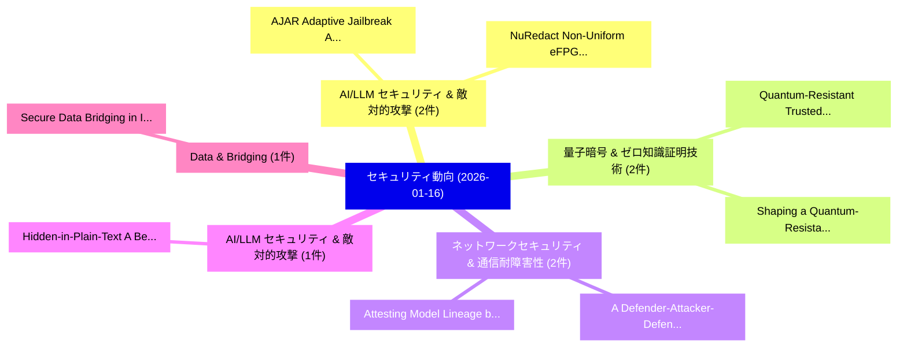

# 📅 02_daily: 日次エグゼクティブサマリー報告書 (2026-01-16)

**集計日時**: 2026-10-02 23:05:54 UTC  
**対象日付**: 2026-01-16  
**本日収集論文数**: 23 件  

---

## 💡 主要セキュリティ動向・脅威インサイト (Executive Insights)

本日の収集論文（計 23 件）において、以下の重点セキュリティ領域で活発な研究動向が確認されました：
- **AI/LLM セキュリティ & 敵対的攻撃** (2 件): 注目論文として 「AJAR: Adaptive Jailbreak Archi...」、「NuRedact: Non-Uniform eFPGA Ar...」 等が発表され、実務防御および攻撃検証の進展が見られます。
- **量子暗号 & ゼロ知識証明技術** (2 件): 注目論文として 「Quantum-Resistant Trusted Comp...」、「Shaping a Quantum-Resistant Fu...」 等が発表され、実務防御および攻撃検証の進展が見られます。
- **ネットワークセキュリティ & 通信耐障害性** (2 件): 注目論文として 「A Defender-Attacker-Defender M...」、「Attesting Model Lineage by Con...」 等が発表され、実務防御および攻撃検証の進展が見られます。
- **AI/LLM セキュリティ & 敵対的攻撃** (1 件): 注目論文として 「Hidden-in-Plain-Text: A Benchm...」 等が発表され、実務防御および攻撃検証の進展が見られます。
- **Data & Bridging** (1 件): 注目論文として 「Secure Data Bridging in Indust...」 等が発表され、実務防御および攻撃検証の進展が見られます。

### 🗺️ 技術・脅威トピックマインドマップ

---

## 📌 日次セキュリティ論文一覧 (日本語表形式)

| No | arXiv ID | 論文タイトル (日本語訳) | 重要キーワード | 構造化エグゼクティブ要約 (背景・提案・影響) | 脅威分類 | 詳細リンク |
|---|---|---|---|---|---|---|
| 1 | `2601.10923v2` | [Hidden-in-Plain-Text: A Benchmark for Social-Web Indirect Prompt Injection in RAG（セキュリティ分析論文）](../../okf/papers/2026-01-16/2601.10923.md) | `Web Indirect Prompt Injection`, `Social-Web Indirect`, `Haoze Guo` | 【提案】概要 (Overview & Key Finding) 本論文「Hidden-in-Plain-Text: A Benchmark for Social-Web Indire...。実証評価により経営層・セキュリティ管理者向け推奨アクション (E... | `executive-summary` | [arXiv](https://arxiv.org/abs/2601.10923v2) &#124; [OKF](../../okf/papers/2026-01-16/2601.10923.md) |
| 2 | `2601.10929v1` | [Secure Data Bridging in Industry 4.0: An OPC UA Aggregation Approach for Including Insecure Legacy Systems（セキュリティ分析論文）](../../okf/papers/2026-01-16/2601.10929.md) | `Secure Data Bridging`, `Including Insecure Legacy Systems`, `Dalibor Sain` | 【提案】概要 (Overview & Key Finding) 本論文「Secure Data Bridging in Industry 4.0: An OPC UA Aggrega...。実証評価により経営層・セキュリティ管理者向け推奨アクション (E... | `executive-summary` | [arXiv](https://arxiv.org/abs/2601.10929v1) &#124; [OKF](../../okf/papers/2026-01-16/2601.10929.md) |
| 3 | `2601.10955v2` | [Beyond Max Tokens: Stealthy Resource Amplification via Tool Calling Chains in LLMエージェント](../../okf/papers/2026-01-16/2601.10955.md) | `Beyond Max Tokens`, `Stealthy Resource Amplification`, `Tool Calling Chains` | 【提案】概要 (Overview & Key Finding) 本論文「Beyond Max Tokens: Stealthy Resource Amplification via ...。実証評価により経営層・セキュリティ管理者向け推奨アクション (E... | `cs.AI` | [arXiv](https://arxiv.org/abs/2601.10955v2) &#124; [OKF](../../okf/papers/2026-01-16/2601.10955.md) |
| 4 | `2601.10971v2` | [AJAR: Adaptive Jailbreak Architecture for Red-teaming（セキュリティ分析論文）](../../okf/papers/2026-01-16/2601.10971.md) | `Adaptive Jailbreak Architecture`, `Yipu Dou`, `Wang Yang` | 【提案】概要 (Overview & Key Finding) 本論文「AJAR: Adaptive ジェイルブレイク Architecture for Red-teaming（セキ...。実証評価により経営層・セキュリティ管理者向け推奨アクション (E... | `executive-summary` | [arXiv](https://arxiv.org/abs/2601.10971v2) &#124; [OKF](../../okf/papers/2026-01-16/2601.10971.md) |
| 5 | `2601.11095v1` | [Quantum-Resistant Trusted Computing: Architectures for Post-Quantum Integrity Verification Techniquesに向けて](../../okf/papers/2026-01-16/2601.11095.md) | `Resistant Trusted Computing`, `Quantum-Resistant Trusted`, `Post-Quantum Integrity` | 【提案】概要 (Overview & Key Finding) 本論文「量子-Resistant Trusted Computing: Architectures for Post-...。実証評価により経営層・セキュリティ管理者向け推奨アクション (E... | `cybersecurity` | [arXiv](https://arxiv.org/abs/2601.11095v1) &#124; [OKF](../../okf/papers/2026-01-16/2601.11095.md) |
| 6 | `2601.11104v1` | [Shaping a Quantum-Resistant Future: Strategies for Post-Quantum PKI（セキュリティ分析論文）](../../okf/papers/2026-01-16/2601.11104.md) | `Resistant Future`, `Quantum-Resistant Future`, `Post-Quantum PKI` | 【提案】概要 (Overview & Key Finding) 本論文「Shaping a 量子-Resistant Future: Strategies for Post-量子 P...。実証評価により経営層・セキュリティ管理者向け推奨アクション (E... | `cybersecurity` | [arXiv](https://arxiv.org/abs/2601.11104v1) &#124; [OKF](../../okf/papers/2026-01-16/2601.11104.md) |
| 7 | `2601.11113v1` | [Differentially Private Subspace Fine-Tuning for 大規模言語モデル](../../okf/papers/2026-01-16/2601.11113.md) | `Differentially Private Subspace Fine`, `Large Language Models`, `Lele Zheng` | 【提案】概要 (Overview & Key Finding) 本論文「Differentially Private Subspace Fine-Tuning for 大規模言語モデ...。実証評価により経営層・セキュリティ管理者向け推奨アクション (E... | `executive-summary` | [arXiv](https://arxiv.org/abs/2601.11113v1) &#124; [OKF](../../okf/papers/2026-01-16/2601.11113.md) |
| 8 | `2601.11129v1` | [A Defender-Attacker-Defender Model for Optimizing the Resilience of Hospital Networks to Cyberattacks（セキュリティ分析論文）](../../okf/papers/2026-01-16/2601.11129.md) | `Defender Model`, `Hospital Networks`, `Stephan Helfrich` | 【提案】概要 (Overview & Key Finding) 本論文「A Defender-Attacker-Defender Model for Optimizing the R...。実証評価により経営層・セキュリティ管理者向け推奨アクション (E... | `executive-summary` | [arXiv](https://arxiv.org/abs/2601.11129v1) &#124; [OKF](../../okf/papers/2026-01-16/2601.11129.md) |
| 9 | `2601.11173v3` | [Proving Circuit Functional Equivalence in Zero Knowledge（セキュリティ分析論文）](../../okf/papers/2026-01-16/2601.11173.md) | `Proving Circuit Functional Equivalence`, `Zero Knowledge`, `Sirui Shen` | 【提案】概要 (Overview & Key Finding) 本論文「Proving Circuit Functional Equivalence in Zero Knowledg...。実証評価により経営層・セキュリティ管理者向け推奨アクション (E... | `cs.LO` | [arXiv](https://arxiv.org/abs/2601.11173v3) &#124; [OKF](../../okf/papers/2026-01-16/2601.11173.md) |
| 10 | `2601.11199v1` | [SD-RAG: A Prompt-Injection-Resilient Framework for Selective Disclosure in Retrieval-Augmented Generation（セキュリティ分析論文）](../../okf/papers/2026-01-16/2601.11199.md) | `Selective Disclosure`, `Augmented Generation`, `Retrieval-Augmented Generation` | 【提案】概要 (Overview & Key Finding) 本論文「SD-RAG: A Prompt-Injection-Resilient Framework for Sele...。実証評価により経営層・セキュリティ管理者向け推奨アクション (E... | `cs.AI` | [arXiv](https://arxiv.org/abs/2601.11199v1) &#124; [OKF](../../okf/papers/2026-01-16/2601.11199.md) |
| 11 | `2601.11207v1` | [LoRA as Oracle（セキュリティ分析論文）](../../okf/papers/2026-01-16/2601.11207.md) | `Marco Arazzi`, `Antonino Nocera`, `Raw Meta` | 【提案】概要 (Overview & Key Finding) 本論文「LoRA as Oracle（セキュリティ分析論文）」（原題: LoRA as Oracle / arXiv:...。実証評価により経営層・セキュリティ管理者向け推奨アクション (E... | `cs.AI` | [arXiv](https://arxiv.org/abs/2601.11207v1) &#124; [OKF](../../okf/papers/2026-01-16/2601.11207.md) |
| 12 | `2601.11210v1` | [VidLeaks: Membership Inference Attacks Against Text-to-Video Models（セキュリティ分析論文）](../../okf/papers/2026-01-16/2601.11210.md) | `Video Models`, `Li Wang`, `Wenyu Chen` | 【提案】概要 (Overview & Key Finding) 本論文「VidLeaks: Membership Inference Attacks Against Text-to-...。実証評価により経営層・セキュリティ管理者向け推奨アクション (E... | `cs.CV` | [arXiv](https://arxiv.org/abs/2601.11210v1) &#124; [OKF](../../okf/papers/2026-01-16/2601.11210.md) |
| 13 | `2601.11368v1` | [InterPUF: Distributed Authentication via Physically Unclonable Functions and Multi-party Computation for Reconfigurable Interposers（セキュリティ分析論文）](../../okf/papers/2026-01-16/2601.11368.md) | `Physically Unclonable Functions`, `Distributed Authentication`, `Reconfigurable Interposers` | 【提案】概要 (Overview & Key Finding) 本論文「InterPUF: Distributed Authentication via Physically Unc...。実証評価により経営層・セキュリティ管理者向け推奨アクション (E... | `executive-summary` | [arXiv](https://arxiv.org/abs/2601.11368v1) &#124; [OKF](../../okf/papers/2026-01-16/2601.11368.md) |
| 14 | `2601.11398v1` | [Understanding Help Seeking for Digital Privacy, Safety, and Security（セキュリティ分析論文）](../../okf/papers/2026-01-16/2601.11398.md) | `Understanding Help Seeking`, `Digital Privacy`, `Sai Teja Peddinti` | 【提案】概要 (Overview & Key Finding) 本論文「Understanding Help Seeking for Digital Privacy, Safety,...。実証評価により経営層・セキュリティ管理者向け推奨アクション (E... | `cybersecurity` | [arXiv](https://arxiv.org/abs/2601.11398v1) &#124; [OKF](../../okf/papers/2026-01-16/2601.11398.md) |
| 15 | `2601.11447v1` | [IMS: Intelligent Hardware Monitoring System for Secure SoCs（セキュリティ分析論文）](../../okf/papers/2026-01-16/2601.11447.md) | `Intelligent Hardware Monitoring System`, `Wadid Foudhaili`, `Aykut Rencber` | 【提案】概要 (Overview & Key Finding) 本論文「IMS: Intelligent Hardware Monitoring System for Secure ...。実証評価により経営層・セキュリティ管理者向け推奨アクション (E... | `executive-summary` | [arXiv](https://arxiv.org/abs/2601.11447v1) &#124; [OKF](../../okf/papers/2026-01-16/2601.11447.md) |
| 16 | `2601.11678v1` | [A Survey on Mapping Digital Systems with Bill of Materials: Development, Practices, and Challenges（セキュリティ分析論文）](../../okf/papers/2026-01-16/2601.11678.md) | `Mapping Digital Systems`, `Hassan Habibi Gharakheili`, `Shuai Zhang` | 【提案】概要 (Overview & Key Finding) 本論文「A Survey on Mapping Digital Systems with Bill of Materi...。実証評価により経営層・セキュリティ管理者向け推奨アクション (E... | `cs.NI` | [arXiv](https://arxiv.org/abs/2601.11678v1) &#124; [OKF](../../okf/papers/2026-01-16/2601.11678.md) |
| 17 | `2601.11683v1` | [Attesting Model Lineage by Consisted Knowledge Evolution with Fine-Tuning Trajectory（セキュリティ分析論文）](../../okf/papers/2026-01-16/2601.11683.md) | `Attesting Model Lineage`, `Consisted Knowledge Evolution`, `Tuning Trajectory` | 【提案】概要 (Overview & Key Finding) 本論文「Attesting Model Lineage by Consisted Knowledge Evolutio...。実証評価により経営層・セキュリティ管理者向け推奨アクション (E... | `cs.AI` | [arXiv](https://arxiv.org/abs/2601.11683v1) &#124; [OKF](../../okf/papers/2026-01-16/2601.11683.md) |
| 18 | `2601.11696v1` | [On Abnormal Execution Timing of Conditional Jump Instructions（セキュリティ分析論文）](../../okf/papers/2026-01-16/2601.11696.md) | `Conditional Jump Instructions`, `Annika Wilde`, `Samira Briongos` | 【提案】概要 (Overview & Key Finding) 本論文「On Abnormal Execution Timing of Conditional Jump Instru...。実証評価により経営層・セキュリティ管理者向け推奨アクション (E... | `cybersecurity` | [arXiv](https://arxiv.org/abs/2601.11696v1) &#124; [OKF](../../okf/papers/2026-01-16/2601.11696.md) |
| 19 | `2601.11745v1` | [DROIDCCT: Cryptographic Compliance Test via Trillion-Scale Measurement（セキュリティ分析論文）](../../okf/papers/2026-01-16/2601.11745.md) | `Cryptographic Compliance Test`, `Scale Measurement`, `Trillion-Scale Measurement` | 【提案】概要 (Overview & Key Finding) 本論文「DROIDCCT: Cryptographic Compliance Test via Trillion-Sc...。実証評価により経営層・セキュリティ管理者向け推奨アクション (E... | `cybersecurity` | [arXiv](https://arxiv.org/abs/2601.11745v1) &#124; [OKF](../../okf/papers/2026-01-16/2601.11745.md) |
| 20 | `2601.11770v1` | [NuRedact: Non-Uniform eFPGA Architecture for Low-Overhead and Secure IP Redaction（セキュリティ分析論文）](../../okf/papers/2026-01-16/2601.11770.md) | `Non-Uniform eFPGA`, `Voktho Das`, `Kimia Azar` | 【提案】概要 (Overview & Key Finding) 本論文「NuRedact: Non-Uniform eFPGA Architecture for Low-Overhe...。実証評価により経営層・セキュリティ管理者向け推奨アクション (E... | `executive-summary` | [arXiv](https://arxiv.org/abs/2601.11770v1) &#124; [OKF](../../okf/papers/2026-01-16/2601.11770.md) |
| 21 | `2601.11786v1` | [ARM MTE Performance in Practice (Extended Version)（セキュリティ分析論文）](../../okf/papers/2026-01-16/2601.11786.md) | `Extended Version`, `Taehyun Noh`, `Yingchen Wang` | 【提案】概要 (Overview & Key Finding) 本論文「ARM MTE Performance in Practice (Extended Version)（セキュリ...。実証評価により経営層・セキュリティ管理者向け推奨アクション (E... | `cybersecurity` | [arXiv](https://arxiv.org/abs/2601.11786v1) &#124; [OKF](../../okf/papers/2026-01-16/2601.11786.md) |
| 22 | `2601.14298v1` | [Guardrails for trust, safety, and ethical development and deployment of 大規模言語モデル (LLM)](../../okf/papers/2026-01-16/2601.14298.md) | `Large Language Models`, `Anjanava Biswas`, `Wrick Talukdar` | 【提案】概要 (Overview & Key Finding) 本論文「Guardrails for trust, safety, and ethical development a...。実証評価により経営層・セキュリティ管理者向け推奨アクション (E... | `cs.AI` | [arXiv](https://arxiv.org/abs/2601.14298v1) &#124; [OKF](../../okf/papers/2026-01-16/2601.14298.md) |
| 23 | `2601.14299v1` | [Predicting Tail-Risk Escalation in IDS Alert Time Series（セキュリティ分析論文）](../../okf/papers/2026-01-16/2601.14299.md) | `Alert Time Series`, `Predicting Tail`, `Risk Escalation` | 【提案】概要 (Overview & Key Finding) 本論文「Predicting Tail-Risk Escalation in IDS Alert Time Serie...。実証評価により経営層・セキュリティ管理者向け推奨アクション (E... | `cybersecurity` | [arXiv](https://arxiv.org/abs/2601.14299v1) &#124; [OKF](../../okf/papers/2026-01-16/2601.14299.md) |

