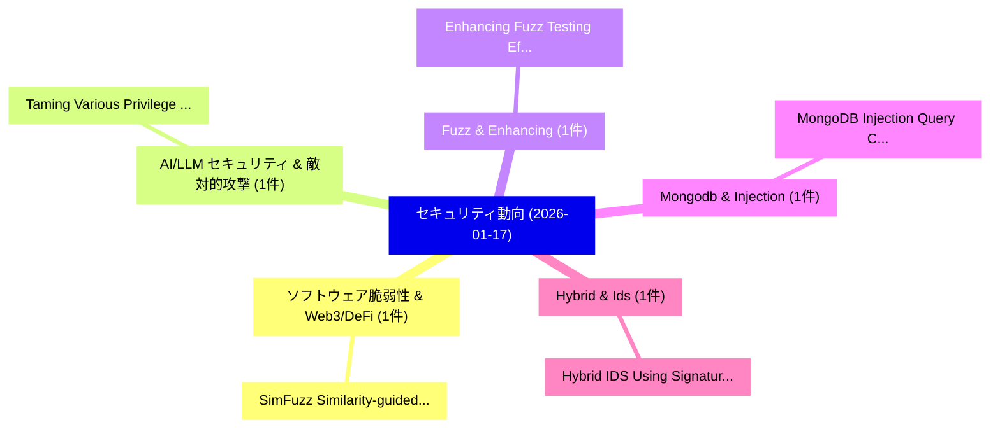

# 📅 02_daily: 日次エグゼクティブサマリー報告書 (2026-01-17)

**集計日時**: 2026-10-02 23:05:54 UTC  
**対象日付**: 2026-01-17  
**本日収集論文数**: 11 件  

---

## 💡 主要セキュリティ動向・脅威インサイト (Executive Insights)

本日の収集論文（計 11 件）において、以下の重点セキュリティ領域で活発な研究動向が確認されました：
- **ソフトウェア脆弱性 & Web3/DeFi** (1 件): 注目論文として 「SimFuzz: Similarity-guided Blo...」 等が発表され、実務防御および攻撃検証の進展が見られます。
- **AI/LLM セキュリティ & 敵対的攻撃** (1 件): 注目論文として 「Taming Various Privilege Escal...」 等が発表され、実務防御および攻撃検証の進展が見られます。
- **Fuzz & Enhancing** (1 件): 注目論文として 「Enhancing Fuzz Testing Efficie...」 等が発表され、実務防御および攻撃検証の進展が見られます。
- **Mongodb & Injection** (1 件): 注目論文として 「MongoDB Injection Query Classi...」 等が発表され、実務防御および攻撃検証の進展が見られます。
- **Hybrid & Ids** (1 件): 注目論文として 「Hybrid IDS Using Signature-Bas...」 等が発表され、実務防御および攻撃検証の進展が見られます。

### 🗺️ 技術・脅威トピックマインドマップ

---

## 📌 日次セキュリティ論文一覧 (日本語表形式)

| No | arXiv ID | 論文タイトル (日本語訳) | 重要キーワード | 構造化エグゼクティブ要約 (背景・提案・影響) | 脅威分類 | 詳細リンク |
|---|---|---|---|---|---|---|
| 1 | `2601.11838v1` | [SimFuzz: Similarity-guided Block-level Mutation for RISC-V Processor Fuzzing（セキュリティ分析論文）](../../okf/papers/2026-01-17/2601.11838.md) | `Processor Fuzzing`, `Similarity-guided Block`, `RISC-V Processor` | 【提案】概要 (Overview & Key Finding) 本論文「SimFuzz: Similarity-guided Block-level Mutation for RIS...。実証評価により経営層・セキュリティ管理者向け推奨アクション (E... | `executive-summary` | [arXiv](https://arxiv.org/abs/2601.11838v1) &#124; [OKF](../../okf/papers/2026-01-17/2601.11838.md) |
| 2 | `2601.11893v1` | [Taming Various Privilege Escalation in LLM-Based Agent Systems: A Mandatory Access Control Framework（セキュリティ分析論文）](../../okf/papers/2026-01-17/2601.11893.md) | `Taming Various Privilege Escalation`, `Based Agent Systems`, `LLM-Based Agent` | 【提案】概要 (Overview & Key Finding) 本論文「Taming Various 権限昇格 in LLM-Based Agent Systems: A Manda...。実証評価により経営層・セキュリティ管理者向け推奨アクション (E... | `cybersecurity` | [arXiv](https://arxiv.org/abs/2601.11893v1) &#124; [OKF](../../okf/papers/2026-01-17/2601.11893.md) |
| 3 | `2601.11972v1` | [Enhancing Fuzz Testing Efficiency through Automated Fuzz Target Generation（セキュリティ分析論文）](../../okf/papers/2026-01-17/2601.11972.md) | `Enhancing Fuzz Testing Efficiency`, `Automated Fuzz Target Generation`, `Chi Thien Tran` | 【提案】概要 (Overview & Key Finding) 本論文「Enhancing Fuzz Testing Efficiency through Automated Fuz...。実証評価により経営層・セキュリティ管理者向け推奨アクション (E... | `executive-summary` | [arXiv](https://arxiv.org/abs/2601.11972v1) &#124; [OKF](../../okf/papers/2026-01-17/2601.11972.md) |
| 4 | `2601.11996v1` | [MongoDB Injection Query Classification Model using MongoDB Log files as Training Data（セキュリティ分析論文）](../../okf/papers/2026-01-17/2601.11996.md) | `Injection Query Classification Model`, `Training Data`, `Shaunak Perni` | 【提案】概要 (Overview & Key Finding) 本論文「MongoDB Injection Query Classification Model using Mong...。実証評価により経営層・セキュリティ管理者向け推奨アクション (E... | `cs.DB` | [arXiv](https://arxiv.org/abs/2601.11996v1) &#124; [OKF](../../okf/papers/2026-01-17/2601.11996.md) |
| 5 | `2601.11998v1` | [Hybrid IDS Using Signature-Based and Anomaly-Based Detection（セキュリティ分析論文）](../../okf/papers/2026-01-17/2601.11998.md) | `Using Signature`, `Based Detection`, `Anomaly-Based Detection` | 【提案】概要 (Overview & Key Finding) 本論文「Hybrid IDS Using Signature-Based and Anomaly-Based Dete...。実証評価により経営層・セキュリティ管理者向け推奨アクション (E... | `cs.AI` | [arXiv](https://arxiv.org/abs/2601.11998v1) &#124; [OKF](../../okf/papers/2026-01-17/2601.11998.md) |
| 6 | `2601.12032v1` | [Speaking to Silicon: Neural Communication with Bitcoin Mining ASICs（セキュリティ分析論文）](../../okf/papers/2026-01-17/2601.12032.md) | `Neural Communication`, `Bitcoin Mining`, `Francisco Angulo` | 【提案】概要 (Overview & Key Finding) 本論文「Speaking to Silicon: Neural Communication with Bitcoin ...。実証評価により経営層・セキュリティ管理者向け推奨アクション (E... | `executive-summary` | [arXiv](https://arxiv.org/abs/2601.12032v1) &#124; [OKF](../../okf/papers/2026-01-17/2601.12032.md) |
| 7 | `2601.12042v1` | [Less Is More -- Until It Breaks: Security Pitfalls of Vision Token Compression in Large Vision-Language Models（セキュリティ分析論文）](../../okf/papers/2026-01-17/2601.12042.md) | `Vision Token Compression`, `Security Pitfalls`, `Large Vision` | 【提案】概要 (Overview & Key Finding) 本論文「Less Is More -- Until It Breaks: Security Pitfalls of V...。実証評価により経営層・セキュリティ管理者向け推奨アクション (E... | `cs.AI` | [arXiv](https://arxiv.org/abs/2601.12042v1) &#124; [OKF](../../okf/papers/2026-01-17/2601.12042.md) |
| 8 | `2601.12104v2` | [Powerful Training-Free Membership Inference Against Autoregressive Language Models（セキュリティ分析論文）](../../okf/papers/2026-01-17/2601.12104.md) | `Powerful Training`, `Training-Free Membership`, `Kostadin Cvejoski` | 【提案】概要 (Overview & Key Finding) 本論文「Powerful Training-Free Membership Inference Against Aut...。実証評価により経営層・セキュリティ管理者向け推奨アクション (E... | `cs.AI` | [arXiv](https://arxiv.org/abs/2601.12104v2) &#124; [OKF](../../okf/papers/2026-01-17/2601.12104.md) |
| 9 | `2601.12105v1` | [Privacy-Preserving Cohort Analytics for Personalized Health Platforms: A Differentially Private Framework with Stochastic Risk Modeling（セキュリティ分析論文）](../../okf/papers/2026-01-17/2601.12105.md) | `Preserving Cohort Analytics`, `Personalized Health Platforms`, `Stochastic Risk Modeling` | 【提案】概要 (Overview & Key Finding) 本論文「Privacy-Preserving Cohort Analytics for Personalized He...。実証評価により経営層・セキュリティ管理者向け推奨アクション (E... | `stat.ME` | [arXiv](https://arxiv.org/abs/2601.12105v1) &#124; [OKF](../../okf/papers/2026-01-17/2601.12105.md) |
| 10 | `2601.12136v2` | [CoSMeTIC: Zero-Knowledge Computational Sparse Merkle Trees with Inclusion-Exclusion Proofs for Clinical Research（セキュリティ分析論文）](../../okf/papers/2026-01-17/2601.12136.md) | `Knowledge Computational Sparse Merkle Trees`, `Exclusion Proofs`, `Clinical Research` | 【提案】概要 (Overview & Key Finding) 本論文「CoSMeTIC: Zero-Knowledge Computational Sparse Merkle Tr...。実証評価により経営層・セキュリティ管理者向け推奨アクション (E... | `cs.CE` | [arXiv](https://arxiv.org/abs/2601.12136v2) &#124; [OKF](../../okf/papers/2026-01-17/2601.12136.md) |
| 11 | `2601.14300v4` | [Low-Cost Hard-Label Adversarial Attack with Theoretical Foundations（セキュリティ分析論文）](../../okf/papers/2026-01-17/2601.14300.md) | `Label Adversarial Attack`, `Cost Hard`, `Theoretical Foundations` | 【提案】概要 (Overview & Key Finding) 本論文「Low-Cost Hard-Label 敵対的攻撃 with Theoretical Foundations（...。実証評価により経営層・セキュリティ管理者向け推奨アクション (E... | `executive-summary` | [arXiv](https://arxiv.org/abs/2601.14300v4) &#124; [OKF](../../okf/papers/2026-01-17/2601.14300.md) |

