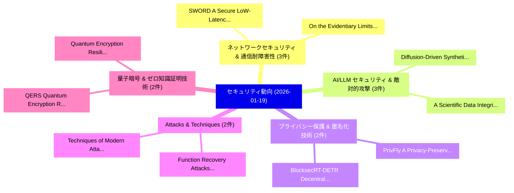

# 📅 02_daily: 日次エグゼクティブサマリー報告書 (2026-01-19)

**集計日時**: 2026-10-02 23:05:54 UTC  
**対象日付**: 2026-01-19  
**本日収集論文数**: 28 件  

---

## 💡 主要セキュリティ動向・脅威インサイト (Executive Insights)

本日の収集論文（計 28 件）において、以下の重点セキュリティ領域で活発な研究動向が確認されました：
- **ネットワークセキュリティ & 通信耐障害性** (3 件): 注目論文として 「SWORD: A Secure LoW-Latency Of...」、「On the Evidentiary Limits of M...」 等が発表され、実務防御および攻撃検証の進展が見られます。
- **AI/LLM セキュリティ & 敵対的攻撃** (3 件): 注目論文として 「Diffusion-Driven Synthetic Tab...」、「A Scientific Data Integrity sy...」 等が発表され、実務防御および攻撃検証の進展が見られます。
- **プライバシー保護 & 匿名化技術** (2 件): 注目論文として 「BlocksecRT-DETR: Decentralized...」、「PrivFly: A Privacy-Preserving ...」 等が発表され、実務防御および攻撃検証の進展が見られます。
- **Attacks & Techniques** (2 件): 注目論文として 「Function Recovery Attacks in G...」、「Techniques of Modern Attacks（セ...」 等が発表され、実務防御および攻撃検証の進展が見られます。
- **量子暗号 & ゼロ知識証明技術** (2 件): 注目論文として 「QERS: Quantum Encryption Resil...」、「Quantum Encryption Resilience ...」 等が発表され、実務防御および攻撃検証の進展が見られます。

### 🗺️ 技術・脅威トピックマインドマップ

---

## 📌 日次セキュリティ論文一覧 (日本語表形式)

| No | arXiv ID | 論文タイトル (日本語訳) | 重要キーワード | 構造化エグゼクティブ要約 (背景・提案・影響) | 脅威分類 | 詳細リンク |
|---|---|---|---|---|---|---|
| 1 | `2601.12634v1` | [The Cost of Convenience: Identifying, Analyzing, and Mitigating Predatory Loan Applications on Android（セキュリティ分析論文）](../../okf/papers/2026-01-19/2601.12634.md) | `Mitigating Predatory Loan Applications`, `Olawale Amos Akanji`, `Manuel Egele` | 【提案】概要 (Overview & Key Finding) 本論文「The Cost of Convenience: Identifying, Analyzing, and Mi...。実証評価により経営層・セキュリティ管理者向け推奨アクション (E... | `executive-summary` | [arXiv](https://arxiv.org/abs/2601.12634v1) &#124; [OKF](../../okf/papers/2026-01-19/2601.12634.md) |
| 2 | `2601.12693v1` | [BlocksecRT-DETR: Decentralized Privacy-Preserving and Token-Efficient Federated Transformer Learning for Secure Real-Time Object Detection in ITS（セキュリティ分析論文）](../../okf/papers/2026-01-19/2601.12693.md) | `Efficient Federated Transformer Learning`, `Time Object Detection`, `Decentralized Privacy` | 【提案】概要 (Overview & Key Finding) 本論文「BlocksecRT-DETR: Decentralized Privacy-Preserving and T...。実証評価により経営層・セキュリティ管理者向け推奨アクション (E... | `executive-summary` | [arXiv](https://arxiv.org/abs/2601.12693v1) &#124; [OKF](../../okf/papers/2026-01-19/2601.12693.md) |
| 3 | `2601.12716v1` | [CellularSpecSec-Bench: A Staged Benchmark for Evidence-Grounded Interpretation and Security Reasoning over 3GPP Specifications（セキュリティ分析論文）](../../okf/papers/2026-01-19/2601.12716.md) | `Staged Benchmark`, `Grounded Interpretation`, `Security Reasoning` | 【提案】概要 (Overview & Key Finding) 本論文「CellularSpecSec-Bench: A Staged Benchmark for Evidence-...。実証評価により経営層・セキュリティ管理者向け推奨アクション (E... | `cybersecurity` | [arXiv](https://arxiv.org/abs/2601.12716v1) &#124; [OKF](../../okf/papers/2026-01-19/2601.12716.md) |
| 4 | `2601.12786v2` | [DUAP: Dual-task Universal Adversarial Perturbations Against Voice Control Systems（セキュリティ分析論文）](../../okf/papers/2026-01-19/2601.12786.md) | `Dual-task Universal`, `Suyang Sun`, `Weifei Jin` | 【提案】概要 (Overview & Key Finding) 本論文「DUAP: Dual-task Universal Adversarial Perturbations Aga...。実証評価により経営層・セキュリティ管理者向け推奨アクション (E... | `cybersecurity` | [arXiv](https://arxiv.org/abs/2601.12786v2) &#124; [OKF](../../okf/papers/2026-01-19/2601.12786.md) |
| 5 | `2601.12866v1` | [PDFInspect: A Unified Feature Extraction Framework for Malicious Document Detection（セキュリティ分析論文）](../../okf/papers/2026-01-19/2601.12866.md) | `Malicious Document Detection`, `Raw Meta`, `Executive Summary` | 【提案】概要 (Overview & Key Finding) 本論文「PDFInspect: A Unified Feature Extraction Framework for ...。実証評価により経営層・セキュリティ管理者向け推奨アクション (E... | `executive-summary` | [arXiv](https://arxiv.org/abs/2601.12866v1) &#124; [OKF](../../okf/papers/2026-01-19/2601.12866.md) |
| 6 | `2601.12875v1` | [SWORD: A Secure LoW-Latency Offline-First Authentication and Data Sharing Scheme for Resource Constrained Distributed Networks（セキュリティ分析論文）](../../okf/papers/2026-01-19/2601.12875.md) | `Resource Constrained Distributed Networks`, `Data Sharing Scheme`, `Latency Offline` | 【提案】概要 (Overview & Key Finding) 本論文「SWORD: A Secure LoW-Latency Offline-First Authenticatio...。実証評価により経営層・セキュリティ管理者向け推奨アクション (E... | `executive-summary` | [arXiv](https://arxiv.org/abs/2601.12875v1) &#124; [OKF](../../okf/papers/2026-01-19/2601.12875.md) |
| 7 | `2601.12916v2` | [Static Core Structures in Tigress Virtualization-Based Obfuscation Using an LLVM Passの検出](../../okf/papers/2026-01-19/2601.12916.md) | `Based Obfuscation Using`, `Tigress Virtualization`, `Virtualization-Based Obfuscation` | 【提案】概要 (Overview & Key Finding) 本論文「Static Core Structures in Tigress Virtualization-Based ...。実証評価により経営層・セキュリティ管理者向け推奨アクション (E... | `cybersecurity` | [arXiv](https://arxiv.org/abs/2601.12916v2) &#124; [OKF](../../okf/papers/2026-01-19/2601.12916.md) |
| 8 | `2601.12922v1` | [Your Privacy Depends on Others: Collusion Vulnerabilities in Individual Differential Privacy（セキュリティ分析論文）](../../okf/papers/2026-01-19/2601.12922.md) | `Individual Differential Privacy`, `Collusion Vulnerabilities`, `Johannes Kaiser` | 【提案】概要 (Overview & Key Finding) 本論文「Your Privacy Depends on Others: Collusion Vulnerabiliti...。実証評価により経営層・セキュリティ管理者向け推奨アクション (E... | `cs.AI` | [arXiv](https://arxiv.org/abs/2601.12922v1) &#124; [OKF](../../okf/papers/2026-01-19/2601.12922.md) |
| 9 | `2601.12937v1` | [On the Evidentiary Limits of Membership Inference for Copyright Auditing（セキュリティ分析論文）](../../okf/papers/2026-01-19/2601.12937.md) | `Evidentiary Limits`, `Membership Inference`, `Copyright Auditing` | 【提案】概要 (Overview & Key Finding) 本論文「On the Evidentiary Limits of Membership Inference for C...。実証評価により経営層・セキュリティ管理者向け推奨アクション (E... | `cs.AI` | [arXiv](https://arxiv.org/abs/2601.12937v1) &#124; [OKF](../../okf/papers/2026-01-19/2601.12937.md) |
| 10 | `2601.12978v1` | [Reproducibility in Event-Log Research: A Parametrised Generator and Benchmark for Event-based Signatures（セキュリティ分析論文）](../../okf/papers/2026-01-19/2601.12978.md) | `Log Research`, `Parametrised Generator`, `Event-Log Research` | 【提案】概要 (Overview & Key Finding) 本論文「Reproducibility in Event-Log Research: A Parametrised G...。実証評価により経営層・セキュリティ管理者向け推奨アクション (E... | `cybersecurity` | [arXiv](https://arxiv.org/abs/2601.12978v1) &#124; [OKF](../../okf/papers/2026-01-19/2601.12978.md) |
| 11 | `2601.12986v2` | [KinGuard: Hierarchical Kinship-Aware Fingerprinting to Defend Against Large Language Model Stealing（セキュリティ分析論文）](../../okf/papers/2026-01-19/2601.12986.md) | `Hierarchical Kinship`, `Aware Fingerprinting`, `Kinship-Aware Fingerprinting` | 【提案】概要 (Overview & Key Finding) 本論文「KinGuard: Hierarchical Kinship-Aware Fingerprinting to ...。実証評価により経営層・セキュリティ管理者向け推奨アクション (E... | `cybersecurity` | [arXiv](https://arxiv.org/abs/2601.12986v2) &#124; [OKF](../../okf/papers/2026-01-19/2601.12986.md) |
| 12 | `2601.13003v1` | [PrivFly: A Privacy-Preserving Self-Supervised Framework for Rare Attack Detection in IoFT（セキュリティ分析論文）](../../okf/papers/2026-01-19/2601.13003.md) | `Rare Attack Detection`, `Preserving Self`, `Privacy-Preserving Self` | 【提案】概要 (Overview & Key Finding) 本論文「PrivFly: A Privacy-Preserving Self-Supervised Framework...。実証評価により経営層・セキュリティ管理者向け推奨アクション (E... | `cybersecurity` | [arXiv](https://arxiv.org/abs/2601.13003v1) &#124; [OKF](../../okf/papers/2026-01-19/2601.13003.md) |
| 13 | `2601.13031v1` | [Post-Quantum Secure Aggregation via Code-Based Homomorphic Encryption（セキュリティ分析論文）](../../okf/papers/2026-01-19/2601.13031.md) | `Quantum Secure Aggregation`, `Based Homomorphic Encryption`, `Post-Quantum Secure` | 【提案】概要 (Overview & Key Finding) 本論文「Post-量子 Secure Aggregation via Code-Based 準同型暗号（セキュリティ分...。実証評価により経営層・セキュリティ管理者向け推奨アクション (E... | `executive-summary` | [arXiv](https://arxiv.org/abs/2601.13031v1) &#124; [OKF](../../okf/papers/2026-01-19/2601.13031.md) |
| 14 | `2601.13041v2` | [High-Throughput and Scalable Secure Inference Protocols for Deep Learning with Packed Secret Sharing（セキュリティ分析論文）](../../okf/papers/2026-01-19/2601.13041.md) | `Scalable Secure Inference Protocols`, `Packed Secret Sharing`, `Deep Learning` | 【提案】概要 (Overview & Key Finding) 本論文「High-Throughput and Scalable Secure Inference Protocols...。実証評価により経営層・セキュリティ管理者向け推奨アクション (E... | `cybersecurity` | [arXiv](https://arxiv.org/abs/2601.13041v2) &#124; [OKF](../../okf/papers/2026-01-19/2601.13041.md) |
| 15 | `2601.13082v1` | [Adversarial News and Lost Profits: Manipulating Headlines in LLM-Driven Algorithmic Trading（セキュリティ分析論文）](../../okf/papers/2026-01-19/2601.13082.md) | `Driven Algorithmic Trading`, `Adversarial News`, `Lost Profits` | 【提案】概要 (Overview & Key Finding) 本論文「Adversarial News and Lost Profits: Manipulating Headlin...。実証評価により経営層・セキュリティ管理者向け推奨アクション (E... | `executive-summary` | [arXiv](https://arxiv.org/abs/2601.13082v1) &#124; [OKF](../../okf/papers/2026-01-19/2601.13082.md) |
| 16 | `2601.13112v1` | [CODE: A Contradiction-Based Deliberation Extension Framework for Overthinking Attacks on Retrieval-Augmented Generation（セキュリティ分析論文）](../../okf/papers/2026-01-19/2601.13112.md) | `Overthinking Attacks`, `Augmented Generation`, `Contradiction-Based Deliberation` | 【提案】概要 (Overview & Key Finding) 本論文「CODE: A Contradiction-Based Deliberation Extension Fram...。実証評価により経営層・セキュリティ管理者向け推奨アクション (E... | `cybersecurity` | [arXiv](https://arxiv.org/abs/2601.13112v1) &#124; [OKF](../../okf/papers/2026-01-19/2601.13112.md) |
| 17 | `2601.13197v2` | [Diffusion-Driven Synthetic Tabular Data Generation for Enhanced DoS/DDoS Attack Classification（セキュリティ分析論文）](../../okf/papers/2026-01-19/2601.13197.md) | `Driven Synthetic Tabular Data Generation`, `Diffusion-Driven Synthetic`, `Attack Classification` | 【提案】概要 (Overview & Key Finding) 本論文「Diffusion-Driven Synthetic Tabular Data Generation for ...。実証評価により経営層・セキュリティ管理者向け推奨アクション (E... | `cs.AI` | [arXiv](https://arxiv.org/abs/2601.13197v2) &#124; [OKF](../../okf/papers/2026-01-19/2601.13197.md) |
| 18 | `2601.13258v2` | [Simple and Useful One-Time Programs in the Quantum Random Oracle Modelに向けて](../../okf/papers/2026-01-19/2601.13258.md) | `Useful One`, `Time Programs`, `One-Time Programs` | 【提案】概要 (Overview & Key Finding) 本論文「Simple and Useful One-Time Programs in the 量子 Random Or...。実証評価により経営層・セキュリティ管理者向け推奨アクション (E... | `executive-summary` | [arXiv](https://arxiv.org/abs/2601.13258v2) &#124; [OKF](../../okf/papers/2026-01-19/2601.13258.md) |
| 19 | `2601.13271v4` | [Function Recovery Attacks in Gate-Hiding Garbled Circuits using SAT Solving（セキュリティ分析論文）](../../okf/papers/2026-01-19/2601.13271.md) | `Function Recovery Attacks`, `Hiding Garbled Circuits`, `Gate-Hiding Garbled` | 【提案】概要 (Overview & Key Finding) 本論文「Function Recovery Attacks in Gate-Hiding Garbled Circui...。実証評価により経営層・セキュリティ管理者向け推奨アクション (E... | `cs.LO` | [arXiv](https://arxiv.org/abs/2601.13271v4) &#124; [OKF](../../okf/papers/2026-01-19/2601.13271.md) |
| 20 | `2601.13359v3` | [Sockpuppetting: Jailbreaking LLMs by Combining Prefilling with Optimization（セキュリティ分析論文）](../../okf/papers/2026-01-19/2601.13359.md) | `Combining Prefilling`, `Asen Dotsinski`, `Panagiotis Eustratiadis` | 【提案】概要 (Overview & Key Finding) 本論文「Sockpuppetting: ジェイルブレイクing LLMs by Combining Prefillin...。実証評価により経営層・セキュリティ管理者向け推奨アクション (E... | `executive-summary` | [arXiv](https://arxiv.org/abs/2601.13359v3) &#124; [OKF](../../okf/papers/2026-01-19/2601.13359.md) |
| 21 | `2601.13399v1` | [QERS: Quantum Encryption Resilience Score for Post-Quantum Cryptography in Computer, IoT, and IIoT Systems（セキュリティ分析論文）](../../okf/papers/2026-01-19/2601.13399.md) | `Quantum Encryption Resilience Score`, `Quantum Cryptography`, `Post-Quantum Cryptography` | 【提案】概要 (Overview & Key Finding) 本論文「QERS: 量子 Encryption Resilience Score for ポスト量子暗号 in Com...。実証評価により経営層・セキュリティ管理者向け推奨アクション (E... | `cs.NI` | [arXiv](https://arxiv.org/abs/2601.13399v1) &#124; [OKF](../../okf/papers/2026-01-19/2601.13399.md) |
| 22 | `2601.13423v1` | [Quantum Encryption Resilience Score (QERS) for MQTT, HTTP, and HTTPS under Post-Quantum Cryptography in Computer, IoT, and IIoT Systems（セキュリティ分析論文）](../../okf/papers/2026-01-19/2601.13423.md) | `Quantum Encryption Resilience Score`, `Quantum Cryptography`, `Post-Quantum Cryptography` | 【提案】概要 (Overview & Key Finding) 本論文「量子 Encryption Resilience Score (QERS) for MQTT, HTTP, a...。実証評価により経営層・セキュリティ管理者向け推奨アクション (E... | `cs.NI` | [arXiv](https://arxiv.org/abs/2601.13423v1) &#124; [OKF](../../okf/papers/2026-01-19/2601.13423.md) |
| 23 | `2601.13425v1` | [A Scientific Data Integrity system based on Blockchain（セキュリティ分析論文）](../../okf/papers/2026-01-19/2601.13425.md) | `Scientific Data Integrity`, `Gian Sebastian Mier Bello`, `Alexander Martinez Mendez` | 【提案】概要 (Overview & Key Finding) 本論文「A Scientific Data Integrity system based on Blockchain（...。実証評価によりNúñez - **公開日時**: `20。 | `cs.ET` | [arXiv](https://arxiv.org/abs/2601.13425v1) &#124; [OKF](../../okf/papers/2026-01-19/2601.13425.md) |
| 24 | `2601.13427v1` | [Techniques of Modern Attacks（セキュリティ分析論文）](../../okf/papers/2026-01-19/2601.13427.md) | `Modern Attacks`, `Alexander Shim`, `Raw Meta` | 【提案】概要 (Overview & Key Finding) 本論文「Techniques of Modern Attacks（セキュリティ分析論文）」（原題: Technique...。実証評価により経営層・セキュリティ管理者向け推奨アクション (E... | `cybersecurity` | [arXiv](https://arxiv.org/abs/2601.13427v1) &#124; [OKF](../../okf/papers/2026-01-19/2601.13427.md) |
| 25 | `2601.14310v1` | [CORVUS: Red-Teaming Hallucination Detectors via Internal Signal Camouflage in 大規模言語モデル](../../okf/papers/2026-01-19/2601.14310.md) | `Teaming Hallucination Detectors`, `Internal Signal Camouflage`, `Red-Teaming Hallucination` | 【提案】概要 (Overview & Key Finding) 本論文「CORVUS: Red-Teaming Hallucination Detectors via Interna...。実証評価により経営層・セキュリティ管理者向け推奨アクション (E... | `cs.AI` | [arXiv](https://arxiv.org/abs/2601.14310v1) &#124; [OKF](../../okf/papers/2026-01-19/2601.14310.md) |
| 26 | `2601.14311v1` | [Tracing the Data Trail: A Survey of Data Provenance, Transparency and Traceability in LLMs（セキュリティ分析論文）](../../okf/papers/2026-01-19/2601.14311.md) | `Data Trail`, `Data Provenance`, `Inti Gabriel Mendoza Estrada` | 【提案】概要 (Overview & Key Finding) 本論文「Tracing the Data Trail: A Survey of Data Provenance, Tr...。実証評価により経営層・セキュリティ管理者向け推奨アクション (E... | `cs.AI` | [arXiv](https://arxiv.org/abs/2601.14311v1) &#124; [OKF](../../okf/papers/2026-01-19/2601.14311.md) |
| 27 | `2601.22169v1` | [In Vino Veritas and Vulnerabilities: Examining LLM Safety via Drunk Language Inducement（セキュリティ分析論文）](../../okf/papers/2026-01-19/2601.22169.md) | `Drunk Language Inducement`, `Anudeex Shetty`, `Aditya Joshi` | 【提案】概要 (Overview & Key Finding) 本論文「In Vino Veritas and Vulnerabilities: Examining LLM Safe...。実証評価により経営層・セキュリティ管理者向け推奨アクション (E... | `cs.AI` | [arXiv](https://arxiv.org/abs/2601.22169v1) &#124; [OKF](../../okf/papers/2026-01-19/2601.22169.md) |
| 28 | `2602.02501v1` | [Augmenting Parameter-Efficient Pre-trained Language Models with 大規模言語モデル](../../okf/papers/2026-01-19/2602.02501.md) | `Augmenting Parameter`, `Efficient Pre`, `Language Models` | 【提案】概要 (Overview & Key Finding) 本論文「Augmenting Parameter-Efficient Pre-trained Language Mod...。実証評価により経営層・セキュリティ管理者向け推奨アクション (E... | `executive-summary` | [arXiv](https://arxiv.org/abs/2602.02501v1) &#124; [OKF](../../okf/papers/2026-01-19/2602.02501.md) |

