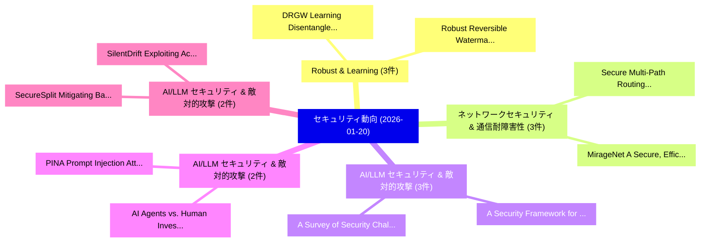

# 📅 02_daily: 日次エグゼクティブサマリー報告書 (2026-01-20)

**集計日時**: 2026-10-02 23:05:54 UTC  
**対象日付**: 2026-01-20  
**本日収集論文数**: 36 件  

---

## 💡 主要セキュリティ動向・脅威インサイト (Executive Insights)

本日の収集論文（計 36 件）において、以下の重点セキュリティ領域で活発な研究動向が確認されました：
- **Robust & Learning** (3 件): 注目論文として 「DRGW: Learning Disentangled Re...」、「Robust Reversible Watermarking...」 等が発表され、実務防御および攻撃検証の進展が見られます。
- **ネットワークセキュリティ & 通信耐障害性** (3 件): 注目論文として 「Secure Multi-Path Routing with...」、「MirageNet:A Secure, Efficient,...」 等が発表され、実務防御および攻撃検証の進展が見られます。
- **AI/LLM セキュリティ & 敵対的攻撃** (3 件): 注目論文として 「A Security Framework for Chemi...」、「A Survey of Security Challenge...」 等が発表され、実務防御および攻撃検証の進展が見られます。
- **AI/LLM セキュリティ & 敵対的攻撃** (2 件): 注目論文として 「PINA: Prompt Injection Attack ...」、「AI Agents vs. Human Investigat...」 等が発表され、実務防御および攻撃検証の進展が見られます。
- **AI/LLM セキュリティ & 敵対的攻撃** (2 件): 注目論文として 「SecureSplit: Mitigating Backdo...」、「SilentDrift: Exploiting Action...」 等が発表され、実務防御および攻撃検証の進展が見られます。

### 🗺️ 技術・脅威トピックマインドマップ

---

## 📌 日次セキュリティ論文一覧 (日本語表形式)

| No | arXiv ID | 論文タイトル (日本語訳) | 重要キーワード | 構造化エグゼクティブ要約 (背景・提案・影響) | 脅威分類 | 詳細リンク |
|---|---|---|---|---|---|---|
| 1 | `2601.13515v1` | [Automatic Adjustment of HPA Parameters and Attack Prevention in Kubernetes Using Random Forests（セキュリティ分析論文）](../../okf/papers/2026-01-20/2601.13515.md) | `Kubernetes Using Random Forests`, `Automatic Adjustment`, `Attack Prevention` | 【提案】概要 (Overview & Key Finding) 本論文「Automatic Adjustment of HPA Parameters and Attack Preve...。実証評価により経営層・セキュリティ管理者向け推奨アクション (E... | `cs.AI` | [arXiv](https://arxiv.org/abs/2601.13515v1) &#124; [OKF](../../okf/papers/2026-01-20/2601.13515.md) |
| 2 | `2601.13528v1` | [Eliciting Harmful Capabilities by Fine-Tuning On Safeguarded Outputs（セキュリティ分析論文）](../../okf/papers/2026-01-20/2601.13528.md) | `Eliciting Harmful Capabilities`, `Jackson Kaunismaa`, `Avery Griffin` | 【提案】概要 (Overview & Key Finding) 本論文「Eliciting Harmful Capabilities by Fine-Tuning On Safegu...。実証評価により経営層・セキュリティ管理者向け推奨アクション (E... | `cs.AI` | [arXiv](https://arxiv.org/abs/2601.13528v1) &#124; [OKF](../../okf/papers/2026-01-20/2601.13528.md) |
| 3 | `2601.13569v2` | [DRGW: Learning Disentangled Representations for Robust Graph Watermarking（セキュリティ分析論文）](../../okf/papers/2026-01-20/2601.13569.md) | `Learning Disentangled Representations`, `Robust Graph Watermarking`, `Jiasen Li` | 【提案】概要 (Overview & Key Finding) 本論文「DRGW: Learning Disentangled Representations for Robust ...。実証評価により経営層・セキュリティ管理者向け推奨アクション (E... | `executive-summary` | [arXiv](https://arxiv.org/abs/2601.13569v2) &#124; [OKF](../../okf/papers/2026-01-20/2601.13569.md) |
| 4 | `2601.13607v1` | [When Reasoning Leaks Membership: Membership Inference Attack on Black-box Large Reasoning Models（セキュリティ分析論文）](../../okf/papers/2026-01-20/2601.13607.md) | `Membership Inference Attack`, `Large Reasoning Models`, `Black-box Large` | 【提案】概要 (Overview & Key Finding) 本論文「When Reasoning Leaks Membership: Membership Inference A...。実証評価により経営層・セキュリティ管理者向け推奨アクション (E... | `cybersecurity` | [arXiv](https://arxiv.org/abs/2601.13607v1) &#124; [OKF](../../okf/papers/2026-01-20/2601.13607.md) |
| 5 | `2601.13610v1` | [Secure Multi-Path Routing with All-or-Nothing Transform for Network-on-Chip Architectures（セキュリティ分析論文）](../../okf/papers/2026-01-20/2601.13610.md) | `Secure Multi`, `Path Routing`, `Multi-Path Routing` | 【提案】概要 (Overview & Key Finding) 本論文「Secure Multi-Path Routing with All-or-Nothing Transform...。実証評価により経営層・セキュリティ管理者向け推奨アクション (E... | `cs.NI` | [arXiv](https://arxiv.org/abs/2601.13610v1) &#124; [OKF](../../okf/papers/2026-01-20/2601.13610.md) |
| 6 | `2601.13612v1` | [PINA: Prompt Injection Attack against Navigation Agents（セキュリティ分析論文）](../../okf/papers/2026-01-20/2601.13612.md) | `Prompt Injection Attack`, `Navigation Agents`, `Jiani Liu` | 【提案】概要 (Overview & Key Finding) 本論文「PINA: プロンプトインジェクション Attack against Navigation Agents（セキ...。実証評価により経営層・セキュリティ管理者向け推奨アクション (E... | `cybersecurity` | [arXiv](https://arxiv.org/abs/2601.13612v1) &#124; [OKF](../../okf/papers/2026-01-20/2601.13612.md) |
| 7 | `2601.13681v1` | [ORCA - An Automated Threat Analysis Pipeline for O-RAN Continuous Development（セキュリティ分析論文）](../../okf/papers/2026-01-20/2601.13681.md) | `Continuous Development`, `O-RAN Continuous`, `Felix Klement` | 【提案】概要 (Overview & Key Finding) 本論文「ORCA - An Automated 脅威 Analysis Pipeline for O-RAN Cont...。実証評価により経営層・セキュリティ管理者向け推奨アクション (E... | `cybersecurity` | [arXiv](https://arxiv.org/abs/2601.13681v1) &#124; [OKF](../../okf/papers/2026-01-20/2601.13681.md) |
| 8 | `2601.13757v1` | [The Limits of Conditional Volatility: Assessing Cryptocurrency VaR under EWMA and IGARCH Models（セキュリティ分析論文）](../../okf/papers/2026-01-20/2601.13757.md) | `Conditional Volatility`, `Assessing Cryptocurrency`, `Ekleen Kaur` | 【提案】概要 (Overview & Key Finding) 本論文「The Limits of Conditional Volatility: Assessing Cryptoc...。実証評価により経営層・セキュリティ管理者向け推奨アクション (E... | `cs.CE` | [arXiv](https://arxiv.org/abs/2601.13757v1) &#124; [OKF](../../okf/papers/2026-01-20/2601.13757.md) |
| 9 | `2601.13826v1` | [MirageNet:A Secure, Efficient, and Scalable On-Device Model Protection in Heterogeneous TEE and GPU System（セキュリティ分析論文）](../../okf/papers/2026-01-20/2601.13826.md) | `Device Model Protection`, `On-Device Model`, `Huadi Zheng` | 【提案】概要 (Overview & Key Finding) 本論文「MirageNet:A Secure, Efficient, and Scalable On-Device M...。実証評価により経営層・セキュリティ管理者向け推奨アクション (E... | `cybersecurity` | [arXiv](https://arxiv.org/abs/2601.13826v1) &#124; [OKF](../../okf/papers/2026-01-20/2601.13826.md) |
| 10 | `2601.13840v1` | [Robust Reversible Watermarking in Encrypted Images Based on Dual-MSBs Spiral Embedding（セキュリティ分析論文）](../../okf/papers/2026-01-20/2601.13840.md) | `Robust Reversible Watermarking`, `Encrypted Images Based`, `Spiral Embedding` | 【提案】概要 (Overview & Key Finding) 本論文「Robust Reversible Watermarking in Encrypted Images Base...。実証評価により経営層・セキュリティ管理者向け推奨アクション (E... | `cybersecurity` | [arXiv](https://arxiv.org/abs/2601.13840v1) &#124; [OKF](../../okf/papers/2026-01-20/2601.13840.md) |
| 11 | `2601.13864v2` | [HardSecBench: the Security Awareness of LLMs for Hardware Code Generationのベンチマーク評価](../../okf/papers/2026-01-20/2601.13864.md) | `Security Awareness`, `Hardware Code`, `Hardware Code Generation` | 【提案】概要 (Overview & Key Finding) 本論文「HardSecBench: the Security Awareness of LLMs for Hardwa...。実証評価により経営層・セキュリティ管理者向け推奨アクション (E... | `cs.AI` | [arXiv](https://arxiv.org/abs/2601.13864v2) &#124; [OKF](../../okf/papers/2026-01-20/2601.13864.md) |
| 12 | `2601.13873v1` | [Enhanced Cyber Threat Intelligence by Network Forensic Analysis for Ransomware as a Service(RaaS) Malwares（セキュリティ分析論文）](../../okf/papers/2026-01-20/2601.13873.md) | `Enhanced Cyber Threat Intelligence`, `Raw Meta`, `Executive Summary` | 【提案】概要 (Overview & Key Finding) 本論文「Enhanced Cyber 脅威 Intelligence by Network Forensic Anal...。実証評価により経営層・セキュリティ管理者向け推奨アクション (E... | `cybersecurity` | [arXiv](https://arxiv.org/abs/2601.13873v1) &#124; [OKF](../../okf/papers/2026-01-20/2601.13873.md) |
| 13 | `2601.13903v2` | [Know Your Contract: eIDAS-Based Verifiable Legal Identities for Smart Contracts, Enabling Regulatory-Compliant On-Chain Operations（セキュリティ分析論文）](../../okf/papers/2026-01-20/2601.13903.md) | `Based Verifiable Legal Identities`, `Smart Contracts`, `Enabling Regulatory` | 【提案】概要 (Overview & Key Finding) 本論文「Know Your Contract: eIDAS-Based Verifiable Legal Identi...。実証評価により経営層・セキュリティ管理者向け推奨アクション (E... | `executive-summary` | [arXiv](https://arxiv.org/abs/2601.13903v2) &#124; [OKF](../../okf/papers/2026-01-20/2601.13903.md) |
| 14 | `2601.13907v1` | [Decentralized Infrastructure for Digital Notarizing, Signing and Sharing Files using Blockchain（セキュリティ分析論文）](../../okf/papers/2026-01-20/2601.13907.md) | `Decentralized Infrastructure`, `Digital Notarizing`, `Sharing Files` | 【提案】概要 (Overview & Key Finding) 本論文「Decentralized Infrastructure for Digital Notarizing, Si...。実証評価により経営層・セキュリティ管理者向け推奨アクション (E... | `cybersecurity` | [arXiv](https://arxiv.org/abs/2601.13907v1) &#124; [OKF](../../okf/papers/2026-01-20/2601.13907.md) |
| 15 | `2601.13981v4` | [VirtualCrime: Evaluating the Criminal Potential and Agentic Behaviors of 大規模言語モデル via Sandbox Simulation](../../okf/papers/2026-01-20/2601.13981.md) | `Criminal Potential`, `Agentic Behaviors`, `Sandbox Simulation` | 【提案】概要 (Overview & Key Finding) 本論文「VirtualCrime: Evaluating the Criminal Potential and Age...。実証評価により経営層・セキュリティ管理者向け推奨アクション (E... | `cybersecurity` | [arXiv](https://arxiv.org/abs/2601.13981v4) &#124; [OKF](../../okf/papers/2026-01-20/2601.13981.md) |
| 16 | `2601.14019v1` | [A Security Framework for Chemical Functions（セキュリティ分析論文）](../../okf/papers/2026-01-20/2601.14019.md) | `Chemical Functions`, `Frederik Walter`, `Hrishi Narayanan` | 【提案】概要 (Overview & Key Finding) 本論文「A Security Framework for Chemical Functions（セキュリティ分析論文）...。実証評価により経営層・セキュリティ管理者向け推奨アクション (E... | `cybersecurity` | [arXiv](https://arxiv.org/abs/2601.14019v1) &#124; [OKF](../../okf/papers/2026-01-20/2601.14019.md) |
| 17 | `2601.14021v1` | [OAMAC: Origin-Aware Mandatory Access Control for Practical Post-Compromise Attack Surface Reduction（セキュリティ分析論文）](../../okf/papers/2026-01-20/2601.14021.md) | `Aware Mandatory Access Control`, `Compromise Attack Surface Reduction`, `Practical Post` | 【提案】概要 (Overview & Key Finding) 本論文「OAMAC: Origin-Aware Mandatory アクセス制御 for Practical Post...。実証評価により経営層・セキュリティ管理者向け推奨アクション (E... | `executive-summary` | [arXiv](https://arxiv.org/abs/2601.14021v1) &#124; [OKF](../../okf/papers/2026-01-20/2601.14021.md) |
| 18 | `2601.14033v2` | [Private Prediction via PAC Privacy（セキュリティ分析論文）](../../okf/papers/2026-01-20/2601.14033.md) | `Private Prediction`, `Xiaochen Zhu`, `Mayuri Sridhar` | 【提案】概要 (Overview & Key Finding) 本論文「Private Prediction via PAC Privacy（セキュリティ分析論文）」（原題: Pri...。実証評価により経営層・セキュリティ管理者向け推奨アクション (E... | `executive-summary` | [arXiv](https://arxiv.org/abs/2601.14033v2) &#124; [OKF](../../okf/papers/2026-01-20/2601.14033.md) |
| 19 | `2601.14054v2` | [SecureSplit: Mitigating Backdoor Attacks in Split Learning（セキュリティ分析論文）](../../okf/papers/2026-01-20/2601.14054.md) | `Mitigating Backdoor Attacks`, `Split Learning`, `Zhihao Dou` | 【提案】概要 (Overview & Key Finding) 本論文「SecureSplit: Mitigating Backdoor Attacks in Split Learn...。実証評価により経営層・セキュリティ管理者向け推奨アクション (E... | `executive-summary` | [arXiv](https://arxiv.org/abs/2601.14054v2) &#124; [OKF](../../okf/papers/2026-01-20/2601.14054.md) |
| 20 | `2601.14108v1` | [AttackMate: Realistic Emulation and Automation of Cyber Attack Scenarios Across the Kill Chain（セキュリティ分析論文）](../../okf/papers/2026-01-20/2601.14108.md) | `Cyber Attack Scenarios Across`, `Realistic Emulation`, `Kill Chain` | 【提案】概要 (Overview & Key Finding) 本論文「AttackMate: Realistic Emulation and Automation of Cyber...。実証評価により経営層・セキュリティ管理者向け推奨アクション (E... | `cybersecurity` | [arXiv](https://arxiv.org/abs/2601.14108v1) &#124; [OKF](../../okf/papers/2026-01-20/2601.14108.md) |
| 21 | `2601.14163v1` | [An Empirical Study on Remote Code Execution in Machine Learning Model Hosting Ecosystems（セキュリティ分析論文）](../../okf/papers/2026-01-20/2601.14163.md) | `Machine Learning Model Hosting Ecosystems`, `Remote Code Execution`, `Mohammed Latif Siddiq` | 【提案】概要 (Overview & Key Finding) 本論文「An Empirical Study on リモートコード実行 in Machine Learning Mod...。実証評価により経営層・セキュリティ管理者向け推奨アクション (E... | `executive-summary` | [arXiv](https://arxiv.org/abs/2601.14163v1) &#124; [OKF](../../okf/papers/2026-01-20/2601.14163.md) |
| 22 | `2601.14202v2` | [Storage-Rate Trade-off in A-XPIR（セキュリティ分析論文）](../../okf/papers/2026-01-20/2601.14202.md) | `Rate Trade`, `Storage-Rate Trade`, `Mohamed Nomeir` | 【提案】概要 (Overview & Key Finding) 本論文「Storage-Rate Trade-off in A-XPIR（セキュリティ分析論文）」（原題: Stora...。実証評価により経営層・セキュリティ管理者向け推奨アクション (E... | `cs.NI` | [arXiv](https://arxiv.org/abs/2601.14202v2) &#124; [OKF](../../okf/papers/2026-01-20/2601.14202.md) |
| 23 | `2601.14323v2` | [SilentDrift: Exploiting Action Chunking for Stealthy Backdoor Attacks on Vision-Language-Action Models（セキュリティ分析論文）](../../okf/papers/2026-01-20/2601.14323.md) | `Exploiting Action Chunking`, `Stealthy Backdoor Attacks`, `Action Models` | 【提案】概要 (Overview & Key Finding) 本論文「SilentDrift: Exploiting Action Chunking for Stealthy Ba...。実証評価により経営層・セキュリティ管理者向け推奨アクション (E... | `cs.AI` | [arXiv](https://arxiv.org/abs/2601.14323v2) &#124; [OKF](../../okf/papers/2026-01-20/2601.14323.md) |
| 24 | `2601.14340v3` | [Turn-Based Structural Triggers: Structure-Conditioned Backdoors in Multi-Turn LLMs（セキュリティ分析論文）](../../okf/papers/2026-01-20/2601.14340.md) | `Based Structural Triggers`, `Turn-Based Structural`, `Conditioned Backdoors` | 【提案】概要 (Overview & Key Finding) 本論文「Turn-Based Structural Triggers: Structure-Conditioned B...。実証評価により経営層・セキュリティ管理者向け推奨アクション (E... | `executive-summary` | [arXiv](https://arxiv.org/abs/2601.14340v3) &#124; [OKF](../../okf/papers/2026-01-20/2601.14340.md) |
| 25 | `2601.14343v1` | [Rethinking On-Device LLM Reasoning: Why Analogical Mapping Outperforms Abstract Thinking for IoT DDoS Detection（セキュリティ分析論文）](../../okf/papers/2026-01-20/2601.14343.md) | `On-Device LLM`, `Rose Qingyang Hu`, `William Pan` | 【提案】概要 (Overview & Key Finding) 本論文「Rethinking On-Device LLM Reasoning: Why Analogical Mapp...。実証評価により# Rethinking On-Device LL... | `executive-summary` | [arXiv](https://arxiv.org/abs/2601.14343v1) &#124; [OKF](../../okf/papers/2026-01-20/2601.14343.md) |
| 26 | `2601.14415v1` | [A Survey of Security Challenges and Solutions for Advanced Air Mobility and eVTOL Aircraft（セキュリティ分析論文）](../../okf/papers/2026-01-20/2601.14415.md) | `Advanced Air Mobility`, `Security Challenges`, `Abel Diaz Gonzalez` | 【提案】概要 (Overview & Key Finding) 本論文「A Survey of Security Challenges and Solutions for Advan...。実証評価により経営層・セキュリティ管理者向け推奨アクション (E... | `cybersecurity` | [arXiv](https://arxiv.org/abs/2601.14415v1) &#124; [OKF](../../okf/papers/2026-01-20/2601.14415.md) |
| 27 | `2601.14427v1` | [Uma Prova de Conceito para a Verificação Formal de Contratos Inteligentes（セキュリティ分析論文）](../../okf/papers/2026-01-20/2601.14427.md) | `Uma Prova`, `Contratos Inteligentes`, `Adilson Luiz Bonifacio` | 【提案】概要 (Overview & Key Finding) 本論文「Uma Prova de Conceito para a Verificação Formal de Cont...。実証評価により経営層・セキュリティ管理者向け推奨アクション (E... | `cs.LO` | [arXiv](https://arxiv.org/abs/2601.14427v1) &#124; [OKF](../../okf/papers/2026-01-20/2601.14427.md) |
| 28 | `2601.14455v2` | [Unpacking Security Scanners for GitHub Actions Workflows（セキュリティ分析論文）](../../okf/papers/2026-01-20/2601.14455.md) | `Unpacking Security Scanners`, `Actions Workflows`, `Madjda Fares` | 【提案】概要 (Overview & Key Finding) 本論文「Unpacking Security Scanners for GitHub Actions Workflow...。実証評価により経営層・セキュリティ管理者向け推奨アクション (E... | `executive-summary` | [arXiv](https://arxiv.org/abs/2601.14455v2) &#124; [OKF](../../okf/papers/2026-01-20/2601.14455.md) |
| 29 | `2601.14503v2` | [OpenID for European Digital Identity: An architectural user-centric identity managementの分析](../../okf/papers/2026-01-20/2601.14503.md) | `European Digital Identity`, `user-centric identity`, `Wouter Termont` | 【提案】概要 (Overview & Key Finding) 本論文「OpenID for European Digital Identity: An architectural ...。実証評価により経営層・セキュリティ管理者向け推奨アクション (E... | `cs.NI` | [arXiv](https://arxiv.org/abs/2601.14503v2) &#124; [OKF](../../okf/papers/2026-01-20/2601.14503.md) |
| 30 | `2601.14505v2` | [Uncovering and Understanding FPR Manipulation Attack in Industrial IoT Networks（セキュリティ分析論文）](../../okf/papers/2026-01-20/2601.14505.md) | `Manipulation Attack`, `Mohammad Shamim Ahsan`, `Peng Liu` | 【提案】概要 (Overview & Key Finding) 本論文「Uncovering and Understanding FPR Manipulation Attack in...。実証評価により経営層・セキュリティ管理者向け推奨アクション (E... | `executive-summary` | [arXiv](https://arxiv.org/abs/2601.14505v2) &#124; [OKF](../../okf/papers/2026-01-20/2601.14505.md) |
| 31 | `2601.14511v2` | [Transparent マルウェア検出 With Granular Assembly Flow Explainability via Graph Neural Networks](../../okf/papers/2026-01-20/2601.14511.md) | `Graph Neural Networks`, `Griffin Higgins`, `Roozbeh Razavi` | 【提案】概要 (Overview & Key Finding) 本論文「Transparent マルウェア検出 With Granular Assembly Flow Explain...。実証評価により経営層・セキュリティ管理者向け推奨アクション (E... | `cybersecurity` | [arXiv](https://arxiv.org/abs/2601.14511v2) &#124; [OKF](../../okf/papers/2026-01-20/2601.14511.md) |
| 32 | `2601.14528v1` | [LLM Security and Safety: Insights from Homotopy-Inspired Prompt Obfuscation（セキュリティ分析論文）](../../okf/papers/2026-01-20/2601.14528.md) | `Inspired Prompt Obfuscation`, `Homotopy-Inspired Prompt`, `Luis Lazo` | 【提案】概要 (Overview & Key Finding) 本論文「LLM Security and Safety: Insights from Homotopy-Inspire...。実証評価により経営層・セキュリティ管理者向け推奨アクション (E... | `executive-summary` | [arXiv](https://arxiv.org/abs/2601.14528v1) &#124; [OKF](../../okf/papers/2026-01-20/2601.14528.md) |
| 33 | `2601.14544v1` | [AI Agents vs. Human Investigators: Balancing Automation, Security, and Expertise in Cyber Forensic Analysis（セキュリティ分析論文）](../../okf/papers/2026-01-20/2601.14544.md) | `Human Investigators`, `Balancing Automation`, `Sneha Sudhakaran` | 【提案】概要 (Overview & Key Finding) 本論文「AI Agents vs. Human Investigators: Balancing Automation...。実証評価により経営層・セキュリティ管理者向け推奨アクション (E... | `cybersecurity` | [arXiv](https://arxiv.org/abs/2601.14544v1) &#124; [OKF](../../okf/papers/2026-01-20/2601.14544.md) |
| 34 | `2601.15331v1` | [RECAP: A Resource-Efficient Method for Adversarial Prompting in 大規模言語モデル](../../okf/papers/2026-01-20/2601.15331.md) | `Adversarial Prompting`, `Large Language Models`, `Rishit Chugh` | 【提案】概要 (Overview & Key Finding) 本論文「RECAP: A Resource-Efficient Method for Adversarial Prom...。実証評価により経営層・セキュリティ管理者向け推奨アクション (E... | `cs.AI` | [arXiv](https://arxiv.org/abs/2601.15331v1) &#124; [OKF](../../okf/papers/2026-01-20/2601.15331.md) |
| 35 | `2602.00058v1` | [Comparison of Multiple Classifiers for Android マルウェア検出 with Emphasis on Feature Insights Using CICMalDroid 2020 Dataset](../../okf/papers/2026-01-20/2602.00058.md) | `Feature Insights Using`, `Multiple Classifiers`, `Android Malware Detection` | 【提案】概要 (Overview & Key Finding) 本論文「Comparison of Multiple Classifiers for Android マルウェア検出 ...。実証評価により経営層・セキュリティ管理者向け推奨アクション (E... | `executive-summary` | [arXiv](https://arxiv.org/abs/2602.00058v1) &#124; [OKF](../../okf/papers/2026-01-20/2602.00058.md) |
| 36 | `2602.00069v1` | [Integrity from Algebraic Manipulation Detection in Trusted-Repeater QKD Networks（セキュリティ分析論文）](../../okf/papers/2026-01-20/2602.00069.md) | `Algebraic Manipulation Detection`, `Trusted-Repeater QKD`, `Ailsa Robertson` | 【提案】概要 (Overview & Key Finding) 本論文「Integrity from Algebraic Manipulation Detection in Trus...。実証評価により経営層・セキュリティ管理者向け推奨アクション (E... | `executive-summary` | [arXiv](https://arxiv.org/abs/2602.00069v1) &#124; [OKF](../../okf/papers/2026-01-20/2602.00069.md) |

