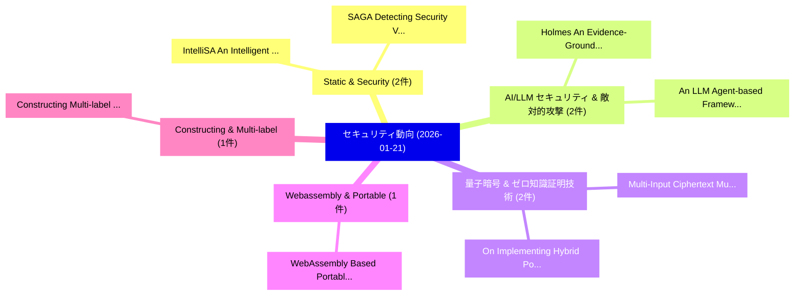

# 📅 02_daily: 日次エグゼクティブサマリー報告書 (2026-01-21)

**集計日時**: 2026-10-02 23:05:55 UTC  
**対象日付**: 2026-01-21  
**本日収集論文数**: 25 件  

---

## 💡 主要セキュリティ動向・脅威インサイト (Executive Insights)

本日の収集論文（計 25 件）において、以下の重点セキュリティ領域で活発な研究動向が確認されました：
- **Static & Security** (2 件): 注目論文として 「IntelliSA: An Intelligent Stat...」、「SAGA: Detecting Security Vulne...」 等が発表され、実務防御および攻撃検証の進展が見られます。
- **AI/LLM セキュリティ & 敵対的攻撃** (2 件): 注目論文として 「Holmes: An Evidence-Grounded L...」、「An LLM Agent-based Framework f...」 等が発表され、実務防御および攻撃検証の進展が見られます。
- **量子暗号 & ゼロ知識証明技術** (2 件): 注目論文として 「On Implementing Hybrid Post-Qu...」、「Multi-Input Ciphertext Multipl...」 等が発表され、実務防御および攻撃検証の進展が見られます。
- **Webassembly & Portable** (1 件): 注目論文として 「WebAssembly Based Portable and...」 等が発表され、実務防御および攻撃検証の進展が見られます。
- **Constructing & Multi-label** (1 件): 注目論文として 「Constructing Multi-label Hiera...」 等が発表され、実務防御および攻撃検証の進展が見られます。

### 🗺️ 技術・脅威トピックマインドマップ

---

## 📌 日次セキュリティ論文一覧 (日本語表形式)

| No | arXiv ID | 論文タイトル (日本語訳) | 重要キーワード | 構造化エグゼクティブ要約 (背景・提案・影響) | 脅威分類 | 詳細リンク |
|---|---|---|---|---|---|---|
| 1 | `2601.14555v1` | [WebAssembly Based Portable and Secure Sensor Interface for Internet of Things（セキュリティ分析論文）](../../okf/papers/2026-01-21/2601.14555.md) | `Secure Sensor Interface`, `Based Portable`, `Botong Ou` | 【提案】概要 (Overview & Key Finding) 本論文「WebAssembly Based Portable and Secure Sensor Interface ...。実証評価により経営層・セキュリティ管理者向け推奨アクション (E... | `executive-summary` | [arXiv](https://arxiv.org/abs/2601.14555v1) &#124; [OKF](../../okf/papers/2026-01-21/2601.14555.md) |
| 2 | `2601.14556v1` | [Constructing Multi-label Hierarchical Classification Models for MITRE ATT&CK Text Tagging（セキュリティ分析論文）](../../okf/papers/2026-01-21/2601.14556.md) | `Hierarchical Classification Models`, `Constructing Multi`, `Text Tagging` | 【提案】概要 (Overview & Key Finding) 本論文「Constructing Multi-label Hierarchical Classification Mo...。実証評価により経営層・セキュリティ管理者向け推奨アクション (E... | `executive-summary` | [arXiv](https://arxiv.org/abs/2601.14556v1) &#124; [OKF](../../okf/papers/2026-01-21/2601.14556.md) |
| 3 | `2601.14567v2` | [Agent Identity URI Scheme: Topology-Independent Naming and Capability-Based Discovery for Multi-Agent Systems（セキュリティ分析論文）](../../okf/papers/2026-01-21/2601.14567.md) | `Agent Identity`, `Independent Naming`, `Based Discovery` | 【提案】概要 (Overview & Key Finding) 本論文「Agent Identity URI Scheme: Topology-Independent Naming ...。実証評価により経営層・セキュリティ管理者向け推奨アクション (E... | `executive-summary` | [arXiv](https://arxiv.org/abs/2601.14567v2) &#124; [OKF](../../okf/papers/2026-01-21/2601.14567.md) |
| 4 | `2601.14582v2` | [Automatically Tightening Access Control Policies with Restricter（セキュリティ分析論文）](../../okf/papers/2026-01-21/2601.14582.md) | `Automatically Tightening Access Control Policies`, `Ka Lok Wu`, `Christa Jenkins` | 【提案】概要 (Overview & Key Finding) 本論文「Automatically Tightening アクセス制御 Policies with Restricte...。実証評価によりStoller, Omar Chowdhury -... | `cybersecurity` | [arXiv](https://arxiv.org/abs/2601.14582v2) &#124; [OKF](../../okf/papers/2026-01-21/2601.14582.md) |
| 5 | `2601.14595v1` | [IntelliSA: An Intelligent Static Analyzer for IaC Security Smell Detection Using Symbolic Rules and Neural Inference（セキュリティ分析論文）](../../okf/papers/2026-01-21/2601.14595.md) | `Security Smell Detection Using Symbolic Rules`, `Neural Inference`, `Qiyue Mei` | 【提案】概要 (Overview & Key Finding) 本論文「IntelliSA: An Intelligent Static Analyzer for IaC Secur...。実証評価により経営層・セキュリティ管理者向け推奨アクション (E... | `cs.AI` | [arXiv](https://arxiv.org/abs/2601.14595v1) &#124; [OKF](../../okf/papers/2026-01-21/2601.14595.md) |
| 6 | `2601.14597v1` | [Optimality of Staircase Mechanisms for Vector Queries under Differential Privacy（セキュリティ分析論文）](../../okf/papers/2026-01-21/2601.14597.md) | `Staircase Mechanisms`, `Vector Queries`, `Differential Privacy` | 【提案】概要 (Overview & Key Finding) 本論文「Optimality of Staircase Mechanisms for Vector Queries u...。実証評価により経営層・セキュリティ管理者向け推奨アクション (E... | `cs.AI` | [arXiv](https://arxiv.org/abs/2601.14597v1) &#124; [OKF](../../okf/papers/2026-01-21/2601.14597.md) |
| 7 | `2601.14601v1` | [Holmes: An Evidence-Grounded LLM Agent for Auditable DDoS Investigation in Cloud Networks（セキュリティ分析論文）](../../okf/papers/2026-01-21/2601.14601.md) | `Cloud Networks`, `Evidence-Grounded LLM`, `Haodong Chen` | 【提案】概要 (Overview & Key Finding) 本論文「Holmes: An Evidence-Grounded LLM Agent for Auditable DD...。実証評価により経営層・セキュリティ管理者向け推奨アクション (E... | `cs.NI` | [arXiv](https://arxiv.org/abs/2601.14601v1) &#124; [OKF](../../okf/papers/2026-01-21/2601.14601.md) |
| 8 | `2601.14606v1` | [An LLM Agent-based Framework for Whaling Countermeasures（セキュリティ分析論文）](../../okf/papers/2026-01-21/2601.14606.md) | `Whaling Countermeasures`, `Daisuke Miyamoto`, `Takuji Iimura` | 【提案】概要 (Overview & Key Finding) 本論文「An LLM Agent-based Framework for Whaling Countermeasure...。実証評価により経営層・セキュリティ管理者向け推奨アクション (E... | `cybersecurity` | [arXiv](https://arxiv.org/abs/2601.14606v1) &#124; [OKF](../../okf/papers/2026-01-21/2601.14606.md) |
| 9 | `2601.14614v3` | [Cybersecurity Superintelligence: from AI-guided humans to human-guided AIに向けて](../../okf/papers/2026-01-21/2601.14614.md) | `AI-guided humans`, `Towards Cybersecurity Superintelligence`, `Cybersecurity Superintelligence` | 【提案】概要 (Overview & Key Finding) 本論文「Cybersecurity Superintelligence: from AI-guided humans ...。実証評価により経営層・セキュリティ管理者向け推奨アクション (E... | `cybersecurity` | [arXiv](https://arxiv.org/abs/2601.14614v3) &#124; [OKF](../../okf/papers/2026-01-21/2601.14614.md) |
| 10 | `2601.14660v2` | [NeuroFilter: Activation-Based Guardrails for Privacy-Conscious LLMエージェント](../../okf/papers/2026-01-21/2601.14660.md) | `Based Guardrails`, `Activation-Based Guardrails`, `Privacy-Conscious LLM` | 【提案】概要 (Overview & Key Finding) 本論文「NeuroFilter: Activation-Based Guardrails for Privacy-Co...。実証評価により経営層・セキュリティ管理者向け推奨アクション (E... | `cs.AI` | [arXiv](https://arxiv.org/abs/2601.14660v2) &#124; [OKF](../../okf/papers/2026-01-21/2601.14660.md) |
| 11 | `2601.14687v1` | [Beyond Denial-of-Service: The Puppeteer's Attack for Fine-Grained Control in Ranking-Based 連合学習](../../okf/papers/2026-01-21/2601.14687.md) | `Beyond Denial`, `Grained Control`, `Fine-Grained Control` | 【提案】概要 (Overview & Key Finding) 本論文「Beyond Denial-of-Service: The Puppeteer's Attack for Fi...。実証評価により経営層・セキュリティ管理者向け推奨アクション (E... | `executive-summary` | [arXiv](https://arxiv.org/abs/2601.14687v1) &#124; [OKF](../../okf/papers/2026-01-21/2601.14687.md) |
| 12 | `2601.14778v1` | [STEAD: Robust Provably Secure Linguistic Steganography with Diffusion Language Model（セキュリティ分析論文）](../../okf/papers/2026-01-21/2601.14778.md) | `Robust Provably Secure Linguistic Steganography`, `Diffusion Language Model`, `Robust Provably Secure Linguis` | 【提案】概要 (Overview & Key Finding) 本論文「STEAD: Robust Provably Secure Linguistic Steganography ...。実証評価により経営層・セキュリティ管理者向け推奨アクション (E... | `cybersecurity` | [arXiv](https://arxiv.org/abs/2601.14778v1) &#124; [OKF](../../okf/papers/2026-01-21/2601.14778.md) |
| 13 | `2601.14926v1` | [On Implementing Hybrid Post-Quantum End-to-End Encryption（セキュリティ分析論文）](../../okf/papers/2026-01-21/2601.14926.md) | `Quantum End`, `End Encryption`, `Post-Quantum End` | 【提案】概要 (Overview & Key Finding) 本論文「On Implementing Hybrid Post-量子 End-to-End Encryption（セキ...。実証評価により経営層・セキュリティ管理者向け推奨アクション (E... | `cybersecurity` | [arXiv](https://arxiv.org/abs/2601.14926v1) &#124; [OKF](../../okf/papers/2026-01-21/2601.14926.md) |
| 14 | `2601.14982v1` | [Interoperable Architecture for Digital Identity Delegation for AI Agents with Blockchain Integration（セキュリティ分析論文）](../../okf/papers/2026-01-21/2601.14982.md) | `Digital Identity Delegation`, `Interoperable Architecture`, `Blockchain Integration` | 【提案】概要 (Overview & Key Finding) 本論文「Interoperable Architecture for Digital Identity Delegat...。実証評価により経営層・セキュリティ管理者向け推奨アクション (E... | `cs.AI` | [arXiv](https://arxiv.org/abs/2601.14982v1) &#124; [OKF](../../okf/papers/2026-01-21/2601.14982.md) |
| 15 | `2601.14996v1` | [On the Effectiveness of Mempool-based Transaction Auditing（セキュリティ分析論文）](../../okf/papers/2026-01-21/2601.14996.md) | `Transaction Auditing`, `Mempool-based Transaction`, `Jannik Albrecht` | 【提案】概要 (Overview & Key Finding) 本論文「On the Effectiveness of Mempool-based Transaction Audit...。実証評価により経営層・セキュリティ管理者向け推奨アクション (E... | `cybersecurity` | [arXiv](https://arxiv.org/abs/2601.14996v1) &#124; [OKF](../../okf/papers/2026-01-21/2601.14996.md) |
| 16 | `2601.15055v1` | [SpooFL: Spoofing 連合学習](../../okf/papers/2026-01-21/2601.15055.md) | `Spoofing Federated Learning`, `Isaac Baglin`, `Xiatian Zhu` | 【提案】概要 (Overview & Key Finding) 本論文「SpooFL: Spoofing 連合学習」（原題: SpooFL: Spoofing Federated L...。実証評価により経営層・セキュリティ管理者向け推奨アクション (E... | `cs.CV` | [arXiv](https://arxiv.org/abs/2601.15055v1) &#124; [OKF](../../okf/papers/2026-01-21/2601.15055.md) |
| 17 | `2601.15154v2` | [SAGA: Detecting Security Vulnerabilities Using Static Aspect Analysis（セキュリティ分析論文）](../../okf/papers/2026-01-21/2601.15154.md) | `Yoann Marquer`, `Domenico Bianculli`, `Raw Meta` | 【提案】概要 (Overview & Key Finding) 本論文「SAGA: Detecting Security Vulnerabilities Using Static A...。実証評価により経営層・セキュリティ管理者向け推奨アクション (E... | `executive-summary` | [arXiv](https://arxiv.org/abs/2601.15154v2) &#124; [OKF](../../okf/papers/2026-01-21/2601.15154.md) |
| 18 | `2601.15177v1` | [Dynamic Management of a Deep Learning-Based Anomaly Detection System for 5G Networks（セキュリティ分析論文）](../../okf/papers/2026-01-21/2601.15177.md) | `Based Anomaly Detection System`, `Dynamic Management`, `Deep Learning` | 【提案】概要 (Overview & Key Finding) 本論文「Dynamic Management of a Deep Learning-Based Anomaly Det...。実証評価により経営層・セキュリティ管理者向け推奨アクション (E... | `cs.AI` | [arXiv](https://arxiv.org/abs/2601.15177v1) &#124; [OKF](../../okf/papers/2026-01-21/2601.15177.md) |
| 19 | `2601.15269v1` | [Lightweight LLMs for Network Attack Detection in IoT Networks（セキュリティ分析論文）](../../okf/papers/2026-01-21/2601.15269.md) | `Network Attack Detection`, `Kushan Sudheera Kalupahana Liyanage`, `Piyumi Bhagya Sudasinghe` | 【提案】概要 (Overview & Key Finding) 本論文「Lightweight LLMs for Network Attack Detection in IoT Ne...。実証評価により経営層・セキュリティ管理者向け推奨アクション (E... | `cybersecurity` | [arXiv](https://arxiv.org/abs/2601.15269v1) &#124; [OKF](../../okf/papers/2026-01-21/2601.15269.md) |
| 20 | `2601.15393v1` | [The computational two-way quantum capacity（セキュリティ分析論文）](../../okf/papers/2026-01-21/2601.15393.md) | `two-way quantum`, `Johannes Jakob Meyer`, `Jacopo Rizzo` | 【提案】概要 (Overview & Key Finding) 本論文「The computational two-way 量子 capacity（セキュリティ分析論文）」（原題: ...。実証評価により経営層・セキュリティ管理者向け推奨アクション (E... | `cs.CC` | [arXiv](https://arxiv.org/abs/2601.15393v1) &#124; [OKF](../../okf/papers/2026-01-21/2601.15393.md) |
| 21 | `2601.15401v1` | [Multi-Input Ciphertext Multiplication for Homomorphic Encryption（セキュリティ分析論文）](../../okf/papers/2026-01-21/2601.15401.md) | `Input Ciphertext Multiplication`, `Homomorphic Encryption`, `Multi-Input Ciphertext` | 【提案】概要 (Overview & Key Finding) 本論文「Multi-Input Ciphertext Multiplication for 準同型暗号（セキュリティ分...。実証評価により経営層・セキュリティ管理者向け推奨アクション (E... | `cybersecurity` | [arXiv](https://arxiv.org/abs/2601.15401v1) &#124; [OKF](../../okf/papers/2026-01-21/2601.15401.md) |
| 22 | `2601.15474v2` | [BadImplant: Injection-based Multi-Targeted Graph Backdoor Attack（セキュリティ分析論文）](../../okf/papers/2026-01-21/2601.15474.md) | `Targeted Graph Backdoor Attack`, `Injection-based Multi`, `Md Nabi Newaz Khan` | 【提案】概要 (Overview & Key Finding) 本論文「BadImplant: Injection-based Multi-Targeted Graph Backdo...。実証評価により経営層・セキュリティ管理者向け推奨アクション (E... | `cs.AI` | [arXiv](https://arxiv.org/abs/2601.15474v2) &#124; [OKF](../../okf/papers/2026-01-21/2601.15474.md) |
| 23 | `2601.15515v1` | [DCeption: Real-world Wireless Man-in-the-Middle Attacks Against CCS EV Charging（セキュリティ分析論文）](../../okf/papers/2026-01-21/2601.15515.md) | `Wireless Man`, `Real-world Wireless`, `the-Middle Attacks` | 【提案】概要 (Overview & Key Finding) 本論文「DCeption: Real-world Wireless 中間者攻撃 Attacks Against CCS...。実証評価により経営層・セキュリティ管理者向け推奨アクション (E... | `cybersecurity` | [arXiv](https://arxiv.org/abs/2601.15515v1) &#124; [OKF](../../okf/papers/2026-01-21/2601.15515.md) |
| 24 | `2601.15528v1` | [LLM-as-a-Service for Small Businesses: An Industry Case Study of a Distributed Chatbot Deployment Platformのセキュリティ強化](../../okf/papers/2026-01-21/2601.15528.md) | `Small Businesses`, `Distributed Chatbot Deployment Platform`, `Distributed Chatbot Deployment` | 【提案】概要 (Overview & Key Finding) 本論文「LLM-as-a-Service for Small Businesses: An Industry Case...。実証評価により経営層・セキュリティ管理者向け推奨アクション (E... | `executive-summary` | [arXiv](https://arxiv.org/abs/2601.15528v1) &#124; [OKF](../../okf/papers/2026-01-21/2601.15528.md) |
| 25 | `2601.16234v1` | [Algorithmic Identity Based on Metaparameters: A Path to Reliability, Auditability, and Traceability（セキュリティ分析論文）](../../okf/papers/2026-01-21/2601.16234.md) | `Algorithmic Identity Based`, `Juliao Braga`, `Percival Henriques` | 【提案】概要 (Overview & Key Finding) 本論文「Algorithmic Identity Based on Metaparameters: A Path to...。実証評価により経営層・セキュリティ管理者向け推奨アクション (E... | `cybersecurity` | [arXiv](https://arxiv.org/abs/2601.16234v1) &#124; [OKF](../../okf/papers/2026-01-21/2601.16234.md) |

