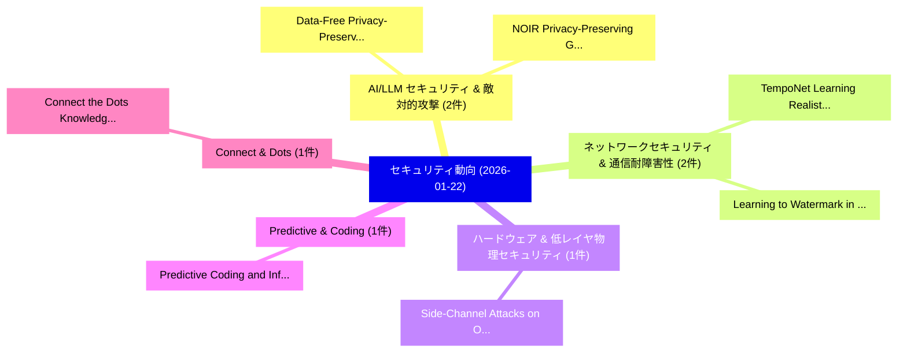

# 📅 02_daily: 日次エグゼクティブサマリー報告書 (2026-01-22)

**集計日時**: 2026-10-02 23:05:55 UTC  
**対象日付**: 2026-01-22  
**本日収集論文数**: 17 件  

---

## 💡 主要セキュリティ動向・脅威インサイト (Executive Insights)

本日の収集論文（計 17 件）において、以下の重点セキュリティ領域で活発な研究動向が確認されました：
- **AI/LLM セキュリティ & 敵対的攻撃** (2 件): 注目論文として 「Data-Free Privacy-Preserving f...」、「NOIR: Privacy-Preserving Gener...」 等が発表され、実務防御および攻撃検証の進展が見られます。
- **ネットワークセキュリティ & 通信耐障害性** (2 件): 注目論文として 「TempoNet: Learning Realistic C...」、「Learning to Watermark in the L...」 等が発表され、実務防御および攻撃検証の進展が見られます。
- **ハードウェア & 低レイヤ物理セキュリティ** (1 件): 注目論文として 「Side-Channel Attacks on Open v...」 等が発表され、実務防御および攻撃検証の進展が見られます。
- **Predictive & Coding** (1 件): 注目論文として 「Predictive Coding and Informat...」 等が発表され、実務防御および攻撃検証の進展が見られます。
- **Connect & Dots** (1 件): 注目論文として 「Connect the Dots: Knowledge Gr...」 等が発表され、実務防御および攻撃検証の進展が見られます。

### 🗺️ 技術・脅威トピックマインドマップ

---

## 📌 日次セキュリティ論文一覧 (日本語表形式)

| No | arXiv ID | 論文タイトル (日本語訳) | 重要キーワード | 構造化エグゼクティブ要約 (背景・提案・影響) | 脅威分類 | 詳細リンク |
|---|---|---|---|---|---|---|
| 1 | `2601.15595v1` | [Data-Free Privacy-Preserving for LLMs via Model Inversion and Selective Unlearning（セキュリティ分析論文）](../../okf/papers/2026-01-22/2601.15595.md) | `Free Privacy`, `Model Inversion`, `Data-Free Privacy` | 【提案】概要 (Overview & Key Finding) 本論文「Data-Free Privacy-Preserving for LLMs via モデル反転攻撃 and S...。実証評価により経営層・セキュリティ管理者向け推奨アクション (E... | `cs.AI` | [arXiv](https://arxiv.org/abs/2601.15595v1) &#124; [OKF](../../okf/papers/2026-01-22/2601.15595.md) |
| 2 | `2601.15632v1` | [Side-Channel Attacks on Open vSwitch（セキュリティ分析論文）](../../okf/papers/2026-01-22/2601.15632.md) | `Channel Attacks`, `Side-Channel Attacks`, `Daewoo Kim` | 【提案】概要 (Overview & Key Finding) 本論文「サイドチャネル攻撃 Attacks on Open vSwitch（セキュリティ分析論文）」（原題: サイドチ...。実証評価により経営層・セキュリティ管理者向け推奨アクション (E... | `cybersecurity` | [arXiv](https://arxiv.org/abs/2601.15632v1) &#124; [OKF](../../okf/papers/2026-01-22/2601.15632.md) |
| 3 | `2601.15652v1` | [Predictive Coding and Information Bottleneck for Hallucination Detection in 大規模言語モデル](../../okf/papers/2026-01-22/2601.15652.md) | `Predictive Coding`, `Information Bottleneck`, `Hallucination Detection` | 【提案】概要 (Overview & Key Finding) 本論文「Predictive Coding and Information Bottleneck for Halluc...。実証評価により経営層・セキュリティ管理者向け推奨アクション (E... | `cs.ET` | [arXiv](https://arxiv.org/abs/2601.15652v1) &#124; [OKF](../../okf/papers/2026-01-22/2601.15652.md) |
| 4 | `2601.15663v1` | [TempoNet: Learning Realistic Communication and Timing Patterns for Network Traffic Simulation（セキュリティ分析論文）](../../okf/papers/2026-01-22/2601.15663.md) | `Learning Realistic Communication`, `Network Traffic Simulation`, `Timing Patterns` | 【提案】概要 (Overview & Key Finding) 本論文「TempoNet: Learning Realistic Communication and Timing P...。実証評価により経営層・セキュリティ管理者向け推奨アクション (E... | `cs.AI` | [arXiv](https://arxiv.org/abs/2601.15663v1) &#124; [OKF](../../okf/papers/2026-01-22/2601.15663.md) |
| 5 | `2601.15678v2` | [Connect the Dots: Knowledge Graph-Guided Crawler Attack on Retrieval-Augmented Generation Systems（セキュリティ分析論文）](../../okf/papers/2026-01-22/2601.15678.md) | `Guided Crawler Attack`, `Augmented Generation Systems`, `Knowledge Graph` | 【提案】概要 (Overview & Key Finding) 本論文「Connect the Dots: Knowledge Graph-Guided Crawler Attack...。実証評価により経営層・セキュリティ管理者向け推奨アクション (E... | `cs.AI` | [arXiv](https://arxiv.org/abs/2601.15678v2) &#124; [OKF](../../okf/papers/2026-01-22/2601.15678.md) |
| 6 | `2601.15697v1` | [Balancing Security and Privacy: The Pivotal Role of AI in Modern Healthcare Systems（セキュリティ分析論文）](../../okf/papers/2026-01-22/2601.15697.md) | `Modern Healthcare Systems`, `Balancing Security`, `Raw Meta` | 【提案】概要 (Overview & Key Finding) 本論文「Balancing Security and Privacy: The Pivotal Role of AI ...。実証評価により経営層・セキュリティ管理者向け推奨アクション (E... | `executive-summary` | [arXiv](https://arxiv.org/abs/2601.15697v1) &#124; [OKF](../../okf/papers/2026-01-22/2601.15697.md) |
| 7 | `2601.15716v1` | [zkFinGPT: Zero-Knowledge Proofs for Financial Generative Pre-trained Transformers（セキュリティ分析論文）](../../okf/papers/2026-01-22/2601.15716.md) | `Financial Generative Pre`, `Knowledge Proofs`, `Zero-Knowledge Proofs` | 【提案】概要 (Overview & Key Finding) 本論文「zkFinGPT: Zero-Knowledge Proofs for Financial Generativ...。実証評価により経営層・セキュリティ管理者向け推奨アクション (E... | `cs.CE` | [arXiv](https://arxiv.org/abs/2601.15716v1) &#124; [OKF](../../okf/papers/2026-01-22/2601.15716.md) |
| 8 | `2601.15754v1` | [CAFE-GB: Scalable and Stable Feature Selection for マルウェア検出 via Chunk-wise Aggregated Gradient Boosting](../../okf/papers/2026-01-22/2601.15754.md) | `Stable Feature Selection`, `Aggregated Gradient Boosting`, `Chunk-wise Aggregated` | 【提案】概要 (Overview & Key Finding) 本論文「CAFE-GB: Scalable and Stable Feature Selection for マルウェ...。実証評価により経営層・セキュリティ管理者向け推奨アクション (E... | `cs.AI` | [arXiv](https://arxiv.org/abs/2601.15754v1) &#124; [OKF](../../okf/papers/2026-01-22/2601.15754.md) |
| 9 | `2601.15774v1` | [FirmReBugger: A Benchmark Framework for Monolithic Firmware Fuzzers（セキュリティ分析論文）](../../okf/papers/2026-01-22/2601.15774.md) | `Monolithic Firmware Fuzzers`, `Mathew Duong`, `Michael Chesser` | 【提案】概要 (Overview & Key Finding) 本論文「FirmReBugger: A Benchmark Framework for Monolithic Firm...。実証評価により経営層・セキュリティ管理者向け推奨アクション (E... | `executive-summary` | [arXiv](https://arxiv.org/abs/2601.15774v1) &#124; [OKF](../../okf/papers/2026-01-22/2601.15774.md) |
| 10 | `2601.15801v1` | [Attributing and Exploiting Safety Vectors through Global Optimization in 大規模言語モデル](../../okf/papers/2026-01-22/2601.15801.md) | `Exploiting Safety Vectors`, `Global Optimization`, `Large Language Models` | 【提案】概要 (Overview & Key Finding) 本論文「Attributing and Exploiting Safety Vectors through Globa...。実証評価により経営層・セキュリティ管理者向け推奨アクション (E... | `executive-summary` | [arXiv](https://arxiv.org/abs/2601.15801v1) &#124; [OKF](../../okf/papers/2026-01-22/2601.15801.md) |
| 11 | `2601.15824v2` | [Introducing the Generative Application Firewall (GAF)（セキュリティ分析論文）](../../okf/papers/2026-01-22/2601.15824.md) | `Generative Application Firewall`, `Joan Vendrell Farreny`, `Miquel Cornudella Gaya` | 【提案】概要 (Overview & Key Finding) 本論文「Introducing the Generative Application Firewall (GAF)（セ...。実証評価により経営層・セキュリティ管理者向け推奨アクション (E... | `cs.AI` | [arXiv](https://arxiv.org/abs/2601.15824v2) &#124; [OKF](../../okf/papers/2026-01-22/2601.15824.md) |
| 12 | `2601.16140v1` | [Learning to Watermark in the Latent Space of Generative Models（セキュリティ分析論文）](../../okf/papers/2026-01-22/2601.16140.md) | `Latent Space`, `Generative Models`, `Alvise Rebuffi` | 【提案】概要 (Overview & Key Finding) 本論文「Learning to Watermark in the Latent Space of Generative...。実証評価により経営層・セキュリティ管理者向け推奨アクション (E... | `cs.AI` | [arXiv](https://arxiv.org/abs/2601.16140v1) &#124; [OKF](../../okf/papers/2026-01-22/2601.16140.md) |
| 13 | `2601.16160v2` | [CONTEX-T: Contextual Exploitation of Encrypted Traffic for Device Fingerprinting via Transformer Time-Frequency Analysis（セキュリティ分析論文）](../../okf/papers/2026-01-22/2601.16160.md) | `Contextual Exploitation`, `Encrypted Traffic`, `Device Fingerprinting` | 【提案】概要 (Overview & Key Finding) 本論文「CONTEX-T: Contextual Exploitation of Encrypted Traffic ...。実証評価により経営層・セキュリティ管理者向け推奨アクション (E... | `cybersecurity` | [arXiv](https://arxiv.org/abs/2601.16160v2) &#124; [OKF](../../okf/papers/2026-01-22/2601.16160.md) |
| 14 | `2601.16199v3` | [PAL*M: Property Attestation for Large Generative Models（セキュリティ分析論文）](../../okf/papers/2026-01-22/2601.16199.md) | `Large Generative Models`, `Property Attestation`, `Adam Ilyas Caulfield` | 【提案】概要 (Overview & Key Finding) 本論文「PAL*M: Property Attestation for Large Generative Models...。実証評価によりAsokan - **公開日時**:。 | `cybersecurity` | [arXiv](https://arxiv.org/abs/2601.16199v3) &#124; [OKF](../../okf/papers/2026-01-22/2601.16199.md) |
| 15 | `2601.16241v2` | [Adaptive Attribute-Decoupled Encryption for Trusted Respiratory Monitoring in Resource-Limited Consumer Healthcare（セキュリティ分析論文）](../../okf/papers/2026-01-22/2601.16241.md) | `Trusted Respiratory Monitoring`, `Limited Consumer Healthcare`, `Adaptive Attribute` | 【提案】概要 (Overview & Key Finding) 本論文「Adaptive Attribute-Decoupled Encryption for Trusted Res...。実証評価により経営層・セキュリティ管理者向け推奨アクション (E... | `cs.AI` | [arXiv](https://arxiv.org/abs/2601.16241v2) &#124; [OKF](../../okf/papers/2026-01-22/2601.16241.md) |
| 16 | `2601.16298v1` | [FC-GUARD: Enabling Anonymous yet Compliant Fiat-to-Cryptocurrency Exchanges（セキュリティ分析論文）](../../okf/papers/2026-01-22/2601.16298.md) | `Enabling Anonymous`, `Compliant Fiat`, `Cryptocurrency Exchanges` | 【提案】概要 (Overview & Key Finding) 本論文「FC-GUARD: Enabling Anonymous yet Compliant Fiat-to-Cryp...。実証評価により経営層・セキュリティ管理者向け推奨アクション (E... | `cybersecurity` | [arXiv](https://arxiv.org/abs/2601.16298v1) &#124; [OKF](../../okf/papers/2026-01-22/2601.16298.md) |
| 17 | `2601.16354v1` | [NOIR: Privacy-Preserving Generation of Code with Open-Source LLMs（セキュリティ分析論文）](../../okf/papers/2026-01-22/2601.16354.md) | `Preserving Generation`, `Privacy-Preserving Generation`, `Open-Source LLMs` | 【提案】概要 (Overview & Key Finding) 本論文「NOIR: Privacy-Preserving Generation of Code with Open-S...。実証評価により経営層・セキュリティ管理者向け推奨アクション (E... | `cs.AI` | [arXiv](https://arxiv.org/abs/2601.16354v1) &#124; [OKF](../../okf/papers/2026-01-22/2601.16354.md) |

