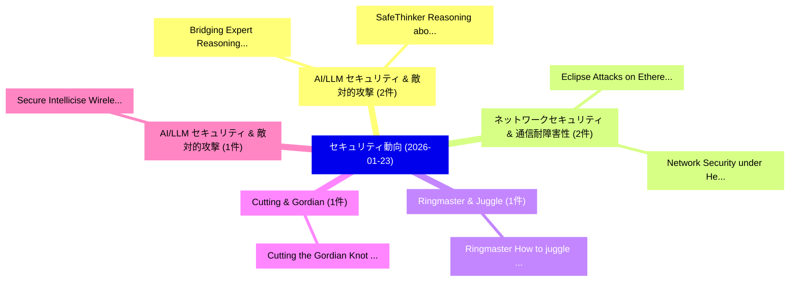

# 📅 02_daily: 日次エグゼクティブサマリー報告書 (2026-01-23)

**集計日時**: 2026-10-02 23:05:55 UTC  
**対象日付**: 2026-01-23  
**本日収集論文数**: 19 件  

---

## 💡 主要セキュリティ動向・脅威インサイト (Executive Insights)

本日の収集論文（計 19 件）において、以下の重点セキュリティ領域で活発な研究動向が確認されました：
- **AI/LLM セキュリティ & 敵対的攻撃** (2 件): 注目論文として 「Bridging Expert Reasoning and ...」、「SafeThinker: Reasoning about R...」 等が発表され、実務防御および攻撃検証の進展が見られます。
- **ネットワークセキュリティ & 通信耐障害性** (2 件): 注目論文として 「Eclipse Attacks on Ethereum's ...」、「Network Security under Heterog...」 等が発表され、実務防御および攻撃検証の進展が見られます。
- **Ringmaster & Juggle** (1 件): 注目論文として 「Ringmaster: How to juggle high...」 等が発表され、実務防御および攻撃検証の進展が見られます。
- **Cutting & Gordian** (1 件): 注目論文として 「Cutting the Gordian Knot: Dete...」 等が発表され、実務防御および攻撃検証の進展が見られます。
- **AI/LLM セキュリティ & 敵対的攻撃** (1 件): 注目論文として 「Secure Intellicise Wireless Ne...」 等が発表され、実務防御および攻撃検証の進展が見られます。

### 🗺️ 技術・脅威トピックマインドマップ

---

## 📌 日次セキュリティ論文一覧 (日本語表形式)

| No | arXiv ID | 論文タイトル (日本語訳) | 重要キーワード | 構造化エグゼクティブ要約 (背景・提案・影響) | 脅威分類 | 詳細リンク |
|---|---|---|---|---|---|---|
| 1 | `2601.16448v2` | [Ringmaster: How to juggle high-throughput host OS system calls from TrustZone TEEs（セキュリティ分析論文）](../../okf/papers/2026-01-23/2601.16448.md) | `high-throughput host`, `Richard Habeeb`, `Ki Yoon` | 【提案】概要 (Overview & Key Finding) 本論文「Ringmaster: How to juggle high-throughput host OS syste...。実証評価により経営層・セキュリティ管理者向け推奨アクション (E... | `executive-summary` | [arXiv](https://arxiv.org/abs/2601.16448v2) &#124; [OKF](../../okf/papers/2026-01-23/2601.16448.md) |
| 2 | `2601.16458v1` | [Bridging Expert Reasoning and LLM Detection: A Knowledge-Driven Framework for Malicious Packages（セキュリティ分析論文）](../../okf/papers/2026-01-23/2601.16458.md) | `Bridging Expert Reasoning`, `Malicious Packages`, `Wenbo Guo` | 【提案】概要 (Overview & Key Finding) 本論文「Bridging Expert Reasoning and LLM Detection: A Knowledg...。実証評価により経営層・セキュリティ管理者向け推奨アクション (E... | `executive-summary` | [arXiv](https://arxiv.org/abs/2601.16458v1) &#124; [OKF](../../okf/papers/2026-01-23/2601.16458.md) |
| 3 | `2601.16463v2` | [Cutting the Gordian Knot: Detecting Malicious PyPI Packages via a Knowledge-Mining Framework（セキュリティ分析論文）](../../okf/papers/2026-01-23/2601.16463.md) | `Gordian Knot`, `Detecting Malicious`, `Wenbo Guo` | 【提案】概要 (Overview & Key Finding) 本論文「Cutting the Gordian Knot: Detecting Malicious PyPI Pack...。実証評価により経営層・セキュリティ管理者向け推奨アクション (E... | `executive-summary` | [arXiv](https://arxiv.org/abs/2601.16463v2) &#124; [OKF](../../okf/papers/2026-01-23/2601.16463.md) |
| 4 | `2601.16472v2` | [Secure Intellicise Wireless Network: Agentic AI for Coverless Semantic Steganography Communication（セキュリティ分析論文）](../../okf/papers/2026-01-23/2601.16472.md) | `Secure Intellicise Wireless Network`, `Coverless Semantic Steganography Communication`, `Rui Meng` | 【提案】概要 (Overview & Key Finding) 本論文「Secure Intellicise Wireless Network: Agentic AI for Cov...。実証評価により経営層・セキュリティ管理者向け推奨アクション (E... | `executive-summary` | [arXiv](https://arxiv.org/abs/2601.16472v2) &#124; [OKF](../../okf/papers/2026-01-23/2601.16472.md) |
| 5 | `2601.16473v1` | [DeMark: A Query-Free Black-Box Attack on Deepfake Watermarking Defenses（セキュリティ分析論文）](../../okf/papers/2026-01-23/2601.16473.md) | `Deepfake Watermarking Defenses`, `Free Black`, `Box Attack` | 【提案】概要 (Overview & Key Finding) 本論文「DeMark: A Query-Free Black-Box Attack on Deepfake Water...。実証評価により経営層・セキュリティ管理者向け推奨アクション (E... | `cs.AI` | [arXiv](https://arxiv.org/abs/2601.16473v1) &#124; [OKF](../../okf/papers/2026-01-23/2601.16473.md) |
| 6 | `2601.16500v1` | [A High Performance and Efficient Post-Quantum Crypto-Processor for FrodoKEM（セキュリティ分析論文）](../../okf/papers/2026-01-23/2601.16500.md) | `High Performance`, `Efficient Post`, `Quantum Crypto` | 【提案】概要 (Overview & Key Finding) 本論文「A High Performance and Efficient Post-量子 Crypto-Process...。実証評価により経営層・セキュリティ管理者向け推奨アクション (E... | `executive-summary` | [arXiv](https://arxiv.org/abs/2601.16500v1) &#124; [OKF](../../okf/papers/2026-01-23/2601.16500.md) |
| 7 | `2601.16506v1` | [SafeThinker: Reasoning about Risk to Deepen Safety Beyond Shallow Alignment（セキュリティ分析論文）](../../okf/papers/2026-01-23/2601.16506.md) | `Deepen Safety Beyond Shallow Alignment`, `Xianya Fang`, `Xianying Luo` | 【提案】概要 (Overview & Key Finding) 本論文「SafeThinker: Reasoning about Risk to Deepen Safety Beyo...。実証評価により経営層・セキュリティ管理者向け推奨アクション (E... | `cs.AI` | [arXiv](https://arxiv.org/abs/2601.16506v1) &#124; [OKF](../../okf/papers/2026-01-23/2601.16506.md) |
| 8 | `2601.16560v2` | [Eclipse Attacks on Ethereum's Peer-to-Peer Network（セキュリティ分析論文）](../../okf/papers/2026-01-23/2601.16560.md) | `Eclipse Attacks`, `Peer Network`, `Ruisheng Shi` | 【提案】概要 (Overview & Key Finding) 本論文「Eclipse Attacks on Ethereum's Peer-to-Peer Network（セキュリ...。実証評価により経営層・セキュリティ管理者向け推奨アクション (E... | `cybersecurity` | [arXiv](https://arxiv.org/abs/2601.16560v2) &#124; [OKF](../../okf/papers/2026-01-23/2601.16560.md) |
| 9 | `2601.16589v2` | [Emerging Threats and Countermeasures in Neuromorphic Systems: A Survey（セキュリティ分析論文）](../../okf/papers/2026-01-23/2601.16589.md) | `Emerging Threats`, `Neuromorphic Systems`, `Nikolaos Athanasios Anagnostopoulos` | 【提案】概要 (Overview & Key Finding) 本論文「Emerging Threats and Countermeasures in Neuromorphic Sy...。実証評価により経営層・セキュリティ管理者向け推奨アクション (E... | `cs.ET` | [arXiv](https://arxiv.org/abs/2601.16589v2) &#124; [OKF](../../okf/papers/2026-01-23/2601.16589.md) |
| 10 | `2601.16681v1` | [From Transactions to Exploits: Automated PoC Synthesis for Real-World DeFi Attacks（セキュリティ分析論文）](../../okf/papers/2026-01-23/2601.16681.md) | `Real-World DeFi`, `Xing Su`, `Hao Wu` | 【提案】概要 (Overview & Key Finding) 本論文「From Transactions to Exploits: Automated PoC Synthesis ...。実証評価により経営層・セキュリティ管理者向け推奨アクション (E... | `executive-summary` | [arXiv](https://arxiv.org/abs/2601.16681v1) &#124; [OKF](../../okf/papers/2026-01-23/2601.16681.md) |
| 11 | `2601.16751v1` | ["What I Sign Is Not What I See": Explainable and Trustworthy Cryptocurrency Wallet Signaturesに向けて](../../okf/papers/2026-01-23/2601.16751.md) | `Trustworthy Cryptocurrency Wallet`, `Trustworthy Cryptocurrency Wallet Signatures`, `Towards Explainable` | 【提案】背景とセキュリティ上の課題 (Background & Problem) 本研究はサイバー脅威環境におけるセキュリティ構造・脆弱性の検証を目的としています。(主要検出項目: ...。実証評価により経営層・セキュリティ管理者向け推奨アクション (E... | `executive-summary` | [arXiv](https://arxiv.org/abs/2601.16751v1) &#124; [OKF](../../okf/papers/2026-01-23/2601.16751.md) |
| 12 | `2601.16795v2` | [Building a Robust Risk-Based Access Control System to Combat Ransomware's Capability to Encrypt（セキュリティ分析論文）](../../okf/papers/2026-01-23/2601.16795.md) | `Based Access Control System`, `Robust Risk`, `Combat Ransomware` | 【提案】概要 (Overview & Key Finding) 本論文「Building a Robust Risk-Based アクセス制御 System to Combat ラン...。実証評価により経営層・セキュリティ管理者向け推奨アクション (E... | `executive-summary` | [arXiv](https://arxiv.org/abs/2601.16795v2) &#124; [OKF](../../okf/papers/2026-01-23/2601.16795.md) |
| 13 | `2601.16805v1` | [Network Security under Heterogeneous Cyber-Risk Profiles and Contagion（セキュリティ分析論文）](../../okf/papers/2026-01-23/2601.16805.md) | `Network Security`, `Heterogeneous Cyber`, `Risk Profiles` | 【提案】概要 (Overview & Key Finding) 本論文「Network Security under Heterogeneous Cyber-Risk Profile...。実証評価により経営層・セキュリティ管理者向け推奨アクション (E... | `q-fin.RM` | [arXiv](https://arxiv.org/abs/2601.16805v1) &#124; [OKF](../../okf/papers/2026-01-23/2601.16805.md) |
| 14 | `2601.17130v2` | [Impact of Graph Structure on Membership-Inference Risk for Graph Neural Networks（セキュリティ分析論文）](../../okf/papers/2026-01-23/2601.17130.md) | `Graph Neural Networks`, `Graph Structure`, `Inference Risk` | 【提案】概要 (Overview & Key Finding) 本論文「Impact of Graph Structure on Membership-Inference Risk ...。実証評価により経営層・セキュリティ管理者向け推奨アクション (E... | `executive-summary` | [arXiv](https://arxiv.org/abs/2601.17130v2) &#124; [OKF](../../okf/papers/2026-01-23/2601.17130.md) |
| 15 | `2601.17133v1` | [Learning to Collaborate: An Orchestrated-Decentralized Framework for Peer-to-Peer LLM Federation（セキュリティ分析論文）](../../okf/papers/2026-01-23/2601.17133.md) | `Inderjeet Singh`, `Eleonore Vissol`, `Andikan Otung` | 【提案】概要 (Overview & Key Finding) 本論文「Learning to Collaborate: An Orchestrated-Decentralized ...。実証評価により経営層・セキュリティ管理者向け推奨アクション (E... | `cs.AI` | [arXiv](https://arxiv.org/abs/2601.17133v1) &#124; [OKF](../../okf/papers/2026-01-23/2601.17133.md) |
| 16 | `2601.17142v2` | [Logarithmic Density of Rank $\geq 1$ and Rank $\geq 2$ Genus-2 Jacobians and Applications to Hyperelliptic Curve Cryptography（セキュリティ分析論文）](../../okf/papers/2026-01-23/2601.17142.md) | `Hyperelliptic Curve Cryptography`, `Logarithmic Density`, `Genus-2 Jacobians` | 【提案】概要 (Overview & Key Finding) 本論文「Logarithmic Density of Rank $\geq 1$ and Rank $\geq 2$ ...。実証評価により経営層・セキュリティ管理者向け推奨アクション (E... | `executive-summary` | [arXiv](https://arxiv.org/abs/2601.17142v2) &#124; [OKF](../../okf/papers/2026-01-23/2601.17142.md) |
| 17 | `2601.17178v3` | [TrojanGYM: A Detector-in-the-Loop LLM for Adaptive RTL Hardware Trojan Insertion（セキュリティ分析論文）](../../okf/papers/2026-01-23/2601.17178.md) | `Hardware Trojan Insertion`, `the-Loop LLM`, `Saideep Sreekumar` | 【提案】概要 (Overview & Key Finding) 本論文「TrojanGYM: A Detector-in-the-Loop LLM for Adaptive RTL ...。実証評価により経営層・セキュリティ管理者向け推奨アクション (E... | `AI/ML Security` | [arXiv](https://arxiv.org/abs/2601.17178v3) &#124; [OKF](../../okf/papers/2026-01-23/2601.17178.md) |
| 18 | `2601.17225v1` | [Toward Risk Thresholds for AI-Enabled Cyber Threats: Enhancing Decision-Making Under Uncertainty with Bayesian Networks（セキュリティ分析論文）](../../okf/papers/2026-01-23/2601.17225.md) | `Toward Risk Thresholds`, `Enabled Cyber Threats`, `Enhancing Decision` | 【提案】概要 (Overview & Key Finding) 本論文「Toward Risk Thresholds for AI-Enabled Cyber Threats: En...。実証評価により経営層・セキュリティ管理者向け推奨アクション (E... | `cybersecurity` | [arXiv](https://arxiv.org/abs/2601.17225v1) &#124; [OKF](../../okf/papers/2026-01-23/2601.17225.md) |
| 19 | `2602.00093v1` | [Counterfactual Invariant Envelopes for Financial UX: Safety-Lattice Feature-Flag Governance in Crypto-Enabled Streaming（セキュリティ分析論文）](../../okf/papers/2026-01-23/2602.00093.md) | `Counterfactual Invariant Envelopes`, `Lattice Feature`, `Flag Governance` | 【提案】概要 (Overview & Key Finding) 本論文「Counterfactual Invariant Envelopes for Financial UX: Sa...。実証評価により経営層・セキュリティ管理者向け推奨アクション (E... | `executive-summary` | [arXiv](https://arxiv.org/abs/2602.00093v1) &#124; [OKF](../../okf/papers/2026-01-23/2602.00093.md) |

