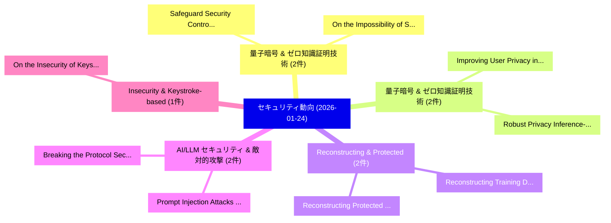

# 📅 02_daily: 日次エグゼクティブサマリー報告書 (2026-01-24)

**集計日時**: 2026-10-02 23:05:55 UTC  
**対象日付**: 2026-01-24  
**本日収集論文数**: 18 件  

---

## 💡 主要セキュリティ動向・脅威インサイト (Executive Insights)

本日の収集論文（計 18 件）において、以下の重点セキュリティ領域で活発な研究動向が確認されました：
- **量子暗号 & ゼロ知識証明技術** (2 件): 注目論文として 「Safeguard: Security Controls a...」、「On the Impossibility of Simula...」 等が発表され、実務防御および攻撃検証の進展が見られます。
- **量子暗号 & ゼロ知識証明技術** (2 件): 注目論文として 「Robust Privacy: Inference-Stag...」、「Improving User Privacy in Pers...」 等が発表され、実務防御および攻撃検証の進展が見られます。
- **Reconstructing & Protected** (2 件): 注目論文として 「Reconstructing Training Data f...」、「Reconstructing Protected Biome...」 等が発表され、実務防御および攻撃検証の進展が見られます。
- **AI/LLM セキュリティ & 敵対的攻撃** (2 件): 注目論文として 「Prompt Injection Attacks on Ag...」、「Breaking the Protocol: Securit...」 等が発表され、実務防御および攻撃検証の進展が見られます。
- **Insecurity & Keystroke-based** (1 件): 注目論文として 「On the Insecurity of Keystroke...」 等が発表され、実務防御および攻撃検証の進展が見られます。

### 🗺️ 技術・脅威トピックマインドマップ

---

## 📌 日次セキュリティ論文一覧 (日本語表形式)

| No | arXiv ID | 論文タイトル (日本語訳) | 重要キーワード | 構造化エグゼクティブ要約 (背景・提案・影響) | 脅威分類 | 詳細リンク |
|---|---|---|---|---|---|---|
| 1 | `2601.17280v1` | [On the Insecurity of Keystroke-Based AI Authorship Detection: Timing-Forgery Attacks Against Motor-Signal Verification（セキュリティ分析論文）](../../okf/papers/2026-01-24/2601.17280.md) | `Keystroke-Based AI`, `Authorship Detection`, `Signal Verification` | 【提案】概要 (Overview & Key Finding) 本論文「On the Insecurity of Keystroke-Based AI Authorship Dete...。実証評価により経営層・セキュリティ管理者向け推奨アクション (E... | `cs.AI` | [arXiv](https://arxiv.org/abs/2601.17280v1) &#124; [OKF](../../okf/papers/2026-01-24/2601.17280.md) |
| 2 | `2601.17355v1` | [Safeguard: Security Controls at the Software Defined Network Layer（セキュリティ分析論文）](../../okf/papers/2026-01-24/2601.17355.md) | `Software Defined Network Layer`, `Security Controls`, `Yi Lyu` | 【提案】概要 (Overview & Key Finding) 本論文「Safeguard: Security Controls at the Software Defined Ne...。実証評価により経営層・セキュリティ管理者向け推奨アクション (E... | `cs.NI` | [arXiv](https://arxiv.org/abs/2601.17355v1) &#124; [OKF](../../okf/papers/2026-01-24/2601.17355.md) |
| 3 | `2601.17356v2` | [Obfuscation as an Effective Signal for Prioritizing Cross-Chain Smart Contract Audits: Large-Scale Measurement and Risk Profiling（セキュリティ分析論文）](../../okf/papers/2026-01-24/2601.17356.md) | `Chain Smart Contract Audits`, `Effective Signal`, `Prioritizing Cross` | 【提案】概要 (Overview & Key Finding) 本論文「Obfuscation as an Effective Signal for Prioritizing Cro...。実証評価により経営層・セキュリティ管理者向け推奨アクション (E... | `executive-summary` | [arXiv](https://arxiv.org/abs/2601.17356v2) &#124; [OKF](../../okf/papers/2026-01-24/2601.17356.md) |
| 4 | `2601.17360v3` | [Robust Privacy: Inference-Stage Privacy through Certified Robustness（セキュリティ分析論文）](../../okf/papers/2026-01-24/2601.17360.md) | `Robust Privacy`, `Stage Privacy`, `Inference-Stage Privacy` | 【提案】概要 (Overview & Key Finding) 本論文「Robust Privacy: Inference-Stage Privacy through Certifi...。実証評価により経営層・セキュリティ管理者向け推奨アクション (E... | `Cryptography` | [arXiv](https://arxiv.org/abs/2601.17360v3) &#124; [OKF](../../okf/papers/2026-01-24/2601.17360.md) |
| 5 | `2601.17378v1` | [Res-MIA: A Training-Free Resolution-Based Membership Inference Attack on 連合学習 Models](../../okf/papers/2026-01-24/2601.17378.md) | `Based Membership Inference Attack`, `Free Resolution`, `Training-Free Resolution` | 【提案】概要 (Overview & Key Finding) 本論文「Res-MIA: A Training-Free Resolution-Based Membership In...。実証評価により経営層・セキュリティ管理者向け推奨アクション (E... | `cs.AI` | [arXiv](https://arxiv.org/abs/2601.17378v1) &#124; [OKF](../../okf/papers/2026-01-24/2601.17378.md) |
| 6 | `2601.17379v1` | [Prompt and Circumstances: Evaluating the Efficacy of Human Prompt Inference in AI-Generated Art（セキュリティ分析論文）](../../okf/papers/2026-01-24/2601.17379.md) | `Human Prompt Inference`, `Generated Art`, `AI-Generated Art` | 【提案】概要 (Overview & Key Finding) 本論文「Prompt and Circumstances: Evaluating the Efficacy of Hu...。実証評価により経営層・セキュリティ管理者向け推奨アクション (E... | `cs.AI` | [arXiv](https://arxiv.org/abs/2601.17379v1) &#124; [OKF](../../okf/papers/2026-01-24/2601.17379.md) |
| 7 | `2601.17390v2` | [YASA: Scalable Multi-Language Taint Analysis on the Unified AST at Ant Group（セキュリティ分析論文）](../../okf/papers/2026-01-24/2601.17390.md) | `Scalable Multi`, `Ant Group`, `Multi-Language Taint` | 【提案】概要 (Overview & Key Finding) 本論文「YASA: Scalable Multi-Language Taint Analysis on the Uni...。実証評価により経営層・セキュリティ管理者向け推奨アクション (E... | `cs.PL` | [arXiv](https://arxiv.org/abs/2601.17390v2) &#124; [OKF](../../okf/papers/2026-01-24/2601.17390.md) |
| 8 | `2601.17471v2` | [PatchIsland: Orchestration of LLMエージェント for Continuous Vulnerability Repair](../../okf/papers/2026-01-24/2601.17471.md) | `Continuous Vulnerability Repair`, `Min Woo Baek`, `Wonyoung Kim` | 【提案】概要 (Overview & Key Finding) 本論文「PatchIsland: Orchestration of LLMエージェント for Continuous ...。実証評価により経営層・セキュリティ管理者向け推奨アクション (E... | `cybersecurity` | [arXiv](https://arxiv.org/abs/2601.17471v2) &#124; [OKF](../../okf/papers/2026-01-24/2601.17471.md) |
| 9 | `2601.17497v1` | [On the Impossibility of Simulation Security for Quantum Functional Encryption（セキュリティ分析論文）](../../okf/papers/2026-01-24/2601.17497.md) | `Quantum Functional Encryption`, `Simulation Security`, `Mohammed Barhoush` | 【提案】概要 (Overview & Key Finding) 本論文「On the Impossibility of Simulation Security for 量子 Func...。実証評価により経営層・セキュリティ管理者向け推奨アクション (E... | `executive-summary` | [arXiv](https://arxiv.org/abs/2601.17497v1) &#124; [OKF](../../okf/papers/2026-01-24/2601.17497.md) |
| 10 | `2601.17514v1` | [Are Quantum Voting Protocols Practical?（セキュリティ分析論文）](../../okf/papers/2026-01-24/2601.17514.md) | `Nitin Jha`, `Abhishek Parakh`, `Raw Meta` | 【提案】### (日本語題名: Are 量子 Voting Protocols Practical?（セキュリティ分析論文）)  > [!NOTE] > **OKF Metadata...。実証評価により経営層・セキュリティ管理者向け推奨アクション (E... | `executive-summary` | [arXiv](https://arxiv.org/abs/2601.17514v1) &#124; [OKF](../../okf/papers/2026-01-24/2601.17514.md) |
| 11 | `2601.17533v1` | [Reconstructing Training Data from Adapter-based Federated 大規模言語モデル](../../okf/papers/2026-01-24/2601.17533.md) | `Reconstructing Training Data`, `Adapter-based Federated`, `Federated Large Language Models` | 【提案】概要 (Overview & Key Finding) 本論文「Reconstructing Training Data from Adapter-based Federat...。実証評価により経営層・セキュリティ管理者向け推奨アクション (E... | `cs.AI` | [arXiv](https://arxiv.org/abs/2601.17533v1) &#124; [OKF](../../okf/papers/2026-01-24/2601.17533.md) |
| 12 | `2601.17543v1` | [CTF for education（セキュリティ分析論文）](../../okf/papers/2026-01-24/2601.17543.md) | `Yi Lyu`, `Luke Dotson`, `Nic Draves` | 【提案】概要 (Overview & Key Finding) 本論文「CTF for education（セキュリティ分析論文）」（原題: CTF for education / ...。実証評価により経営層・セキュリティ管理者向け推奨アクション (E... | `executive-summary` | [arXiv](https://arxiv.org/abs/2601.17543v1) &#124; [OKF](../../okf/papers/2026-01-24/2601.17543.md) |
| 13 | `2601.17548v1` | [Prompt Injection Attacks on Agentic Coding Assistants: A Systematic Vulnerabilities in Skills, Tools, and Protocol Ecosystemsの分析](../../okf/papers/2026-01-24/2601.17548.md) | `Prompt Injection Attacks`, `Agentic Coding Assistants`, `Protocol Ecosystems` | 【提案】概要 (Overview & Key Finding) 本論文「プロンプトインジェクション Attacks on Agentic Coding Assistants: A S...。実証評価により経営層・セキュリティ管理者向け推奨アクション (E... | `cybersecurity` | [arXiv](https://arxiv.org/abs/2601.17548v1) &#124; [OKF](../../okf/papers/2026-01-24/2601.17548.md) |
| 14 | `2601.17549v1` | [Breaking the Protocol: Security the Model Context Protocol Specification and Prompt Injection Vulnerabilities in Tool-Integrated LLM Agentsの分析](../../okf/papers/2026-01-24/2601.17549.md) | `Model Context Protocol Specification`, `Prompt Injection Vulnerabilities`, `Tool-Integrated LLM` | 【提案】概要 (Overview & Key Finding) 本論文「Breaking the Protocol: Security the Model Context Proto...。実証評価により経営層・セキュリティ管理者向け推奨アクション (E... | `cs.AI` | [arXiv](https://arxiv.org/abs/2601.17549v1) &#124; [OKF](../../okf/papers/2026-01-24/2601.17549.md) |
| 15 | `2601.17561v2` | [Private Iris Recognition with High-Performance FHE（セキュリティ分析論文）](../../okf/papers/2026-01-24/2601.17561.md) | `Private Iris Recognition`, `High-Performance FHE`, `Jung Hee Cheon` | 【提案】概要 (Overview & Key Finding) 本論文「Private Iris Recognition with High-Performance FHE（セキュリ...。実証評価により経営層・セキュリティ管理者向け推奨アクション (E... | `cybersecurity` | [arXiv](https://arxiv.org/abs/2601.17561v2) &#124; [OKF](../../okf/papers/2026-01-24/2601.17561.md) |
| 16 | `2601.17569v1` | [Improving User Privacy in Personalized Generation: Client-Side Retrieval-Augmented Modification of Server-Side Generated Speculations（セキュリティ分析論文）](../../okf/papers/2026-01-24/2601.17569.md) | `Improving User Privacy`, `Side Generated Speculations`, `Personalized Generation` | 【提案】概要 (Overview & Key Finding) 本論文「Improving User Privacy in Personalized Generation: Clie...。実証評価により経営層・セキュリティ管理者向け推奨アクション (E... | `cs.AI` | [arXiv](https://arxiv.org/abs/2601.17569v1) &#124; [OKF](../../okf/papers/2026-01-24/2601.17569.md) |
| 17 | `2601.17620v1` | [Reconstructing Protected Biometric Templates from Binary Authentication Results（セキュリティ分析論文）](../../okf/papers/2026-01-24/2601.17620.md) | `Reconstructing Protected Biometric Templates`, `Eliron Rahimi`, `Margarita Osadchy` | 【提案】概要 (Overview & Key Finding) 本論文「Reconstructing Protected Biometric Templates from Binar...。実証評価により経営層・セキュリティ管理者向け推奨アクション (E... | `cybersecurity` | [arXiv](https://arxiv.org/abs/2601.17620v1) &#124; [OKF](../../okf/papers/2026-01-24/2601.17620.md) |
| 18 | `2602.00101v1` | [A Formal Approach to AMM Fee Mechanisms with Lean 4（セキュリティ分析論文）](../../okf/papers/2026-01-24/2602.00101.md) | `Fee Mechanisms`, `Marco Dessalvi`, `Massimo Bartoletti` | 【提案】概要 (Overview & Key Finding) 本論文「A Formal Approach to AMM Fee Mechanisms with Lean 4（セキュ...。実証評価により経営層・セキュリティ管理者向け推奨アクション (E... | `cs.CE` | [arXiv](https://arxiv.org/abs/2602.00101v1) &#124; [OKF](../../okf/papers/2026-01-24/2602.00101.md) |

