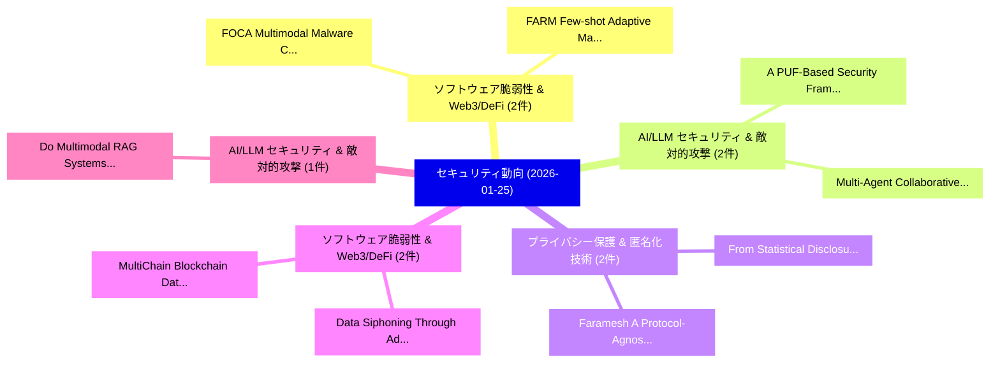

# 📅 02_daily: 日次エグゼクティブサマリー報告書 (2026-01-25)

**集計日時**: 2026-10-02 23:05:55 UTC  
**対象日付**: 2026-01-25  
**本日収集論文数**: 17 件  

---

## 💡 主要セキュリティ動向・脅威インサイト (Executive Insights)

本日の収集論文（計 17 件）において、以下の重点セキュリティ領域で活発な研究動向が確認されました：
- **ソフトウェア脆弱性 & Web3/DeFi** (2 件): 注目論文として 「FOCA: Multimodal Malware Class...」、「FARM: Few-shot Adaptive Malwar...」 等が発表され、実務防御および攻撃検証の進展が見られます。
- **AI/LLM セキュリティ & 敵対的攻撃** (2 件): 注目論文として 「A PUF-Based Security Framework...」、「Multi-Agent Collaborative Intr...」 等が発表され、実務防御および攻撃検証の進展が見られます。
- **プライバシー保護 & 匿名化技術** (2 件): 注目論文として 「Faramesh: A Protocol-Agnostic ...」、「From Statistical Disclosure Co...」 等が発表され、実務防御および攻撃検証の進展が見られます。
- **ソフトウェア脆弱性 & Web3/DeFi** (2 件): 注目論文として 「Data Siphoning Through Advance...」、「MultiChain Blockchain Data Pro...」 等が発表され、実務防御および攻撃検証の進展が見られます。
- **AI/LLM セキュリティ & 敵対的攻撃** (1 件): 注目論文として 「Do Multimodal RAG Systems Leak...」 等が発表され、実務防御および攻撃検証の進展が見られます。

### 🗺️ 技術・脅威トピックマインドマップ

---

## 📌 日次セキュリティ論文一覧 (日本語表形式)

| No | arXiv ID | 論文タイトル (日本語訳) | 重要キーワード | 構造化エグゼクティブ要約 (背景・提案・影響) | 脅威分類 | 詳細リンク |
|---|---|---|---|---|---|---|
| 1 | `2601.17638v1` | [FOCA: Multimodal Malware Classification via Hyperbolic Cross-Attention（セキュリティ分析論文）](../../okf/papers/2026-01-25/2601.17638.md) | `Multimodal Malware Classification`, `Hyperbolic Cross`, `Bikrant Bikram Pratap Maurya` | 【提案】概要 (Overview & Key Finding) 本論文「FOCA: Multimodal マルウェア Classification via Hyperbolic Cr...。実証評価により経営層・セキュリティ管理者向け推奨アクション (E... | `cybersecurity` | [arXiv](https://arxiv.org/abs/2601.17638v1) &#124; [OKF](../../okf/papers/2026-01-25/2601.17638.md) |
| 2 | `2601.17644v3` | [Do Multimodal RAG Systems Leak Data? A Comprehensive Evaluation of Membership Inference and Image Caption Retrieval Attacks（セキュリティ分析論文）](../../okf/papers/2026-01-25/2601.17644.md) | `Image Caption Retrieval Attacks`, `Systems Leak Data`, `Membership Inference` | 【提案】A Comprehensive Evaluation of Membership Inference and Image Caption Retrieval Attacks ...。実証評価により経営層・セキュリティ管理者向け推奨アクション (E... | `cs.AI` | [arXiv](https://arxiv.org/abs/2601.17644v3) &#124; [OKF](../../okf/papers/2026-01-25/2601.17644.md) |
| 3 | `2601.17661v1` | [A PUF-Based Security Framework for Fault and Intrusion Detection（セキュリティ分析論文）](../../okf/papers/2026-01-25/2601.17661.md) | `Intrusion Detection`, `PUF-Based Security`, `Ahmed Oun` | 【提案】概要 (Overview & Key Finding) 本論文「A PUF-Based Security Framework for Fault and Intrusion ...。実証評価により経営層・セキュリティ管理者向け推奨アクション (E... | `cybersecurity` | [arXiv](https://arxiv.org/abs/2601.17661v1) &#124; [OKF](../../okf/papers/2026-01-25/2601.17661.md) |
| 4 | `2601.17744v1` | [Faramesh: A Protocol-Agnostic Execution Control Plane for Autonomous Agent Systems（セキュリティ分析論文）](../../okf/papers/2026-01-25/2601.17744.md) | `Agnostic Execution Control Plane`, `Autonomous Agent Systems`, `Protocol-Agnostic Execution` | 【提案】概要 (Overview & Key Finding) 本論文「Faramesh: A Protocol-Agnostic Execution Control Plane f...。実証評価により経営層・セキュリティ管理者向け推奨アクション (E... | `cs.AI` | [arXiv](https://arxiv.org/abs/2601.17744v1) &#124; [OKF](../../okf/papers/2026-01-25/2601.17744.md) |
| 5 | `2601.17785v1` | [Performance Quantum-Secure Digital Signature Algorithms in Blockchainの分析](../../okf/papers/2026-01-25/2601.17785.md) | `Secure Digital Signature Algorithms`, `Quantum-Secure Digital`, `Performance Quantum` | 【提案】概要 (Overview & Key Finding) 本論文「Performance 量子-Secure Digital Signature Algorithms in B...。実証評価により経営層・セキュリティ管理者向け推奨アクション (E... | `executive-summary` | [arXiv](https://arxiv.org/abs/2601.17785v1) &#124; [OKF](../../okf/papers/2026-01-25/2601.17785.md) |
| 6 | `2601.17806v1` | [@NTT: Algorithm-Targeted NTT hardware acceleration via Design-Time Constant Optimization（セキュリティ分析論文）](../../okf/papers/2026-01-25/2601.17806.md) | `Time Constant Optimization`, `Algorithm-Targeted NTT`, `Design-Time Constant` | 【提案】概要 (Overview & Key Finding) 本論文「@NTT: Algorithm-Targeted NTT hardware acceleration via ...。実証評価により経営層・セキュリティ管理者向け推奨アクション (E... | `executive-summary` | [arXiv](https://arxiv.org/abs/2601.17806v1) &#124; [OKF](../../okf/papers/2026-01-25/2601.17806.md) |
| 7 | `2601.17817v1` | [Multi-Agent Collaborative Intrusion Detection for Low-Altitude Economy IoT: An LLM-Enhanced Agentic AI Framework（セキュリティ分析論文）](../../okf/papers/2026-01-25/2601.17817.md) | `Agent Collaborative Intrusion Detection`, `Altitude Economy`, `Enhanced Agentic` | 【提案】概要 (Overview & Key Finding) 本論文「Multi-Agent Collaborative Intrusion Detection for Low-A...。実証評価により経営層・セキュリティ管理者向け推奨アクション (E... | `cs.NI` | [arXiv](https://arxiv.org/abs/2601.17817v1) &#124; [OKF](../../okf/papers/2026-01-25/2601.17817.md) |
| 8 | `2601.17833v1` | [An Effective and Cost-Efficient Agentic Framework for Ethereum Smart Contract Auditing（セキュリティ分析論文）](../../okf/papers/2026-01-25/2601.17833.md) | `Ethereum Smart Contract Auditing`, `Cost-Efficient Agentic`, `Wun Yu Chan` | 【提案】概要 (Overview & Key Finding) 本論文「An Effective and Cost-Efficient Agentic Framework for E...。実証評価により経営層・セキュリティ管理者向け推奨アクション (E... | `cybersecurity` | [arXiv](https://arxiv.org/abs/2601.17833v1) &#124; [OKF](../../okf/papers/2026-01-25/2601.17833.md) |
| 9 | `2601.17875v2` | [The Stateless Pattern: Ephemeral Coordination as the Third Pillar of Digital Sovereignty（セキュリティ分析論文）](../../okf/papers/2026-01-25/2601.17875.md) | `Ephemeral Coordination`, `Third Pillar`, `Digital Sovereignty` | 【提案】概要 (Overview & Key Finding) 本論文「The Stateless Pattern: Ephemeral Coordination as the Th...。実証評価により経営層・セキュリティ管理者向け推奨アクション (E... | `cybersecurity` | [arXiv](https://arxiv.org/abs/2601.17875v2) &#124; [OKF](../../okf/papers/2026-01-25/2601.17875.md) |
| 10 | `2601.17888v1` | [iResolveX: Multi-Layered Indirect Call Resolution via Static Reasoning and Learning-Augmented Refinement（セキュリティ分析論文）](../../okf/papers/2026-01-25/2601.17888.md) | `Layered Indirect Call Resolution`, `Static Reasoning`, `Augmented Refinement` | 【提案】概要 (Overview & Key Finding) 本論文「iResolveX: Multi-Layered Indirect Call Resolution via S...。実証評価により経営層・セキュリティ管理者向け推奨アクション (E... | `cs.PL` | [arXiv](https://arxiv.org/abs/2601.17888v1) &#124; [OKF](../../okf/papers/2026-01-25/2601.17888.md) |
| 11 | `2601.17907v2` | [FARM: Few-shot Adaptive Malware Family Classification under Concept Drift（セキュリティ分析論文）](../../okf/papers/2026-01-25/2601.17907.md) | `Adaptive Malware Family Classification`, `Concept Drift`, `Few-shot Adaptive` | 【提案】概要 (Overview & Key Finding) 本論文「FARM: Few-shot Adaptive マルウェア Family Classification und...。実証評価により経営層・セキュリティ管理者向け推奨アクション (E... | `executive-summary` | [arXiv](https://arxiv.org/abs/2601.17907v2) &#124; [OKF](../../okf/papers/2026-01-25/2601.17907.md) |
| 12 | `2601.17909v1` | [From Statistical Disclosure Control to Fair AI: Navigating Fundamental Tradeoffs in Differential Privacy（セキュリティ分析論文）](../../okf/papers/2026-01-25/2601.17909.md) | `Navigating Fundamental Tradeoffs`, `Differential Privacy`, `Adriana Watson` | 【提案】概要 (Overview & Key Finding) 本論文「From Statistical Disclosure Control to Fair AI: Navigat...。実証評価により経営層・セキュリティ管理者向け推奨アクション (E... | `cybersecurity` | [arXiv](https://arxiv.org/abs/2601.17909v1) &#124; [OKF](../../okf/papers/2026-01-25/2601.17909.md) |
| 13 | `2601.17911v1` | [Prompt Injection Evaluations: Refusal Boundary Instability and Artifact-Dependent Compliance in GPT-4-Series Models（セキュリティ分析論文）](../../okf/papers/2026-01-25/2601.17911.md) | `Prompt Injection Evaluations`, `Refusal Boundary Instability`, `Dependent Compliance` | 【提案】概要 (Overview & Key Finding) 本論文「プロンプトインジェクション Evaluations: Refusal Boundary Instability...。実証評価により経営層・セキュリティ管理者向け推奨アクション (E... | `cybersecurity` | [arXiv](https://arxiv.org/abs/2601.17911v1) &#124; [OKF](../../okf/papers/2026-01-25/2601.17911.md) |
| 14 | `2601.17935v1` | [FedGraph-VASP: Privacy-Preserving Federated Graph Learning with Post-Quantum Security for Cross-Institutional Anti-Money Laundering（セキュリティ分析論文）](../../okf/papers/2026-01-25/2601.17935.md) | `Preserving Federated Graph Learning`, `Quantum Security`, `Institutional Anti` | 【提案】概要 (Overview & Key Finding) 本論文「FedGraph-VASP: Privacy-Preserving Federated Graph Learn...。実証評価により経営層・セキュリティ管理者向け推奨アクション (E... | `executive-summary` | [arXiv](https://arxiv.org/abs/2601.17935v1) &#124; [OKF](../../okf/papers/2026-01-25/2601.17935.md) |
| 15 | `2601.17967v1` | [Data Siphoning Through Advanced Persistent Transmission Attacks At The Physical Layer（セキュリティ分析論文）](../../okf/papers/2026-01-25/2601.17967.md) | `Alon Hillel`, `Raw Meta`, `Executive Summary` | 【提案】概要 (Overview & Key Finding) 本論文「Data Siphoning Through Advanced Persistent Transmission...。実証評価により経営層・セキュリティ管理者向け推奨アクション (E... | `cybersecurity` | [arXiv](https://arxiv.org/abs/2601.17967v1) &#124; [OKF](../../okf/papers/2026-01-25/2601.17967.md) |
| 16 | `2601.18011v1` | [MultiChain Blockchain Data Provenance for Deterministic Stream Processing with Kafka Streams: A Weather Data Case Study（セキュリティ分析論文）](../../okf/papers/2026-01-25/2601.18011.md) | `Blockchain Data Provenance`, `Deterministic Stream Processing`, `Kafka Streams` | 【提案】概要 (Overview & Key Finding) 本論文「MultiChain Blockchain Data Provenance for Deterministic...。実証評価により経営層・セキュリティ管理者向け推奨アクション (E... | `executive-summary` | [arXiv](https://arxiv.org/abs/2601.18011v1) &#124; [OKF](../../okf/papers/2026-01-25/2601.18011.md) |
| 17 | `2601.18834v1` | [CanaryBench: Stress Testing Privacy Leakage in Cluster-Level Conversation Summaries（セキュリティ分析論文）](../../okf/papers/2026-01-25/2601.18834.md) | `Stress Testing Privacy Leakage`, `Level Conversation Summaries`, `Cluster-Level Conversation` | 【提案】概要 (Overview & Key Finding) 本論文「CanaryBench: Stress Testing Privacy Leakage in Cluster-...。実証評価により経営層・セキュリティ管理者向け推奨アクション (E... | `cs.AI` | [arXiv](https://arxiv.org/abs/2601.18834v1) &#124; [OKF](../../okf/papers/2026-01-25/2601.18834.md) |

