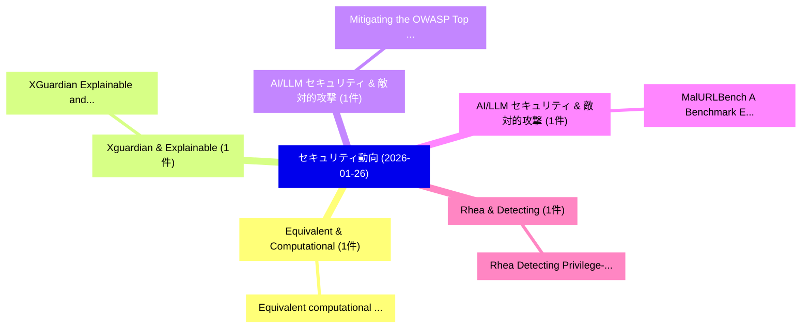

# 📅 02_daily: 日次エグゼクティブサマリー報告書 (2026-01-26)

**集計日時**: 2026-10-02 23:05:55 UTC  
**対象日付**: 2026-01-26  
**本日収集論文数**: 14 件  

---

## 💡 主要セキュリティ動向・脅威インサイト (Executive Insights)

本日の収集論文（計 14 件）において、以下の重点セキュリティ領域で活発な研究動向が確認されました：
- **Equivalent & Computational** (1 件): 注目論文として 「Equivalent computational probl...」 等が発表され、実務防御および攻撃検証の進展が見られます。
- **Xguardian & Explainable** (1 件): 注目論文として 「XGuardian: Explainable and Gen...」 等が発表され、実務防御および攻撃検証の進展が見られます。
- **AI/LLM セキュリティ & 敵対的攻撃** (1 件): 注目論文として 「Mitigating the OWASP Top 10 Fo...」 等が発表され、実務防御および攻撃検証の進展が見られます。
- **AI/LLM セキュリティ & 敵対的攻撃** (1 件): 注目論文として 「MalURLBench: A Benchmark Evalu...」 等が発表され、実務防御および攻撃検証の進展が見られます。
- **Rhea & Detecting** (1 件): 注目論文として 「Rhea: Detecting Privilege-Esca...」 等が発表され、実務防御および攻撃検証の進展が見られます。

### 🗺️ 技術・脅威トピックマインドマップ

---

## 📌 日次セキュリティ論文一覧 (日本語表形式)

| No | arXiv ID | 論文タイトル (日本語訳) | 重要キーワード | 構造化エグゼクティブ要約 (背景・提案・影響) | 脅威分類 | 詳細リンク |
|---|---|---|---|---|---|---|
| 1 | `2601.18050v1` | [Equivalent computational problems for superspecial abelian surfaces（セキュリティ分析論文）](../../okf/papers/2026-01-26/2601.18050.md) | `Raw Meta`, `Executive Summary`, `Key Finding` | 【提案】概要 (Overview & Key Finding) 本論文「Equivalent computational problems for superspecial abel...。実証評価により経営層・セキュリティ管理者向け推奨アクション (E... | `math.AG` | [arXiv](https://arxiv.org/abs/2601.18050v1) &#124; [OKF](../../okf/papers/2026-01-26/2601.18050.md) |
| 2 | `2601.18068v1` | [XGuardian: Explainable and Generalized AI Anti-Cheat on FPS Gamesに向けて](../../okf/papers/2026-01-26/2601.18068.md) | `Towards Explainable`, `Jiayi Zhang`, `Chenxin Sun` | 【提案】概要 (Overview & Key Finding) 本論文「XGuardian: Explainable and Generalized AI Anti-Cheat on...。実証評価により経営層・セキュリティ管理者向け推奨アクション (E... | `executive-summary` | [arXiv](https://arxiv.org/abs/2601.18068v1) &#124; [OKF](../../okf/papers/2026-01-26/2601.18068.md) |
| 3 | `2601.18105v1` | [Mitigating the OWASP Top 10 For 大規模言語モデル Applications using Intelligent Agents](../../okf/papers/2026-01-26/2601.18105.md) | `Intelligent Agents`, `Faisal Abul Rub`, `Mohammad Al Khaldy` | 【提案】概要 (Overview & Key Finding) 本論文「Mitigating the OWASP Top 10 For 大規模言語モデル Applications u...。実証評価により経営層・セキュリティ管理者向け推奨アクション (E... | `cs.AI` | [arXiv](https://arxiv.org/abs/2601.18105v1) &#124; [OKF](../../okf/papers/2026-01-26/2601.18105.md) |
| 4 | `2601.18113v3` | [MalURLBench: A Benchmark Evaluating Agents' Vulnerabilities When Processing Web URLs（セキュリティ分析論文）](../../okf/papers/2026-01-26/2601.18113.md) | `Benchmark Evaluating Agents`, `Dezhang Kong`, `Zhuxi Wu` | 【提案】概要 (Overview & Key Finding) 本論文「MalURLBench: A Benchmark Evaluating Agents' Vulnerabili...。実証評価により経営層・セキュリティ管理者向け推奨アクション (E... | `cs.AI` | [arXiv](https://arxiv.org/abs/2601.18113v3) &#124; [OKF](../../okf/papers/2026-01-26/2601.18113.md) |
| 5 | `2601.18216v1` | [Rhea: Detecting Privilege-Escalated Evasive Ransomware Attacks Using Format-Aware Validation in the Cloud（セキュリティ分析論文）](../../okf/papers/2026-01-26/2601.18216.md) | `Escalated Evasive Ransomware Attacks Using Format`, `Detecting Privilege`, `Privilege-Escalated Evasive` | 【提案】概要 (Overview & Key Finding) 本論文「Rhea: Detecting Privilege-Escalated Evasive ランサムウェア Att...。実証評価により経営層・セキュリティ管理者向け推奨アクション (E... | `executive-summary` | [arXiv](https://arxiv.org/abs/2601.18216v1) &#124; [OKF](../../okf/papers/2026-01-26/2601.18216.md) |
| 6 | `2601.18413v1` | [Fundamentals, Recent Advances, and Challenges Regarding Cryptographic Algorithms for the Quantum Computing Era（セキュリティ分析論文）](../../okf/papers/2026-01-26/2601.18413.md) | `Challenges Regarding Cryptographic Algorithms`, `Quantum Computing Era`, `Recent Advances` | 【提案】概要 (Overview & Key Finding) 本論文「Fundamentals, Recent Advances, and Challenges Regarding...。実証評価により経営層・セキュリティ管理者向け推奨アクション (E... | `executive-summary` | [arXiv](https://arxiv.org/abs/2601.18413v1) &#124; [OKF](../../okf/papers/2026-01-26/2601.18413.md) |
| 7 | `2601.18445v1` | [KeyMemRT Compiler and Runtime: Unlocking Memory-Scalable FHE（セキュリティ分析論文）](../../okf/papers/2026-01-26/2601.18445.md) | `Unlocking Memory`, `Memory-Scalable FHE`, `Jackson Woodruff` | 【提案】概要 (Overview & Key Finding) 本論文「KeyMemRT Compiler and Runtime: Unlocking Memory-Scalabl...。実証評価により経営層・セキュリティ管理者向け推奨アクション (E... | `executive-summary` | [arXiv](https://arxiv.org/abs/2601.18445v1) &#124; [OKF](../../okf/papers/2026-01-26/2601.18445.md) |
| 8 | `2601.18511v2` | [Scaling up FHE-based Privacy-Preserving ML: Higher Throughput, Longer Inputs for LLama-3-8B（セキュリティ分析論文）](../../okf/papers/2026-01-26/2601.18511.md) | `FHE-based Privacy`, `Higher Throughput`, `Longer Inputs` | 【提案】概要 (Overview & Key Finding) 本論文「Scaling up FHE-based Privacy-Preserving ML: Higher Thro...。実証評価により経営層・セキュリティ管理者向け推奨アクション (E... | `cybersecurity` | [arXiv](https://arxiv.org/abs/2601.18511v2) &#124; [OKF](../../okf/papers/2026-01-26/2601.18511.md) |
| 9 | `2601.18612v1` | [Multimodal Privacy-Preserving Entity Resolution with Fully Homomorphic Encryption（セキュリティ分析論文）](../../okf/papers/2026-01-26/2601.18612.md) | `Preserving Entity Resolution`, `Fully Homomorphic Encryption`, `Multimodal Privacy` | 【提案】概要 (Overview & Key Finding) 本論文「Multimodal Privacy-Preserving Entity Resolution with Fu...。実証評価により経営層・セキュリティ管理者向け推奨アクション (E... | `cs.CV` | [arXiv](https://arxiv.org/abs/2601.18612v1) &#124; [OKF](../../okf/papers/2026-01-26/2601.18612.md) |
| 10 | `2601.18754v1` | [$α^3$-SecBench: A Large-Scale Evaluation Suite of Security, Resilience, and Trust for LLM-based UAV Agents over 6G Networks（セキュリティ分析論文）](../../okf/papers/2026-01-26/2601.18754.md) | `LLM-based UAV`, `Mohamed Amine Ferrag`, `Abderrahmane Lakas` | 【提案】概要 (Overview & Key Finding) 本論文「$α^3$-SecBench: A Large-Scale Evaluation Suite of Secur...。実証評価により経営層・セキュリティ管理者向け推奨アクション (E... | `cs.AI` | [arXiv](https://arxiv.org/abs/2601.18754v1) &#124; [OKF](../../okf/papers/2026-01-26/2601.18754.md) |
| 11 | `2601.18842v3` | [GUIGuard-Bench: Toward a General Evaluation for Privacy-Preserving GUI Agents（セキュリティ分析論文）](../../okf/papers/2026-01-26/2601.18842.md) | `Privacy-Preserving GUI`, `Yanxi Wang`, `Zhiling Zhang` | 【提案】概要 (Overview & Key Finding) 本論文「GUIGuard-Bench: Toward a General Evaluation for Privacy...。実証評価により経営層・セキュリティ管理者向け推奨アクション (E... | `cs.AI` | [arXiv](https://arxiv.org/abs/2601.18842v3) &#124; [OKF](../../okf/papers/2026-01-26/2601.18842.md) |
| 12 | `2601.18981v1` | [Attention-Enhanced Graph Filtering for False Data Injection Attack Detection and Localization（セキュリティ分析論文）](../../okf/papers/2026-01-26/2601.18981.md) | `False Data Injection Attack Detection`, `Enhanced Graph Filtering`, `Attention-Enhanced Graph` | 【提案】概要 (Overview & Key Finding) 本論文「Attention-Enhanced Graph Filtering for False Data Injec...。実証評価により経営層・セキュリティ管理者向け推奨アクション (E... | `executive-summary` | [arXiv](https://arxiv.org/abs/2601.18981v1) &#124; [OKF](../../okf/papers/2026-01-26/2601.18981.md) |
| 13 | `2601.19016v2` | [Average-Case Reductions for $k$-XOR and Tensor PCA（セキュリティ分析論文）](../../okf/papers/2026-01-26/2601.19016.md) | `Case Reductions`, `Average-Case Reductions`, `Guy Bresler` | 【提案】概要 (Overview & Key Finding) 本論文「Average-Case Reductions for $k$-XOR and Tensor PCA（セキュリ...。実証評価により経営層・セキュリティ管理者向け推奨アクション (E... | `math.PR` | [arXiv](https://arxiv.org/abs/2601.19016v2) &#124; [OKF](../../okf/papers/2026-01-26/2601.19016.md) |
| 14 | `2602.15866v1` | [NLP Privacy Risk Identification in Social Media (NLP-PRISM): A Survey（セキュリティ分析論文）](../../okf/papers/2026-01-26/2602.15866.md) | `Privacy Risk Identification`, `Social Media`, `Jai Kruthunz Naveen Kumar` | 【提案】概要 (Overview & Key Finding) 本論文「NLP Privacy Risk Identification in Social Media (NLP-PR...。実証評価により経営層・セキュリティ管理者向け推奨アクション (E... | `cs.AI` | [arXiv](https://arxiv.org/abs/2602.15866v1) &#124; [OKF](../../okf/papers/2026-01-26/2602.15866.md) |

