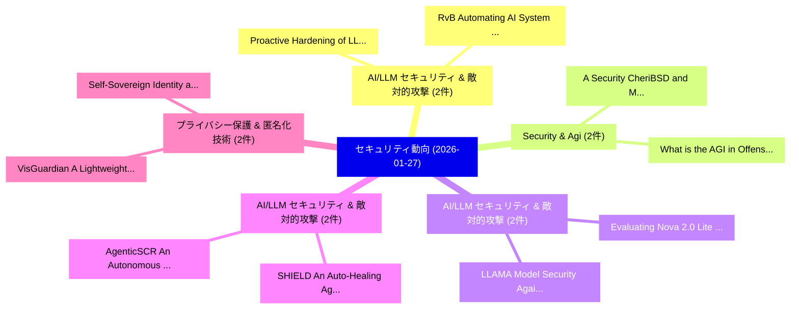

# 📅 02_daily: 日次エグゼクティブサマリー報告書 (2026-01-27)

**集計日時**: 2026-10-02 23:05:55 UTC  
**対象日付**: 2026-01-27  
**本日収集論文数**: 25 件  

---

## 💡 主要セキュリティ動向・脅威インサイト (Executive Insights)

本日の収集論文（計 25 件）において、以下の重点セキュリティ領域で活発な研究動向が確認されました：
- **AI/LLM セキュリティ & 敵対的攻撃** (2 件): 注目論文として 「Proactive Hardening of LLM Def...」、「RvB: Automating AI System Hard...」 等が発表され、実務防御および攻撃検証の進展が見られます。
- **Security & Agi** (2 件): 注目論文として 「A Security CheriBSD and Morell...」、「What is the AGI in Offensive S...」 等が発表され、実務防御および攻撃検証の進展が見られます。
- **AI/LLM セキュリティ & 敵対的攻撃** (2 件): 注目論文として 「Evaluating Nova 2.0 Lite model...」、「LLAMA Model Security Against O...」 等が発表され、実務防御および攻撃検証の進展が見られます。
- **AI/LLM セキュリティ & 敵対的攻撃** (2 件): 注目論文として 「AgenticSCR: An Autonomous Agen...」、「SHIELD: An Auto-Healing Agenti...」 等が発表され、実務防御および攻撃検証の進展が見られます。
- **プライバシー保護 & 匿名化技術** (2 件): 注目論文として 「VisGuardian: A Lightweight Gro...」、「Self-Sovereign Identity and eI...」 等が発表され、実務防御および攻撃検証の進展が見られます。

### 🗺️ 技術・脅威トピックマインドマップ

---

## 📌 日次セキュリティ論文一覧 (日本語表形式)

| No | arXiv ID | 論文タイトル (日本語訳) | 重要キーワード | 構造化エグゼクティブ要約 (背景・提案・影響) | 脅威分類 | 詳細リンク |
|---|---|---|---|---|---|---|
| 1 | `2601.19051v1` | [Proactive Hardening of LLM Defenses with HASTE（セキュリティ分析論文）](../../okf/papers/2026-01-27/2601.19051.md) | `Proactive Hardening`, `Henry Chen`, `Victor Aranda` | 【提案】概要 (Overview & Key Finding) 本論文「Proactive Hardening of LLM Defenses with HASTE（セキュリティ分析...。実証評価により経営層・セキュリティ管理者向け推奨アクション (E... | `cybersecurity` | [arXiv](https://arxiv.org/abs/2601.19051v1) &#124; [OKF](../../okf/papers/2026-01-27/2601.19051.md) |
| 2 | `2601.19061v2` | [Thought-Transfer: Indirect Targeted Poisoning Attacks on Chain-of-Thought Reasoning Models（セキュリティ分析論文）](../../okf/papers/2026-01-27/2601.19061.md) | `Indirect Targeted Poisoning Attacks`, `Thought Reasoning Models`, `Indirect Targeted Poisoning Attac` | 【提案】概要 (Overview & Key Finding) 本論文「Thought-Transfer: Indirect Targeted Poisoning Attacks o...。実証評価により経営層・セキュリティ管理者向け推奨アクション (E... | `executive-summary` | [arXiv](https://arxiv.org/abs/2601.19061v2) &#124; [OKF](../../okf/papers/2026-01-27/2601.19061.md) |
| 3 | `2601.19074v1` | [A Security CheriBSD and Morello Linuxの分析](../../okf/papers/2026-01-27/2601.19074.md) | `Morello Linux`, `Dariy Guzairov`, `Alex Potanin` | 【提案】概要 (Overview & Key Finding) 本論文「A Security CheriBSD and Morello Linuxの分析」（原題: A Securit...。実証評価により経営層・セキュリティ管理者向け推奨アクション (E... | `cybersecurity` | [arXiv](https://arxiv.org/abs/2601.19074v1) &#124; [OKF](../../okf/papers/2026-01-27/2601.19074.md) |
| 4 | `2601.19134v1` | [Evaluating Nova 2.0 Lite model under Amazon's Frontier Model Safety Framework（セキュリティ分析論文）](../../okf/papers/2026-01-27/2601.19134.md) | `Evaluating Nova`, `Satyapriya Krishna`, `Matteo Memelli` | 【提案】概要 (Overview & Key Finding) 本論文「Evaluating Nova 2.0 Lite model under Amazon's Frontier ...。実証評価により経営層・セキュリティ管理者向け推奨アクション (E... | `executive-summary` | [arXiv](https://arxiv.org/abs/2601.19134v1) &#124; [OKF](../../okf/papers/2026-01-27/2601.19134.md) |
| 5 | `2601.19138v2` | [AgenticSCR: An Autonomous Agentic Secure Code Review for Immature Vulnerabilities Detection（セキュリティ分析論文）](../../okf/papers/2026-01-27/2601.19138.md) | `Immature Vulnerabilities Detection`, `Hong Yi Lin`, `Wachiraphan Charoenwet` | 【提案】概要 (Overview & Key Finding) 本論文「AgenticSCR: An Autonomous Agentic Secure Code Review fo...。実証評価により経営層・セキュリティ管理者向け推奨アクション (E... | `cs.AI` | [arXiv](https://arxiv.org/abs/2601.19138v2) &#124; [OKF](../../okf/papers/2026-01-27/2601.19138.md) |
| 6 | `2601.19154v4` | [Shuffling Beyond Pure Local Differential Privacyの分析](../../okf/papers/2026-01-27/2601.19154.md) | `Shuffling Beyond Pure Local Differential Privacy`, `Shuffling Beyond Pure Local Differential`, `Seng Pei Liew` | 【提案】概要 (Overview & Key Finding) 本論文「Shuffling Beyond Pure Local 差分プライバシーの分析」（原題: Analysis o...。実証評価により経営層・セキュリティ管理者向け推奨アクション (E... | `executive-summary` | [arXiv](https://arxiv.org/abs/2601.19154v4) &#124; [OKF](../../okf/papers/2026-01-27/2601.19154.md) |
| 7 | `2601.19174v1` | [SHIELD: An Auto-Healing Agentic Defense Framework for LLM Resource Exhaustion Attacks（セキュリティ分析論文）](../../okf/papers/2026-01-27/2601.19174.md) | `Resource Exhaustion Attacks`, `Auto-Healing Agentic`, `Nirhoshan Sivaroopan` | 【提案】概要 (Overview & Key Finding) 本論文「SHIELD: An Auto-Healing Agentic Defense Framework for L...。実証評価により経営層・セキュリティ管理者向け推奨アクション (E... | `cs.AI` | [arXiv](https://arxiv.org/abs/2601.19174v1) &#124; [OKF](../../okf/papers/2026-01-27/2601.19174.md) |
| 8 | `2601.19231v1` | [LLMs Can Unlearn Refusal with Only 1,000 Benign Samples（セキュリティ分析論文）](../../okf/papers/2026-01-27/2601.19231.md) | `Can Unlearn Refusal`, `Benign Samples`, `Yangyang Guo` | 【提案】概要 (Overview & Key Finding) 本論文「LLMs Can Unlearn Refusal with Only 1,000 Benign Samples...。実証評価により経営層・セキュリティ管理者向け推奨アクション (E... | `cybersecurity` | [arXiv](https://arxiv.org/abs/2601.19231v1) &#124; [OKF](../../okf/papers/2026-01-27/2601.19231.md) |
| 9 | `2601.19342v1` | [Modeling Behavioral Signals in Job Scams: A Human-Centered Security Study（セキュリティ分析論文）](../../okf/papers/2026-01-27/2601.19342.md) | `Modeling Behavioral Signals`, `Job Scams`, `Human-Centered Security` | 【提案】概要 (Overview & Key Finding) 本論文「Modeling Behavioral Signals in Job Scams: A Human-Cente...。実証評価により経営層・セキュリティ管理者向け推奨アクション (E... | `executive-summary` | [arXiv](https://arxiv.org/abs/2601.19342v1) &#124; [OKF](../../okf/papers/2026-01-27/2601.19342.md) |
| 10 | `2601.19345v1` | [AI-driven Intrusion Detection for UAV in Smart Urban Ecosystems: A Comprehensive Survey（セキュリティ分析論文）](../../okf/papers/2026-01-27/2601.19345.md) | `Smart Urban Ecosystems`, `Intrusion Detection`, `AI-driven Intrusion` | 【提案】概要 (Overview & Key Finding) 本論文「AI-driven Intrusion Detection for UAV in Smart Urban Ec...。実証評価により経営層・セキュリティ管理者向け推奨アクション (E... | `cybersecurity` | [arXiv](https://arxiv.org/abs/2601.19345v1) &#124; [OKF](../../okf/papers/2026-01-27/2601.19345.md) |
| 11 | `2601.19367v1` | [CHEHAB RL: Learning to Optimize Fully Homomorphic Encryption Computations（セキュリティ分析論文）](../../okf/papers/2026-01-27/2601.19367.md) | `Optimize Fully Homomorphic Encryption Computations`, `Optimize Fully Homomorphic`, `Bilel Sefsaf` | 【提案】概要 (Overview & Key Finding) 本論文「CHEHAB RL: Learning to Optimize Fully 準同型暗号 Computation...。実証評価により経営層・セキュリティ管理者向け推奨アクション (E... | `executive-summary` | [arXiv](https://arxiv.org/abs/2601.19367v1) &#124; [OKF](../../okf/papers/2026-01-27/2601.19367.md) |
| 12 | `2601.19448v2` | [From Internal Diagnosis to External Auditing: A VLM-Driven Paradigm for Data-Free Online Backdoor Defense（セキュリティ分析論文）](../../okf/papers/2026-01-27/2601.19448.md) | `Free Online Backdoor Defense`, `External Auditing`, `Driven Paradigm` | 【提案】概要 (Overview & Key Finding) 本論文「From Internal Diagnosis to External Auditing: A VLM-Dri...。実証評価により経営層・セキュリティ管理者向け推奨アクション (E... | `executive-summary` | [arXiv](https://arxiv.org/abs/2601.19448v2) &#124; [OKF](../../okf/papers/2026-01-27/2601.19448.md) |
| 13 | `2601.19500v3` | [Reuse of Public Keys Across UTXO and Account-Based Cryptocurrencies（セキュリティ分析論文）](../../okf/papers/2026-01-27/2601.19500.md) | `Public Keys Across`, `Based Cryptocurrencies`, `Account-Based Cryptocurrencies` | 【提案】概要 (Overview & Key Finding) 本論文「Reuse of Public Keys Across UTXO and Account-Based Cryp...。実証評価により経営層・セキュリティ管理者向け推奨アクション (E... | `cybersecurity` | [arXiv](https://arxiv.org/abs/2601.19500v3) &#124; [OKF](../../okf/papers/2026-01-27/2601.19500.md) |
| 14 | `2601.19502v1` | [VisGuardian: A Lightweight Group-based Privacy Control Technique For Front Camera Data From AR Glasses in Home Environments（セキュリティ分析論文）](../../okf/papers/2026-01-27/2601.19502.md) | `Lightweight Group`, `Home Environments`, `Group-based Privacy` | 【提案】概要 (Overview & Key Finding) 本論文「VisGuardian: A Lightweight Group-based Privacy Control ...。実証評価により経営層・セキュリティ管理者向け推奨アクション (E... | `executive-summary` | [arXiv](https://arxiv.org/abs/2601.19502v1) &#124; [OKF](../../okf/papers/2026-01-27/2601.19502.md) |
| 15 | `2601.19570v1` | [How to Serve Your Sandwich? MEV Attacks in Private L2 Mempools（セキュリティ分析論文）](../../okf/papers/2026-01-27/2601.19570.md) | `Private L2 Mempools`, `Krzysztof Gogol`, `Manvir Schneider` | 【提案】MEV Attacks in Private L2 Mempools ### (日本語題名: How to Serve Your Sandwich?。実証評価により経営層・セキュリティ管理者向け推奨アクション (Executive Recomme... | `cybersecurity` | [arXiv](https://arxiv.org/abs/2601.19570v1) &#124; [OKF](../../okf/papers/2026-01-27/2601.19570.md) |
| 16 | `2601.19684v3` | [LLM-Assisted Authentication and Fraud Detection（セキュリティ分析論文）](../../okf/papers/2026-01-27/2601.19684.md) | `Assisted Authentication`, `Fraud Detection`, `LLM-Assisted Authentication` | 【提案】概要 (Overview & Key Finding) 本論文「LLM-Assisted Authentication and Fraud Detection（セキュリティ分...。実証評価によりChan - **公開日時**: `2026-01... | `cybersecurity` | [arXiv](https://arxiv.org/abs/2601.19684v3) &#124; [OKF](../../okf/papers/2026-01-27/2601.19684.md) |
| 17 | `2601.19726v1` | [RvB: Automating AI System Hardening via Iterative Red-Blue Games（セキュリティ分析論文）](../../okf/papers/2026-01-27/2601.19726.md) | `System Hardening`, `Iterative Red`, `Blue Games` | 【提案】概要 (Overview & Key Finding) 本論文「RvB: Automating AI System Hardening via Iterative Red-B...。実証評価により経営層・セキュリティ管理者向け推奨アクション (E... | `cs.AI` | [arXiv](https://arxiv.org/abs/2601.19726v1) &#124; [OKF](../../okf/papers/2026-01-27/2601.19726.md) |
| 18 | `2601.19768v3` | [GAVEL: Rule-Based Safety Through Activation Monitoringに向けて](../../okf/papers/2026-01-27/2601.19768.md) | `Rule-Based Safety`, `Towards Rule`, `Shir Rozenfeld` | 【提案】概要 (Overview & Key Finding) 本論文「GAVEL: Rule-Based Safety Through Activation Monitoringに...。実証評価により経営層・セキュリティ管理者向け推奨アクション (E... | `cs.AI` | [arXiv](https://arxiv.org/abs/2601.19768v3) &#124; [OKF](../../okf/papers/2026-01-27/2601.19768.md) |
| 19 | `2601.19837v2` | [Self-Sovereign Identity and eIDAS 2.0: An Control, Privacy, and Legal Implicationsの分析](../../okf/papers/2026-01-27/2601.19837.md) | `Sovereign Identity`, `Self-Sovereign Identity`, `Legal Implications` | 【提案】概要 (Overview & Key Finding) 本論文「Self-Sovereign Identity and eIDAS 2.0: An Control, Priv...。実証評価により経営層・セキュリティ管理者向け推奨アクション (E... | `cs.ET` | [arXiv](https://arxiv.org/abs/2601.19837v2) &#124; [OKF](../../okf/papers/2026-01-27/2601.19837.md) |
| 20 | `2601.19968v1` | [What is the AGI in Offensive Security ?（セキュリティ分析論文）](../../okf/papers/2026-01-27/2601.19968.md) | `Offensive Security`, `Youngwoong Cho`, `Raw Meta` | 【提案】### (日本語題名: What is the AGI in Offensive Security ?（セキュリティ分析論文）)  > [!NOTE] > **OKF Met...。実証評価により経営層・セキュリティ管理者向け推奨アクション (E... | `cybersecurity` | [arXiv](https://arxiv.org/abs/2601.19968v1) &#124; [OKF](../../okf/papers/2026-01-27/2601.19968.md) |
| 21 | `2601.19970v1` | [LLAMA Model Security Against OWASP Top 10 For LLM Applicationsのベンチマーク評価](../../okf/papers/2026-01-27/2601.19970.md) | `Nourin Shahin`, `Izzat Alsmadi`, `Raw Meta` | 【提案】概要 (Overview & Key Finding) 本論文「LLAMA Model Security Against OWASP Top 10 For LLM Appli...。実証評価により経営層・セキュリティ管理者向け推奨アクション (E... | `executive-summary` | [arXiv](https://arxiv.org/abs/2601.19970v1) &#124; [OKF](../../okf/papers/2026-01-27/2601.19970.md) |
| 22 | `2601.20022v2` | [Quickest Change Detection in Discrete-Time in Presence of a Covert Adversary（セキュリティ分析論文）](../../okf/papers/2026-01-27/2601.20022.md) | `Quickest Change Detection`, `Covert Adversary`, `Amir Reza Ramtin` | 【提案】概要 (Overview & Key Finding) 本論文「Quickest Change Detection in Discrete-Time in Presence ...。実証評価により経営層・セキュリティ管理者向け推奨アクション (E... | `executive-summary` | [arXiv](https://arxiv.org/abs/2601.20022v2) &#124; [OKF](../../okf/papers/2026-01-27/2601.20022.md) |
| 23 | `2601.20882v1` | [DevOps-Gym: AI Agents in Software DevOps Cycleのベンチマーク評価](../../okf/papers/2026-01-27/2601.20882.md) | `William Yang Wang`, `Yuheng Tang`, `Kaijie Zhu` | 【提案】概要 (Overview & Key Finding) 本論文「DevOps-Gym: AI Agents in Software DevOps Cycleのベンチマーク評価...。実証評価により経営層・セキュリティ管理者向け推奨アクション (E... | `cs.AI` | [arXiv](https://arxiv.org/abs/2601.20882v1) &#124; [OKF](../../okf/papers/2026-01-27/2601.20882.md) |
| 24 | `2601.20883v1` | [VoxMorph: Scalable Zero-shot Voice Identity Morphing via Disentangled Embeddings（セキュリティ分析論文）](../../okf/papers/2026-01-27/2601.20883.md) | `Voice Identity Morphing`, `Scalable Zero`, `Disentangled Embeddings` | 【提案】概要 (Overview & Key Finding) 本論文「VoxMorph: Scalable Zero-shot Voice Identity Morphing vi...。実証評価により経営層・セキュリティ管理者向け推奨アクション (E... | `executive-summary` | [arXiv](https://arxiv.org/abs/2601.20883v1) &#124; [OKF](../../okf/papers/2026-01-27/2601.20883.md) |
| 25 | `2601.20885v1` | [What Hard Tokens Reveal: Exploiting Low-confidence Tokens for Membership Inference Attacks against 大規模言語モデル](../../okf/papers/2026-01-27/2601.20885.md) | `Membership Inference Attacks`, `Exploiting Low`, `Low-confidence Tokens` | 【提案】概要 (Overview & Key Finding) 本論文「What Hard Tokens Reveal: Exploiting Low-confidence Toke...。実証評価により経営層・セキュリティ管理者向け推奨アクション (E... | `cybersecurity` | [arXiv](https://arxiv.org/abs/2601.20885v1) &#124; [OKF](../../okf/papers/2026-01-27/2601.20885.md) |

