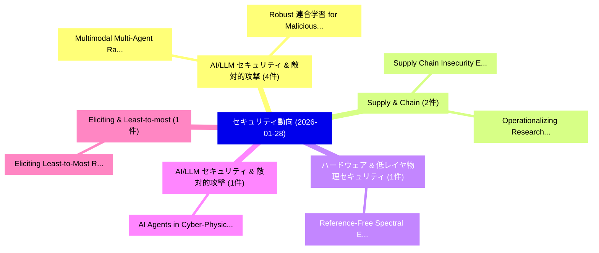

# 📅 02_daily: 日次エグゼクティブサマリー報告書 (2026-01-28)

**集計日時**: 2026-10-02 23:05:55 UTC  
**対象日付**: 2026-01-28  
**本日収集論文数**: 25 件  

---

## 💡 主要セキュリティ動向・脅威インサイト (Executive Insights)

本日の収集論文（計 25 件）において、以下の重点セキュリティ領域で活発な研究動向が確認されました：
- **AI/LLM セキュリティ & 敵対的攻撃** (4 件): 注目論文として 「Multimodal Multi-Agent Ransomw...」、「Robust 連合学習 for Malicious Clie...」 等が発表され、実務防御および攻撃検証の進展が見られます。
- **Supply & Chain** (2 件): 注目論文として 「Supply Chain Insecurity: Expos...」、「Operationalizing Research Soft...」 等が発表され、実務防御および攻撃検証の進展が見られます。
- **ハードウェア & 低レイヤ物理セキュリティ** (1 件): 注目論文として 「Reference-Free Spectral EM Sid...」 等が発表され、実務防御および攻撃検証の進展が見られます。
- **AI/LLM セキュリティ & 敵対的攻撃** (1 件): 注目論文として 「AI Agents in Cyber-Physical Sy...」 等が発表され、実務防御および攻撃検証の進展が見られます。
- **Eliciting & Least-to-most** (1 件): 注目論文として 「Eliciting Least-to-Most Reason...」 等が発表され、実務防御および攻撃検証の進展が見られます。

### 🗺️ 技術・脅威トピックマインドマップ

---

## 📌 日次セキュリティ論文一覧 (日本語表形式)

| No | arXiv ID | 論文タイトル (日本語訳) | 重要キーワード | 構造化エグゼクティブ要約 (背景・提案・影響) | 脅威分類 | 詳細リンク |
|---|---|---|---|---|---|---|
| 1 | `2601.20163v1` | [Reference-Free Spectral EM Side-Channels for Always-on Hardware Trojan Detectionの分析](../../okf/papers/2026-01-28/2601.20163.md) | `Reference-Free Spectral`, `Always-on Hardware`, `Hardware Trojan Detection` | 【提案】概要 (Overview & Key Finding) 本論文「Reference-Free Spectral EM サイドチャネル攻撃s for Always-on Har...。実証評価により経営層・セキュリティ管理者向け推奨アクション (E... | `cybersecurity` | [arXiv](https://arxiv.org/abs/2601.20163v1) &#124; [OKF](../../okf/papers/2026-01-28/2601.20163.md) |
| 2 | `2601.20184v1` | [AI Agents in Cyber-Physical Systems: A Survey of Environmental Interactions, Deepfake Threats, and Defensesのセキュリティ強化](../../okf/papers/2026-01-28/2601.20184.md) | `Physical Systems`, `Cyber-Physical Systems`, `Environmental Interactions` | 【提案】概要 (Overview & Key Finding) 本論文「AI Agents in Cyber-Physical Systems: A Survey of Enviro...。実証評価により経営層・セキュリティ管理者向け推奨アクション (E... | `executive-summary` | [arXiv](https://arxiv.org/abs/2601.20184v1) &#124; [OKF](../../okf/papers/2026-01-28/2601.20184.md) |
| 3 | `2601.20270v1` | [Eliciting Least-to-Most Reasoning for Phishing URL Detection（セキュリティ分析論文）](../../okf/papers/2026-01-28/2601.20270.md) | `Eliciting Least`, `Holly Trikilis`, `Pasindu Marasinghe` | 【提案】概要 (Overview & Key Finding) 本論文「Eliciting Least-to-Most Reasoning for Phishing URL Dete...。実証評価により経営層・セキュリティ管理者向け推奨アクション (E... | `cs.AI` | [arXiv](https://arxiv.org/abs/2601.20270v1) &#124; [OKF](../../okf/papers/2026-01-28/2601.20270.md) |
| 4 | `2601.20310v1` | [SemBind: Binding Diffusion Watermarks to Semantics Against Black-Box Forgery Attacks（セキュリティ分析論文）](../../okf/papers/2026-01-28/2601.20310.md) | `Binding Diffusion Watermarks`, `Box Forgery Attacks`, `Black-Box Forgery` | 【提案】概要 (Overview & Key Finding) 本論文「SemBind: Binding Diffusion Watermarks to Semantics Agai...。実証評価により経営層・セキュリティ管理者向け推奨アクション (E... | `cs.CV` | [arXiv](https://arxiv.org/abs/2601.20310v1) &#124; [OKF](../../okf/papers/2026-01-28/2601.20310.md) |
| 5 | `2601.20325v1` | [UnlearnShield: Shielding Forgotten Privacy against Unlearning Inversion（セキュリティ分析論文）](../../okf/papers/2026-01-28/2601.20325.md) | `Shielding Forgotten Privacy`, `Unlearning Inversion`, `Leo Yu Zhang` | 【提案】概要 (Overview & Key Finding) 本論文「UnlearnShield: Shielding Forgotten Privacy against Unle...。実証評価により経営層・セキュリティ管理者向け推奨アクション (E... | `cs.CV` | [arXiv](https://arxiv.org/abs/2601.20325v1) &#124; [OKF](../../okf/papers/2026-01-28/2601.20325.md) |
| 6 | `2601.20346v2` | [Multimodal Multi-Agent Ransomware Analysis Using AutoGen（セキュリティ分析論文）](../../okf/papers/2026-01-28/2601.20346.md) | `Multimodal Multi`, `Multi-Agent Ransomware`, `Asifullah Khan` | 【提案】概要 (Overview & Key Finding) 本論文「Multimodal Multi-Agent ランサムウェア Analysis Using AutoGen（セ...。実証評価により経営層・セキュリティ管理者向け推奨アクション (E... | `cs.AI` | [arXiv](https://arxiv.org/abs/2601.20346v2) &#124; [OKF](../../okf/papers/2026-01-28/2601.20346.md) |
| 7 | `2601.20368v1` | [LIFT: Byzantine Resilient Hub-Sampling（セキュリティ分析論文）](../../okf/papers/2026-01-28/2601.20368.md) | `Byzantine Resilient Hub`, `Mohamed Amine Legheraba`, `Maria Gradinariu Potop` | 【提案】概要 (Overview & Key Finding) 本論文「LIFT: Byzantine Resilient Hub-Sampling（セキュリティ分析論文）」（原題:...。実証評価により経営層・セキュリティ管理者向け推奨アクション (E... | `executive-summary` | [arXiv](https://arxiv.org/abs/2601.20368v1) &#124; [OKF](../../okf/papers/2026-01-28/2601.20368.md) |
| 8 | `2601.20374v1` | [A High-Performance Fractal Encryption Framework and Modern Innovations for Secure Image Transmission（セキュリティ分析論文）](../../okf/papers/2026-01-28/2601.20374.md) | `Secure Image Transmission`, `Modern Innovations`, `High-Performance Fractal` | 【提案】概要 (Overview & Key Finding) 本論文「A High-Performance Fractal Encryption Framework and Mod...。実証評価により経営層・セキュリティ管理者向け推奨アクション (E... | `cybersecurity` | [arXiv](https://arxiv.org/abs/2601.20374v1) &#124; [OKF](../../okf/papers/2026-01-28/2601.20374.md) |
| 9 | `2601.20378v2` | [Quantum-Safe O-RAN -- Experimental Evaluation of ML-KEM-Based IPsec on the E2 Interfaceに向けて](../../okf/papers/2026-01-28/2601.20378.md) | `Quantum-Safe O`, `Towards Quantum`, `E2 Interface` | 【提案】概要 (Overview & Key Finding) 本論文「量子-Safe O-RAN -- Experimental Evaluation of ML-KEM-Base...。実証評価により経営層・セキュリティ管理者向け推奨アクション (E... | `cybersecurity` | [arXiv](https://arxiv.org/abs/2601.20378v2) &#124; [OKF](../../okf/papers/2026-01-28/2601.20378.md) |
| 10 | `2601.20400v1` | [Fuzzy Private Set Union via Oblivious Key Homomorphic Encryption Retrieval（セキュリティ分析論文）](../../okf/papers/2026-01-28/2601.20400.md) | `Oblivious Key Homomorphic Encryption Retrieval`, `Fuzzy Private Set Union`, `Guillaume Dumas` | 【提案】概要 (Overview & Key Finding) 本論文「Fuzzy Private Set Union via Oblivious Key 準同型暗号 Retriev...。実証評価により経営層・セキュリティ管理者向け推奨アクション (E... | `cybersecurity` | [arXiv](https://arxiv.org/abs/2601.20400v1) &#124; [OKF](../../okf/papers/2026-01-28/2601.20400.md) |
| 11 | `2601.20507v1` | [TÄMU: Emulating Trusted Applications at the (GlobalPlatform)-API Layer（セキュリティ分析論文）](../../okf/papers/2026-01-28/2601.20507.md) | `Emulating Trusted Applications`, `Philipp Mao`, `Li Shi` | 【提案】概要 (Overview & Key Finding) 本論文「TÄMU: Emulating Trusted Applications at the (GlobalPlat...。実証評価により経営層・セキュリティ管理者向け推奨アクション (E... | `cybersecurity` | [arXiv](https://arxiv.org/abs/2601.20507v1) &#124; [OKF](../../okf/papers/2026-01-28/2601.20507.md) |
| 12 | `2601.20548v1` | [IoT Device Identification with Machine Learning: Common Pitfalls and Best Practices（セキュリティ分析論文）](../../okf/papers/2026-01-28/2601.20548.md) | `Device Identification`, `Machine Learning`, `Common Pitfalls` | 【提案】概要 (Overview & Key Finding) 本論文「IoT Device Identification with Machine Learning: Common...。実証評価により経営層・セキュリティ管理者向け推奨アクション (E... | `cs.NI` | [arXiv](https://arxiv.org/abs/2601.20548v1) &#124; [OKF](../../okf/papers/2026-01-28/2601.20548.md) |
| 13 | `2601.20629v1` | [/dev/SDB: Software Defined Boot -- A novel standard for diskless booting anywhere and everywhere（セキュリティ分析論文）](../../okf/papers/2026-01-28/2601.20629.md) | `Software Defined Boot`, `Bogdan Itsam Dorantes Nikolaev`, `Amaan Rais Shah` | 【提案】概要 (Overview & Key Finding) 本論文「/dev/SDB: Software Defined Boot -- A novel standard for...。実証評価により経営層・セキュリティ管理者向け推奨アクション (E... | `cs.ET` | [arXiv](https://arxiv.org/abs/2601.20629v1) &#124; [OKF](../../okf/papers/2026-01-28/2601.20629.md) |
| 14 | `2601.20638v1` | [Supply Chain Insecurity: Exposing Vulnerabilities in iOS Dependency Management Systems（セキュリティ分析論文）](../../okf/papers/2026-01-28/2601.20638.md) | `Supply Chain Insecurity`, `Dependency Management Systems`, `Exposing Vulnerabilities` | 【提案】概要 (Overview & Key Finding) 本論文「Supply Chain Insecurity: Exposing Vulnerabilities in iO...。実証評価により経営層・セキュリティ管理者向け推奨アクション (E... | `cybersecurity` | [arXiv](https://arxiv.org/abs/2601.20638v1) &#124; [OKF](../../okf/papers/2026-01-28/2601.20638.md) |
| 15 | `2601.20716v1` | [Decentralized Identity in Practice: Latency, Cost, and Privacyのベンチマーク評価](../../okf/papers/2026-01-28/2601.20716.md) | `Decentralized Identity`, `Benchmarking Latency`, `Abylay Satybaldy` | 【提案】概要 (Overview & Key Finding) 本論文「Decentralized Identity in Practice: Latency, Cost, and ...。実証評価により経営層・セキュリティ管理者向け推奨アクション (E... | `cs.ET` | [arXiv](https://arxiv.org/abs/2601.20716v1) &#124; [OKF](../../okf/papers/2026-01-28/2601.20716.md) |
| 16 | `2601.20901v1` | [Sensitivity-Aware Language Modelsに向けて](../../okf/papers/2026-01-28/2601.20901.md) | `Sensitivity-Aware Language`, `Aware Language Models`, `Towards Sensitivity` | 【提案】概要 (Overview & Key Finding) 本論文「Sensitivity-Aware Language Modelsに向けて」（原題: Towards Sens...。実証評価によりOlatunji, Daniel Kudenko,... | `cybersecurity` | [arXiv](https://arxiv.org/abs/2601.20901v1) &#124; [OKF](../../okf/papers/2026-01-28/2601.20901.md) |
| 17 | `2601.20903v1` | [ICON: Intent-Context Coupling for Efficient Multi-Turn Jailbreak Attack（セキュリティ分析論文）](../../okf/papers/2026-01-28/2601.20903.md) | `Turn Jailbreak Attack`, `Context Coupling`, `Efficient Multi` | 【提案】概要 (Overview & Key Finding) 本論文「ICON: Intent-Context Coupling for Efficient Multi-Turn ...。実証評価により経営層・セキュリティ管理者向け推奨アクション (E... | `cs.AI` | [arXiv](https://arxiv.org/abs/2601.20903v1) &#124; [OKF](../../okf/papers/2026-01-28/2601.20903.md) |
| 18 | `2601.20915v1` | [Robust 連合学習 for Malicious Clients using Loss Trend Deviation Detection](../../okf/papers/2026-01-28/2601.20915.md) | `Loss Trend Deviation Detection`, `Malicious Clients`, `Robust Federated Learning` | 【提案】概要 (Overview & Key Finding) 本論文「Robust 連合学習 for Malicious Clients using Loss Trend Devi...。実証評価により経営層・セキュリティ管理者向け推奨アクション (E... | `cybersecurity` | [arXiv](https://arxiv.org/abs/2601.20915v1) &#124; [OKF](../../okf/papers/2026-01-28/2601.20915.md) |
| 19 | `2601.20917v6` | [FIPS 204-Compatible Threshold ML-DSA via Shamir Nonce DKG（セキュリティ分析論文）](../../okf/papers/2026-01-28/2601.20917.md) | `Compatible Threshold`, `Shamir Nonce`, `204-Compatible Threshold` | 【提案】概要 (Overview & Key Finding) 本論文「FIPS 204-Compatible Threshold ML-DSA via Shamir Nonce D...。実証評価により経営層・セキュリティ管理者向け推奨アクション (E... | `cybersecurity` | [arXiv](https://arxiv.org/abs/2601.20917v6) &#124; [OKF](../../okf/papers/2026-01-28/2601.20917.md) |
| 20 | `2601.20980v1` | [Operationalizing Research Software for Supply Chain Security（セキュリティ分析論文）](../../okf/papers/2026-01-28/2601.20980.md) | `Operationalizing Research Software`, `Supply Chain Security`, `Soham Rattan` | 【提案】概要 (Overview & Key Finding) 本論文「Operationalizing Research Software for Supply Chain Sec...。実証評価によりThiruvathukal, Je。 | `executive-summary` | [arXiv](https://arxiv.org/abs/2601.20980v1) &#124; [OKF](../../okf/papers/2026-01-28/2601.20980.md) |
| 21 | `2601.20999v1` | [What Are Brands Telling You About Smishing? A Cross-Industry Evaluation of Customer Guidance（セキュリティ分析論文）](../../okf/papers/2026-01-28/2601.20999.md) | `Customer Guidance`, `Dev Vikesh Doshi`, `Chinthagumpala Muni Venkatesh` | 【提案】A Cross-Industry Evaluation of Customer Guidance ### (日本語題名: What Are Brands Telling Yo...。実証評価により経営層・セキュリティ管理者向け推奨アクション (E... | `executive-summary` | [arXiv](https://arxiv.org/abs/2601.20999v1) &#124; [OKF](../../okf/papers/2026-01-28/2601.20999.md) |
| 22 | `2601.21051v1` | [Llama-3.1-FoundationAI-SecurityLLM-Reasoning-8B Technical Report（セキュリティ分析論文）](../../okf/papers/2026-01-28/2601.21051.md) | `Technical Report`, `Zhuoran Yang`, `Ed Li` | 【提案】概要 (Overview & Key Finding) 本論文「Llama-3.1-FoundationAI-SecurityLLM-Reasoning-8B Technic...。実証評価により経営層・セキュリティ管理者向け推奨アクション (E... | `cs.AI` | [arXiv](https://arxiv.org/abs/2601.21051v1) &#124; [OKF](../../okf/papers/2026-01-28/2601.21051.md) |
| 23 | `2601.21066v1` | [BadDet+: Robust Backdoor Attacks for Object Detection（セキュリティ分析論文）](../../okf/papers/2026-01-28/2601.21066.md) | `Robust Backdoor Attacks`, `Object Detection`, `Kealan Dunnett` | 【提案】概要 (Overview & Key Finding) 本論文「BadDet+: Robust Backdoor Attacks for Object Detection（セ...。実証評価により経営層・セキュリティ管理者向け推奨アクション (E... | `cs.CV` | [arXiv](https://arxiv.org/abs/2601.21066v1) &#124; [OKF](../../okf/papers/2026-01-28/2601.21066.md) |
| 24 | `2601.22182v1` | [ShellForge: Adversarial Co-Evolution of Webshell Generation and Multi-View Detection for Robust Webshell Defense（セキュリティ分析論文）](../../okf/papers/2026-01-28/2601.22182.md) | `Robust Webshell Defense`, `Adversarial Co`, `Webshell Generation` | 【提案】概要 (Overview & Key Finding) 本論文「ShellForge: Adversarial Co-Evolution of Webshell Genera...。実証評価により経営層・セキュリティ管理者向け推奨アクション (E... | `cs.AI` | [arXiv](https://arxiv.org/abs/2601.22182v1) &#124; [OKF](../../okf/papers/2026-01-28/2601.22182.md) |
| 25 | `2601.22185v1` | [MemeChain: A Multimodal Cross-Chain Dataset for Meme Coin Forensics and Risk Analysis（セキュリティ分析論文）](../../okf/papers/2026-01-28/2601.22185.md) | `Meme Coin Forensics`, `Multimodal Cross`, `Chain Dataset` | 【提案】概要 (Overview & Key Finding) 本論文「MemeChain: A Multimodal Cross-Chain Dataset for Meme Co...。実証評価により経営層・セキュリティ管理者向け推奨アクション (E... | `executive-summary` | [arXiv](https://arxiv.org/abs/2601.22185v1) &#124; [OKF](../../okf/papers/2026-01-28/2601.22185.md) |

