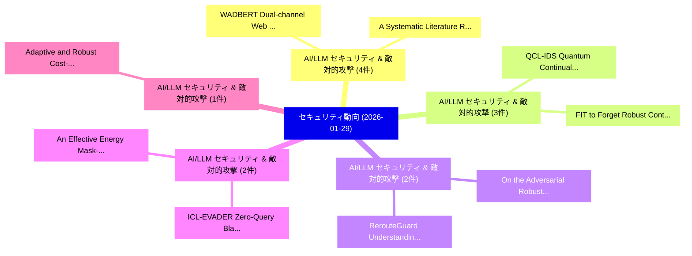

# 📅 02_daily: 日次エグゼクティブサマリー報告書 (2026-01-29)

**集計日時**: 2026-10-02 23:05:55 UTC  
**対象日付**: 2026-01-29  
**本日収集論文数**: 33 件  

---

## 💡 主要セキュリティ動向・脅威インサイト (Executive Insights)

本日の収集論文（計 33 件）において、以下の重点セキュリティ領域で活発な研究動向が確認されました：
- **AI/LLM セキュリティ & 敵対的攻撃** (4 件): 注目論文として 「WADBERT: Dual-channel Web Atta...」、「A Systematic Literature Review...」 等が発表され、実務防御および攻撃検証の進展が見られます。
- **AI/LLM セキュリティ & 敵対的攻撃** (3 件): 注目論文として 「QCL-IDS: Quantum Continual Lea...」、「FIT to Forget: Robust Continua...」 等が発表され、実務防御および攻撃検証の進展が見られます。
- **AI/LLM セキュリティ & 敵対的攻撃** (2 件): 注目論文として 「RerouteGuard: Understanding an...」、「On the Adversarial Robustness ...」 等が発表され、実務防御および攻撃検証の進展が見られます。
- **AI/LLM セキュリティ & 敵対的攻撃** (2 件): 注目論文として 「ICL-EVADER: Zero-Query Black-B...」、「An Effective Energy Mask-based...」 等が発表され、実務防御および攻撃検証の進展が見られます。
- **AI/LLM セキュリティ & 敵対的攻撃** (1 件): 注目論文として 「Adaptive and Robust Cost-Aware...」 等が発表され、実務防御および攻撃検証の進展が見られます。

### 🗺️ 技術・脅威トピックマインドマップ

---

## 📌 日次セキュリティ論文一覧 (日本語表形式)

| No | arXiv ID | 論文タイトル (日本語訳) | 重要キーワード | 構造化エグゼクティブ要約 (背景・提案・影響) | 脅威分類 | 詳細リンク |
|---|---|---|---|---|---|---|
| 1 | `2601.21189v1` | [Adaptive and Robust Cost-Aware Proof of Quality for Decentralized LLM Inference Networks（セキュリティ分析論文）](../../okf/papers/2026-01-29/2601.21189.md) | `Robust Cost`, `Aware Proof`, `Cost-Aware Proof` | 【提案】概要 (Overview & Key Finding) 本論文「Adaptive and Robust Cost-Aware Proof of Quality for Dec...。実証評価により経営層・セキュリティ管理者向け推奨アクション (E... | `cs.AI` | [arXiv](https://arxiv.org/abs/2601.21189v1) &#124; [OKF](../../okf/papers/2026-01-29/2601.21189.md) |
| 2 | `2601.21211v1` | [SPOILER-GUARD: Gating Latency Effects of Memory Accesses through Randomized Dependency Prediction（セキュリティ分析論文）](../../okf/papers/2026-01-29/2601.21211.md) | `Gating Latency Effects`, `Randomized Dependency Prediction`, `Memory Accesses` | 【提案】概要 (Overview & Key Finding) 本論文「SPOILER-GUARD: Gating Latency Effects of Memory Accesse...。実証評価により経営層・セキュリティ管理者向け推奨アクション (E... | `cybersecurity` | [arXiv](https://arxiv.org/abs/2601.21211v1) &#124; [OKF](../../okf/papers/2026-01-29/2601.21211.md) |
| 3 | `2601.21252v1` | [Lossless Copyright Protection via Intrinsic Model Fingerprinting（セキュリティ分析論文）](../../okf/papers/2026-01-29/2601.21252.md) | `Lossless Copyright Protection`, `Intrinsic Model Fingerprinting`, `Lingxiao Chen` | 【提案】概要 (Overview & Key Finding) 本論文「Lossless Copyright Protection via Intrinsic Model Finge...。実証評価により経営層・セキュリティ管理者向け推奨アクション (E... | `cs.CV` | [arXiv](https://arxiv.org/abs/2601.21252v1) &#124; [OKF](../../okf/papers/2026-01-29/2601.21252.md) |
| 4 | `2601.21258v1` | [Virtualization-based Penetration Testing Study for Detecting Accessibility Abuse Vulnerabilities in Banking Apps in East and Southeast Asia（セキュリティ分析論文）](../../okf/papers/2026-01-29/2601.21258.md) | `Detecting Accessibility Abuse Vulnerabilities`, `Banking Apps`, `Southeast Asia` | 【提案】概要 (Overview & Key Finding) 本論文「Virtualization-based Penetration Testing Study for Dete...。実証評価により経営層・セキュリティ管理者向け推奨アクション (E... | `executive-summary` | [arXiv](https://arxiv.org/abs/2601.21258v1) &#124; [OKF](../../okf/papers/2026-01-29/2601.21258.md) |
| 5 | `2601.21261v1` | [User-Centric Phishing Detection: A RAG and LLM-Based Approach（セキュリティ分析論文）](../../okf/papers/2026-01-29/2601.21261.md) | `Centric Phishing Detection`, `User-Centric Phishing`, `Abrar Hamed Al Barwani` | 【提案】概要 (Overview & Key Finding) 本論文「User-Centric Phishing Detection: A RAG and LLM-Based Ap...。実証評価により経営層・セキュリティ管理者向け推奨アクション (E... | `cybersecurity` | [arXiv](https://arxiv.org/abs/2601.21261v1) &#124; [OKF](../../okf/papers/2026-01-29/2601.21261.md) |
| 6 | `2601.21287v1` | [Zero Rotation and Beyond: Architecting Neural Networks for Fast Secure Inference with Homomorphic Encryptionに向けて](../../okf/papers/2026-01-29/2601.21287.md) | `Architecting Neural Networks`, `Fast Secure Inference`, `Zero Rotation` | 【提案】概要 (Overview & Key Finding) 本論文「Zero Rotation and Beyond: Architecting Neural Networks ...。実証評価により経営層・セキュリティ管理者向け推奨アクション (E... | `cybersecurity` | [arXiv](https://arxiv.org/abs/2601.21287v1) &#124; [OKF](../../okf/papers/2026-01-29/2601.21287.md) |
| 7 | `2601.21318v2` | [QCL-IDS: Quantum Continual Learning for Intrusion Detection with Fidelity-Anchored Stability and Generative Replay（セキュリティ分析論文）](../../okf/papers/2026-01-29/2601.21318.md) | `Quantum Continual Learning`, `Intrusion Detection`, `Anchored Stability` | 【提案】概要 (Overview & Key Finding) 本論文「QCL-IDS: 量子 Continual Learning for Intrusion Detection ...。実証評価により経営層・セキュリティ管理者向け推奨アクション (E... | `executive-summary` | [arXiv](https://arxiv.org/abs/2601.21318v2) &#124; [OKF](../../okf/papers/2026-01-29/2601.21318.md) |
| 8 | `2601.21353v1` | [SecIC3: Customizing IC3 for Hardware Security Verification（セキュリティ分析論文）](../../okf/papers/2026-01-29/2601.21353.md) | `Hardware Security Verification`, `Qinhan Tan`, `Akash Gaonkar` | 【提案】概要 (Overview & Key Finding) 本論文「SecIC3: Customizing IC3 for Hardware Security Verificat...。実証評価により経営層・セキュリティ管理者向け推奨アクション (E... | `cybersecurity` | [arXiv](https://arxiv.org/abs/2601.21353v1) &#124; [OKF](../../okf/papers/2026-01-29/2601.21353.md) |
| 9 | `2601.21380v1` | [RerouteGuard: Understanding and Mitigating Adversarial Risks for LLM Routing（セキュリティ分析論文）](../../okf/papers/2026-01-29/2601.21380.md) | `Mitigating Adversarial Risks`, `Wenhui Zhang`, `Huiyu Xu` | 【提案】概要 (Overview & Key Finding) 本論文「RerouteGuard: Understanding and Mitigating Adversarial ...。実証評価により経営層・セキュリティ管理者向け推奨アクション (E... | `cybersecurity` | [arXiv](https://arxiv.org/abs/2601.21380v1) &#124; [OKF](../../okf/papers/2026-01-29/2601.21380.md) |
| 10 | `2601.21531v2` | [On the Adversarial Robustness of Large Vision-Language Models under Visual Token Compression（セキュリティ分析論文）](../../okf/papers/2026-01-29/2601.21531.md) | `Visual Token Compression`, `Adversarial Robustness`, `Large Vision` | 【提案】概要 (Overview & Key Finding) 本論文「On the Adversarial Robustness of Large Vision-Language ...。実証評価により経営層・セキュリティ管理者向け推奨アクション (E... | `cs.AI` | [arXiv](https://arxiv.org/abs/2601.21531v2) &#124; [OKF](../../okf/papers/2026-01-29/2601.21531.md) |
| 11 | `2601.21586v1` | [ICL-EVADER: Zero-Query Black-Box Evasion Attacks on In-Context Learning and Their Defenses（セキュリティ分析論文）](../../okf/papers/2026-01-29/2601.21586.md) | `Box Evasion Attacks`, `Query Black`, `Context Learning` | 【提案】概要 (Overview & Key Finding) 本論文「ICL-EVADER: Zero-Query Black-Box Evasion Attacks on In-...。実証評価により経営層・セキュリティ管理者向け推奨アクション (E... | `cybersecurity` | [arXiv](https://arxiv.org/abs/2601.21586v1) &#124; [OKF](../../okf/papers/2026-01-29/2601.21586.md) |
| 12 | `2601.21628v2` | [Noise as a Probe: Membership Inference Attacks on Diffusion Models Leveraging Initial Noise（セキュリティ分析論文）](../../okf/papers/2026-01-29/2601.21628.md) | `Diffusion Models Leveraging Initial Noise`, `Membership Inference Attacks`, `Puwei Lian` | 【提案】概要 (Overview & Key Finding) 本論文「Noise as a Probe: Membership Inference Attacks on Diffu...。実証評価により経営層・セキュリティ管理者向け推奨アクション (E... | `executive-summary` | [arXiv](https://arxiv.org/abs/2601.21628v2) &#124; [OKF](../../okf/papers/2026-01-29/2601.21628.md) |
| 13 | `2601.21636v3` | [Sampling-Free Privacy Accounting for Matrix Mechanisms under Random Allocation（セキュリティ分析論文）](../../okf/papers/2026-01-29/2601.21636.md) | `Free Privacy Accounting`, `Matrix Mechanisms`, `Random Allocation` | 【提案】概要 (Overview & Key Finding) 本論文「Sampling-Free Privacy Accounting for Matrix Mechanisms ...。実証評価により経営層・セキュリティ管理者向け推奨アクション (E... | `executive-summary` | [arXiv](https://arxiv.org/abs/2601.21636v3) &#124; [OKF](../../okf/papers/2026-01-29/2601.21636.md) |
| 14 | `2601.21657v1` | [Authenticated encryption for space telemetry（セキュリティ分析論文）](../../okf/papers/2026-01-29/2601.21657.md) | `Andrew Savchenko`, `Raw Meta`, `Executive Summary` | 【提案】概要 (Overview & Key Finding) 本論文「Authenticated encryption for space telemetry（セキュリティ分析論文...。実証評価により経営層・セキュリティ管理者向け推奨アクション (E... | `cs.NI` | [arXiv](https://arxiv.org/abs/2601.21657v1) &#124; [OKF](../../okf/papers/2026-01-29/2601.21657.md) |
| 15 | `2601.21680v2` | [Incremental Fingerprinting in an Open World（セキュリティ分析論文）](../../okf/papers/2026-01-29/2601.21680.md) | `Incremental Fingerprinting`, `Open World`, `Einar Broch Johnsen` | 【提案】概要 (Overview & Key Finding) 本論文「Incremental Fingerprinting in an Open World（セキュリティ分析論文）...。実証評価により経営層・セキュリティ管理者向け推奨アクション (E... | `cs.LO` | [arXiv](https://arxiv.org/abs/2601.21680v2) &#124; [OKF](../../okf/papers/2026-01-29/2601.21680.md) |
| 16 | `2601.21682v2` | [FIT to Forget: Robust Continual Unlearning for 大規模言語モデル](../../okf/papers/2026-01-29/2601.21682.md) | `Robust Continual Unlearning`, `Large Language Models`, `Xiaoyu Xu` | 【提案】概要 (Overview & Key Finding) 本論文「FIT to Forget: Robust Continual Unlearning for 大規模言語モデル...。実証評価により経営層・セキュリティ管理者向け推奨アクション (E... | `cs.AI` | [arXiv](https://arxiv.org/abs/2601.21682v2) &#124; [OKF](../../okf/papers/2026-01-29/2601.21682.md) |
| 17 | `2601.21893v1` | [WADBERT: Dual-channel Web Attack Detection Based on BERT Models（セキュリティ分析論文）](../../okf/papers/2026-01-29/2601.21893.md) | `Web Attack Detection Based`, `Dual-channel Web`, `Kangqiang Luo` | 【提案】概要 (Overview & Key Finding) 本論文「WADBERT: Dual-channel Web Attack Detection Based on BER...。実証評価により経営層・セキュリティ管理者向け推奨アクション (E... | `cybersecurity` | [arXiv](https://arxiv.org/abs/2601.21893v1) &#124; [OKF](../../okf/papers/2026-01-29/2601.21893.md) |
| 18 | `2601.21898v2` | [Making Models Unmergeable via Scaling-Sensitive Loss Landscape（セキュリティ分析論文）](../../okf/papers/2026-01-29/2601.21898.md) | `Making Models Unmergeable`, `Sensitive Loss Landscape`, `Scaling-Sensitive Loss` | 【提案】概要 (Overview & Key Finding) 本論文「Making Models Unmergeable via Scaling-Sensitive Loss La...。実証評価により経営層・セキュリティ管理者向け推奨アクション (E... | `cs.AI` | [arXiv](https://arxiv.org/abs/2601.21898v2) &#124; [OKF](../../okf/papers/2026-01-29/2601.21898.md) |
| 19 | `2601.21902v2` | [Hardware-Triggered Backdoors（セキュリティ分析論文）](../../okf/papers/2026-01-29/2601.21902.md) | `Triggered Backdoors`, `Hardware-Triggered Backdoors`, `Erik Imgrund` | 【提案】概要 (Overview & Key Finding) 本論文「Hardware-Triggered Backdoors（セキュリティ分析論文）」（原題: Hardware-...。実証評価により経営層・セキュリティ管理者向け推奨アクション (E... | `executive-summary` | [arXiv](https://arxiv.org/abs/2601.21902v2) &#124; [OKF](../../okf/papers/2026-01-29/2601.21902.md) |
| 20 | `2601.21910v1` | [Beyond the Finite Variant Property: Extending Symbolic Diffie-Hellman Group Models (Extended Version)（セキュリティ分析論文）](../../okf/papers/2026-01-29/2601.21910.md) | `Finite Variant Property`, `Extending Symbolic Diffie`, `Hellman Group Models` | 【提案】概要 (Overview & Key Finding) 本論文「Beyond the Finite Variant Property: Extending Symbolic ...。実証評価により経営層・セキュリティ管理者向け推奨アクション (E... | `cybersecurity` | [arXiv](https://arxiv.org/abs/2601.21910v1) &#124; [OKF](../../okf/papers/2026-01-29/2601.21910.md) |
| 21 | `2601.21966v1` | [Secure Group Key Agreement on Cyber-Physical System Buses（セキュリティ分析論文）](../../okf/papers/2026-01-29/2601.21966.md) | `Secure Group Key Agreement`, `Physical System Buses`, `Cyber-Physical System` | 【提案】概要 (Overview & Key Finding) 本論文「Secure Group Key Agreement on Cyber-Physical System Bus...。実証評価によりPeters, Lukas Lautenschla... | `cybersecurity` | [arXiv](https://arxiv.org/abs/2601.21966v1) &#124; [OKF](../../okf/papers/2026-01-29/2601.21966.md) |
| 22 | `2601.22136v2` | [StepShield: When, Not Whether to Intervene on Rogue Agents（セキュリティ分析論文）](../../okf/papers/2026-01-29/2601.22136.md) | `Rogue Agents`, `Milan Hussain Angati`, `Gloria Felicia` | 【提案】背景とセキュリティ上の課題 (Background & Problem) 本研究はサイバー脅威環境におけるセキュリティ構造・脆弱性の検証を目的としています。(主要検出項目: ...。実証評価により経営層・セキュリティ管理者向け推奨アクション (E... | `cs.AI` | [arXiv](https://arxiv.org/abs/2601.22136v2) &#124; [OKF](../../okf/papers/2026-01-29/2601.22136.md) |
| 23 | `2601.22159v2` | [RedSage: A サイバーセキュリティ Generalist LLM](../../okf/papers/2026-01-29/2601.22159.md) | `Cybersecurity Generalist`, `Syed Talal Wasim`, `Naufal Suryanto` | 【提案】概要 (Overview & Key Finding) 本論文「RedSage: A サイバーセキュリティ Generalist LLM」（原題: RedSage: A Cy...。実証評価により経営層・セキュリティ管理者向け推奨アクション (E... | `cs.AI` | [arXiv](https://arxiv.org/abs/2601.22159v2) &#124; [OKF](../../okf/papers/2026-01-29/2601.22159.md) |
| 24 | `2601.22196v1` | [Linux Kernel Recency Matters, CVE Severity Doesn't, and History Fades（セキュリティ分析論文）](../../okf/papers/2026-01-29/2601.22196.md) | `Linux Kernel Recency Matters`, `Severity Doesn`, `History Fades` | 【提案】概要 (Overview & Key Finding) 本論文「Linux Kernel Recency Matters, CVE Severity Doesn't, and...。実証評価により経営層・セキュリティ管理者向け推奨アクション (E... | `executive-summary` | [arXiv](https://arxiv.org/abs/2601.22196v1) &#124; [OKF](../../okf/papers/2026-01-29/2601.22196.md) |
| 25 | `2601.22240v1` | [A Systematic Literature Review on LLM Defenses Against Prompt Injection and Jailbreaking: Expanding NIST Taxonomy（セキュリティ分析論文）](../../okf/papers/2026-01-29/2601.22240.md) | `Systematic Literature Review`, `Ygor Acacio Maria`, `Victor Takashi Hayashi` | 【提案】概要 (Overview & Key Finding) 本論文「A Systematic Literature Review on LLM Defenses Against ...。実証評価により経営層・セキュリティ管理者向け推奨アクション (E... | `cs.AI` | [arXiv](https://arxiv.org/abs/2601.22240v1) &#124; [OKF](../../okf/papers/2026-01-29/2601.22240.md) |
| 26 | `2601.22246v3` | [MirrorMark: Generalizable Mirrored Sampling for Multi-bit LLM Watermarking（セキュリティ分析論文）](../../okf/papers/2026-01-29/2601.22246.md) | `Generalizable Mirrored Sampling`, `Multi-bit LLM`, `Massieh Kordi Boroujeny` | 【提案】概要 (Overview & Key Finding) 本論文「MirrorMark: Generalizable Mirrored Sampling for Multi-b...。実証評価により経営層・セキュリティ管理者向け推奨アクション (E... | `cs.AI` | [arXiv](https://arxiv.org/abs/2601.22246v3) &#124; [OKF](../../okf/papers/2026-01-29/2601.22246.md) |
| 27 | `2601.22302v1` | [ZK-HybridFL: Zero-Knowledge Proof-Enhanced Hybrid Ledger for 連合学習](../../okf/papers/2026-01-29/2601.22302.md) | `Enhanced Hybrid Ledger`, `Knowledge Proof`, `Zero-Knowledge Proof` | 【提案】概要 (Overview & Key Finding) 本論文「ZK-HybridFL: ゼロ知識証明-Enhanced Hybrid Ledger for 連合学習」（原題...。実証評価により経営層・セキュリティ管理者向け推奨アクション (E... | `executive-summary` | [arXiv](https://arxiv.org/abs/2601.22302v1) &#124; [OKF](../../okf/papers/2026-01-29/2601.22302.md) |
| 28 | `2601.22308v2` | [Stealthy Poisoning Attacks Bypass Defenses in Regression Settings（セキュリティ分析論文）](../../okf/papers/2026-01-29/2601.22308.md) | `Stealthy Poisoning Attacks Bypass Defenses`, `Regression Settings`, `Javier Carnerero` | 【提案】概要 (Overview & Key Finding) 本論文「Stealthy Poisoning Attacks Bypass Defenses in Regressio...。実証評価により経営層・セキュリティ管理者向け推奨アクション (E... | `cs.AI` | [arXiv](https://arxiv.org/abs/2601.22308v2) &#124; [OKF](../../okf/papers/2026-01-29/2601.22308.md) |
| 29 | `2601.22390v1` | [An Effective Energy Mask-based Adversarial Evasion Attacks against Misclassification in Speaker Recognition Systems（セキュリティ分析論文）](../../okf/papers/2026-01-29/2601.22390.md) | `Adversarial Evasion Attacks`, `Speaker Recognition Systems`, `Mask-based Adversarial` | 【提案】概要 (Overview & Key Finding) 本論文「An Effective Energy Mask-based Adversarial Evasion Atta...。実証評価により経営層・セキュリティ管理者向け推奨アクション (E... | `executive-summary` | [arXiv](https://arxiv.org/abs/2601.22390v1) &#124; [OKF](../../okf/papers/2026-01-29/2601.22390.md) |
| 30 | `2601.22414v1` | [PriviSense: A Frida-Based Framework for Multi-Sensor Spoofing on Android（セキュリティ分析論文）](../../okf/papers/2026-01-29/2601.22414.md) | `Sensor Spoofing`, `Multi-Sensor Spoofing`, `Ibrahim Khalilov` | 【提案】概要 (Overview & Key Finding) 本論文「PriviSense: A Frida-Based Framework for Multi-Sensor Sp...。実証評価により経営層・セキュリティ管理者向け推奨アクション (E... | `executive-summary` | [arXiv](https://arxiv.org/abs/2601.22414v1) &#124; [OKF](../../okf/papers/2026-01-29/2601.22414.md) |
| 31 | `2602.00154v1` | [ReasoningBomb: A Stealthy Denial-of-Service Attack by Inducing Pathologically Long Reasoning in Large Reasoning Models（セキュリティ分析論文）](../../okf/papers/2026-01-29/2602.00154.md) | `Inducing Pathologically Long Reasoning`, `Large Reasoning Models`, `Stealthy Denial` | 【提案】概要 (Overview & Key Finding) 本論文「ReasoningBomb: A Stealthy Denial-of-Service Attack by I...。実証評価により経営層・セキュリティ管理者向け推奨アクション (E... | `cs.AI` | [arXiv](https://arxiv.org/abs/2602.00154v1) &#124; [OKF](../../okf/papers/2026-01-29/2602.00154.md) |
| 32 | `2602.00160v1` | [First Steps, Lasting Impact: Platform-Aware Forensics for the Next Generation of Analysts（セキュリティ分析論文）](../../okf/papers/2026-01-29/2602.00160.md) | `First Steps`, `Lasting Impact`, `Aware Forensics` | 【提案】概要 (Overview & Key Finding) 本論文「First Steps, Lasting Impact: Platform-Aware Forensics f...。実証評価により経営層・セキュリティ管理者向け推奨アクション (E... | `executive-summary` | [arXiv](https://arxiv.org/abs/2602.00160v1) &#124; [OKF](../../okf/papers/2026-01-29/2602.00160.md) |
| 33 | `2604.16309v1` | [AgentGuard: A Multi-Agent Framework for Robust Package Confusion Detection via Hybrid Search and Metadata-Content Fusion（セキュリティ分析論文）](../../okf/papers/2026-01-29/2604.16309.md) | `Robust Package Confusion Detection`, `Hybrid Search`, `Content Fusion` | 【提案】概要 (Overview & Key Finding) 本論文「AgentGuard: A Multi-Agent Framework for Robust Package ...。実証評価により経営層・セキュリティ管理者向け推奨アクション (E... | `executive-summary` | [arXiv](https://arxiv.org/abs/2604.16309v1) &#124; [OKF](../../okf/papers/2026-01-29/2604.16309.md) |

