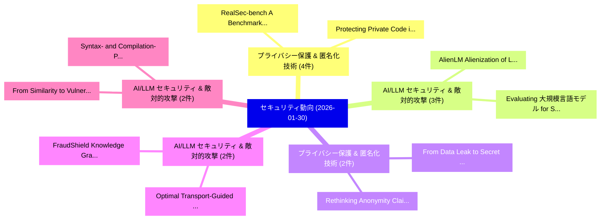

# 📅 02_daily: 日次エグゼクティブサマリー報告書 (2026-01-30)

**集計日時**: 2026-10-02 23:05:56 UTC  
**対象日付**: 2026-01-30  
**本日収集論文数**: 47 件  

---

## 💡 主要セキュリティ動向・脅威インサイト (Executive Insights)

本日の収集論文（計 47 件）において、以下の重点セキュリティ領域で活発な研究動向が確認されました：
- **プライバシー保護 & 匿名化技術** (4 件): 注目論文として 「RealSec-bench: A Benchmark for...」、「Protecting Private Code in IDE...」 等が発表され、実務防御および攻撃検証の進展が見られます。
- **AI/LLM セキュリティ & 敵対的攻撃** (3 件): 注目論文として 「AlienLM: Alienization of Langu...」、「Evaluating 大規模言語モデル for Securi...」 等が発表され、実務防御および攻撃検証の進展が見られます。
- **プライバシー保護 & 匿名化技術** (2 件): 注目論文として 「Rethinking Anonymity Claims in...」、「From Data Leak to Secret Misse...」 等が発表され、実務防御および攻撃検証の進展が見られます。
- **AI/LLM セキュリティ & 敵対的攻撃** (2 件): 注目論文として 「FraudShield: Knowledge Graph E...」、「Optimal Transport-Guided Graph...」 等が発表され、実務防御および攻撃検証の進展が見られます。
- **AI/LLM セキュリティ & 敵対的攻撃** (2 件): 注目論文として 「From Similarity to Vulnerabili...」、「Syntax- and Compilation-Preser...」 等が発表され、実務防御および攻撃検証の進展が見られます。

### 🗺️ 技術・脅威トピックマインドマップ

---

## 📌 日次セキュリティ論文一覧 (日本語表形式)

| No | arXiv ID | 論文タイトル (日本語訳) | 重要キーワード | 構造化エグゼクティブ要約 (背景・提案・影響) | 脅威分類 | 詳細リンク |
|---|---|---|---|---|---|---|
| 1 | `2601.22434v1` | [Rethinking Anonymity Claims in Synthetic Data Generation: A Model-Centric Privacy Attack Perspective（セキュリティ分析論文）](../../okf/papers/2026-01-30/2601.22434.md) | `Centric Privacy Attack Perspective`, `Rethinking Anonymity Claims`, `Synthetic Data Generation` | 【提案】概要 (Overview & Key Finding) 本論文「Rethinking Anonymity Claims in Synthetic Data Generatio...。実証評価により経営層・セキュリティ管理者向け推奨アクション (E... | `executive-summary` | [arXiv](https://arxiv.org/abs/2601.22434v1) &#124; [OKF](../../okf/papers/2026-01-30/2601.22434.md) |
| 2 | `2601.22472v1` | [The Third-Party Access Effect: An Overlooked Challenge in Secondary Use of Educational Real-World Data（セキュリティ分析論文）](../../okf/papers/2026-01-30/2601.22472.md) | `Party Access Effect`, `Secondary Use`, `Educational Real` | 【提案】概要 (Overview & Key Finding) 本論文「The Third-Party Access Effect: An Overlooked Challenge ...。実証評価により経営層・セキュリティ管理者向け推奨アクション (E... | `executive-summary` | [arXiv](https://arxiv.org/abs/2601.22472v1) &#124; [OKF](../../okf/papers/2026-01-30/2601.22472.md) |
| 3 | `2601.22485v1` | [FraudShield: Knowledge Graph Empowered Defense for LLMs against Fraud Attacks（セキュリティ分析論文）](../../okf/papers/2026-01-30/2601.22485.md) | `Knowledge Graph Empowered Defense`, `Fraud Attacks`, `Naen Xu` | 【提案】概要 (Overview & Key Finding) 本論文「FraudShield: Knowledge Graph Empowered Defense for LLMs...。実証評価により経営層・セキュリティ管理者向け推奨アクション (E... | `cs.AI` | [arXiv](https://arxiv.org/abs/2601.22485v1) &#124; [OKF](../../okf/papers/2026-01-30/2601.22485.md) |
| 4 | `2601.22556v1` | [VocBulwark: Practical Generative Speech Watermarking via Additional-Parameter Injectionに向けて](../../okf/papers/2026-01-30/2601.22556.md) | `Towards Practical Generative Speech Watermarking`, `Practical Generative Speech Watermarking`, `Parameter Injection` | 【提案】概要 (Overview & Key Finding) 本論文「VocBulwark: Practical Generative Speech Watermarking vi...。実証評価により経営層・セキュリティ管理者向け推奨アクション (E... | `cybersecurity` | [arXiv](https://arxiv.org/abs/2601.22556v1) &#124; [OKF](../../okf/papers/2026-01-30/2601.22556.md) |
| 5 | `2601.22569v2` | [Whispers of Wealth: Red-Teaming Google's Agent Payments Protocol via Prompt Injection（セキュリティ分析論文）](../../okf/papers/2026-01-30/2601.22569.md) | `Agent Payments Protocol`, `Teaming Google`, `Red-Teaming Google` | 【提案】概要 (Overview & Key Finding) 本論文「Whispers of Wealth: Red-Teaming Google's Agent Payments...。実証評価により経営層・セキュリティ管理者向け推奨アクション (E... | `cs.AI` | [arXiv](https://arxiv.org/abs/2601.22569v2) &#124; [OKF](../../okf/papers/2026-01-30/2601.22569.md) |
| 6 | `2601.22653v1` | [Human-Centered Explainability in AI-Enhanced UI Security Interfaces: Designing Trustworthy Copilots for サイバーセキュリティ Analysts](../../okf/papers/2026-01-30/2601.22653.md) | `Designing Trustworthy Copilots`, `Centered Explainability`, `Human-Centered Explainability` | 【提案】概要 (Overview & Key Finding) 本論文「Human-Centered Explainability in AI-Enhanced UI Securit...。実証評価により経営層・セキュリティ管理者向け推奨アクション (E... | `cs.AI` | [arXiv](https://arxiv.org/abs/2601.22653v1) &#124; [OKF](../../okf/papers/2026-01-30/2601.22653.md) |
| 7 | `2601.22655v3` | [Do Fine-Tuned LLMs Understand Vulnerabilities? An Investigation into the Semantic Trap（セキュリティ分析論文）](../../okf/papers/2026-01-30/2601.22655.md) | `Fine-Tuned LLMs`, `Understand Vulnerabilities`, `Semantic Trap` | 【提案】An Investigation into the Semantic Trap ### (日本語題名: Do Fine-Tuned LLMs Understand Vulne...。実証評価により経営層・セキュリティ管理者向け推奨アクション (E... | `executive-summary` | [arXiv](https://arxiv.org/abs/2601.22655v3) &#124; [OKF](../../okf/papers/2026-01-30/2601.22655.md) |
| 8 | `2601.22692v1` | [FNF: Functional Network Fingerprint for 大規模言語モデル](../../okf/papers/2026-01-30/2601.22692.md) | `Functional Network Fingerprint`, `Large Language Models`, `Yiheng Liu` | 【提案】概要 (Overview & Key Finding) 本論文「FNF: Functional Network Fingerprint for 大規模言語モデル」（原題: F...。実証評価により経営層・セキュリティ管理者向け推奨アクション (E... | `cs.AI` | [arXiv](https://arxiv.org/abs/2601.22692v1) &#124; [OKF](../../okf/papers/2026-01-30/2601.22692.md) |
| 9 | `2601.22706v1` | [RealSec-bench: A Benchmark for Evaluating Secure Code Generation in Real-World Repositories（セキュリティ分析論文）](../../okf/papers/2026-01-30/2601.22706.md) | `Evaluating Secure Code Generation`, `World Repositories`, `Real-World Repositories` | 【提案】概要 (Overview & Key Finding) 本論文「RealSec-bench: A Benchmark for Evaluating Secure Code G...。実証評価により経営層・セキュリティ管理者向け推奨アクション (E... | `executive-summary` | [arXiv](https://arxiv.org/abs/2601.22706v1) &#124; [OKF](../../okf/papers/2026-01-30/2601.22706.md) |
| 10 | `2601.22710v2` | [AlienLM: Alienization of Language for API-Boundary Privacy in Black-Box LLMs（セキュリティ分析論文）](../../okf/papers/2026-01-30/2601.22710.md) | `Boundary Privacy`, `API-Boundary Privacy`, `Black-Box LLMs` | 【提案】概要 (Overview & Key Finding) 本論文「AlienLM: Alienization of Language for API-Boundary Priv...。実証評価により経営層・セキュリティ管理者向け推奨アクション (E... | `executive-summary` | [arXiv](https://arxiv.org/abs/2601.22710v2) &#124; [OKF](../../okf/papers/2026-01-30/2601.22710.md) |
| 11 | `2601.22720v1` | [AEGIS: White-Box Attack Path Generation using LLMs and Training Effectiveness Evaluation for Large-Scale Cyber Defence Exercises（セキュリティ分析論文）](../../okf/papers/2026-01-30/2601.22720.md) | `Box Attack Path Generation`, `Scale Cyber Defence Exercises`, `White-Box Attack` | 【提案】概要 (Overview & Key Finding) 本論文「AEGIS: White-Box Attack Path Generation using LLMs and ...。実証評価により# AEGIS: White-Box Attack... | `cs.AI` | [arXiv](https://arxiv.org/abs/2601.22720v1) &#124; [OKF](../../okf/papers/2026-01-30/2601.22720.md) |
| 12 | `2601.22744v1` | [Beauty and the Beast: Imperceptible Perturbations Against Diffusion-Based Face Swapping via Directional Attribute Editing（セキュリティ分析論文）](../../okf/papers/2026-01-30/2601.22744.md) | `Based Face Swapping`, `Directional Attribute Editing`, `Diffusion-Based Face` | 【提案】概要 (Overview & Key Finding) 本論文「Beauty and the Beast: Imperceptible Perturbations Again...。実証評価により経営層・セキュリティ管理者向け推奨アクション (E... | `cs.CV` | [arXiv](https://arxiv.org/abs/2601.22744v1) &#124; [OKF](../../okf/papers/2026-01-30/2601.22744.md) |
| 13 | `2601.22770v2` | [Okara: Detection and Attribution of TLS Man-in-the-Middle Vulnerabilities in Android Apps with Foundation Models（セキュリティ分析論文）](../../okf/papers/2026-01-30/2601.22770.md) | `Middle Vulnerabilities`, `Android Apps`, `Foundation Models` | 【提案】概要 (Overview & Key Finding) 本論文「Okara: Detection and Attribution of TLS 中間者攻撃 Vulnerabi...。実証評価により経営層・セキュリティ管理者向け推奨アクション (E... | `cybersecurity` | [arXiv](https://arxiv.org/abs/2601.22770v2) &#124; [OKF](../../okf/papers/2026-01-30/2601.22770.md) |
| 14 | `2601.22772v2` | [Rust and Go directed fuzzing with LibAFL-DiFuzz（セキュリティ分析論文）](../../okf/papers/2026-01-30/2601.22772.md) | `Timofey Mezhuev`, `Darya Parygina`, `Daniil Kuts` | 【提案】概要 (Overview & Key Finding) 本論文「Rust and Go directed fuzzing with LibAFL-DiFuzz（セキュリティ分...。実証評価により経営層・セキュリティ管理者向け推奨アクション (E... | `cybersecurity` | [arXiv](https://arxiv.org/abs/2601.22772v2) &#124; [OKF](../../okf/papers/2026-01-30/2601.22772.md) |
| 15 | `2601.22778v2` | [Color Matters: Demosaicing-Guided Color Correlation Training for Generalizable AI-Generated Image Detection（セキュリティ分析論文）](../../okf/papers/2026-01-30/2601.22778.md) | `Guided Color Correlation Training`, `Generated Image Detection`, `Color Matters` | 【提案】概要 (Overview & Key Finding) 本論文「Color Matters: Demosaicing-Guided Color Correlation Tra...。実証評価により経営層・セキュリティ管理者向け推奨アクション (E... | `cs.CV` | [arXiv](https://arxiv.org/abs/2601.22778v2) &#124; [OKF](../../okf/papers/2026-01-30/2601.22778.md) |
| 16 | `2601.22800v1` | [Trackly: A Unified SaaS Platform for User Behavior Analytics and Real Time Rule Based Anomaly Detection（セキュリティ分析論文）](../../okf/papers/2026-01-30/2601.22800.md) | `Real Time Rule Based Anomaly Detection`, `User Behavior Analytics`, `Md Zahurul Haque` | 【提案】概要 (Overview & Key Finding) 本論文「Trackly: A Unified SaaS Platform for User Behavior Anal...。実証評価により経営層・セキュリティ管理者向け推奨アクション (E... | `executive-summary` | [arXiv](https://arxiv.org/abs/2601.22800v1) &#124; [OKF](../../okf/papers/2026-01-30/2601.22800.md) |
| 17 | `2601.22804v2` | [Trojan-Resilient NTT: Protecting Against Control Flow and Timing Faults on Reconfigurable Platforms（セキュリティ分析論文）](../../okf/papers/2026-01-30/2601.22804.md) | `Timing Faults`, `Reconfigurable Platforms`, `Trojan-Resilient NTT` | 【提案】概要 (Overview & Key Finding) 本論文「Trojan-Resilient NTT: Protecting Against Control Flow a...。実証評価により経営層・セキュリティ管理者向け推奨アクション (E... | `executive-summary` | [arXiv](https://arxiv.org/abs/2601.22804v2) &#124; [OKF](../../okf/papers/2026-01-30/2601.22804.md) |
| 18 | `2601.22818v2` | [Hide and Seek in Embedding Space: Geometry-based Steganography and Detection in 大規模言語モデル](../../okf/papers/2026-01-30/2601.22818.md) | `Embedding Space`, `Geometry-based Steganography`, `Large Language Models` | 【提案】概要 (Overview & Key Finding) 本論文「Hide and Seek in Embedding Space: Geometry-based Stegan...。実証評価により経営層・セキュリティ管理者向け推奨アクション (E... | `cs.AI` | [arXiv](https://arxiv.org/abs/2601.22818v2) &#124; [OKF](../../okf/papers/2026-01-30/2601.22818.md) |
| 19 | `2601.22892v1` | [Assessing the Real-World Impact of Post-Quantum Cryptography on WPA-Enterprise Networks（セキュリティ分析論文）](../../okf/papers/2026-01-30/2601.22892.md) | `World Impact`, `Quantum Cryptography`, `Enterprise Networks` | 【提案】概要 (Overview & Key Finding) 本論文「Assessing the Real-World Impact of ポスト量子暗号 on WPA-Enter...。実証評価により経営層・セキュリティ管理者向け推奨アクション (E... | `cs.NI` | [arXiv](https://arxiv.org/abs/2601.22892v1) &#124; [OKF](../../okf/papers/2026-01-30/2601.22892.md) |
| 20 | `2601.22921v1` | [Evaluating 大規模言語モデル for Security Bug Report Prediction](../../okf/papers/2026-01-30/2601.22921.md) | `Security Bug Report Prediction`, `Evaluating Large Language Models`, `Farnaz Soltaniani` | 【提案】概要 (Overview & Key Finding) 本論文「Evaluating 大規模言語モデル for Security Bug Report Prediction」...。実証評価により経営層・セキュリティ管理者向け推奨アクション (E... | `cs.AI` | [arXiv](https://arxiv.org/abs/2601.22921v1) &#124; [OKF](../../okf/papers/2026-01-30/2601.22921.md) |
| 21 | `2601.22929v2` | [Semantic Leakage from Image Embeddings（セキュリティ分析論文）](../../okf/papers/2026-01-30/2601.22929.md) | `Semantic Leakage`, `Image Embeddings`, `Yiyi Chen` | 【提案】概要 (Overview & Key Finding) 本論文「Semantic Leakage from Image Embeddings（セキュリティ分析論文）」（原題:...。実証評価により経営層・セキュリティ管理者向け推奨アクション (E... | `cs.CV` | [arXiv](https://arxiv.org/abs/2601.22929v2) &#124; [OKF](../../okf/papers/2026-01-30/2601.22929.md) |
| 22 | `2601.22935v1` | [Protecting Private Code in IDE Autocomplete using Differential Privacy（セキュリティ分析論文）](../../okf/papers/2026-01-30/2601.22935.md) | `Protecting Private Code`, `Differential Privacy`, `Evgeny Grigorenko` | 【提案】概要 (Overview & Key Finding) 本論文「Protecting Private Code in IDE Autocomplete using 差分プライ...。実証評価により経営層・セキュリティ管理者向け推奨アクション (E... | `cs.AI` | [arXiv](https://arxiv.org/abs/2601.22935v1) &#124; [OKF](../../okf/papers/2026-01-30/2601.22935.md) |
| 23 | `2601.22938v1` | [A Real-Time Privacy-Preserving Behavior Recognition System via Edge-Cloud Collaboration（セキュリティ分析論文）](../../okf/papers/2026-01-30/2601.22938.md) | `Preserving Behavior Recognition System`, `Time Privacy`, `Real-Time Privacy` | 【提案】概要 (Overview & Key Finding) 本論文「A Real-Time Privacy-Preserving Behavior Recognition Sys...。実証評価により経営層・セキュリティ管理者向け推奨アクション (E... | `cs.AI` | [arXiv](https://arxiv.org/abs/2601.22938v1) &#124; [OKF](../../okf/papers/2026-01-30/2601.22938.md) |
| 24 | `2601.22945v2` | [Persuasive Privacy（セキュリティ分析論文）](../../okf/papers/2026-01-30/2601.22945.md) | `Persuasive Privacy`, `James Bailie`, `Judith Rousseau` | 【提案】概要 (Overview & Key Finding) 本論文「Persuasive Privacy（セキュリティ分析論文）」（原題: Persuasive Privacy ...。実証評価により経営層・セキュリティ管理者向け推奨アクション (E... | `econ.TH` | [arXiv](https://arxiv.org/abs/2601.22945v2) &#124; [OKF](../../okf/papers/2026-01-30/2601.22945.md) |
| 25 | `2601.22946v1` | [From Data Leak to Secret Misses: The Impact of Data Leakage on Secret Detection Models（セキュリティ分析論文）](../../okf/papers/2026-01-30/2601.22946.md) | `Secret Detection Models`, `Secret Misses`, `Data Leakage` | 【提案】概要 (Overview & Key Finding) 本論文「From Data Leak to Secret Misses: The Impact of Data Lea...。実証評価により経営層・セキュリティ管理者向け推奨アクション (E... | `cs.AI` | [arXiv](https://arxiv.org/abs/2601.22946v1) &#124; [OKF](../../okf/papers/2026-01-30/2601.22946.md) |
| 26 | `2601.22949v1` | [Autonomous Chain-of-Thought Distillation for Graph-Based Fraud Detection（セキュリティ分析論文）](../../okf/papers/2026-01-30/2601.22949.md) | `Based Fraud Detection`, `Autonomous Chain`, `Thought Distillation` | 【提案】概要 (Overview & Key Finding) 本論文「Autonomous Chain-of-Thought Distillation for Graph-Base...。実証評価により経営層・セキュリティ管理者向け推奨アクション (E... | `executive-summary` | [arXiv](https://arxiv.org/abs/2601.22949v1) &#124; [OKF](../../okf/papers/2026-01-30/2601.22949.md) |
| 27 | `2601.22978v3` | [Triosecuris: Formally Verified Protection Against Speculative Control-Flow Hijacking（セキュリティ分析論文）](../../okf/papers/2026-01-30/2601.22978.md) | `Flow Hijacking`, `Control-Flow Hijacking`, `Formally Verified Protec` | 【提案】概要 (Overview & Key Finding) 本論文「Triosecuris: Formally Verified Protection Against Specu...。実証評価により経営層・セキュリティ管理者向け推奨アクション (E... | `cs.PL` | [arXiv](https://arxiv.org/abs/2601.22978v3) &#124; [OKF](../../okf/papers/2026-01-30/2601.22978.md) |
| 28 | `2601.22983v2` | [PIDSMaker: Building and Evaluating Provenance-based Intrusion Detection Systems（セキュリティ分析論文）](../../okf/papers/2026-01-30/2601.22983.md) | `Intrusion Detection Systems`, `Evaluating Provenance`, `Provenance-based Intrusion` | 【提案】概要 (Overview & Key Finding) 本論文「PIDSMaker: Building and Evaluating Provenance-based Int...。実証評価により経営層・セキュリティ管理者向け推奨アクション (E... | `executive-summary` | [arXiv](https://arxiv.org/abs/2601.22983v2) &#124; [OKF](../../okf/papers/2026-01-30/2601.22983.md) |
| 29 | `2601.23020v1` | [Uncovering Hidden Inclusions of Vulnerable Dependencies in Real-World Java Projects（セキュリティ分析論文）](../../okf/papers/2026-01-30/2601.23020.md) | `Uncovering Hidden Inclusions`, `World Java Projects`, `Vulnerable Dependencies` | 【提案】概要 (Overview & Key Finding) 本論文「Uncovering Hidden Inclusions of Vulnerable Dependencies...。実証評価により経営層・セキュリティ管理者向け推奨アクション (E... | `executive-summary` | [arXiv](https://arxiv.org/abs/2601.23020v1) &#124; [OKF](../../okf/papers/2026-01-30/2601.23020.md) |
| 30 | `2601.23062v1` | [Evaluating the Effectiveness of OpenAI's Parental Control System（セキュリティ分析論文）](../../okf/papers/2026-01-30/2601.23062.md) | `Parental Control System`, `Kerem Ersoz`, `Saleh Afroogh` | 【提案】概要 (Overview & Key Finding) 本論文「Evaluating the Effectiveness of OpenAI's Parental Contr...。実証評価により# Evaluating the Effectiv... | `executive-summary` | [arXiv](https://arxiv.org/abs/2601.23062v1) &#124; [OKF](../../okf/papers/2026-01-30/2601.23062.md) |
| 31 | `2601.23081v1` | [Character as a Latent Variable in 大規模言語モデル: A Mechanistic Account of Emergent Misalignment and Conditional Safety Failures](../../okf/papers/2026-01-30/2601.23081.md) | `Conditional Safety Failures`, `Latent Variable`, `Mechanistic Account` | 【提案】概要 (Overview & Key Finding) 本論文「Character as a Latent Variable in 大規模言語モデル: A Mechanist...。実証評価により経営層・セキュリティ管理者向け推奨アクション (E... | `cs.AI` | [arXiv](https://arxiv.org/abs/2601.23081v1) &#124; [OKF](../../okf/papers/2026-01-30/2601.23081.md) |
| 32 | `2601.23088v2` | [From Similarity to Vulnerability: Key Collision Attack on LLM Semantic Caching（セキュリティ分析論文）](../../okf/papers/2026-01-30/2601.23088.md) | `Key Collision Attack`, `Semantic Caching`, `Zhixiang Zhang` | 【提案】概要 (Overview & Key Finding) 本論文「From Similarity to 脆弱性: Key Collision Attack on LLM Sem...。実証評価により経営層・セキュリティ管理者向け推奨アクション (E... | `cs.AI` | [arXiv](https://arxiv.org/abs/2601.23088v2) &#124; [OKF](../../okf/papers/2026-01-30/2601.23088.md) |
| 33 | `2601.23092v1` | [WiFiPenTester: Advancing Wireless Ethical Hacking with Governed GenAI（セキュリティ分析論文）](../../okf/papers/2026-01-30/2601.23092.md) | `Advancing Wireless Ethical Hacking`, `Raw Meta`, `Executive Summary` | 【提案】概要 (Overview & Key Finding) 本論文「WiFiPenTester: Advancing Wireless Ethical Hacking with ...。実証評価によりAl-Sinani, Chr。 | `cs.AI` | [arXiv](https://arxiv.org/abs/2601.23092v1) &#124; [OKF](../../okf/papers/2026-01-30/2601.23092.md) |
| 34 | `2601.23132v2` | [Verifiable Manifest Signing and Transparency Enforcement for Secure MCP-Based LLM Pipelines（セキュリティ分析論文）](../../okf/papers/2026-01-30/2601.23132.md) | `Verifiable Manifest Signing`, `Transparency Enforcement`, `MCP-Based LLM` | 【提案】概要 (Overview & Key Finding) 本論文「Verifiable Manifest Signing and Transparency Enforcemen...。実証評価により経営層・セキュリティ管理者向け推奨アクション (E... | `cs.AI` | [arXiv](https://arxiv.org/abs/2601.23132v2) &#124; [OKF](../../okf/papers/2026-01-30/2601.23132.md) |
| 35 | `2601.23157v2` | [No More, No Less: Least-Privilege Language Models（セキュリティ分析論文）](../../okf/papers/2026-01-30/2601.23157.md) | `Privilege Language Models`, `Least-Privilege Language`, `Paulius Rauba` | 【提案】概要 (Overview & Key Finding) 本論文「No More, No Less: Least-Privilege Language Models（セキュリテ...。実証評価により経営層・セキュリティ管理者向け推奨アクション (E... | `executive-summary` | [arXiv](https://arxiv.org/abs/2601.23157v2) &#124; [OKF](../../okf/papers/2026-01-30/2601.23157.md) |
| 36 | `2601.23255v1` | [Now You Hear Me: Audio Narrative Attacks Against Large Audio-Language Models（セキュリティ分析論文）](../../okf/papers/2026-01-30/2601.23255.md) | `Language Models`, `Audio-Language Models`, `Ye Yu` | 【提案】概要 (Overview & Key Finding) 本論文「Now You Hear Me: Audio Narrative Attacks Against Large ...。実証評価により経営層・セキュリティ管理者向け推奨アクション (E... | `cs.AI` | [arXiv](https://arxiv.org/abs/2601.23255v1) &#124; [OKF](../../okf/papers/2026-01-30/2601.23255.md) |
| 37 | `2602.00182v1` | [EigenAI: Deterministic Inference, Verifiable Results（セキュリティ分析論文）](../../okf/papers/2026-01-30/2602.00182.md) | `Deterministic Inference`, `David Ribeiro Alves`, `Vishnu Patankar` | 【提案】概要 (Overview & Key Finding) 本論文「EigenAI: Deterministic Inference, Verifiable Results（セキ...。実証評価により経営層・セキュリティ管理者向け推奨アクション (E... | `cs.AI` | [arXiv](https://arxiv.org/abs/2602.00182v1) &#124; [OKF](../../okf/papers/2026-01-30/2602.00182.md) |
| 38 | `2602.00183v1` | [RPP: A Certified Poisoned-Sample Detection Framework for Backdoor Attacks under Dataset Imbalance（セキュリティ分析論文）](../../okf/papers/2026-01-30/2602.00183.md) | `Certified Poisoned`, `Backdoor Attacks`, `Dataset Imbalance` | 【提案】概要 (Overview & Key Finding) 本論文「RPP: A Certified Poisoned-Sample Detection Framework fo...。実証評価により経営層・セキュリティ管理者向け推奨アクション (E... | `cs.CV` | [arXiv](https://arxiv.org/abs/2602.00183v1) &#124; [OKF](../../okf/papers/2026-01-30/2602.00183.md) |
| 39 | `2602.00204v1` | [Semantic-Aware Advanced Persistent Threat Detection Using Autoencoders on LLM-Encoded System Logs（セキュリティ分析論文）](../../okf/papers/2026-01-30/2602.00204.md) | `Aware Advanced Persistent Threat Detection Using Autoencoders`, `Encoded System Logs`, `Semantic-Aware Advanced` | 【提案】概要 (Overview & Key Finding) 本論文「Semantic-Aware Advanced Persistent 脅威 Detection Using A...。実証評価により経営層・セキュリティ管理者向け推奨アクション (E... | `cs.AI` | [arXiv](https://arxiv.org/abs/2602.00204v1) &#124; [OKF](../../okf/papers/2026-01-30/2602.00204.md) |
| 40 | `2602.00213v1` | [TessPay: Verify-then-Pay Infrastructure for Trusted Agentic Commerce（セキュリティ分析論文）](../../okf/papers/2026-01-30/2602.00213.md) | `Trusted Agentic Commerce`, `Pay Infrastructure`, `Mehul Goenka` | 【提案】概要 (Overview & Key Finding) 本論文「TessPay: Verify-then-Pay Infrastructure for Trusted Age...。実証評価により経営層・セキュリティ管理者向け推奨アクション (E... | `cs.AI` | [arXiv](https://arxiv.org/abs/2602.00213v1) &#124; [OKF](../../okf/papers/2026-01-30/2602.00213.md) |
| 41 | `2602.00219v1` | [Tri-LLM Cooperative Federated Zero-Shot Intrusion Detection with Semantic Disagreement and Trust-Aware Aggregation（セキュリティ分析論文）](../../okf/papers/2026-01-30/2602.00219.md) | `Cooperative Federated Zero`, `Shot Intrusion Detection`, `Semantic Disagreement` | 【提案】概要 (Overview & Key Finding) 本論文「Tri-LLM Cooperative Federated Zero-Shot Intrusion Detec...。実証評価により経営層・セキュリティ管理者向け推奨アクション (E... | `cs.AI` | [arXiv](https://arxiv.org/abs/2602.00219v1) &#124; [OKF](../../okf/papers/2026-01-30/2602.00219.md) |
| 42 | `2602.00270v1` | [RVDebloater: Mode-based Adaptive Firmware Debloating for Robotic Vehicles（セキュリティ分析論文）](../../okf/papers/2026-01-30/2602.00270.md) | `Adaptive Firmware Debloating`, `Robotic Vehicles`, `Mode-based Adaptive` | 【提案】概要 (Overview & Key Finding) 本論文「RVDebloater: Mode-based Adaptive Firmware Debloating fo...。実証評価により経営層・セキュリティ管理者向け推奨アクション (E... | `executive-summary` | [arXiv](https://arxiv.org/abs/2602.00270v1) &#124; [OKF](../../okf/papers/2026-01-30/2602.00270.md) |
| 43 | `2602.00305v2` | [Syntax- and Compilation-Preserving Evasion of LLM Vulnerability Detectors（セキュリティ分析論文）](../../okf/papers/2026-01-30/2602.00305.md) | `Preserving Evasion`, `Vulnerability Detectors`, `Compilation-Preserving Evasion` | 【提案】概要 (Overview & Key Finding) 本論文「Syntax- and Compilation-Preserving Evasion of LLM 脆弱性 D...。実証評価により経営層・セキュリティ管理者向け推奨アクション (E... | `cs.AI` | [arXiv](https://arxiv.org/abs/2602.00305v2) &#124; [OKF](../../okf/papers/2026-01-30/2602.00305.md) |
| 44 | `2602.00318v2` | [Optimal Transport-Guided Graph Neural Network-Based Bot Detectionに対する敵対的攻撃](../../okf/papers/2026-01-30/2602.00318.md) | `Optimal Transport`, `Network-Based Bot`, `Guided Graph Neural Network` | 【提案】概要 (Overview & Key Finding) 本論文「Optimal Transport-Guided Graph Neural Network-Based Bot...。実証評価により経営層・セキュリティ管理者向け推奨アクション (E... | `cs.AI` | [arXiv](https://arxiv.org/abs/2602.00318v2) &#124; [OKF](../../okf/papers/2026-01-30/2602.00318.md) |
| 45 | `2602.00338v1` | [HEEDFUL: Leveraging Sequential Transfer Learning for Robust WiFi Device Fingerprinting Amid Hardware Warm-Up Effects（セキュリティ分析論文）](../../okf/papers/2026-01-30/2602.00338.md) | `Leveraging Sequential Transfer Learning`, `Device Fingerprinting Amid Hardware Warm`, `Warm-Up Effects` | 【提案】概要 (Overview & Key Finding) 本論文「HEEDFUL: Leveraging Sequential Transfer Learning for Ro...。実証評価により経営層・セキュリティ管理者向け推奨アクション (E... | `cybersecurity` | [arXiv](https://arxiv.org/abs/2602.00338v1) &#124; [OKF](../../okf/papers/2026-01-30/2602.00338.md) |
| 46 | `2602.00364v4` | ["Someone Hid It": Query-Agnostic Black-Box Attacks on LLM-Based Retrieval（セキュリティ分析論文）](../../okf/papers/2026-01-30/2602.00364.md) | `Agnostic Black`, `Box Attacks`, `Based Retrieval` | 【提案】概要 (Overview & Key Finding) 本論文「"Someone Hid It": Query-Agnostic Black-Box Attacks on L...。実証評価により経営層・セキュリティ管理者向け推奨アクション (E... | `cybersecurity` | [arXiv](https://arxiv.org/abs/2602.00364v4) &#124; [OKF](../../okf/papers/2026-01-30/2602.00364.md) |
| 47 | `2603.05517v1` | [Traversal-as-Policy: Log-Distilled Gated Behavior Trees as Externalized, Verifiable Policies for Safe, Robust, and Efficient Agents（セキュリティ分析論文）](../../okf/papers/2026-01-30/2603.05517.md) | `Distilled Gated Behavior Trees`, `Verifiable Policies`, `Efficient Agents` | 【提案】概要 (Overview & Key Finding) 本論文「Traversal-as-Policy: Log-Distilled Gated Behavior Trees...。実証評価により経営層・セキュリティ管理者向け推奨アクション (E... | `cs.AI` | [arXiv](https://arxiv.org/abs/2603.05517v1) &#124; [OKF](../../okf/papers/2026-01-30/2603.05517.md) |

