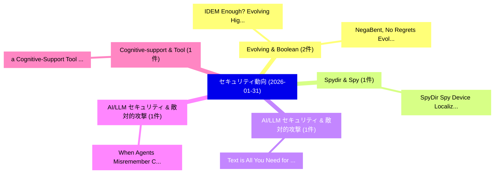

# 📅 02_daily: 日次エグゼクティブサマリー報告書 (2026-01-31)

**集計日時**: 2026-10-02 23:05:56 UTC  
**対象日付**: 2026-01-31  
**本日収集論文数**: 16 件  

---

## 💡 主要セキュリティ動向・脅威インサイト (Executive Insights)

本日の収集論文（計 16 件）において、以下の重点セキュリティ領域で活発な研究動向が確認されました：
- **Evolving & Boolean** (2 件): 注目論文として 「IDEM Enough? Evolving Highly N...」、「NegaBent, No Regrets: Evolving...」 等が発表され、実務防御および攻撃検証の進展が見られます。
- **Spydir & Spy** (1 件): 注目論文として 「SpyDir: Spy Device Localizatio...」 等が発表され、実務防御および攻撃検証の進展が見られます。
- **AI/LLM セキュリティ & 敵対的攻撃** (1 件): 注目論文として 「Text is All You Need for Visio...」 等が発表され、実務防御および攻撃検証の進展が見られます。
- **AI/LLM セキュリティ & 敵対的攻撃** (1 件): 注目論文として 「When Agents "Misremember" Coll...」 等が発表され、実務防御および攻撃検証の進展が見られます。
- **Cognitive-support & Tool** (1 件): 注目論文として 「a Cognitive-Support Tool for T...」 等が発表され、実務防御および攻撃検証の進展が見られます。

### 🗺️ 技術・脅威トピックマインドマップ

---

## 📌 日次セキュリティ論文一覧 (日本語表形式)

| No | arXiv ID | 論文タイトル (日本語訳) | 重要キーワード | 構造化エグゼクティブ要約 (背景・提案・影響) | 脅威分類 | 詳細リンク |
|---|---|---|---|---|---|---|
| 1 | `2602.00411v1` | [SpyDir: Spy Device Localization Through Accurate Direction Finding（セキュリティ分析論文）](../../okf/papers/2026-01-31/2602.00411.md) | `Wenyi Morty Zhang`, `Wenhao Chen`, `Wei Sun` | 【提案】概要 (Overview & Key Finding) 本論文「SpyDir: Spy Device Localization Through Accurate Direct...。実証評価により経営層・セキュリティ管理者向け推奨アクション (E... | `cybersecurity` | [arXiv](https://arxiv.org/abs/2602.00411v1) &#124; [OKF](../../okf/papers/2026-01-31/2602.00411.md) |
| 2 | `2602.00420v1` | [Text is All You Need for Vision-Language Model Jailbreaking（セキュリティ分析論文）](../../okf/papers/2026-01-31/2602.00420.md) | `Language Model Jailbreaking`, `Vision-Language Model`, `Yihang Chen` | 【提案】概要 (Overview & Key Finding) 本論文「Text is All You Need for Vision-Language Model ジェイルブレイク...。実証評価により経営層・セキュリティ管理者向け推奨アクション (E... | `cs.AI` | [arXiv](https://arxiv.org/abs/2602.00420v1) &#124; [OKF](../../okf/papers/2026-01-31/2602.00420.md) |
| 3 | `2602.00428v2` | [When Agents "Misremember" Collectively: Exploring the Mandela Effect in LLM-based Multi-Agent Systems（セキュリティ分析論文）](../../okf/papers/2026-01-31/2602.00428.md) | `Mandela Effect`, `Agent Systems`, `LLM-based Multi` | 【提案】概要 (Overview & Key Finding) 本論文「When Agents "Misremember" Collectively: Exploring the M...。実証評価により経営層・セキュリティ管理者向け推奨アクション (E... | `cs.AI` | [arXiv](https://arxiv.org/abs/2602.00428v2) &#124; [OKF](../../okf/papers/2026-01-31/2602.00428.md) |
| 4 | `2602.00432v1` | [a Cognitive-Support Tool for Threat Huntersに向けて](../../okf/papers/2026-01-31/2602.00432.md) | `Support Tool`, `Cognitive-Support Tool`, `Threat Hunters` | 【提案】概要 (Overview & Key Finding) 本論文「a Cognitive-Support Tool for 脅威 Huntersに向けて」（原題: Toward...。実証評価により経営層・セキュリティ管理者向け推奨アクション (E... | `executive-summary` | [arXiv](https://arxiv.org/abs/2602.00432v1) &#124; [OKF](../../okf/papers/2026-01-31/2602.00432.md) |
| 5 | `2602.00446v1` | [Building Non-Fine-Tunable Foundation Modelsに向けて](../../okf/papers/2026-01-31/2602.00446.md) | `Towards Building Non`, `Tunable Foundation Models`, `Building Non` | 【提案】概要 (Overview & Key Finding) 本論文「Building Non-Fine-Tunable Foundation Modelsに向けて」（原題: To...。実証評価により経営層・セキュリティ管理者向け推奨アクション (E... | `executive-summary` | [arXiv](https://arxiv.org/abs/2602.00446v1) &#124; [OKF](../../okf/papers/2026-01-31/2602.00446.md) |
| 6 | `2602.00619v1` | [Jailbreaking LLMs via Calibration（セキュリティ分析論文）](../../okf/papers/2026-01-31/2602.00619.md) | `Yuxuan Lu`, `Yongkang Guo`, `Yuqing Kong` | 【提案】概要 (Overview & Key Finding) 本論文「ジェイルブレイクing LLMs via Calibration（セキュリティ分析論文）」（原題: ジェイルブ...。実証評価により経営層・セキュリティ管理者向け推奨アクション (E... | `cs.AI` | [arXiv](https://arxiv.org/abs/2602.00619v1) &#124; [OKF](../../okf/papers/2026-01-31/2602.00619.md) |
| 7 | `2602.00667v6` | [zkCraft: Prompt-Guided LLM as a Zero-Shot Mutation Pattern Oracle for TCCT-Powered ZK Fuzzing（セキュリティ分析論文）](../../okf/papers/2026-01-31/2602.00667.md) | `Shot Mutation Pattern Oracle`, `Prompt-Guided LLM`, `Zero-Shot Mutation` | 【提案】概要 (Overview & Key Finding) 本論文「zkCraft: Prompt-Guided LLM as a Zero-Shot Mutation Patt...。実証評価により経営層・セキュリティ管理者向け推奨アクション (E... | `executive-summary` | [arXiv](https://arxiv.org/abs/2602.00667v6) &#124; [OKF](../../okf/papers/2026-01-31/2602.00667.md) |
| 8 | `2602.00689v3` | [Computing Maximal Per-Record Leakage and Leakage-Distortion Functions for Privacy Mechanisms under Entropy-Constrained Adversaries（セキュリティ分析論文）](../../okf/papers/2026-01-31/2602.00689.md) | `Computing Maximal Per`, `Record Leakage`, `Distortion Functions` | 【提案】概要 (Overview & Key Finding) 本論文「Computing Maximal Per-Record Leakage and Leakage-Distor...。実証評価により経営層・セキュリティ管理者向け推奨アクション (E... | `cybersecurity` | [arXiv](https://arxiv.org/abs/2602.00689v3) &#124; [OKF](../../okf/papers/2026-01-31/2602.00689.md) |
| 9 | `2602.00711v1` | [From Detection to Prevention: Explaining Security-Critical Code to Avoid Vulnerabilities（セキュリティ分析論文）](../../okf/papers/2026-01-31/2602.00711.md) | `Explaining Security`, `Critical Code`, `Avoid Vulnerabilities` | 【提案】概要 (Overview & Key Finding) 本論文「From Detection to Prevention: Explaining Security-Criti...。実証評価により経営層・セキュリティ管理者向け推奨アクション (E... | `cs.AI` | [arXiv](https://arxiv.org/abs/2602.00711v1) &#124; [OKF](../../okf/papers/2026-01-31/2602.00711.md) |
| 10 | `2602.00750v2` | [Bypassing Prompt Injection Detectors through Evasive Injections（セキュリティ分析論文）](../../okf/papers/2026-01-31/2602.00750.md) | `Bypassing Prompt Injection Detectors`, `Evasive Injections`, `Md Jahedur Rahman` | 【提案】概要 (Overview & Key Finding) 本論文「Bypassing プロンプトインジェクション Detectors through Evasive Injec...。実証評価により経営層・セキュリティ管理者向け推奨アクション (E... | `cs.AI` | [arXiv](https://arxiv.org/abs/2602.00750v2) &#124; [OKF](../../okf/papers/2026-01-31/2602.00750.md) |
| 11 | `2602.00837v1` | [IDEM Enough? Evolving Highly Nonlinear Idempotent Boolean Functions（セキュリティ分析論文）](../../okf/papers/2026-01-31/2602.00837.md) | `Evolving Highly Nonlinear Idempotent Boolean Functions`, `Claude Carlet`, `Domagoj Jakobovic` | 【提案】Evolving Highly Nonlinear Idempotent Boolean Functions ### (日本語題名: IDEM Enough?。実証評価により経営層・セキュリティ管理者向け推奨アクション (Executive Re... | `executive-summary` | [arXiv](https://arxiv.org/abs/2602.00837v1) &#124; [OKF](../../okf/papers/2026-01-31/2602.00837.md) |
| 12 | `2602.00843v1` | [NegaBent, No Regrets: Evolving Spectrally Flat Boolean Functions（セキュリティ分析論文）](../../okf/papers/2026-01-31/2602.00843.md) | `Evolving Spectrally Flat Boolean Functions`, `Claude Carlet`, `Ermes Franch` | 【提案】概要 (Overview & Key Finding) 本論文「NegaBent, No Regrets: Evolving Spectrally Flat Boolean ...。実証評価により経営層・セキュリティ管理者向け推奨アクション (E... | `executive-summary` | [arXiv](https://arxiv.org/abs/2602.00843v1) &#124; [OKF](../../okf/papers/2026-01-31/2602.00843.md) |
| 13 | `2602.02569v2` | [DECEIVE-AFC: Adversarial Claim Attacks against Search-Enabled LLM-based Fact-Checking Systems（セキュリティ分析論文）](../../okf/papers/2026-01-31/2602.02569.md) | `Adversarial Claim Attacks`, `Search-Enabled LLM`, `Checking Systems` | 【提案】概要 (Overview & Key Finding) 本論文「DECEIVE-AFC: Adversarial Claim Attacks against Search-E...。実証評価により経営層・セキュリティ管理者向け推奨アクション (E... | `cs.AI` | [arXiv](https://arxiv.org/abs/2602.02569v2) &#124; [OKF](../../okf/papers/2026-01-31/2602.02569.md) |
| 14 | `2602.02584v1` | [Constitutional Spec-Driven Development: Enforcing Security by Construction in AI-Assisted Code Generation（セキュリティ分析論文）](../../okf/papers/2026-01-31/2602.02584.md) | `Assisted Code Generation`, `Constitutional Spec`, `Driven Development` | 【提案】概要 (Overview & Key Finding) 本論文「Constitutional Spec-Driven Development: Enforcing Secur...。実証評価により経営層・セキュリティ管理者向け推奨アクション (E... | `cs.AI` | [arXiv](https://arxiv.org/abs/2602.02584v1) &#124; [OKF](../../okf/papers/2026-01-31/2602.02584.md) |
| 15 | `2602.04893v1` | [A Causal Perspective for Enhancing Jailbreak Attack and Defense（セキュリティ分析論文）](../../okf/papers/2026-01-31/2602.04893.md) | `Enhancing Jailbreak Attack`, `Causal Perspective`, `Licheng Pan` | 【提案】概要 (Overview & Key Finding) 本論文「A Causal Perspective for Enhancing ジェイルブレイク Attack and ...。実証評価により経営層・セキュリティ管理者向け推奨アクション (E... | `cs.AI` | [arXiv](https://arxiv.org/abs/2602.04893v1) &#124; [OKF](../../okf/papers/2026-01-31/2602.04893.md) |
| 16 | `2602.21218v2` | [EPSVec: Efficient and Private Synthetic Data Generation via Dataset Vectors（セキュリティ分析論文）](../../okf/papers/2026-01-31/2602.21218.md) | `Private Synthetic Data Generation`, `Dataset Vectors`, `Sai Praneeth Karimireddy` | 【提案】概要 (Overview & Key Finding) 本論文「EPSVec: Efficient and Private Synthetic Data Generation...。実証評価により経営層・セキュリティ管理者向け推奨アクション (E... | `cs.AI` | [arXiv](https://arxiv.org/abs/2602.21218v2) &#124; [OKF](../../okf/papers/2026-01-31/2602.21218.md) |

