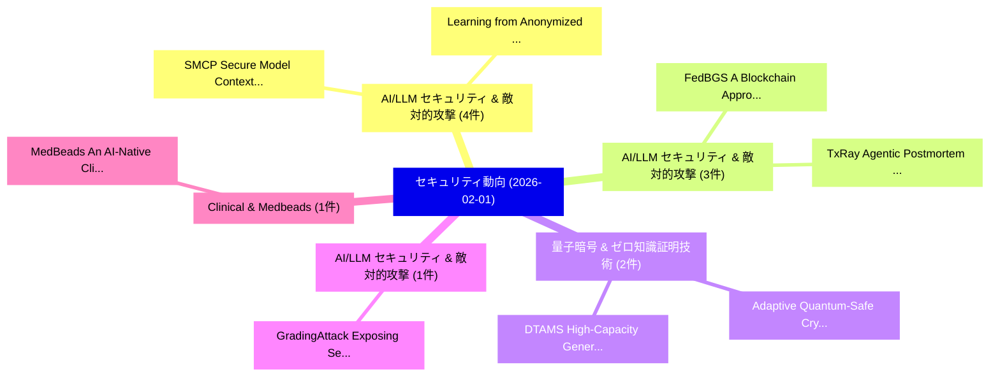

# 📅 02_daily: 日次エグゼクティブサマリー報告書 (2026-02-01)

**集計日時**: 2026-10-02 23:05:56 UTC  
**対象日付**: 2026-02-01  
**本日収集論文数**: 18 件  

---

## 💡 主要セキュリティ動向・脅威インサイト (Executive Insights)

本日の収集論文（計 18 件）において、以下の重点セキュリティ領域で活発な研究動向が確認されました：
- **AI/LLM セキュリティ & 敵対的攻撃** (4 件): 注目論文として 「SMCP: Secure Model Context Pro...」、「Learning from Anonymized and I...」 等が発表され、実務防御および攻撃検証の進展が見られます。
- **AI/LLM セキュリティ & 敵対的攻撃** (3 件): 注目論文として 「FedBGS: A Blockchain Approach ...」、「TxRay: Agentic Postmortem of L...」 等が発表され、実務防御および攻撃検証の進展が見られます。
- **量子暗号 & ゼロ知識証明技術** (2 件): 注目論文として 「DTAMS: High-Capacity Generativ...」、「Adaptive Quantum-Safe Cryptogr...」 等が発表され、実務防御および攻撃検証の進展が見られます。
- **AI/LLM セキュリティ & 敵対的攻撃** (1 件): 注目論文として 「GradingAttack: Exposing Securi...」 等が発表され、実務防御および攻撃検証の進展が見られます。
- **Clinical & Medbeads** (1 件): 注目論文として 「MedBeads: An AI-Native Clinica...」 等が発表され、実務防御および攻撃検証の進展が見られます。

### 🗺️ 技術・脅威トピックマインドマップ

---

## 📌 日次セキュリティ論文一覧 (日本語表形式)

| No | arXiv ID | 論文タイトル (日本語訳) | 重要キーワード | 構造化エグゼクティブ要約 (背景・提案・影響) | 脅威分類 | 詳細リンク |
|---|---|---|---|---|---|---|
| 1 | `2602.00979v2` | [GradingAttack: Exposing Security Vulnerabilities in LLM Based Educational Grading Agents（セキュリティ分析論文）](../../okf/papers/2026-02-01/2602.00979.md) | `Based Educational Grading Agents`, `Exposing Security Vulnerabilities`, `Exposing Security Vulnerabil` | 【提案】概要 (Overview & Key Finding) 本論文「GradingAttack: Exposing Security Vulnerabilities in LLM...。実証評価により経営層・セキュリティ管理者向け推奨アクション (E... | `cs.AI` | [arXiv](https://arxiv.org/abs/2602.00979v2) &#124; [OKF](../../okf/papers/2026-02-01/2602.00979.md) |
| 2 | `2602.01086v3` | [MedBeads: An AI-Native Clinical Context Graph Built from Immutable Beads and Reconstructable Clinical Links（セキュリティ分析論文）](../../okf/papers/2026-02-01/2602.01086.md) | `Native Clinical Context Graph Built`, `Reconstructable Clinical Links`, `Immutable Beads` | 【提案】概要 (Overview & Key Finding) 本論文「MedBeads: An AI-Native Clinical Context Graph Built fro...。実証評価により経営層・セキュリティ管理者向け推奨アクション (E... | `cs.DB` | [arXiv](https://arxiv.org/abs/2602.01086v3) &#124; [OKF](../../okf/papers/2026-02-01/2602.01086.md) |
| 3 | `2602.01129v1` | [SMCP: Secure Model Context Protocol（セキュリティ分析論文）](../../okf/papers/2026-02-01/2602.01129.md) | `Secure Model Context Protocol`, `Xinyi Hou`, `Shenao Wang` | 【提案】概要 (Overview & Key Finding) 本論文「SMCP: Secure Model Context Protocol（セキュリティ分析論文）」（原題: SM...。実証評価により経営層・セキュリティ管理者向け推奨アクション (E... | `cybersecurity` | [arXiv](https://arxiv.org/abs/2602.01129v1) &#124; [OKF](../../okf/papers/2026-02-01/2602.01129.md) |
| 4 | `2602.01150v2` | [SMI: Statistical Membership Inference for Reliable Unlearned Model Auditing（セキュリティ分析論文）](../../okf/papers/2026-02-01/2602.01150.md) | `Reliable Unlearned Model Auditing`, `Statistical Membership Inference`, `Jialong Sun` | 【提案】概要 (Overview & Key Finding) 本論文「SMI: Statistical Membership Inference for Reliable Unle...。実証評価により経営層・セキュリティ管理者向け推奨アクション (E... | `cs.AI` | [arXiv](https://arxiv.org/abs/2602.01150v2) &#124; [OKF](../../okf/papers/2026-02-01/2602.01150.md) |
| 5 | `2602.01160v1` | [DTAMS: High-Capacity Generative Steganography via Dynamic Multi-Timestep Selection and Adaptive Deviation Mapping in Latent Diffusion（セキュリティ分析論文）](../../okf/papers/2026-02-01/2602.01160.md) | `Capacity Generative Steganography`, `Adaptive Deviation Mapping`, `Dynamic Multi` | 【提案】概要 (Overview & Key Finding) 本論文「DTAMS: High-Capacity Generative Steganography via Dynam...。実証評価により経営層・セキュリティ管理者向け推奨アクション (E... | `cybersecurity` | [arXiv](https://arxiv.org/abs/2602.01160v1) &#124; [OKF](../../okf/papers/2026-02-01/2602.01160.md) |
| 6 | `2602.01185v1` | [FedBGS: A Blockchain Approach to Segment Gossip Learning in Decentralized Systems（セキュリティ分析論文）](../../okf/papers/2026-02-01/2602.01185.md) | `Segment Gossip Learning`, `Decentralized Systems`, `Fabio Turazza` | 【提案】概要 (Overview & Key Finding) 本論文「FedBGS: A Blockchain Approach to Segment Gossip Learnin...。実証評価により経営層・セキュリティ管理者向け推奨アクション (E... | `cs.AI` | [arXiv](https://arxiv.org/abs/2602.01185v1) &#124; [OKF](../../okf/papers/2026-02-01/2602.01185.md) |
| 7 | `2602.01217v1` | [Learning from Anonymized and Incomplete Tabular Data（セキュリティ分析論文）](../../okf/papers/2026-02-01/2602.01217.md) | `Incomplete Tabular Data`, `Lucas Lange`, `Victor Christen` | 【提案】概要 (Overview & Key Finding) 本論文「Learning from Anonymized and Incomplete Tabular Data（セキ...。実証評価により経営層・セキュリティ管理者向け推奨アクション (E... | `cs.DB` | [arXiv](https://arxiv.org/abs/2602.01217v1) &#124; [OKF](../../okf/papers/2026-02-01/2602.01217.md) |
| 8 | `2602.01225v2` | [Bifrost: A Much Simpler Secure Two-Party Data Join Protocol for Secure Data Analytics（セキュリティ分析論文）](../../okf/papers/2026-02-01/2602.01225.md) | `Much Simpler Secure Two`, `Party Data Join Protocol`, `Secure Data Analytics` | 【提案】概要 (Overview & Key Finding) 本論文「Bifrost: A Much Simpler Secure Two-Party Data Join Prot...。実証評価により経営層・セキュリティ管理者向け推奨アクション (E... | `cybersecurity` | [arXiv](https://arxiv.org/abs/2602.01225v2) &#124; [OKF](../../okf/papers/2026-02-01/2602.01225.md) |
| 9 | `2602.01304v1` | [Protocol Agent: What If Agents Could Use Cryptography In Everyday Life?（セキュリティ分析論文）](../../okf/papers/2026-02-01/2602.01304.md) | `Protocol Agent`, `Marco De Rossi`, `Raw Meta` | 【提案】### (日本語題名: Protocol Agent: What If Agents Could Use 暗号技術 In Everyday Life?（セキュリティ分析論文）...。実証評価により経営層・セキュリティ管理者向け推奨アクション (E... | `cybersecurity` | [arXiv](https://arxiv.org/abs/2602.01304v1) &#124; [OKF](../../okf/papers/2026-02-01/2602.01304.md) |
| 10 | `2602.01317v5` | [TxRay: Agentic Postmortem of Live Blockchain Attacks（セキュリティ分析論文）](../../okf/papers/2026-02-01/2602.01317.md) | `Live Blockchain Attacks`, `Agentic Postmortem`, `Ziyue Wang` | 【提案】概要 (Overview & Key Finding) 本論文「TxRay: Agentic Postmortem of Live Blockchain Attacks（セキ...。実証評価により経営層・セキュリティ管理者向け推奨アクション (E... | `cs.AI` | [arXiv](https://arxiv.org/abs/2602.01317v5) &#124; [OKF](../../okf/papers/2026-02-01/2602.01317.md) |
| 11 | `2602.01341v1` | [Privocracy: Online Democracy through Private Voting（セキュリティ分析論文）](../../okf/papers/2026-02-01/2602.01341.md) | `Online Democracy`, `Private Voting`, `Hugo Pereira` | 【提案】概要 (Overview & Key Finding) 本論文「Privocracy: Online Democracy through Private Voting（セキュ...。実証評価により経営層・セキュリティ管理者向け推奨アクション (E... | `executive-summary` | [arXiv](https://arxiv.org/abs/2602.01341v1) &#124; [OKF](../../okf/papers/2026-02-01/2602.01341.md) |
| 12 | `2602.01342v1` | [Adaptive Quantum-Safe Cryptography for 6G Vehicular Networks via Context-Aware Optimization（セキュリティ分析論文）](../../okf/papers/2026-02-01/2602.01342.md) | `Adaptive Quantum`, `Safe Cryptography`, `Vehicular Networks` | 【提案】概要 (Overview & Key Finding) 本論文「Adaptive 量子-Safe 暗号技術 for 6G Vehicular Networks via Con...。実証評価により経営層・セキュリティ管理者向け推奨アクション (E... | `cs.AI` | [arXiv](https://arxiv.org/abs/2602.01342v1) &#124; [OKF](../../okf/papers/2026-02-01/2602.01342.md) |
| 13 | `2602.01426v1` | [Free-space and Satellite-Based Quantum Communication: Principles, Implementations, and Challenges（セキュリティ分析論文）](../../okf/papers/2026-02-01/2602.01426.md) | `Based Quantum Communication`, `Satellite-Based Quantum`, `Georgi Gary Rozenman` | 【提案】概要 (Overview & Key Finding) 本論文「Free-space and Satellite-Based 量子 Communication: Princi...。実証評価により経営層・セキュリティ管理者向け推奨アクション (E... | `executive-summary` | [arXiv](https://arxiv.org/abs/2602.01426v1) &#124; [OKF](../../okf/papers/2026-02-01/2602.01426.md) |
| 14 | `2602.01428v2` | [Improving the Trade-off Between Watermark Strength and Speculative Sampling Efficiency for Language Models（セキュリティ分析論文）](../../okf/papers/2026-02-01/2602.01428.md) | `Speculative Sampling Efficiency`, `Language Models`, `Xiang Li` | 【提案】概要 (Overview & Key Finding) 本論文「Improving the Trade-off Between Watermark Strength and ...。実証評価により経営層・セキュリティ管理者向け推奨アクション (E... | `executive-summary` | [arXiv](https://arxiv.org/abs/2602.01428v2) &#124; [OKF](../../okf/papers/2026-02-01/2602.01428.md) |
| 15 | `2602.01438v2` | [CIPHER: Cryptographic Insecurity Profiling via Hybrid Evaluation of Responses（セキュリティ分析論文）](../../okf/papers/2026-02-01/2602.01438.md) | `Cryptographic Insecurity Profiling`, `Max Manolov`, `Tony Gao` | 【提案】概要 (Overview & Key Finding) 本論文「CIPHER: Cryptographic Insecurity Profiling via Hybrid E...。実証評価により経営層・セキュリティ管理者向け推奨アクション (E... | `cs.AI` | [arXiv](https://arxiv.org/abs/2602.01438v2) &#124; [OKF](../../okf/papers/2026-02-01/2602.01438.md) |
| 16 | `2602.01489v1` | [DuoLungo: Usability Study of Duo 2FA（セキュリティ分析論文）](../../okf/papers/2026-02-01/2602.01489.md) | `Renascence Tarafder Prapty`, `Gene Tsudik`, `Raw Meta` | 【提案】概要 (Overview & Key Finding) 本論文「DuoLungo: Usability Study of Duo 2FA（セキュリティ分析論文）」（原題: D...。実証評価により経営層・セキュリティ管理者向け推奨アクション (E... | `cybersecurity` | [arXiv](https://arxiv.org/abs/2602.01489v1) &#124; [OKF](../../okf/papers/2026-02-01/2602.01489.md) |
| 17 | `2602.02595v1` | [To Defend Against Cyber Attacks, We Must Teach AI Agents to Hack（セキュリティ分析論文）](../../okf/papers/2026-02-01/2602.02595.md) | `Terry Yue Zhuo`, `Yangruibo Ding`, `Wenbo Guo` | 【提案】概要 (Overview & Key Finding) 本論文「To Defend Against Cyber Attacks, We Must Teach AI Agent...。実証評価により経営層・セキュリティ管理者向け推奨アクション (E... | `cs.AI` | [arXiv](https://arxiv.org/abs/2602.02595v1) &#124; [OKF](../../okf/papers/2026-02-01/2602.02595.md) |
| 18 | `2602.02602v1` | [Position: 3D Gaussian Splatting Watermarking Should Be Scenario-Driven and Threat-Model Explicit（セキュリティ分析論文）](../../okf/papers/2026-02-01/2602.02602.md) | `Model Explicit`, `Threat-Model Explicit`, `Yangfan Deng` | 【提案】概要 (Overview & Key Finding) 本論文「Position: 3D Gaussian Splatting Watermarking Should Be ...。実証評価により経営層・セキュリティ管理者向け推奨アクション (E... | `executive-summary` | [arXiv](https://arxiv.org/abs/2602.02602v1) &#124; [OKF](../../okf/papers/2026-02-01/2602.02602.md) |

