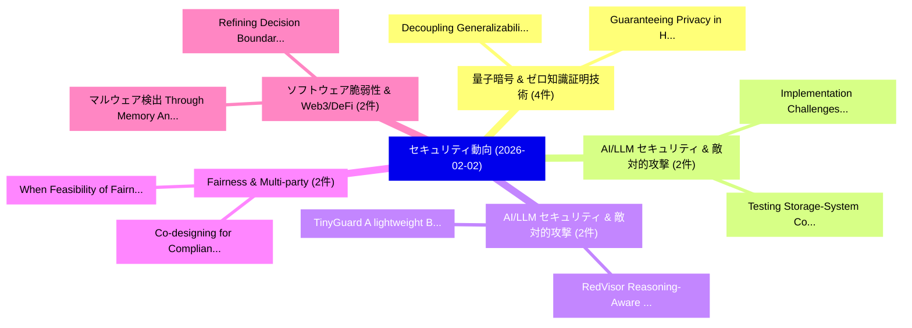

# 📅 02_daily: 日次エグゼクティブサマリー報告書 (2026-02-02)

**集計日時**: 2026-10-02 23:05:56 UTC  
**対象日付**: 2026-02-02  
**本日収集論文数**: 46 件  

---

## 💡 主要セキュリティ動向・脅威インサイト (Executive Insights)

本日の収集論文（計 46 件）において、以下の重点セキュリティ領域で活発な研究動向が確認されました：
- **量子暗号 & ゼロ知識証明技術** (4 件): 注目論文として 「Decoupling Generalizability an...」、「Guaranteeing Privacy in Hybrid...」 等が発表され、実務防御および攻撃検証の進展が見られます。
- **AI/LLM セキュリティ & 敵対的攻撃** (2 件): 注目論文として 「Implementation Challenges in Q...」、「Testing Storage-System Correct...」 等が発表され、実務防御および攻撃検証の進展が見られます。
- **AI/LLM セキュリティ & 敵対的攻撃** (2 件): 注目論文として 「RedVisor: Reasoning-Aware Prom...」、「TinyGuard:A lightweight Byzant...」 等が発表され、実務防御および攻撃検証の進展が見られます。
- **Fairness & Multi-party** (2 件): 注目論文として 「Co-designing for Compliance: M...」、「When Feasibility of Fairness A...」 等が発表され、実務防御および攻撃検証の進展が見られます。
- **ソフトウェア脆弱性 & Web3/DeFi** (2 件): 注目論文として 「マルウェア検出 Through Memory Analysi...」、「Refining Decision Boundaries I...」 等が発表され、実務防御および攻撃検証の進展が見られます。

### 🗺️ 技術・脅威トピックマインドマップ

---

## 📌 日次セキュリティ論文一覧 (日本語表形式)

| No | arXiv ID | 論文タイトル (日本語訳) | 重要キーワード | 構造化エグゼクティブ要約 (背景・提案・影響) | 脅威分類 | 詳細リンク |
|---|---|---|---|---|---|---|
| 1 | `2602.01491v1` | [Sleep Reveals the Nonce: Breaking ECDSA using Sleep-Based Power Side-Channel Vulnerability（セキュリティ分析論文）](../../okf/papers/2026-02-02/2602.01491.md) | `Based Power Side`, `Sleep Reveals`, `Sleep-Based Power` | 【提案】概要 (Overview & Key Finding) 本論文「Sleep Reveals the Nonce: Breaking ECDSA using Sleep-Bas...。実証評価により経営層・セキュリティ管理者向け推奨アクション (E... | `cybersecurity` | [arXiv](https://arxiv.org/abs/2602.01491v1) &#124; [OKF](../../okf/papers/2026-02-02/2602.01491.md) |
| 2 | `2602.01500v1` | [Implementation Challenges in Quantum Key Distribution（セキュリティ分析論文）](../../okf/papers/2026-02-02/2602.01500.md) | `Quantum Key Distribution`, `Implementation Challenges`, `Raw Meta` | 【提案】概要 (Overview & Key Finding) 本論文「Implementation Challenges in 量子鍵配送（セキュリティ分析論文）」（原題: Imp...。実証評価によりChen - **公開日時**: `2026-02... | `executive-summary` | [arXiv](https://arxiv.org/abs/2602.01500v1) &#124; [OKF](../../okf/papers/2026-02-02/2602.01500.md) |
| 3 | `2602.01513v1` | [MarkCleaner: High-Fidelity Watermark Removal via Imperceptible Micro-Geometric Perturbation（セキュリティ分析論文）](../../okf/papers/2026-02-02/2602.01513.md) | `Fidelity Watermark Removal`, `Imperceptible Micro`, `High-Fidelity Watermark` | 【提案】概要 (Overview & Key Finding) 本論文「MarkCleaner: High-Fidelity Watermark Removal via Imperc...。実証評価により経営層・セキュリティ管理者向け推奨アクション (E... | `cs.AI` | [arXiv](https://arxiv.org/abs/2602.01513v1) &#124; [OKF](../../okf/papers/2026-02-02/2602.01513.md) |
| 4 | `2602.01544v1` | [Are Security Cues Static? Rethinking Warning and Trust Indicators for Life Transitions（セキュリティ分析論文）](../../okf/papers/2026-02-02/2602.01544.md) | `Rethinking Warning`, `Trust Indicators`, `Life Transitions` | 【提案】Rethinking Warning and Trust Indicators for Life Transitions ### (日本語題名: Are Security C...。実証評価により経営層・セキュリティ管理者向け推奨アクション (E... | `executive-summary` | [arXiv](https://arxiv.org/abs/2602.01544v1) &#124; [OKF](../../okf/papers/2026-02-02/2602.01544.md) |
| 5 | `2602.01580v1` | [HACK NDSU: A Real-world Event to Promote Student Interest in サイバーセキュリティ](../../okf/papers/2026-02-02/2602.01580.md) | `Promote Student Interest`, `Real-world Event`, `Enrique Garcia` | 【提案】概要 (Overview & Key Finding) 本論文「HACK NDSU: A Real-world Event to Promote Student Intere...。実証評価により経営層・セキュリティ管理者向け推奨アクション (E... | `cybersecurity` | [arXiv](https://arxiv.org/abs/2602.01580v1) &#124; [OKF](../../okf/papers/2026-02-02/2602.01580.md) |
| 6 | `2602.01583v1` | [A new criterion for the absolute irreducibility of multivariate polynomials over finite fields（セキュリティ分析論文）](../../okf/papers/2026-02-02/2602.01583.md) | `Carlos Agrinsoni`, `Heeralal Janwa`, `Moises Delgado` | 【提案】概要 (Overview & Key Finding) 本論文「A new criterion for the absolute irreducibility of mult...。実証評価により経営層・セキュリティ管理者向け推奨アクション (E... | `math.AG` | [arXiv](https://arxiv.org/abs/2602.01583v1) &#124; [OKF](../../okf/papers/2026-02-02/2602.01583.md) |
| 7 | `2602.01600v1` | [Expected Harm: Rethinking Safety Evaluation of (Mis)Aligned LLMs（セキュリティ分析論文）](../../okf/papers/2026-02-02/2602.01600.md) | `Expected Harm`, `Zhi Rui Tam`, `Shan Chen` | 【提案】概要 (Overview & Key Finding) 本論文「Expected Harm: Rethinking Safety Evaluation of (Mis)Ali...。実証評価により経営層・セキュリティ管理者向け推奨アクション (E... | `executive-summary` | [arXiv](https://arxiv.org/abs/2602.01600v1) &#124; [OKF](../../okf/papers/2026-02-02/2602.01600.md) |
| 8 | `2602.01621v3` | [CGF-Softmax: A Cumulant-Based Softmax Reformulation for Efficient Inference under Homomorphic Encryption（セキュリティ分析論文）](../../okf/papers/2026-02-02/2602.01621.md) | `Based Softmax Reformulation`, `Efficient Inference`, `Homomorphic Encryption` | 【提案】概要 (Overview & Key Finding) 本論文「CGF-Softmax: A Cumulant-Based Softmax Reformulation for...。実証評価により経営層・セキュリティ管理者向け推奨アクション (E... | `executive-summary` | [arXiv](https://arxiv.org/abs/2602.01621v3) &#124; [OKF](../../okf/papers/2026-02-02/2602.01621.md) |
| 9 | `2602.01663v1` | [Witnessd: Proof-of-process via Adversarial Collapse（セキュリティ分析論文）](../../okf/papers/2026-02-02/2602.01663.md) | `Adversarial Collapse`, `David Condrey`, `Raw Meta` | 【提案】概要 (Overview & Key Finding) 本論文「Witnessd: Proof-of-process via Adversarial Collapse（セキュ...。実証評価により経営層・セキュリティ管理者向け推奨アクション (E... | `cybersecurity` | [arXiv](https://arxiv.org/abs/2602.01663v1) &#124; [OKF](../../okf/papers/2026-02-02/2602.01663.md) |
| 10 | `2602.01671v1` | [AI-Assisted Adaptive Rendering for High-Frequency Security Telemetry in Web Interfaces（セキュリティ分析論文）](../../okf/papers/2026-02-02/2602.01671.md) | `Assisted Adaptive Rendering`, `Frequency Security Telemetry`, `Web Interfaces` | 【提案】概要 (Overview & Key Finding) 本論文「AI-Assisted Adaptive Rendering for High-Frequency Secur...。実証評価により経営層・セキュリティ管理者向け推奨アクション (E... | `cs.AI` | [arXiv](https://arxiv.org/abs/2602.01671v1) &#124; [OKF](../../okf/papers/2026-02-02/2602.01671.md) |
| 11 | `2602.01752v2` | [WorldCup Sampling for Multi-bit LLM Watermarking（セキュリティ分析論文）](../../okf/papers/2026-02-02/2602.01752.md) | `Multi-bit LLM`, `Yidan Wang`, `Yubing Ren` | 【提案】概要 (Overview & Key Finding) 本論文「WorldCup Sampling for Multi-bit LLM Watermarking（セキュリティ...。実証評価により経営層・セキュリティ管理者向け推奨アクション (E... | `executive-summary` | [arXiv](https://arxiv.org/abs/2602.01752v2) &#124; [OKF](../../okf/papers/2026-02-02/2602.01752.md) |
| 12 | `2602.01765v1` | [Backdoor Sentinel: Detecting and Detoxifying Backdoors in Diffusion Models via Temporal Noise Consistency（セキュリティ分析論文）](../../okf/papers/2026-02-02/2602.01765.md) | `Temporal Noise Consistency`, `Backdoor Sentinel`, `Detoxifying Backdoors` | 【提案】概要 (Overview & Key Finding) 本論文「Backdoor Sentinel: Detecting and Detoxifying Backdoors ...。実証評価により経営層・セキュリティ管理者向け推奨アクション (E... | `cs.AI` | [arXiv](https://arxiv.org/abs/2602.01765v1) &#124; [OKF](../../okf/papers/2026-02-02/2602.01765.md) |
| 13 | `2602.01795v1` | [RedVisor: Reasoning-Aware Prompt Injection Defense via Zero-Copy KV Cache Reuse（セキュリティ分析論文）](../../okf/papers/2026-02-02/2602.01795.md) | `Aware Prompt Injection Defense`, `Cache Reuse`, `Reasoning-Aware Prompt` | 【提案】概要 (Overview & Key Finding) 本論文「RedVisor: Reasoning-Aware プロンプトインジェクション Defense via Zer...。実証評価により経営層・セキュリティ管理者向け推奨アクション (E... | `cs.AI` | [arXiv](https://arxiv.org/abs/2602.01795v1) &#124; [OKF](../../okf/papers/2026-02-02/2602.01795.md) |
| 14 | `2602.01837v4` | [Co-designing for Compliance: Multi-party Computation Protocols for Post-Market Fairness Monitoring in Algorithmic Hiring（セキュリティ分析論文）](../../okf/papers/2026-02-02/2602.01837.md) | `Market Fairness Monitoring`, `Computation Protocols`, `Algorithmic Hiring` | 【提案】概要 (Overview & Key Finding) 本論文「Co-designing for Compliance: Multi-party Computation Pr...。実証評価により経営層・セキュリティ管理者向け推奨アクション (E... | `executive-summary` | [arXiv](https://arxiv.org/abs/2602.01837v4) &#124; [OKF](../../okf/papers/2026-02-02/2602.01837.md) |
| 15 | `2602.01846v1` | [When Feasibility of Fairness Audits Relies on Willingness to Share Data: Examining User Acceptance of Multi-Party Computation Protocols for Fairness Monitoring（セキュリティ分析論文）](../../okf/papers/2026-02-02/2602.01846.md) | `Fairness Audits Relies`, `Examining User Acceptance`, `Party Computation Protocols` | 【提案】概要 (Overview & Key Finding) 本論文「When Feasibility of Fairness Audits Relies on Willingne...。実証評価により経営層・セキュリティ管理者向け推奨アクション (E... | `executive-summary` | [arXiv](https://arxiv.org/abs/2602.01846v1) &#124; [OKF](../../okf/papers/2026-02-02/2602.01846.md) |
| 16 | `2602.01932v2` | [Things that Matter -- Identifying Interactions and IoT Device Types in Encrypted Matter Traffic（セキュリティ分析論文）](../../okf/papers/2026-02-02/2602.01932.md) | `Encrypted Matter Traffic`, `Identifying Interactions`, `Device Types` | 【提案】概要 (Overview & Key Finding) 本論文「Things that Matter -- Identifying Interactions and IoT ...。実証評価により経営層・セキュリティ管理者向け推奨アクション (E... | `cybersecurity` | [arXiv](https://arxiv.org/abs/2602.01932v2) &#124; [OKF](../../okf/papers/2026-02-02/2602.01932.md) |
| 17 | `2602.01942v1` | [Human Society-Inspired Approaches to Agentic AI Security: The 4C Framework（セキュリティ分析論文）](../../okf/papers/2026-02-02/2602.01942.md) | `Human Society`, `Inspired Approaches`, `Society-Inspired Approaches` | 【提案】概要 (Overview & Key Finding) 本論文「Human Society-Inspired Approaches to Agentic AI Securit...。実証評価により経営層・セキュリティ管理者向け推奨アクション (E... | `cs.AI` | [arXiv](https://arxiv.org/abs/2602.01942v1) &#124; [OKF](../../okf/papers/2026-02-02/2602.01942.md) |
| 18 | `2602.02147v1` | [HPE: Hallucinated Positive Entanglement for Backdoor Attacks in Federated Self-Supervised Learning（セキュリティ分析論文）](../../okf/papers/2026-02-02/2602.02147.md) | `Hallucinated Positive Entanglement`, `Backdoor Attacks`, `Federated Self` | 【提案】概要 (Overview & Key Finding) 本論文「HPE: Hallucinated Positive Entanglement for Backdoor At...。実証評価により経営層・セキュリティ管理者向け推奨アクション (E... | `cybersecurity` | [arXiv](https://arxiv.org/abs/2602.02147v1) &#124; [OKF](../../okf/papers/2026-02-02/2602.02147.md) |
| 19 | `2602.02164v2` | [Co-RedTeam: Orchestrated Security Discovery and Exploitation with LLMエージェント](../../okf/papers/2026-02-02/2602.02164.md) | `Orchestrated Security Discovery`, `Ash Fox`, `Lesly Miculicich` | 【提案】概要 (Overview & Key Finding) 本論文「Co-RedTeam: Orchestrated Security Discovery and Exploit...。実証評価により経営層・セキュリティ管理者向け推奨アクション (E... | `executive-summary` | [arXiv](https://arxiv.org/abs/2602.02164v2) &#124; [OKF](../../okf/papers/2026-02-02/2602.02164.md) |
| 20 | `2602.02184v1` | [マルウェア検出 Through Memory Analysis](../../okf/papers/2026-02-02/2602.02184.md) | `Sarah Nassar`, `Raw Meta`, `Executive Summary` | 【提案】概要 (Overview & Key Finding) 本論文「マルウェア検出 Through Memory Analysis」（原題: マルウェア Detection Th...。実証評価により経営層・セキュリティ管理者向け推奨アクション (E... | `cs.AI` | [arXiv](https://arxiv.org/abs/2602.02184v1) &#124; [OKF](../../okf/papers/2026-02-02/2602.02184.md) |
| 21 | `2602.02198v1` | [QuietPrint: Protecting 3D Printers Against Acoustic Side-Channel Attacks（セキュリティ分析論文）](../../okf/papers/2026-02-02/2602.02198.md) | `Channel Attacks`, `Side-Channel Attacks`, `Seyed Ali Ghazi Asgar` | 【提案】概要 (Overview & Key Finding) 本論文「QuietPrint: Protecting 3D Printers Against Acoustic サイド...。実証評価により経営層・セキュリティ管理者向け推奨アクション (E... | `executive-summary` | [arXiv](https://arxiv.org/abs/2602.02198v1) &#124; [OKF](../../okf/papers/2026-02-02/2602.02198.md) |
| 22 | `2602.02222v1` | [MIRROR: Manifold Ideal Reference ReconstructOR for Generalizable AI-Generated Image Detection（セキュリティ分析論文）](../../okf/papers/2026-02-02/2602.02222.md) | `Manifold Ideal Reference`, `Generated Image Detection`, `AI-Generated Image` | 【提案】概要 (Overview & Key Finding) 本論文「MIRROR: Manifold Ideal Reference ReconstructOR for Gene...。実証評価により経営層・セキュリティ管理者向け推奨アクション (E... | `cs.CV` | [arXiv](https://arxiv.org/abs/2602.02222v1) &#124; [OKF](../../okf/papers/2026-02-02/2602.02222.md) |
| 23 | `2602.02243v1` | [SysFuSS: System-Level Firmware Fuzzing with Selective Symbolic Execution（セキュリティ分析論文）](../../okf/papers/2026-02-02/2602.02243.md) | `Level Firmware Fuzzing`, `Selective Symbolic Execution`, `System-Level Firmware` | 【提案】概要 (Overview & Key Finding) 本論文「SysFuSS: System-Level Firmware Fuzzing with Selective S...。実証評価により経営層・セキュリティ管理者向け推奨アクション (E... | `cybersecurity` | [arXiv](https://arxiv.org/abs/2602.02243v1) &#124; [OKF](../../okf/papers/2026-02-02/2602.02243.md) |
| 24 | `2602.02280v2` | [RACC: Representation-Aware Coverage Criteria for LLM Safety Testing（セキュリティ分析論文）](../../okf/papers/2026-02-02/2602.02280.md) | `Aware Coverage Criteria`, `Safety Testing`, `Representation-Aware Coverage` | 【提案】概要 (Overview & Key Finding) 本論文「RACC: Representation-Aware Coverage Criteria for LLM Sa...。実証評価により経営層・セキュリティ管理者向け推奨アクション (E... | `cs.AI` | [arXiv](https://arxiv.org/abs/2602.02280v2) &#124; [OKF](../../okf/papers/2026-02-02/2602.02280.md) |
| 25 | `2602.02296v2` | [Decoupling Generalizability and Membership Privacy Risks in Neural Networks（セキュリティ分析論文）](../../okf/papers/2026-02-02/2602.02296.md) | `Membership Privacy Risks`, `Decoupling Generalizability`, `Neural Networks` | 【提案】概要 (Overview & Key Finding) 本論文「Decoupling Generalizability and Membership Privacy Risk...。実証評価により経営層・セキュリティ管理者向け推奨アクション (E... | `cs.AI` | [arXiv](https://arxiv.org/abs/2602.02296v2) &#124; [OKF](../../okf/papers/2026-02-02/2602.02296.md) |
| 26 | `2602.02364v1` | [Guaranteeing Privacy in Hybrid Quantum Learning through Theoretical Mechanisms（セキュリティ分析論文）](../../okf/papers/2026-02-02/2602.02364.md) | `Hybrid Quantum Learning`, `Guaranteeing Privacy`, `Theoretical Mechanisms` | 【提案】概要 (Overview & Key Finding) 本論文「Guaranteeing Privacy in Hybrid 量子 Learning through Theo...。実証評価によりNgo, Tre' R。 | `executive-summary` | [arXiv](https://arxiv.org/abs/2602.02364v1) &#124; [OKF](../../okf/papers/2026-02-02/2602.02364.md) |
| 27 | `2602.02395v1` | [David vs. Goliath: Verifiable Agent-to-Agent Jailbreaking via Reinforcement Learning（セキュリティ分析論文）](../../okf/papers/2026-02-02/2602.02395.md) | `Verifiable Agent`, `Agent Jailbreaking`, `Reinforcement Learning` | 【提案】概要 (Overview & Key Finding) 本論文「David vs. Goliath: Verifiable Agent-to-Agent ジェイルブレイクin...。実証評価により経営層・セキュリティ管理者向け推奨アクション (E... | `cs.AI` | [arXiv](https://arxiv.org/abs/2602.02395v1) &#124; [OKF](../../okf/papers/2026-02-02/2602.02395.md) |
| 28 | `2602.02412v1` | [Provenance Verification of AI-Generated Images via a Perceptual Hash Registry Anchored on Blockchain（セキュリティ分析論文）](../../okf/papers/2026-02-02/2602.02412.md) | `Perceptual Hash Registry Anchored`, `Provenance Verification`, `Generated Images` | 【提案】概要 (Overview & Key Finding) 本論文「Provenance Verification of AI-Generated Images via a Pe...。実証評価により経営層・セキュリティ管理者向け推奨アクション (E... | `executive-summary` | [arXiv](https://arxiv.org/abs/2602.02412v1) &#124; [OKF](../../okf/papers/2026-02-02/2602.02412.md) |
| 29 | `2602.02489v2` | [Secure Multi-User Linearly-Separable Distributed Computing（セキュリティ分析論文）](../../okf/papers/2026-02-02/2602.02489.md) | `Separable Distributed Computing`, `Secure Multi`, `User Linearly` | 【提案】概要 (Overview & Key Finding) 本論文「Secure Multi-User Linearly-Separable Distributed Comput...。実証評価により経営層・セキュリティ管理者向け推奨アクション (E... | `executive-summary` | [arXiv](https://arxiv.org/abs/2602.02489v2) &#124; [OKF](../../okf/papers/2026-02-02/2602.02489.md) |
| 30 | `2602.02610v1` | [ClinConNet: A Blockchain-based Dynamic Consent Management Platform for Clinical Research（セキュリティ分析論文）](../../okf/papers/2026-02-02/2602.02610.md) | `Dynamic Consent Management Platform`, `Blockchain-based Dynamic`, `Clinical Research` | 【提案】概要 (Overview & Key Finding) 本論文「ClinConNet: A Blockchain-based Dynamic Consent Manageme...。実証評価により経営層・セキュリティ管理者向け推奨アクション (E... | `executive-summary` | [arXiv](https://arxiv.org/abs/2602.02610v1) &#124; [OKF](../../okf/papers/2026-02-02/2602.02610.md) |
| 31 | `2602.02614v2` | [Testing Storage-System Correctness: Challenges, Fuzzing Limitations, and AI-Augmented Opportunities（セキュリティ分析論文）](../../okf/papers/2026-02-02/2602.02614.md) | `Testing Storage`, `System Correctness`, `Fuzzing Limitations` | 【提案】概要 (Overview & Key Finding) 本論文「Testing Storage-System Correctness: Challenges, Fuzzing...。実証評価により経営層・セキュリティ管理者向け推奨アクション (E... | `cs.AI` | [arXiv](https://arxiv.org/abs/2602.02614v2) &#124; [OKF](../../okf/papers/2026-02-02/2602.02614.md) |
| 32 | `2602.02615v1` | [TinyGuard:A lightweight Byzantine Defense for Resource-Constrained 連合学習 via Statistical Update Fingerprints](../../okf/papers/2026-02-02/2602.02615.md) | `Statistical Update Fingerprints`, `Byzantine Defense`, `Constrained Federated Learning` | 【提案】概要 (Overview & Key Finding) 本論文「TinyGuard:A lightweight Byzantine Defense for Resource-...。実証評価により経営層・セキュリティ管理者向け推奨アクション (E... | `cs.AI` | [arXiv](https://arxiv.org/abs/2602.02615v1) &#124; [OKF](../../okf/papers/2026-02-02/2602.02615.md) |
| 33 | `2602.02629v1` | [Trustworthy Blockchain-based Federated Learning for Electronic Health Records: Participant Identity with Decentralized Identifiers and Verifiable Credentialsのセキュリティ強化](../../okf/papers/2026-02-02/2602.02629.md) | `Electronic Health Records`, `Trustworthy Blockchain`, `Federated Learning` | 【提案】概要 (Overview & Key Finding) 本論文「Trustworthy Blockchain-based Federated Learning for Ele...。実証評価により経営層・セキュリティ管理者向け推奨アクション (E... | `cs.AI` | [arXiv](https://arxiv.org/abs/2602.02629v1) &#124; [OKF](../../okf/papers/2026-02-02/2602.02629.md) |
| 34 | `2602.02641v1` | [Large Language Models for Zero-shot and Few-shot Phishing URL Detectionのベンチマーク評価](../../okf/papers/2026-02-02/2602.02641.md) | `Few-shot Phishing`, `Benchmarking Large Language Models`, `Large Language Models` | 【提案】概要 (Overview & Key Finding) 本論文「Large Language Models for Zero-shot and Few-shot Phishi...。実証評価により経営層・セキュリティ管理者向け推奨アクション (E... | `cs.AI` | [arXiv](https://arxiv.org/abs/2602.02641v1) &#124; [OKF](../../okf/papers/2026-02-02/2602.02641.md) |
| 35 | `2602.02686v1` | [Monotonicity as an Architectural Bias for Robust Language Models（セキュリティ分析論文）](../../okf/papers/2026-02-02/2602.02686.md) | `Robust Language Models`, `Architectural Bias`, `Patrick Cooper` | 【提案】概要 (Overview & Key Finding) 本論文「Monotonicity as an Architectural Bias for Robust Langua...。実証評価により経営層・セキュリティ管理者向け推奨アクション (E... | `cs.AI` | [arXiv](https://arxiv.org/abs/2602.02686v1) &#124; [OKF](../../okf/papers/2026-02-02/2602.02686.md) |
| 36 | `2602.02689v2` | [Eidolon: A Post-Quantum Signature Scheme Based on k-Colorability in the Age of Graph Neural Networks（セキュリティ分析論文）](../../okf/papers/2026-02-02/2602.02689.md) | `Quantum Signature Scheme Based`, `Graph Neural Networks`, `Post-Quantum Signature` | 【提案】概要 (Overview & Key Finding) 本論文「Eidolon: A Post-量子 Signature Scheme Based on k-Colorabi...。実証評価により経営層・セキュリティ管理者向け推奨アクション (E... | `cs.AI` | [arXiv](https://arxiv.org/abs/2602.02689v2) &#124; [OKF](../../okf/papers/2026-02-02/2602.02689.md) |
| 37 | `2602.02717v1` | [On the Feasibility of Hybrid Homomorphic Encryption for Intelligent Transportation Systems（セキュリティ分析論文）](../../okf/papers/2026-02-02/2602.02717.md) | `Hybrid Homomorphic Encryption`, `Intelligent Transportation Systems`, `Abdullah Al Mamun` | 【提案】概要 (Overview & Key Finding) 本論文「On the Feasibility of Hybrid 準同型暗号 for Intelligent Tran...。実証評価により経営層・セキュリティ管理者向け推奨アクション (E... | `cybersecurity` | [arXiv](https://arxiv.org/abs/2602.02717v1) &#124; [OKF](../../okf/papers/2026-02-02/2602.02717.md) |
| 38 | `2602.02718v2` | [Composition for Pufferfish Privacy（セキュリティ分析論文）](../../okf/papers/2026-02-02/2602.02718.md) | `Pufferfish Privacy`, `Jiamu Bai`, `Xin Gu` | 【提案】概要 (Overview & Key Finding) 本論文「Composition for Pufferfish Privacy（セキュリティ分析論文）」（原題: Com...。実証評価により経営層・セキュリティ管理者向け推奨アクション (E... | `cybersecurity` | [arXiv](https://arxiv.org/abs/2602.02718v2) &#124; [OKF](../../okf/papers/2026-02-02/2602.02718.md) |
| 39 | `2602.02744v1` | [An introduction to local differential privacy protocols using block designs（セキュリティ分析論文）](../../okf/papers/2026-02-02/2602.02744.md) | `Raw Meta`, `Executive Summary`, `Key Finding` | 【提案】概要 (Overview & Key Finding) 本論文「An introduction to local 差分プライバシー protocols using block...。実証評価によりPaterson, Do。 | `math.CO` | [arXiv](https://arxiv.org/abs/2602.02744v1) &#124; [OKF](../../okf/papers/2026-02-02/2602.02744.md) |
| 40 | `2602.02766v1` | [Privately Fine-Tuned LLMs Preserve Temporal Dynamics in Tabular Data（セキュリティ分析論文）](../../okf/papers/2026-02-02/2602.02766.md) | `Preserve Temporal Dynamics`, `Privately Fine`, `Tabular Data` | 【提案】概要 (Overview & Key Finding) 本論文「Privately Fine-Tuned LLMs Preserve Temporal Dynamics in...。実証評価により経営層・セキュリティ管理者向け推奨アクション (E... | `executive-summary` | [arXiv](https://arxiv.org/abs/2602.02766v1) &#124; [OKF](../../okf/papers/2026-02-02/2602.02766.md) |
| 41 | `2602.02781v1` | [Evaluating False Alarm and Missing Attacks in CAN IDS（セキュリティ分析論文）](../../okf/papers/2026-02-02/2602.02781.md) | `Evaluating False Alarm`, `Missing Attacks`, `Nirab Hossain` | 【提案】概要 (Overview & Key Finding) 本論文「Evaluating False Alarm and Missing Attacks in CAN IDS（セ...。実証評価により経営層・セキュリティ管理者向け推奨アクション (E... | `cs.AI` | [arXiv](https://arxiv.org/abs/2602.02781v1) &#124; [OKF](../../okf/papers/2026-02-02/2602.02781.md) |
| 42 | `2602.02925v1` | [Refining Decision Boundaries In Anomaly Detection Using Similarity Search Within the Feature Space（セキュリティ分析論文）](../../okf/papers/2026-02-02/2602.02925.md) | `Feature Space`, `Sidahmed Benabderrahmane`, `Petko Valtchev` | 【提案】概要 (Overview & Key Finding) 本論文「Refining Decision Boundaries In Anomaly Detection Using...。実証評価により経営層・セキュリティ管理者向け推奨アクション (E... | `cs.AI` | [arXiv](https://arxiv.org/abs/2602.02925v1) &#124; [OKF](../../okf/papers/2026-02-02/2602.02925.md) |
| 43 | `2602.03878v1` | [Intellectual Property Protection for 3D Gaussian Splatting Assets: A Survey（セキュリティ分析論文）](../../okf/papers/2026-02-02/2602.03878.md) | `Intellectual Property Protection`, `Gaussian Splatting Assets`, `Longjie Zhao` | 【提案】概要 (Overview & Key Finding) 本論文「Intellectual Property Protection for 3D Gaussian Splatt...。実証評価により経営層・セキュリティ管理者向け推奨アクション (E... | `cs.CV` | [arXiv](https://arxiv.org/abs/2602.03878v1) &#124; [OKF](../../okf/papers/2026-02-02/2602.03878.md) |
| 44 | `2602.04894v4` | [Extracting Recurring Vulnerabilities from Black-Box LLM-Generated Software（セキュリティ分析論文）](../../okf/papers/2026-02-02/2602.04894.md) | `Extracting Recurring Vulnerabilities`, `Generated Software`, `Black-Box LLM` | 【提案】概要 (Overview & Key Finding) 本論文「Extracting Recurring Vulnerabilities from Black-Box LLM...。実証評価により経営層・セキュリティ管理者向け推奨アクション (E... | `cs.AI` | [arXiv](https://arxiv.org/abs/2602.04894v4) &#124; [OKF](../../okf/papers/2026-02-02/2602.04894.md) |
| 45 | `2602.07021v1` | [AI for Sustainable Data Protection and Fair Algorithmic Management in Environmental Regulation（セキュリティ分析論文）](../../okf/papers/2026-02-02/2602.07021.md) | `Sustainable Data Protection`, `Fair Algorithmic Management`, `Environmental Regulation` | 【提案】概要 (Overview & Key Finding) 本論文「AI for Sustainable Data Protection and Fair Algorithmic...。実証評価により経営層・セキュリティ管理者向け推奨アクション (E... | `cs.AI` | [arXiv](https://arxiv.org/abs/2602.07021v1) &#124; [OKF](../../okf/papers/2026-02-02/2602.07021.md) |
| 46 | `2602.10127v1` | ["Humans welcome to observe": A First Look at the Agent Social Network Moltbook（セキュリティ分析論文）](../../okf/papers/2026-02-02/2602.10127.md) | `Agent Social Network Moltbook`, `First Look`, `Agent Social Network Mol` | 【提案】概要 (Overview & Key Finding) 本論文「"Humans welcome to observe": A First Look at the Agent ...。実証評価により経営層・セキュリティ管理者向け推奨アクション (E... | `cs.AI` | [arXiv](https://arxiv.org/abs/2602.10127v1) &#124; [OKF](../../okf/papers/2026-02-02/2602.10127.md) |

