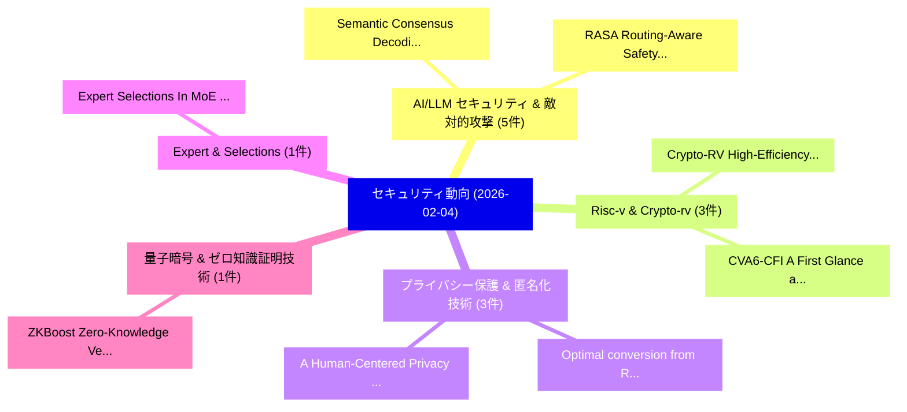

# 📅 02_daily: 日次エグゼクティブサマリー報告書 (2026-02-04)

**集計日時**: 2026-10-02 23:05:56 UTC  
**対象日付**: 2026-02-04  
**本日収集論文数**: 26 件  

---

## 💡 主要セキュリティ動向・脅威インサイト (Executive Insights)

本日の収集論文（計 26 件）において、以下の重点セキュリティ領域で活発な研究動向が確認されました：
- **AI/LLM セキュリティ & 敵対的攻撃** (5 件): 注目論文として 「Semantic Consensus Decoding: B...」、「RASA: Routing-Aware Safety Ali...」 等が発表され、実務防御および攻撃検証の進展が見られます。
- **Risc-v & Crypto-rv** (3 件): 注目論文として 「Crypto-RV: High-Efficiency FPG...」、「CVA6-CFI: A First Glance at RI...」 等が発表され、実務防御および攻撃検証の進展が見られます。
- **プライバシー保護 & 匿名化技術** (3 件): 注目論文として 「Optimal conversion from Rényi ...」、「A Human-Centered Privacy Appro...」 等が発表され、実務防御および攻撃検証の進展が見られます。
- **Expert & Selections** (1 件): 注目論文として 「Expert Selections In MoE Model...」 等が発表され、実務防御および攻撃検証の進展が見られます。
- **量子暗号 & ゼロ知識証明技術** (1 件): 注目論文として 「ZKBoost: Zero-Knowledge Verifi...」 等が発表され、実務防御および攻撃検証の進展が見られます。

### 🗺️ 技術・脅威トピックマインドマップ

---

## 📌 日次セキュリティ論文一覧 (日本語表形式)

| No | arXiv ID | 論文タイトル (日本語訳) | 重要キーワード | 構造化エグゼクティブ要約 (背景・提案・影響) | 脅威分類 | 詳細リンク |
|---|---|---|---|---|---|---|
| 1 | `2602.04105v3` | [Expert Selections In MoE Models Reveal (Almost) As Much As Text（セキュリティ分析論文）](../../okf/papers/2026-02-04/2602.04105.md) | `Models Reveal`, `Amir Nuriyev`, `Gabriel Kulp` | 【提案】概要 (Overview & Key Finding) 本論文「Expert Selections In MoE Models Reveal (Almost) As Much...。実証評価により経営層・セキュリティ管理者向け推奨アクション (E... | `executive-summary` | [arXiv](https://arxiv.org/abs/2602.04105v3) &#124; [OKF](../../okf/papers/2026-02-04/2602.04105.md) |
| 2 | `2602.04113v3` | [ZKBoost: Zero-Knowledge Verifiable Training for XGBoost（セキュリティ分析論文）](../../okf/papers/2026-02-04/2602.04113.md) | `Knowledge Verifiable Training`, `Zero-Knowledge Verifiable`, `Nikolas Melissaris` | 【提案】概要 (Overview & Key Finding) 本論文「ZKBoost: Zero-Knowledge Verifiable Training for XGBoost...。実証評価により経営層・セキュリティ管理者向け推奨アクション (E... | `executive-summary` | [arXiv](https://arxiv.org/abs/2602.04113v3) &#124; [OKF](../../okf/papers/2026-02-04/2602.04113.md) |
| 3 | `2602.04195v1` | [Semantic Consensus Decoding: Backdoor Defense for Verilog Code Generation（セキュリティ分析論文）](../../okf/papers/2026-02-04/2602.04195.md) | `Semantic Consensus Decoding`, `Verilog Code Generation`, `Backdoor Defense` | 【提案】概要 (Overview & Key Finding) 本論文「Semantic Consensus Decoding: Backdoor Defense for Veril...。実証評価により経営層・セキュリティ管理者向け推奨アクション (E... | `executive-summary` | [arXiv](https://arxiv.org/abs/2602.04195v1) &#124; [OKF](../../okf/papers/2026-02-04/2602.04195.md) |
| 4 | `2602.04216v1` | [Availability Attacks Without an Adversary: Evidence from Enterprise LANs（セキュリティ分析論文）](../../okf/papers/2026-02-04/2602.04216.md) | `Availability Attacks Without`, `Al Nahian Bin Emran`, `Rajendra Paudyal` | 【提案】背景とセキュリティ上の課題 (Background & Problem) 本研究はサイバー脅威環境におけるセキュリティ構造・脆弱性の検証を目的としています。(主要検出項目: ...。実証評価により経営層・セキュリティ管理者向け推奨アクション (E... | `cs.NI` | [arXiv](https://arxiv.org/abs/2602.04216v1) &#124; [OKF](../../okf/papers/2026-02-04/2602.04216.md) |
| 5 | `2602.04224v1` | [RAPO: Risk-Aware Preference Optimization for Generalizable Safe Reasoning（セキュリティ分析論文）](../../okf/papers/2026-02-04/2602.04224.md) | `Aware Preference Optimization`, `Generalizable Safe Reasoning`, `Risk-Aware Preference` | 【提案】概要 (Overview & Key Finding) 本論文「RAPO: Risk-Aware Preference Optimization for Generaliza...。実証評価により経営層・セキュリティ管理者向け推奨アクション (E... | `cs.AI` | [arXiv](https://arxiv.org/abs/2602.04224v1) &#124; [OKF](../../okf/papers/2026-02-04/2602.04224.md) |
| 6 | `2602.04238v1` | [Post-Quantum Identity-Based TLS for 5G Service-Based Architecture and Cloud-Native Infrastructure（セキュリティ分析論文）](../../okf/papers/2026-02-04/2602.04238.md) | `Quantum Identity`, `Based Architecture`, `Native Infrastructure` | 【提案】概要 (Overview & Key Finding) 本論文「Post-量子 Identity-Based TLS for 5G Service-Based Archite...。実証評価により経営層・セキュリティ管理者向け推奨アクション (E... | `cybersecurity` | [arXiv](https://arxiv.org/abs/2602.04238v1) &#124; [OKF](../../okf/papers/2026-02-04/2602.04238.md) |
| 7 | `2602.04294v1` | [How Few-shot Demonstrations Affect Prompt-based Defenses Against LLM Jailbreak Attacks（セキュリティ分析論文）](../../okf/papers/2026-02-04/2602.04294.md) | `Demonstrations Affect Prompt`, `Few-shot Demonstrations`, `Jailbreak Attacks` | 【提案】概要 (Overview & Key Finding) 本論文「How Few-shot Demonstrations Affect Prompt-based Defense...。実証評価により経営層・セキュリティ管理者向け推奨アクション (E... | `cs.AI` | [arXiv](https://arxiv.org/abs/2602.04294v1) &#124; [OKF](../../okf/papers/2026-02-04/2602.04294.md) |
| 8 | `2602.04384v1` | [Blockchain 連合学習 for Sustainable Retail: Reducing Waste through Collaborative Demand Forecasting](../../okf/papers/2026-02-04/2602.04384.md) | `Collaborative Demand Forecasting`, `Sustainable Retail`, `Reducing Waste` | 【提案】概要 (Overview & Key Finding) 本論文「Blockchain 連合学習 for Sustainable Retail: Reducing Waste ...。実証評価により経営層・セキュリティ管理者向け推奨アクション (E... | `cs.AI` | [arXiv](https://arxiv.org/abs/2602.04384v1) &#124; [OKF](../../okf/papers/2026-02-04/2602.04384.md) |
| 9 | `2602.04415v1` | [Crypto-RV: High-Efficiency FPGA-Based RISC-V Cryptographic Co-Processor for IoT Security（セキュリティ分析論文）](../../okf/papers/2026-02-04/2602.04415.md) | `Cryptographic Co`, `High-Efficiency FPGA`, `RISC-V Cryptographic` | 【提案】概要 (Overview & Key Finding) 本論文「Crypto-RV: High-Efficiency FPGA-Based RISC-V Cryptograp...。実証評価により経営層・セキュリティ管理者向け推奨アクション (E... | `executive-summary` | [arXiv](https://arxiv.org/abs/2602.04415v1) &#124; [OKF](../../okf/papers/2026-02-04/2602.04415.md) |
| 10 | `2602.04448v2` | [RASA: Routing-Aware Safety Alignment for Mixture-of-Experts Models（セキュリティ分析論文）](../../okf/papers/2026-02-04/2602.04448.md) | `Aware Safety Alignment`, `Experts Models`, `Routing-Aware Safety` | 【提案】概要 (Overview & Key Finding) 本論文「RASA: Routing-Aware Safety Alignment for Mixture-of-Exp...。実証評価により経営層・セキュリティ管理者向け推奨アクション (E... | `cs.AI` | [arXiv](https://arxiv.org/abs/2602.04448v2) &#124; [OKF](../../okf/papers/2026-02-04/2602.04448.md) |
| 11 | `2602.04562v3` | [Optimal conversion from Rényi Differential Privacy to $f$-Differential Privacy（セキュリティ分析論文）](../../okf/papers/2026-02-04/2602.04562.md) | `Differential Privacy`, `Juan Felipe Gomez`, `Julia Anne Schnabel` | 【提案】概要 (Overview & Key Finding) 本論文「Optimal conversion from Rényi 差分プライバシー to $f$-差分プライバシー（...。実証評価により経営層・セキュリティ管理者向け推奨アクション (E... | `cybersecurity` | [arXiv](https://arxiv.org/abs/2602.04562v3) &#124; [OKF](../../okf/papers/2026-02-04/2602.04562.md) |
| 12 | `2602.04616v1` | [A Human-Centered Privacy Approach (HCP) to AI（セキュリティ分析論文）](../../okf/papers/2026-02-04/2602.04616.md) | `Human-Centered Privacy`, `Luyi Sun`, `Wei Xu` | 【提案】概要 (Overview & Key Finding) 本論文「A Human-Centered Privacy Approach (HCP) to AI（セキュリティ分析論...。実証評価により経営層・セキュリティ管理者向け推奨アクション (E... | `cs.AI` | [arXiv](https://arxiv.org/abs/2602.04616v1) &#124; [OKF](../../okf/papers/2026-02-04/2602.04616.md) |
| 13 | `2602.04653v4` | [Inference-Time Backdoors via Chat Templates: From LLM Supply Chains to Agentic System Compromise（セキュリティ分析論文）](../../okf/papers/2026-02-04/2602.04653.md) | `Agentic System Compromise`, `Time Backdoors`, `Chat Templates` | 【提案】概要 (Overview & Key Finding) 本論文「Inference-Time Backdoors via Chat Templates: From LLM S...。実証評価により経営層・セキュリティ管理者向け推奨アクション (E... | `executive-summary` | [arXiv](https://arxiv.org/abs/2602.04653v4) &#124; [OKF](../../okf/papers/2026-02-04/2602.04653.md) |
| 14 | `2602.04694v1` | [The Needle is a Thread: Finding Planted Paths in Noisy Process Trees（セキュリティ分析論文）](../../okf/papers/2026-02-04/2602.04694.md) | `Finding Planted Paths`, `Noisy Process Trees`, `Maya Le` | 【提案】概要 (Overview & Key Finding) 本論文「The Needle is a Thread: Finding Planted Paths in Noisy ...。実証評価により経営層・セキュリティ管理者向け推奨アクション (E... | `executive-summary` | [arXiv](https://arxiv.org/abs/2602.04694v1) &#124; [OKF](../../okf/papers/2026-02-04/2602.04694.md) |
| 15 | `2602.04753v2` | [Comparative Insights on Adversarial Machine Learning from Industry and Academia: A User-Study Approach（セキュリティ分析論文）](../../okf/papers/2026-02-04/2602.04753.md) | `Adversarial Machine Learning`, `Comparative Insights`, `Vishruti Kakkad` | 【提案】概要 (Overview & Key Finding) 本論文「Comparative Insights on Adversarial Machine Learning fr...。実証評価により経営層・セキュリティ管理者向け推奨アクション (E... | `cs.AI` | [arXiv](https://arxiv.org/abs/2602.04753v2) &#124; [OKF](../../okf/papers/2026-02-04/2602.04753.md) |
| 16 | `2602.04859v1` | [Digital signatures with classical shadows on near-term quantum computers（セキュリティ分析論文）](../../okf/papers/2026-02-04/2602.04859.md) | `near-term quantum`, `Pradeep Niroula`, `Minzhao Liu` | 【提案】概要 (Overview & Key Finding) 本論文「Digital signatures with classical shadows on near-term ...。実証評価により経営層・セキュリティ管理者向け推奨アクション (E... | `executive-summary` | [arXiv](https://arxiv.org/abs/2602.04859v1) &#124; [OKF](../../okf/papers/2026-02-04/2602.04859.md) |
| 17 | `2602.04927v1` | [PriMod4AI: Lifecycle-Aware Privacy Threat Modeling for AI Systems using LLM（セキュリティ分析論文）](../../okf/papers/2026-02-04/2602.04927.md) | `Aware Privacy Threat Modeling`, `Lifecycle-Aware Privacy`, `Gautam Savaliya` | 【提案】概要 (Overview & Key Finding) 本論文「PriMod4AI: Lifecycle-Aware Privacy 脅威 Modeling for AI S...。実証評価により経営層・セキュリティ管理者向け推奨アクション (E... | `cs.AI` | [arXiv](https://arxiv.org/abs/2602.04927v1) &#124; [OKF](../../okf/papers/2026-02-04/2602.04927.md) |
| 18 | `2602.04930v2` | [Attack Selection Reduces Safety in Concentrated AI Control Settings against Trusted Monitoring（セキュリティ分析論文）](../../okf/papers/2026-02-04/2602.04930.md) | `Attack Selection Reduces Safety`, `Control Settings`, `Trusted Monitoring` | 【提案】概要 (Overview & Key Finding) 本論文「Attack Selection Reduces Safety in Concentrated AI Cont...。実証評価により経営層・セキュリティ管理者向け推奨アクション (E... | `cs.AI` | [arXiv](https://arxiv.org/abs/2602.04930v2) &#124; [OKF](../../okf/papers/2026-02-04/2602.04930.md) |
| 19 | `2602.04933v1` | [The Birthmark Standard: Privacy-Preserving Photo Authentication via Hardware Roots of Trust and Consortium Blockchain（セキュリティ分析論文）](../../okf/papers/2026-02-04/2602.04933.md) | `Preserving Photo Authentication`, `Privacy-Preserving Photo`, `Hardware Roots` | 【提案】概要 (Overview & Key Finding) 本論文「The Birthmark Standard: Privacy-Preserving Photo Authen...。実証評価により経営層・セキュリティ管理者向け推奨アクション (E... | `executive-summary` | [arXiv](https://arxiv.org/abs/2602.04933v1) &#124; [OKF](../../okf/papers/2026-02-04/2602.04933.md) |
| 20 | `2602.04991v2` | [CVA6-CFI: A First Glance at RISC-V Control-Flow Integrity Extensions（セキュリティ分析論文）](../../okf/papers/2026-02-04/2602.04991.md) | `Flow Integrity Extensions`, `First Glance`, `RISC-V Control` | 【提案】概要 (Overview & Key Finding) 本論文「CVA6-CFI: A First Glance at RISC-V Control-Flow Integri...。実証評価により経営層・セキュリティ管理者向け推奨アクション (E... | `executive-summary` | [arXiv](https://arxiv.org/abs/2602.04991v2) &#124; [OKF](../../okf/papers/2026-02-04/2602.04991.md) |
| 21 | `2602.05002v1` | [System-Level Isolation for Mixed-Criticality RISC-V SoCs: A "World" Reality Check（セキュリティ分析論文）](../../okf/papers/2026-02-04/2602.05002.md) | `Level Isolation`, `System-Level Isolation`, `Reality Check` | 【提案】概要 (Overview & Key Finding) 本論文「System-Level Isolation for Mixed-Criticality RISC-V SoC...。実証評価により経営層・セキュリティ管理者向け推奨アクション (E... | `executive-summary` | [arXiv](https://arxiv.org/abs/2602.05002v1) &#124; [OKF](../../okf/papers/2026-02-04/2602.05002.md) |
| 22 | `2602.05023v2` | [Do Vision-Language Models Respect Contextual Integrity in Location Disclosure?（セキュリティ分析論文）](../../okf/papers/2026-02-04/2602.05023.md) | `Language Models Respect Contextual Integrity`, `Vision-Language Models`, `Location Disclosure` | 【提案】### (日本語題名: Do Vision-Language Models Respect Contextual Integrity in Location Disclosu...。実証評価により経営層・セキュリティ管理者向け推奨アクション (E... | `cs.AI` | [arXiv](https://arxiv.org/abs/2602.05023v2) &#124; [OKF](../../okf/papers/2026-02-04/2602.05023.md) |
| 23 | `2602.05056v2` | [Grounded but Misleading: Evaluating Semantic Alignment in AI-Generated Security Explanations（セキュリティ分析論文）](../../okf/papers/2026-02-04/2602.05056.md) | `Evaluating Semantic Alignment`, `Generated Security Explanations`, `AI-Generated Security` | 【提案】概要 (Overview & Key Finding) 本論文「Grounded but Misleading: Evaluating Semantic Alignment ...。実証評価により経営層・セキュリティ管理者向け推奨アクション (E... | `executive-summary` | [arXiv](https://arxiv.org/abs/2602.05056v2) &#124; [OKF](../../okf/papers/2026-02-04/2602.05056.md) |
| 24 | `2602.05066v2` | [Bypassing AI Control Protocols via Agent-as-a-Proxy Attacks（セキュリティ分析論文）](../../okf/papers/2026-02-04/2602.05066.md) | `Control Protocols`, `Proxy Attacks`, `a-Proxy Attacks` | 【提案】概要 (Overview & Key Finding) 本論文「Bypassing AI Control Protocols via Agent-as-a-Proxy Att...。実証評価により経営層・セキュリティ管理者向け推奨アクション (E... | `cs.AI` | [arXiv](https://arxiv.org/abs/2602.05066v2) &#124; [OKF](../../okf/papers/2026-02-04/2602.05066.md) |
| 25 | `2602.05089v3` | [Beware Untrusted Simulators -- Reward-Free Backdoor Attacks in Reinforcement Learning（セキュリティ分析論文）](../../okf/papers/2026-02-04/2602.05089.md) | `Beware Untrusted Simulators`, `Free Backdoor Attacks`, `Reward-Free Backdoor` | 【提案】概要 (Overview & Key Finding) 本論文「Beware Untrusted Simulators -- Reward-Free Backdoor Att...。実証評価により経営層・セキュリティ管理者向け推奨アクション (E... | `executive-summary` | [arXiv](https://arxiv.org/abs/2602.05089v3) &#124; [OKF](../../okf/papers/2026-02-04/2602.05089.md) |
| 26 | `2602.05098v1` | [Crypto-asset Taxonomy for Investors and Regulators（セキュリティ分析論文）](../../okf/papers/2026-02-04/2602.05098.md) | `Crypto-asset Taxonomy`, `Xiao Zhang`, `Juan Ignacio` | 【提案】概要 (Overview & Key Finding) 本論文「Crypto-asset Taxonomy for Investors and Regulators（セキュリ...。実証評価により経営層・セキュリティ管理者向け推奨アクション (E... | `cybersecurity` | [arXiv](https://arxiv.org/abs/2602.05098v1) &#124; [OKF](../../okf/papers/2026-02-04/2602.05098.md) |

