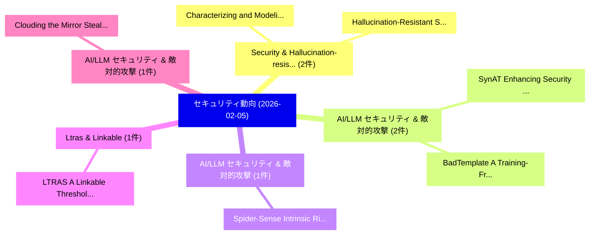

# 📅 02_daily: 日次エグゼクティブサマリー報告書 (2026-02-05)

**集計日時**: 2026-10-02 23:05:56 UTC  
**対象日付**: 2026-02-05  
**本日収集論文数**: 21 件  

---

## 💡 主要セキュリティ動向・脅威インサイト (Executive Insights)

本日の収集論文（計 21 件）において、以下の重点セキュリティ領域で活発な研究動向が確認されました：
- **Security & Hallucination-resistant** (2 件): 注目論文として 「Hallucination-Resistant Securi...」、「Characterizing and Modeling th...」 等が発表され、実務防御および攻撃検証の進展が見られます。
- **AI/LLM セキュリティ & 敵対的攻撃** (2 件): 注目論文として 「SynAT: Enhancing Security Know...」、「BadTemplate: A Training-Free B...」 等が発表され、実務防御および攻撃検証の進展が見られます。
- **AI/LLM セキュリティ & 敵対的攻撃** (1 件): 注目論文として 「Spider-Sense: Intrinsic Risk S...」 等が発表され、実務防御および攻撃検証の進展が見られます。
- **Ltras & Linkable** (1 件): 注目論文として 「LTRAS: A Linkable Threshold Ri...」 等が発表され、実務防御および攻撃検証の進展が見られます。
- **AI/LLM セキュリティ & 敵対的攻撃** (1 件): 注目論文として 「Clouding the Mirror: Stealthy ...」 等が発表され、実務防御および攻撃検証の進展が見られます。

### 🗺️ 技術・脅威トピックマインドマップ

---

## 📌 日次セキュリティ論文一覧 (日本語表形式)

| No | arXiv ID | 論文タイトル (日本語訳) | 重要キーワード | 構造化エグゼクティブ要約 (背景・提案・影響) | 脅威分類 | 詳細リンク |
|---|---|---|---|---|---|---|
| 1 | `2602.05279v1` | [Hallucination-Resistant Security Planning with a Large Language Model（セキュリティ分析論文）](../../okf/papers/2026-02-05/2602.05279.md) | `Resistant Security Planning`, `Large Language Model`, `Hallucination-Resistant Security` | 【提案】概要 (Overview & Key Finding) 本論文「Hallucination-Resistant Security Planning with a Large ...。実証評価により経営層・セキュリティ管理者向け推奨アクション (E... | `cs.AI` | [arXiv](https://arxiv.org/abs/2602.05279v1) &#124; [OKF](../../okf/papers/2026-02-05/2602.05279.md) |
| 2 | `2602.05329v1` | [SynAT: Enhancing Security Knowledge Bases via Automatic Synthesizing Attack Tree from Crowd Discussions（セキュリティ分析論文）](../../okf/papers/2026-02-05/2602.05329.md) | `Enhancing Security Knowledge Bases`, `Automatic Synthesizing Attack Tree`, `Crowd Discussions` | 【提案】概要 (Overview & Key Finding) 本論文「SynAT: Enhancing Security Knowledge Bases via Automatic...。実証評価により経営層・セキュリティ管理者向け推奨アクション (E... | `cybersecurity` | [arXiv](https://arxiv.org/abs/2602.05329v1) &#124; [OKF](../../okf/papers/2026-02-05/2602.05329.md) |
| 3 | `2602.05386v2` | [Spider-Sense: Intrinsic Risk Sensing for Efficient Agent Defense with Hierarchical Adaptive Screening（セキュリティ分析論文）](../../okf/papers/2026-02-05/2602.05386.md) | `Intrinsic Risk Sensing`, `Efficient Agent Defense`, `Hierarchical Adaptive Screening` | 【提案】概要 (Overview & Key Finding) 本論文「Spider-Sense: Intrinsic Risk Sensing for Efficient Agen...。実証評価により経営層・セキュリティ管理者向け推奨アクション (E... | `cs.AI` | [arXiv](https://arxiv.org/abs/2602.05386v2) &#124; [OKF](../../okf/papers/2026-02-05/2602.05386.md) |
| 4 | `2602.05401v1` | [BadTemplate: A Training-Free Backdoor Attack via Chat Template Against 大規模言語モデル](../../okf/papers/2026-02-05/2602.05401.md) | `Free Backdoor Attack`, `Training-Free Backdoor`, `Zihan Wang` | 【提案】概要 (Overview & Key Finding) 本論文「BadTemplate: A Training-Free Backdoor Attack via Chat T...。実証評価により経営層・セキュリティ管理者向け推奨アクション (E... | `cybersecurity` | [arXiv](https://arxiv.org/abs/2602.05401v1) &#124; [OKF](../../okf/papers/2026-02-05/2602.05401.md) |
| 5 | `2602.05431v1` | [LTRAS: A Linkable Threshold Ring Adaptor Signature Scheme for Efficient and Private Cross-Chain Transactions（セキュリティ分析論文）](../../okf/papers/2026-02-05/2602.05431.md) | `Linkable Threshold Ring Adaptor Signature Scheme`, `Private Cross`, `Chain Transactions` | 【提案】概要 (Overview & Key Finding) 本論文「LTRAS: A Linkable Threshold Ring Adaptor Signature Sche...。実証評価により経営層・セキュリティ管理者向け推奨アクション (E... | `cybersecurity` | [arXiv](https://arxiv.org/abs/2602.05431v1) &#124; [OKF](../../okf/papers/2026-02-05/2602.05431.md) |
| 6 | `2602.05484v1` | [Clouding the Mirror: Stealthy Prompt Injection Attacks Targeting LLM-based Phishing Detection（セキュリティ分析論文）](../../okf/papers/2026-02-05/2602.05484.md) | `Stealthy Prompt Injection Attacks Targeting`, `Phishing Detection`, `LLM-based Phishing` | 【提案】概要 (Overview & Key Finding) 本論文「Clouding the Mirror: Stealthy プロンプトインジェクション Attacks Tar...。実証評価により経営層・セキュリティ管理者向け推奨アクション (E... | `cybersecurity` | [arXiv](https://arxiv.org/abs/2602.05484v1) &#124; [OKF](../../okf/papers/2026-02-05/2602.05484.md) |
| 7 | `2602.05486v1` | [Sovereign-by-Design A Reference Architecture for AI and Blockchain Enabled Systems（セキュリティ分析論文）](../../okf/papers/2026-02-05/2602.05486.md) | `Blockchain Enabled Systems`, `Reference Architecture`, `Matteo Esposito` | 【提案】概要 (Overview & Key Finding) 本論文「Sovereign-by-Design A Reference Architecture for AI and...。実証評価により経営層・セキュリティ管理者向け推奨アクション (E... | `cs.AI` | [arXiv](https://arxiv.org/abs/2602.05486v1) &#124; [OKF](../../okf/papers/2026-02-05/2602.05486.md) |
| 8 | `2602.05517v1` | [GNSS SpAmming: a spoofing-based GNSS denial-of-service attack（セキュリティ分析論文）](../../okf/papers/2026-02-05/2602.05517.md) | `spoofing-based GNSS`, `Sergio Angulo`, `Javier Junquera` | 【提案】概要 (Overview & Key Finding) 本論文「GNSS SpAmming: a spoofing-based GNSS denial-of-service ...。実証評価により経営層・セキュリティ管理者向け推奨アクション (E... | `executive-summary` | [arXiv](https://arxiv.org/abs/2602.05517v1) &#124; [OKF](../../okf/papers/2026-02-05/2602.05517.md) |
| 9 | `2602.05594v3` | [Deep Learning for Contextualized NetFlow-Based Network Intrusion Detection: Methods, Data, Evaluation and Deployment（セキュリティ分析論文）](../../okf/papers/2026-02-05/2602.05594.md) | `Based Network Intrusion Detection`, `Deep Learning`, `NetFlow-Based Network` | 【提案】概要 (Overview & Key Finding) 本論文「Deep Learning for Contextualized NetFlow-Based Network ...。実証評価により経営層・セキュリティ管理者向け推奨アクション (E... | `cybersecurity` | [arXiv](https://arxiv.org/abs/2602.05594v3) &#124; [OKF](../../okf/papers/2026-02-05/2602.05594.md) |
| 10 | `2602.05612v1` | [ADCA: Attention-Driven Multi-Party Collusion Attack in Federated Self-Supervised Learning（セキュリティ分析論文）](../../okf/papers/2026-02-05/2602.05612.md) | `Party Collusion Attack`, `Driven Multi`, `Federated Self` | 【提案】概要 (Overview & Key Finding) 本論文「ADCA: Attention-Driven Multi-Party Collusion Attack in ...。実証評価により経営層・セキュリティ管理者向け推奨アクション (E... | `cybersecurity` | [arXiv](https://arxiv.org/abs/2602.05612v1) &#124; [OKF](../../okf/papers/2026-02-05/2602.05612.md) |
| 11 | `2602.05641v1` | [Time-Complexity Characterization of NIST Lightweight Cryptography Finalists（セキュリティ分析論文）](../../okf/papers/2026-02-05/2602.05641.md) | `Lightweight Cryptography Finalists`, `Complexity Characterization`, `Time-Complexity Characterization` | 【提案】概要 (Overview & Key Finding) 本論文「Time-Complexity Characterization of NIST Lightweight 暗号...。実証評価により経営層・セキュリティ管理者向け推奨アクション (E... | `cybersecurity` | [arXiv](https://arxiv.org/abs/2602.05641v1) &#124; [OKF](../../okf/papers/2026-02-05/2602.05641.md) |
| 12 | `2602.05674v2` | [Fast Private Adaptive Query Answering for Large Data Domains（セキュリティ分析論文）](../../okf/papers/2026-02-05/2602.05674.md) | `Fast Private Adaptive Query Answering`, `Large Data Domains`, `Miguel Fuentes` | 【提案】概要 (Overview & Key Finding) 本論文「Fast Private Adaptive Query Answering for Large Data Do...。実証評価により経営層・セキュリティ管理者向け推奨アクション (E... | `cs.DB` | [arXiv](https://arxiv.org/abs/2602.05674v2) &#124; [OKF](../../okf/papers/2026-02-05/2602.05674.md) |
| 13 | `2602.05759v2` | [Toward Quantum-Safe Software Engineering: A Vision for Post-Quantum Cryptography Migration（セキュリティ分析論文）](../../okf/papers/2026-02-05/2602.05759.md) | `Safe Software Engineering`, `Quantum Cryptography Migration`, `Toward Quantum` | 【提案】概要 (Overview & Key Finding) 本論文「Toward 量子-Safe Software Engineering: A Vision for ポスト量子...。実証評価により経営層・セキュリティ管理者向け推奨アクション (E... | `executive-summary` | [arXiv](https://arxiv.org/abs/2602.05759v2) &#124; [OKF](../../okf/papers/2026-02-05/2602.05759.md) |
| 14 | `2602.05817v2` | [Interpreting Manifolds and Graph Neural Embeddings from Internet of Things Traffic Flows（セキュリティ分析論文）](../../okf/papers/2026-02-05/2602.05817.md) | `Graph Neural Embeddings`, `Things Traffic Flows`, `Interpreting Manifolds` | 【提案】概要 (Overview & Key Finding) 本論文「Interpreting Manifolds and Graph Neural Embeddings from...。実証評価により経営層・セキュリティ管理者向け推奨アクション (E... | `cs.NI` | [arXiv](https://arxiv.org/abs/2602.05817v2) &#124; [OKF](../../okf/papers/2026-02-05/2602.05817.md) |
| 15 | `2602.05838v2` | [FHAIM: Fully Homomorphic AIM For Private Synthetic Data Generation（セキュリティ分析論文）](../../okf/papers/2026-02-05/2602.05838.md) | `Fully Homomorphic`, `Martine De Cock`, `Mayank Kumar` | 【提案】概要 (Overview & Key Finding) 本論文「FHAIM: Fully Homomorphic AIM For Private Synthetic Data...。実証評価により経営層・セキュリティ管理者向け推奨アクション (E... | `cs.AI` | [arXiv](https://arxiv.org/abs/2602.05838v2) &#124; [OKF](../../okf/papers/2026-02-05/2602.05838.md) |
| 16 | `2602.05868v1` | [Persistent Human Feedback, LLMs, and Static Analyzers for Secure Code Generation and 脆弱性検出](../../okf/papers/2026-02-05/2602.05868.md) | `Persistent Human Feedback`, `Secure Code Generation`, `Static Analyzers` | 【提案】概要 (Overview & Key Finding) 本論文「Persistent Human Feedback, LLMs, and Static Analyzers f...。実証評価により経営層・セキュリティ管理者向け推奨アクション (E... | `cybersecurity` | [arXiv](https://arxiv.org/abs/2602.05868v1) &#124; [OKF](../../okf/papers/2026-02-05/2602.05868.md) |
| 17 | `2602.06009v2` | [Characterizing and Modeling the GitHub Security Advisories Review Pipeline（セキュリティ分析論文）](../../okf/papers/2026-02-05/2602.06009.md) | `Security Advisories Review Pipeline`, `Carlos Eduardo Banjar`, `Hudson Silva Borges` | 【提案】概要 (Overview & Key Finding) 本論文「Characterizing and Modeling the GitHub Security Advisor...。実証評価により経営層・セキュリティ管理者向け推奨アクション (E... | `executive-summary` | [arXiv](https://arxiv.org/abs/2602.06009v2) &#124; [OKF](../../okf/papers/2026-02-05/2602.06009.md) |
| 18 | `2602.06110v1` | [Private and interpretable clinical prediction with quantum-inspired tensor train models（セキュリティ分析論文）](../../okf/papers/2026-02-05/2602.06110.md) | `quantum-inspired tensor`, `Pareja Monturiol`, `Juliette Sinnott` | 【提案】概要 (Overview & Key Finding) 本論文「Private and interpretable clinical prediction with 量子-i...。実証評価により経営層・セキュリティ管理者向け推奨アクション (E... | `executive-summary` | [arXiv](https://arxiv.org/abs/2602.06110v1) &#124; [OKF](../../okf/papers/2026-02-05/2602.06110.md) |
| 19 | `2602.06172v1` | [Know Your Scientist: KYC as Biosecurity Infrastructure（セキュリティ分析論文）](../../okf/papers/2026-02-05/2602.06172.md) | `Biosecurity Infrastructure`, `Jonathan Feldman`, `Tal Feldman` | 【提案】概要 (Overview & Key Finding) 本論文「Know Your Scientist: KYC as Biosecurity Infrastructure（...。実証評価により経営層・セキュリティ管理者向け推奨アクション (E... | `executive-summary` | [arXiv](https://arxiv.org/abs/2602.06172v1) &#124; [OKF](../../okf/papers/2026-02-05/2602.06172.md) |
| 20 | `2602.06238v1` | [Private Sum Computation: Trade-Offs between Communication, Randomness, and Privacy（セキュリティ分析論文）](../../okf/papers/2026-02-05/2602.06238.md) | `Private Sum Computation`, `Joerg Kliewer`, `Aylin Yener` | 【提案】概要 (Overview & Key Finding) 本論文「Private Sum Computation: Trade-Offs between Communicati...。実証評価により経営層・セキュリティ管理者向け推奨アクション (E... | `executive-summary` | [arXiv](https://arxiv.org/abs/2602.06238v1) &#124; [OKF](../../okf/papers/2026-02-05/2602.06238.md) |
| 21 | `2603.20198v1` | [Visual Exclusivity Attacks: Automatic Multimodal Red Teaming via Agentic Planning（セキュリティ分析論文）](../../okf/papers/2026-02-05/2603.20198.md) | `Automatic Multimodal Red Teaming`, `Visual Exclusivity Attacks`, `Agentic Planning` | 【提案】概要 (Overview & Key Finding) 本論文「Visual Exclusivity Attacks: Automatic Multimodal Red Te...。実証評価により経営層・セキュリティ管理者向け推奨アクション (E... | `cs.CV` | [arXiv](https://arxiv.org/abs/2603.20198v1) &#124; [OKF](../../okf/papers/2026-02-05/2603.20198.md) |

