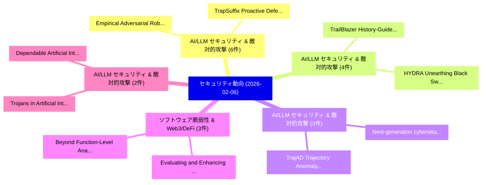

# 📅 02_daily: 日次エグゼクティブサマリー報告書 (2026-02-06)

**集計日時**: 2026-10-02 23:05:57 UTC  
**対象日付**: 2026-02-06  
**本日収集論文数**: 42 件  

---

## 💡 主要セキュリティ動向・脅威インサイト (Executive Insights)

本日の収集論文（計 42 件）において、以下の重点セキュリティ領域で活発な研究動向が確認されました：
- **AI/LLM セキュリティ & 敵対的攻撃** (6 件): 注目論文として 「Empirical Adversarial Robustne...」、「TrapSuffix: Proactive Defense ...」 等が発表され、実務防御および攻撃検証の進展が見られます。
- **AI/LLM セキュリティ & 敵対的攻撃** (4 件): 注目論文として 「TrailBlazer: History-Guided Re...」、「HYDRA: Unearthing "Black Swan"...」 等が発表され、実務防御および攻撃検証の進展が見られます。
- **AI/LLM セキュリティ & 敵対的攻撃** (3 件): 注目論文として 「TrajAD: Trajectory Anomaly Det...」、「Next-generation cyberattack de...」 等が発表され、実務防御および攻撃検証の進展が見られます。
- **ソフトウェア脆弱性 & Web3/DeFi** (3 件): 注目論文として 「Evaluating and Enhancing the V...」、「Beyond Function-Level Analysis...」 等が発表され、実務防御および攻撃検証の進展が見られます。
- **AI/LLM セキュリティ & 敵対的攻撃** (2 件): 注目論文として 「Dependable Artificial Intellig...」、「Trojans in Artificial Intellig...」 等が発表され、実務防御および攻撃検証の進展が見られます。

### 🗺️ 技術・脅威トピックマインドマップ

---

## 📌 日次セキュリティ論文一覧 (日本語表形式)

| No | arXiv ID | 論文タイトル (日本語訳) | 重要キーワード | 構造化エグゼクティブ要約 (背景・提案・影響) | 脅威分類 | 詳細リンク |
|---|---|---|---|---|---|---|
| 1 | `2602.06325v1` | [Identifying Adversary Tactics and Techniques in Malware Binaries with an LLM Agent（セキュリティ分析論文）](../../okf/papers/2026-02-06/2602.06325.md) | `Identifying Adversary Tactics`, `Malware Binaries`, `Zhou Xuan` | 【提案】概要 (Overview & Key Finding) 本論文「Identifying Adversary Tactics and Techniques in マルウェア B...。実証評価により経営層・セキュリティ管理者向け推奨アクション (E... | `executive-summary` | [arXiv](https://arxiv.org/abs/2602.06325v1) &#124; [OKF](../../okf/papers/2026-02-06/2602.06325.md) |
| 2 | `2602.06336v1` | [AdFL: In-Browser 連合学習 for Online Advertisement](../../okf/papers/2026-02-06/2602.06336.md) | `Online Advertisement`, `Browser Federated Learning`, `In-Browser Federated` | 【提案】概要 (Overview & Key Finding) 本論文「AdFL: In-Browser 連合学習 for Online Advertisement」（原題: AdF...。実証評価により経営層・セキュリティ管理者向け推奨アクション (E... | `executive-summary` | [arXiv](https://arxiv.org/abs/2602.06336v1) &#124; [OKF](../../okf/papers/2026-02-06/2602.06336.md) |
| 3 | `2602.06345v1` | [Zero-Trust Runtime Verification for Agentic Payment Protocols: Mitigating Replay and Context-Binding Failures in AP2（セキュリティ分析論文）](../../okf/papers/2026-02-06/2602.06345.md) | `Trust Runtime Verification`, `Agentic Payment Protocols`, `Mitigating Replay` | 【提案】概要 (Overview & Key Finding) 本論文「ゼロトラスト Runtime Verification for Agentic Payment Protoco...。実証評価により経営層・セキュリティ管理者向け推奨アクション (E... | `cs.AI` | [arXiv](https://arxiv.org/abs/2602.06345v1) &#124; [OKF](../../okf/papers/2026-02-06/2602.06345.md) |
| 4 | `2602.06395v1` | [Empirical Adversarial Robustness and Explainability Drift in Cybersecurity Classifiersの分析](../../okf/papers/2026-02-06/2602.06395.md) | `Explainability Drift`, `Empirical Adversarial Robustness`, `Adversarial Robustness` | 【提案】概要 (Overview & Key Finding) 本論文「Empirical Adversarial Robustness and Explainability Dri...。実証評価により経営層・セキュリティ管理者向け推奨アクション (E... | `cs.AI` | [arXiv](https://arxiv.org/abs/2602.06395v1) &#124; [OKF](../../okf/papers/2026-02-06/2602.06395.md) |
| 5 | `2602.06409v2` | [VENOMREC: Cross-Modal Interactive Poisoning for Targeted Promotion in Multimodal LLM Recommender Systems（セキュリティ分析論文）](../../okf/papers/2026-02-06/2602.06409.md) | `Modal Interactive Poisoning`, `Targeted Promotion`, `Recommender Systems` | 【提案】概要 (Overview & Key Finding) 本論文「VENOMREC: Cross-Modal Interactive Poisoning for Targete...。実証評価により経営層・セキュリティ管理者向け推奨アクション (E... | `cybersecurity` | [arXiv](https://arxiv.org/abs/2602.06409v2) &#124; [OKF](../../okf/papers/2026-02-06/2602.06409.md) |
| 6 | `2602.06433v1` | [The Avatar Cache: Enabling On-Demand Security with Morphable Cache Architecture（セキュリティ分析論文）](../../okf/papers/2026-02-06/2602.06433.md) | `Morphable Cache Architecture`, `Demand Security`, `On-Demand Security` | 【提案】概要 (Overview & Key Finding) 本論文「The Avatar Cache: Enabling On-Demand Security with Morp...。実証評価により経営層・セキュリティ管理者向け推奨アクション (E... | `executive-summary` | [arXiv](https://arxiv.org/abs/2602.06433v1) &#124; [OKF](../../okf/papers/2026-02-06/2602.06433.md) |
| 7 | `2602.06440v1` | [TrailBlazer: History-Guided Reinforcement Learning for Black-Box LLM Jailbreaking（セキュリティ分析論文）](../../okf/papers/2026-02-06/2602.06440.md) | `Guided Reinforcement Learning`, `History-Guided Reinforcement`, `Black-Box LLM` | 【提案】概要 (Overview & Key Finding) 本論文「TrailBlazer: History-Guided Reinforcement Learning for ...。実証評価により経営層・セキュリティ管理者向け推奨アクション (E... | `cs.AI` | [arXiv](https://arxiv.org/abs/2602.06440v1) &#124; [OKF](../../okf/papers/2026-02-06/2602.06440.md) |
| 8 | `2602.06443v1` | [TrajAD: Trajectory Anomaly Detection for Trustworthy LLMエージェント](../../okf/papers/2026-02-06/2602.06443.md) | `Trajectory Anomaly Detection`, `Yibing Liu`, `Chong Zhang` | 【提案】概要 (Overview & Key Finding) 本論文「TrajAD: Trajectory Anomaly Detection for Trustworthy LL...。実証評価により経営層・セキュリティ管理者向け推奨アクション (E... | `cs.AI` | [arXiv](https://arxiv.org/abs/2602.06443v1) &#124; [OKF](../../okf/papers/2026-02-06/2602.06443.md) |
| 9 | `2602.06495v2` | [Graphs Don't Stay Secret: Practical Subgraph Reconstruction Attacks on Defended Graph RAG（セキュリティ分析論文）](../../okf/papers/2026-02-06/2602.06495.md) | `Practical Subgraph Reconstruction Attacks`, `Graphs Don`, `Stay Secret` | 【提案】概要 (Overview & Key Finding) 本論文「Graphs Don't Stay Secret: Practical Subgraph Reconstruc...。実証評価により経営層・セキュリティ管理者向け推奨アクション (E... | `cybersecurity` | [arXiv](https://arxiv.org/abs/2602.06495v2) &#124; [OKF](../../okf/papers/2026-02-06/2602.06495.md) |
| 10 | `2602.06518v2` | [Sequential Auditing for f-Differential Privacy（セキュリティ分析論文）](../../okf/papers/2026-02-06/2602.06518.md) | `Sequential Auditing`, `Differential Privacy`, `f-Differential Privacy` | 【提案】概要 (Overview & Key Finding) 本論文「Sequential Auditing for f-差分プライバシー（セキュリティ分析論文）」（原題: Seq...。実証評価により経営層・セキュリティ管理者向け推奨アクション (E... | `stat.ME` | [arXiv](https://arxiv.org/abs/2602.06518v2) &#124; [OKF](../../okf/papers/2026-02-06/2602.06518.md) |
| 11 | `2602.06530v2` | [Universal Anti-forensics Attack against Image Forgery Detection via Multi-modal Guidance（セキュリティ分析論文）](../../okf/papers/2026-02-06/2602.06530.md) | `Image Forgery Detection`, `Universal Anti`, `Anti-forensics Attack` | 【提案】概要 (Overview & Key Finding) 本論文「Universal Anti-forensics Attack against Image Forgery D...。実証評価により経営層・セキュリティ管理者向け推奨アクション (E... | `cs.CV` | [arXiv](https://arxiv.org/abs/2602.06530v2) &#124; [OKF](../../okf/papers/2026-02-06/2602.06530.md) |
| 12 | `2602.06532v1` | [Dependable Artificial Intelligence with Reliability and Security (DAIReS): A Unified Syndrome Decoding Approach for Hallucination and Backdoor Trigger Detection（セキュリティ分析論文）](../../okf/papers/2026-02-06/2602.06532.md) | `Dependable Artificial Intelligence`, `Backdoor Trigger Detection`, `Hema Karnam Surendrababu` | 【提案】概要 (Overview & Key Finding) 本論文「Dependable Artificial Intelligence with Reliability and...。実証評価により経営層・セキュリティ管理者向け推奨アクション (E... | `cybersecurity` | [arXiv](https://arxiv.org/abs/2602.06532v1) &#124; [OKF](../../okf/papers/2026-02-06/2602.06532.md) |
| 13 | `2602.06534v1` | [AlertBERT: A noise-robust alert grouping framework for simultaneous cyber attacks（セキュリティ分析論文）](../../okf/papers/2026-02-06/2602.06534.md) | `noise-robust alert`, `Lukas Karner`, `Max Landauer` | 【提案】概要 (Overview & Key Finding) 本論文「AlertBERT: A noise-robust alert grouping framework for ...。実証評価により経営層・セキュリティ管理者向け推奨アクション (E... | `executive-summary` | [arXiv](https://arxiv.org/abs/2602.06534v1) &#124; [OKF](../../okf/papers/2026-02-06/2602.06534.md) |
| 14 | `2602.06547v4` | ["Do Not Mention This to the User": Detecting and Understanding Malicious Agent Skills in the Wild（セキュリティ分析論文）](../../okf/papers/2026-02-06/2602.06547.md) | `Understanding Malicious Agent Skills`, `Leo Yu Zhang`, `Yi Liu` | 【提案】背景とセキュリティ上の課題 (Background & Problem) 本研究はサイバー脅威環境におけるセキュリティ構造・脆弱性の検証を目的としています。(主要検出項目: ...。実証評価により経営層・セキュリティ管理者向け推奨アクション (E... | `cs.ET` | [arXiv](https://arxiv.org/abs/2602.06547v4) &#124; [OKF](../../okf/papers/2026-02-06/2602.06547.md) |
| 15 | `2602.06608v1` | [A Survey of Security Threats and Trust Management in Vehicular Ad Hoc Networks（セキュリティ分析論文）](../../okf/papers/2026-02-06/2602.06608.md) | `Vehicular Ad Hoc Networks`, `Security Threats`, `Trust Management` | 【提案】概要 (Overview & Key Finding) 本論文「A Survey of Security Threats and Trust Management in Ve...。実証評価により経営層・セキュリティ管理者向け推奨アクション (E... | `cybersecurity` | [arXiv](https://arxiv.org/abs/2602.06608v1) &#124; [OKF](../../okf/papers/2026-02-06/2602.06608.md) |
| 16 | `2602.06612v2` | [HYDRA: Unearthing "Black Swan" Vulnerabilities in LEO Satellite Networks（セキュリティ分析論文）](../../okf/papers/2026-02-06/2602.06612.md) | `Black Swan`, `Satellite Networks`, `Bintao Yuan` | 【提案】概要 (Overview & Key Finding) 本論文「HYDRA: Unearthing "Black Swan" Vulnerabilities in LEO S...。実証評価により経営層・セキュリティ管理者向け推奨アクション (E... | `cybersecurity` | [arXiv](https://arxiv.org/abs/2602.06612v2) &#124; [OKF](../../okf/papers/2026-02-06/2602.06612.md) |
| 17 | `2602.06616v1` | [Confundo: Learning to Generate Robust Poison for Practical RAG Systems（セキュリティ分析論文）](../../okf/papers/2026-02-06/2602.06616.md) | `Generate Robust Poison`, `Haoyang Hu`, `Zhejun Jiang` | 【提案】概要 (Overview & Key Finding) 本論文「Confundo: Learning to Generate Robust Poison for Practi...。実証評価により経営層・セキュリティ管理者向け推奨アクション (E... | `executive-summary` | [arXiv](https://arxiv.org/abs/2602.06616v1) &#124; [OKF](../../okf/papers/2026-02-06/2602.06616.md) |
| 18 | `2602.06623v1` | [Do Prompts Guarantee Safety? Mitigating Toxicity from LLM Generations through Subspace Intervention（セキュリティ分析論文）](../../okf/papers/2026-02-06/2602.06623.md) | `Mitigating Toxicity`, `Subspace Intervention`, `Himanshu Singh` | 【提案】Mitigating Toxicity from LLM Generations through Subspace Intervention ### (日本語題名: Do P...。実証評価により経営層・セキュリティ管理者向け推奨アクション (E... | `executive-summary` | [arXiv](https://arxiv.org/abs/2602.06623v1) &#124; [OKF](../../okf/papers/2026-02-06/2602.06623.md) |
| 19 | `2602.06630v1` | [TrapSuffix: Proactive Defense Against Adversarial Suffixes in Jailbreaking（セキュリティ分析論文）](../../okf/papers/2026-02-06/2602.06630.md) | `Mengyao Du`, `Han Fang`, `Haokai Ma` | 【提案】概要 (Overview & Key Finding) 本論文「TrapSuffix: Proactive Defense Against Adversarial Suffi...。実証評価により経営層・セキュリティ管理者向け推奨アクション (E... | `cybersecurity` | [arXiv](https://arxiv.org/abs/2602.06630v1) &#124; [OKF](../../okf/papers/2026-02-06/2602.06630.md) |
| 20 | `2602.06634v1` | [Jamming Attacks on the Random Access Channel in 5G and B5G Networks（セキュリティ分析論文）](../../okf/papers/2026-02-06/2602.06634.md) | `Random Access Channel`, `Jamming Attacks`, `Wilfrid Azariah` | 【提案】概要 (Overview & Key Finding) 本論文「Jamming Attacks on the Random Access Channel in 5G and ...。実証評価により経営層・セキュリティ管理者向け推奨アクション (E... | `cybersecurity` | [arXiv](https://arxiv.org/abs/2602.06634v1) &#124; [OKF](../../okf/papers/2026-02-06/2602.06634.md) |
| 21 | `2602.06655v2` | [Wonderboom -- Efficient, and Censorship-Resilient Signature Aggregation for Million Scale Consensus（セキュリティ分析論文）](../../okf/papers/2026-02-06/2602.06655.md) | `Resilient Signature Aggregation`, `Million Scale Consensus`, `Censorship-Resilient Signature` | 【提案】概要 (Overview & Key Finding) 本論文「Wonderboom -- Efficient, and Censorship-Resilient Signa...。実証評価により経営層・セキュリティ管理者向け推奨アクション (E... | `executive-summary` | [arXiv](https://arxiv.org/abs/2602.06655v2) &#124; [OKF](../../okf/papers/2026-02-06/2602.06655.md) |
| 22 | `2602.06687v1` | [Evaluating and Enhancing the Vulnerability Reasoning Capabilities of 大規模言語モデル](../../okf/papers/2026-02-06/2602.06687.md) | `Vulnerability Reasoning Capabilities`, `Large Language Models`, `Li Lu` | 【提案】概要 (Overview & Key Finding) 本論文「Evaluating and Enhancing the 脆弱性 Reasoning Capabilities...。実証評価により経営層・セキュリティ管理者向け推奨アクション (E... | `cybersecurity` | [arXiv](https://arxiv.org/abs/2602.06687v1) &#124; [OKF](../../okf/papers/2026-02-06/2602.06687.md) |
| 23 | `2602.06700v1` | [Taipan: A Query-free Transfer-based Multiple Sensitive Attribute Inference Attack Solely from Publicly Released Graphs（セキュリティ分析論文）](../../okf/papers/2026-02-06/2602.06700.md) | `Multiple Sensitive Attribute Inference Attack Solely`, `Publicly Released Graphs`, `Query-free Transfer` | 【提案】概要 (Overview & Key Finding) 本論文「Taipan: A Query-free Transfer-based Multiple Sensitive ...。実証評価により経営層・セキュリティ管理者向け推奨アクション (E... | `executive-summary` | [arXiv](https://arxiv.org/abs/2602.06700v1) &#124; [OKF](../../okf/papers/2026-02-06/2602.06700.md) |
| 24 | `2602.06718v2` | [GhostCite: A Large-Scale Citation Validity in the Age of Large Language Modelsの分析](../../okf/papers/2026-02-06/2602.06718.md) | `Large Language Models`, `Scale Citation Validity`, `Citation Validity` | 【提案】概要 (Overview & Key Finding) 本論文「GhostCite: A Large-Scale Citation Validity in the Age o...。実証評価により経営層・セキュリティ管理者向け推奨アクション (E... | `cs.AI` | [arXiv](https://arxiv.org/abs/2602.06718v2) &#124; [OKF](../../okf/papers/2026-02-06/2602.06718.md) |
| 25 | `2602.06751v1` | [Beyond Function-Level Analysis: Context-Aware Reasoning for Inter-Procedural 脆弱性検出](../../okf/papers/2026-02-06/2602.06751.md) | `Beyond Function`, `Aware Reasoning`, `Context-Aware Reasoning` | 【提案】概要 (Overview & Key Finding) 本論文「Beyond Function-Level Analysis: Context-Aware Reasoning...。実証評価により経営層・セキュリティ管理者向け推奨アクション (E... | `executive-summary` | [arXiv](https://arxiv.org/abs/2602.06751v1) &#124; [OKF](../../okf/papers/2026-02-06/2602.06751.md) |
| 26 | `2602.06754v1` | [A Unified Framework for LLM Watermarks（セキュリティ分析論文）](../../okf/papers/2026-02-06/2602.06754.md) | `Thibaud Gloaguen`, `Robin Staab`, `Martin Vechev` | 【提案】概要 (Overview & Key Finding) 本論文「A Unified Framework for LLM Watermarks（セキュリティ分析論文）」（原題:...。実証評価により経営層・セキュリティ管理者向け推奨アクション (E... | `cs.AI` | [arXiv](https://arxiv.org/abs/2602.06754v1) &#124; [OKF](../../okf/papers/2026-02-06/2602.06754.md) |
| 27 | `2602.06756v2` | [$f$-Differential Privacy Filters: Validity and Approximate Solutions（セキュリティ分析論文）](../../okf/papers/2026-02-06/2602.06756.md) | `Differential Privacy Filters`, `Approximate Solutions`, `Long Tran` | 【提案】概要 (Overview & Key Finding) 本論文「$f$-差分プライバシー Filters: Validity and Approximate Solution...。実証評価により経営層・セキュリティ管理者向け推奨アクション (E... | `cybersecurity` | [arXiv](https://arxiv.org/abs/2602.06756v2) &#124; [OKF](../../okf/papers/2026-02-06/2602.06756.md) |
| 28 | `2602.06759v2` | ["Tab, Tab, Bug": Security Pitfalls of Next Edit Suggestions in AI-Integrated IDEs（セキュリティ分析論文）](../../okf/papers/2026-02-06/2602.06759.md) | `Next Edit Suggestions`, `Security Pitfalls`, `AI-Integrated IDEs` | 【提案】概要 (Overview & Key Finding) 本論文「"Tab, Tab, Bug": Security Pitfalls of Next Edit Suggest...。実証評価により経営層・セキュリティ管理者向け推奨アクション (E... | `executive-summary` | [arXiv](https://arxiv.org/abs/2602.06759v2) &#124; [OKF](../../okf/papers/2026-02-06/2602.06759.md) |
| 29 | `2602.06771v2` | [AEGIS: Adversarial Target-Guided Retention-Data-Free Robust Concept Erasure from Diffusion Models（セキュリティ分析論文）](../../okf/papers/2026-02-06/2602.06771.md) | `Free Robust Concept Erasure`, `Adversarial Target`, `Guided Retention` | 【提案】概要 (Overview & Key Finding) 本論文「AEGIS: Adversarial Target-Guided Retention-Data-Free Ro...。実証評価により経営層・セキュリティ管理者向け推奨アクション (E... | `cs.AI` | [arXiv](https://arxiv.org/abs/2602.06771v2) &#124; [OKF](../../okf/papers/2026-02-06/2602.06771.md) |
| 30 | `2602.06777v1` | [Next-generation cyberattack detection with 大規模言語モデル: anomaly analysis across heterogeneous logs](../../okf/papers/2026-02-06/2602.06777.md) | `Next-generation cyberattack`, `Yassine Chagna`, `Antal Goldschmidt` | 【提案】概要 (Overview & Key Finding) 本論文「Next-generation cyberattack detection with 大規模言語モデル: an...。実証評価により経営層・セキュリティ管理者向け推奨アクション (E... | `cs.AI` | [arXiv](https://arxiv.org/abs/2602.06777v1) &#124; [OKF](../../okf/papers/2026-02-06/2602.06777.md) |
| 31 | `2602.06887v1` | [Plato's Form: Toward Backdoor Defense-as-a-Service for LLMs with Prototype Representations（セキュリティ分析論文）](../../okf/papers/2026-02-06/2602.06887.md) | `Toward Backdoor Defense`, `Prototype Representations`, `Chen Chen` | 【提案】概要 (Overview & Key Finding) 本論文「Plato's Form: Toward Backdoor Defense-as-a-Service for ...。実証評価により経営層・セキュリティ管理者向け推奨アクション (E... | `cybersecurity` | [arXiv](https://arxiv.org/abs/2602.06887v1) &#124; [OKF](../../okf/papers/2026-02-06/2602.06887.md) |
| 32 | `2602.06911v2` | [TamperBench: Systematically Stress-Testing LLM Safety Under Fine-Tuning and Tampering（セキュリティ分析論文）](../../okf/papers/2026-02-06/2602.06911.md) | `Systematically Stress`, `Stress-Testing LLM`, `Punya Syon Pandey` | 【提案】概要 (Overview & Key Finding) 本論文「TamperBench: Systematically Stress-Testing LLM Safety U...。実証評価により経営層・セキュリティ管理者向け推奨アクション (E... | `cs.AI` | [arXiv](https://arxiv.org/abs/2602.06911v2) &#124; [OKF](../../okf/papers/2026-02-06/2602.06911.md) |
| 33 | `2602.07073v1` | [Pro-ZD: A Transferable Graph Neural Network Approach for Proactive Zero-Day Threats Mitigation（セキュリティ分析論文）](../../okf/papers/2026-02-06/2602.07073.md) | `Day Threats Mitigation`, `Proactive Zero`, `Zero-Day Threats` | 【提案】概要 (Overview & Key Finding) 本論文「Pro-ZD: A Transferable Graph Neural Network Approach fo...。実証評価により経営層・セキュリティ管理者向け推奨アクション (E... | `cs.AI` | [arXiv](https://arxiv.org/abs/2602.07073v1) &#124; [OKF](../../okf/papers/2026-02-06/2602.07073.md) |
| 34 | `2602.07090v1` | [Concept-Aware Privacy Mechanisms for Defending Embedding Inversion Attacks（セキュリティ分析論文）](../../okf/papers/2026-02-06/2602.07090.md) | `Defending Embedding Inversion Attacks`, `Aware Privacy Mechanisms`, `Concept-Aware Privacy` | 【提案】概要 (Overview & Key Finding) 本論文「Concept-Aware Privacy Mechanisms for Defending Embeddin...。実証評価により経営層・セキュリティ管理者向け推奨アクション (E... | `cs.AI` | [arXiv](https://arxiv.org/abs/2602.07090v1) &#124; [OKF](../../okf/papers/2026-02-06/2602.07090.md) |
| 35 | `2602.07107v2` | [ShallowJail: Steering Jailbreaks against 大規模言語モデル](../../okf/papers/2026-02-06/2602.07107.md) | `Steering Jailbreaks`, `Large Language Models`, `Shang Liu` | 【提案】概要 (Overview & Key Finding) 本論文「ShallowJail: Steering ジェイルブレイクs against 大規模言語モデル」（原題: S...。実証評価により経営層・セキュリティ管理者向け推奨アクション (E... | `cs.AI` | [arXiv](https://arxiv.org/abs/2602.07107v2) &#124; [OKF](../../okf/papers/2026-02-06/2602.07107.md) |
| 36 | `2602.07152v2` | [Trojans in Artificial Intelligence (TrojAI) Final Report（セキュリティ分析論文）](../../okf/papers/2026-02-06/2602.07152.md) | `Artificial Intelligence`, `Final Report`, `Taylor Kulp` | 【提案】概要 (Overview & Key Finding) 本論文「Trojans in Artificial Intelligence (TrojAI) Final Repor...。実証評価によりReese, Taylor Kulp-McDowa... | `cs.AI` | [arXiv](https://arxiv.org/abs/2602.07152v2) &#124; [OKF](../../okf/papers/2026-02-06/2602.07152.md) |
| 37 | `2602.07197v3` | [Lite-BD: A Lightweight Black-box Backdoor Defense via Reviving Multi-Stage Image Transformations（セキュリティ分析論文）](../../okf/papers/2026-02-06/2602.07197.md) | `Stage Image Transformations`, `Lightweight Black`, `Backdoor Defense` | 【提案】概要 (Overview & Key Finding) 本論文「Lite-BD: A Lightweight Black-box Backdoor Defense via R...。実証評価により経営層・セキュリティ管理者向け推奨アクション (E... | `cybersecurity` | [arXiv](https://arxiv.org/abs/2602.07197v3) &#124; [OKF](../../okf/papers/2026-02-06/2602.07197.md) |
| 38 | `2602.07200v2` | [BadSNN: Backdoor Attacks on Spiking Neural Networks via Adversarial Spiking Neuron（セキュリティ分析論文）](../../okf/papers/2026-02-06/2602.07200.md) | `Spiking Neural Networks`, `Adversarial Spiking Neuron`, `Backdoor Attacks` | 【提案】概要 (Overview & Key Finding) 本論文「BadSNN: Backdoor Attacks on Spiking Neural Networks via...。実証評価により経営層・セキュリティ管理者向け推奨アクション (E... | `cs.AI` | [arXiv](https://arxiv.org/abs/2602.07200v2) &#124; [OKF](../../okf/papers/2026-02-06/2602.07200.md) |
| 39 | `2602.07240v1` | [Hydra: Robust Hardware-Assisted マルウェア検出](../../okf/papers/2026-02-06/2602.07240.md) | `Robust Hardware`, `Assisted Malware Detection`, `Hardware-Assisted Malware` | 【提案】概要 (Overview & Key Finding) 本論文「Hydra: Robust Hardware-Assisted マルウェア検出」（原題: Hydra: Rob...。実証評価により経営層・セキュリティ管理者向け推奨アクション (E... | `cybersecurity` | [arXiv](https://arxiv.org/abs/2602.07240v1) &#124; [OKF](../../okf/papers/2026-02-06/2602.07240.md) |
| 40 | `2602.07249v2` | [Beyond Crash: Hijacking Your Autonomous Vehicle for Fun and Profit（セキュリティ分析論文）](../../okf/papers/2026-02-06/2602.07249.md) | `Beyond Crash`, `Qi Sun`, `Ahmed Abdo` | 【提案】概要 (Overview & Key Finding) 本論文「Beyond Crash: Hijacking Your Autonomous Vehicle for Fun...。実証評価により経営層・セキュリティ管理者向け推奨アクション (E... | `executive-summary` | [arXiv](https://arxiv.org/abs/2602.07249v2) &#124; [OKF](../../okf/papers/2026-02-06/2602.07249.md) |
| 41 | `2602.18464v2` | [How Well Can LLMエージェント Simulate End-User Security and Privacy Attitudes and Behaviors?](../../okf/papers/2026-02-06/2602.18464.md) | `User Security`, `Privacy Attitudes`, `End-User Security` | 【提案】### (日本語題名: How Well Can LLMエージェント Simulate End-User Security and Privacy Attitudes and...。実証評価により経営層・セキュリティ管理者向け推奨アクション (E... | `cs.AI` | [arXiv](https://arxiv.org/abs/2602.18464v2) &#124; [OKF](../../okf/papers/2026-02-06/2602.18464.md) |
| 42 | `2603.23505v2` | [The HyperFrog Cryptosystem: High-Genus Voxel Topology as a Trapdoor for Post-Quantum KEMs（セキュリティ分析論文）](../../okf/papers/2026-02-06/2603.23505.md) | `Genus Voxel Topology`, `High-Genus Voxel`, `Post-Quantum KEMs` | 【提案】概要 (Overview & Key Finding) 本論文「The HyperFrog Cryptosystem: High-Genus Voxel Topology a...。実証評価により経営層・セキュリティ管理者向け推奨アクション (E... | `executive-summary` | [arXiv](https://arxiv.org/abs/2603.23505v2) &#124; [OKF](../../okf/papers/2026-02-06/2603.23505.md) |

