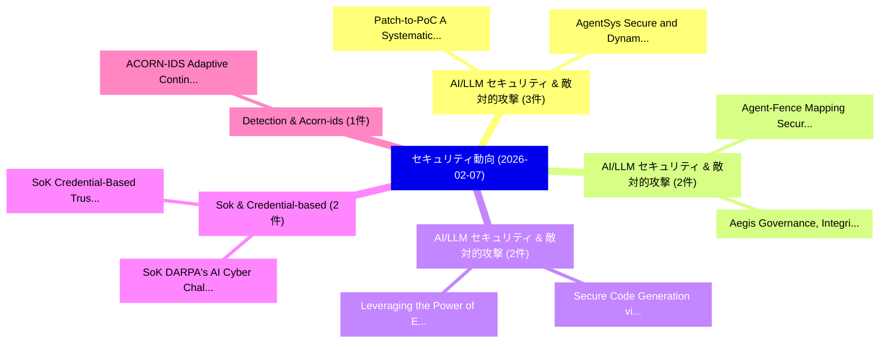

# 📅 02_daily: 日次エグゼクティブサマリー報告書 (2026-02-07)

**集計日時**: 2026-10-02 23:05:57 UTC  
**対象日付**: 2026-02-07  
**本日収集論文数**: 15 件  

---

## 💡 主要セキュリティ動向・脅威インサイト (Executive Insights)

本日の収集論文（計 15 件）において、以下の重点セキュリティ領域で活発な研究動向が確認されました：
- **AI/LLM セキュリティ & 敵対的攻撃** (3 件): 注目論文として 「Patch-to-PoC: A Systematic Stu...」、「AgentSys: Secure and Dynamic L...」 等が発表され、実務防御および攻撃検証の進展が見られます。
- **AI/LLM セキュリティ & 敵対的攻撃** (2 件): 注目論文として 「Aegis: Governance, Integrity, ...」、「Agent-Fence: Mapping Security ...」 等が発表され、実務防御および攻撃検証の進展が見られます。
- **AI/LLM セキュリティ & 敵対的攻撃** (2 件): 注目論文として 「Secure Code Generation via Onl...」、「Leveraging the Power of Ensemb...」 等が発表され、実務防御および攻撃検証の進展が見られます。
- **Sok & Credential-based** (2 件): 注目論文として 「SoK: Credential-Based Trust Ma...」、「SoK: DARPA's AI Cyber Challeng...」 等が発表され、実務防御および攻撃検証の進展が見られます。
- **Detection & Acorn-ids** (1 件): 注目論文として 「ACORN-IDS: Adaptive Continual ...」 等が発表され、実務防御および攻撃検証の進展が見られます。

### 🗺️ 技術・脅威トピックマインドマップ

---

## 📌 日次セキュリティ論文一覧 (日本語表形式)

| No | arXiv ID | 論文タイトル (日本語訳) | 重要キーワード | 構造化エグゼクティブ要約 (背景・提案・影響) | 脅威分類 | 詳細リンク |
|---|---|---|---|---|---|---|
| 1 | `2602.07287v2` | [Patch-to-PoC: A Systematic Study of Agentic LLM Systems for Linux Kernel N-Day Reproduction（セキュリティ分析論文）](../../okf/papers/2026-02-07/2602.07287.md) | `Linux Kernel`, `Day Reproduction`, `N-Day Reproduction` | 【提案】概要 (Overview & Key Finding) 本論文「Patch-to-PoC: A Systematic Study of Agentic LLM Systems...。実証評価により経営層・セキュリティ管理者向け推奨アクション (E... | `executive-summary` | [arXiv](https://arxiv.org/abs/2602.07287v2) &#124; [OKF](../../okf/papers/2026-02-07/2602.07287.md) |
| 2 | `2602.07291v1` | [ACORN-IDS: Adaptive Continual Novelty Detection for Intrusion Detection Systems（セキュリティ分析論文）](../../okf/papers/2026-02-07/2602.07291.md) | `Adaptive Continual Novelty Detection`, `Intrusion Detection Systems`, `Sean Fuhrman` | 【提案】概要 (Overview & Key Finding) 本論文「ACORN-IDS: Adaptive Continual Novelty Detection for Int...。実証評価により経営層・セキュリティ管理者向け推奨アクション (E... | `cybersecurity` | [arXiv](https://arxiv.org/abs/2602.07291v1) &#124; [OKF](../../okf/papers/2026-02-07/2602.07291.md) |
| 3 | `2602.07370v1` | [Privately Learning Decision Lists and a Differentially Private Winnow（セキュリティ分析論文）](../../okf/papers/2026-02-07/2602.07370.md) | `Privately Learning Decision Lists`, `Differentially Private Winnow`, `Mark Bun` | 【提案】概要 (Overview & Key Finding) 本論文「Privately Learning Decision Lists and a Differentially ...。実証評価により経営層・セキュリティ管理者向け推奨アクション (E... | `executive-summary` | [arXiv](https://arxiv.org/abs/2602.07370v1) &#124; [OKF](../../okf/papers/2026-02-07/2602.07370.md) |
| 4 | `2602.07379v1` | [Aegis: Governance, Integrity, and Security of AI Voice Agentsに向けて](../../okf/papers/2026-02-07/2602.07379.md) | `Towards Governance`, `Voice Agents`, `Xiang Li` | 【提案】概要 (Overview & Key Finding) 本論文「Aegis: Governance, Integrity, and Security of AI Voice ...。実証評価により経営層・セキュリティ管理者向け推奨アクション (E... | `executive-summary` | [arXiv](https://arxiv.org/abs/2602.07379v1) &#124; [OKF](../../okf/papers/2026-02-07/2602.07379.md) |
| 5 | `2602.07398v1` | [AgentSys: Secure and Dynamic LLMエージェント Through Explicit Hierarchical Memory Management](../../okf/papers/2026-02-07/2602.07398.md) | `Ruoyao Wen`, `Hao Li`, `Chaowei Xiao` | 【提案】概要 (Overview & Key Finding) 本論文「AgentSys: Secure and Dynamic LLMエージェント Through Explicit...。実証評価により経営層・セキュリティ管理者向け推奨アクション (E... | `cs.AI` | [arXiv](https://arxiv.org/abs/2602.07398v1) &#124; [OKF](../../okf/papers/2026-02-07/2602.07398.md) |
| 6 | `2602.07422v1` | [Secure Code Generation via Online Reinforcement Learning with Vulnerability Reward Model（セキュリティ分析論文）](../../okf/papers/2026-02-07/2602.07422.md) | `Secure Code Generation`, `Online Reinforcement Learning`, `Vulnerability Reward Model` | 【提案】概要 (Overview & Key Finding) 本論文「Secure Code Generation via Online Reinforcement Learnin...。実証評価により経営層・セキュリティ管理者向け推奨アクション (E... | `cs.AI` | [arXiv](https://arxiv.org/abs/2602.07422v1) &#124; [OKF](../../okf/papers/2026-02-07/2602.07422.md) |
| 7 | `2602.07513v2` | [SPECA: Specification-to-Checklist Agentic Auditing for Multi-Implementation Systems -- A Case Study on Ethereum Clients（セキュリティ分析論文）](../../okf/papers/2026-02-07/2602.07513.md) | `Checklist Agentic Auditing`, `Implementation Systems`, `Ethereum Clients` | 【提案】概要 (Overview & Key Finding) 本論文「SPECA: Specification-to-Checklist Agentic Auditing for ...。実証評価により経営層・セキュリティ管理者向け推奨アクション (E... | `cybersecurity` | [arXiv](https://arxiv.org/abs/2602.07513v2) &#124; [OKF](../../okf/papers/2026-02-07/2602.07513.md) |
| 8 | `2602.07517v1` | [MemPot: Defending Against Memory Extraction Attack with Optimized Honeypots（セキュリティ分析論文）](../../okf/papers/2026-02-07/2602.07517.md) | `Optimized Honeypots`, `Yuhao Wang`, `Shengfang Zhai` | 【提案】概要 (Overview & Key Finding) 本論文「MemPot: Defending Against Memory Extraction Attack with...。実証評価により経営層・セキュリティ管理者向け推奨アクション (E... | `cs.DB` | [arXiv](https://arxiv.org/abs/2602.07517v1) &#124; [OKF](../../okf/papers/2026-02-07/2602.07517.md) |
| 9 | `2602.07572v1` | [SoK: Credential-Based Trust Management in Decentralized Ledger Systems（セキュリティ分析論文）](../../okf/papers/2026-02-07/2602.07572.md) | `Based Trust Management`, `Decentralized Ledger Systems`, `Credential-Based Trust` | 【提案】概要 (Overview & Key Finding) 本論文「SoK: Credential-Based Trust Management in Decentralized...。実証評価により経営層・セキュリティ管理者向け推奨アクション (E... | `cybersecurity` | [arXiv](https://arxiv.org/abs/2602.07572v1) &#124; [OKF](../../okf/papers/2026-02-07/2602.07572.md) |
| 10 | `2602.07652v1` | [Agent-Fence: Mapping Security Vulnerabilities Across Deep Research Agents（セキュリティ分析論文）](../../okf/papers/2026-02-07/2602.07652.md) | `Mapping Security Vulnerabilities Across Deep Research Agents`, `Md Jahangir Alam`, `Syed Bahauddin Alam` | 【提案】概要 (Overview & Key Finding) 本論文「Agent-Fence: Mapping Security Vulnerabilities Across De...。実証評価により経営層・セキュリティ管理者向け推奨アクション (E... | `cs.AI` | [arXiv](https://arxiv.org/abs/2602.07652v1) &#124; [OKF](../../okf/papers/2026-02-07/2602.07652.md) |
| 11 | `2602.07656v1` | [AirCatch: Effectively tracing advanced tag-based trackers（セキュリティ分析論文）](../../okf/papers/2026-02-07/2602.07656.md) | `tag-based trackers`, `Abhishek Kumar Mishra`, `Guevara Noubir` | 【提案】概要 (Overview & Key Finding) 本論文「AirCatch: Effectively tracing advanced tag-based tracke...。実証評価により経営層・セキュリティ管理者向け推奨アクション (E... | `cybersecurity` | [arXiv](https://arxiv.org/abs/2602.07656v1) &#124; [OKF](../../okf/papers/2026-02-07/2602.07656.md) |
| 12 | `2602.07666v5` | [SoK: DARPA's AI Cyber Challenge (AIxCC): Competition Design, Architectures, and Lessons Learned（セキュリティ分析論文）](../../okf/papers/2026-02-07/2602.07666.md) | `Cyber Challenge`, `Competition Design`, `Lessons Learned` | 【提案】概要 (Overview & Key Finding) 本論文「SoK: DARPA's AI Cyber Challenge (AIxCC): Competition De...。実証評価により経営層・セキュリティ管理者向け推奨アクション (E... | `cs.AI` | [arXiv](https://arxiv.org/abs/2602.07666v5) &#124; [OKF](../../okf/papers/2026-02-07/2602.07666.md) |
| 13 | `2602.07722v1` | [IPBAC: Interaction Provenance-Based Access Control for Secure and Privacy-Aware Systems（セキュリティ分析論文）](../../okf/papers/2026-02-07/2602.07722.md) | `Based Access Control`, `Interaction Provenance`, `Aware Systems` | 【提案】概要 (Overview & Key Finding) 本論文「IPBAC: Interaction Provenance-Based アクセス制御 for Secure a...。実証評価により経営層・セキュリティ管理者向け推奨アクション (E... | `cybersecurity` | [arXiv](https://arxiv.org/abs/2602.07722v1) &#124; [OKF](../../okf/papers/2026-02-07/2602.07722.md) |
| 14 | `2602.07725v1` | [Leveraging the Power of Ensemble Learning for Secure Low Altitude Economy（セキュリティ分析論文）](../../okf/papers/2026-02-07/2602.07725.md) | `Secure Low Altitude Economy`, `Ensemble Learning`, `Yaoqi Yang` | 【提案】概要 (Overview & Key Finding) 本論文「Leveraging the Power of Ensemble Learning for Secure Lo...。実証評価により経営層・セキュリティ管理者向け推奨アクション (E... | `cybersecurity` | [arXiv](https://arxiv.org/abs/2602.07725v1) &#124; [OKF](../../okf/papers/2026-02-07/2602.07725.md) |
| 15 | `2602.10134v2` | [Reverse-Engineering Model Editing on Language Models（セキュリティ分析論文）](../../okf/papers/2026-02-07/2602.10134.md) | `Engineering Model Editing`, `Language Models`, `Reverse-Engineering Model` | 【提案】概要 (Overview & Key Finding) 本論文「Reverse-Engineering Model Editing on Language Models（セキ...。実証評価により経営層・セキュリティ管理者向け推奨アクション (E... | `cs.AI` | [arXiv](https://arxiv.org/abs/2602.10134v2) &#124; [OKF](../../okf/papers/2026-02-07/2602.10134.md) |

