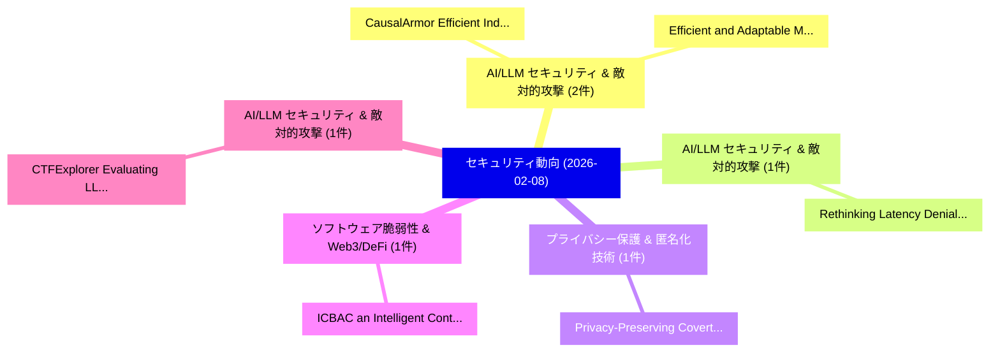

# 📅 02_daily: 日次エグゼクティブサマリー報告書 (2026-02-08)

**集計日時**: 2026-10-02 23:05:57 UTC  
**対象日付**: 2026-02-08  
**本日収集論文数**: 9 件  

---

## 💡 主要セキュリティ動向・脅威インサイト (Executive Insights)

本日の収集論文（計 9 件）において、以下の重点セキュリティ領域で活発な研究動向が確認されました：
- **AI/LLM セキュリティ & 敵対的攻撃** (2 件): 注目論文として 「CausalArmor: Efficient Indirec...」、「Efficient and Adaptable Malici...」 等が発表され、実務防御および攻撃検証の進展が見られます。
- **AI/LLM セキュリティ & 敵対的攻撃** (1 件): 注目論文として 「Rethinking Latency Denial-of-S...」 等が発表され、実務防御および攻撃検証の進展が見られます。
- **プライバシー保護 & 匿名化技術** (1 件): 注目論文として 「Privacy-Preserving Covert Comm...」 等が発表され、実務防御および攻撃検証の進展が見られます。
- **ソフトウェア脆弱性 & Web3/DeFi** (1 件): 注目論文として 「ICBAC: an Intelligent Contract...」 等が発表され、実務防御および攻撃検証の進展が見られます。
- **AI/LLM セキュリティ & 敵対的攻撃** (1 件): 注目論文として 「CTFExplorer: Evaluating LLM Of...」 等が発表され、実務防御および攻撃検証の進展が見られます。

### 🗺️ 技術・脅威トピックマインドマップ

---

## 📌 日次セキュリティ論文一覧 (日本語表形式)

| No | arXiv ID | 論文タイトル (日本語訳) | 重要キーワード | 構造化エグゼクティブ要約 (背景・提案・影響) | 脅威分類 | 詳細リンク |
|---|---|---|---|---|---|---|
| 1 | `2602.07878v1` | [Rethinking Latency Denial-of-Service: Attacking the LLM Serving Framework, Not the Model（セキュリティ分析論文）](../../okf/papers/2026-02-08/2602.07878.md) | `Rethinking Latency Denial`, `Tianyi Wang`, `Huawei Fan` | 【提案】背景とセキュリティ上の課題 (Background & Problem) 本研究はサイバー脅威環境におけるセキュリティ構造・脆弱性の検証を目的としています。(主要検出項目: ...。実証評価により経営層・セキュリティ管理者向け推奨アクション (E... | `cs.AI` | [arXiv](https://arxiv.org/abs/2602.07878v1) &#124; [OKF](../../okf/papers/2026-02-08/2602.07878.md) |
| 2 | `2602.07918v1` | [CausalArmor: Efficient Indirect Prompt Injection Guardrails via Causal Attribution（セキュリティ分析論文）](../../okf/papers/2026-02-08/2602.07918.md) | `Efficient Indirect Prompt Injection Guardrails`, `Causal Attribution`, `Krishnamurthy Dj Dvijotham` | 【提案】概要 (Overview & Key Finding) 本論文「CausalArmor: Efficient Indirect プロンプトインジェクション Guardrail...。実証評価により経営層・セキュリティ管理者向け推奨アクション (E... | `stat.ME` | [arXiv](https://arxiv.org/abs/2602.07918v1) &#124; [OKF](../../okf/papers/2026-02-08/2602.07918.md) |
| 3 | `2602.07936v1` | [Privacy-Preserving Covert Communication Using Encrypted Wearable Gesture Recognition（セキュリティ分析論文）](../../okf/papers/2026-02-08/2602.07936.md) | `Preserving Covert Communication Using Encrypted Wearable Gesture Recognition`, `Privacy-Preserving Covert`, `Tasnia Ashrafi Heya` | 【提案】概要 (Overview & Key Finding) 本論文「Privacy-Preserving Covert Communication Using Encrypted...。実証評価により経営層・セキュリティ管理者向け推奨アクション (E... | `cybersecurity` | [arXiv](https://arxiv.org/abs/2602.07936v1) &#124; [OKF](../../okf/papers/2026-02-08/2602.07936.md) |
| 4 | `2602.08014v1` | [ICBAC: an Intelligent Contract-Based Access Control framework for supply chain management by integrating blockchain and 連合学習](../../okf/papers/2026-02-08/2602.08014.md) | `Based Access Control`, `Intelligent Contract`, `Contract-Based Access` | 【提案】概要 (Overview & Key Finding) 本論文「ICBAC: an Intelligent Contract-Based アクセス制御 framework f...。実証評価により経営層・セキュリティ管理者向け推奨アクション (E... | `cs.AI` | [arXiv](https://arxiv.org/abs/2602.08014v1) &#124; [OKF](../../okf/papers/2026-02-08/2602.08014.md) |
| 5 | `2602.08023v3` | [CTFExplorer: Evaluating LLM Offensive Agents Through Multi-Target Web CTF Benchmarking（セキュリティ分析論文）](../../okf/papers/2026-02-08/2602.08023.md) | `Target Web`, `Multi-Target Web`, `Venkata Sai Charan Putrevu` | 【提案】概要 (Overview & Key Finding) 本論文「CTFExplorer: Evaluating LLM Offensive Agents Through Mu...。実証評価により経営層・セキュリティ管理者向け推奨アクション (E... | `cs.AI` | [arXiv](https://arxiv.org/abs/2602.08023v3) &#124; [OKF](../../okf/papers/2026-02-08/2602.08023.md) |
| 6 | `2602.08062v1` | [Efficient and Adaptable Malicious LLM Prompts via Bootstrap Aggregationの検出](../../okf/papers/2026-02-08/2602.08062.md) | `Adaptable Detection`, `Bootstrap Aggregation`, `Adaptable Malicious` | 【提案】概要 (Overview & Key Finding) 本論文「Efficient and Adaptable Malicious LLM Prompts via Boots...。実証評価により経営層・セキュリティ管理者向け推奨アクション (E... | `executive-summary` | [arXiv](https://arxiv.org/abs/2602.08062v1) &#124; [OKF](../../okf/papers/2026-02-08/2602.08062.md) |
| 7 | `2602.08072v3` | [IssueGuard: Real-Time Secret Leak Prevention Tool for GitHub Issue Reports（セキュリティ分析論文）](../../okf/papers/2026-02-08/2602.08072.md) | `Time Secret Leak Prevention Tool`, `Issue Reports`, `Real-Time Secret` | 【提案】概要 (Overview & Key Finding) 本論文「IssueGuard: Real-Time Secret Leak Prevention Tool for G...。実証評価により経営層・セキュリティ管理者向け推奨アクション (E... | `executive-summary` | [arXiv](https://arxiv.org/abs/2602.08072v3) &#124; [OKF](../../okf/papers/2026-02-08/2602.08072.md) |
| 8 | `2602.08165v2` | [A Transfer Learning Approach to Unveil the Role of Windows Common Configuration Enumerations in IEC 62443 Compliance（セキュリティ分析論文）](../../okf/papers/2026-02-08/2602.08165.md) | `Windows Common Configuration Enumerations`, `Miguel Bicudo`, `Paulo Segal` | 【提案】概要 (Overview & Key Finding) 本論文「A Transfer Learning Approach to Unveil the Role of Wind...。実証評価により経営層・セキュリティ管理者向け推奨アクション (E... | `cybersecurity` | [arXiv](https://arxiv.org/abs/2602.08165v2) &#124; [OKF](../../okf/papers/2026-02-08/2602.08165.md) |
| 9 | `2602.10139v3` | [Anonymization-Enhanced Privacy Protection for Mobile GUI Agents: Available but Invisible（セキュリティ分析論文）](../../okf/papers/2026-02-08/2602.10139.md) | `Enhanced Privacy Protection`, `Anonymization-Enhanced Privacy`, `Lepeng Zhao` | 【提案】概要 (Overview & Key Finding) 本論文「Anonymization-Enhanced Privacy Protection for Mobile GU...。実証評価により経営層・セキュリティ管理者向け推奨アクション (E... | `cs.AI` | [arXiv](https://arxiv.org/abs/2602.10139v3) &#124; [OKF](../../okf/papers/2026-02-08/2602.10139.md) |

