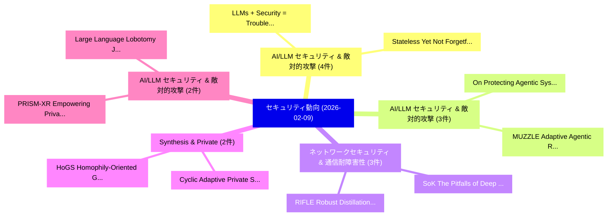

# 📅 02_daily: 日次エグゼクティブサマリー報告書 (2026-02-09)

**集計日時**: 2026-10-02 23:05:57 UTC  
**対象日付**: 2026-02-09  
**本日収集論文数**: 41 件  

---

## 💡 主要セキュリティ動向・脅威インサイト (Executive Insights)

本日の収集論文（計 41 件）において、以下の重点セキュリティ領域で活発な研究動向が確認されました：
- **AI/LLM セキュリティ & 敵対的攻撃** (4 件): 注目論文として 「LLMs + Security = Trouble（セキュリ...」、「Stateless Yet Not Forgetful: I...」 等が発表され、実務防御および攻撃検証の進展が見られます。
- **AI/LLM セキュリティ & 敵対的攻撃** (3 件): 注目論文として 「On Protecting Agentic Systems'...」、「MUZZLE: Adaptive Agentic Red-T...」 等が発表され、実務防御および攻撃検証の進展が見られます。
- **ネットワークセキュリティ & 通信耐障害性** (3 件): 注目論文として 「RIFLE: Robust Distillation-bas...」、「SoK: The Pitfalls of Deep Rein...」 等が発表され、実務防御および攻撃検証の進展が見られます。
- **Synthesis & Private** (2 件): 注目論文として 「Cyclic Adaptive Private Synthe...」、「HoGS: Homophily-Oriented Graph...」 等が発表され、実務防御および攻撃検証の進展が見られます。
- **AI/LLM セキュリティ & 敵対的攻撃** (2 件): 注目論文として 「Large Language Lobotomy: Jailb...」、「PRISM-XR: Empowering Privacy-A...」 等が発表され、実務防御および攻撃検証の進展が見られます。

### 🗺️ 技術・脅威トピックマインドマップ

---

## 📌 日次セキュリティ論文一覧 (日本語表形式)

| No | arXiv ID | 論文タイトル (日本語訳) | 重要キーワード | 構造化エグゼクティブ要約 (背景・提案・影響) | 脅威分類 | 詳細リンク |
|---|---|---|---|---|---|---|
| 1 | `2602.08170v1` | [Evasion of IoT マルウェア検出 via Dummy Code Injection](../../okf/papers/2026-02-09/2602.08170.md) | `Dummy Code Injection`, `Malware Detection`, `Sahar Zargarzadeh` | 【提案】概要 (Overview & Key Finding) 本論文「Evasion of IoT マルウェア検出 via Dummy Code Injection」（原題: Ev...。実証評価により経営層・セキュリティ管理者向け推奨アクション (E... | `executive-summary` | [arXiv](https://arxiv.org/abs/2602.08170v1) &#124; [OKF](../../okf/papers/2026-02-09/2602.08170.md) |
| 2 | `2602.08214v1` | [RECUR: Resource Exhaustion Attack via Recursive-Entropy Guided Counterfactual Utilization and Reflection（セキュリティ分析論文）](../../okf/papers/2026-02-09/2602.08214.md) | `Entropy Guided Counterfactual Utilization`, `Resource Exhaustion Attack`, `Recursive-Entropy Guided` | 【提案】概要 (Overview & Key Finding) 本論文「RECUR: Resource Exhaustion Attack via Recursive-Entropy...。実証評価により経営層・セキュリティ管理者向け推奨アクション (E... | `cs.AI` | [arXiv](https://arxiv.org/abs/2602.08214v1) &#124; [OKF](../../okf/papers/2026-02-09/2602.08214.md) |
| 3 | `2602.08229v1` | [InfiCoEvalChain: A Blockchain-Based Decentralized Framework for Collaborative LLM Evaluation（セキュリティ分析論文）](../../okf/papers/2026-02-09/2602.08229.md) | `Blockchain-Based Decentralized`, `Yifan Yang`, `Jinjia Li` | 【提案】概要 (Overview & Key Finding) 本論文「InfiCoEvalChain: A Blockchain-Based Decentralized Frame...。実証評価により経営層・セキュリティ管理者向け推奨アクション (E... | `cs.AI` | [arXiv](https://arxiv.org/abs/2602.08229v1) &#124; [OKF](../../okf/papers/2026-02-09/2602.08229.md) |
| 4 | `2602.08235v2` | [When Benign Inputs Lead to Severe Harms: Eliciting Unsafe Unintended Behaviors of Computer-Use Agents（セキュリティ分析論文）](../../okf/papers/2026-02-09/2602.08235.md) | `Eliciting Unsafe Unintended Behaviors`, `Severe Harms`, `Use Agents` | 【提案】概要 (Overview & Key Finding) 本論文「When Benign Inputs Lead to Severe Harms: Eliciting Unsa...。実証評価により経営層・セキュリティ管理者向け推奨アクション (E... | `cs.AI` | [arXiv](https://arxiv.org/abs/2602.08235v2) &#124; [OKF](../../okf/papers/2026-02-09/2602.08235.md) |
| 5 | `2602.08299v1` | [Cyclic Adaptive Private Synthesis for Sharing Real-World Data in Education（セキュリティ分析論文）](../../okf/papers/2026-02-09/2602.08299.md) | `Cyclic Adaptive Private Synthesis`, `Sharing Real`, `World Data` | 【提案】概要 (Overview & Key Finding) 本論文「Cyclic Adaptive Private Synthesis for Sharing Real-Worl...。実証評価により経営層・セキュリティ管理者向け推奨アクション (E... | `executive-summary` | [arXiv](https://arxiv.org/abs/2602.08299v1) &#124; [OKF](../../okf/papers/2026-02-09/2602.08299.md) |
| 6 | `2602.08384v1` | [Real-World Industrial-Scale Verification: LLM-Driven Theorem Proving on seL4に向けて](../../okf/papers/2026-02-09/2602.08384.md) | `Driven Theorem Proving`, `World Industrial`, `Scale Verification` | 【提案】概要 (Overview & Key Finding) 本論文「Real-World Industrial-Scale Verification: LLM-Driven Th...。実証評価により経営層・セキュリティ管理者向け推奨アクション (E... | `cybersecurity` | [arXiv](https://arxiv.org/abs/2602.08384v1) &#124; [OKF](../../okf/papers/2026-02-09/2602.08384.md) |
| 7 | `2602.08401v1` | [On Protecting Agentic Systems' Intellectual Property via Watermarking（セキュリティ分析論文）](../../okf/papers/2026-02-09/2602.08401.md) | `Intellectual Property`, `Liwen Wang`, `Zongjie Li` | 【提案】概要 (Overview & Key Finding) 本論文「On Protecting Agentic Systems' Intellectual Property vi...。実証評価により経営層・セキュリティ管理者向け推奨アクション (E... | `cs.AI` | [arXiv](https://arxiv.org/abs/2602.08401v1) &#124; [OKF](../../okf/papers/2026-02-09/2602.08401.md) |
| 8 | `2602.08422v1` | [LLMs + Security = Trouble（セキュリティ分析論文）](../../okf/papers/2026-02-09/2602.08422.md) | `Benjamin Livshits`, `Raw Meta`, `Executive Summary` | 【提案】概要 (Overview & Key Finding) 本論文「LLMs + Security = Trouble（セキュリティ分析論文）」（原題: LLMs + Secur...。実証評価により経営層・セキュリティ管理者向け推奨アクション (E... | `cs.AI` | [arXiv](https://arxiv.org/abs/2602.08422v1) &#124; [OKF](../../okf/papers/2026-02-09/2602.08422.md) |
| 9 | `2602.08446v1` | [RIFLE: Robust Distillation-based FL for Deep Model Deployment on Resource-Constrained IoT Networks（セキュリティ分析論文）](../../okf/papers/2026-02-09/2602.08446.md) | `Deep Model Deployment`, `Robust Distillation`, `Distillation-based FL` | 【提案】概要 (Overview & Key Finding) 本論文「RIFLE: Robust Distillation-based FL for Deep Model Depl...。実証評価により経営層・セキュリティ管理者向け推奨アクション (E... | `cs.NI` | [arXiv](https://arxiv.org/abs/2602.08446v1) &#124; [OKF](../../okf/papers/2026-02-09/2602.08446.md) |
| 10 | `2602.08449v3` | [When Evaluation Becomes a Side Channel: Regime Leakage and Structural Mitigations for Alignment Assessment（セキュリティ分析論文）](../../okf/papers/2026-02-09/2602.08449.md) | `Side Channel`, `Regime Leakage`, `Structural Mitigations` | 【提案】概要 (Overview & Key Finding) 本論文「When Evaluation Becomes a Side Channel: Regime Leakage ...。実証評価により# When Evaluation Becomes... | `cs.AI` | [arXiv](https://arxiv.org/abs/2602.08449v3) &#124; [OKF](../../okf/papers/2026-02-09/2602.08449.md) |
| 11 | `2602.08563v1` | [Stateless Yet Not Forgetful: Implicit Memory as a Hidden Channel in LLMs（セキュリティ分析論文）](../../okf/papers/2026-02-09/2602.08563.md) | `Implicit Memory`, `Hidden Channel`, `Ahmed Salem` | 【提案】背景とセキュリティ上の課題 (Background & Problem) 本研究はサイバー脅威環境におけるセキュリティ構造・脆弱性の検証を目的としています。(主要検出項目: ...。実証評価により経営層・セキュリティ管理者向け推奨アクション (E... | `cs.AI` | [arXiv](https://arxiv.org/abs/2602.08563v1) &#124; [OKF](../../okf/papers/2026-02-09/2602.08563.md) |
| 12 | `2602.08621v1` | [Sparse Models, Sparse Safety: Unsafe Routes in Mixture-of-Experts LLMs（セキュリティ分析論文）](../../okf/papers/2026-02-09/2602.08621.md) | `Sparse Models`, `Sparse Safety`, `Unsafe Routes` | 【提案】概要 (Overview & Key Finding) 本論文「Sparse Models, Sparse Safety: Unsafe Routes in Mixture-...。実証評価により経営層・セキュリティ管理者向け推奨アクション (E... | `cs.AI` | [arXiv](https://arxiv.org/abs/2602.08621v1) &#124; [OKF](../../okf/papers/2026-02-09/2602.08621.md) |
| 13 | `2602.08668v3` | [Retrieval Pivot Attacks in Hybrid RAG: Measuring and Mitigating Amplified Leakage from Vector Seeds to Graph Expansion（セキュリティ分析論文）](../../okf/papers/2026-02-09/2602.08668.md) | `Retrieval Pivot Attacks`, `Mitigating Amplified Leakage`, `Vector Seeds` | 【提案】概要 (Overview & Key Finding) 本論文「Retrieval Pivot Attacks in Hybrid RAG: Measuring and Mi...。実証評価により経営層・セキュリティ管理者向け推奨アクション (E... | `executive-summary` | [arXiv](https://arxiv.org/abs/2602.08668v3) &#124; [OKF](../../okf/papers/2026-02-09/2602.08668.md) |
| 14 | `2602.08679v1` | [Dashed Line Defense: Plug-And-Play Defense Against Adaptive Score-Based Query Attacks（セキュリティ分析論文）](../../okf/papers/2026-02-09/2602.08679.md) | `Dashed Line Defense`, `Based Query Attacks`, `Score-Based Query` | 【提案】概要 (Overview & Key Finding) 本論文「Dashed Line Defense: Plug-And-Play Defense Against Adap...。実証評価により経営層・セキュリティ管理者向け推奨アクション (E... | `executive-summary` | [arXiv](https://arxiv.org/abs/2602.08679v1) &#124; [OKF](../../okf/papers/2026-02-09/2602.08679.md) |
| 15 | `2602.08690v2` | [SoK: The Pitfalls of Deep Reinforcement Learning for サイバーセキュリティ](../../okf/papers/2026-02-09/2602.08690.md) | `Deep Reinforcement Learning`, `Myles Foley`, `Elizabeth Bates` | 【提案】概要 (Overview & Key Finding) 本論文「SoK: The Pitfalls of Deep Reinforcement Learning for サイ...。実証評価により経営層・セキュリティ管理者向け推奨アクション (E... | `executive-summary` | [arXiv](https://arxiv.org/abs/2602.08690v2) &#124; [OKF](../../okf/papers/2026-02-09/2602.08690.md) |
| 16 | `2602.08723v1` | [Data Reconstruction: Identifiability and Optimization with Sample Splitting（セキュリティ分析論文）](../../okf/papers/2026-02-09/2602.08723.md) | `Data Reconstruction`, `Sample Splitting`, `Yujie Shen` | 【提案】概要 (Overview & Key Finding) 本論文「Data Reconstruction: Identifiability and Optimization w...。実証評価により経営層・セキュリティ管理者向け推奨アクション (E... | `executive-summary` | [arXiv](https://arxiv.org/abs/2602.08723v1) &#124; [OKF](../../okf/papers/2026-02-09/2602.08723.md) |
| 17 | `2602.08741v1` | [Large Language Lobotomy: Jailbreaking Mixture-of-Experts via Expert Silencing（セキュリティ分析論文）](../../okf/papers/2026-02-09/2602.08741.md) | `Large Language Lobotomy`, `Jailbreaking Mixture`, `Expert Silencing` | 【提案】概要 (Overview & Key Finding) 本論文「Large Language Lobotomy: ジェイルブレイクing Mixture-of-Experts...。実証評価により経営層・セキュリティ管理者向け推奨アクション (E... | `cybersecurity` | [arXiv](https://arxiv.org/abs/2602.08741v1) &#124; [OKF](../../okf/papers/2026-02-09/2602.08741.md) |
| 18 | `2602.08744v1` | [Empirical Evaluation of SMOTE in Android マルウェア検出 with Machine Learning: Challenges and Performance in CICMalDroid 2020](../../okf/papers/2026-02-09/2602.08744.md) | `Machine Learning`, `Android Malware Detection`, `Diego Ferreira Duarte` | 【提案】概要 (Overview & Key Finding) 本論文「Empirical Evaluation of SMOTE in Android マルウェア検出 with M...。実証評価により経営層・セキュリティ管理者向け推奨アクション (E... | `cybersecurity` | [arXiv](https://arxiv.org/abs/2602.08744v1) &#124; [OKF](../../okf/papers/2026-02-09/2602.08744.md) |
| 19 | `2602.08750v1` | [DyMA-Fuzz: Dynamic Direct Memory Access Abstraction for Re-hosted Monolithic Firmware Fuzzing（セキュリティ分析論文）](../../okf/papers/2026-02-09/2602.08750.md) | `Dynamic Direct Memory Access Abstraction`, `Monolithic Firmware Fuzzing`, `Re-hosted Monolithic` | 【提案】概要 (Overview & Key Finding) 本論文「DyMA-Fuzz: Dynamic Direct Memory Access Abstraction for...。実証評価により経営層・セキュリティ管理者向け推奨アクション (E... | `executive-summary` | [arXiv](https://arxiv.org/abs/2602.08750v1) &#124; [OKF](../../okf/papers/2026-02-09/2602.08750.md) |
| 20 | `2602.08762v1` | [HoGS: Homophily-Oriented Graph Synthesis for Local Differentially Private GNN Training（セキュリティ分析論文）](../../okf/papers/2026-02-09/2602.08762.md) | `Oriented Graph Synthesis`, `Local Differentially Private`, `Homophily-Oriented Graph` | 【提案】概要 (Overview & Key Finding) 本論文「HoGS: Homophily-Oriented Graph Synthesis for Local Diff...。実証評価により経営層・セキュリティ管理者向け推奨アクション (E... | `executive-summary` | [arXiv](https://arxiv.org/abs/2602.08762v1) &#124; [OKF](../../okf/papers/2026-02-09/2602.08762.md) |
| 21 | `2602.08798v2` | [CryptoGen: Secure Transformer Generation with Encrypted KV-Cache Reuse（セキュリティ分析論文）](../../okf/papers/2026-02-09/2602.08798.md) | `Secure Transformer Generation`, `Cache Reuse`, `KV-Cache Reuse` | 【提案】概要 (Overview & Key Finding) 本論文「CryptoGen: Secure Transformer Generation with Encrypted...。実証評価により経営層・セキュリティ管理者向け推奨アクション (E... | `cybersecurity` | [arXiv](https://arxiv.org/abs/2602.08798v2) &#124; [OKF](../../okf/papers/2026-02-09/2602.08798.md) |
| 22 | `2602.08870v1` | [ZK-Rollup for Hyperledger Fabric: Architecture and Performance Evaluation（セキュリティ分析論文）](../../okf/papers/2026-02-09/2602.08870.md) | `Hyperledger Fabric`, `Sania Siddiqui`, `Hari Babu` | 【提案】概要 (Overview & Key Finding) 本論文「ZK-Rollup for Hyperledger Fabric: Architecture and Perf...。実証評価により経営層・セキュリティ管理者向け推奨アクション (E... | `cs.ET` | [arXiv](https://arxiv.org/abs/2602.08870v1) &#124; [OKF](../../okf/papers/2026-02-09/2602.08870.md) |
| 23 | `2602.08874v2` | [Do Reasoning LLMs Refuse What They Infer in Long Contexts?（セキュリティ分析論文）](../../okf/papers/2026-02-09/2602.08874.md) | `Long Contexts`, `Haz Sameen Shahgir`, `Yu Fu` | 【提案】### (日本語題名: Do Reasoning LLMs Refuse What They Infer in Long Contexts?（セキュリティ分析論文）)  > ...。実証評価によりBenjamin Erichson, Yu。 | `executive-summary` | [arXiv](https://arxiv.org/abs/2602.08874v2) &#124; [OKF](../../okf/papers/2026-02-09/2602.08874.md) |
| 24 | `2602.08934v2` | [StealthRL: Reinforcement Learning Paraphrase Attacks for Multi-Detector Evasion of AI-Text Detectors（セキュリティ分析論文）](../../okf/papers/2026-02-09/2602.08934.md) | `Reinforcement Learning Paraphrase Attacks`, `Detector Evasion`, `Text Detectors` | 【提案】概要 (Overview & Key Finding) 本論文「StealthRL: Reinforcement Learning Paraphrase Attacks fo...。実証評価により経営層・セキュリティ管理者向け推奨アクション (E... | `cs.AI` | [arXiv](https://arxiv.org/abs/2602.08934v2) &#124; [OKF](../../okf/papers/2026-02-09/2602.08934.md) |
| 25 | `2602.08989v1` | [Zero Trust for Multi-RAT IoT: Trust Boundary Management in Heterogeneous Wireless Network Environments（セキュリティ分析論文）](../../okf/papers/2026-02-09/2602.08989.md) | `Heterogeneous Wireless Network Environments`, `Trust Boundary Management`, `Zero Trust` | 【提案】概要 (Overview & Key Finding) 本論文「ゼロトラスト for Multi-RAT IoT: Trust Boundary Management in ...。実証評価により経営層・セキュリティ管理者向け推奨アクション (E... | `cs.NI` | [arXiv](https://arxiv.org/abs/2602.08989v1) &#124; [OKF](../../okf/papers/2026-02-09/2602.08989.md) |
| 26 | `2602.08993v1` | [Reverse Online Guessing Attacks on PAKE Protocols（セキュリティ分析論文）](../../okf/papers/2026-02-09/2602.08993.md) | `Reverse Online Guessing Attacks`, `Eloise Christian`, `Tejas Gadwalkar` | 【提案】概要 (Overview & Key Finding) 本論文「Reverse Online Guessing Attacks on PAKE Protocols（セキュリテ...。実証評価によりZieglar - **公開日時**: `2026... | `cybersecurity` | [arXiv](https://arxiv.org/abs/2602.08993v1) &#124; [OKF](../../okf/papers/2026-02-09/2602.08993.md) |
| 27 | `2602.09015v3` | [CIC-Trap4Phish: A Unified Multi-Format Dataset for Phishing and Quishing Attachment Detection（セキュリティ分析論文）](../../okf/papers/2026-02-09/2602.09015.md) | `Quishing Attachment Detection`, `Unified Multi`, `Format Dataset` | 【提案】概要 (Overview & Key Finding) 本論文「CIC-Trap4Phish: A Unified Multi-Format Dataset for Phis...。実証評価により経営層・セキュリティ管理者向け推奨アクション (E... | `cs.AI` | [arXiv](https://arxiv.org/abs/2602.09015v3) &#124; [OKF](../../okf/papers/2026-02-09/2602.09015.md) |
| 28 | `2602.09078v1` | [Framework for Integrating Zero Trust in Cloud-Based Endpoint Security for Critical Infrastructure（セキュリティ分析論文）](../../okf/papers/2026-02-09/2602.09078.md) | `Integrating Zero Trust`, `Based Endpoint Security`, `Critical Infrastructure` | 【提案】概要 (Overview & Key Finding) 本論文「Framework for Integrating ゼロトラスト in Cloud-Based Endpoin...。実証評価により経営層・セキュリティ管理者向け推奨アクション (E... | `cs.NI` | [arXiv](https://arxiv.org/abs/2602.09078v1) &#124; [OKF](../../okf/papers/2026-02-09/2602.09078.md) |
| 29 | `2602.09131v2` | [PICASSO: Scaling CHERI Use-After-Free Protection to Millions of Allocations using Colored Capabilities（セキュリティ分析論文）](../../okf/papers/2026-02-09/2602.09131.md) | `Free Protection`, `Colored Capabilities`, `Ruben Sturm` | 【提案】概要 (Overview & Key Finding) 本論文「PICASSO: Scaling CHERI Use-After-Free Protection to Mil...。実証評価により経営層・セキュリティ管理者向け推奨アクション (E... | `cybersecurity` | [arXiv](https://arxiv.org/abs/2602.09131v2) &#124; [OKF](../../okf/papers/2026-02-09/2602.09131.md) |
| 30 | `2602.09182v1` | [One RNG to Rule Them All: How Randomness Becomes an Attack Vector in Machine Learning（セキュリティ分析論文）](../../okf/papers/2026-02-09/2602.09182.md) | `Attack Vector`, `Machine Learning`, `Kotekar Annapoorna Prabhu` | 【提案】概要 (Overview & Key Finding) 本論文「One RNG to Rule Them All: How Randomness Becomes an Att...。実証評価により経営層・セキュリティ管理者向け推奨アクション (E... | `executive-summary` | [arXiv](https://arxiv.org/abs/2602.09182v1) &#124; [OKF](../../okf/papers/2026-02-09/2602.09182.md) |
| 31 | `2602.09222v2` | [MUZZLE: Adaptive Agentic Red-Teaming of Web Agents Against Indirect Prompt Injection Attacks（セキュリティ分析論文）](../../okf/papers/2026-02-09/2602.09222.md) | `Adaptive Agentic Red`, `Georgios Syros`, `Evan Rose` | 【提案】概要 (Overview & Key Finding) 本論文「MUZZLE: Adaptive Agentic Red-Teaming of Web Agents Agai...。実証評価により経営層・セキュリティ管理者向け推奨アクション (E... | `cs.AI` | [arXiv](https://arxiv.org/abs/2602.09222v2) &#124; [OKF](../../okf/papers/2026-02-09/2602.09222.md) |
| 32 | `2602.09239v1` | ["These cameras are just like the Eye of Sauron": A Sociotechnical Threat Model for AI-Driven Smart Home Devices as Perceived by UK-Based Domestic Workers（セキュリティ分析論文）](../../okf/papers/2026-02-09/2602.09239.md) | `Driven Smart Home Devices`, `Sociotechnical Threat Model`, `Based Domestic Workers` | 【提案】概要 (Overview & Key Finding) 本論文「"These cameras are just like the Eye of Sauron": A Soci...。実証評価により経営層・セキュリティ管理者向け推奨アクション (E... | `executive-summary` | [arXiv](https://arxiv.org/abs/2602.09239v1) &#124; [OKF](../../okf/papers/2026-02-09/2602.09239.md) |
| 33 | `2602.09263v1` | [Atlas: Enabling Cross-Vendor Authentication for IoT（セキュリティ分析論文）](../../okf/papers/2026-02-09/2602.09263.md) | `Enabling Cross`, `Vendor Authentication`, `Cross-Vendor Authentication` | 【提案】概要 (Overview & Key Finding) 本論文「Atlas: Enabling Cross-Vendor Authentication for IoT（セキュ...。実証評価により経営層・セキュリティ管理者向け推奨アクション (E... | `cybersecurity` | [arXiv](https://arxiv.org/abs/2602.09263v1) &#124; [OKF](../../okf/papers/2026-02-09/2602.09263.md) |
| 34 | `2602.09273v1` | [The Price of Privacy For Approximating Max-CSP（セキュリティ分析論文）](../../okf/papers/2026-02-09/2602.09273.md) | `Prathamesh Dharangutte`, `Jingcheng Liu`, `Pasin Manurangsi` | 【提案】概要 (Overview & Key Finding) 本論文「The Price of Privacy For Approximating Max-CSP（セキュリティ分析...。実証評価により経営層・セキュリティ管理者向け推奨アクション (E... | `executive-summary` | [arXiv](https://arxiv.org/abs/2602.09273v1) &#124; [OKF](../../okf/papers/2026-02-09/2602.09273.md) |
| 35 | `2602.09282v1` | [How to Classically Verify a Quantum Cat without Killing It（セキュリティ分析論文）](../../okf/papers/2026-02-09/2602.09282.md) | `Classically Verify`, `Quantum Cat`, `Yael Tauman Kalai` | 【提案】背景とセキュリティ上の課題 (Background & Problem) 本研究はサイバー脅威環境におけるセキュリティ構造・脆弱性の検証を目的としています。(主要検出項目: ...。実証評価により経営層・セキュリティ管理者向け推奨アクション (E... | `executive-summary` | [arXiv](https://arxiv.org/abs/2602.09282v1) &#124; [OKF](../../okf/papers/2026-02-09/2602.09282.md) |
| 36 | `2602.10142v2` | [Privacy by Voice: Modeling Youth Privacy-Protective Behavior in Smart Voice Assistants（セキュリティ分析論文）](../../okf/papers/2026-02-09/2602.10142.md) | `Modeling Youth Privacy`, `Smart Voice Assistants`, `Protective Behavior` | 【提案】概要 (Overview & Key Finding) 本論文「Privacy by Voice: Modeling Youth Privacy-Protective Beh...。実証評価により経営層・セキュリティ管理者向け推奨アクション (E... | `executive-summary` | [arXiv](https://arxiv.org/abs/2602.10142v2) &#124; [OKF](../../okf/papers/2026-02-09/2602.10142.md) |
| 37 | `2602.10148v1` | [Red-teaming the Multimodal Reasoning: Jailbreaking Vision-Language Models via Cross-modal Entanglement Attacks（セキュリティ分析論文）](../../okf/papers/2026-02-09/2602.10148.md) | `Multimodal Reasoning`, `Jailbreaking Vision`, `Language Models` | 【提案】概要 (Overview & Key Finding) 本論文「Red-teaming the Multimodal Reasoning: ジェイルブレイクing Visio...。実証評価により経営層・セキュリティ管理者向け推奨アクション (E... | `cs.AI` | [arXiv](https://arxiv.org/abs/2602.10148v1) &#124; [OKF](../../okf/papers/2026-02-09/2602.10148.md) |
| 38 | `2602.10149v3` | [Semantic Labeling for Third-Party サイバーセキュリティ Risk Assessment: A Semi-Supervised Approach to Intent-Aware Question Retrieval](../../okf/papers/2026-02-09/2602.10149.md) | `Aware Question Retrieval`, `Semantic Labeling`, `Intent-Aware Question` | 【提案】概要 (Overview & Key Finding) 本論文「Semantic Labeling for Third-Party サイバーセキュリティ Risk Asses...。実証評価により経営層・セキュリティ管理者向け推奨アクション (E... | `cs.AI` | [arXiv](https://arxiv.org/abs/2602.10149v3) &#124; [OKF](../../okf/papers/2026-02-09/2602.10149.md) |
| 39 | `2602.10153v1` | [Basic Legibility Protocols Improve Trusted Monitoring（セキュリティ分析論文）](../../okf/papers/2026-02-09/2602.10153.md) | `Basic Legibility Protocols Improve Trusted Monitoring`, `Ashwin Sreevatsa`, `Sebastian Prasanna` | 【提案】概要 (Overview & Key Finding) 本論文「Basic Legibility Protocols Improve Trusted Monitoring（セ...。実証評価により経営層・セキュリティ管理者向け推奨アクション (E... | `executive-summary` | [arXiv](https://arxiv.org/abs/2602.10153v1) &#124; [OKF](../../okf/papers/2026-02-09/2602.10153.md) |
| 40 | `2602.10154v1` | [PRISM-XR: Empowering Privacy-Aware XR Collaboration with Multimodal 大規模言語モデル](../../okf/papers/2026-02-09/2602.10154.md) | `Empowering Privacy`, `Privacy-Aware XR`, `Multimodal Large Language Models` | 【提案】概要 (Overview & Key Finding) 本論文「PRISM-XR: Empowering Privacy-Aware XR Collaboration wit...。実証評価により経営層・セキュリティ管理者向け推奨アクション (E... | `cs.AI` | [arXiv](https://arxiv.org/abs/2602.10154v1) &#124; [OKF](../../okf/papers/2026-02-09/2602.10154.md) |
| 41 | `2603.02214v2` | [Federated Inference: Toward Privacy-Preserving Collaborative and Incentivized Model Serving（セキュリティ分析論文）](../../okf/papers/2026-02-09/2603.02214.md) | `Incentivized Model Serving`, `Federated Inference`, `Toward Privacy` | 【提案】概要 (Overview & Key Finding) 本論文「Federated Inference: Toward Privacy-Preserving Collabor...。実証評価により経営層・セキュリティ管理者向け推奨アクション (E... | `cs.AI` | [arXiv](https://arxiv.org/abs/2603.02214v2) &#124; [OKF](../../okf/papers/2026-02-09/2603.02214.md) |

