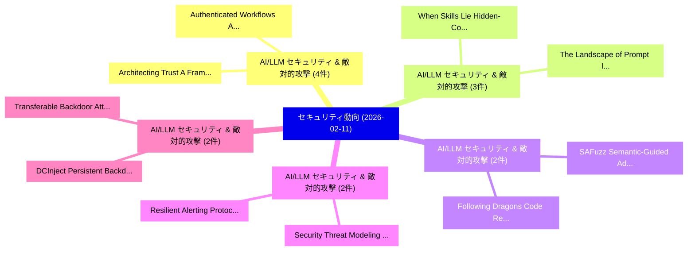

# 📅 02_daily: 日次エグゼクティブサマリー報告書 (2026-02-11)

**集計日時**: 2026-10-02 23:05:57 UTC  
**対象日付**: 2026-02-11  
**本日収集論文数**: 39 件  

---

## 💡 主要セキュリティ動向・脅威インサイト (Executive Insights)

本日の収集論文（計 39 件）において、以下の重点セキュリティ領域で活発な研究動向が確認されました：
- **AI/LLM セキュリティ & 敵対的攻撃** (4 件): 注目論文として 「Authenticated Workflows: A Sys...」、「Architecting Trust: A Framewor...」 等が発表され、実務防御および攻撃検証の進展が見られます。
- **AI/LLM セキュリティ & 敵対的攻撃** (3 件): 注目論文として 「The Landscape of Prompt Inject...」、「When Skills Lie: Hidden-Commen...」 等が発表され、実務防御および攻撃検証の進展が見られます。
- **AI/LLM セキュリティ & 敵対的攻撃** (2 件): 注目論文として 「Following Dragons: Code Review...」、「SAFuzz: Semantic-Guided Adapti...」 等が発表され、実務防御および攻撃検証の進展が見られます。
- **AI/LLM セキュリティ & 敵対的攻撃** (2 件): 注目論文として 「Resilient Alerting Protocols f...」、「Security Threat Modeling for E...」 等が発表され、実務防御および攻撃検証の進展が見られます。
- **AI/LLM セキュリティ & 敵対的攻撃** (2 件): 注目論文として 「Transferable Backdoor Attacks ...」、「DCInject: Persistent Backdoor ...」 等が発表され、実務防御および攻撃検証の進展が見られます。

### 🗺️ 技術・脅威トピックマインドマップ

---

## 📌 日次セキュリティ論文一覧 (日本語表形式)

| No | arXiv ID | 論文タイトル (日本語訳) | 重要キーワード | 構造化エグゼクティブ要約 (背景・提案・影響) | 脅威分類 | 詳細リンク |
|---|---|---|---|---|---|---|
| 1 | `2602.10418v1` | [SecCodePRM: A Process Reward Model for Code Security（セキュリティ分析論文）](../../okf/papers/2026-02-11/2602.10418.md) | `Process Reward Model`, `Code Security`, `Weichen Yu` | 【提案】概要 (Overview & Key Finding) 本論文「SecCodePRM: A Process Reward Model for Code Security（セキ...。実証評価によりPasareanu, Matt。 | `executive-summary` | [arXiv](https://arxiv.org/abs/2602.10418v1) &#124; [OKF](../../okf/papers/2026-02-11/2602.10418.md) |
| 2 | `2602.10453v1` | [The Landscape of Prompt Injection Threats in LLMエージェント: From Taxonomy to Analysis](../../okf/papers/2026-02-11/2602.10453.md) | `Prompt Injection Threats`, `Peiran Wang`, `Xinfeng Li` | 【提案】概要 (Overview & Key Finding) 本論文「The Landscape of プロンプトインジェクション Threats in LLMエージェント: Fr...。実証評価により経営層・セキュリティ管理者向け推奨アクション (E... | `executive-summary` | [arXiv](https://arxiv.org/abs/2602.10453v1) &#124; [OKF](../../okf/papers/2026-02-11/2602.10453.md) |
| 3 | `2602.10465v1` | [Authenticated Workflows: A Systems Approach to Protecting Agentic AI（セキュリティ分析論文）](../../okf/papers/2026-02-11/2602.10465.md) | `Authenticated Workflows`, `Protecting Agentic`, `Mohan Rajagopalan` | 【提案】概要 (Overview & Key Finding) 本論文「Authenticated Workflows: A Systems Approach to Protecti...。実証評価により経営層・セキュリティ管理者向け推奨アクション (E... | `cs.AI` | [arXiv](https://arxiv.org/abs/2602.10465v1) &#124; [OKF](../../okf/papers/2026-02-11/2602.10465.md) |
| 4 | `2602.10478v3` | [GPU-Fuzz: Finding Memory Errors in Deep Learning Frameworks（セキュリティ分析論文）](../../okf/papers/2026-02-11/2602.10478.md) | `Finding Memory Errors`, `Deep Learning Frameworks`, `Zihao Li` | 【提案】概要 (Overview & Key Finding) 本論文「GPU-Fuzz: Finding Memory Errors in Deep Learning Framew...。実証評価により経営層・セキュリティ管理者向け推奨アクション (E... | `executive-summary` | [arXiv](https://arxiv.org/abs/2602.10478v3) &#124; [OKF](../../okf/papers/2026-02-11/2602.10478.md) |
| 5 | `2602.10481v1` | [Protecting Context and Prompts: Deterministic Security for Non-Deterministic AI（セキュリティ分析論文）](../../okf/papers/2026-02-11/2602.10481.md) | `Protecting Context`, `Deterministic Security`, `Non-Deterministic AI` | 【提案】概要 (Overview & Key Finding) 本論文「Protecting Context and Prompts: Deterministic Security ...。実証評価により経営層・セキュリティ管理者向け推奨アクション (E... | `cs.AI` | [arXiv](https://arxiv.org/abs/2602.10481v1) &#124; [OKF](../../okf/papers/2026-02-11/2602.10481.md) |
| 6 | `2602.10487v1` | [Following Dragons: Code Review-Guided Fuzzing（セキュリティ分析論文）](../../okf/papers/2026-02-11/2602.10487.md) | `Following Dragons`, `Code Review`, `Guided Fuzzing` | 【提案】概要 (Overview & Key Finding) 本論文「Following Dragons: Code Review-Guided Fuzzing（セキュリティ分析論...。実証評価により経営層・セキュリティ管理者向け推奨アクション (E... | `executive-summary` | [arXiv](https://arxiv.org/abs/2602.10487v1) &#124; [OKF](../../okf/papers/2026-02-11/2602.10487.md) |
| 7 | `2602.10498v1` | [When Skills Lie: Hidden-Comment Injection in LLMエージェント](../../okf/papers/2026-02-11/2602.10498.md) | `Comment Injection`, `Hidden-Comment Injection`, `Qianli Wang` | 【提案】概要 (Overview & Key Finding) 本論文「When Skills Lie: Hidden-Comment Injection in LLMエージェント」...。実証評価により経営層・セキュリティ管理者向け推奨アクション (E... | `cybersecurity` | [arXiv](https://arxiv.org/abs/2602.10498v1) &#124; [OKF](../../okf/papers/2026-02-11/2602.10498.md) |
| 8 | `2602.10510v1` | [Privacy-Utility Tradeoffs in Quantum Information Processing（セキュリティ分析論文）](../../okf/papers/2026-02-11/2602.10510.md) | `Quantum Information Processing`, `Utility Tradeoffs`, `Privacy-Utility Tradeoffs` | 【提案】概要 (Overview & Key Finding) 本論文「Privacy-Utility Tradeoffs in 量子 Information Processing（...。実証評価により経営層・セキュリティ管理者向け推奨アクション (E... | `executive-summary` | [arXiv](https://arxiv.org/abs/2602.10510v1) &#124; [OKF](../../okf/papers/2026-02-11/2602.10510.md) |
| 9 | `2602.10573v1` | [CryptoCatch: Cryptomining Hidden Nowhere（セキュリティ分析論文）](../../okf/papers/2026-02-11/2602.10573.md) | `Cryptomining Hidden Nowhere`, `Ruisheng Shi`, `Ziding Lin` | 【提案】概要 (Overview & Key Finding) 本論文「CryptoCatch: Cryptomining Hidden Nowhere（セキュリティ分析論文）」（原...。実証評価により経営層・セキュリティ管理者向け推奨アクション (E... | `cybersecurity` | [arXiv](https://arxiv.org/abs/2602.10573v1) &#124; [OKF](../../okf/papers/2026-02-11/2602.10573.md) |
| 10 | `2602.10626v1` | [Invisible Trails? An Identity Alignment Scheme based on Online Tracking（セキュリティ分析論文）](../../okf/papers/2026-02-11/2602.10626.md) | `Invisible Trails`, `Online Tracking`, `Ruisheng Shi` | 【提案】An Identity Alignment Scheme based on Online Tracking ### (日本語題名: Invisible Trails?。実証評価により経営層・セキュリティ管理者向け推奨アクション (Executiv... | `cybersecurity` | [arXiv](https://arxiv.org/abs/2602.10626v1) &#124; [OKF](../../okf/papers/2026-02-11/2602.10626.md) |
| 11 | `2602.10639v1` | [VideoSTF: Stress-Testing Output Repetition in Video 大規模言語モデル](../../okf/papers/2026-02-11/2602.10639.md) | `Testing Output Repetition`, `Stress-Testing Output`, `Video Large Language Models` | 【提案】概要 (Overview & Key Finding) 本論文「VideoSTF: Stress-Testing Output Repetition in Video 大規模...。実証評価により経営層・セキュリティ管理者向け推奨アクション (E... | `cs.MM` | [arXiv](https://arxiv.org/abs/2602.10639v1) &#124; [OKF](../../okf/papers/2026-02-11/2602.10639.md) |
| 12 | `2602.10750v2` | [SecureScan: An AI-Driven Multi-Layer Framework for Malware and Phishing Detection Using Logistic Regression and Threat Intelligence Integration（セキュリティ分析論文）](../../okf/papers/2026-02-11/2602.10750.md) | `Phishing Detection Using Logistic Regression`, `Threat Intelligence Integration`, `Driven Multi` | 【提案】概要 (Overview & Key Finding) 本論文「SecureScan: An AI-Driven Multi-Layer Framework for マルウェ...。実証評価により経営層・セキュリティ管理者向け推奨アクション (E... | `cs.AI` | [arXiv](https://arxiv.org/abs/2602.10750v2) &#124; [OKF](../../okf/papers/2026-02-11/2602.10750.md) |
| 13 | `2602.10762v1` | [Architecting Trust: A Framework for Secure IoT Systems Through Trusted Execution and Semantic Middleware（セキュリティ分析論文）](../../okf/papers/2026-02-11/2602.10762.md) | `Architecting Trust`, `Semantic Middleware`, `Muhammad Imran` | 【提案】概要 (Overview & Key Finding) 本論文「Architecting Trust: A Framework for Secure IoT Systems ...。実証評価により経営層・セキュリティ管理者向け推奨アクション (E... | `cybersecurity` | [arXiv](https://arxiv.org/abs/2602.10762v1) &#124; [OKF](../../okf/papers/2026-02-11/2602.10762.md) |
| 14 | `2602.10778v2` | [GoodVibe: Security-by-Vibe for LLM-Based Code Generation（セキュリティ分析論文）](../../okf/papers/2026-02-11/2602.10778.md) | `Based Code Generation`, `LLM-Based Code`, `Maximilian Thang` | 【提案】概要 (Overview & Key Finding) 本論文「GoodVibe: Security-by-Vibe for LLM-Based Code Generatio...。実証評価により経営層・セキュリティ管理者向け推奨アクション (E... | `cybersecurity` | [arXiv](https://arxiv.org/abs/2602.10778v2) &#124; [OKF](../../okf/papers/2026-02-11/2602.10778.md) |
| 15 | `2602.10780v1` | [Kill it with FIRE: On Leveraging Latent Space Directions for Runtime Backdoor Mitigation in Deep Neural Networks（セキュリティ分析論文）](../../okf/papers/2026-02-11/2602.10780.md) | `Runtime Backdoor Mitigation`, `Deep Neural Networks`, `Enrico Ahlers` | 【提案】概要 (Overview & Key Finding) 本論文「Kill it with FIRE: On Leveraging Latent Space Direction...。実証評価により経営層・セキュリティ管理者向け推奨アクション (E... | `cs.AI` | [arXiv](https://arxiv.org/abs/2602.10780v1) &#124; [OKF](../../okf/papers/2026-02-11/2602.10780.md) |
| 16 | `2602.10787v1` | [VulReaD: Knowledge-Graph-guided Software Vulnerability Reasoning and Detection（セキュリティ分析論文）](../../okf/papers/2026-02-11/2602.10787.md) | `Software Vulnerability Reasoning`, `Yew Soon Ong`, `Samal Mukhtar` | 【提案】概要 (Overview & Key Finding) 本論文「VulReaD: Knowledge-Graph-guided Software 脆弱性 Reasoning ...。実証評価により経営層・セキュリティ管理者向け推奨アクション (E... | `cs.AI` | [arXiv](https://arxiv.org/abs/2602.10787v1) &#124; [OKF](../../okf/papers/2026-02-11/2602.10787.md) |
| 17 | `2602.10869v1` | [Agentic Knowledge Distillation: Autonomous Training of Small Language Models for SMS Threat Detection（セキュリティ分析論文）](../../okf/papers/2026-02-11/2602.10869.md) | `Agentic Knowledge Distillation`, `Small Language Models`, `Autonomous Training` | 【提案】概要 (Overview & Key Finding) 本論文「Agentic Knowledge Distillation: Autonomous Training of ...。実証評価により経営層・セキュリティ管理者向け推奨アクション (E... | `cybersecurity` | [arXiv](https://arxiv.org/abs/2602.10869v1) &#124; [OKF](../../okf/papers/2026-02-11/2602.10869.md) |
| 18 | `2602.10877v2` | [Beyond Permissions: A Configuration-Aware Empirical Assessment of Privacy Exposure in Children-Oriented and General-Audience Mobile Gaming Apps（セキュリティ分析論文）](../../okf/papers/2026-02-11/2602.10877.md) | `Audience Mobile Gaming Apps`, `Aware Empirical Assessment`, `Beyond Permissions` | 【提案】概要 (Overview & Key Finding) 本論文「Beyond Permissions: A Configuration-Aware Empirical Ass...。実証評価により経営層・セキュリティ管理者向け推奨アクション (E... | `cybersecurity` | [arXiv](https://arxiv.org/abs/2602.10877v2) &#124; [OKF](../../okf/papers/2026-02-11/2602.10877.md) |
| 19 | `2602.10892v5` | [Resilient Alerting Protocols for Blockchains（セキュリティ分析論文）](../../okf/papers/2026-02-11/2602.10892.md) | `Resilient Alerting Protocols`, `Marwa Mouallem`, `Lorenz Breidenbach` | 【提案】概要 (Overview & Key Finding) 本論文「Resilient Alerting Protocols for Blockchains（セキュリティ分析論文...。実証評価により経営層・セキュリティ管理者向け推奨アクション (E... | `cybersecurity` | [arXiv](https://arxiv.org/abs/2602.10892v5) &#124; [OKF](../../okf/papers/2026-02-11/2602.10892.md) |
| 20 | `2602.10915v3` | [Blind Gods and Broken Screens: Architecting a Secure, Intent-Centric Mobile Agent Operating System（セキュリティ分析論文）](../../okf/papers/2026-02-11/2602.10915.md) | `Centric Mobile Agent Operating System`, `Blind Gods`, `Broken Screens` | 【提案】概要 (Overview & Key Finding) 本論文「Blind Gods and Broken Screens: Architecting a Secure, I...。実証評価により経営層・セキュリティ管理者向け推奨アクション (E... | `cs.AI` | [arXiv](https://arxiv.org/abs/2602.10915v3) &#124; [OKF](../../okf/papers/2026-02-11/2602.10915.md) |
| 21 | `2602.11015v1` | [CVPL: A Geometric Framework for Post-Hoc Linkage Risk Assessment in Protected Tabular Data（セキュリティ分析論文）](../../okf/papers/2026-02-11/2602.11015.md) | `Hoc Linkage Risk Assessment`, `Protected Tabular Data`, `Post-Hoc Linkage` | 【提案】概要 (Overview & Key Finding) 本論文「CVPL: A Geometric Framework for Post-Hoc Linkage Risk A...。実証評価により経営層・セキュリティ管理者向け推奨アクション (E... | `cs.AI` | [arXiv](https://arxiv.org/abs/2602.11015v1) &#124; [OKF](../../okf/papers/2026-02-11/2602.11015.md) |
| 22 | `2602.11019v2` | [Signal Decomposition Reveals Structure in Insider Threat Detection under Sparse Temporal Data（セキュリティ分析論文）](../../okf/papers/2026-02-11/2602.11019.md) | `Signal Decomposition Reveals Structure`, `Insider Threat Detection`, `Sparse Temporal Data` | 【提案】概要 (Overview & Key Finding) 本論文「Signal Decomposition Reveals Structure in Insider 脅威 De...。実証評価により経営層・セキュリティ管理者向け推奨アクション (E... | `cybersecurity` | [arXiv](https://arxiv.org/abs/2602.11019v2) &#124; [OKF](../../okf/papers/2026-02-11/2602.11019.md) |
| 23 | `2602.11023v1` | [IU-GUARD: Privacy-Preserving Spectrum Coordination for Incumbent Users under Dynamic Spectrum Sharing（セキュリティ分析論文）](../../okf/papers/2026-02-11/2602.11023.md) | `Preserving Spectrum Coordination`, `Dynamic Spectrum Sharing`, `Privacy-Preserving Spectrum` | 【提案】概要 (Overview & Key Finding) 本論文「IU-GUARD: Privacy-Preserving Spectrum Coordination for ...。実証評価により経営層・セキュリティ管理者向け推奨アクション (E... | `cybersecurity` | [arXiv](https://arxiv.org/abs/2602.11023v1) &#124; [OKF](../../okf/papers/2026-02-11/2602.11023.md) |
| 24 | `2602.11083v4` | [Token-Efficient Change Detection in LLM APIs（セキュリティ分析論文）](../../okf/papers/2026-02-11/2602.11083.md) | `Efficient Change Detection`, `Token-Efficient Change`, `Erwan Le Merrer` | 【提案】概要 (Overview & Key Finding) 本論文「Token-Efficient Change Detection in LLM APIs（セキュリティ分析論文...。実証評価により経営層・セキュリティ管理者向け推奨アクション (E... | `executive-summary` | [arXiv](https://arxiv.org/abs/2602.11083v4) &#124; [OKF](../../okf/papers/2026-02-11/2602.11083.md) |
| 25 | `2602.11088v1` | [Vulnerabilities in Partial TEE-Shielded LLM Inference with Precomputed Noise（セキュリティ分析論文）](../../okf/papers/2026-02-11/2602.11088.md) | `Precomputed Noise`, `TEE-Shielded LLM`, `Abhishek Saini` | 【提案】概要 (Overview & Key Finding) 本論文「Vulnerabilities in Partial TEE-Shielded LLM Inference w...。実証評価により経営層・セキュリティ管理者向け推奨アクション (E... | `executive-summary` | [arXiv](https://arxiv.org/abs/2602.11088v1) &#124; [OKF](../../okf/papers/2026-02-11/2602.11088.md) |
| 26 | `2602.11209v1` | [SAFuzz: Semantic-Guided Adaptive Fuzzing for LLM-Generated Code（セキュリティ分析論文）](../../okf/papers/2026-02-11/2602.11209.md) | `Guided Adaptive Fuzzing`, `Generated Code`, `Semantic-Guided Adaptive` | 【提案】概要 (Overview & Key Finding) 本論文「SAFuzz: Semantic-Guided Adaptive Fuzzing for LLM-Genera...。実証評価により経営層・セキュリティ管理者向け推奨アクション (E... | `executive-summary` | [arXiv](https://arxiv.org/abs/2602.11209v1) &#124; [OKF](../../okf/papers/2026-02-11/2602.11209.md) |
| 27 | `2602.11211v1` | [TRACE: Timely Retrieval and Alignment for サイバーセキュリティ Knowledge Graph Construction and Expansion](../../okf/papers/2026-02-11/2602.11211.md) | `Timely Retrieval`, `Knowledge Graph Construction`, `Cybersecurity Knowledge Graph Construction` | 【提案】概要 (Overview & Key Finding) 本論文「TRACE: Timely Retrieval and Alignment for サイバーセキュリティ Kn...。実証評価により経営層・セキュリティ管理者向け推奨アクション (E... | `cybersecurity` | [arXiv](https://arxiv.org/abs/2602.11211v1) &#124; [OKF](../../okf/papers/2026-02-11/2602.11211.md) |
| 28 | `2602.11213v1` | [Transferable Backdoor Attacks for Code Models via Sharpness-Aware Adversarial Perturbation（セキュリティ分析論文）](../../okf/papers/2026-02-11/2602.11213.md) | `Transferable Backdoor Attacks`, `Aware Adversarial Perturbation`, `Code Models` | 【提案】概要 (Overview & Key Finding) 本論文「Transferable Backdoor Attacks for Code Models via Sharp...。実証評価により経営層・セキュリティ管理者向け推奨アクション (E... | `executive-summary` | [arXiv](https://arxiv.org/abs/2602.11213v1) &#124; [OKF](../../okf/papers/2026-02-11/2602.11213.md) |
| 29 | `2602.11232v1` | [Yaksha-Prashna: Understanding eBPF Bytecode Network Function Behavior（セキュリティ分析論文）](../../okf/papers/2026-02-11/2602.11232.md) | `Bytecode Network Function Behavior`, `Bytecode Network Function Behav`, `Animesh Singh` | 【提案】概要 (Overview & Key Finding) 本論文「Yaksha-Prashna: Understanding eBPF Bytecode Network Fun...。実証評価によりVenkataKeerthy, Pragna Ma。 | `cs.PL` | [arXiv](https://arxiv.org/abs/2602.11232v1) &#124; [OKF](../../okf/papers/2026-02-11/2602.11232.md) |
| 30 | `2602.11247v2` | [Peak + Accumulation: A Proxy-Level Scoring Formula for Multi-Turn LLM Attack Detection（セキュリティ分析論文）](../../okf/papers/2026-02-11/2602.11247.md) | `Level Scoring Formula`, `Attack Detection`, `Proxy-Level Scoring` | 【提案】概要 (Overview & Key Finding) 本論文「Peak + Accumulation: A Proxy-Level Scoring Formula for ...。実証評価により経営層・セキュリティ管理者向け推奨アクション (E... | `cs.AI` | [arXiv](https://arxiv.org/abs/2602.11247v2) &#124; [OKF](../../okf/papers/2026-02-11/2602.11247.md) |
| 31 | `2602.11301v1` | [The PBSAI Governance Ecosystem: A Multi-Agent AI Reference Architecture for Enterprise AI Estatesのセキュリティ強化](../../okf/papers/2026-02-11/2602.11301.md) | `Governance Ecosystem`, `Multi-Agent AI`, `Reference Architecture` | 【提案】概要 (Overview & Key Finding) 本論文「The PBSAI Governance Ecosystem: A Multi-Agent AI Refere...。実証評価により経営層・セキュリティ管理者向け推奨アクション (E... | `cs.AI` | [arXiv](https://arxiv.org/abs/2602.11301v1) &#124; [OKF](../../okf/papers/2026-02-11/2602.11301.md) |
| 32 | `2602.11304v1` | [CryptoAnalystBench: Failures in Multi-Tool Long-Form LLM Analysis（セキュリティ分析論文）](../../okf/papers/2026-02-11/2602.11304.md) | `Tool Long`, `Multi-Tool Long`, `Anushri Eswaran` | 【提案】概要 (Overview & Key Finding) 本論文「CryptoAnalystBench: Failures in Multi-Tool Long-Form LL...。実証評価により経営層・セキュリティ管理者向け推奨アクション (E... | `cs.AI` | [arXiv](https://arxiv.org/abs/2602.11304v1) &#124; [OKF](../../okf/papers/2026-02-11/2602.11304.md) |
| 33 | `2602.11327v2` | [Security Threat Modeling for Emerging AI-Agent Protocols: A Comparative MCP, A2A, Agora, and ANPの分析](../../okf/papers/2026-02-11/2602.11327.md) | `Security Threat Modeling`, `Agent Protocols`, `AI-Agent Protocols` | 【提案】概要 (Overview & Key Finding) 本論文「Security 脅威 Modeling for Emerging AI-Agent Protocols: A...。実証評価により経営層・セキュリティ管理者向け推奨アクション (E... | `cs.AI` | [arXiv](https://arxiv.org/abs/2602.11327v2) &#124; [OKF](../../okf/papers/2026-02-11/2602.11327.md) |
| 34 | `2602.11376v1` | [Modelling Trust and Trusted Systems: A Category Theoretic Approach（セキュリティ分析論文）](../../okf/papers/2026-02-11/2602.11376.md) | `Modelling Trust`, `Trusted Systems`, `Ian Oliver` | 【提案】概要 (Overview & Key Finding) 本論文「Modelling Trust and Trusted Systems: A Category Theoret...。実証評価により経営層・セキュリティ管理者向け推奨アクション (E... | `cybersecurity` | [arXiv](https://arxiv.org/abs/2602.11376v1) &#124; [OKF](../../okf/papers/2026-02-11/2602.11376.md) |
| 35 | `2602.11407v1` | [Multi Layer Protection Against Low Rate DDoS Attacks in Containerized Systems（セキュリティ分析論文）](../../okf/papers/2026-02-11/2602.11407.md) | `Containerized Systems`, `Bilal Al Habib`, `Anne Pepita Francis` | 【提案】概要 (Overview & Key Finding) 本論文「Multi Layer Protection Against Low Rate DDoS Attacks in...。実証評価により経営層・セキュリティ管理者向け推奨アクション (E... | `cs.NI` | [arXiv](https://arxiv.org/abs/2602.11407v1) &#124; [OKF](../../okf/papers/2026-02-11/2602.11407.md) |
| 36 | `2602.11416v1` | [Optimizing Agent Planning for Security and Autonomy（セキュリティ分析論文）](../../okf/papers/2026-02-11/2602.11416.md) | `Optimizing Agent Planning`, `Aashish Kolluri`, `Rishi Sharma` | 【提案】概要 (Overview & Key Finding) 本論文「Optimizing Agent Planning for Security and Autonomy（セキュ...。実証評価により経営層・セキュリティ管理者向け推奨アクション (E... | `executive-summary` | [arXiv](https://arxiv.org/abs/2602.11416v1) &#124; [OKF](../../okf/papers/2026-02-11/2602.11416.md) |
| 37 | `2602.11434v1` | [Security Assessment of Intel TDX with support for Live Migration（セキュリティ分析論文）](../../okf/papers/2026-02-11/2602.11434.md) | `Security Assessment`, `Live Migration`, `Kirk Swidowski` | 【提案】概要 (Overview & Key Finding) 本論文「Security Assessment of Intel TDX with support for Live ...。実証評価により経営層・セキュリティ管理者向け推奨アクション (E... | `cybersecurity` | [arXiv](https://arxiv.org/abs/2602.11434v1) &#124; [OKF](../../okf/papers/2026-02-11/2602.11434.md) |
| 38 | `2602.11445v1` | [Hardening the OSv Unikernel with Efficient Address Randomization: Design and Performance Evaluation（セキュリティ分析論文）](../../okf/papers/2026-02-11/2602.11445.md) | `Efficient Address Randomization`, `Alex Wollman`, `John Hastings` | 【提案】概要 (Overview & Key Finding) 本論文「Hardening the OSv Unikernel with Efficient Address Rand...。実証評価により経営層・セキュリティ管理者向け推奨アクション (E... | `executive-summary` | [arXiv](https://arxiv.org/abs/2602.11445v1) &#124; [OKF](../../okf/papers/2026-02-11/2602.11445.md) |
| 39 | `2602.18489v1` | [DCInject: Persistent Backdoor Attacks via Frequency Manipulation in Personal 連合学習](../../okf/papers/2026-02-11/2602.18489.md) | `Persistent Backdoor Attacks`, `Frequency Manipulation`, `Personal Federated Learning` | 【提案】概要 (Overview & Key Finding) 本論文「DCInject: Persistent Backdoor Attacks via Frequency Man...。実証評価により経営層・セキュリティ管理者向け推奨アクション (E... | `executive-summary` | [arXiv](https://arxiv.org/abs/2602.18489v1) &#124; [OKF](../../okf/papers/2026-02-11/2602.18489.md) |

