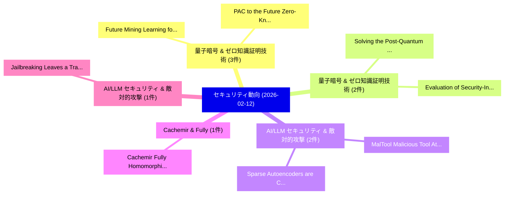

# 📅 02_daily: 日次エグゼクティブサマリー報告書 (2026-02-12)

**集計日時**: 2026-10-02 23:05:57 UTC  
**対象日付**: 2026-02-12  
**本日収集論文数**: 27 件  

---

## 💡 主要セキュリティ動向・脅威インサイト (Executive Insights)

本日の収集論文（計 27 件）において、以下の重点セキュリティ領域で活発な研究動向が確認されました：
- **量子暗号 & ゼロ知識証明技術** (3 件): 注目論文として 「Future Mining: Learning for Sa...」、「PAC to the Future: Zero-Knowle...」 等が発表され、実務防御および攻撃検証の進展が見られます。
- **量子暗号 & ゼロ知識証明技術** (2 件): 注目論文として 「Solving the Post-Quantum Contr...」、「Evaluation of Security-Induced...」 等が発表され、実務防御および攻撃検証の進展が見られます。
- **AI/LLM セキュリティ & 敵対的攻撃** (2 件): 注目論文として 「MalTool: Malicious Tool Attack...」、「Sparse Autoencoders are Capabl...」 等が発表され、実務防御および攻撃検証の進展が見られます。
- **Cachemir & Fully** (1 件): 注目論文として 「Cachemir: Fully Homomorphic En...」 等が発表され、実務防御および攻撃検証の進展が見られます。
- **AI/LLM セキュリティ & 敵対的攻撃** (1 件): 注目論文として 「Jailbreaking Leaves a Trace: U...」 等が発表され、実務防御および攻撃検証の進展が見られます。

### 🗺️ 技術・脅威トピックマインドマップ

---

## 📌 日次セキュリティ論文一覧 (日本語表形式)

| No | arXiv ID | 論文タイトル (日本語訳) | 重要キーワード | 構造化エグゼクティブ要約 (背景・提案・影響) | 脅威分類 | 詳細リンク |
|---|---|---|---|---|---|---|
| 1 | `2602.11470v1` | [Cachemir: Fully Homomorphic Encrypted Inference of Generative Large Language Model with KV Cache（セキュリティ分析論文）](../../okf/papers/2026-02-12/2602.11470.md) | `Fully Homomorphic Encrypted Inference`, `Generative Large Language Model`, `Ye Yu` | 【提案】概要 (Overview & Key Finding) 本論文「Cachemir: Fully Homomorphic Encrypted Inference of Gene...。実証評価により経営層・セキュリティ管理者向け推奨アクション (E... | `cybersecurity` | [arXiv](https://arxiv.org/abs/2602.11470v1) &#124; [OKF](../../okf/papers/2026-02-12/2602.11470.md) |
| 2 | `2602.11472v1` | [Future Mining: Learning for Safety and Security（セキュリティ分析論文）](../../okf/papers/2026-02-12/2602.11472.md) | `Future Mining`, `Md Sazedur Rahman`, `Mizanur Rahman Jewel` | 【提案】概要 (Overview & Key Finding) 本論文「Future Mining: Learning for Safety and Security（セキュリティ分...。実証評価により経営層・セキュリティ管理者向け推奨アクション (E... | `executive-summary` | [arXiv](https://arxiv.org/abs/2602.11472v1) &#124; [OKF](../../okf/papers/2026-02-12/2602.11472.md) |
| 3 | `2602.11495v2` | [Jailbreaking Leaves a Trace: Understanding and Detecting Jailbreak Attacks from Internal Representations of 大規模言語モデル](../../okf/papers/2026-02-12/2602.11495.md) | `Detecting Jailbreak Attacks`, `Jailbreaking Leaves`, `Internal Representations` | 【提案】概要 (Overview & Key Finding) 本論文「ジェイルブレイクing Leaves a Trace: Understanding and Detecting...。実証評価により経営層・セキュリティ管理者向け推奨アクション (E... | `executive-summary` | [arXiv](https://arxiv.org/abs/2602.11495v2) &#124; [OKF](../../okf/papers/2026-02-12/2602.11495.md) |
| 4 | `2602.11513v1` | [Differentially Private and Communication Efficient Large Language Model Split Inference via Stochastic Quantization and Soft Prompt（セキュリティ分析論文）](../../okf/papers/2026-02-12/2602.11513.md) | `Communication Efficient Large Language Model Split Inference`, `Differentially Private`, `Stochastic Quantization` | 【提案】概要 (Overview & Key Finding) 本論文「Differentially Private and Communication Efficient Larg...。実証評価により経営層・セキュリティ管理者向け推奨アクション (E... | `cs.AI` | [arXiv](https://arxiv.org/abs/2602.11513v1) &#124; [OKF](../../okf/papers/2026-02-12/2602.11513.md) |
| 5 | `2602.11528v2` | [Stop Tracking Me! Proactive Defense Against Attribute Inference Attack in LLMs（セキュリティ分析論文）](../../okf/papers/2026-02-12/2602.11528.md) | `Dong Yan`, `Jian Liang`, `Tieniu Tan` | 【提案】Proactive Defense Against Attribute Inference Attack in LLMs ### (日本語題名: Stop Tracking Me!。実証評価により経営層・セキュリティ管理者向け推奨アクション (E... | `cs.AI` | [arXiv](https://arxiv.org/abs/2602.11528v2) &#124; [OKF](../../okf/papers/2026-02-12/2602.11528.md) |
| 6 | `2602.11606v1` | [QDBFT: A Dynamic Consensus Algorithm for Quantum-Secured Blockchain（セキュリティ分析論文）](../../okf/papers/2026-02-12/2602.11606.md) | `Dynamic Consensus Algorithm`, `Secured Blockchain`, `Quantum-Secured Blockchain` | 【提案】概要 (Overview & Key Finding) 本論文「QDBFT: A Dynamic Consensus Algorithm for 量子-Secured Blo...。実証評価により経営層・セキュリティ管理者向け推奨アクション (E... | `cybersecurity` | [arXiv](https://arxiv.org/abs/2602.11606v1) &#124; [OKF](../../okf/papers/2026-02-12/2602.11606.md) |
| 7 | `2602.11651v1` | [DMind-3: A Sovereign Edge--Local--Cloud AI System with Controlled Deliberation and Correction-Based Tuning for Safe, Low-Latency Transaction Execution（セキュリティ分析論文）](../../okf/papers/2026-02-12/2602.11651.md) | `Latency Transaction Execution`, `Sovereign Edge`, `Controlled Deliberation` | 【提案】概要 (Overview & Key Finding) 本論文「DMind-3: A Sovereign Edge--Local--Cloud AI System with ...。実証評価により経営層・セキュリティ管理者向け推奨アクション (E... | `cs.AI` | [arXiv](https://arxiv.org/abs/2602.11651v1) &#124; [OKF](../../okf/papers/2026-02-12/2602.11651.md) |
| 8 | `2602.11655v1` | [LoRA-based Parameter-Efficient LLMs for Continuous Learning in Edge-based マルウェア検出](../../okf/papers/2026-02-12/2602.11655.md) | `Continuous Learning`, `LoRA-based Parameter`, `Malware Detection` | 【提案】概要 (Overview & Key Finding) 本論文「LoRA-based Parameter-Efficient LLMs for Continuous Lear...。実証評価により経営層・セキュリティ管理者向け推奨アクション (E... | `cs.AI` | [arXiv](https://arxiv.org/abs/2602.11655v1) &#124; [OKF](../../okf/papers/2026-02-12/2602.11655.md) |
| 9 | `2602.11764v1` | [Reliable and Private Anonymous Routing for Satellite Constellations（セキュリティ分析論文）](../../okf/papers/2026-02-12/2602.11764.md) | `Private Anonymous Routing`, `Satellite Constellations`, `Nilesh Vyas` | 【提案】概要 (Overview & Key Finding) 本論文「Reliable and Private Anonymous Routing for Satellite Co...。実証評価により経営層・セキュリティ管理者向け推奨アクション (E... | `cs.NI` | [arXiv](https://arxiv.org/abs/2602.11764v1) &#124; [OKF](../../okf/papers/2026-02-12/2602.11764.md) |
| 10 | `2602.11793v1` | [More Haste, Less Speed: Weaker Single-Layer Watermark Improves Distortion-Free Watermark Ensembles（セキュリティ分析論文）](../../okf/papers/2026-02-12/2602.11793.md) | `Layer Watermark Improves Distortion`, `Free Watermark Ensembles`, `Less Speed` | 【提案】概要 (Overview & Key Finding) 本論文「More Haste, Less Speed: Weaker Single-Layer Watermark I...。実証評価により経営層・セキュリティ管理者向け推奨アクション (E... | `executive-summary` | [arXiv](https://arxiv.org/abs/2602.11793v1) &#124; [OKF](../../okf/papers/2026-02-12/2602.11793.md) |
| 11 | `2602.11820v1` | [Solving the Post-Quantum Control Plane Bottleneck: Energy-Aware Cryptographic Scheduling in Open RAN（セキュリティ分析論文）](../../okf/papers/2026-02-12/2602.11820.md) | `Quantum Control Plane Bottleneck`, `Aware Cryptographic Scheduling`, `Post-Quantum Control` | 【提案】概要 (Overview & Key Finding) 本論文「Solving the Post-量子 Control Plane Bottleneck: Energy-Aw...。実証評価により経営層・セキュリティ管理者向け推奨アクション (E... | `executive-summary` | [arXiv](https://arxiv.org/abs/2602.11820v1) &#124; [OKF](../../okf/papers/2026-02-12/2602.11820.md) |
| 12 | `2602.11851v1` | [Resource-Aware Deployment Optimization for Collaborative Intrusion Detection in Layered Networks（セキュリティ分析論文）](../../okf/papers/2026-02-12/2602.11851.md) | `Aware Deployment Optimization`, `Collaborative Intrusion Detection`, `Resource-Aware Deployment` | 【提案】概要 (Overview & Key Finding) 本論文「Resource-Aware Deployment Optimization for Collaborativ...。実証評価により経営層・セキュリティ管理者向け推奨アクション (E... | `cs.AI` | [arXiv](https://arxiv.org/abs/2602.11851v1) &#124; [OKF](../../okf/papers/2026-02-12/2602.11851.md) |
| 13 | `2602.11887v1` | [Verifiable Provenance of Software Artifacts with Zero-Knowledge Compilation（セキュリティ分析論文）](../../okf/papers/2026-02-12/2602.11887.md) | `Verifiable Provenance`, `Software Artifacts`, `Knowledge Compilation` | 【提案】概要 (Overview & Key Finding) 本論文「Verifiable Provenance of Software Artifacts with Zero-K...。実証評価により経営層・セキュリティ管理者向け推奨アクション (E... | `executive-summary` | [arXiv](https://arxiv.org/abs/2602.11887v1) &#124; [OKF](../../okf/papers/2026-02-12/2602.11887.md) |
| 14 | `2602.11897v3` | [Agentic AI for サイバーセキュリティ: A Meta-Cognitive Architecture for Governable Autonomy](../../okf/papers/2026-02-12/2602.11897.md) | `Cognitive Architecture`, `Governable Autonomy`, `Meta-Cognitive Architecture` | 【提案】概要 (Overview & Key Finding) 本論文「Agentic AI for サイバーセキュリティ: A Meta-Cognitive Architectur...。実証評価により経営層・セキュリティ管理者向け推奨アクション (E... | `cs.AI` | [arXiv](https://arxiv.org/abs/2602.11897v3) &#124; [OKF](../../okf/papers/2026-02-12/2602.11897.md) |
| 15 | `2602.11954v1` | [PAC to the Future: Zero-Knowledge Proofs of PAC Private Systems（セキュリティ分析論文）](../../okf/papers/2026-02-12/2602.11954.md) | `Knowledge Proofs`, `Private Systems`, `Zero-Knowledge Proofs` | 【提案】概要 (Overview & Key Finding) 本論文「PAC to the Future: Zero-Knowledge Proofs of PAC Private...。実証評価により経営層・セキュリティ管理者向け推奨アクション (E... | `cybersecurity` | [arXiv](https://arxiv.org/abs/2602.11954v1) &#124; [OKF](../../okf/papers/2026-02-12/2602.11954.md) |
| 16 | `2602.12059v1` | [Evaluation of Security-Induced Latency on 5G RAN Interfaces and User Plane Communication（セキュリティ分析論文）](../../okf/papers/2026-02-12/2602.12059.md) | `User Plane Communication`, `Induced Latency`, `Security-Induced Latency` | 【提案】概要 (Overview & Key Finding) 本論文「Evaluation of Security-Induced Latency on 5G RAN Interf...。実証評価により経営層・セキュリティ管理者向け推奨アクション (E... | `cs.NI` | [arXiv](https://arxiv.org/abs/2602.12059v1) &#124; [OKF](../../okf/papers/2026-02-12/2602.12059.md) |
| 17 | `2602.12092v1` | [DeepSight: An All-in-One LM Safety Toolkit（セキュリティ分析論文）](../../okf/papers/2026-02-12/2602.12092.md) | `Safety Toolkit`, `Bo Zhang`, `Jiaxuan Guo` | 【提案】概要 (Overview & Key Finding) 本論文「DeepSight: An All-in-One LM Safety Toolkit（セキュリティ分析論文）」...。実証評価により経営層・セキュリティ管理者向け推奨アクション (E... | `cs.AI` | [arXiv](https://arxiv.org/abs/2602.12092v1) &#124; [OKF](../../okf/papers/2026-02-12/2602.12092.md) |
| 18 | `2602.12106v1` | [MedExChain: Enabling Secure and Efffcient PHR Sharing Across Heterogeneous Blockchains（セキュリティ分析論文）](../../okf/papers/2026-02-12/2602.12106.md) | `Sharing Across Heterogeneous Blockchains`, `Enabling Secure`, `Yongyang Lv` | 【提案】概要 (Overview & Key Finding) 本論文「MedExChain: Enabling Secure and Efffcient PHR Sharing A...。実証評価により経営層・セキュリティ管理者向け推奨アクション (E... | `cybersecurity` | [arXiv](https://arxiv.org/abs/2602.12106v1) &#124; [OKF](../../okf/papers/2026-02-12/2602.12106.md) |
| 19 | `2602.12138v2` | [BlackCATT: Black-box Collusion Aware Traitor Tracing in 連合学習](../../okf/papers/2026-02-12/2602.12138.md) | `Collusion Aware Traitor Tracing`, `Black-box Collusion`, `Federated Learning` | 【提案】概要 (Overview & Key Finding) 本論文「BlackCATT: Black-box Collusion Aware Traitor Tracing in...。実証評価により経営層・セキュリティ管理者向け推奨アクション (E... | `cybersecurity` | [arXiv](https://arxiv.org/abs/2602.12138v2) &#124; [OKF](../../okf/papers/2026-02-12/2602.12138.md) |
| 20 | `2602.12183v1` | [Unknown Attack Detection in IoT Networks using 大規模言語モデル: A Robust, Data-efficient Approach](../../okf/papers/2026-02-12/2602.12183.md) | `Unknown Attack Detection`, `Large Language Models`, `Shan Ali` | 【提案】概要 (Overview & Key Finding) 本論文「Unknown Attack Detection in IoT Networks using 大規模言語モデル...。実証評価により経営層・セキュリティ管理者向け推奨アクション (E... | `executive-summary` | [arXiv](https://arxiv.org/abs/2602.12183v1) &#124; [OKF](../../okf/papers/2026-02-12/2602.12183.md) |
| 21 | `2602.12194v3` | [MalTool: Malicious Tool Attacks on LLMエージェント](../../okf/papers/2026-02-12/2602.12194.md) | `Malicious Tool Attacks`, `Yuepeng Hu`, `Yuqi Jia` | 【提案】概要 (Overview & Key Finding) 本論文「MalTool: Malicious Tool Attacks on LLMエージェント」（原題: MalTo...。実証評価により経営層・セキュリティ管理者向け推奨アクション (E... | `cybersecurity` | [arXiv](https://arxiv.org/abs/2602.12194v3) &#124; [OKF](../../okf/papers/2026-02-12/2602.12194.md) |
| 22 | `2602.12209v1` | [Keeping a Secret Requires a Good Memory: Space Lower-Bounds for Private Algorithms（セキュリティ分析論文）](../../okf/papers/2026-02-12/2602.12209.md) | `Secret Requires`, `Good Memory`, `Space Lower` | 【提案】概要 (Overview & Key Finding) 本論文「Keeping a Secret Requires a Good Memory: Space Lower-Bo...。実証評価により経営層・セキュリティ管理者向け推奨アクション (E... | `executive-summary` | [arXiv](https://arxiv.org/abs/2602.12209v1) &#124; [OKF](../../okf/papers/2026-02-12/2602.12209.md) |
| 23 | `2602.12250v2` | [Community Concealment from Graph Neural Networks（セキュリティ分析論文）](../../okf/papers/2026-02-12/2602.12250.md) | `Graph Neural Networks`, `Community Concealment`, `Network Security` | 【提案】概要 (Overview & Key Finding) 本論文「Community Concealment from Graph Neural Networks（セキュリティ...。実証評価によりJean Camp - **公開日時**: `20... | `Network Security` | [arXiv](https://arxiv.org/abs/2602.12250v2) &#124; [OKF](../../okf/papers/2026-02-12/2602.12250.md) |
| 24 | `2602.12260v2` | [Legitimate Overrides in Decentralized Protocols（セキュリティ分析論文）](../../okf/papers/2026-02-12/2602.12260.md) | `Legitimate Overrides`, `Decentralized Protocols`, `Oghenekaro Elem` | 【提案】概要 (Overview & Key Finding) 本論文「Legitimate Overrides in Decentralized Protocols（セキュリティ分...。実証評価により経営層・セキュリティ管理者向け推奨アクション (E... | `executive-summary` | [arXiv](https://arxiv.org/abs/2602.12260v2) &#124; [OKF](../../okf/papers/2026-02-12/2602.12260.md) |
| 25 | `2602.12398v1` | [Secrecy and Verifiability: An Introduction to Electronic Voting（セキュリティ分析論文）](../../okf/papers/2026-02-12/2602.12398.md) | `Electronic Voting`, `Paul Keeler`, `Ben Smyth` | 【提案】概要 (Overview & Key Finding) 本論文「Secrecy and Verifiability: An Introduction to Electroni...。実証評価により経営層・セキュリティ管理者向け推奨アクション (E... | `cybersecurity` | [arXiv](https://arxiv.org/abs/2602.12398v1) &#124; [OKF](../../okf/papers/2026-02-12/2602.12398.md) |
| 26 | `2602.12418v2` | [Sparse Autoencoders are Capable LLM Jailbreak Mitigators（セキュリティ分析論文）](../../okf/papers/2026-02-12/2602.12418.md) | `Sparse Autoencoders`, `Jailbreak Mitigators`, `Yannick Assogba` | 【提案】概要 (Overview & Key Finding) 本論文「Sparse Autoencoders are Capable LLM ジェイルブレイク Mitigators...。実証評価により経営層・セキュリティ管理者向け推奨アクション (E... | `executive-summary` | [arXiv](https://arxiv.org/abs/2602.12418v2) &#124; [OKF](../../okf/papers/2026-02-12/2602.12418.md) |
| 27 | `2602.12433v2` | [DRAMatic Speedup: Accelerating HE Operations on a Processing-in-Memory System（セキュリティ分析論文）](../../okf/papers/2026-02-12/2602.12433.md) | `Memory System`, `Niklas Klinger`, `Jonas Sander` | 【提案】概要 (Overview & Key Finding) 本論文「DRAMatic Speedup: Accelerating HE Operations on a Proce...。実証評価により経営層・セキュリティ管理者向け推奨アクション (E... | `executive-summary` | [arXiv](https://arxiv.org/abs/2602.12433v2) &#124; [OKF](../../okf/papers/2026-02-12/2602.12433.md) |

