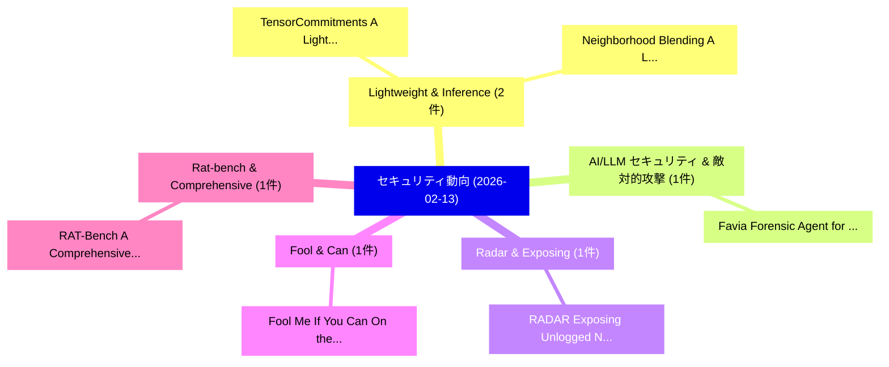

# 📅 02_daily: 日次エグゼクティブサマリー報告書 (2026-02-13)

**集計日時**: 2026-10-02 23:05:58 UTC  
**対象日付**: 2026-02-13  
**本日収集論文数**: 19 件  

---

## 💡 主要セキュリティ動向・脅威インサイト (Executive Insights)

本日の収集論文（計 19 件）において、以下の重点セキュリティ領域で活発な研究動向が確認されました：
- **Lightweight & Inference** (2 件): 注目論文として 「TensorCommitments: A Lightweig...」、「Neighborhood Blending: A Light...」 等が発表され、実務防御および攻撃検証の進展が見られます。
- **AI/LLM セキュリティ & 敵対的攻撃** (1 件): 注目論文として 「Favia: Forensic Agent for Vuln...」 等が発表され、実務防御および攻撃検証の進展が見られます。
- **Radar & Exposing** (1 件): 注目論文として 「RADAR: Exposing Unlogged NoSQL...」 等が発表され、実務防御および攻撃検証の進展が見られます。
- **Fool & Can** (1 件): 注目論文として 「Fool Me If You Can: On the Rob...」 等が発表され、実務防御および攻撃検証の進展が見られます。
- **Rat-bench & Comprehensive** (1 件): 注目論文として 「RAT-Bench: A Comprehensive Ben...」 等が発表され、実務防御および攻撃検証の進展が見られます。

### 🗺️ 技術・脅威トピックマインドマップ

---

## 📌 日次セキュリティ論文一覧 (日本語表形式)

| No | arXiv ID | 論文タイトル (日本語訳) | 重要キーワード | 構造化エグゼクティブ要約 (背景・提案・影響) | 脅威分類 | 詳細リンク |
|---|---|---|---|---|---|---|
| 1 | `2602.12500v1` | [Favia: Forensic Agent for Vulnerability-fix Identification and Analysis（セキュリティ分析論文）](../../okf/papers/2026-02-13/2602.12500.md) | `Forensic Agent`, `Vulnerability-fix Identification`, `Jiamou Sun` | 【提案】概要 (Overview & Key Finding) 本論文「Favia: Forensic Agent for 脆弱性-fix Identification and An...。実証評価により経営層・セキュリティ管理者向け推奨アクション (E... | `cs.AI` | [arXiv](https://arxiv.org/abs/2602.12500v1) &#124; [OKF](../../okf/papers/2026-02-13/2602.12500.md) |
| 2 | `2602.12600v1` | [RADAR: Exposing Unlogged NoSQL Operations（セキュリティ分析論文）](../../okf/papers/2026-02-13/2602.12600.md) | `Exposing Unlogged`, `James Wagner`, `Raw Meta` | 【提案】概要 (Overview & Key Finding) 本論文「RADAR: Exposing Unlogged NoSQL Operations（セキュリティ分析論文）」（...。実証評価によりNissan, James Wagner - **... | `cs.DB` | [arXiv](https://arxiv.org/abs/2602.12600v1) &#124; [OKF](../../okf/papers/2026-02-13/2602.12600.md) |
| 3 | `2602.12630v1` | [TensorCommitments: A Lightweight Verifiable Inference for Language Models（セキュリティ分析論文）](../../okf/papers/2026-02-13/2602.12630.md) | `Lightweight Verifiable Inference`, `Language Models`, `David Ribeiro Alves` | 【提案】概要 (Overview & Key Finding) 本論文「TensorCommitments: A Lightweight Verifiable Inference f...。実証評価により経営層・セキュリティ管理者向け推奨アクション (E... | `cs.AI` | [arXiv](https://arxiv.org/abs/2602.12630v1) &#124; [OKF](../../okf/papers/2026-02-13/2602.12630.md) |
| 4 | `2602.12681v1` | [Fool Me If You Can: On the Robustness of Binary Code Similarity Detection Models against Semantics-preserving Transformations（セキュリティ分析論文）](../../okf/papers/2026-02-13/2602.12681.md) | `Binary Code Similarity Detection Models`, `Semantics-preserving Transformations`, `Jiyong Uhm` | 【提案】概要 (Overview & Key Finding) 本論文「Fool Me If You Can: On the Robustness of Binary Code Si...。実証評価により経営層・セキュリティ管理者向け推奨アクション (E... | `executive-summary` | [arXiv](https://arxiv.org/abs/2602.12681v1) &#124; [OKF](../../okf/papers/2026-02-13/2602.12681.md) |
| 5 | `2602.12806v1` | [RAT-Bench: A Comprehensive Benchmark for Text Anonymization（セキュリティ分析論文）](../../okf/papers/2026-02-13/2602.12806.md) | `Comprehensive Benchmark`, `Text Anonymization`, `Zexi Yao` | 【提案】概要 (Overview & Key Finding) 本論文「RAT-Bench: A Comprehensive Benchmark for Text Anonymiza...。実証評価により経営層・セキュリティ管理者向け推奨アクション (E... | `cs.AI` | [arXiv](https://arxiv.org/abs/2602.12806v1) &#124; [OKF](../../okf/papers/2026-02-13/2602.12806.md) |
| 6 | `2602.12825v1` | [Reliable Hierarchical Operating System Fingerprinting via Conformal Prediction（セキュリティ分析論文）](../../okf/papers/2026-02-13/2602.12825.md) | `Reliable Hierarchical Operating System Fingerprinting`, `Conformal Prediction`, `Osvaldo Simeone` | 【提案】概要 (Overview & Key Finding) 本論文「Reliable Hierarchical Operating System Fingerprinting v...。実証評価により経営層・セキュリティ管理者向け推奨アクション (E... | `cs.NI` | [arXiv](https://arxiv.org/abs/2602.12825v1) &#124; [OKF](../../okf/papers/2026-02-13/2602.12825.md) |
| 7 | `2602.12851v5` | [Chimera: Neuro-Symbolic Attention Primitives for Trustworthy Dataplane Intelligence（セキュリティ分析論文）](../../okf/papers/2026-02-13/2602.12851.md) | `Symbolic Attention Primitives`, `Trustworthy Dataplane Intelligence`, `Neuro-Symbolic Attention` | 【提案】概要 (Overview & Key Finding) 本論文「Chimera: Neuro-Symbolic Attention Primitives for Trustw...。実証評価により経営層・セキュリティ管理者向け推奨アクション (E... | `cs.NI` | [arXiv](https://arxiv.org/abs/2602.12851v5) &#124; [OKF](../../okf/papers/2026-02-13/2602.12851.md) |
| 8 | `2602.12943v1` | [Neighborhood Blending: A Lightweight Inference-Time Defense Against Membership Inference Attacks（セキュリティ分析論文）](../../okf/papers/2026-02-13/2602.12943.md) | `Neighborhood Blending`, `Lightweight Inference`, `Inference-Time Defense` | 【提案】概要 (Overview & Key Finding) 本論文「Neighborhood Blending: A Lightweight Inference-Time Def...。実証評価により経営層・セキュリティ管理者向け推奨アクション (E... | `cybersecurity` | [arXiv](https://arxiv.org/abs/2602.12943v1) &#124; [OKF](../../okf/papers/2026-02-13/2602.12943.md) |
| 9 | `2602.12967v2` | [Cryptographic Choreographies（セキュリティ分析論文）](../../okf/papers/2026-02-13/2602.12967.md) | `Cryptographic Choreographies`, `Simon Lund`, `Alessandro Bruni` | 【提案】概要 (Overview & Key Finding) 本論文「Cryptographic Choreographies（セキュリティ分析論文）」（原題: Cryptogra...。実証評価により経営層・セキュリティ管理者向け推奨アクション (E... | `cybersecurity` | [arXiv](https://arxiv.org/abs/2602.12967v2) &#124; [OKF](../../okf/papers/2026-02-13/2602.12967.md) |
| 10 | `2602.13062v1` | [Backdoor Attacks on Contrastive Continual Learning for IoT Systems（セキュリティ分析論文）](../../okf/papers/2026-02-13/2602.13062.md) | `Contrastive Continual Learning`, `Backdoor Attacks`, `Alfous Tim` | 【提案】概要 (Overview & Key Finding) 本論文「Backdoor Attacks on Contrastive Continual Learning for ...。実証評価により経営層・セキュリティ管理者向け推奨アクション (E... | `cs.NI` | [arXiv](https://arxiv.org/abs/2602.13062v1) &#124; [OKF](../../okf/papers/2026-02-13/2602.13062.md) |
| 11 | `2602.13148v2` | [TrustMee: Self-Verifying Remote Attestation Evidence（セキュリティ分析論文）](../../okf/papers/2026-02-13/2602.13148.md) | `Verifying Remote Attestation Evidence`, `Self-Verifying Remote`, `Parsa Sadri Sinaki` | 【提案】概要 (Overview & Key Finding) 本論文「TrustMee: Self-Verifying Remote Attestation Evidence（セキ...。実証評価によりGunn - **公開日時**: `2026-02... | `cybersecurity` | [arXiv](https://arxiv.org/abs/2602.13148v2) &#124; [OKF](../../okf/papers/2026-02-13/2602.13148.md) |
| 12 | `2602.13156v2` | [In-Context Autonomous Network Incident Response: An End-to-End Large Language Model Agent Approach（セキュリティ分析論文）](../../okf/papers/2026-02-13/2602.13156.md) | `Context Autonomous Network Incident Response`, `In-Context Autonomous`, `Yiran Gao` | 【提案】概要 (Overview & Key Finding) 本論文「In-Context Autonomous Network Incident Response: An End...。実証評価により経営層・セキュリティ管理者向け推奨アクション (E... | `cs.AI` | [arXiv](https://arxiv.org/abs/2602.13156v2) &#124; [OKF](../../okf/papers/2026-02-13/2602.13156.md) |
| 13 | `2602.13167v1` | [Bloom Filter Look-Up Tables for Private and Secure Distributed Databases in Web3 (Revised Version)（セキュリティ分析論文）](../../okf/papers/2026-02-13/2602.13167.md) | `Bloom Filter Look`, `Secure Distributed Databases`, `Revised Version` | 【提案】概要 (Overview & Key Finding) 本論文「Bloom Filter Look-Up Tables for Private and Secure Dist...。実証評価により経営層・セキュリティ管理者向け推奨アクション (E... | `executive-summary` | [arXiv](https://arxiv.org/abs/2602.13167v1) &#124; [OKF](../../okf/papers/2026-02-13/2602.13167.md) |
| 14 | `2602.13363v1` | [Assessing Spear-Phishing Website Generation in Large Language Model Coding Agents（セキュリティ分析論文）](../../okf/papers/2026-02-13/2602.13363.md) | `Large Language Model Coding Agents`, `Phishing Website Generation`, `Assessing Spear` | 【提案】概要 (Overview & Key Finding) 本論文「Assessing Spear-Phishing Website Generation in Large La...。実証評価により経営層・セキュリティ管理者向け推奨アクション (E... | `cs.AI` | [arXiv](https://arxiv.org/abs/2602.13363v1) &#124; [OKF](../../okf/papers/2026-02-13/2602.13363.md) |
| 15 | `2602.13379v2` | [Unsafer in Many Turns: and Defending Multi-Turn Safety Risks in Tool-Using Agentsのベンチマーク評価](../../okf/papers/2026-02-13/2602.13379.md) | `Turn Safety Risks`, `Many Turns`, `Defending Multi` | 【提案】概要 (Overview & Key Finding) 本論文「Unsafer in Many Turns: and Defending Multi-Turn Safety ...。実証評価により経営層・セキュリティ管理者向け推奨アクション (E... | `cs.AI` | [arXiv](https://arxiv.org/abs/2602.13379v2) &#124; [OKF](../../okf/papers/2026-02-13/2602.13379.md) |
| 16 | `2602.13427v1` | [Backdooring Bias in 大規模言語モデル](../../okf/papers/2026-02-13/2602.13427.md) | `Backdooring Bias`, `Large Language Models`, `Anudeep Das` | 【提案】概要 (Overview & Key Finding) 本論文「Backdooring Bias in 大規模言語モデル」（原題: Backdooring Bias in L...。実証評価により経営層・セキュリティ管理者向け推奨アクション (E... | `cs.AI` | [arXiv](https://arxiv.org/abs/2602.13427v1) &#124; [OKF](../../okf/papers/2026-02-13/2602.13427.md) |
| 17 | `2602.13480v2` | [MELT: A Behavioral Trace Dataset for High-Risk Memecoin Launch Detection（セキュリティ分析論文）](../../okf/papers/2026-02-13/2602.13480.md) | `Risk Memecoin Launch Detection`, `Behavioral Trace Dataset`, `High-Risk Memecoin` | 【提案】概要 (Overview & Key Finding) 本論文「MELT: A Behavioral Trace Dataset for High-Risk Memecoin...。実証評価により経営層・セキュリティ管理者向け推奨アクション (E... | `executive-summary` | [arXiv](https://arxiv.org/abs/2602.13480v2) &#124; [OKF](../../okf/papers/2026-02-13/2602.13480.md) |
| 18 | `2602.13529v2` | [SecureGate: Learning When to Reveal PII Safely via Token-Gated Dual-Adapters for Federated LLMs（セキュリティ分析論文）](../../okf/papers/2026-02-13/2602.13529.md) | `Gated Dual`, `Token-Gated Dual`, `Mohamed Shaaban` | 【提案】概要 (Overview & Key Finding) 本論文「SecureGate: Learning When to Reveal PII Safely via Toke...。実証評価により経営層・セキュリティ管理者向け推奨アクション (E... | `executive-summary` | [arXiv](https://arxiv.org/abs/2602.13529v2) &#124; [OKF](../../okf/papers/2026-02-13/2602.13529.md) |
| 19 | `2603.05520v1` | [Information-Theoretic Privacy Control for Sequential Multi-Agent LLM Systems（セキュリティ分析論文）](../../okf/papers/2026-02-13/2603.05520.md) | `Theoretic Privacy Control`, `Sequential Multi`, `Information-Theoretic Privacy` | 【提案】概要 (Overview & Key Finding) 本論文「Information-Theoretic Privacy Control for Sequential Mu...。実証評価により経営層・セキュリティ管理者向け推奨アクション (E... | `executive-summary` | [arXiv](https://arxiv.org/abs/2603.05520v1) &#124; [OKF](../../okf/papers/2026-02-13/2603.05520.md) |

