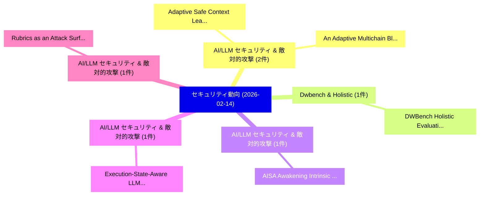

# 📅 02_daily: 日次エグゼクティブサマリー報告書 (2026-02-14)

**集計日時**: 2026-10-02 23:05:58 UTC  
**対象日付**: 2026-02-14  
**本日収集論文数**: 11 件  

---

## 💡 主要セキュリティ動向・脅威インサイト (Executive Insights)

本日の収集論文（計 11 件）において、以下の重点セキュリティ領域で活発な研究動向が確認されました：
- **AI/LLM セキュリティ & 敵対的攻撃** (2 件): 注目論文として 「Adaptive Safe Context Learning...」、「An Adaptive Multichain Blockch...」 等が発表され、実務防御および攻撃検証の進展が見られます。
- **Dwbench & Holistic** (1 件): 注目論文として 「DWBench: Holistic Evaluation o...」 等が発表され、実務防御および攻撃検証の進展が見られます。
- **AI/LLM セキュリティ & 敵対的攻撃** (1 件): 注目論文として 「AISA: Awakening Intrinsic Safe...」 等が発表され、実務防御および攻撃検証の進展が見られます。
- **AI/LLM セキュリティ & 敵対的攻撃** (1 件): 注目論文として 「Execution-State-Aware LLM Reas...」 等が発表され、実務防御および攻撃検証の進展が見られます。
- **AI/LLM セキュリティ & 敵対的攻撃** (1 件): 注目論文として 「Rubrics as an Attack Surface: ...」 等が発表され、実務防御および攻撃検証の進展が見られます。

### 🗺️ 技術・脅威トピックマインドマップ

---

## 📌 日次セキュリティ論文一覧 (日本語表形式)

| No | arXiv ID | 論文タイトル (日本語訳) | 重要キーワード | 構造化エグゼクティブ要約 (背景・提案・影響) | 脅威分類 | 詳細リンク |
|---|---|---|---|---|---|---|
| 1 | `2602.13541v1` | [DWBench: Holistic Evaluation of Watermark for Dataset Copyright Auditing（セキュリティ分析論文）](../../okf/papers/2026-02-14/2602.13541.md) | `Dataset Copyright Auditing`, `Xiao Ren`, `Xinyi Yu` | 【提案】概要 (Overview & Key Finding) 本論文「DWBench: Holistic Evaluation of Watermark for Dataset C...。実証評価により経営層・セキュリティ管理者向け推奨アクション (E... | `cybersecurity` | [arXiv](https://arxiv.org/abs/2602.13541v1) &#124; [OKF](../../okf/papers/2026-02-14/2602.13541.md) |
| 2 | `2602.13547v1` | [AISA: Awakening Intrinsic Safety Awareness in 大規模言語モデル against Jailbreak Attacks](../../okf/papers/2026-02-14/2602.13547.md) | `Awakening Intrinsic Safety Awareness`, `Jailbreak Attacks`, `Large Language Models` | 【提案】概要 (Overview & Key Finding) 本論文「AISA: Awakening Intrinsic Safety Awareness in 大規模言語モデル ...。実証評価により経営層・セキュリティ管理者向け推奨アクション (E... | `cs.AI` | [arXiv](https://arxiv.org/abs/2602.13547v1) &#124; [OKF](../../okf/papers/2026-02-14/2602.13547.md) |
| 3 | `2602.13562v2` | [Adaptive Safe Context Learningによるthe Safety-utility Trade-off in LLM Alignmentの軽減](../../okf/papers/2026-02-14/2602.13562.md) | `Safety-utility Trade`, `Adaptive Safe Context`, `Adaptive Safe Context Learning` | 【提案】概要 (Overview & Key Finding) 本論文「Adaptive Safe Context Learningによるthe Safety-utility Tra...。実証評価により経営層・セキュリティ管理者向け推奨アクション (E... | `cs.AI` | [arXiv](https://arxiv.org/abs/2602.13562v2) &#124; [OKF](../../okf/papers/2026-02-14/2602.13562.md) |
| 4 | `2602.13574v1` | [Execution-State-Aware LLM Reasoning for Automated Proof-of-Vulnerability Generation（セキュリティ分析論文）](../../okf/papers/2026-02-14/2602.13574.md) | `Automated Proof`, `Vulnerability Generation`, `Haoyu Li` | 【提案】概要 (Overview & Key Finding) 本論文「Execution-State-Aware LLM Reasoning for Automated Proof...。実証評価により経営層・セキュリティ管理者向け推奨アクション (E... | `executive-summary` | [arXiv](https://arxiv.org/abs/2602.13574v1) &#124; [OKF](../../okf/papers/2026-02-14/2602.13574.md) |
| 5 | `2602.13576v1` | [Rubrics as an Attack Surface: Stealthy Preference Drift in LLM Judges（セキュリティ分析論文）](../../okf/papers/2026-02-14/2602.13576.md) | `Stealthy Preference Drift`, `Attack Surface`, `Zhiwei Steven Wu` | 【提案】概要 (Overview & Key Finding) 本論文「Rubrics as an Attack Surface: Stealthy Preference Drift...。実証評価により経営層・セキュリティ管理者向け推奨アクション (E... | `cs.AI` | [arXiv](https://arxiv.org/abs/2602.13576v1) &#124; [OKF](../../okf/papers/2026-02-14/2602.13576.md) |
| 6 | `2602.13597v2` | [AlignSentinel: Alignment-Aware Prompt Injection Attacksの検出](../../okf/papers/2026-02-14/2602.13597.md) | `Prompt Injection Attacks`, `Aware Prompt Injection`, `Aware Detection` | 【提案】概要 (Overview & Key Finding) 本論文「AlignSentinel: Alignment-Aware プロンプトインジェクション Attacksの検出...。実証評価により経営層・セキュリティ管理者向け推奨アクション (E... | `cybersecurity` | [arXiv](https://arxiv.org/abs/2602.13597v2) &#124; [OKF](../../okf/papers/2026-02-14/2602.13597.md) |
| 7 | `2602.13682v1` | [VeriSBOM: Secure and Verifiable SBOM Sharing Via Zero-Knowledge Proofs（セキュリティ分析論文）](../../okf/papers/2026-02-14/2602.13682.md) | `Sharing Via Zero`, `Knowledge Proofs`, `Zero-Knowledge Proofs` | 【提案】概要 (Overview & Key Finding) 本論文「VeriSBOM: Secure and Verifiable SBOM Sharing Via Zero-K...。実証評価により経営層・セキュリティ管理者向け推奨アクション (E... | `executive-summary` | [arXiv](https://arxiv.org/abs/2602.13682v1) &#124; [OKF](../../okf/papers/2026-02-14/2602.13682.md) |
| 8 | `2602.13869v1` | [Applying Public Health Systematic Approaches to サイバーセキュリティ: The Economics of Collective Defense](../../okf/papers/2026-02-14/2602.13869.md) | `Applying Public Health Systematic Approaches`, `Collective Defense`, `Josiah Dykstra` | 【提案】概要 (Overview & Key Finding) 本論文「Applying Public Health Systematic Approaches to サイバーセキュ...。実証評価により経営層・セキュリティ管理者向け推奨アクション (E... | `executive-summary` | [arXiv](https://arxiv.org/abs/2602.13869v1) &#124; [OKF](../../okf/papers/2026-02-14/2602.13869.md) |
| 9 | `2602.13898v1` | [Assessing Cybersecurity Risks and Traffic Impact in Connected 自動運転車両](../../okf/papers/2026-02-14/2602.13898.md) | `Assessing Cybersecurity Risks`, `Traffic Impact`, `Connected Autonomous Vehicles` | 【提案】概要 (Overview & Key Finding) 本論文「Assessing Cybersecurity Risks and Traffic Impact in Con...。実証評価によりYunpeng Zhang。 | `cybersecurity` | [arXiv](https://arxiv.org/abs/2602.13898v1) &#124; [OKF](../../okf/papers/2026-02-14/2602.13898.md) |
| 10 | `2602.13915v1` | [MarcoPolo: A Zero-Permission Attack for Location Type Inference from the Magnetic Field using Mobile Devices（セキュリティ分析論文）](../../okf/papers/2026-02-14/2602.13915.md) | `Location Type Inference`, `Permission Attack`, `Zero-Permission Attack` | 【提案】概要 (Overview & Key Finding) 本論文「MarcoPolo: A Zero-Permission Attack for Location Type I...。実証評価により経営層・セキュリティ管理者向け推奨アクション (E... | `cybersecurity` | [arXiv](https://arxiv.org/abs/2602.13915v1) &#124; [OKF](../../okf/papers/2026-02-14/2602.13915.md) |
| 11 | `2602.22230v1` | [An Adaptive Multichain Blockchain: A Multiobjective Optimization Approach（セキュリティ分析論文）](../../okf/papers/2026-02-14/2602.22230.md) | `Nimrod Talmon`, `Haim Zysberg`, `Raw Meta` | 【提案】概要 (Overview & Key Finding) 本論文「An Adaptive Multichain Blockchain: A Multiobjective Opt...。実証評価により経営層・セキュリティ管理者向け推奨アクション (E... | `executive-summary` | [arXiv](https://arxiv.org/abs/2602.22230v1) &#124; [OKF](../../okf/papers/2026-02-14/2602.22230.md) |

