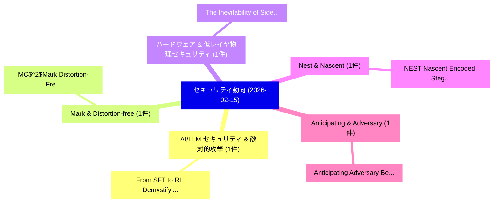

# 📅 02_daily: 日次エグゼクティブサマリー報告書 (2026-02-15)

**集計日時**: 2026-10-02 23:05:58 UTC  
**対象日付**: 2026-02-15  
**本日収集論文数**: 14 件  

---

## 💡 主要セキュリティ動向・脅威インサイト (Executive Insights)

本日の収集論文（計 14 件）において、以下の重点セキュリティ領域で活発な研究動向が確認されました：
- **AI/LLM セキュリティ & 敵対的攻撃** (1 件): 注目論文として 「From SFT to RL: Demystifying t...」 等が発表され、実務防御および攻撃検証の進展が見られます。
- **Mark & Distortion-free** (1 件): 注目論文として 「MC$^2$Mark: Distortion-Free Mu...」 等が発表され、実務防御および攻撃検証の進展が見られます。
- **ハードウェア & 低レイヤ物理セキュリティ** (1 件): 注目論文として 「The Inevitability of Side-Chan...」 等が発表され、実務防御および攻撃検証の進展が見られます。
- **Nest & Nascent** (1 件): 注目論文として 「NEST: Nascent Encoded Steganog...」 等が発表され、実務防御および攻撃検証の進展が見られます。
- **Anticipating & Adversary** (1 件): 注目論文として 「Anticipating Adversary Behavio...」 等が発表され、実務防御および攻撃検証の進展が見られます。

### 🗺️ 技術・脅威トピックマインドマップ

---

## 📌 日次セキュリティ論文一覧 (日本語表形式)

| No | arXiv ID | 論文タイトル (日本語訳) | 重要キーワード | 構造化エグゼクティブ要約 (背景・提案・影響) | 脅威分類 | 詳細リンク |
|---|---|---|---|---|---|---|
| 1 | `2602.14012v2` | [From SFT to RL: Demystifying the Post-Training Pipeline for LLM-based 脆弱性検出](../../okf/papers/2026-02-15/2602.14012.md) | `Training Pipeline`, `Post-Training Pipeline`, `Vulnerability Detection` | 【提案】概要 (Overview & Key Finding) 本論文「From SFT to RL: Demystifying the Post-Training Pipeline...。実証評価により経営層・セキュリティ管理者向け推奨アクション (E... | `cs.AI` | [arXiv](https://arxiv.org/abs/2602.14012v2) &#124; [OKF](../../okf/papers/2026-02-15/2602.14012.md) |
| 2 | `2602.14030v1` | [MC$^2$Mark: Distortion-Free Multi-Bit Watermarking for Long Messages（セキュリティ分析論文）](../../okf/papers/2026-02-15/2602.14030.md) | `Free Multi`, `Bit Watermarking`, `Long Messages` | 【提案】概要 (Overview & Key Finding) 本論文「MC$^2$Mark: Distortion-Free Multi-Bit Watermarking for ...。実証評価により経営層・セキュリティ管理者向け推奨アクション (E... | `executive-summary` | [arXiv](https://arxiv.org/abs/2602.14030v1) &#124; [OKF](../../okf/papers/2026-02-15/2602.14030.md) |
| 3 | `2602.14055v1` | [The Inevitability of Side-Channel Leakage in Encrypted Traffic（セキュリティ分析論文）](../../okf/papers/2026-02-15/2602.14055.md) | `Channel Leakage`, `Encrypted Traffic`, `Side-Channel Leakage` | 【提案】概要 (Overview & Key Finding) 本論文「The Inevitability of サイドチャネル攻撃 Leakage in Encrypted Tra...。実証評価により経営層・セキュリティ管理者向け推奨アクション (E... | `executive-summary` | [arXiv](https://arxiv.org/abs/2602.14055v1) &#124; [OKF](../../okf/papers/2026-02-15/2602.14055.md) |
| 4 | `2602.14095v2` | [NEST: Nascent Encoded Steganographic Thoughts（セキュリティ分析論文）](../../okf/papers/2026-02-15/2602.14095.md) | `Nascent Encoded Steganographic Thoughts`, `Artem Karpov`, `Raw Meta` | 【提案】概要 (Overview & Key Finding) 本論文「NEST: Nascent Encoded Steganographic Thoughts（セキュリティ分析論...。実証評価により経営層・セキュリティ管理者向け推奨アクション (E... | `cs.AI` | [arXiv](https://arxiv.org/abs/2602.14095v2) &#124; [OKF](../../okf/papers/2026-02-15/2602.14095.md) |
| 5 | `2602.14106v1` | [Anticipating Adversary Behavior in DevSecOps Scenarios through 大規模言語モデル](../../okf/papers/2026-02-15/2602.14106.md) | `Anticipating Adversary Behavior`, `Large Language Models`, `Miguel Betancourt Alonso` | 【提案】概要 (Overview & Key Finding) 本論文「Anticipating Adversary Behavior in DevSecOps Scenarios ...。実証評価により経営層・セキュリティ管理者向け推奨アクション (E... | `cs.AI` | [arXiv](https://arxiv.org/abs/2602.14106v1) &#124; [OKF](../../okf/papers/2026-02-15/2602.14106.md) |
| 6 | `2602.14116v1` | [Toward a Military Smart Cyber Situational Awareness (CSA)（セキュリティ分析論文）](../../okf/papers/2026-02-15/2602.14116.md) | `Military Smart Cyber Situational Awareness`, `Angel Luis Perales`, `Pantaleone Nespoli` | 【提案】概要 (Overview & Key Finding) 本論文「Toward a Military Smart Cyber Situational Awareness (CS...。実証評価により経営層・セキュリティ管理者向け推奨アクション (E... | `cybersecurity` | [arXiv](https://arxiv.org/abs/2602.14116v1) &#124; [OKF](../../okf/papers/2026-02-15/2602.14116.md) |
| 7 | `2602.14135v4` | [ForesightSafety Bench: A Frontier Risk Evaluation and Governance Framework Safe AIに向けて](../../okf/papers/2026-02-15/2602.14135.md) | `Haibo Tong`, `Feifei Zhao`, `Linghao Feng` | 【提案】概要 (Overview & Key Finding) 本論文「ForesightSafety Bench: A Frontier Risk Evaluation and G...。実証評価により経営層・セキュリティ管理者向け推奨アクション (E... | `cs.AI` | [arXiv](https://arxiv.org/abs/2602.14135v4) &#124; [OKF](../../okf/papers/2026-02-15/2602.14135.md) |
| 8 | `2602.14211v3` | [SkillJect: Effectively Automating Skill-Based Prompt Injection for Skill-Enabled Agents（セキュリティ分析論文）](../../okf/papers/2026-02-15/2602.14211.md) | `Effectively Automating Skill`, `Based Prompt Injection`, `Enabled Agents` | 【提案】概要 (Overview & Key Finding) 本論文「SkillJect: Effectively Automating Skill-Based プロンプトインジェ...。実証評価により経営層・セキュリティ管理者向け推奨アクション (E... | `cs.AI` | [arXiv](https://arxiv.org/abs/2602.14211v3) &#124; [OKF](../../okf/papers/2026-02-15/2602.14211.md) |
| 9 | `2602.14219v1` | [The Agent Economy: A Blockchain-Based Foundation for Autonomous AI Agents（セキュリティ分析論文）](../../okf/papers/2026-02-15/2602.14219.md) | `Based Foundation`, `Blockchain-Based Foundation`, `Minghui Xu` | 【提案】概要 (Overview & Key Finding) 本論文「The Agent Economy: A Blockchain-Based Foundation for Au...。実証評価により経営層・セキュリティ管理者向け推奨アクション (E... | `cybersecurity` | [arXiv](https://arxiv.org/abs/2602.14219v1) &#124; [OKF](../../okf/papers/2026-02-15/2602.14219.md) |
| 10 | `2602.14281v3` | [MCPShield: A Security Cognition Layer for Adaptive Trust Calibration in Model Context Protocol Agents（セキュリティ分析論文）](../../okf/papers/2026-02-15/2602.14281.md) | `Model Context Protocol Agents`, `Security Cognition Layer`, `Adaptive Trust Calibration` | 【提案】概要 (Overview & Key Finding) 本論文「MCPShield: A Security Cognition Layer for Adaptive Trus...。実証評価により経営層・セキュリティ管理者向け推奨アクション (E... | `executive-summary` | [arXiv](https://arxiv.org/abs/2602.14281v3) &#124; [OKF](../../okf/papers/2026-02-15/2602.14281.md) |
| 11 | `2602.14313v1` | [The Baby Steps of the European Union Vulnerability Database: An Empirical Inquiry（セキュリティ分析論文）](../../okf/papers/2026-02-15/2602.14313.md) | `European Union Vulnerability Database`, `Jukka Ruohonen`, `Raw Meta` | 【提案】概要 (Overview & Key Finding) 本論文「The Baby Steps of the European Union 脆弱性 Database: An E...。実証評価により経営層・セキュリティ管理者向け推奨アクション (E... | `executive-summary` | [arXiv](https://arxiv.org/abs/2602.14313v1) &#124; [OKF](../../okf/papers/2026-02-15/2602.14313.md) |
| 12 | `2602.14345v2` | [AXE: Grey-Box Exploitability Confirmation for Localized Vulnerability Reports（セキュリティ分析論文）](../../okf/papers/2026-02-15/2602.14345.md) | `Box Exploitability Confirmation`, `Localized Vulnerability Reports`, `Grey-Box Exploitability` | 【提案】概要 (Overview & Key Finding) 本論文「AXE: Grey-Box Exploitability Confirmation for Localized...。実証評価により経営層・セキュリティ管理者向け推奨アクション (E... | `cs.AI` | [arXiv](https://arxiv.org/abs/2602.14345v2) &#124; [OKF](../../okf/papers/2026-02-15/2602.14345.md) |
| 13 | `2602.16722v1` | [A Real-Time Approach to Autonomous CAN Bus Reverse Engineering（セキュリティ分析論文）](../../okf/papers/2026-02-15/2602.16722.md) | `Bus Reverse Engineering`, `Kevin Setterstrom`, `Jeremy Straub` | 【提案】概要 (Overview & Key Finding) 本論文「A Real-Time Approach to Autonomous CAN Bus Reverse Engi...。実証評価により経営層・セキュリティ管理者向け推奨アクション (E... | `cybersecurity` | [arXiv](https://arxiv.org/abs/2602.16722v1) &#124; [OKF](../../okf/papers/2026-02-15/2602.16722.md) |
| 14 | `2603.09996v1` | [There Are No Silly Questions: Evaluation of Offline LLM Capabilities from a Turkish Perspective（セキュリティ分析論文）](../../okf/papers/2026-02-15/2603.09996.md) | `Turkish Perspective`, `Edibe Yilmaz`, `Kahraman Kostas` | 【提案】概要 (Overview & Key Finding) 本論文「There Are No Silly Questions: Evaluation of Offline LLM...。実証評価により経営層・セキュリティ管理者向け推奨アクション (E... | `cs.AI` | [arXiv](https://arxiv.org/abs/2603.09996v1) &#124; [OKF](../../okf/papers/2026-02-15/2603.09996.md) |

